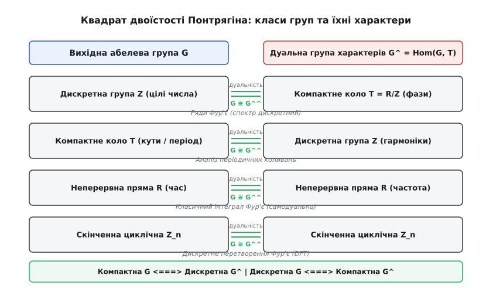
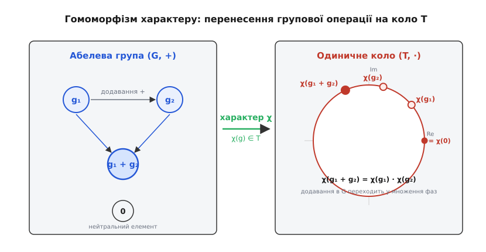
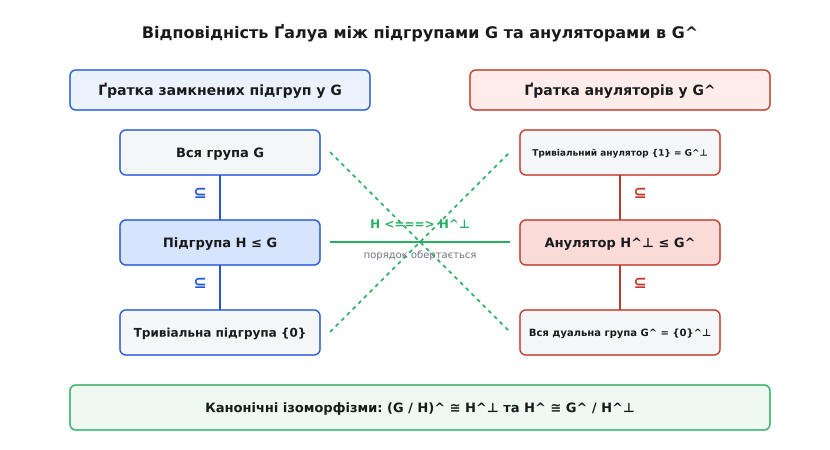
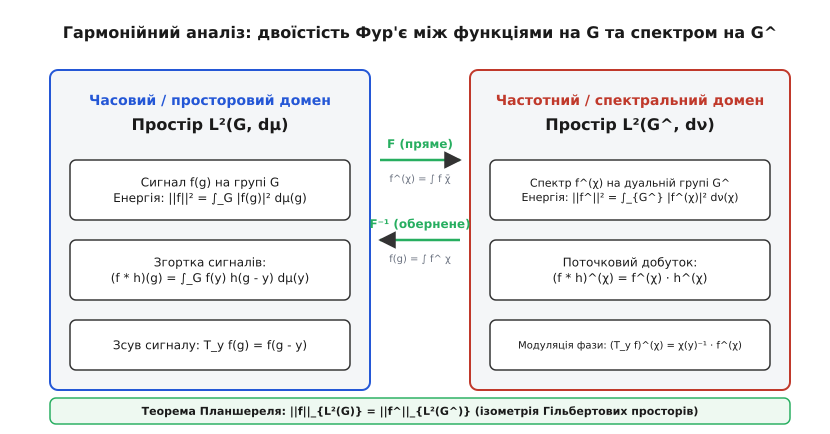

<preknowlist>
* [Групи, підгрупи й теорема Лагранжа](book:math/algebra/group-theory)
* [Дуальний простір](book:math/algebra/dual-space)
* [Характери Діріхле](book:math/number-theory/dirichlet-character)
* [Мультиплікативні й адитивні характери](book:math/number-theory/multiplicative-characters)
* [Відношення еквівалентності](book:math/logic-foundations/equivalence-relation)
</preknowlist>

# Двоїстість Понтрягіна

Коли інженер з обробки сигналів розкладає коливання звукової хвилі в неперервний інтеграл Фур'є, фізик-теоретик описує квантовий стан електрона через хвильові функції імпульсу в гільбертовому просторі, фахівець із криптографії обчислює нелінійність булевих функцій таблиць замін (S-блоків) через спектр Волша — Адамара, а математик розв'язує рівняння в простих числах за допомогою рядів Діріхле — усі вони виконують одну й ту саму математичну дію. У кожній із цих дисциплін діє однаковий набір фундаментальних законів: складний процес розкладається на суму елементарних гармонік, енергія сигналу в часовому просторі точно дорівнює сумарній енергії в спектральному просторі (теорема Парсеваля — Планшереля), а складна операція згортки двох сигналів перетворюється на звичайне поінтервальне множення їхніх частотних спектрів.

Чому такі несхожі системи — неперервний нескінченний час, дискретна ґратка цифрових відліків, періодичні коливання замкненого кола та дискретні вершини багатовимірного двійкового куба — підкоряються абсолютно ідентичним спектральним рівнянням? Відповідь дає **двоїстість Понтрягіна** — фундаментальний геометричний та алгебраїчний міст, що об'єднує топологічні абелеві групи та їхні спектри коливань у єдину гармонійну теорію.


*Спектральний квадрат двоїстості Понтрягіна: взаємні віддзеркалення між локально компактними абелевими групами та їхніми дуальними спектрами частот*

У центрі цієї теорії лежить відкриття: кожна локально компактна абелева група `G` має дзеркального двійника — **дуальну групу характерів** `Ĝ`. Будь-яка властивість початкового простору (неперервність, компактність, дискретність, наявність підгруп чи зв'язність) знаходить точне спектральне віддзеркалення в дуальній групі. Повторне взяття дуальної групи `Ĝ̂` за теоремою Понтрягіна — ван Кампена бездоганно повертає нас у вихідну структуру `G`.

Детальний аналіз історичного шляху від перших топологічних робіт Льва Понтрягіна до адельної теорії чисел викладено в історичній довідці [історичний розвиток від робіт Льва Понтрягіна та Еґберта ван Кампена до дисертації Джона Тейта](book:math/algebra/pontryagin-duality/hist-pontryagin-origins.md).

---

## 1. Топологічні абелеві групи, локальна компактність та міра Хаара

Щоб побудувати аналіз Фур'є на абстрактній структурі, суто алгебраїчних операцій додавання та віднімання недостатньо: нам необхідні поняття близькості, збіжності, границі та неперервності.

Множина `G` називається **топологічною групою**, якщо на ній задано алгебраїчну структуру групи та топологічну структуру (систему відкритих околів), причому групові операції узгоджені з топологією:
1. **Неперервність групової операції:** відображення додавання `(x, y) ↦ x + y` є неперервним відображенням із декартового добутку `G × G` у простір `G`.
2. **Неперервність взяття оберненого елемента:** відображення інверсії `x ↦ -x` є неперервним гомеоморфізмом простору `G` на себе.

Крім того, ми вимагаємо виконання аксіоми віддільності Гаусдорфа (будь-які дві різні точки мають околи, що не перетинаються).

Ключовим класом для двоїстості Понтрягіна є **локально компактні абелеві групи** (скорочено **LCA** від англійського *Locally Compact Abelian groups*). Група `G` є локально компактною, якщо кожен її елемент `g ∈ G` володіє хоча б одним компактним околом (тобто замкненим околом, з будь-якого відкритого покриття якого можна вибрати скінченне підпокриття).

### Чому локальна компактність є природною межею гармонійного аналізу?
Головна причина полягає в тому, що на будь-якій локально компактній групі існує єдина (з точністю до множення на додатний скаляр) нетривіальна борелівська міра `μ`, інваріантна щодо групових зсувів:

```
μ(x + E) = μ(E)   для будь-якого елемента x ∈ G та борелівської множини E ⊆ G
```

Ця міра називається **мірою Хаара**. Оскільки група `G` комутативна, ліва та права міри Хаара автоматично збігаються (будь-яка комутативна група є унімодулярною, тобто модулярна функція `Δ(g) ≡ 1`).
Без міри Хаара неможливо визначити інтегрування функцій на групі, простори Лебега `L¹(G)` та `L²(G)`, а також операцію групової згортки.

Розгляньмо чотири базові сімейства LCA-груп, на яких тримається весь сучасний аналіз:

1. **Неперервна дійсна пряма `(ℝ, +)`:**
   Звичайна числова пряма зі стандартною топологією евклідової відстані `d(x, y) = |x - y|`. Вона є локально компактною (відрізок `[x - ε, x + ε]` є компактним околом точки `x`), але не є компактною і не є дискретною. Мірою Хаара на `ℝ` є класична міра Лебега `dx`.

2. **Одиничне коло тора `𝕋 = ℝ/ℤ`:**
   Фактор-група дійсних чисел за підгрупою цілих чисел `ℤ`. Геометрично це коло `𝕊¹ = { z ∈ ℂ : |z| = 1 }` на комплексній площині з операцією множення комплексних чисел. Група `𝕋` є **компактною**, її елементи параметризуються фазовим кутом `θ ∈ [0, 1)`. Міра Хаара на торі є нормованою мірою довжини дуги `dθ`, де повна маса всієї групи дорівнює `μ(𝕋) = 1`.

3. **Дискретна група цілих чисел `(ℤ, +)`:**
   Множина цілих чисел із дискретною топологією (кожна окрема точка є відкритим околом). Група `ℤ` є **дискретною** та локально компактною, але не компактною. Мірою Хаара на будь-якій дискретній групі є лічильна міра `μ(A) = |A|`, а інтегрування зводиться до звичайного підсумовування ряду `∑_{n ∈ ℤ} f(n)`.

4. **Скінченні циклічні групи `ℤ_n = ℤ / nℤ` та булеві куби `ℤ₂ⁿ`:**
   Будь-яка скінченна абелева група є одночасно і **компактною**, і **дискретною**. Інтеграл Хаара є зваженою сумою `(1/|G|) ∑_{g ∈ G} f(g)`.

5. **Поле p-адичних чисел `(ℚ_p, +)`:**
   Поле `p`-адичних чисел із неархімедовою метрикою є локально компактною, повністю незв'язною абелевою групою. Її компактною відкритою підгрупою є кільце `p`-адичних цілих чисел `ℤ_p = { x ∈ ℚ_p : |x|_p ≤ 1 }`. Міра Хаара нормується умовою `μ(ℤ_p) = 1`. Завдяки двоїстості Понтрягіна, адитивна група `ℚ_p` є самодуальною: `ℚ̂_p ≅ ℚ_p`, де характери мають вигляд `χ_y(x) = exp(2π i \{x y\}_p)`, а `\{z\}_p` позначає дробову частину `p`-адичного числа.

---

## 2. Неперервні характери та універсальний фазовий резонатор

Щоб досліджувати складні структури, лінійна алгебра проектує вектори на одновимірні координатні осі за допомогою лінійних функціоналів (дуальний простір `V*`). В абстрактній теорії груп аналогом лінійних функціоналів є **характери**.

Оскільки топологічна абелева група не має операції множення на скаляр поля, чим має бути образ елементів групи? Образ повинен бути мінімальною компактною неперервною групою, здатною фіксувати фазові коливання. Такою універсальною структурою є **коло тора** `𝕋 = ℝ/ℤ ≅ 𝕊¹ ⊂ ℂ×`.

**Неперервним характером** локально компактної абелевої групи `G` називається неперервний гомоморфізм групи `G` в одиничне коло:

```
χ : G → 𝕋,   де для всіх x, y ∈ G виконується   χ(x + y) = χ(x) + χ(y) mod 1
```

У мультиплікативному записі (через комплексні числа одиничного модуля на площині) це означає:

```
χ : G → 𝕊¹,   де   χ(x + y) = χ(x) · χ(y),   |χ(x)| = 1
```


*Гомоморфізм характеру: кожен елемент топологічної групи розгортається у фазове обертання на одиничному колі тора*

Властивість гомоморфізму накладає жорсткі обмеження на значення характеру:
- Оскільки нульовий елемент групи задовольняє `0 + 0 = 0`, маємо `χ(0) = χ(0 + 0) = χ(0) · χ(0)`, звідки обов'язково `χ(0) = 1`.
- Оскільки `x + (-x) = 0`, значення характеру на протилежному елементі є оберненим комплексним числом: `χ(-x) = χ(x)⁻¹ = χ(x)̄` (комплексно спряжене значення).
- Якщо елемент `g` має скінченний порядок `n` (тобто `n · g = 0`), то `(χ(g))ⁿ = χ(n · g) = χ(0) = 1`. Значення характеру на елементах скінченного порядку можуть бути лише коренями `n`-го степеня з одиниці `exp(2π i k / n)`.

Множина всіх неперервних характерів групи `G` утворює комутативну групу щодо поточкового додавання фаз (або множення комплексних чисел):

```
(χ₁ · χ₂)(g) = χ₁(g) · χ₂(g)
```

Нейтральним елементом є **тривіальний характер** `χ₀(g) = 1` для всіх `g ∈ G`.
Оберненим до характеру `χ` є характер `χ⁻¹(g) = χ(g)̄ = χ(-g)`.

Ця група позначається символом `Ĝ` або `Hom(G, 𝕋)` і називається **дуальною групою Понтрягіна** (або групою характерів).

---

## 3. Топологія дуального простору та чотири фундаментальні дуальності

Щоб дуальна група `Ĝ` сама стала повноцінним об'єктом теорії LCA-груп, на множині її неперервних функцій необхідно задати природну топологію.

На групі `Ĝ` задають **компактно-відкриту топологію** (топологію рівномірної збіжності на всіх компактних підмножинах початкової групи `G`). Базою околів тривіального характеру `χ₀` є множини вигляду:

```
W(K, U) = { χ ∈ Ĝ : χ(K) ⊆ U }
```

де `K ⊆ G` — довільний компакт у групі `G`, а `U ⊆ 𝕋` — відкритий окіл одиниці на колі тора.

Послідовність або сітка характерів `χ_α` збігається до характеру `χ` тоді й лише тоді, коли функції `χ_α(g)` рівномірно наближаються до `χ(g)` на кожному компактному фрагменті простору `G`.

**Фундаментальна топологічна теорема:**
Якщо `G` — локально компактна гаусдорфова абелева група, то її дуальна група `Ĝ`, наділена компактно-відкритою топологією, також є локально компактною гаусдорфовою абелевою групою.

Повні математичні виведення та доведення локальної компактності `Ĝ` наведено в математичному додатку [строге топологічне виведення властивостей простору характерів та алгебри Гельфанда](book:math/algebra/pontryagin-duality/math-character-groups.md).

Розгляньмо, як виглядають дуальні групи для наших чотирьох базових систем:

### Дуальність 1: Цілі числа та неперервний тор `(ℤ̂ ≅ 𝕋)`
Шукаємо всі неперервні гомоморфізми `χ : ℤ → 𝕋`. Оскільки група `ℤ` є вільною циклічною групою з єдиним генератором `1`, гомоморфізм `χ` повністю і однозначно визначається значенням на одиниці: `χ(1) = θ ∈ 𝕋`.
Для будь-якого цілого числа `n ∈ ℤ` значення характеру обчислюється як:

```
χ_θ(n) = exp(2π · i · n · θ)
```

Кожному куту `θ ∈ 𝕋` відповідає рівно один характер, а додавання кутів відповідає множенню характерів. Компактно-відкрита топологія на `ℤ̂` збігається зі звичайною гладкою топологією кола `𝕋`.
Отже, **дуальною групою до нескінченної дискретної ґратки `ℤ` є неперервний компактний тор `𝕋`**.

### Дуальність 2: Тор та цілі числа `(𝕋̂ ≅ ℤ)`
Шукаємо всі неперервні гомоморфізми `χ : 𝕋 → 𝕋`. Кожен неперервний гомоморфізм кола в коло має вигляд обертання з цілочисельним індексом намотування `n ∈ ℤ`:

```
χ_n(θ) = exp(2π · i · n · θ)
```

Будь-яке інше неперервне відображення або не зберігає групову операцію, або розриває неперервність на замкненому контурі.
Оскільки група `𝕋` компактна, компактно-відкрита топологія на множині її характерів збігається з топологією рівномірної збіжності на всьому торі. Оскільки відстань між будь-якими двома різними характерами `||χ_n - χ_m||_∞ = 2` (при `n ≠ m`), жодні два характери не можуть лежати в малому околі один одного.
Отже, топологія на `𝕋̂` є чисто дискретною, і ми отримуємо точний ізоморфізм `𝕋̂ ≅ ℤ`.

### Дуальність 3: Самодуальність дійсної прямої `(ℝ̂ ≅ ℝ)`
Шукаємо всі неперервні гомоморфізми `χ : ℝ → 𝕋`. Неперервна функція `f(x)`, що переводить суму в добуток фаз, задовольняє класичне функціональне рівняння Коші. Єдиними неперервними розв'язками є експоненти:

```
χ_ξ(x) = exp(2π · i · x · ξ),   де   ξ ∈ ℝ
```

Число `ξ ∈ ℝ` має фізичний зміст просторової або часової **частоти**.
Відображення `ξ ↦ χ_ξ` задає алгебраїчний і топологічний ізоморфізм між дійсною числовою прямою сигналів і числовою прямою частот: `ℝ̂ ≅ ℝ`.
Дійсна пряма є **самодуальною** групою.

### Дуальність 4: Самодуальність скінченних абелевих груп `(ℤ̂_n ≅ ℤ_n)`
Для циклічної групи `ℤ_n` значення характеру на генераторі `1` має задовольняти `n · θ ≡ 0 mod 1`, тобто `θ = k / n` для `k ∈ {0, 1, ..., n-1}`:

```
χ_k(x) = exp(2π · i · x · k / n)
```

Характери нумеруються тими самими лишками `k ∈ ℤ_n`.
Будь-яка скінченна абелева група `G` ізоморфна своїй дуальній групі: `Ĝ ≅ G`.

---

## 4. Велика теорема двоїстості Понтрягіна — ван Кампена

Ми побачили, що дуалізація перетворює дискретну групу `ℤ` на компактний тор `𝕋`, а повторна дуалізація тора `𝕋̂` повертає нас назад у дискретну групу `ℤ`. Це не просто випадковий збіг на окремих прикладах: перед нами універсальний фундаментальний закон природи.

Нехай `G` — довільна локально компактна абелева група, а `Ĝ` — її дуальна група характерів.
Побудуємо **другу дуальну групу** (бідуальну групу) `Ĝ̂ = (Ĝ)^`, тобто простір неперервних характерів дуальної групи `Ĝ`.

Як пов'язані елементи вихідної групи `g ∈ G` та елементи бідуальної групи `Φ ∈ Ĝ̂`?
Зафіксуємо довільний елемент `g ∈ G`. Розглянемо функціонал **канонічного обчислення значення** (*evaluation map*) `ev_g`, який приймає на вхід характер `χ ∈ Ĝ` і повертає його значення в точці `g`:

```
ev_g : Ĝ → 𝕋,   ev_g(χ) = χ(g)
```

Перевіримо, чи є відображення `ev_g` гомоморфізмом на групі характерів `Ĝ`:

```
ev_g(χ₁ · χ₂)
  = (χ₁ · χ₂)(g)       [за означенням множення характерів]
  = χ₁(g) · χ₂(g)      [за означенням групової дії в точці g]
  = ev_g(χ₁) · ev_g(χ₂) [за означенням функціонала обчислення]
```

Оскільки компактно-відкрита топологія гарантує неперервність відображення `χ ↦ χ(g)`, функціонал `ev_g` є повноцінним неперервним характером дуальної групи `Ĝ`, тобто `ev_g ∈ Ĝ̂`.

Це дозволяє побудувати **канонічне відображення бідуальності**:

```
j_G : G → Ĝ̂,   де   (j_G(g))(χ) = χ(g)
```

```
       j_G : g  longmapsto  ev_g
       
        G  --------------------->  Ĝ̂
        |                          |
   x ∈ G|                          |ev_x ∈ Ĝ̂
        v                          v
      χ(x) <-------------------  χ ∈ Ĝ
```

### Формулювання теореми Понтрягіна — ван Кампена
Для будь-якої локально компактної гаусдорфової абелевої групи `G` канонічне відображення `j_G : G → Ĝ̂` є **топологічним ізоморфізмом** (бієктивним алгебраїчним гомоморфізмом, який є гомеоморфізмом топологічних просторів в обидва боки).

### Чому канонічність має вирішальне значення?
Для скінченних абелевих груп або дійсної прямої `ℝ` існує ізоморфізм між першою дуальною групою та вихідною групою: `G ≅ Ĝ`. Проте цей ізоморфізм **не є канонічним**: щоб ототожнити `ℤ_n` та `ℤ̂_n`, необхідно штучно вибрати генератор групи; щоб ототожнити `ℝ` та `ℝ̂`, необхідно вибрати одиницю вимірювання частоти (коефіцієнт `2π` у фазі).

На противагу цьому, ізоморфізм бідуальності `j_G : G ≅ Ĝ̂` є **абсолютно природним (канонічним)**: він не залежить від жодного людського вибору базисів, генераторів чи констант нормування. Це властивість самої структури простору.

### Структурна теорема про будову LCA-груп
Чому теорема Понтрягіна — ван Кампена справедлива для абсолютно довільної локально компактної абелевої групи? Відповідь дає **головна структурна теорема**:
Будь-яка локально компактна абелева група `G` топологічно ізоморфна прямому добутку:

```
G ≅ ℝⁿ × G₀
```

де `n ≥ 0` — ціле число, а `G₀` — локально компактна абелева група, що містить відкриту компактну підгрупу `K ⊆ G₀`.
Ця теорема зводить аналіз будь-якої нескінченновимірної або складної топологічної групи до евклідового простору `ℝⁿ` та компактно-дискретних розширень.

Мовою сучасної теорії категорій двоїстість Понтрягіна задає функтор-антиевівалентність між категорією локально компактних абелевих груп та її протилежною категорією:

```
D : LCA^op ≅ LCA,   де   D(G) = Ĝ,   D(D(G)) ≅ Id_{LCA}
```

---

## 5. Топологічні віддзеркалення та геометричний словник двоїстості

Двоїстість Понтрягіна діє як бездоганне математичне дзеркало. Будь-яка властивість топології або алгебри на лівому боці перетворюється на строго дуальну властивість на правому боці:

| Властивість групи `G` | Властивість дуальної групи `Ĝ` | Математична природа взаємозв'язку |
| :--- | :--- | :--- |
| **Компактна** | **Дискретна** | Скінченний об'єм у просторі породжує розріджений спектр гармонік |
| **Дискретна** | **Компактна** | Дискретна періодична структура породжує неперервну замкнену зону Бріллюена |
| **Скінченна** | **Скінченна** | Скінченний базис функцій |
| **Зв'язна** | **Без кручення** (*Torsion-free*) | Відсутність топологічних розривів виключає наявність періодичних елементів у спектрі |
| **Без кручення** | **Всюди щільна / Зв'язна** | Відсутність періодичностей у просторі робить фазові траєкторії всюди щільними |
| **Метризовна** | **Зліченно-породжена (зліченна база)** | Геометрична подільність простору відповідає зліченній кількості частот |

Розгляньмо глибокий фізичний зміст першого рядка таблиці: **Компактність `⟺` Дискретність**.

Якщо коливальний процес обмежений у просторі компактною областю (наприклад, струна довжини `L` або коливання на торі `𝕋`), хвилі можуть утворювати стійкі конфігурації лише на строго дискретних резонансних частотах `n ∈ ℤ`. Простір частот неминуче стає **дискретним**.
І навпаки: якщо ми дискретизуємо час із фіксованим кроком квантування `Δt` (дискретна група `ℤ`), спектр частот за теоремою Найквіста — Котельникова стає обмеженим і періодичним, утворюючи компактне коло частот `𝕋`.

### Зв'язність, компоненти та кручення
Якщо група `G` є зв'язною (як дійсна пряма `ℝ` або тор `𝕋`), у ній немає ізольованих компонент. Якщо характер `χ ∈ Ĝ` має скінченний порядок `n` (`χⁿ = 1`), його образ `χ(G)` мусить бути скінченною підмножиною коренів з одиниці в `𝕋`. Але неперервний образ зв'язного простору зобов'язаний бути зв'язним! Єдиною зв'язною скінченною множиною є єдина точка `{1}`.
Отже, будь-який елемент скінченного порядку в дуальній групі є тривіальним: **дуальна група `Ĝ` не має кручення** (*torsion-free*).

Більше того, зв'язна компонента одиниці `G₀ ⊆ G` точно визначається через підгрупу кручення дуальної групи:

```
G₀ = ( \text{tor}(Ĝ) )^⊥
```

Фактор-група за зв'язною компонентою `G / G₀` (простір компонент зв'язності) є повністю незв'язною, а її дуальна група є в точності підгрупою кручення: `(G / G₀)^ ≅ \text{tor}(Ĝ)`.

Це дає вичерпну класифікацію одновимірних зв'язних LCA-груп: будь-яка одновимірна локально компактна зв'язна абелева група топологічно ізоморфна або дійсній прямій `ℝ`, або колу тора `𝕋`.

---

## 6. Підгрупи, фактор-групи та анулятори Галуа

У лінійній алгебрі кожному підпростору `W ⊆ V` відповідає ортогональне доповнення `W^0 ⊆ V*` у дуальному просторі (анулятор функціоналів). У теорії локально компактних груп аналогічну роль відіграють **групові анулятори**.

Нехай `H` — підгрупа локально компактної абелевої групи `G`.
**Анулятором** підгрупи `H` у дуальній групі `Ĝ` називається множина всіх характерів, які тотожно обертаються в одиницю на кожному елементі підгрупи `H`:

```
H^⊥ = { χ ∈ Ĝ : χ(h) = 1 (тобто фаза 0 mod 1) для всіх h ∈ H }
```


*Відповідність Галуа: включення підгруп у прямому просторі обертається протилежним включенням ануляторів у спектральному просторі*

### Фундаментальні властивості ануляторів
1. **Замкненість:** Анулятор `H^⊥` завжди є **замкненою підгрупою** дуальної групи `Ĝ` (навіть якщо сама початкова підгрупа `H` не була замкненою).
2. **Обернення порядку (відповідність Галуа):** Якщо `H₁ ⊆ H₂`, то `H₂^⊥ ⊆ H₁^⊥`.
3. **Анулятори перетину та суми підгруп:**
   ```
   (H₁ + H₂)^⊥ = H₁^⊥ ∩ H₂^⊥
   ```
   ```
   (H₁ ∩ H₂)^⊥ = \overline{ H₁^⊥ + H₂^⊥ }   [замикання суми ануляторів]
   ```
4. **Крайові полюси:**
   - Анулятор тривіальної підгрупи `{0}` збігається з усією дуальною групою: `{0}^⊥ = Ĝ`.
   - Анулятор усієї групи `G` складається лише з тривіального характеру: `G^⊥ = {χ₀}`.
5. **Теорема про подвійний анулятор:**
   Якщо замкнути підгрупу `H` у топології групи `G`, то повторний анулятор точно збігається з топологічним замиканням підгрупи:
   ```
   (H^⊥)^⊥ = H̄
   ```
   Для будь-якої **замкненої підгрупи** `H ≤ G` маємо точну рівність: `(H^⊥)^⊥ = H`.

### Короткі точні послідовності та канонічні дуальні ізоморфізми
Для будь-якої замкненої підгрупи `H ≤ G` природна коротка точна послідовність топологічних груп:

```
0 ---> H ---> G ---> G / H ---> 0
```

під дією функтора двоїстості Понтрягіна перетворюється на спряжену коротку точну послідовність дуальних груп:

```
0 ---> (G / H)^ ---> Ĝ ---> Ĥ ---> 0
```

Це породжує два фундаментальні канонічні ізоморфізми:

```
(G / H)^ ≅ H^⊥   [характери фактор-групи — це характери G, що зануляються на H]
```

```
Ĥ ≅ Ĝ / H^⊥     [характери підгрупи H — це сліди характерів G за модулем анулятора]
```

Ці дві формули є потужним обчислювальним інструментом: замість того, щоб аналізувати складну фактор-структуру `G / H`, ми досліджуємо звичайну підгрупу `H^⊥` у дуальному просторі!

---

## 7. Повний числовий розрахунок на скінченній групі `G = ℤ₂ × ℤ₄`

Щоб побачити дію кожного символу й теореми на конкретних числах, проведемо повний покроковий розрахунок для нециклічної групи порядку 8: `G = ℤ₂ × ℤ₄`.

### Крок 1. Елементи групи та їхнє кодування
Група складається з 8 елементів — пар `x = (x₁, x₂)`, де `x₁ ∈ {0, 1}` (додавання за модулем 2), а `x₂ ∈ {0, 1, 2, 3}` (додавання за модулем 4):

```
g₀ = (0, 0),   g₁ = (0, 1),   g₂ = (0, 2),   g₃ = (0, 3)
g₄ = (1, 0),   g₅ = (1, 1),   g₆ = (1, 2),   g₇ = (1, 3)
```

### Крок 2. Побудова аналітичного виразу для характерів
Кожен характер `χ_y ∈ Ĝ` параметризується парою частотних індексів `y = (y₁, y₂) ∈ ℤ₂ × ℤ₄`.
Значення характеру `χ_{(y₁, y₂)}` на елементі `(x₁, x₂)` обчислюється як добуток фаз:

```
χ_{(y₁, y₂)}(x₁, x₂) = exp( 2π · i · ( (x₁ · y₁ / 2) + (x₂ · y₂ / 4) ) )
```

Позначимо первісний корінь четвертого степеня з одиниці через `i = exp(2π i / 4) = exp(i π / 2)`.
Тоді `exp(2π i · (1/2)) = exp(i π) = -1 = i²`, `exp(2π i · (3/4)) = -i = i³`.

### Крок 3. Таблиця значень усіх 8 характерів (Матриця Фур'є `8 × 8`)
Обчислимо значення кожного характеру на кожному елементі групи:

| Елемент `x` | `χ_{0,0}` | `χ_{0,1}` | `χ_{0,2}` | `χ_{0,3}` | `χ_{1,0}` | `χ_{1,1}` | `χ_{1,2}` | `χ_{1,3}` |
| :---: | :---: | :---: | :---: | :---: | :---: | :---: | :---: | :---: |
| **(0, 0)** | `+1` | `+1` | `+1` | `+1` | `+1` | `+1` | `+1` | `+1` |
| **(0, 1)** | `+1` | `+i` | `-1` | `-i` | `+1` | `+i` | `-1` | `-i` |
| **(0, 2)** | `+1` | `-1` | `+1` | `-1` | `+1` | `-1` | `+1` | `-1` |
| **(0, 3)** | `+1` | `-i` | `-1` | `+i` | `+1` | `-i` | `-1` | `+i` |
| **(1, 0)** | `+1` | `+1` | `+1` | `+1` | `-1` | `-1` | `-1` | `-1` |
| **(1, 1)** | `+1` | `+i` | `-1` | `-i` | `-1` | `-i` | `+1` | `+i` |
| **(1, 2)** | `+1` | `-1` | `+1` | `-1` | `-1` | `+1` | `-1` | `+1` |
| **(1, 3)** | `+1` | `-i` | `-1` | `+i` | `-1` | `+i` | `+1` | `-i` |

### Крок 4. Перевірка ортогональності характерів
Перевіримо скалярний добуток двох різних стовпчиків таблиці, наприклад `χ_{0,1}` та `χ_{1,1}`:

```
⟨χ_{0,1}, χ_{1,1}⟩
  = ∑_{x ∈ G} χ_{0,1}(x) · χ_{1,1}(x)̄
  = (1 · 1) + (i · (-i)) + (-1 · (-1)) + (-i · i)
    + (1 · (-1)) + (i · i) + (-1 · 1) + (-i · (-i))
  = (1 + 1 + 1 + 1) + (-1 - 1 - 1 - 1)
  = 4 - 4 = 0   [характери абсолютно ортогональні!]
```

### Крок 5. Знаходження анулятора підгрупи
Розглянемо підгрупу `H = { (0, 0), (0, 2) } ≤ G`. Це циклічна підгрупа порядку `|H| = 2`.
Знайдемо її анулятор `H^⊥ ⊆ Ĝ`. Характер `χ_{y₁, y₂}` належить `H^⊥` тоді й лише тоді, коли його значення на генераторі `(0, 2)` дорівнює `+1`:

```
χ_{y₁, y₂}(0, 2) = exp( 2π · i · ( (0 · y₁ / 2) + (2 · y₂ / 4) ) ) = exp( i · π · y₂ ) = (-1)^{y₂} = 1
```

Рівність `(-1)^{y₂} = 1` виконується тоді й лише тоді, коли `y₂` є парним числом, тобто `y₂ ∈ {0, 2}`.
Частотний індекс `y₁` може бути довільним: `y₁ ∈ {0, 1}`.
Отримуємо рівно 4 характери, що утворюють анулятор `H^⊥`:

```
H^⊥ = { χ_{0,0}, χ_{0,2}, χ_{1,0}, χ_{1,2} }
```

Перевіримо порядки та ізоморфізми:
- Порядок анулятора: `|H^⊥| = 4`. За теоремою Лагранжа: `|H| · |H^⊥| = 2 · 4 = 8 = |G|`.
- Всі елементи `H^⊥` мають порядок 2: `(χ_{0,2})² = χ_{0,0}`, `(χ_{1,0})² = χ_{0,0}`, `(χ_{1,2})² = χ_{0,0}`.
- Отже, анулятор `H^⊥` ізоморфний четвірній групі Клейна: `H^⊥ ≅ ℤ₂ × ℤ₂`.
- Фактор-група: `G / H = (ℤ₂ × ℤ₄) / ({0} × 2ℤ₄) ≅ ℤ₂ × ℤ₂`.
- Її дуальна група: `(G / H)^ ≅ (ℤ₂ × ℤ₂)^ ≅ ℤ₂ × ℤ₂ ≅ H^⊥`.

### Крок 6. Подвійна перевірка на другій підгрупі та ґратці Галуа
Розглянемо тепер іншу підгрупу `K = { (0, 0), (1, 0) } ≤ G` (порядку 2).
Характер `χ_{y₁, y₂}` належить `K^⊥` тоді й лише тоді, коли `χ_{y₁, y₂}(1, 0) = exp(2π i (1 · y₁ / 2)) = (-1)^{y₁} = 1`, тобто `y₁ = 0`.
Отримуємо анулятор: `K^⊥ = { χ_{0,0}, χ_{0,1}, χ_{0,2}, χ_{0,3} } ≅ ℤ₄`.

Перевіримо перетин та суму підгруп:
- Перетин: `H ∩ K = { (0, 0) }`.
- Його анулятор: `(H ∩ K)^⊥ = Ĝ` (усі 8 елементів).
- Сума ануляторів: `H^⊥ + K^⊥ = { χ_{0,0}, χ_{0,2}, χ_{1,0}, χ_{1,2} } + { χ_{0,0}, χ_{0,1}, χ_{0,2}, χ_{0,3} } = Ĝ`.
- Сума підгруп: `H + K = { (0, 0), (0, 2), (1, 0), (1, 2) } ≅ ℤ₂ × ℤ₂`.
- Її анулятор: `(H + K)^⊥ = H^⊥ ∩ K^⊥ = { χ_{0,0}, χ_{0,2} } ≅ ℤ₂`.
Ґраткова відповідність Галуа виконується з абсолютною точністю!

---

## 8. Абстрактне перетворення Фур'є та унітарний операторний міст

Маючи в руках поняття характерів та міри Хаара, ми можемо записати єдину формулу перетворення Фур'є для всіх локально компактних абелевих груп одночасно.

Нехай `f ∈ L¹(G)` — інтегровна комплекснозначна функція на LCA-групі `G`.
**Абстрактним перетворенням Фур'є** функції `f` називається функція `f̂ = \mathcal{F}(f)` на дуальній групі `Ĝ`, визначена інтегралом:

```
f̂(χ) = ∫_G f(x) · χ(x)̄ \, dμ(x)
```

де `χ(x)̄ = χ(-x)` — комплексно спряжене значення характеру, а `dμ` — міра Хаара на групі `G`.


*Операторний ізоморфізм: перетворення Фур'є здійснює унітарне відображення простору сигналів L²(G) на простір спектрів L²(Ĝ)*

### Головні теореми гармонійного аналізу на LCA-групах

1. **Теорема Рімана — Лебега:**
   Для будь-якої функції `f ∈ L¹(G)` її образ Фур'є `f̂` є неперервною функцією на дуальній групі `Ĝ`, яка прямує до нуля на нескінченності: `f̂ ∈ C₀(Ĝ)`.

2. **Теорема про групову згортку:**
   Групова згортка двох функцій визначається як:
   ```
   (f * h)(x) = ∫_G f(y) · h(x - y) \, dμ(y)
   ```
   Перетворення Фур'є переводить важку інтегральну згортку у звичайне поточкове множення спектрів:
   ```
   \mathcal{F}(f * h)(χ)
     = ∫_G ( ∫_G f(y) · h(x - y) \, dμ(y) ) · χ(x)̄ \, dμ(x)  [за означенням згортки]
     = ∫_G f(y) · ( ∫_G h(x - y) · χ(x)̄ \, dμ(x) ) \, dμ(y)  [теорема Фубіні]
     = ∫_G f(y) · ( ∫_G h(z) · χ(y + z)̄ \, dμ(z) ) \, dμ(y)   [зміна змінних z = x - y]
     = ∫_G f(y) · χ(y)̄ \, dμ(y) · ∫_G h(z) · χ(z)̄ \, dμ(z)   [гомоморфізм характеру]
     = f̂(χ) · ĥ(χ)
   ```

3. **Теорема Бохнера про додатньо визначені функції:**
   Неперервна комплекснозначна функція `φ` на групі `G` є додатно визначеною (тобто матриця `[φ(x_j - x_k)]` є невід'ємно ермітовою для будь-якого набору точок) тоді й лише тоді, коли вона є перетворенням Фур'є скінченної додатньої борелівської міри `ν` на дуальній групі `Ĝ`:
   ```
   φ(x) = ∫_{Ĝ} χ(x) \, dν(χ)
   ```
   Теорема Бохнера є теоретичним серцем спектрального аналізу випадкових процесів (теорема Вінера — Хінчина).

4. **Теорема про обернення Фур'є:**
   Якщо `f ∈ L¹(G)` і `f̂ ∈ L¹(Ĝ)`, то початкова функція майже скрізь відновлюється інтегруванням по дуальній групі з відповідною дуальною мірою Хаара `dμ̂`:
   ```
   f(x) = ∫_{Ĝ} f̂(χ) · χ(x) \, dμ̂(χ)
   ```

5. **Унітарна теорема Планшереля:**
   Оператор перетворення Фур'є `\mathcal{F}`, визначений на щільному підпросторі `L¹(G) ∩ L²(G)`, однозначно продовжується до **унітарного ізоморфізму** гільбертових просторів:
   ```
   \mathcal{F} : L²(G, dμ) \xrightarrow{\cong} L²(Ĝ, dμ̂)
   ```
   При цьому зберігається повна енергія (скалярний добуток):
   ```
   ∫_G |f(x)|² \, dμ(x) = ∫_{Ĝ} |f̂(χ)|² \, dμ̂(χ)
   ```

6. **Узагальнена формула підсумовування Пуассона:**
   Нехай `H ≤ G` — замкнена підгрупа в LCA-групі `G`, а `H^⊥ ≤ Ĝ` — її анулятор. За відповідного узгодження мір Хаара на групі, підгрупі та фактор-групі, для будь-якої гладкої швидкоспадної функції `f` виконується тотожність:
   ```
   ∫_H f(h) \, dμ_H(h) = ∫_{H^⊥} f̂(χ) \, dμ_{H^⊥}(χ)
   ```
   Для часткового випадку `G = ℝ`, `H = ℤ` (де `ℤ^⊥ ≅ ℤ`) ця формула перетворюється на класичну формулу Пуассона:
   ```
   ∑_{n ∈ ℤ} f(n) = ∑_{k ∈ ℤ} f̂(k)
   ```
   Застосування цієї формули до гауссової функції `f(x) = exp(-π t x²)` миттєво дає фундаментальне модулярне рівняння Якобі для тета-функції:
   ```
   θ(1 / t) = √t · θ(t),   де   θ(t) = ∑_{n ∈ ℤ} exp(-π t n²)
   ```
   яке є ключем до аналітичного продовження дзета-функції Рімана на всю комплексну площину.

7. **Принцип невизначеності Гейзенберга — Донохо — Старка на LCA-групах:**
   Для будь-якої ненульової функції `f ∈ L²(G)` її носій `\text{supp}(f) ⊆ G` та носій її образу Фур'є `\text{supp}(f̂) ⊆ Ĝ` не можуть бути одночасно занадто малими щодо відповідних мір Хаара:
   ```
   μ( \text{supp}(f) ) · μ̂( \text{supp}(f̂) ) ≥ 1
   ```
   Для скінченних абелевих груп ця нерівність набуває дискретного вигляду: `| \text{supp}(f) | · | \text{supp}(f̂) | ≥ |G|`. Чим сильніше сигнал локалізований у координатному просторі, тим ширшим є його спектральний розкид у просторі частот.

Практичні алгоритми обчислення GDFT, групової згортки та знаходження ануляторів на мовах C та C++ детально розібрано в проекті [чисельна реалізація алгоритмів GDFT та пошуку ануляторів мовами C та C++](book:math/algebra/pontryagin-duality/proj-fourier-dual-groups.md).

---

## 9. Єдиний спектральний атлас: зведення чотирьох світів Фур'є

Тепер ми можемо звести всі класичні форми гармонійного аналізу в єдину струнку таблицю, яка показує, що всі розділи класичної вищої математики та інженерної обробки сигналів є лише різними рядками єдиної теореми Понтрягіна:

| Тип аналізу | Група сигналів `G` | Дуальна група `Ĝ` | Пряме перетворення Фур'є `f̂(χ)` | Обернене перетворення `f(x)` |
| :--- | :---: | :---: | :--- | :--- |
| **Неперервне перетворення Фур'є** | `ℝ` (неперервна, некомпактна) | `ℝ` (неперервна, некомпактна) | `∫_{-∞}^{+∞} f(t) e^{-2π i t ξ} dt` | `∫_{-∞}^{+∞} f̂(ξ) e^{+2π i t ξ} dξ` |
| **Класичні ряди Фур'є** | `𝕋 = ℝ/ℤ` (компактна) | `ℤ` (дискретна) | `c_n = ∫₀¹ f(t) e^{-2π i n t} dt` | `∑_{n=-∞}^{+∞} c_n e^{+2π i n t}` |
| **Дискретне за часом перетворення (DTFT)** | `ℤ` (дискретна) | `𝕋 = ℝ/ℤ` (компактна) | `X(ω) = ∑_{n=-∞}^{+∞} x[n] e^{-2π i n ω}` | `∫₀¹ X(ω) e^{+2π i n ω} dω` |
| **Дискретне перетворення Фур'є (DFT / FFT)** | `ℤ_N` (скінченна циклічна) | `ℤ_N` (скінченна циклічна) | `X[k] = ∑_{n=0}^{N-1} x[n] e^{-2π i n k / N}` | `\frac{1}{N} ∑_{k=0}^{N-1} X[k] e^{+2π i n k / N}` |
| **Перетворення Волша — Адамара (FWHT)** | `ℤ₂ⁿ` (булів куб) | `ℤ₂ⁿ` (булів куб) | `W[y] = ∑_{x ∈ ℤ₂ⁿ} f(x) (-1)^{x · y}` | `\frac{1}{2ⁿ} ∑_{y ∈ ℤ₂ⁿ} W[y] (-1)^{x · y}` |

---

## 10. Межі теорії: неабелеві групи, квантові структури та сучасні горизонти

Чому двоїстість Понтрягіна сформульована саме для **абелевих** (комутативних) груп, і що відбувається, коли група стає некомутативною?

Якщо група `G` некомутативна (наприклад, група обертань тривимірного простору `SO(3)` або загальна лінійна група матриць `GL_n(ℝ)`), одновимірних характерів зі значеннями в `𝕋` стає катастрофічно замало для відновлення структури групи. Наприклад, для простої некомутативної групи єдиним гомоморфізмом у коло `𝕋` є константа `χ(g) = 1`, тобто одновимірна дуальна група є тривіальною: `Ĝ = {1}`.

Щоб подолати це обмеження, математики розробили узагальнення двоїстості для неабелевих структур:

1. **Теорія представлень та теорема Петера — Вейля:**
   Для компактних некомутативних груп роль одновимірних характерів перебирають на себе матричні елементи **незвідних унітарних представлень** вищих розмірностей `ρ : G → U(n)`. Простір функцій `L²(G)` розкладається в пряму суму матричних блоків, пропорційних квадратам розмірностей представлень.

2. **Двоїстість Таннаки — Крейна:**
   Дозволяє повністю відновити довільну компактну неабелеву групу за категорією її скінченновимірних представлень, наділеною операцією тензорного добутку. Дуальним об'єктом стає не група, а ціла моноідальна категорія модулів!

3. **Квантові групи та алгебри Хопфа:**
   Двоїстість між комутативними алгебрами функцій на групі `C(G)` та кокомутативними алгебрами операторів розширюється на повністю некомутативні й некокомутативні простори квантової геометрії, започаткованої роботами Алена Конна та Володимира Дрінфельда.

4. **Теорія полів класів та закон взаємності Артіна:**
   У глобальній алгебраїчній теорії чисел максимальна абелева група Галуа `\text{Gal}(K^{ab} / K)` є проскінченною компактною групою. Закон взаємності Артіна встановлює топологічний канонічний ізоморфізм між цією групою Галуа та дуальною структурою групи класів іделів числового поля `C_K = \mathbb{A}_K^\times / K^\times`. Одновимірні характери групи Галуа відповідають неперервним характерам іделів (характерам Гекке).

5. **Адельний гармонійний аналіз та дисертація Джона Тейта (1950):**
   У дисертації Джона Тейта двоїстість Понтрягіна отримала тріумфальне втілення для топологічної групи **кільця аделів** `\mathbb{A}_K` числового поля (структури, що одночасно об'єднує дійсну пряму `ℝ`, комплексні площини `ℂ` та всі `p`-адичні поля `ℚ_p`).
   Діючи за узагальненою формулою підсумовування Пуассона на адельній групі, Тейт отримав аналітичне продовження та функціональне рівняння для дзета-функції Рімана та всіх L-функцій Гекке єдиним елегантним гармонійним інтегруванням, заклавши надійний фундамент сучасної програми Ленглендса.

Двоїстість Понтрягіна перетворила фрагментарний набір обчислювальних інженерних методів на величну математичну панораму, довівши, що простір і спектр, геометрія і гармонія, форма і коливання — це лише два різні погляди на одну й ту саму досконалу істину.
