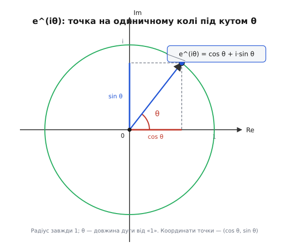
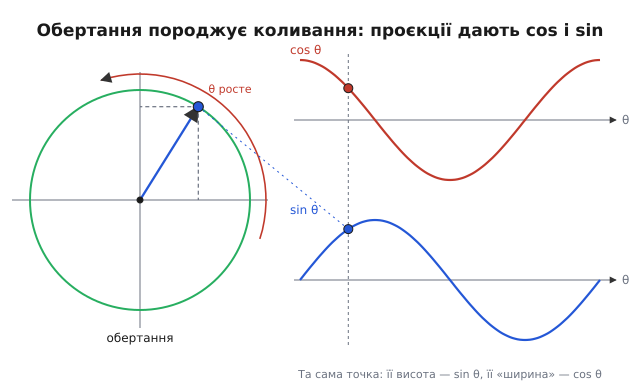
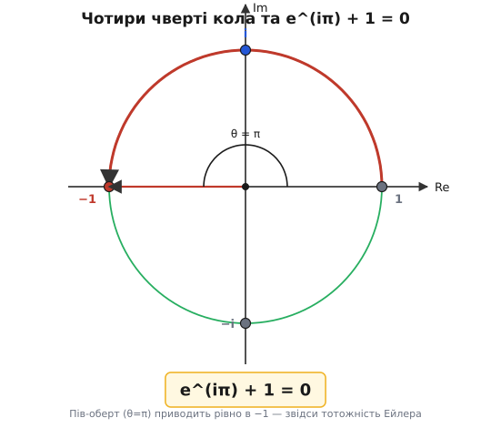

# Формула Ейлера

Є рівність, яку часто називають найкрасивішою в математиці: вона зв'язує степінь, синус і косинус одним коротким рядком —

```
e^(iθ) = cos θ + i·sin θ
```

Зліва — піднесення числа e до уявного степеня. Справа — звичайна тригонометрія, та сама, що описує коливання маятника й змінний струм у розетці. На перший погляд ці два світи не мають спільного: e виростає з відсотків і неперервного росту, синус — з кола й кутів. То чому раптом експонента, та ще й з уявним показником, обертається тригонометрією? Якщо дійти до причини, видно, що інакше й бути не могло — і тоді формула з фокуса перетворюється на очевидність.

## Що взагалі означає «уявний степінь»

Спершу чесно зізнаймося: запис e^(iθ) поки не має сенсу. Піднести число до степеня 3 — помножити його тричі само на себе. До степеня ½ — взяти корінь. А до степеня i, де i — уявна одиниця (англ. *imaginary unit*, від лат. *imaginarius* — несправжній, бо колись такі числа вважали фікцією), число i таке, що i² = −1? Помножити щось «i разів» неможливо уявити прямо. Отже, ліва частина рівності — не очевидна дія, а **визначення, яке ще треба дати так, щоб воно було розумним**.

Розумне визначення не береться зі стелі. Воно мусить зберегти ті властивості звичайної експоненти, заради яких ми взагалі її цінуємо. Найголовніша з них одна:

```
e^(a+b) = e^a · e^b
```

Степені складаються — добуток перетворюється на суму показників. Якщо ми хочемо розширити e^x на уявні x і не зламати математику, ця властивість має лишитися. І ще одна вимога, тонша, але вирішальна: у точці нуль усе має зійтися з відомим, e⁰ = 1, а «швидкість росту» експоненти в кожній точці дорівнює їй самій. Саме ця друга властивість — що похідна eˣ дорівнює самій eˣ — і робить e особливим серед усіх основ степеня. Тримаймо обидві вимоги в голові: вони, як виявиться, повністю диктують відповідь.

## Комплексне число — це стрілка на площині

Щоб побачити, куди веде уявний степінь, корисно перестати думати про комплексні числа як про «дивні числа з буквою i» і почати бачити в них **точки площини**. Число a + b·i — це точка з координатами (a, b): a відкладаємо вправо по дійсній осі (англ. *real*), b — вгору по уявній (англ. *imaginary*). Звичайні числа лежать на горизонтальній осі; i = 0 + 1·i — це точка на висоті 1 просто над нулем.

Така картинка — не просто зручна ілюстрація. Вона змінює сенс множення. Помножити на дійсне число — розтягнути стрілку від початку: множення на 2 подвоює довжину, на ½ — стискає вдвічі. А помножити на i? Візьмемо точку 1 (стрілка вправо) і помножимо на i — отримаємо i (стрілка вгору). Помножимо ще раз на i: i·i = −1 (стрілка вліво). Ще раз: −i (стрілка вниз). Ще раз — і ми знову в 1.

```
1  →·i→  i  →·i→  −1  →·i→  −i  →·i→  1
вправо   вгору    вліво     вниз    вправо
```

Кожне множення на i повернуло стрілку рівно на чверть кола — на 90° проти годинникової стрілки. Це і є **головне відкриття**: множення на i — не загадкова арифметика, а **поворот на прямий кут**. А множення на −1 (тобто двічі на i) — поворот на 180°, розворот. Уявна одиниця живе на площині не як число, а як обертання.

> 🔧 **Навіщо це.** У радіотехніці й обробці сигналів величину з амплітудою та фазою (напругу, струм, гармоніку) зображають саме комплексним числом-стрілкою — [фазором](book:math/phasors). Тоді зсув фази на чверть періоду — це просто множення на i, а складання двох сигналів — складання стрілок. Уся незручна тригонометрія коливань перетворюється на арифметику точок площини.

## Чому показник тягне точку вздовж кола

Тепер з'єднаймо дві думки: степені складаються, а множення на уявне — це поворот. Подивімося, як точка e^(iθ) має рухатися, коли θ повзе від нуля вгору.

Почнімо з θ = 0. Тут e⁰ = 1 — стрілка лежить вправо, довжина 1. А що станеться при крихітному прирості θ? Скористаймося другою вимогою — тим, що похідна експоненти дорівнює їй самій. Для e^(iθ) похідна за θ виносить множник i:

```
d
── e^(iθ) = i · e^(iθ)
dθ
```

Прочитаймо це геометрично, бо тут уся суть. Похідна — це **швидкість руху точки**: куди й як швидко вона зміщується при зміні θ. Рівність каже, що ця швидкість дорівнює самій точці e^(iθ), **помноженій на i**. А множення на i ми щойно впізнали — це поворот на 90°. Отже:

> у кожен момент точка рухається в напрямку, **перпендикулярному** до своєї ж стрілки від початку.

Уявіть камінь на мотузці, який ви розкрутили над головою. Натяг мотузки тримає камінь на сталій відстані, а летить камінь завжди вбік — упоперек мотузки. Точно так само поводиться наша точка: її «швидкість» завжди під прямим кутом до радіуса. Рух, у якому швидкість завжди перпендикулярна до радіуса, лишає довжину радіуса незмінною — а це і є рух по колу зі сталим радіусом. Бо щоб віддалитися від центра, треба мати бодай якусь складову швидкості **вздовж** радіуса; її тут немає рівно ніколи.

Радіус не міняється — а починали ми з довжини 1. Значить, **уся дорога точки e^(iθ) — це одиничне коло**, коло радіуса 1 з центром у нулі. Показник θ не роздуває й не стискає стрілку; він лише **котить її по колу**.

Лишилося з'ясувати, **наскільки далеко** котить. Швидкість руху за модулем дорівнює |i · e^(iθ)| = 1 · 1 = 1: точка біжить по колу з одиничною швидкістю. А коли по колу одиничного радіуса рухаються з одиничною швидкістю, то за «час» θ проходять дугу завдовжки рівно θ. Отже θ — це **довжина пройденої дуги**, тобто, за означенням радіанної міри, сам **кут** повороту від додатної дійсної осі. Камінь на мотузці зробив поворот на кут θ — не більше й не менше.


*Стрілка від нуля до точки e^(iθ) має сталу довжину 1 і повернута на кут θ від додатної дійсної осі. Кут θ дорівнює довжині дуги, пройденої від точки «1». Проєкція точки на горизонтальну вісь дає cos θ, на вертикальну — sin θ.*

## Звідки беруться синус і косинус

Ми вже знаємо все потрібне, щоб дописати рівність. Точка e^(iθ) лежить на одиничному колі під кутом θ. А як знайти координати точки на одиничному колі, якщо відомий кут? Це і є **означення** косинуса й синуса — їх так і вводять через коло (лат. *sinus* — затока, вигин: середньовічний переклад через арабське посередництво плутаного шляху від санскритського слова про півхорду; лат. *cosinus* — «синус доповнення», синус додаткового кута). Горизонтальна координата точки на одиничному колі під кутом θ — це за визначенням cos θ; вертикальна — sin θ.

Стрілка з координатами (cos θ, sin θ) — це, мовою комплексних чисел, точка cos θ + i·sin θ. Але та сама стрілка — це наша e^(iθ). Дві назви одного:

```
e^(iθ) = cos θ + i·sin θ
```

Формула Ейлера доведена — не підстановкою, а по суті. Ліва частина за визначенням крутить одиничну стрілку на кут θ; права записує координати тієї самої стрілки через косинус і синус. Рівність неминуча, щойно ми побачили, що уявний степінь — це обертання.

Можна перевірити її на кутах, які знаємо напам'ять. При θ = 0: e⁰ = cos 0 + i·sin 0 = 1 + 0 = 1 — стрілка вправо, усе сходиться. При θ = π/2 (чверть кола): e^(iπ/2) = cos 90° + i·sin 90° = 0 + i·1 = i — стрілка вгору, рівно те, що дало одне множення на i. Геометрія й формула розповідають одну історію.

Сам зв'язок відкрили не одразу й не наочно. Перший його запис залишив англійський математик Роджер Котс (Roger Cotes) 1714 року — у логарифмічній формі, ln(cos x + i·sin x) = ix, у праці «Logometria». Це те саме співвідношення, лише вивернуте: логарифм — обернена дія до степеня. У звичному вигляді, e^(ix) = cos x + i·sin x, його подав і ввів у широкий ужиток швейцарський математик Леонард Ейлер (Leonhard Euler) у книзі «Introductio in analysin infinitorum» (1748). Ейлер дійшов рівності не через геометрію обертання, а порівнявши нескінченні ряди обох частин: розклади e^(ix), cos x та sin x у суми степенів збіглися член у член. Геометричний погляд, з якого ми її тут вивели, — пізніше осмислення тієї самої істини.

## Косинус і синус — це «тінь» обертання

З формули випадає погляд на тригонометрію, який багато що пояснює наперед. Перепишімо її, виокремивши дійсну й уявну частини стрілки e^(iθ):

```
cos θ = Re( e^(iθ) )    ← горизонтальна тінь точки
sin θ = Im( e^(iθ) )    ← вертикальна тінь точки
```

Коли точка рівномірно біжить колом, її горизонтальна координата гойдається туди-сюди між −1 і 1 — це косинус; вертикальна гойдається так само, але із запізненням на чверть кола — це синус. Косинус і синус — **дві тіні (проєкції) одного рівномірного обертання** на дві осі. Не дві окремі загадкові хвилі, а один обертовий рух, побачений з двох боків.


*Ліворуч точка рівномірно обходить коло. Праворуч — її горизонтальна координата вздовж θ викреслює косинус, вертикальна — синус. Одне обертання породжує обидві хвилі; синус відстає від косинуса рівно на чверть кола.*

Звідси одразу видно те, що в шкільній тригонометрії доводять окремими викладками. Чому cos²θ + sin²θ = 1? Бо це теорема Піфагора для стрілки сталої довжини 1: квадрат горизонтальної координати плюс квадрат вертикальної дорівнює квадрату довжини. Чому синус — це косинус, зсунутий на 90°? Бо вертикальна тінь відстає від горизонтальної рівно на чверть оберту. Десятки тригонометричних тотожностей — це властивості обертання, записані в координатах.

> 🔧 **Навіщо це.** Найкоротший спосіб згенерувати чистий синус у прошивці — крутити точку по колу й брати її проєкцію. Замість щоразу кликати важку функцію sin() мікроконтролер на кожному кроці повертає внутрішню стрілку на малий кут (комплексне множення — кілька множень і додавань) і віддає її дійсну частину. Виходить цифровий генератор коливань — основа синтезу тонів і несівних частот.

## Чому це різко спрощує опис коливань і змінного струму

Тепер — головна практична вигода, заради якої формулу так люблять інженери. Будь-яке гармонічне коливання — напруга в мережі, звукова хвиля, гойдання маятника — описують косинусом або синусом від часу: наприклад, U(t) = U₀·cos(ωt + φ), де ω — кутова частота (як швидко крутиться), а φ — початкова фаза (де стрілка стояла на старті). Працювати з такими виразами напряму марудно: щоб додати два коливання однієї частоти, доводиться згадувати формули суми косинусів, мучитися з кутами.

Формула Ейлера прибирає цю морку. Замість косинуса беремо обертову стрілку e^(i(ωt+φ)) — а косинус повертаємо в кінці як її дійсну частину. Чому це легше? Бо тепер фаза й амплітуда ховаються в **множник**, а не в аргумент тригонометрії:

```
U₀ · e^(i(ωt + φ)) = U₀ · e^(iφ) · e^(iωt)
```

Множник e^(iωt) — спільне «обертання часу», однакове для всіх коливань однієї частоти. А все, чим коливання відрізняються — амплітуда U₀ і фаза φ, — сидить у сталому комплексному числі U₀·e^(iφ). Це число (стрілка з потрібною довжиною й напрямком) і називають [фазором](book:math/phasors). Додати два коливання однієї частоти — тепер просто **скласти дві стрілки** як вектори й помножити результат на спільне e^(iωt). Жодних формул суми кутів: складання обертань звелося до складання нерухомих стрілок.

Ще різкіше виграє похідна. Продиференціювати cos(ωt + φ) — треба пам'ятати, що косинус переходить у мінус синус, стежити за знаком. А похідна обертової стрілки тривіальна:

```
d
── e^(iωt) = iω · e^(iωt)
dt
```

Диференціювання за часом перетворилося на **множення на iω**. Це не дрібна зручність, а зрушення мови: складна операція аналізу (взяти похідну) стала простою операцією алгебри (домножити на число). Саме на цьому стоїть увесь розрахунок електричних кіл змінного струму — [імпеданс](book:math/impedance), реактивний опір котушки й конденсатора виводяться з того, що похідна обертається множенням на iω. І ширше: для лінійних систем перехід «похідна → множник iω» обертає диференціальні рівняння на алгебраїчні — фундамент частотного аналізу й [перетворення Фур'є](book:math/fourier-idea).

## Найкрасивіша рівність як простий наслідок

Лишилося пройти колом ще трохи й побачити рівність, яку часто називають вершиною математики. Поведімо стрілку не на чверть кола, а на **пів-кола** — поставмо θ = π (число π — це довжина півкола одиничного радіуса, тобто кут 180° у радіанах). Стрілка, що стояла вправо в точці 1, повернеться рівно на 180° і вкаже вліво — у точку −1. Підставмо в формулу:

```
e^(iπ) = cos π + i·sin π = cos 180° + i·sin 180° = −1 + i·0 = −1
```

Отже e^(iπ) = −1. Перенесімо одиницю ліворуч — і отримаємо **тотожність Ейлера**:

```
e^(iπ) + 1 = 0
```


*Кутам 0, π/2, π, 3π/2 відповідають точки 1, i, −1, −i. Поворот на пів-кола (θ = π) приводить стрілку рівно в −1, звідки e^(iπ) + 1 = 0.*

Її цінують за те, що в одному короткому рядку, без жодного зайвого символу, зустрілися п'ять найважливіших чисел математики, кожне зі свого світу: 0 (нейтральне для додавання), 1 (нейтральне для множення), π (з геометрії кола), e (з аналізу й неперервного росту) та i (з алгебри, корінь з −1). Вони ніколи не домовлялися зустрітись — а опинилися пов'язані однією рівністю. Та краса тут не самоціль: тотожність не вигадана й не підігнана, вона **просто фіксує, що пів-оберт одиничної стрілки приводить її в −1**. Уся глибока на вигляд рівність — це коротка фраза «повернути вліво — значить опинитися в мінус одиниці», сказана мовою степенів.

І в цьому весь урок формули Ейлера. Зв'язок експоненти з тригонометрією не випадковий і не штучний: щойно ми погодилися, що уявний степінь має зберегти головні властивості звичайного, він **змушений** означати обертання — а обертання, побачене в координатах, і є косинус із синусом. Те, що здавалося мостом між двома далекими берегами, виявилося двома назвами одного й того самого руху стрілки по колу.
