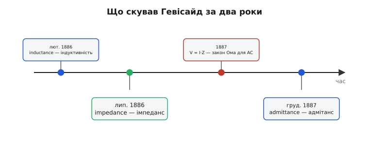
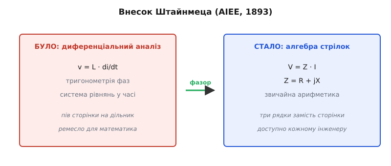

# 📜 Як народився імпеданс: Гевісайд і Штайнмец

Поняття, яке сьогодні поміщається в один рядок — `Z = R + jX` — народжувалося двадцять років і коштувало двом людям майже всього. Один був глухий самоук, що жив самітником і писав статті мовою, якої академіки не могли читати; другий — горбатий емігрант-соціаліст, який утік від поліції й приїхав до Америки з кількома доларами в кишені. Перший **скував саме слово** і зрозумів, що «опір» на змінному струмі — то комплексне число. Другий перетворив цю здогадку на **робочий інструмент**, яким відтоді користується кожен інженер. Ця історія варта того, щоб її знати, бо вона пояснює, **чому** імпеданс виглядає саме так — і чому в електриці пишуть `j`, а не `i`.

## Що бентежило: змінний струм не давався в руки

Спершу треба відчути проблему, з якою все почалося, інакше геніальність розв'язку лишиться непомітною.

У 1880-х світ стрімко переходив на змінний струм. Постійний струм програв «війну струмів»: тільки змінний можна було підняти трансформатором до високої напруги, передати на десятки кілометрів тонким дротом і знизити назад біля споживача. Будувалися перші великі електростанції, тяглися лінії, ставилися двигуни змінного струму. Інженерія неслася вперед — а математика, якою її описували, лишалася жахливою.

Проблема ось у чому. На постійному струмі все просто: [закон Ома](topic:electronics/ohms-law) каже I = V/R, і весь розрахунок будь-якого кола — додавання й ділення чисел. Але щойно струм став синусоїдою, у колах із котушками й конденсаторами напруга й струм перестали крокувати в ногу. Конденсатор протидіє **зміні** напруги (i = C·dV/dt), котушка — **зміні** струму (v = L·dI/dt). Це похідні. Тому будь-яке коло складніше за чистий резистор описувалося вже не алгеброю, а **диференціальними рівняннями**.

Уявіть розрахунок звичайного фільтра з кількома котушками й конденсаторами. Інженер мусив виписати систему диференціальних рівнянь, розв'язати її, відстежити амплітуди й — окремо й болісно — фазові зсуви кожної величини за допомогою громіздкої тригонометрії: синуси суми кутів, добутки косинусів, нескінченні формули зведення. Один реактивний дільник напруги розгортався на пів сторінки викладок. Помилитися було легко, перевірити важко, а узагальнити на складніше коло — майже неможливо. Розрахунок змінного струму був ремеслом для небагатьох математично озброєних, а не повсякденним інструментом.

Бракувало того, що було на постійному струмі: **способу рахувати коло як алгебру**. Когось, хто скаже: облиште диференціальні рівняння, поверніть закон Ома й Кірхгофа — нехай числа стануть трохи хитрішими, зате арифметика лишиться арифметикою. Цей хтось знайшовся не одразу й не один.

## Олівер Гевісайд: глухий самоук, що скував слово

Першим до серцевини докопався **Олівер Гевісайд** (Oliver Heaviside, 1850–1925) — одна з найдивніших постатей в історії науки, людина настільки нетипова, що офіційна інженерія довго не знала, що з нею робити.

Гевісайд народився в Лондоні, у бідній родині. У дитинстві перехворів на скарлатину, яка залишила його **частково глухим** — і це обтяжило все життя: глухота відрізала його від легкого спілкування, штовхнула до самоти й книжок. Формальну школу він покинув у шістнадцять і далі вчився **сам** — мов, електрики, азбуки Морзе. Кілька років працював телеграфістом (у Данії, потім у Ньюкаслі), а в 1874-му кинув і це, щоб до кінця життя віддатися **самостійним дослідженням електромагнетизму** — без посади, без зарплати, без університету за спиною, живучи коштом родини, а під старість на пенсію, яку йому майже силоміць нав'язали.

Озброївся він рівняннями **Джеймса Клерка Максвелла** (James Clerk Maxwell). Сам Максвелл записав свою теорію в незграбному вигляді двадцяти рівнянь із кватерніонами — читати її було тяжко. Саме Гевісайд (паралельно з Гіббсом) переписав їх у компактну векторну форму з чотирьох рівнянь — ті славнозвісні «рівняння Максвелла», які сьогодні висять на стіні кожної фізичної кафедри, насправді **в записі Гевісайда**. Та для нашої історії важливіше інше його винайдення.

### Операторне числення: похідну — на алгебру

Щоб приборкати диференціальні рівняння кіл, Гевісайд між 1880 і 1887 роками розробив **операторне числення** (operational calculus) — зухвалий і на той час «незаконний» прийом. Ідея проста до зухвалості: він увів **оператор p**, що означав «узяти похідну за часом», і почав поводитися з ним **як зі звичайним числом** — множити, ділити, виносити за дужку.

Дивіться, що з цього виходить. Напругу на трьох елементах він записав так:

```
на резисторі:      v = R · i
на котушці:        v = L · (di/dt) = L·p · i
на конденсаторі:   i = C · (dv/dt)  →  v = (1/(C·p)) · i
```

А тепер найголовніше. У **кожному** рядку напруга — це **щось, помножене на струм**. Винесімо це «щось» за дужку й назвімо одним іменем — **оператор опору** (resistance operator):

```
v = Z(p) · i,      де   Z(p) = R + L·p + 1/(C·p)
```

І раптом увесь жах диференціальних рівнянь зник. Замість того щоб для кожного кола виписувати й розв'язувати диференціали, можна **складати ці оператори Z за тими самими правилами, що й опори** на постійному струмі: послідовно — додавати, паралельно — за правилом оберненої суми. Похідні самі собою заховалися всередину символу p, а зовні лишилася чиста алгебра. Це й була та сама золота жила, якої бракувало.

Сучасники жахалися: поводитися з похідною як із числом, ділити на оператор — де строгість, де доведення? Математики кривилися. Гевісайд відповідав знаменитою фразою, що стала девізом інженерної прагматики: «Чи маю я відмовлятися від обіду тільки тому, що не до кінця розумію процес травлення?» Метод працював — давав правильні відповіді там, де класика тонула. Сувору математичну основу під операторне числення підвели лише згодом (через перетворення Лапласа), але користуватися ним інженери почали відразу.

### Прозріння: цей «опір» — комплексне число

Тепер найважливіше прозріння, заради якого все. Гевісайд **розпізнав, що оператор опору Z для усталеної синусоїди — це комплексне число**. Для коливання сталої частоти ω оператор p поводиться як множення на jω (бо похідна синусоїди — то та сама синусоїда, зсунута на чверть періоду, тобто повернута на 90°). Підставивши це, він дістав:

```
Z = R + jωL + 1/(jωC) = R + jX
```

— рівно той вираз, який сьогодні стоїть у кожному підручнику. Дійсна частина — звичний активний опір, уявна — реактивність. І **в липні 1886 року Гевісайд дав цьому числу ім'я — `impedance`** (від латинського *impedire* — перешкоджати, ставити перепони; той самий корінь, що в *pedis*, нога, — буквально «плутати ноги»). Перешкода струмові, яка несе в собі дві риси нарізно: скільки гальмує і як зсуває фазу.

А далі — вінець усього. Якщо протидію записати комплексним Z, то **закон Ома воскресає дослівно**, тільки числа стають комплексними: V = I·Z. **У 1887 році Гевісайд показав цей змінно-струмний аналог закону Ома.** Те, що для постійного струму казав звичайний закон Ома, тепер казало те саме рівняння для будь-якої частоти — треба лише підставляти комплексне Z замість дійсного R. Уся машинерія аналізу кіл — закони Кірхгофа, дільники, послідовно-паралельні з'єднання — поверталася на змінний струм буква в букву.

> 🔧 **Навіщо це.** Коли ви рахуєте реактивний дільник чи частотну характеристику фільтра однією формулою з Z замість того, щоб розв'язувати диференціальне рівняння, — ви щодня користуєтеся саме цим відкриттям Гевісайда. Воно перетворило аналіз змінного струму з праці математика на роботу, доступну будь-якому інженерові.

### Майстер слова: inductance, admittance і ще десяток термінів

Гевісайд мав рідкісний хист точно називати речі — і добра половина словника, яким сьогодні розмовляє електротехніка, скута саме ним. Кожне слово він уводив тоді, коли потребував його для власних викладок, тож дати лягають у дивовижно щільний ряд:

```
лютий   1886 — inductance   (індуктивність)
липень  1886 — impedance    (імпеданс)
грудень 1887 — admittance   (адмітанс, повна провідність)
```

Окрім них, з-під його пера вийшли **conductance** (провідність), **permeability** (магнітна проникність), **reactance** (реактивність), **reluctance** (магнітний опір). Логіка термінів струнка: якщо повний опір — це **impedance**, то обернена до нього величина (наскільки коло **впускає** струм) має бути **admittance**, від латинського *admittere* — впускати, допускати. Гевісайд будував не випадкові назви, а **систему**, де слова перегукуються між собою. [Реактивність](topic:electronics/reactance) і [адмітанс](topic:electronics/admittance) — рідні брати імпедансу, народжені тією самою рукою впродовж двох років.


*Майже весь словник аналізу змінного струму скуто однією рукою за два роки: inductance (лют. 1886), impedance (лип. 1886), змінно-струмний закон Ома V = I·Z (1887), admittance (груд. 1887). Не випадкові назви, а система, де слова перегукуються змістом.*

### Зневажений за життя

Гірка частина історії в тому, що сучасна слава прийшла до Гевісайда пізно й мало. Його статті в *The Electrician* і *Philosophical Magazine* були **майже нечитні** для тодішніх інженерів — надто математичні, надто стиснуті, надто випереджали час; платили за них копійки. Тритомні «Електричні праці» (*Electrical Papers*) лишалися маловідомими.

До того ж він **нажив могутнього ворога**. Вільям Генрі Пріc (William Henry Preece), головний інженер британської пошти й телеграфу, обстоював хибну теорію, ніби індуктивність ліній лише шкодить передачі сигналу. Гевісайд довів протилежне: правильно додана індуктивність («навантаження» лінії) **зменшує** спотворення — це і є засада далекого зв'язку. Пріc, замість визнати правоту, **заблокував публікацію** його праць у 1887 році й посприяв тому, щоб Гевісайда відсунули від офіційних телеграфних кіл Британії. Самоук без посади програв апаратнику з владою — принаймні за життя.

Визнання все ж наздогнало його під старість: Гевісайда обрали членом Лондонського королівського товариства (Fellow of the Royal Society), і на його надгробку додали скромне «F.R.S.» — єдиний натяк на масштаб зробленого. Він помер 1925 року в злиднях, самотній, у котеджі біля Торкі. Сьогодні його ім'я носить **шар Гевісайда** в іоносфері (він передбачив його існування), його операторне числення лежить в основі всієї теорії кіл і керування, а слово «імпеданс» вимовляють мільйони людей, які й не чули про глухого самоука, що його скував.

Та хоч Гевісайд зробив відкриття, у руки інженерам воно ще не лягло. Бракувало того, хто оправить цей діамант у зручний, повсякденний інструмент — і викладе так, щоб опанувати міг кожен. Цим другим став Штайнмец.

## Чарльз Протеус Штайнмец: горбатий чарівник із Бреслау

**Чарльз Протеус Штайнмец** (Charles Proteus Steinmetz, 1865–1923) народився як **Карл Авґуст Рудольф Штайнмец** (Karl August Rudolph Steinmetz) 9 квітня 1865 року в **Бреслау** — тоді столиці прусської провінції Сілезія, у Німецькій імперії; нині це **Вроцлав у Польщі**. Він був німцем (лютеранином, охрещеним у прусській Євангелічній церкві) — тут жодного імперсько-російського обрамлення немає й бути не може: це **німецький бік** історії, що зрісся з британським.

Доля не пожаліла його тіла. Штайнмец народився з **дворфізмом** (карликовістю) і **кіфозом** (горбом) — як і його батько та дід; зростом він був близько 122 см. Усе життя ходив горбатим і малим — і всі, хто його знав, в один голос казали, що цього тіла ніхто не помічав за п'ять хвилин розмови, бо вся людина була в голові.

У Бреславському університеті Штайнмец блискуче вчився на математика й фізика — і саме там доля зробила перший крутий поворот. Студентом він **пристав до соціалістів**: вступив до соціалістичного гуртка, а коли той заборонили й заарештували частину товаришів, перейняв **редагування партійної газети** «Народний голос» (*Volksstimme*). У Німеччині Бісмарка це означало переслідування. Над Штайнмецем нависла загроза арешту, до того ж тиснули борги — і **навесні 1888 року він тікає** з Бреслау. Спершу до Цюриха, а тоді — пароплавом за океан. **1889 року він в'їжджає до Сполучених Штатів**; 1894-го дістає громадянство й бере нове ім'я — Чарльз Протеус. Прізвисько «Протеус» (на честь грецького морського бога, що міняв подоби) дали йому ще студентські друзі — за гострий, мінливий розум.

В Америці його талант нарешті дістав ґрунт. Спершу він працював у невеликій фірмі Рудольфа Айкемаєра, а коли 1893 року її купила **General Electric**, Штайнмец перейшов туди — і лишився на все життя «інженерним чарівником» GE у Скенектаді. Саме там, маючи нарешті повну свободу думки, він зробив те, що нас цікавить.

## 1893: коли диференціали стали алгеброю

Кульмінація історії припадає на **літо 1893 року**. У серпні, на засіданні Американського інституту інженерів-електриків (American Institute of Electrical Engineers, AIEE) у рамках Міжнародного електротехнічного конгресу в Чикаго, Штайнмец виголосив доповідь із промовистою назвою — **«Комплексні величини та їх застосування в електротехніці»** (*Complex Quantities and Their Use in Electrical Engineering*).

Що він зробив? Якщо Гевісайд **відкрив**, що імпеданс — комплексне число, то Штайнмец зробив із цього **повний, систематичний, викладений метод** — і довів справу до кінця. Він узяв усю громіздку машину диференціального аналізу змінного струму й **звів її до простої алгебри комплексних чисел**.

Серцевина методу — **фазор** (phasor): синусоїдальну величину (струм, напругу), яка коливається в часі, він запропонував зображати **однією комплексною стрілкою на площині**. Довжина стрілки — амплітуда коливання, кут — його фаза. Поки частота в колі одна на всіх (а так і є в усталеному режимі), час можна винести «за дужки» й забути про нього: уся синусоїда стискається в одне нерухоме комплексне число. І тоді:

```
було (диференціальний аналіз):
   v(t) = L·di/dt,   тригонометрія фаз, рівняння в часі

стало (метод Штайнмеца):
   V = Z · I,        Z = R + jX,    звичайна арифметика стрілок
```

Додати дві синусоїди різної фази? Раніше — морока з формулами зведення тригонометрії. Тепер — просто **скласти дві комплексні стрілки**, як вектори. Поділити напругу на струм? Поділити два комплексні числа: модулі поділяться (це |Z|), кути віднімуться (це фаза φ). Знайти струм у складному колі? Скласти імпеданси за правилами послідовно-паралельних з'єднань і застосувати V = I·Z. Те, що колись було сторінкою диференціальних викладок, стало **трьома рядками алгебри**, які під силу будь-якому інженерові.


*Зліва — як рахували змінний струм до Штайнмеца: диференціальні рівняння в часі плюс громіздка тригонометрія фаз. Справа — як стало: фазор стискає синусоїду в одну комплексну стрілку, і лишається V = Z·I, звичайна арифметика. Сторінка викладок — у три рядки.*

> 🔧 **Навіщо це.** Кожен раз, коли ви рахуєте RC-фільтр чи [резонанс](topic:electronics/lc-resonance) через `Z = R + jX` і ділення комплексних чисел замість диференціальних рівнянь — ви працюєте методом Штайнмеца. Він зробив аналіз змінного струму **повсякденним ремеслом**, а не привілеєм математиків. Фазори, які ви бачите в кожному підручнику й кожній симуляції кіл, — його спадок.

Різниця ролей варта того, щоб її закарбувати. **Гевісайд** прорвався до серцевини — побачив комплексну природу опору, скував саме слово й показав воскреслий закон Ома. Його метод був глибокий, але важкий і відлякував сучасників своєю «незаконністю». **Штайнмец** узяв цю ідею, дав їй прозору, наочну форму фазора, систематизував до рівня методу й — головне — **навчив нею користуватися ціле покоління**. Його доповіді AIEE й підручники з аналізу змінного струму, як писали сучасники, «навчили цілу генерацію інженерів давати раду явищам змінного струму». Відкриття без поширення лишилося б цікавинкою для небагатьох; Штайнмец зробив його надбанням усіх. Як і годиться в науці, велике народилося **не з однієї голови**: один відкрив, другий зробив придатним до вжитку.

## Чому `j`, а не `i`: дрібниця, що пережила століття

Лишилася одна деталь, дрібна на вигляд, але вперта: у математиці уявну одиницю (√−1) позначають буквою `i`, а в усій електротехніці — `j`. Звідки розбіжність?

Причина проста й суто практична. В електриці буква **`i` вже зайнята** — нею від часів Ампера позначають **струм** (від французького *intensité* — сила, інтенсивність струму). Якби інженер написав у формулі `i`, ніхто б не знав, де уявна одиниця, а де миттєвий струм — два геть різні поняття зіткнулися б у тому самому символі, і плутанина була б неминуча. Тому уявну одиницю зсунули на **наступну вільну букву алфавіту — `j`**.

Саме метод Штайнмеца розніс це позначення по всій інженерії: він у своїх працях писав `j` як **оператор повороту на 90°** — і за ним так стали писати всі. Цікаво, що сам Штайнмец, схоже, ніде не пояснив свого вибору словами — він просто послідовно вживав `j`, а зручність говорила сама за себе, тож позначення прижилося без жодного декрету.

У записі `Z = R + jX` множник `j` перед реактивністю каже саме це: «ця складова стоїть під прямим кутом до резистивної» — повертає внесок реактивності на 90° убік, а не вздовж активного опору. Тому коли ви бачите `jωL` чи `1/(jωC)`, читайте `j` не як абстрактний корінь із мінус одиниці, а як **позначку напрямку «вбік»** — практичний слід рішення, ухваленого понад сто років тому, щоб не сплутати уявну одиницю зі струмом. (Є й приємний математичний бонус: букви i, j, k математики вживають ще й для одиничних векторів осей, тож `j` для уявної одиниці нічому не суперечить.)

## Статус доказовості й що лишається в голові

Усе викладене — **усталені, добре задокументовані факти** історії науки, а не легенда. Дати термінів Гевісайда (inductance — лют. 1886, impedance — лип. 1886, admittance — груд. 1887), його змінно-струмний закон Ома 1887 року, доповідь Штайнмеца на AIEE 1893-го — усе це підтверджено першоджерелами та узгоджено в історіографії. Це **британсько-німецький** внесок: англієць Гевісайд і німець (родом із Бреслау, нині польського Вроцлава) Штайнмец. Жодного причетного тут до Російської імперії немає, і будь-яке таке обрамлення було б фальшивим.

Що варто винести. Імпеданс — не безлика формула з підручника, а **здобуток**, виборений двома несхожими людьми проти спротиву обставин. Глухий лондонський самоук **Гевісайд** докопався до того, що опір на змінному струмі — комплексне число, скував слово «impedance» (липень 1886) разом із «inductance» та «admittance» і воскресив закон Ома для синусоїди (1887). Горбатий емігрант-соціаліст **Штайнмец** перетворив цю здогадку на повсякденний інструмент: фазорний метод (AIEE, 1893), що звів диференціальний жах змінного струму до простої алгебри комплексних чисел. А `j` замість `i` у кожній вашій формулі — дрібний, але незнищенний слід тих часів: уявну одиницю зсунули на сусідню букву, бо `i` вже належало струмові. Наступного разу, пишучи `Z = R + jX`, ви на одному рядку торкаєтеся двадцяти років чужої впертості.
