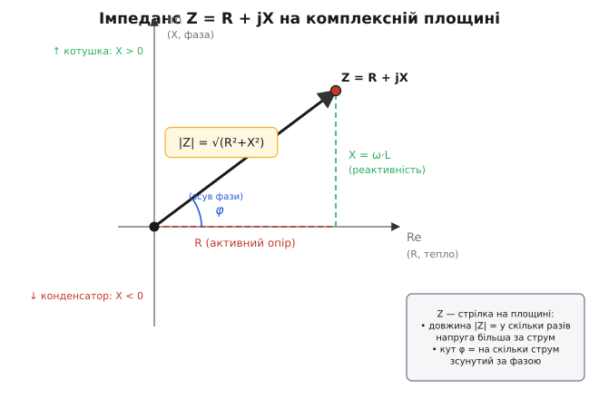

# Імпеданс

На резисторі все чесно й просто: подвоїли напругу — подвоївся струм, прибрали напругу — зник струм, і все це **миттєво**, без затримки. Зв'язок задає закон Ома: `I = U/R`, одне число `R` сповна описує, як деталь чинить опір. Та щойно в колі з'являється конденсатор чи котушка й тече **змінний струм**, цей затишний світ ламається. Виявляється, струм може **відставати** від напруги або **випереджати** її в часі: коли напруга вже на вершині, струм ще тільки розганяється, або навпаки. Між двома синусоїдами однієї частоти виникає зсув у часі — **зсув фази**. І тепер одного числа замало: треба сказати не лише *наскільки* струм менший за напругу, а й *на скільки* він зсунутий. Два числа в одному — це рівно те, що вміє комплексне число. Звідси й береться імпеданс: опір, що став комплексним, бо мусив нести і силу, і фазу.

Ця стаття веде думку від першопричини: чому на змінному струмі опору-числа не вистачає, як два потрібні числа природно складаються в одне комплексне `Z = R + jX`, що означають його модуль і аргумент, чому уявна частина — це реактивність, і як закон Ома `Z = U/I` оживає у фазорах. Дорогою стане очевидно, що «комплексний опір» — не математична примха, а найточніший спосіб описати те, що насправді відбувається в колі.

## Чому на резисторі фази немає, а на конденсаторі вона з'являється

Почнімо з причини зсуву — без неї імпеданс висить у повітрі. Подамо на деталь синусоїдну напругу `u(t) = U·sin(ω·t)`, де `ω` (омега) — кутова частота, тобто як швидко крутиться коливання. Питання одне: який тече струм?

На **резисторі** відповідь дослівно повторює закон Ома в кожну мить: `i(t) = u(t)/R = (U/R)·sin(ω·t)`. Струм — та сама синусоїда, лише нижча в `R` разів. Вершина струму збігається з вершиною напруги, нуль із нулем: вони йдуть **у такт**, нога в ногу. Зсуву фази нема, бо резистор реагує на саме *значення* напруги, а не на її зміну.

З **конденсатором** інакше, і тут уся суть. Конденсатор накопичує заряд, і його напруга пропорційна накопиченому заряду: `u = q/C`. Струм же — це швидкість, із якою заряд притікає: `i = Δq/Δt`. Склеївши дві рівності, дістаємо, що струм конденсатора визначається не напругою, а **швидкістю її зміни**:

```
i(t) = C · (швидкість зміни u)
```

Прочитаймо це для синусоїди уважно. Швидкість зміни синусоїди найбільша там, де сама синусоїда круто перетинає нуль, і дорівнює нулю на вершинах, де хвиля на мить завмирає перед розворотом. Отже струм конденсатора максимальний у моменти, коли напруга проходить через нуль, і нульовий, коли напруга на піку. А це означає, що крива струму — теж синусоїда, але **зсунута на чверть періоду вперед** відносно напруги: струм досягає вершини на 90° раніше за напругу. Кажуть: на конденсаторі **струм випереджає напругу на 90°** — пік струму приходить рівно туди, де напруга ще тільки переходить нуль угору.

У **котушки індуктивності** все дзеркально. Котушка опирається зміні струму (наводить напругу проти будь-якої спроби струм змінити), тож тепер уже напруга визначається швидкістю зміни струму: `u = L·(швидкість зміни i)`. Тим самим міркуванням виходить, що тут **напруга випереджає струм на 90°** — або, що те саме, струм відстає від напруги на чверть періоду. Резистор тримає фазу нуль, конденсатор зсуває на −90°, котушка — на +90°: три різні характери, і всі про фазу.

> 🔧 **Навіщо це.** Саме цей зсув фази робить можливими фільтри, коливальні контури й узгодження антен. Якби всі елементи трималися фази нуль, як резистор, не було б ні резонансу, ні поділу сигналу за частотою — радіо й звукова техніка в тому вигляді, як ми їх знаємо, не існували б. Інженер, який проєктує фільтр, насправді розставляє по колу елементи з потрібними зсувами фази.

## Чому одного числа замало

Тепер видно проблему. На змінному струмі деталь робить із сигналом **дві речі одночасно**: по-перше, послаблює амплітуду (струм виходить більший або менший за певним коефіцієнтом), по-друге, зсуває фазу (струм у часі їде вперед або назад відносно напруги). Одне число `R` уміє виразити лише перше — у скільки разів. Сказати «опір 100» вже недостатньо: 100 на резисторі (фаза нуль) і «100» на конденсаторі (фаза −90°) — фізично різні речі, бо по-різному поводяться в колі.

Потрібен об'єкт, що несе **два числа разом**: «наскільки» і «з яким зсувом фази». І така математика давно є — це комплексне число. Воно теж пара чисел в одній обгортці, і, що ключове, його зручно бачити як **стрілку на площині**: довжина стрілки — одне число, кут нахилу — друге. Покладемо довжину відповідати за силу опору, а кут — за зсув фази, і дістанемо точно той інструмент, якого бракувало.

Це не випадковий збіг. За цим стоїть глибша причина: змінні струми й напруги однієї частоти самі природно подаються комплексними числами — **фазорами** (англ. *phasor*, з *phase* — фаза, і *vector* — вектор). Фазор згортає синусоїду однієї частоти в нерухому стрілку: довжина дає амплітуду, кут — фазу, а спільне для всього кола обертання зі швидкістю `ω` виносять «за дужку» й не малюють — тоді синусоїди складають як звичайні комплексні числа, арифметикою замість тригонометрії; як саме це працює — у статті про [фазори](topic:math/phasors).

Якщо і напруга, і струм — це стрілки-фазори, то їхнє відношення `U/I` теж комплексне число. Воно і є імпеданс. Лишається розібрати, що в цьому числі сидить.

## Імпеданс як комплексне число: Z = R + jX

Запишімо узагальнений закон Ома відразу так, як він виглядає для фазорів, а тоді розберемо кожен символ:

```
Z = U / I
```

Тут `U` і `I` — комплексні амплітуди (фазори) напруги й струму, а `Z` — **імпеданс** (англ. *impedance*, від лат. *impedire* — заважати, ставити перепони), комплексний опір. Як будь-яке комплексне число, `Z` розкладається на дійсну та уявну частини:

```
Z = R + jX
```

де `R` — **активний опір** (дійсна частина), `X` — **реактивний опір**, або **реактивність** (уявна частина). Літера `j` тут — уявна одиниця (та, що `j² = −1`); в електротехніці пишуть `j`, а не `i`, бо `i` уже зайняте під струм. Розгляньмо обидві частини окремо — звідки кожна береться.

**Дійсна частина `R` — це чесне розсіювання енергії.** Вона відповідає тому, що вміє резистор: послабити амплітуду без зсуву фази. На активному опорі струм і напруга в такт, тож добуток `u·i` завжди додатний — деталь **поглинає** потужність і перетворює її на тепло. `R` — це міра незворотних втрат, тепла, яке вже не повернути.

**Уявна частина `X` — це зсув фази на 90°, тобто реактивність.** І ось чому вона саме уявна, а не дійсна. Множення на `j` на комплексній площині — це поворот стрілки рівно на чверть кола (90°) проти годинникової стрілки: послідовність `1 → j → −1 → −j → 1` щоразу повертає стрілку на прямий кут, тож уявна вісь перпендикулярна до дійсної. Це пряме [наслідок формули Ейлера](topic:math/euler-formula) `e^(jθ) = cos θ + j·sin θ`, де уявний показник котить точку по одиничному колу.

Реактивні елементи — конденсатор і котушка — саме й зсувають фазу на 90°. Тож у мові комплексних чисел їхній внесок в опір мусить бути множенням на щось із `j`, тобто **чисто уявним числом** — інакше воно не дало б повороту на прямий кут. Резистор не зсуває фазу — його внесок дійсний; конденсатор і котушка зсувають на ±90° — їхній внесок лежить на уявній осі. Розклад `Z = R + jX` — це не формальність, а пряме відображення фізики: дійсна вісь несе те, що гріє, уявна — те, що зсуває фазу й енергію не втрачає, а лише позичає та повертає.

Реактивність `X` має знак, і знак промовистий. У котушки `X` додатний (`X_L = ω·L`): більша частота — більший опір, котушка душить швидкі зміни. У конденсатора `X` від'ємний (`X_C = −1/(ω·C)`): більша частота — менший опір за модулем, конденсатор легко пропускає швидке й майже глухий до повільного. Знак `X` каже, *хто* править: плюс — індуктивний характер (напруга попереду), мінус — ємнісний (струм попереду).


*Імпеданс — точка на комплексній площині. Горизонталь R (активний опір, тепло) і вертикаль X (реактивність, зсув фази) складаються у стрілку. Її довжина |Z| каже, у скільки разів струм менший за напругу, а кут φ — на скільки струм зсунутий за фазою. Котушка тягне стрілку вгору (X>0), конденсатор — униз (X<0).*

## Модуль і аргумент: сила опору й зсув фази

Стрілку на площині однаково повно описують двома способами: парою катетів (`R` і `X`) або довжиною та кутом. Другий спосіб — **полярний** — для імпедансу найзмістовніший, бо саме довжина й кут мають прямий фізичний сенс.

**Модуль `|Z|`** — довжина стрілки — це наскільки опір «сильний» загалом. За теоремою Піфагора (стрілка — гіпотенуза катетів `R` і `X`):

```
|Z| = √(R² + X²)
```

Модуль зв'язує **амплітуди** струму й напруги звичайним законом Ома, тільки тепер між піковими значеннями: `U_ампл = |Z| · I_ампл`. Тобто `|Z|` каже, у скільки разів амплітуда напруги більша за амплітуду струму — рівно те, що робило одне число `R` на резисторі, але тепер з урахуванням і реактивного внеску.

**Аргумент `φ`** — кут нахилу стрілки до дійсної осі — це **зсув фази** між напругою і струмом:

```
φ = atan2(X, R)
```

Кут `φ` каже, на скільки напруга випереджає струм (або відстає, якщо `φ` від'ємний). Функція `atan2` тут не випадкова: вона повертає кут у правильній чверті, розрізняючи, скажімо, +90° і −90°, що звичайний арктангенс злив би в одне. Граничні випадки читаються миттєво: чистий резистор — `X = 0`, стрілка лежить на дійсній осі, `φ = 0°`, фази нема; чиста котушка — `R = 0, X > 0`, стрілка дивиться вгору, `φ = +90°`; чистий конденсатор — `R = 0, X < 0`, стрілка вниз, `φ = −90°`. Усе проміжне — суміш: реальна котушка з опором дроту дає `φ` десь між 0° і 90°.

Дві форми запису пов'язані формулою Ейлера й переходять одна в одну без втрат:

```
Z = R + jX = |Z|·e^(jφ) = |Z|·(cos φ + j·sin φ)
```

Прямокутна форма `R + jX` зручна, коли імпеданси **складають** (послідовне з'єднання — просто сума, дійсне до дійсного, уявне до уявного). Полярна форма `|Z|·e^(jφ)` зручна, коли імпеданси **множать чи ділять** (тоді довжини перемножуються, а кути додаються) — саме тому закон Ома `U = Z·I` у полярній формі читається так наочно: амплітуди множаться, фази складаються.

> 🔧 **Навіщо це.** Полярна форма — це мова паспорта будь-якого компонента й вимірювання приладом. Коли осцилограф чи LCR-метр показує опір на частоті як «`|Z|` під кутом `φ`», він говорить рівно цими двома числами: скільки омів і який зсув фази. Розрахунок дільника напруги, узгодження виходу підсилювача з динаміком, налаштування антени — усе це дії над `|Z|` і `φ`.

## Узагальнений закон Ома у фазорах

Зберімо нитку. Імпеданс вводять так, щоб закон Ома **дослівно зберіг свою форму** на змінному струмі — лише числа в ньому стали комплексними:

```
U = Z · I        (фазори)
```

Це рівність трьох комплексних чисел, і вона несе одразу два звичайні рівняння — одне про амплітуди, друге про фази:

```
|U| = |Z| · |I|          (амплітуди множаться)
arg(U) = arg(Z) + arg(I) (фази складаються)
```

Перший рядок — це закон Ома для амплітуд: напруга більша за струм у `|Z|` разів. Другий — закон для фаз: множення на `Z` повертає фазор струму на кут `φ`, перетворюючи його на фазор напруги. Тобто `Z` — це водночас і **коефіцієнт розтягу** амплітуди, і **оператор повороту** фази, спакований в одне число. У цьому вся економія комплексного запису: те, що довелося б тримати у двох окремих рівняннях (одне для величин, друге для зсувів), злите в одну рядкову формулу, з якою працюють як зі звичайним законом Ома.

Сила підходу видніша на з'єднаннях. Послідовні імпеданси складаються — `Z = Z₁ + Z₂ + …`; паралельні комбінуються через обернені — `1/Z = 1/Z₁ + 1/Z₂ + …`. Це **ті самі** правила, що для звичайних резисторів, лише над комплексними числами. А отже, увесь розрахунок кола змінного струму зводиться до арифметики комплексних чисел — без жодного диференціального рівняння, хоча конденсатори й котушки за своєю природою описуються саме похідними. Похідну «з'їла» уявна одиниця: множення на `jω` для котушки, ділення на `jω` для конденсатора. Те, що в часовій картині є диференціюванням, у фазорній — звичайне множення на комплексне число.

### Порахуймо: котушка послідовно з резистором

**Умова.** Реальна котушка індуктивності `L = 10 мГн` має активний опір дроту `R = 30 Ом`. Її підключили до мережі змінного струму частотою `f = 400 Гц`. Який її імпеданс — модуль і зсув фази? Якщо амплітуда напруги `U = 12 В`, яка амплітуда струму?

```
Крок 1. Кутова частота:
  ω = 2·π·f = 2·π·400 ≈ 2513 рад/с

Крок 2. Реактивність котушки (уявна частина):
  X = ω·L = 2513 · 0.010 ≈ 25.1 Ом   (додатна — індуктивна)

Крок 3. Імпеданс у прямокутній формі:
  Z = R + jX = 30 + j·25.1  Ом

Крок 4. Модуль (закон Ома для амплітуд):
  |Z| = √(30² + 25.1²) = √(900 + 630) = √1530 ≈ 39.1 Ом

Крок 5. Аргумент (зсув фази):
  φ = atan2(25.1, 30) ≈ 39.9°   (напруга випереджає струм)

Крок 6. Амплітуда струму:
  I = U / |Z| = 12 / 39.1 ≈ 0.307 А
```

Зверніть увагу: модуль `39.1 Ом` помітно більший за самий лише `R = 30 Ом` — реактивність котушки додала опору, хоч на тепло вона нічого не витрачає. І струм відстає від напруги на майже 40°: котушка нахилила фазу, але не на повні 90°, бо активний опір дроту тягне стрілку назад до дійсної осі. Якби частоту підняли, `X` зросла б, модуль збільшився б, а кут підповз ближче до 90° — котушка ставала б усе «реактивнішою».

У прошивці, що рахує імпеданс на льоту (скажімо, в аналізаторі кіл на мікроконтролері), комплексне число лягає на структуру з двох полів — дійсного й уявного:

:::tabs
```c
#include <math.h>

typedef struct { float re, im; } Cplx;   /* комплексне число: re + j*im */

/* імпеданс реальної котушки на частоті f */
Cplx coil_impedance(float R, float L, float f) {
    float w = 2.0f * (float)M_PI * f;     /* кутова частота ω */
    return (Cplx){ R, w * L };            /* Z = R + j*(ω·L) */
}

/* приклад: R=30 Ом, L=10 мГн, f=400 Гц */
Cplx Z = coil_impedance(30.0f, 0.010f, 400.0f);

float mag   = hypotf(Z.re, Z.im);   /* |Z| ≈ 39.1 Ом              */
float phase = atan2f(Z.im, Z.re);   /* φ  ≈ 0.696 рад ≈ 39.9°     */
float I     = 12.0f / mag;          /* амплітуда струму ≈ 0.307 А */
```
```python
import cmath
import math

def coil_impedance(R, L, f):
    """імпеданс реальної котушки на частоті f"""
    w = 2.0 * math.pi * f          # кутова частота ω
    return complex(R, w * L)       # Z = R + j*(ω·L)

# приклад: R=30 Ом, L=10 мГн, f=400 Гц
Z = coil_impedance(30.0, 0.010, 400.0)

mag   = abs(Z)                     # |Z| ≈ 39.1 Ом
phase = cmath.phase(Z)             # φ  ≈ 0.696 рад ≈ 39.9°
I     = 12.0 / mag                 # амплітуда струму ≈ 0.307 А
```
:::

`hypotf(re, im)` повертає `√(re² + im²)` без проміжного переповнення, `atan2f(im, re)` дає фазу в правильній чверті від −π до π. Дві дії — і весь імпеданс описано.

## Що лишається в руках

Імпеданс народжується з однієї впертої обставини: на змінному струмі конденсатор і котушка реагують не на саме значення напруги, а на **швидкість її зміни**, і через це між струмом та напругою з'являється зсув фази. Одного числа `R`, яке вміє лише послабити амплітуду, для опису цього замало — треба нести разом і силу опору, і зсув фази, а це рівно те, що тримає в собі комплексне число-стрілка. Дійсна частина `R` відповідає за тепло, незворотні втрати; уявна частина `X` — за зсув на 90°, тобто за реактивність, яка енергію не палить, а лише позичає та повертає, і тому лежить на перпендикулярній, уявній осі. Модуль `|Z| = √(R² + X²)` зв'язує амплітуди струму й напруги, аргумент `φ = atan2(X, R)` дає зсув фази між ними. А узагальнений закон Ома `U = Z·I` зберігає звичну форму, бо комплексне множення саме й робить дві потрібні речі заразом: розтягує амплітуду на `|Z|` і повертає фазу на `φ`. Диференціальні рівняння змінного струму від цього стають алгеброю комплексних чисел — у цьому й уся причина, чому опір варто було зробити комплексним.
