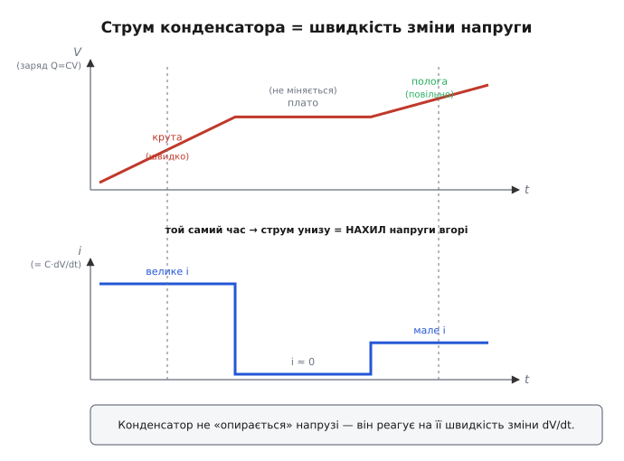
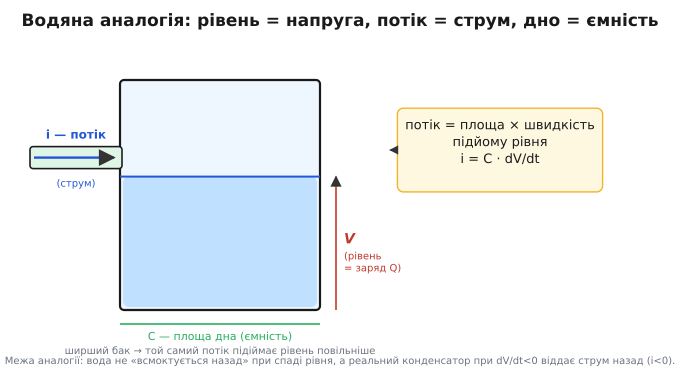
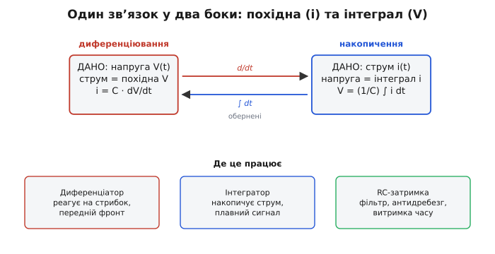

# Похідна конденсатора

Підключіть конденсатор до батарейки через лампочку — і помітите дивне. У першу мить лампочка спалахує яскраво, хоча напруга на конденсаторі ще нульова; а коли конденсатор «набереться» до напруги батарейки, лампочка гасне зовсім, попри те що напруга тепер максимальна. Виходить, струм крізь конденсатор великий саме тоді, коли напруга на ньому мала й тільки починає рости, і падає до нуля, коли напруга стала найбільшою й перестала мінятися. Струм не йде слідом за самою напругою — він іде слідом за тим, **наскільки швидко напруга міняється**.

Це здається парадоксом лише доти, доки ми думаємо про конденсатор як про звичайний опір, де струм пропорційний напрузі (закон Ома, I = V/R). Конденсатор живе за іншим законом. І щоб його побачити, не треба нічого вгадувати — він прямо випливає з того, що таке заряд і що таке струм. Розкрутімо це від самого початку.

## Заряд: скільки електрики «налито» в конденсатор

Конденсатор — це дві провідні пластини, розділені тонким шаром ізолятора. Коли до них прикладено напругу, на одній пластині збирається надлишок електронів (мінус), на іншій — їхній брак (плюс). Цей розділений запас і називають **зарядом** (англ. *charge*, від лат. *carricare* — навантажувати). Що більша напруга — то сильніше пластини «натягують» на себе заряд.

Зв'язок виявляється напрочуд простим і лінійним: заряд прямо пропорційний напрузі.

```
Q = C · V
```

Тут Q — заряд у кулонах, V — напруга у вольтах, а коефіцієнт C — **ємність** (англ. *capacitance*, від того ж кореня — «місткість»), вимірюється у фарадах. Ємність каже, скільки заряду вміщає конденсатор на кожен вольт напруги: фарад — це кулон на вольт. Більший конденсатор (більше C) при тій самій напрузі тримає більше заряду — як ширший бак при тому самому рівні води тримає більше води.

Ось ця формула Q = C·V — уся фізика конденсатора. Усе інше, зокрема й загадковий струм із самого початку, ми зараз із неї **виведемо**, не додаючи жодного нового припущення.

## Струм — це швидкість, з якою тече заряд

Що таке струм? Не «кількість електрики», а **швидкість її протікання**: скільки заряду проходить крізь переріз провідника за одиницю часу. Ампер — це кулон за секунду. Якщо за час Δt крізь провід пройшов заряд ΔQ, то струм на цьому проміжку:

```
        ΔQ
i  =  ─────
        Δt
```

Це ще середня швидкість — заряд за проміжок, поділений на проміжок. Але та сама логіка, якою з відношення приростів народжується миттєва швидкість зміни будь-якої величини, працює й тут: стиснемо проміжок до миті, і відношення перетвориться на **похідну заряду за часом**. Миттєвий струм — це похідна заряду:

```
        dQ
i  =  ─────
        dt
```

> Тут ми спираємося на похідну — границю відношення приростів ΔQ/Δt при Δt→0, тобто миттєву швидкість зміни величини. Похідна dQ/dt відповідає на питання «наскільки швидко заряд росте саме зараз, у цю мить», а не «на скільки він виріс за хвилину». Якщо це поняття хочеться відновити з нуля — від парадоксу 0/0 до нахилу дотичної — воно живе у [темі про похідну](book:math/derivative).

Це означення струму не вигадане для конденсатора — воно справджується для будь-якого провідника. Просто зазвичай ми про нього не згадуємо, бо в резисторі заряд тече рівномірно й похідна нічого нового не показує. У конденсаторі ж саме вона все й вирішує.

## Складаємо два факти: i = C·dV/dt

Тепер у нас є дві прості рівності, і досить підставити одну в другу. Заряд конденсатора Q = C·V. Струм — це швидкість зміни заряду, i = dQ/dt. Підставмо:

```
        dQ      d(C·V)
i  =  ─────  =  ───────
        dt        dt
```

Ємність C — стала (вона задана будовою конденсатора й від часу не залежить), тому її можна винести за знак похідної, як будь-який сталий множник. Залишається похідна самої напруги:

```
        dV
i  =  C·─────
        dt
```

Ось він — головний закон конденсатора, **повністю виведений із першопричин**. Прочитаймо його вголос: струм крізь конденсатор дорівнює його ємності, помноженій на швидкість зміни напруги на ньому. Не на саму напругу — на **швидкість її зміни**.

Тепер початковий парадокс із лампочкою розв'язується сам собою. У першу мить підключення напруга на конденсаторі ще нульова, але росте дуже круто — dV/dt велике, тож і струм великий, лампочка світить. Згодом конденсатор наближається до напруги батарейки, ріст уповільнюється — dV/dt падає, тьмяніє й лампочка. Коли напруга вирівнялася й застигла на максимумі, dV/dt = 0 — і струм нульовий, хоч напруга найбільша. Не дивина, а пряма дія формули.


*Угорі — напруга (а отже й накопичений заряд Q=CV). Унизу — струм. Де напруга крута, струм великий; на плато, де напруга не міняється, струм падає до нуля; на пологій ділянці струм малий. Струм у кожну мить — це нахил кривої напруги в ту саму мить.*

## Інтуїція: бак із водою

Щоб закон вкоренився, перекладімо його мовою, яку легко уявити. Конденсатор — це бак для води. Напруга V — це **рівень води** в баку: чим вище рівень, тим більше води запасено (саме тому рівень відповідає заряду — Q=CV). Струм i — це **потік** крізь трубу, що веде в бак: швидкість, з якою вода прибуває чи спадає. А ємність C — це **площа дна** бака.

Тепер закон i = C·dV/dt читається без жодної математики. Потік (струм) дорівнює площі дна (ємність), помноженій на швидкість підняття рівня (dV/dt). Це елементарна геометрія наповнення: щоб рівень у баку площею C піднявся зі швидкістю dV/dt, треба наливати рівно стільки води за секунду.

Звідси одразу видно роль ємності. Широкий бак (велике C) при тому самому потоці наповнюється **повільно** — рівень повзе вгору ледь-ледь. Вузький бак (мале C) той самий потік наповнює стрімко. Тому великий конденсатор «згладжує» напругу: щоб помітно зрушити його напругу, потрібен великий струм або багато часу. Маленький — підхоплює будь-яку зміну миттєво.


*Рівень води — напруга (запас заряду), потік крізь трубу — струм, площа дна — ємність. Потік дорівнює площі дна, помноженій на швидкість підйому рівня: i = C·dV/dt. Аналогія точна для наповнення, але має межу: реальний конденсатор при спаді напруги (dV/dt<0) віддає струм назад, i стає від'ємним.*

Аналогія точна — але корисно знати, де вона ламається. Бак віддає воду лише вниз, самопливом; конденсатор симетричний — при dV/dt < 0 (напруга спадає) струм просто змінює знак і тече **назад**, конденсатор віддає накопичений заряд у коло. Від'ємний струм у формулі — це не помилка, а розряд. Ще одна межа: ідеальний бак не «тримає» рівень проти бажання, а реальний конденсатор має витоки, та це вже тонкощі, не суть.

## Швидка зміна — великий струм

Серце закону — у множнику dV/dt. Він означає, що конденсатор реагує не на величину напруги, а на **різкість** її зміни. Та сама зміна напруги, втиснута у вдесятеро коротший час, дає вдесятеро більший струм.

Подивімося на числах. Нехай конденсатор C = 100 мкФ = 100·10⁻⁶ Ф. Підіймімо напругу на ньому на 2 вольти. Якщо це сталося плавно за 1 секунду:

```
        dV         2 В
i = C·─────  =  100·10⁻⁶ · ─────  =  100·10⁻⁶ · 2  =  2·10⁻⁴ А  =  0.2 мА
        dt         1 с
```

А тепер та сама зміна на 2 вольти, але за 1 мілісекунду — вдесятеро… ні, втисячеро коротше:

```
        dV         2 В
i = C·─────  =  100·10⁻⁶ · ───────  =  100·10⁻⁶ · 2000  =  0.2 А  =  200 мА
        dt        0.001 с
```

Та сама напруга, той самий конденсатор — а струм виріс у тисячу разів, бо в тисячу разів зросла швидкість зміни. Це не математична абстракція, а щоденна реальність схемотехніки: різкий фронт сигналу проштовхує крізь конденсатор величезний кидок струму. Звідси й гранична межа: миттєво (за нульовий час) змінити напругу на конденсаторі неможливо, бо це вимагало б нескінченного струму. Напруга на конденсаторі завжди **неперервна** — вона може рости чи падати як завгодно швидко, але не стрибком. Це фундаментальна властивість, і вона теж просто випливає з i = C·dV/dt.

> 🔧 **Навіщо це.** Саме тому поряд із кожною цифровою мікросхемою ставлять **розв'язувальний конденсатор** (decoupling). Коли мікросхема в такт перемикань різко смикає струм, лінія живлення просіла б — але конденсатор поряд має малий dV/dt лише за умови, що віддає струм, тож він миттєво підкидає заряд і тримає напругу рівною. Та сама властивість пояснює викиди напруги на довгих лініях і потребу в захисті: різкий dV/dt = великий струм там, де його не чекали.

## Зворотний бік: напруга як інтеграл струму

Закон i = C·dV/dt дивиться вперед: знаємо напругу — знаходимо струм, диференціюючи. Але часто задача стоїть навпаки: ми **керуємо струмом** (наприклад, джерелом струму заряджаємо конденсатор) і хочемо знати, як поводитиметься напруга. Це обернена дія — і вона теж читається з тієї самої формули.

Якщо струм — це швидкість, з якою накопичується заряд, то сам заряд — це накопичений за весь час струм. А напруга — заряд, поділений на ємність. Мовою числення «накопичити за весь час» означає взяти **інтеграл**:

```
            1   ⌠
V(t)  =  V₀ + ─── │ i dt
            C   ⌡
```

Тут V₀ — початкова напруга (те, що вже було накопичено на старті), а [інтеграл](book:math/integral) ∫i dt додає весь заряд, що притік відтоді. Інтеграл — це і є неперервне підсумовування: складаємо всі крихітні порції заряду i·dt за кожну мить проміжку. Поділивши накопичений заряд на ємність C, дістаємо напругу. Це той самий зв'язок, лише прочитаний у зворотний бік: диференціювання (струм із напруги) та інтегрування (напруга зі струму) — обернені дії, як множення й ділення.

Найясніше це видно для **сталого струму**. Якщо джерело жене незмінний струм I, інтеграл стає простим добутком I·t, і напруга росте **лінійно**:

```
            I·t
V(t)  =  V₀ + ─────
             C
```

Сталий струм у конденсатор — це рівномірно прибуваюча вода в баку: рівень піднімається з постійною швидкістю, прямою лінією. Цей факт — пряма й рівна напруга з постійного струму — лежить в основі генераторів пилкоподібної напруги, таймерів і аналогових інтеграторів.


*Той самий зв'язок між струмом і напругою працює в обидва боки. Маємо напругу — струм є її похідною; маємо струм — напруга є його інтегралом. Диференціювання й накопичення обернені одне до одного. Унизу — типові ролі: реагувати на фронт (диференціатор), накопичувати (інтегратор), задавати витримку часу (RC).*

## Де це працює

Тепер, коли закон у руках, видно, чому конденсатор — не просто «накопичувач заряду», а активний учасник майже кожного аналогового вузла. Усі його застосування ростуть із двох прочитань однієї формули.

**RC-кола: витримка часу.** З'єднайте конденсатор C і резистор R послідовно — і дістанете найпоширеніше коло в електроніці. Резистор обмежує струм (i = V/R), а конденсатор перетворює цей струм на повільну зміну напруги. Підставивши закон конденсатора в закон Ома, отримуємо рівняння, де швидкість зміни напруги залежить від самої напруги, — і його розв'язок дає характерну **експоненційну** криву заряду й розряду з постійною часу τ = R·C. За час τ напруга проходить близько 63% шляху до кінцевого значення. Звідси — таймери, затримки увімкнення, формувачі імпульсів, усунення дребезгу контактів кнопки.

**Фільтри: відсіювання за швидкістю.** Оскільки струм конденсатора пропорційний dV/dt, конденсатор по-різному «бачить» повільні й швидкі сигнали. Для повільної (низькочастотної) зміни dV/dt мале — конденсатор майже не пропускає струм, поводиться як розрив. Для швидкої (високочастотної) — dV/dt велике, струм тече легко, конденсатор майже як провідник. Ця залежність опору від швидкості зміни (частоти) і робить конденсатор основою фільтрів: поставлений упоперек сигналу, він стікає на землю саме швидкі складові, згладжуючи пульсації живлення чи прибираючи високочастотний шум.

**Інтегратори: накопичення сигналу.** Якщо подати на конденсатор струм, пропорційний якомусь сигналу, напруга на ньому стане інтегралом цього сигналу — за формулою V = (1/C)∫i dt. На цьому будують аналогові інтегратори (зокрема в операційних підсилювачах), генератори пилкоподібної напруги для розгорток і перетворювачі, де треба накопичити площу під кривою. Дзеркальна ідея — диференціатор: коло, що видає напругу, пропорційну dV/dt входу, реагуючи саме на фронти й перепади.

Усі ці ролі — таймер, фільтр, інтегратор, диференціатор, згладжувач живлення — це не п'ять різних трюків, а п'ять облич **однієї** рівності i = C·dV/dt, побаченої під різними кутами. Конденсатор завжди робить те саме: зв'язує струм зі швидкістю зміни напруги. Усе, що ми навколо нього будуємо, — лише вибір, який бік цього зв'язку поставити собі на службу.

## Похідна напруги в прошивці: оцінка струму з відліків

**Умова.** Мікроконтролер вимірює напругу на конденсаторі через АЦП кожні Δt = 1 мс. Прямого датчика струму немає, але струм треба знати — наприклад, щоб виявити кидок навантаження. За законом конденсатора i = C·dV/dt струм можна **обчислити** з того, як швидко міняється виміряна напруга.

Ідеальну похідну dV/dt у залізі не взяти — не можна зробити Δt = 0. Замість неї беремо скінченну різницю: ділимо приріст напруги між двома сусідніми відліками на час між ними. Це і є пряме числове прочитання формули конденсатора.

```c
/* Оцінка струму конденсатора зі швидкості зміни виміряної напруги.
   i = C * dV/dt,  похідну беремо як (V[n] - V[n-1]) / dt           */

static const float C  = 100e-6f;   /* ємність, Ф (100 мкФ)          */
static const float dt = 1.0e-3f;   /* період відліків АЦП, с (1 мс) */

static float v_prev    = 0.0f;
static bool  have_prev = false;

/* Повертає оцінку струму крізь конденсатор у амперах */
float cap_current(float v_now)
{
    if (!have_prev) {              /* перший відлік: похідної ще нема */
        v_prev    = v_now;
        have_prev = true;
        return 0.0f;
    }
    float dvdt = (v_now - v_prev) / dt;   /* швидкість зміни напруги */
    v_prev = v_now;
    return C * dvdt;                       /* i = C * dV/dt           */
}
```

**Розбір на числах.** Нехай попередній відлік v_prev = 1.50 В, новий v_now = 1.53 В, період dt = 0.001 с, ємність C = 100·10⁻⁶ Ф:

```
dvdt = (1.53 − 1.50) / 0.001
     = 0.03 / 0.001
     = 30 В/с

i = C · dvdt
  = 100·10⁻⁶ · 30
  = 3·10⁻³ А
  = 3 мА
```

Напруга росте зі швидкістю 30 вольтів за секунду, і це означає, що в конденсатор у цю мить тече близько 3 міліампер. Жодного датчика струму — лише вольтметр і похідна.

**Підступ: похідна підсилює шум.** Тут чигає та сама пастка, що й на будь-якому числовому диференціюванні. Якщо обидва відліки напруги мають похибку ±ε (а в АЦП вона є завжди — від шуму й квантування), то їхня різниця несе похибку до ±2ε, тоді як корисний приріст при малому dt сам крихітний. Поділивши малу різницю на малий dt, ми роздуваємо шум: оцінка струму починає смикатися навіть тоді, коли справжній струм рівний. Тому на практиці виміряну напругу перед диференціюванням згладжують фільтром, а різницю іноді беруть не між сусідніми, а між трохи рознесеними відліками. Чим коротший dt, тим ближче ми до істинної похідної в математичному сенсі — але тим сильніше галасує шум. Це неминучий компроміс, і закладати його треба свідомо.
