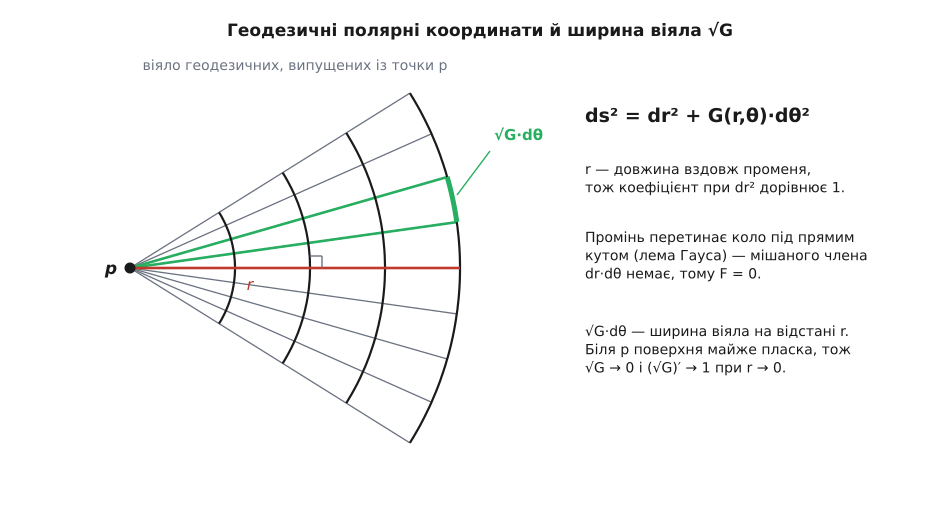
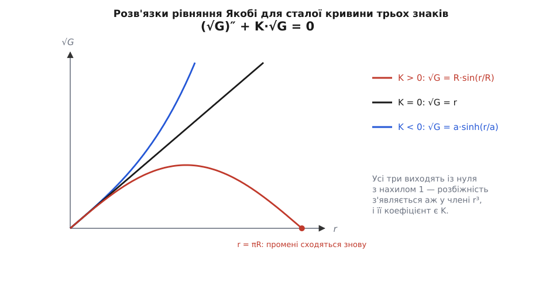

# 🧮 Дефект кола: як K видобувається з самої метрики

Головні кривини означені через нормаль, тобто через простір навколо поверхні, — а їхній добуток чомусь обчислюється самою лише мірною стрічкою. Нижче — викладка, яка це показує: як із довжини маленького кола, накресленого на поверхні, виходить рівно K, і як те саме K записується через коефіцієнти метрики й нічого більше.

## Координати, у яких видно тільки внутрішнє

Мешканець поверхні має стрічку й кутомір. Цього досить, щоб побудувати навколо точки p систему координат, у якій жодне число не приходить іззовні.

Випусти з p у кожному напрямку найкоротшу лінію — [геодезичну](topic:math/geodesic). Точку задамо парою: θ — кут, під яким геодезична вийшла з p, r — довжина, пройдена вздовж неї. Обидва числа міряються всередині: кут — кутоміром у p, довжина — стрічкою вздовж лінії.

Лишається записати, як через ці координати рахується довжина довільної кривої, — [першу квадратичну форму](topic:math/first-fundamental-form) ds² = E·dr² + 2F·dr·dθ + G·dθ². Два з трьох коефіцієнтів відомі наперед.

E = 1 — бо рухаючись уздовж променя при сталому θ, ми проходимо шлях, що дорівнює приросту r; так r і означено.

F = 0 — бо промінь перетинає коло r = const під прямим кутом. Це лема Гауса. Доведення коротке, хоч і технічне: похідна F по r тотожно нульова, бо промінь — геодезична, отже F узагалі не залежить від r; а біля самої p він прямує до нуля — тож дорівнює нулю всюди.

```text
ds² = dr² + G(r,θ)·dθ²
```

Величина √G має пряме геометричне значення. Два промені, що вийшли з p під кутами θ і θ + dθ, на відстані r віддалені один від одного на √G·dθ. Тобто √G — це ширина віяла геодезичних. На площині вона дорівнює r, і будь-яке відхилення від r — уже слід кривини.


*Геодезичні полярні координати. Радіальна відстань r і кут θ у точці p — усе, що потрібно, і обидва числа міряються з поверхні.*

## Рівняння Якобі

Для метрики виду ds² = dr² + G·dθ² гаусова кривина виражається через один-єдиний коефіцієнт:

```text
K = − (√G)_rr / √G
```

Це окремий випадок загальної формули Гауса — її повний вигляд і перевірка стоять в останньому розділі цієї викладки; поки що приймімо результат і подивімося, що з нього випливає. Позначмо f(r,θ) = √G, а штрихом — похідну по r при сталому θ:

```text
f ″ + K·f = 0
```

Це рівняння Якобі; для поверхонь його розглядав ще Гаус, а Карл Ґустав Якоб Якобі узагальнив на вищі вимірності. Читається воно як опис розбігання геодезичних: f — ширина віяла, f ″ — прискорення, з яким сусідні промені розходяться, і рівняння каже, що це прискорення пропорційне самій ширині з коефіцієнтом −K. Додатна кривина стягує промені один до одного, від'ємна розганяє. Ось чому саме K доступне мешканцеві поверхні: він бачить, як розповзається його віяло.

Умови на початку дає сама точка p:

```text
f(0,θ)   = 0    на нульовій відстані промені ще не розійшлися
f ′(0,θ) = 1    крихітна околиця p не відрізняється від клаптика
                дотичної площини, тож дуга кола радіуса r має
                довжину r·dθ з точністю до вищих порядків
```

Разом це задача Коші для лінійного [однорідного рівняння](topic:math/homogeneous-ode) другого порядку — вона визначає f однозначно.

## Ряд, довжина кола й площа круга

Розкладімо f у [ряд Тейлора](topic:math/taylor-series) біля нуля. Перші два коефіцієнти — це умови, решту дає саме рівняння:

```text
f(0)   = 0
f ′(0) = 1
f ″(0) = −K·f |₀ = −K(p)·0 = 0
f ‴(0) = −(K·f)′|₀ = −(K′·f + K·f ′)|₀ = −K(p)
```

Друга похідна дорівнює нулю не випадково: у нулі множник f сам нульовий, тож хоч би якою була кривина, квадратичному доданкові взятися нізвідки. Перша ознака кривини з'являється аж у кубічному члені — і стоїть там чистою:

```text
√G = r − K(p)·r³/6 + …
```

Геодезичне коло радіуса r — це множина точок, віддалених від p рівно на r по поверхні. Його довжина — інтеграл елемента дуги при сталому r:

```text
C(r) = ∫[0..2π] √G dθ = ∫[0..2π] (r − K·r³/6 + …) dθ = 2πr − (π/3)·K·r³ + …
```

Площа круга — інтеграл елемента площі dA = √G·dr·dθ:

```text
A(r) = ∫[0..2π] ∫[0..r] √G ds dθ = ∫[0..2π] ∫[0..r] (s − K·s³/6 + …) ds dθ
     = ∫[0..2π] (r²/2 − K·r⁴/24 + …) dθ = πr² − (π/12)·K·r⁴ + …
```

Обидва розклади розв'язуються відносно K:

```text
K(p) = lim (r→0)  3·(2πr − C(r)) / (π·r³)
K(p) = lim (r→0)  12·(πr² − A(r)) / (π·r⁴)
```

Це теорема Бертрана — Діге — Пюїзе: Жозеф Бертран, Шарль Франсуа Діге й Віктор Пюїзе надрукували її 1848 року в *Journal de Mathématiques* (т. 13, с. 80–90) під назвою «Démonstration d'un théorème de Gauss». У правих частинах немає ані нормалі, ані навколишнього простору — сама стрічка.

> 🔧 **Навіщо це.** Формула виглядає простою, поки нею не спробуєш порахувати. Щоб дістати K, треба відняти два майже однакові числа й поділити різницю на r³. На Землі коло радіуса 100 м коротше за 2πr на 26 нанометрів — це одинадцятий значущий розряд шестисотметрової довжини. У подвійній точності таке ще виживає, в одинарній зникає безслідно: [похибка віднімання близьких чисел](topic:math/float-arithmetic-error) з'їдає весь сигнал. Тому кривину на числових моделях беруть не з довжини кола, а з дефіциту кутів навколо вершини — там віднімаються величини одного порядку.

## Точна перевірка: сфера

На сфері радіуса R геодезичні — великі кола, тобто меридіани, якщо взяти p за полюс. Дуга меридіана завдовжки r відповідає центральному кутові r/R, отже коло геодезичного радіуса r лежить на паралелі з евклідовим радіусом R·sin(r/R). Це і є ширина віяла: √G = R·sin(r/R). Підставмо її в рівняння Якобі напряму:

```text
f  = R·sin(r/R)
f ′ = cos(r/R)
f ″ = −(1/R)·sin(r/R) = −(1/R²)·R·sin(r/R) = −(1/R²)·f
```

Тобто f ″ + K·f = 0 з K = 1/R² — рівно та кривина, якої й чекали від сфери; умови f(0) = 0 і f ′(0) = 1 теж на місці. Розклад синуса відтворює коефіцієнт 1/6:

```text
sin x = x − x³/6 + x⁵/120 − …
f = R·(r/R − r³/(6R³) + …) = r − (1/R²)·r³/6 + … = r − K·r³/6 + …
```

**Земля як куля R = 6371 км, K = 1/R² = 2.46368·10⁻⁸ км⁻². Коло геодезичного радіуса r = 1000 км.**

```text
r/R = 0.15696123 рад     sin(r/R) = 0.15631752     2πR = 40030.174 км

точно:  C = 2πR·sin(r/R)      = 40030.174 · 0.15631752 = 6257.417 км
ряд:    C ≈ 2πr − (π/3)·K·r³  = 6283.185 − 25.800      = 6257.385 км

дефіцит довжини:  2πr − C = 25.768 км (точно)  проти  25.800 км (перший член)
розбіжність 32 м = наступний член ряду,  π·r⁵/(60·R⁴) = 0.0318 км
```

Точна формула й обрізаний ряд розходяться на 32 метри при колі завдовжки шість тисяч кілометрів — і рівно на ту величину, яку передбачає наступний доданок. Ряд нічого не вгадує наближено: він точний, просто обірваний, і те, що він відкинув, порахувалося окремо.

## Сідло: та сама формула, протилежний знак

Візьмімо клаптик сталої від'ємної кривини K = −1/a². Рівняння Якобі стає f ″ = f/a², і розв'язок із тими самими умовами — [гіперболічний синус](topic:math/hyperbolic-functions):

```text
f = a·sinh(r/a) = r + r³/(6a²) + …  = r − K·r³/6 + …
C(r) = 2π·a·sinh(r/a) = 2πr + (π/3)·(1/a²)·r³ + …
```

Формула та сама, знак K від'ємний — і коло виходить довшим за 2πr. Уся різниця між двома випадками сидить у знаку однієї сталої: додатний K робить рівняння Якобі рівнянням коливань, і промені сходяться; від'ємний робить його експоненційним, і промені тікають один від одного.


*Ширина віяла геодезичних для сталої кривини трьох знаків. Початок спільний, розбіжність починається з кубічного члена, і його коефіцієнт є K.*

Конкретне сідло — гіперболічний параболоїд z = (x² − y²)/(2a). У початку координат дотична площина горизонтальна, тож головні кривини — це просто другі похідні висоти, 1/a і −1/a, а їхній добуток K = −1/a². При a = 2 м маємо K = −0.25 м⁻², і коло геодезичного радіуса 0.5 м виходить довшим:

```text
C = 2π·0.5 + (π/3)·0.25·0.125 = 3.141593 + 0.032725 = 3.174 м
```

Зайвих 32.7 мм на трьох метрах — мало, але цілком у межах звичайної рулетки.

## Друга дорога: те саме число ззовні

Тепер порахуймо K так, як його означено, — через нормаль. Поверхню задано параметрично вектор-функцією X(u,v). Дотичні вектори X_u і X_v дають першу форму: E = X_u·X_u, F = X_u·X_v, G = X_v·X_v. Одинична нормаль n = (X_u × X_v)/|X_u × X_v|. Другі похідні, спроєктовані на нормаль, дають [другу квадратичну форму](topic:math/second-fundamental-form):

```text
L = X_uu·n        M = X_uv·n        N = X_vv·n
```

Ці три числа кажуть, як швидко поверхня відходить від дотичної площини в кожному напрямку. Оператор форми — це матриця другої форми, «поділена» на матрицю першої: S = I⁻¹·II. Головні кривини — власні числа S, а їхній добуток — [визначник](topic:math/matrix-determinant) S, тобто відношення визначників двох форм:

```text
K = k₁·k₂ = (L·N − M²) / (E·G − F²)
```

Найзручніший окремий випадок — поверхня-графік z = h(x,y). Тут X = (x, y, h), параметри — самі x і y, і все виписується напряму:

```text
W² = 1 + h_x² + h_y²
E = 1 + h_x²     F = h_x·h_y     G = 1 + h_y²      →  E·G − F² = W²
L = h_xx/W       M = h_xy/W      N = h_yy/W

K = (h_xx·h_yy − h_xy²) / W⁴
```

У чисельнику стоїть визначник [матриці Гессе](topic:math/hessian-matrix) функції h. Перевірмо на тому самому параболоїді z = (x² − y²)/4, тобто при a = 2 м, у точці (x, y) = (1, 0) м:

```text
h_x = x/2 = 0.5      h_y = −y/2 = 0
h_xx = 0.5           h_yy = −0.5          h_xy = 0
W² = 1 + 0.25 + 0 = 1.25                  W⁴ = 1.5625

K = (0.5·(−0.5) − 0) / 1.5625 = −0.25 / 1.5625 = −0.16 м⁻²
```

У початку координат було −0.25 м⁻², на метр убік — уже −0.16: поверхня там похиліша, і знаменник W⁴ гасить кривину. Саме такі числа й підставляють у ряд для C(r), коли міряють кривину стрічкою.

## Формула Гауса: K через E, F, G і нічого більше

Обидві дороги мали б давати одне число — власне, це і є чудова теорема. Алгебраїчно вона твердить: вираз (L·N − M²)/(E·G − F²) тотожно дорівнює виразові, у якому L, M і N не з'являються зовсім. Явну його форму записав італієць Франческо Бріоскі 1852 року:

```text
      | −½E_vv + F_uv − ½G_uu   ½E_u   F_u − ½E_v |
D₁ =  | F_v − ½G_u              E      F          |
      | ½G_v                    F      G          |

      | 0      ½E_v   ½G_u |
D₂ =  | ½E_v   E      F    |
      | ½G_u   F      G    |

K = (D₁ − D₂) / (E·G − F²)²        (вертикальні риски — визначник)
```

Праворуч немає нічого, крім E, F, G та їхніх [частинних похідних](topic:math/partial-derivative) першого й другого порядку. Вивід механічний, хоч і довгий: диференціюють базисні вектори, розкладають результати назад по базису (X_u, X_v, n) і прирівнюють мішані треті похідні, X_uuv = X_uvu; L, M і N при цьому взаємно скорочуються. Важливий не вивід, а те, що лишилося в правій частині.

Коли координати ортогональні (F = 0), громіздкий вираз згортається до

```text
K = − 1/(2√(EG)) · [ ∂/∂u ( G_u/√(EG) ) + ∂/∂v ( E_v/√(EG) ) ]
```

а в геодезичних полярних координатах (u = r, v = θ), де E = 1, F = 0 і G = f², — до того самого рівняння, з якого все починалося:

```text
√(EG) = f      G_u = 2f·f ′      G_u/√(EG) = 2f ′      E_v = 0

K = − (1/(2f)) · ∂(2f ′)/∂r = − f ″/f        ⇔        f ″ + K·f = 0
```

Коло замкнулося. Зовнішнє означення через нормаль дало вираз через саму метрику; вираз через метрику в геодезичних координатах дав рівняння Якобі; рівняння Якобі дало дефіцит довжини кола.

**Формула Бріоскі на сфері.** Пройдімо весь вираз до кінця на метриці сфери в геодезичних полярних координатах (u = r, v = θ) — E = 1, F = 0, G = R²·sin²(u/R) — жодного разу не згадавши про третій вимір:

```text
E_u = E_v = 0        F ≡ 0        G_v = 0
G_u = R·sin(2u/R)                 G_uu = 2·cos(2u/R)

       | −½G_uu    0    0 |
D₁ =   |  −½G_u    1    0 |   =  (−½G_uu)·(1·G − 0)  =  −G·cos(2u/R)
       |      0    0    G |

       |    0    0    ½G_u |
D₂ =   |    0    1       0 |   =  ½G_u·(0·0 − 1·½G_u)  =  −¼·R²·sin²(2u/R)
       | ½G_u    0       G |

D₁ − D₂ = −G·cos(2u/R) + ¼·R²·sin²(2u/R)
```

Позначмо s = sin(u/R), c = cos(u/R), тобто G = R²s², cos(2u/R) = 1 − 2s², sin(2u/R) = 2sc:

```text
D₁ − D₂ = −R²s²·(1 − 2s²) + ¼·R²·(2sc)²
        = −R²s² + 2R²s⁴ + R²s²c²
        = −R²s² + 2R²s⁴ + R²s²(1 − s²)  =  R²s⁴

(E·G − F²)² = G² = R⁴s⁴

K = R²s⁴ / (R⁴s⁴) = 1/R²
```

Кривина сфери — з самих лише коефіцієнтів метрики. Мешканцеві сфери, щоб дізнатися її радіус, справді досить мірної стрічки.
