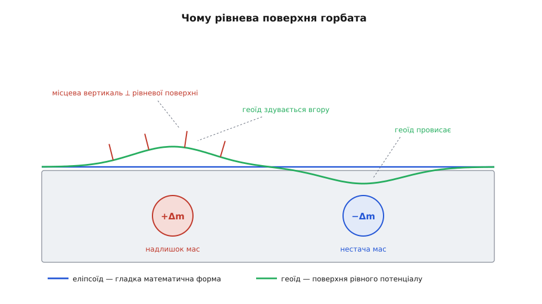
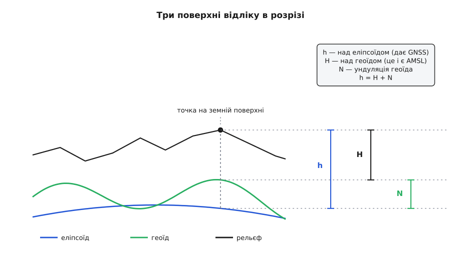
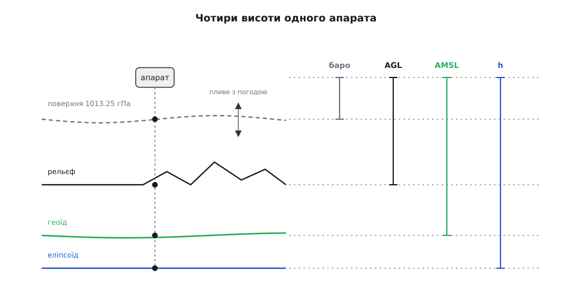

# Геоїд, AMSL і висота над еліпсоїдом

<preknowlist>
- [WGS-84: еліпсоїд і датум](topic:math/wgs84-datum) — що таке еліпсоїд обертання, якими числами задають його форму й що означає прив'язати його до реальної Землі.
- [Закон всесвітнього тяжіння](topic:physics/newton-gravitation) — тяжіння спадає як 1/r² і залежить від того, скільки маси й де вона лежить.
- [Потенціальна енергія](topic:physics/potential-energy) — потенціал як функція положення, а сила спрямована туди, куди потенціал спадає найшвидше.
- [Відцентрова сила](topic:physics/centrifugal-force) — обертання додає до тяжіння складову, що росте від полюса до екватора.
- [GNSS](topic:communications/gnss) — приймач знаходить положення з дальностей до супутників, тобто суто геометрично.
- [Атмосферний тиск](topic:physics/atmospheric-pressure) — тиск у точці є вагою стовпа повітря над нею, тому він спадає з підняттям.
</preknowlist>

Апарат висить нерухомо над полем. На екрані наземної станції три числа висоти, і жодні два не збігаються: 168.4, 142.3 і 51.0 метра. Барометр каже своє, супутниковий приймач — своє, а поле «висота над рельєфом» — третє. Спокуса вирішити, що два датчики з трьох брешуть, велика, і вона хибна: усі три числа правильні. Просто це три різні величини, яким не пощастило називатися одним словом.

Причина не в датчиках, а в самому понятті. Висота — не властивість точки; це відстань між двома поверхнями: тією, де апарат є, і тією, від якої відлік. Точка одна, а поверхонь, від яких люди звикли рахувати, кілька, і кожна з'явилася, щоб відповісти на своє питання. Тому питання «яка в тебе висота?» неповне доти, доки не сказано «над чим».

Найгірше те, що поверхні розходяться не на сантиметри. Різниця між двома найпоширенішими опорами сягає ста метрів — це висота тридцятиповерхівки, і саме на цю величину помиляється апарат, який отримав число від одного відліку, а порівнює його з картою, зробленою від іншого.

## Еліпсоїд: форма, яку можна записати формулою

Найпростіша опора — суто геометрична. Візьмімо гладке тіло, схоже на Землю, задаймо його рівнянням і рахуймо відстані до нього. Земля обертається, тому на екваторі вона роздута: [WGS-84](topic:math/wgs84-datum) описує її еліпсоїдом обертання з великою піввіссю a = 6378137.0 м і стисненням f = 1/298.257223563. Мала піввісь виходить одразу:

```
b = a·(1 − f) = 6378137.0 · (1 − 0.00335281066) = 6356752.31 м
a − b = 21384.7 м
```

Тобто полюс на 21 з лишком кілометр ближчий до центра, ніж екватор. І це весь опис форми: два числа.

Така скупість — не бідність, а головна перевага. Еліпсоїд є формулою, отже, з ним можна робити арифметику. Приймач GNSS розв'язує суто геометричну задачу: за дальностями до супутників він знаходить точку в прямокутних земних координатах, а тоді переводить її у звичні широту, довготу й висоту — і цей перехід можливий саме тому, що поверхня відліку задана рівнянням. Висоту, яку він при цьому дістає, називають **геодезичною** або **висотою над еліпсоїдом** і позначають `h`: це довжина відрізка від точки до еліпсоїда вздовж нормалі до нього.

> 🔧 **Навіщо це.** Кожен раз, коли ти конвертуєш координати між земною прямокутною системою й широтою-довготою, ти працюєш саме з `h` — жодна інша висота в ці формули не влазить, бо жодна інша поверхня не має рівняння. Тому в будь-якому навігаційному стеку `h` є внутрішньою, робочою висотою: усе, що рахує геометрію (перетворення систем координат, [місцева дотична площина](topic:math/local-tangent-plane), [ECEF і локальні рамки](topic:math/ecef-ned-enu)), живе на еліпсоїді. Проблеми починаються там, де це число віддають людині або порівнюють із картою.

## Чому еліпсоїд не годиться там, де тече вода

Уяви два колодязі за кілометр один від одного. Прилад показує, що обидва мають однакову висоту над еліпсоїдом — скажімо, рівно 150.00 м. З'єднай їх трубою. Чи стоятиме вода?

Не обов'язково. Вона цілком може потекти — і потече саме тоді, коли під одним із колодязів залягає щільніша порода.

Щоб зрозуміти чому, треба згадати, що змушує воду рухатися. Вода тече не туди, де менша геометрична відстань до якогось уявного еліпсоїда, — еліпсоїд для неї не існує. Вона тече туди, де менша її потенціальна енергія: рідина в полі тяжіння скочується вниз по потенціалу, аж поки скочуватися стане нікуди. Спокій настає тоді, коли вздовж усієї поверхні води потенціал однаковий: якби десь була різниця, там був би нахил, а нахил дає горизонтальну складову сили, і вода поповзла б.

Той самий висновок дає й будь-який прилад, яким люди перевіряють горизонт. Виска й бульбашковий рівень не знають нічого про еліпсоїд: вони показують напрям сумарної сили — тяжіння плюс відцентрової, бо Земля обертається. «Горизонтально» для них означає «перпендикулярно до цієї сили». А поверхня, всюди перпендикулярна до сили, — це і є поверхня сталого потенціалу: сила завжди спрямована туди, куди потенціал спадає найшвидше, тобто по нормалі до поверхонь сталого потенціалу.

Отже, будь-яка висота, яка має інженерний сенс — куди потече дощ, у який бік нахилена водовідвідна труба, чи заллє село при паводку, — мусить відлічуватися від поверхні сталого потенціалу. Геометрична висота над гладким тілом на це питання не відповідає взагалі.

Сумарний потенціал сили тяжіння разом із відцентровим називають **потенціалом сили тяжіння** Землі, а поверхні, на яких він сталий, — **рівневими поверхнями**. Їх нескінченно багато, вони вкладені одна в одну, як лушпиння цибулини; вода в спокої завжди лежить уздовж однієї з них.

## Поверхня, на якій стоїть океан

Рівневих поверхонь безліч, а опора для висот потрібна одна. Природний вибір напрошується сам: узяти ту, що збігається з поверхнею океану — бо океан і є найбільшою у світі водою, яка вже прийшла в рівновагу, і бо звичка міряти висоту «над рівнем моря» старша за будь-яку геодезію.

Рівень моря, щоправда, доводиться попередньо очистити. Миттєва поверхня океану гуляє від припливів, вітру, хвиль і атмосферного тиску, тож беруть її середнє за роки. Далі поверхню подумки продовжують під суходіл — так, ніби материки прорізані мережею вузьких каналів, у які зайшла вода й стала.

Ця уявна поверхня — рівнева поверхня поля тяжіння Землі, що найкраще збігається з середнім рівнем світового океану, — і зветься **геоїд** (гр. gê — Земля, eîdos — вигляд, подоба). Висоту над ним позначають `H` і називають **ортометричною** (гр. orthós — прямий, métron — міра), а в авіації та навігації — просто **AMSL** (англ. *above mean sea level*, «над середнім рівнем моря»). Це та сама висота, яку пише туристична карта біля вершини гори, яку диспетчер називає в ефірі й від якої відлічують заплановані висоти польоту.

> 📜 Ідея, що фігура Землі задається не геометрією, а полем тяжіння, дозріла у XIX столітті: Гаусс 1828 року описав поверхню, всюди перпендикулярну до виска, як «математичну фігуру Землі», а термін «геоїд» 1872 року запровадив його учень Йоганн Бенедикт Лістінґ. Про те, як від градусних вимірів XVIII століття дійшли до супутникової гравіметрії, — [історія геоїда](topic:math/geoid-and-amsl/hist-geoid.md).

## Чому ця поверхня горбата

Якби Земля була ідеально симетричним обертовим тілом із шарами однакової щільності, її рівневі поверхні виявилися б рівно еліпсоїдами, і вся розмова закінчилася б тут. Земля не така.

Маса всередині розподілена нерівномірно: гірські хребти, океанічні западини, щільні й легкі неоднорідності мантії. Тяжіння в точці — сума внесків від усієї маси планети, і кожен внесок залежить від того, скільки маси й на якій відстані. Отже, там, де під поверхнею сидить надлишок маси, потенціал у сусідніх точках нижчий, ніж був би без нього. Щоб лишитися на поверхні того самого потенціалу, треба відійти від центра трохи далі — тобто рівнева поверхня в цьому місці **піднімається**. Над нестачею маси все дзеркально: поверхня опускається.


*Еліпсоїд — гладка математична форма, байдужа до того, що лежить усередині планети. Геоїд — поверхня рівного потенціалу, і саме тому вона реагує на кожну неоднорідність: над надлишком мас здувається вгору, над нестачею провисає. Короткі штрихи — місцева вертикаль, перпендикулярна до рівневої поверхні; біля великих мас вона помітно відхиляється від нормалі до еліпсоїда, і саме це відхилення століттями псувало життя геодезистам.*

Розмах цих горбів невеликий проти самої планети, але величезний проти будь-якої інженерної точності. Відносно еліпсоїда WGS-84 геоїд лежить приблизно від −106 м (район південного краю Індії) до +85 м (район Ісландії); загальний розмах — менш ніж двісті метрів. Точні значення екстремумів трохи різняться між моделями поля тяжіння, але порядок величини сталий: сто метрів угору й сто вниз.

Важливо, що горби геоїда **не мають нічого спільного з рельєфом**. Гора висотою чотири кілометри піднімає геоїд під собою на одиниці метрів, і в багатьох місцях геоїд високий там, де поверхня — глибокий океан. Це поверхня поля, а не поверхня каменю.

## Ундуляція: одне число, що зшиває дві висоти

Тепер у нас дві опори — еліпсоїд і геоїд — і одна точка над обома. Три відрізки вздовж однієї вертикалі зв'язані найпростішим можливим способом. Позначмо відстань від еліпсоїда до геоїда через `N` і назвімо її **ундуляцією геоїда** (лат. *undula* — хвилька); вона додатна там, де геоїд вище еліпсоїда, і від'ємна там, де нижче. Тоді

```
h = H + N
```

де `h` — висота над еліпсоїдом (те, що дає геометрія GNSS), `H` — висота над геоїдом (те, що люди звуть висотою над рівнем моря), `N` — ундуляція в цій точці.


*Одна точка на земній поверхні й три відрізки вздовж однієї вертикалі. Довший, до еліпсоїда, — це h, те число, яке насправді обчислює супутниковий приймач. Коротший, до геоїда, — H, звична висота над рівнем моря. Різниця між ними, N, не залежить від того, де саме над цією місцевістю висить апарат: це властивість місця, а не точки. Там, де геоїд провисає під еліпсоїд, N від'ємна, і H стає більшою за h.*

Головне про `N`: вона є характеристикою **місця на планеті**, а не апарата чи його висоти. Піднявшись на кілометр, апарат не змінить `N` ані на сантиметр; перелетівши на сто кілометрів убік — змінить на одиниці метрів. Тому перерахунок між двома висотами не потребує жодних датчиків: досить знати, де ти, і мати модель геоїда.

**Приклад: апарат передав сирий фікс.** Приймач повідомив геодезичну висоту й ундуляцію зі своєї внутрішньої моделі; треба дістати висоту над рівнем моря, яку чекає карта.

```
h = 245.30 м        (висота над еліпсоїдом, з розв'язку GNSS)
N = −34.20 м        (модель геоїда для цієї точки: геоїд нижче еліпсоїда)

H = h − N = 245.30 − (−34.20) = 279.50 м
```

Висота над рівнем моря вийшла на 34 метри **більшою** за геодезичну — і це нормально скрізь, де геоїд провисає під еліпсоїд. Апарат, який мовчки віддав би 245.30 як «висоту над рівнем моря», помилився б на висоту одинадцятиповерхового будинку — і помилився б систематично, стабільно, без жодного шуму, який видав би поламку.

## Звідки беруться числа N

Ундуляцію не можна виміряти напряму: геоїд — уявна поверхня, до неї не прикладеш рулетку. Її обчислюють із поля тяжіння.

Логіка така. Спочатку будують **нормальне поле** — те, яке мав би ідеалізований еліпсоїд відомої маси, що обертається із земною швидкістю. Це поле рахується аналітично. Різницю між справжнім потенціалом і нормальним називають **збурювальним потенціалом** `T`; саме він і містить усю інформацію про неоднорідності. Далі спрацьовує напрочуд просте співвідношення, відоме як формула Брунса (1878):

```
N = T / γ
```

де `γ` — нормальна сила тяжіння на еліпсоїді (близько 9.78–9.83 м/с² від екватора до полюса). Тобто ундуляція — це просто збурювальний потенціал, поділений на прискорення: наскільки «зайвої» енергії має точка, стільки метрів треба відійти, щоб її з'їсти. Ще раніше, 1849 року, Стокс показав, як дістати сам `T` з вимірів аномалій сили тяжіння по всій планеті.

Практично `T` подають рядом за [сферичними гармоніками](topic:math/spherical-harmonics) — розкладом функції на сфері за набором базисних функцій із зростаючою кутовою частотою, як ряд Фур'є, тільки на сфері замість прямої. Коефіцієнти цього ряду і є «модель поля тяжіння Землі». Чим до вищого степеня обірвано ряд, тим дрібніші деталі поля модель відтворює: гранична роздільна здатність приблизно дорівнює 180°, поділеним на найвищий степінь.

Дві моделі трапляються в техніці найчастіше. **EGM96** обірвано на степені й порядку 360, що дає деталі приблизно від 55 км і більші. **EGM2008** доведено до степеня 2190 і порядку 2159 — це вже деталі близько 9 км, а супровідна готова сітка ундуляцій має крок 2.5 кутової хвилини (приблизно 4.6 км на екваторі). Обидві прив'язані до еліпсоїда WGS-84, тож їхні `N` можна підставляти в `h = H + N` без жодних перетворень.

Виводити ундуляцію з коефіцієнтів на льоту дорого, тому в приладах живе не ряд, а **готова сітка** значень `N` по широті й довготі. Значення в довільній точці дістають [білінійною інтерполяцією](topic:math/bilinear-interpolation) чотирьох вузлів навколо неї — геоїд гладкий, тому лінійне наближення між вузлами дає похибку в сантиметри.

> 🧮 Звідки береться формула Брунса, чому ряд за сферичними гармоніками природний саме для поля тяжіння і як зі степеня ряду виходить роздільна здатність у кілометрах — [математика ундуляції](topic:math/geoid-and-amsl/math-geoid-undulation.md).

> 🔧 **Навіщо це.** Сітка ундуляцій — цілком реальний файл, який доводиться класти в прошивку або в застосунок. Повна сітка EGM2008 з кроком 2.5′ важить сотні мегабайтів, тож на мікроконтролері вона неможлива; там беруть грубу сітку EGM96 з кроком у кілька градусів і мають похибку близько метра, а в наземній станції — повну. Звідси й типовий розлад: політний контролер і наземна станція називають різні числа AMSL для тієї самої точки не через поламку, а через різні моделі геоїда.

## Що насправді видає супутниковий приймач

Приймач розв'язує геометричну задачу й тому природно дістає `h`. Але у своєму головному повідомленні NMEA він віддає не її: у реченні `GGA` дев'яте поле — це висота антени **над середнім рівнем моря**, а одинадцяте — ундуляція геоїда, з якої цю висоту й одержано. Інакше кажучи, приймач сам застосував `h = H + N`, тільки в зворотний бік, і показав результат.

Наслідок цього не такий безневинний, як здається. `H` у виводі приймача — **не вимір**, а обчислення: сира геометрія плюс модель, зашита виробником. Модель у бюджетних модулях зазвичай груба, тож і `H` несе її похибку — від десятків сантиметрів до метра з гаком, залежно від місця. І два різні приймачі в тій самій точці цілком законно повідомлять AMSL, що різняться на десятки сантиметрів, тимчасом як їхні `h` збігатимуться.

Тому серйозні протоколи возять обидва числа окремо. У MAVLink повідомлення `GPS_RAW_INT` має поле `alt` (над рівнем моря) і поле `alt_ellipsoid` (над еліпсоїдом WGS-84) — саме щоб той, хто рахує далі, міг узяти чисту геометрію й накласти власну модель геоїда, а не успадковувати чужу.

> ⚙️ Як завантажити сітку ундуляцій, коректно інтерполювати її на межі −180°/+180° і біля полюсів, і перевести фікс приймача в потрібний відлік — [геоїд у коді](topic:math/geoid-and-amsl/proj-geoid-lookup.md).

## Барометр міряє не висоту

Третє число на екрані приходить від барометра, і воно влаштоване принципово інакше. Барометр (гр. *báros* — вага, *métron* — міра) не має жодного доступу ні до еліпсоїда, ні до геоїда: він міряє тиск. Висота з нього виходить лише після того, як тиск підставлять у модель атмосфери — умовно [стандартної](topic:physics/standard-atmosphere), з наперед заданим тиском на рівні моря 1013.25 гПа, температурою 288.15 К і сталим спаданням температури 6.5 К на кілометр. Для тропосфери ця модель дає

```
h = 44330.8 · (1 − (p / 1013.25)^0.190263)     [м, p у гПа]
```

**Приклад: скільки покаже прилад при 950 гПа.**

```
p / p₀      = 950 / 1013.25 = 0.937577
(p/p₀)^0.19 = 0.987814
1 − 0.987814 = 0.012186
h           = 44330.8 · 0.012186 = 540.2 м
```

Чутливість приладу видно з простішої оцінки. Тиск спадає з висотою тому, що зникає вага стовпа повітря над тобою: `dp/dh = −ρ·g`. Біля рівня моря `ρ ≈ 1.225 кг/м³`, `g ≈ 9.80665 м/с²`, отже

```
dp/dh = −1.225 · 9.80665 = −12.01 Па/м
1 гПа = 100 Па  →  100 / 12.01 = 8.32 м
```

Одна гектопаскаль — вісім із третиною метрів. Звучить чудово: барометр справді ловить сантиметри вертикального руху. Але та сама чутливість є його вироком. Тиск на рівні моря не сталий — залежно від погоди він гуляє приблизно від 980 до 1040 гПа. Прилад, який вірить у 1013.25, у циклоні з тиском 980 гПа помилиться на

```
(1013.25 − 980) · 8.32 = 276 м
```

Майже три сотні метрів — і жодного зовнішнього сигналу про це. Поверхня, від якої відлічує барометр, — це поверхня сталого тиску, а вона не прив'язана ні до чого твердого: вона піднімається й опускається разом із погодою, і за одну грозу може зсунутися на десятки метрів.

Авіація живе з цим давно, і саме тому там існує ціла обрядовість налаштувань висотоміра. **QNH** — тиск, зведений до рівня моря для конкретного місця й часу; виставивши його, пілот читає з приладу висоту над рівнем моря. **QFE** — тиск на самому аеродромі; з ним прилад показує нуль на смузі. А вище перехідної висоти всі однаково ставлять стандартні 1013.25 гПа й називають показ не висотою, а **ешелоном**: тепер це вже не висота над чимось реальним, а спільна умовна шкала. І це правильно: щоб літаки не зіткнулися, важливо не те, скільки метрів під ними насправді, а те, щоб усі міряли від однієї поверхні — навіть якщо вона уявна й пливе.

Навіщо тоді барометр узагалі? Бо його **відносна** висота бездоганна. За кілька секунд тиск не встигає змінитися від погоди, зате чудово відображає підйом і спуск; барометр видає сотні значень на секунду, не має провалів під деревами й не смикається на кілька метрів, як розв'язок GNSS. Тому в апаратах його майже завжди зшивають із супутниковим: барометр дає швидку й гладку зміну висоти, GNSS — повільну прив'язку до реальної опори.

## Четверта поверхня: сам рельєф

Лишається найзрозуміліше людині число — скільки метрів під шасі. Це **AGL** (англ. *above ground level*, «над рівнем землі»), і відлічують його від поверхні самої землі. Тільки от рельєф — не гладка поверхня й не рівнева: під час польоту він змінюється щосекунди й не має жодного рівняння.


*Апарат один і висить нерухомо, а чисел чотири — бо поверхонь відліку чотири. Найнижча, еліпсоїд, дає найбільше число; геоїд — трохи менше; рельєф — ще менше й змінюється, щойно апарат зрушить убік. Поверхня сталого тиску взагалі не закріплена: вона пливе вгору й униз із погодою, тож відлік від неї сьогодні й завтра означає різні речі.*

Взяти AGL нізвідки, крім вимірювання або карти. Або апарат дивиться вниз далекоміром і бачить справжню відстань до землі, або він бере [цифрову модель рельєфу](topic:programming/terrain-elevation-model) — сітку висот місцевості — і віднімає її значення зі своєї висоти. І ось тут криється найпоширеніша пастка всієї теми.

Висоти в моделях рельєфу задані **над геоїдом**. Дані SRTM, з яких зроблено більшість відкритих моделей, за документацією подано в метрах відносно геоїда EGM96. Тобто карта говорить мовою `H`. А приймач природно рахує `h`. Відняти одне від одного, не звівши до спільного відліку, — значить дістати AGL із систематичною помилкою рівно в `N`.

Наскільки це страшно, залежить від місця, і саме тому помилка так довго живе непоміченою: там, де `N` мала, все начебто працює. Апарат, налагоджений на місцевості з ундуляцією в кілька метрів, полетить в іншу півкулю — і там та сама поламка коду дасть сто метрів. Причому обидва знаки однаково небезпечні: помилка в один бік жене апарат у гору, у другий — змушує його триматися задалеко від землі, знецінюючи всю ідею польоту за рельєфом.

## Де хитається сама опора

Чесно буде сказати й те, що навіть геоїд не є остаточною твердістю.

По-перше, середня поверхня океану **не збігається** з геоїдом. Течії, стала різниця температури й солоності, переважні вітри тримають воду на метр-другий вище або нижче рівневої поверхні; це відхилення називають динамічною топографією океану. Тобто «середній рівень моря» й «геоїд» — це два трохи різні поняття, які в побуті звуть однаково.

По-друге, кожна країна історично мала свій нуль висот — прив'язаний до конкретного мареографа на конкретному узбережжі, з власним рядом спостережень і власною епохою. Тому одна й та сама вершина в різних національних системах має різну відмітку, а різниці між системами сягають кількох дециметрів і більше. Європа поступово зводить це до спільного вертикального відліку, але карти, зроблені раніше, нікуди не поділися. Про те, чим національна система висот відрізняється від глобального геоїда і як їх узгоджують, — [вертикальний датум](topic:math/vertical-datum).

По-третє, сама «висота над геоїдом» має кілька строгих означень. Ортометрична висота — довжина реальної силової лінії від геоїда до точки, а вона проходить усередині гірської породи, чию щільність ніхто точно не знає. Щоб обійти цю невизначеність, використовують нормальні висоти, які відлічують від трохи іншої допоміжної поверхні — квазігеоїда. На рівнині різниця між цими висотами — сантиметри, у високих горах — дециметри й перші метри. Для навігації апарата це неістотно, для геодезичних робіт — ні; тут ми беремо цю різницю як відому й не розгортаємо, бо вона живе цілком усередині геодезії й нічого не змінює в логіці відліків.

Жодне з цих уточнень не рятує того, хто переплутав опори, і жодне не заважає тому, хто їх не плутає. Вони лише окреслюють межу, за якою «висота над рівнем моря» перестає бути одним числом і стає питанням про домовленість.

## Число й поверхня — одна величина

Практичний висновок з усього цього має форму дисципліни, а не формули. Висота, записана без назви поверхні відліку, — не дані, а напівфабрикат: її не можна ні порівняти з іншою, ні відняти від третьої, ні покласти в лог, з якого через рік хтось робитиме висновки. Тому в будь-якій структурі, що возить висоту, поруч із числом має бути відлік — окремим полем, як у MAVLink, або хоча б жорсткою домовленістю, записаною в одному місці й дотриманою скрізь.

Тоді три числа, з яких почалася розмова, перестають бути загадкою й стають тим, чим є: `h` — геометрією, з якою рахує машина; `H` — тим, що розуміє людина й малює карта; AGL — тим, що вирішує, чи буде зіткнення; а барометрична висота — швидкою похідною, яка не має права претендувати на абсолютну прив'язку. Кожна з них правильна у своєму питанні й безглузда в чужому.
