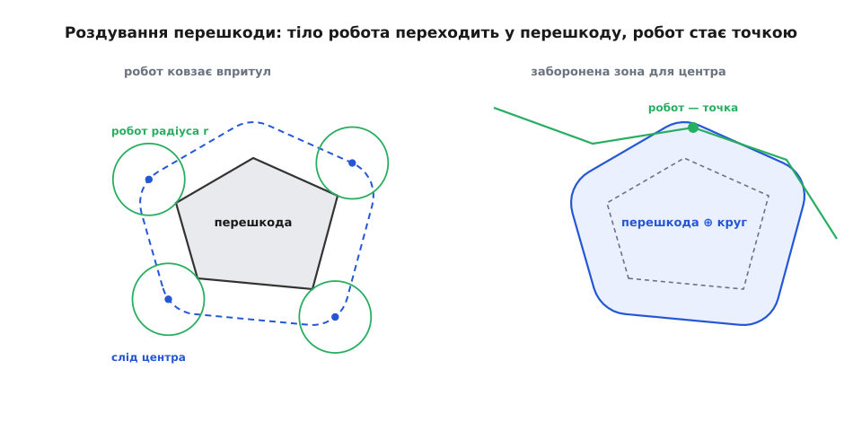
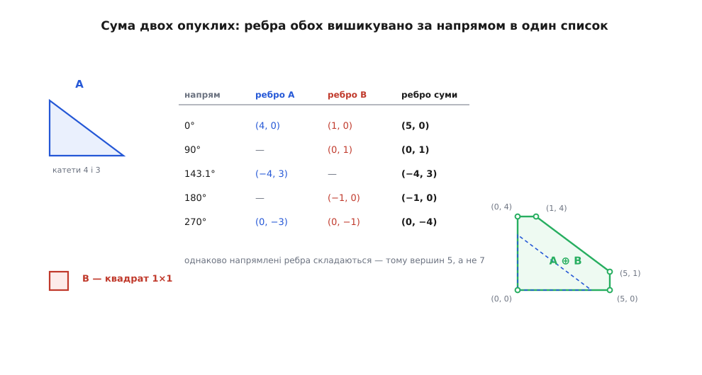
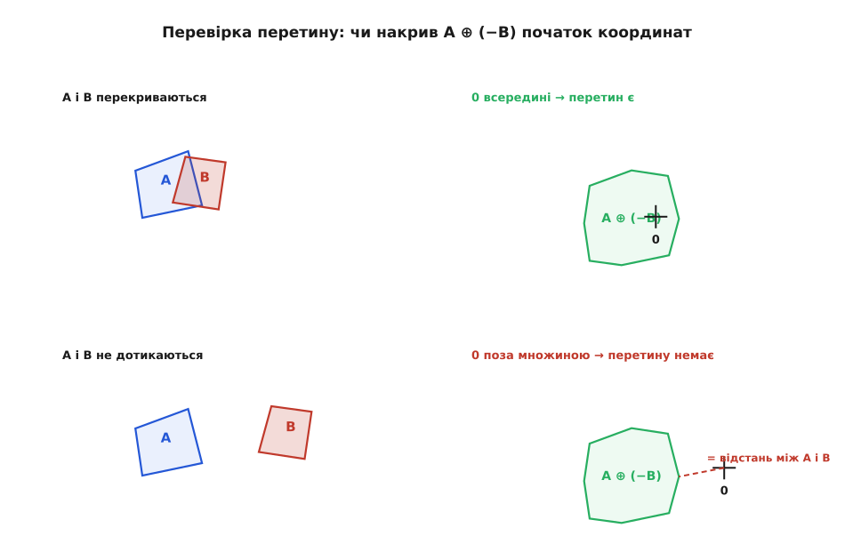

# Сума Мінковського: роздування однієї фігури іншою

<preknowlist>
- [Додавання векторів](book:math/vector-addition) — сума двох векторів покоординатно й геометрично, як прикладання одного до кінця іншого.
- [Скалярний добуток](book:math/dot-product) — проєкція вектора на напрям і розклад добутку за доданками: u·(a + b) = u·a + u·b.
- [Опукла множина](book:math/convex-set) — множина, яка разом із будь-якими двома своїми точками містить увесь відрізок між ними.
</preknowlist>

Круглий робот радіуса 25 см має проїхати між ніжкою стола й стіною; щілина — 44 см. Не проїде, і це видно без математики. А от планувальник маршруту на такій дрібниці спотикається. Найдешевше шукати шлях **для точки**: розстели сітку, пусти пошук по графу — і маршрут готовий. Але точка пролізе в будь-яку шпарину, а корпус зачепить. Планувати ж одразу тілом означає для кожного положення робота перевіряти, чи перекрилися дві фігури — корпус і перешкода. Положень континуум, кожне коштує окремої геометричної перевірки, і вся дешевизна пошуку по графу зникає.

Хочеться лишити планування для точки, але зробити його чесним. Точка в задачі вже є: це мітка на роботі, за якою ми стежимо, — центр корпусу, кут платформи, будь-яка наперед обрана точка відліку. Тоді питання звучить так: **у які положення мітку ставити не можна?**

Нехай R — множина точок, які вкриває корпус, коли мітка стоїть у початку координат. Поставили мітку в точку t — корпус укриває зсунуту множину R + t, тобто всі точки виду r + t. Зіткнення з перешкодою O означає, що корпус і перешкода мають спільну точку:

```
(R + t) ∩ O ≠ ∅
⟺  існують r ∈ R і o ∈ O, для яких  r + t = o
⟺  t = o − r   для якихось r ∈ R, o ∈ O
```

Останній рядок і є відповіддю: заборонені положення мітки — це рівно множина всіх різниць «точка перешкоди мінус точка корпусу». Тіло робота нікуди не поділося, воно **переїхало в перешкоду**: перешкода роздулася, робот став точкою. І будується ця роздута перешкода однією операцією над двома фігурами — беремо всі пари «точка звідти, точка звідси» й додаємо їх як вектори.

### Означення й два способи його бачити

**Сумою Мінковського** двох множин точок A і B називають множину всіх попарних сум:

```
A ⊕ B = { a + b : a ∈ A, b ∈ B }
```

Назва буквальна: складають не фігури як цілості, а їхні точки, і складають їх як вектори. Операцію ввів Герман Мінковський наприкінці XIX століття зовсім не заради роботів — [як вона народилася й де її потім перевідкривали](book:math/minkowski-sum/hist-minkowski-sum.md), винесено окремо.

Означення через «усі пари» точне, але уявити за ним фігуру важко. Прочитаймо його інакше. Зафіксуймо одну точку a ∈ A: множина a + B — це просто копія B, зсунута на вектор a. Пробігши всі a, дістанемо

```
A ⊕ B = ⋃ (B + a)   по всіх a ∈ A
```

— тобто «прикладіть штамп B до кожної точки A й зафарбуйте все, що він накрив». Ця мова одразу дає результат для простих випадків. Квадрат ⊕ круг радіуса r із центром у початку координат — це той самий квадрат, розсунутий на r у кожен бік, але з заокругленими кутами: уздовж сторони штамп мете рівну смугу завширшки r, а от у кутовій точці квадрата він лишає по собі чверть кружала, а не гострий ріг. Відрізок ⊕ відрізок — паралелограм, побудований на цих двох відрізках. Будь-яка фігура ⊕ одна точка v — та сама фігура, зсунута на v; отже складання з точкою є простим перенесенням, а нейтральним елементом операції служить множина з однієї-єдиної точки в початку координат.

Тепер повернімося до робота. Заборонена множина складалася з різниць o − r, тобто це сума перешкоди з **віддзеркаленим** корпусом:

```
заборонена зона = O ⊕ (−R),   де  −R = { −r : r ∈ R }
```

Дзеркало тут не декорація. Для круглого робота з міткою в центрі −R = R, і правило вироджується в звичне «роздми перешкоду на радіус робота» — тому в підручниках його часто й записують без мінуса. Але візьміть довгу платформу з міткою на носі: віддзеркалений корпус витягнеться назад, і роздута зона поповзе в інший бік, ніж підказує чуття. Та сама причина робить вибір мітки не безневинним: пересунули точку відліку на корпусі — уся заборонена зона зсунулася на той самий вектор.


*Слід центра робота, що обходить перешкоду впритул, — це і є межа множини «перешкода ⊕ круг». Ліворуч задача стоїть про два тіла, праворуч — про точку й одну фігуру; відповідь та сама, змінилося лише питання.*

Одне застереження про межі чесності. Усе це виведення трималося на тому, що робот **не повертається**: множина R була сталою. Якщо платформа ще й обертається, то кожному куту θ відповідає свій корпус R(θ) і своя роздута перешкода, а простір положень стає тривимірним — (x, y, θ). Ця конструкція має власне ім'я й окрему логіку — [конфігураційний простір](book:algorithms/configuration-space); сума Мінковського лишається її будівельним каменем, але вже пошаровим.

Тепер щілина з початку розв'язується лічбою, а не оком.

**Умова: круглий робот радіуса 25 см; щілина між ніжкою стола й стіною — 44 см.**

```
роздуваємо обидві перешкоди на корпус робота (круг радіуса 25 см):
  ніжка стола ⊕ круг 25  →  її межа посунулася в щілину на 25 см
  стіна       ⊕ круг 25  →  її межа посунулася в щілину на 25 см

ширина щілини, що лишилася для центра = 44 − 25 − 25 = −6 см
```

Число від'ємне: роздуті перешкоди перекрилися й у щілині не лишилося жодного дозволеного положення центра. Звідси видно й загальне правило — прохід ширини w пропускає круг радіуса r тоді й лише тоді, коли w > 2r, бо після роздування від проходу має лишитися смужка ненульової ширини.

> 🔧 **Навіщо це.** Роздування перешкод на розмір апарата — не «запас про всяк випадок», а точна геометрія: після нього перевірка «чи вільна клітинка» стає перевіркою належності точки фігурі, і планувальники на сітці чи на графі видимості працюють без жодної поправки на габарити. Той самий крок робить фрезерувальник, коли зміщує контур на радіус фрези, і розробник плати, коли розсуває доріжки на зазор.

### Що успадковано від додавання векторів

Операція ⊕ визначена через `+` на точках, тож усі властивості додавання переходять на неї майже задарма — і кожна одразу щось означає.

**Комутативність і асоціативність.** A ⊕ B = B ⊕ A і (A ⊕ B) ⊕ C = A ⊕ (B ⊕ C), бо це те саме про кожну трійку доданків a + b + c. Практично: роздувати перешкоду на корпус робота й на технологічний зазор можна в будь-якому порядку і навіть заздалегідь звести обидва в одну фігуру.

**Перенесення виноситься назовні.** (A + v) ⊕ B = (A ⊕ B) + v. Тому сума не залежить від того, де фігури стоять, — лише від їхньої форми: зсунете доданок — рівно так само зсунеться результат.

**Опуклість зберігається.** Якщо A і B опуклі, то й A ⊕ B опукла. Доведення в один рядок: візьмімо дві точки суми, x = a₁ + b₁ та y = a₂ + b₂, і будь-яку їхню опуклу комбінацію,

```
λx + (1−λ)y = [λa₁ + (1−λ)a₂] + [λb₁ + (1−λ)b₂],   0 ≤ λ ≤ 1
```

у перших квадратних дужках стоїть точка з A (бо A опукла), у других — точка з B, отже весь вираз знову належить A ⊕ B. Ба більше, опуклість можна брати й «наперед»: опукла оболонка суми дорівнює сумі оболонок, тож нема різниці, коли натягувати [опуклу оболонку](book:algorithms/convex-hull) — до складання чи після.

**Найдальша точка в напрямі — це сума найдальших.** Оберімо напрям u і спитаймо, як далеко фігура сягає в цей бік, тобто чому дорівнює найбільше значення u·(a + b). Скалярний добуток розкладається, u·(a + b) = u·a + u·b, а доданки незалежні: a пробігає A, b пробігає B, і ніщо їх не пов'язує. Максимум суми незалежних доданків — сума максимумів. Отже «наскільки далеко в напрямі u» для суми дорівнює сумі таких самих чисел для доданків, а точка-рекордсмен суми — це сума точок-рекордсменів. Це не окремий факт, а той самий факт, з якого далі випливає геть усе про опуклі фігури; його зручний запис — опорна функція, і [її властивості з доведеннями](book:math/minkowski-sum/math-support-function.md) варто розглянути окремо, разом із формулою площі роздутої фігури.

### Опуклі багатокутники: злиття ребер

Опуклий багатокутник однозначно заданий своїми ребрами-векторами: обійдіть його проти годинникової стрілки, випишіть вектори сторін підряд — вони йдуть за зростанням кута напряму й у сумі дають нуль (контур замкнувся). Навпаки, маючи такий упорядкований набір векторів із нульовою сумою, багатокутник можна відновити: прикладайте їх один за одним, почавши з довільної точки.

Що ж робить сума? Візьмімо напрям u й повільно повертаймо його на повний оберт. Вершина-рекордсмен суми — це, як щойно з'ясовано, сума рекордсменів доданків. Поки обертання не «перескочило» жодного ребра, обидва рекордсмени стоять на місці, тож стоїть і рекордсмен суми. Змінюється він рівно тоді, коли змінюється хоч один із двох, — тобто коли u проходить напрям ребра A **або** напрям ребра B. Звідси й відповідь: ребра суми — це ребра обох багатокутників, вишикувані в один спільний список за напрямом; збіглися напрями — відповідні вектори просто складаються в одне довше ребро.

**Умова: A — прямокутний трикутник із вершинами (0,0), (4,0), (0,3); B — одиничний квадрат із кутом у початку координат.**

```
ребра A (обхід проти годинникової):  (4,0) 0°       (−4,3) 143.1°   (0,−3) 270°
ребра B (обхід проти годинникової):  (1,0) 0°   (0,1) 90°   (−1,0) 180°   (0,−1) 270°

злиття за напрямом:
    0°     (4,0) + (1,0)   = (5,0)
   90°                       (0,1)
  143.1°                     (−4,3)
  180°                       (−1,0)
  270°     (0,−3) + (0,−1) = (0,−4)

старт: найнижча-найлівіша вершина A  +  найнижча-найлівіша вершина B = (0,0) + (0,0) = (0,0)
обхід: (0,0) → (5,0) → (5,1) → (1,4) → (0,4) → назад у (0,0)   ✓ контур замкнувся
```

Вершин у результаті п'ять, хоч доданки мали три й чотири: два напрями збіглися, і кожна така пара дала одне ребро замість двох. Це загальне правило — вершин **не більше** m + n, менше рівно на кількість збігів напрямів. А складність видно тут-таки: обидва списки ребер уже відсортовані, лишається злити їх за кутом одним проходом, тобто за O(m + n) — [робочу реалізацію з підводними каменями](book:math/minkowski-sum/proj-convex-minkowski.md) розібрано окремо.


*Таблиця напрямів — це весь алгоритм: злиття двох відсортованих списків. Пунктиром у результаті показано вихідний трикутник, щоб було видно, наскільки квадрат його «роздув».*

Звідси, до речі, і той спосіб порахувати суму, що спадає на думку першим: скласти кожну вершину з кожною й натягнути на отримані m·n точок опуклу оболонку. Він дає правильну відповідь, бо кожна вершина суми справді є сумою двох вершин доданків — рекордсмен у напрямі складається з рекордсменів. Але навпаки не так: більшість попарних сум опиняється всередині й до межі не доходить, тож ми будуємо й сортуємо купу точок, яких у відповіді не буде. Злиття ребер дає той самий результат, не породивши жодної зайвої.

Порахуйте [площу](book:math/shoelace-area) результату — вийде 14, тоді як площі доданків 6 і 1. Сума фігур не додає площ, і надлишок — не похибка, а самостійна величина: саме її вивчення (змішані об'єми) і привело Мінковського до цієї операції.

### Коли фігури неопуклі

Для неопуклих усе ламається, і зрозуміти, де саме, легше через одну властивість, що прямо випливає з означення: **⊕ розподіляється щодо об'єднання**. Якщо A = A₁ ∪ A₂, то

```
(A₁ ∪ A₂) ⊕ B = (A₁ ⊕ B) ∪ (A₂ ⊕ B)
```

бо кожна точка лівої частини — це a + b, де a лежить в одній із двох частин. Звідси й рецепт: неопуклу фігуру ріжуть на опуклі шматки (трикутниками чи більшими опуклими частинами), кожен шматок швидко складають з кожним і все об'єднують.

Тільки от кількість цих шматків нещадна. Якщо один із багатокутників опуклий, а другий — ні, результат у найгіршому разі має Θ(mn) вершин; якщо неопуклі обидва — Θ(m²n²). Це не слабкість алгоритму, а розмір самої відповіді: межа справді має стільки зламів, бо кожна пара «виступ там — виїмка тут» здатна породити власний шматочок контуру. І найдорожче в цьому рецепті не складання пар, а **об'єднання** сотень частково накладених шматків: саме на ньому спотикається арифметика з рухомою комою, коли треба вирішити, збіглися дві майже однакові точки чи ні.

Ще одна пастка того самого ґатунку: щодо перетину ⊕ **не** розподіляється. Загалом справджується лише включення (A ∩ B) ⊕ C ⊆ (A ⊕ C) ∩ (B ⊕ C), і воно зазвичай строге — точка, що потрапила в обидві роздуті множини, могла прийти в них від різних початкових точок. Тому «роздути кожну перешкоду окремо, а потім шукати спільну зону» — коректно, а «спершу перетнути, потім роздути» — ні.

### Різниця Мінковського і перевірка зіткнення

Повернімося до виразу, з якого все почалося: заборонена зона була множиною різниць O ⊕ (−R). Вона заслуговує окремої уваги, бо зводить одну з найчастіших задач обчислювальної геометрії до єдиного запитання про одну точку.

Питання «чи перетинаються фігури A і B» розкривається так само механічно, як на початку:

```
A ∩ B ≠ ∅
⟺  існують a ∈ A, b ∈ B, для яких a = b
⟺  існують a ∈ A, b ∈ B, для яких a − b = 0
⟺  0 ∈ A ⊕ (−B)
```

Дві фігури перетинаються **тоді й лише тоді**, коли множина їхніх різниць накриває початок координат. Задача про два тіла звелася до задачі про одну множину й одну точку. Більше того, відстань між A і B дорівнює відстані від початку координат до цієї множини, а найкоротший вектор із початку до неї — це якраз той зсув, яким фігури розводять, щоб вони перестали перетинатися.


*Одна множина замість двох фігур: усе, що треба знати про взаємне розташування A і B, записано в положенні початку координат щодо A ⊕ (−B).*

Будувати цю множину цілком зазвичай не потрібно й невигідно. Досить уміти для будь-якого напряму назвати найдальшу її точку — а це, за правилом про рекордсменів, різниця найдальших точок доданків, тобто дві дешеві операції над вихідними фігурами. Саме на цьому стоїть [алгоритм GJK](book:algorithms/gjk-collision): він навпомацки будує всередині множини різниць маленькі трикутники, підтягуючи їх до початку координат, і зупиняється, щойно або накрив його, або довів, що не накриє. Саму множину різниць при цьому так і не будують.

У назвах тут панує безлад, про який варто знати заздалегідь. У графіці й фізичних рушіях «різницею Мінковського» звуть саме A ⊕ (−B). У математичній морфології ту саму назву носить інша, справді двоїста операція — **ерозія**: A ⊖ B = ∩ (A − b) по всіх b ∈ B, тобто «множина положень штампа B, за яких він поміщається в A цілком». Дилатація (⊕) розширює фігуру штампом, ерозія (⊖) з'їдає її тим самим штампом ізсередини — на цій парі побудована [морфологічна обробка зображень](book:algorithms/threshold-morphology), де штамп називають структурним елементом.

### Роздути й здути — не те саме, що нічого не робити

Наостанок факт, який рятує від дорогих помилок. Дилатація й ерозія одним і тим самим штампом **не** скасовують одна одну: загалом справджується лише

```
(A ⊕ B) ⊖ B ⊇ A
```

і включення часто строге. Роздуйте квадрат кругом радіуса r — кути заокругляться; здуйте назад тим самим кругом — гострі кути **не** повернуться, бо зсередини заокругленої фігури круг ніде не дістає до колишнього вістря. Результат — не вихідний квадрат, а квадрат із заокругленими кутами; ця пара операцій має власне ім'я (замикання) і власне застосування: вона згладжує вістря й затягує вузькі щілини, залишаючи все інше на місці.

Практичного висновку з цього два. По-перше, роздування необоротне: якщо роздуту перешкоду треба буде колись повернути до початкової форми, зберігайте оригінал, а не сподівайтеся «здути назад». По-друге, саме звідси беруться заокруглені кути на всьому, що обробляють круглим інструментом, — від фрезерованої кишені до [зсунутого контуру](book:algorithms/polygon-offset) у графічному редакторі: там, де фізичний штамп не дістає, матеріал лишається, і жодне уточнення алгоритму цього не змінить.
