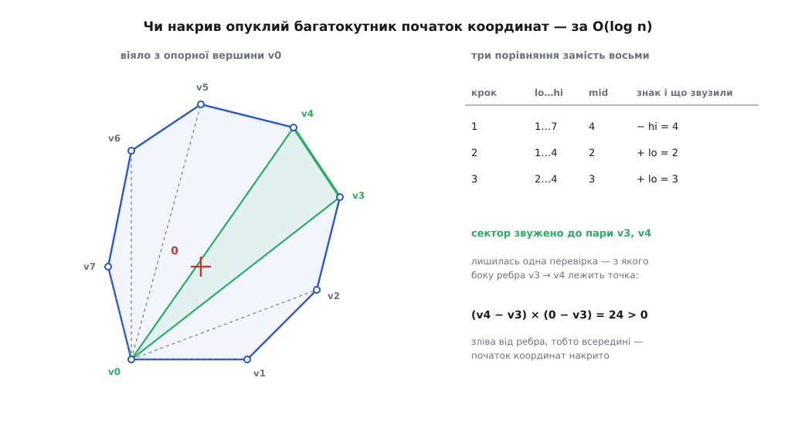

# ⚙️ Сума опуклих багатокутників і перевірка зіткнення: робочий код

Нижче — повна реалізація, яку не соромно покласти в гарячий цикл фізичного рушія: злиття двох опуклих багатокутників за O(m + n), відповідь «чи перетинаються ці двоє» через належність однієї точки одній фігурі, і опорна функція, з якої починається GJK. Уся арифметика ціла — і, як стане видно, це рішення не про швидкість, а про правильність.

### Одне рішення в циклі

Злиття ухвалює на кожному кроці одне-єдине рішення: чиє поточне ребро йде за напрямом раніше — A чи B? Спокуса тут — порахувати кути через `atan2` і порівняти числа. Це і повільно (тригонометрія на кожному кроці), і крихко: кути виходять наближеними, а порівнюємо ми їх на точну рівність.

Правильний інструмент — [векторний добуток](book:math/cross-product), точніше його z-складова `a.x·b.y − a.y·b.x`. Знак відповідає на питання прямо: додатний — b повернутий від a проти годинникової стрілки, від'ємний — за нею, нуль — напрями колінеарні. Два множення й одне віднімання, жодного кута.

Нуль тут не виняток, а робочий випадок: він означає, що ребра однаково напрямлені й складаються в одне довше. Саме через нього в сумі трикутника з квадратом виходить п'ять вершин, а не сім. А отже нуль треба вміти впізнавати **точно**.

Ось де ламаються [числа з рухомою комою](book:programming/floating-point): добутки `a.x·b.y` і `a.y·b.x` округляються кожен по-своєму, і різниця двох майже рівних чисел дає не 0, а щось на кшталт 10⁻¹⁶. Два колінеарні ребра розповзаються на два різні напрями, цикл дописує зайву вершину, контур не замикається — і виявиться це через тисячу кадрів, коли рушій пропустить зіткнення. Тому координати тримаємо цілими: або пікселі, або фіксована кома (координата в 1/1024 одиниці — те саме ціле число, лише з домовленістю про масштаб).

> 🔧 **Навіщо це.** Ціла арифметика тут — рішення про правильність, а не про швидкість. Усе, що алгоритм питає в геометрії, — це знак одного виразу; поки знак точний, результат точний до останньої вершини, і підбирати «епсилони» не доводиться взагалі. Щойно координати стають дробовими, доводиться вигадувати поріг колінеарності — а він завжди або злипає різні напрями, або розводить однакові, залежно від масштабу сцени.

### Нормалізація входу

Злиття вимагає від обох багатокутників трьох речей, і кожна має причину.

**Обхід проти годинникової стрілки.** Тільки за такого обходу напрями ребер зростають; за годинниковою вони спадають, і всі порівняння перевернуться. Орієнтацію дає знак подвоєної орієнтованої площі ([формула шнурівки](book:math/shoelace-area)): від'ємний — список треба розвернути. Нуль означає вироджений вхід, точку або відрізок, і його не чіпаємо — розвертати там нічого.

**Жодних повторів і вершин посеред ребра.** Три точки на одній прямій дають усередині одного багатокутника два ребра з однаковим напрямом, а весь порядок побудований на тому, що напрями зростають **строго**. Одне таке ребро-двійник псує лічбу вершин у результаті.

**Старт із найнижчої, а серед рівних — найлівішої вершини.** Це найцікавіше з трьох, бо виглядає як довільна домовленість, а насправді вибір єдино можливий. Найнижча-найлівіша вершина — це найдальша точка фігури в напрямі, ледь-ледь відхиленому від «прямо вниз»: спершу мінімізуємо y, а рівність розв'язуємо на користь меншого x. Найдальші ж точки складаються: найдальша точка суми в будь-якому напрямі є сумою найдальших точок доданків. Отже стартова вершина результату дорівнює сумі стартових вершин — і обхід можна вести прямо звідти, не шукаючи потім, з чого починати.

Друге, що дає цей старт: виписаний із неї список ребер відсортований за напрямом у межах [0°, 360°). Перше ребро дивиться вгору-праворуч (його кут менший за 180°, бо всі інші вершини не нижчі за стартову), останнє — вниз-ліворуч (кут не менший за 180°). Обидва списки починаються й закінчуються в одному й тому самому діапазоні — саме те, чого потребує злиття.

:::tabs

```cpp
#include <algorithm>
#include <vector>

struct Pt {
    long long x, y;
    Pt operator+(Pt o) const { return {x + o.x, y + o.y}; }
    Pt operator-(Pt o) const { return {x - o.x, y - o.y}; }
    Pt operator-()     const { return {-x, -y}; }
    bool operator==(Pt o) const { return x == o.x && y == o.y; }
};

// z-складова векторного добутку: >0 — b лівіше a, <0 — правіше, 0 — той самий напрям
inline long long cross(Pt a, Pt b) { return a.x * b.y - a.y * b.x; }

// Без повторів і вершин посеред ребра, обхід проти годинникової стрілки,
// вершина 0 — найнижча, а серед рівних — найлівіша.
void normalize(std::vector<Pt>& p) {
    if (p.empty()) return;
    p.erase(std::unique(p.begin(), p.end()), p.end());
    while (p.size() > 1 && p.front() == p.back()) p.pop_back();

    long long area2 = 0;                        // подвоєна орієнтована площа
    for (size_t i = 0, n = p.size(); i < n; ++i) area2 += cross(p[i], p[(i + 1) % n]);
    if (area2 < 0) std::reverse(p.begin(), p.end());   // ==0 — точка або відрізок, лишаємо

    if (p.size() > 2) {                         // викинути вершини всередині ребра
        std::vector<Pt> r;
        r.reserve(p.size());
        for (Pt v : p) {
            while (r.size() >= 2 && cross(r.back() - r[r.size() - 2], v - r.back()) == 0)
                r.pop_back();
            r.push_back(v);
        }
        while (r.size() > 2 && cross(r.back() - r[r.size() - 2], r[0] - r.back()) == 0)
            r.pop_back();
        while (r.size() > 2 && cross(r[0] - r.back(), r[1] - r[0]) == 0)
            r.erase(r.begin());
        p.swap(r);
    }

    size_t k = 0;
    for (size_t i = 1; i < p.size(); ++i)
        if (p[i].y < p[k].y || (p[i].y == p[k].y && p[i].x < p[k].x)) k = i;
    std::rotate(p.begin(), p.begin() + k, p.end());
}
```

```rust
#[derive(Clone, Copy, PartialEq, Eq, Debug)]
struct Pt { x: i64, y: i64 }

impl std::ops::Add for Pt {
    type Output = Pt;
    fn add(self, o: Pt) -> Pt { Pt { x: self.x + o.x, y: self.y + o.y } }
}
impl std::ops::Sub for Pt {
    type Output = Pt;
    fn sub(self, o: Pt) -> Pt { Pt { x: self.x - o.x, y: self.y - o.y } }
}
impl std::ops::Neg for Pt {
    type Output = Pt;
    fn neg(self) -> Pt { Pt { x: -self.x, y: -self.y } }
}

/// z-складова векторного добутку: >0 — b лівіше a, <0 — правіше, 0 — той самий напрям
fn cross(a: Pt, b: Pt) -> i64 { a.x * b.y - a.y * b.x }

/// Без повторів і вершин посеред ребра, обхід проти годинникової стрілки,
/// вершина 0 — найнижча, а серед рівних — найлівіша.
fn normalize(p: &mut Vec<Pt>) {
    if p.is_empty() { return; }
    p.dedup();
    while p.len() > 1 && p[0] == p[p.len() - 1] { p.pop(); }

    let n = p.len();                            // подвоєна орієнтована площа
    let area2: i64 = (0..n).map(|i| cross(p[i], p[(i + 1) % n])).sum();
    if area2 < 0 { p.reverse(); }               // ==0 — точка або відрізок, лишаємо

    if p.len() > 2 {                            // викинути вершини всередині ребра
        let mut r: Vec<Pt> = Vec::with_capacity(p.len());
        for &v in p.iter() {
            while r.len() >= 2
                && cross(r[r.len() - 1] - r[r.len() - 2], v - r[r.len() - 1]) == 0 {
                r.pop();
            }
            r.push(v);
        }
        while r.len() > 2
            && cross(r[r.len() - 1] - r[r.len() - 2], r[0] - r[r.len() - 1]) == 0 { r.pop(); }
        while r.len() > 2
            && cross(r[0] - r[r.len() - 1], r[1] - r[0]) == 0 { r.remove(0); }
        *p = r;
    }

    let k = (0..p.len()).min_by_key(|&i| (p[i].y, p[i].x)).unwrap();
    p.rotate_left(k);
}
```

:::

### Злиття двох списків ребер

:::tabs

```cpp
// Сума Мінковського двох опуклих багатокутників — O(m + n).
std::vector<Pt> minkowski(std::vector<Pt> a, std::vector<Pt> b) {
    normalize(a);
    normalize(b);
    const size_t n = a.size(), m = b.size();

    const Pt a0 = a[0], a1 = a[1 % n], b0 = b[0], b1 = b[1 % m];
    a.push_back(a0); a.push_back(a1);      // хвіст, щоб не брати індекси за модулем
    b.push_back(b0); b.push_back(b1);

    std::vector<Pt> res;
    res.reserve(n + m);
    size_t i = 0, j = 0;
    while (i < n || j < m) {
        res.push_back(a[i] + b[j]);
        const long long c = cross(a[i + 1] - a[i], b[j + 1] - b[j]);
        if (c >= 0 && i < n) ++i;          // ребро A за напрямом не пізніше — беремо його
        if (c <= 0 && j < m) ++j;          // ребро B за напрямом не пізніше — беремо його
    }
    return res;
}
```

```rust
/// Сума Мінковського двох опуклих багатокутників — O(m + n).
fn minkowski(mut a: Vec<Pt>, mut b: Vec<Pt>) -> Vec<Pt> {
    normalize(&mut a);
    normalize(&mut b);
    let (n, m) = (a.len(), b.len());

    let (a0, a1, b0, b1) = (a[0], a[1 % n], b[0], b[1 % m]);
    a.push(a0); a.push(a1);                // хвіст, щоб не брати індекси за модулем
    b.push(b0); b.push(b1);

    let mut res = Vec::with_capacity(n + m);
    let (mut i, mut j) = (0usize, 0usize);
    while i < n || j < m {
        res.push(a[i] + b[j]);
        let c = cross(a[i + 1] - a[i], b[j + 1] - b[j]);
        if c >= 0 && i < n { i += 1; }      // ребро A за напрямом не пізніше — беремо його
        if c <= 0 && j < m { j += 1; }      // ребро B за напрямом не пізніше — беремо його
    }
    res
}
```

:::

Цикл дописує суму поточних вершин і просуває індекс того багатокутника, чиє ребро йде за напрямом не пізніше. Три деталі варті пояснення.

**Чому при нулі просуваються обидва індекси.** Нуль означає збіг напрямів: два ребра стають одним, тож і вершину треба пропустити один раз, а не двічі. Саме тут із трьох плюс чотирьох виходить п'ять.

**Чому нуль не може означати «протилежні напрями».** Векторний добуток дорівнює нулю і для збігу, і для розвороту на 180°, а другий випадок зіпсував би все: просунути обидва індекси там було б грубою помилкою. Такий стан недосяжний. На старті обидва поточні кути лежать у [0°, 180°), тож різняться менш ніж на 180°. Далі кожен крок цю властивість зберігає: поворот на кожній вершині опуклого багатокутника менший за 180°, тож просунутий індекс переносить кут у той самий піввідкритий проміжок завширшки 180°, де вже стоїть другий. А коли різниця кутів за модулем менша за 180°, нуль векторного добутку означає рівно нульову різницю — той самий напрям.

**Чому цикл не зависає.** Коли один список вичерпано, ребро для нього береться по колу — знову перше, найменше за кутом. Здавалося б, знак може заклинити обидва індекси. Але сума зовнішніх кутів опуклого багатокутника дорівнює 360°, тож від першого його ребра до останнього набігає **більш ніж** 180°; а всі невитрачені ребра другого списку стоять за останнім ребром першого. Різниця виходить більша за 180°, знак вимагає просунути саме другий індекс — і той доходить до кінця. Перевірки `i < n` та `j < m` у гілках потрібні рівно для цього: без них індекс вилетів би за хвіст.

### Зіткнення: одна точка замість двох фігур

Дві опуклі фігури перетинаються тоді й лише тоді, коли множина їхніх різниць A ⊕ (−B) накриває початок координат. Будує її той самий `minkowski` — лише другий доданок треба спершу віддзеркалити.

Дзеркалення варте окремого слова, бо ховає дві помилки. Перша — просто забути мінус: код тоді рахує A ⊕ B, це теж коректна опукла фігура, вона теж будується без збоїв, і відповідь «перетинаються» приходить зовсім не тоді, коли треба. Друга тонша: у площині заміна p → −p **не** міняє напряму обходу, бо це поворот на 180°, а не відбиття від прямої. Список лишається проти годинникової стрілки — але найнижчою стає інша вершина, тому нормалізацію після дзеркалення пропускати не можна. У коді нижче її робить сам `minkowski`.

Лишається спитати, чи лежить початок координат усередині опуклого багатокутника. Обходити всі n ребер не треба: з опорної вершини фігура ділиться на сектори, промені яких ідуть за зростанням кута, тож потрібний сектор знаходиться [двійковим пошуком](book:algorithms/binary-search) за O(log n). Дві перевірки відсікають усе поза крайніми променями, пошук звужує сектор до пари сусідніх вершин, і одне останнє порівняння каже, з якого боку ребра між ними лежить точка.


*Промені віяла впорядковані за кутом, тому по них можна бігти двійковим пошуком: три порівняння замість восьми, а вирішує все знак на останньому ребрі.*

:::tabs

```cpp
// Чи лежить q в опуклому CCW-багатокутнику v (межа рахується всередині). O(log n).
// v уже нормалізований, тож v[0] — опорна вершина віяла.
bool pointInConvex(const std::vector<Pt>& v, Pt q) {
    const size_t n = v.size();
    if (n == 1) return q == v[0];
    if (n == 2) {                                   // вироджений випадок — відрізок
        const Pt d = v[1] - v[0], e = q - v[0];
        const long long t = d.x * e.x + d.y * e.y;
        return cross(d, e) == 0 && t >= 0 && t <= d.x * d.x + d.y * d.y;
    }
    if (cross(v[1] - v[0], q - v[0]) < 0) return false;       // поза віялом з одного боку
    if (cross(v[n - 1] - v[0], q - v[0]) > 0) return false;   // ...і з другого

    size_t lo = 1, hi = n - 1;                      // шукаємо сектор між lo та lo+1
    while (hi - lo > 1) {
        const size_t mid = (lo + hi) / 2;
        if (cross(v[mid] - v[0], q - v[0]) >= 0) lo = mid; else hi = mid;
    }
    return cross(v[hi] - v[lo], q - v[lo]) >= 0;    // з внутрішнього боку ребра
}

// Чи перетинаються два опуклі багатокутники.
bool convexIntersect(const std::vector<Pt>& A, const std::vector<Pt>& B) {
    std::vector<Pt> mirrored;
    mirrored.reserve(B.size());
    for (Pt p : B) mirrored.push_back(-p);          // саме −B, а не зсув B
    return pointInConvex(minkowski(A, mirrored), Pt{0, 0});
}
```

```rust
/// Чи лежить q в опуклому CCW-багатокутнику v (межа рахується всередині). O(log n).
/// v уже нормалізований, тож v[0] — опорна вершина віяла.
fn point_in_convex(v: &[Pt], q: Pt) -> bool {
    let n = v.len();
    if n == 1 { return q == v[0]; }
    if n == 2 {                                     // вироджений випадок — відрізок
        let (d, e) = (v[1] - v[0], q - v[0]);
        let t = d.x * e.x + d.y * e.y;
        return cross(d, e) == 0 && t >= 0 && t <= d.x * d.x + d.y * d.y;
    }
    if cross(v[1] - v[0], q - v[0]) < 0 { return false; }      // поза віялом з одного боку
    if cross(v[n - 1] - v[0], q - v[0]) > 0 { return false; }  // ...і з другого

    let (mut lo, mut hi) = (1usize, n - 1);         // шукаємо сектор між lo та lo+1
    while hi - lo > 1 {
        let mid = (lo + hi) / 2;
        if cross(v[mid] - v[0], q - v[0]) >= 0 { lo = mid } else { hi = mid }
    }
    cross(v[hi] - v[lo], q - v[lo]) >= 0            // з внутрішнього боку ребра
}

/// Чи перетинаються два опуклі багатокутники.
fn convex_intersect(a: &[Pt], b: &[Pt]) -> bool {
    let mirrored: Vec<Pt> = b.iter().map(|&p| -p).collect();   // саме −B, а не зсув B
    point_in_convex(&minkowski(a.to_vec(), mirrored), Pt { x: 0, y: 0 })
}
```

:::

### Опорна функція: коли множину різниць будувати не треба

Заради однієї відповіді «так чи ні» будувати всю множину різниць марнотратно: ми породжуємо m + n вершин, а користуємось однією точкою. Дешевша дорога спирається на те саме правило про найдальші точки — щоб дізнатися, як далеко множина різниць сягає в напрямі u, досить відняти найдальшу точку B у напрямі −u від найдальшої точки A в напрямі u:

```
support(u) = far(A, u) − far(B, −u)
```

Це і є вхідна точка [алгоритму GJK](book:algorithms/gjk-collision), опублікованого 1988 року Елмером Ґілбертом, Деніелом Джонсоном і С. Сатією Кіртхі в IEEE Journal of Robotics and Automation: він будує всередині множини різниць послідовність дрібних симплексів, підтягуючи їх до початку координат, і за кілька викликів опорної функції або накриває його, або доводить, що не накриє. Самої множини різниць GJK не будує ніколи — вона існує лише як ця функція.

Одна вимога до `far`, про яку легко забути: коли напрям u перпендикулярний до ребра, найдальших вершин дві, і вибір між ними мусить бути **сталим**. Інакше два виклики з тим самим u повернуть різні точки, і цикл GJK зациклиться, ганяючи ту саму пару. Строге порівняння `>` дає цю сталість задарма: за рівності лишається перша знайдена вершина.

:::tabs

```cpp
#include <cstdio>

// Найдальша точка багатокутника в напрямі u. Строге «>» — щоб за рівності
// відповідь була та сама, інакше GJK зациклиться на перпендикулярному ребрі.
Pt far(const std::vector<Pt>& v, Pt u) {
    size_t best = 0;
    long long bestDot = v[0].x * u.x + v[0].y * u.y;
    for (size_t i = 1; i < v.size(); ++i) {
        const long long d = v[i].x * u.x + v[i].y * u.y;
        if (d > bestDot) { bestDot = d; best = i; }
    }
    return v[best];
}

// Опорна точка множини різниць A ⊕ (−B) — без побудови самої множини.
Pt support(const std::vector<Pt>& A, const std::vector<Pt>& B, Pt u) {
    return far(A, u) - far(B, -u);
}

int main() {
    const std::vector<Pt> tri = {{0, 0}, {4, 0}, {0, 3}};
    const std::vector<Pt> sq  = {{0, 0}, {1, 0}, {1, 1}, {0, 1}};

    for (Pt p : minkowski(tri, sq)) printf("(%lld,%lld) ", p.x, p.y);
    putchar('\n');

    std::vector<Pt> away;                       // той самий трикутник, зсунутий убік
    for (Pt p : tri) away.push_back(p + Pt{10, 0});
    printf("%d %d\n", convexIntersect(tri, sq), convexIntersect(tri, away));
}
```

```rust
/// Найдальша точка багатокутника в напрямі u. Строге «>» — щоб за рівності
/// відповідь була та сама, інакше GJK зациклиться на перпендикулярному ребрі.
fn far(v: &[Pt], u: Pt) -> Pt {
    let mut best = v[0];
    let mut best_dot = v[0].x * u.x + v[0].y * u.y;
    for &p in v.iter().skip(1) {
        let d = p.x * u.x + p.y * u.y;
        if d > best_dot { best_dot = d; best = p; }
    }
    best
}

/// Опорна точка множини різниць A ⊕ (−B) — без побудови самої множини.
fn support(a: &[Pt], b: &[Pt], u: Pt) -> Pt { far(a, u) - far(b, -u) }

fn main() {
    let tri = vec![Pt { x: 0, y: 0 }, Pt { x: 4, y: 0 }, Pt { x: 0, y: 3 }];
    let sq = vec![Pt { x: 0, y: 0 }, Pt { x: 1, y: 0 },
                  Pt { x: 1, y: 1 }, Pt { x: 0, y: 1 }];

    for p in minkowski(tri.clone(), sq.clone()) { print!("({},{}) ", p.x, p.y); }
    println!();

    // той самий трикутник, зсунутий убік
    let away: Vec<Pt> = tri.iter().map(|&p| p + Pt { x: 10, y: 0 }).collect();
    println!("{} {}", convex_intersect(&tri, &sq), convex_intersect(&tri, &away));
}
```

:::

### Складність і пастки

Побудова суми — O(m + n) після нормалізації, і це оптимально: у результаті буває до m + n вершин, менше рівно на кількість збігів напрямів. Нормалізація коштує стільки ж, але її роблять раз при завантаженні форми, а не в кожному кадрі. Перевірка належності — O(log n). Опорна функція в написаному вигляді — O(n) на виклик; для дрібних багатокутників (а в рушіях вони дрібні) лінійний прохід зазвичай швидший за двійковий пошук по вершинах: він передбачуваний для процесора й лягає у векторні інструкції.

**Розрядність.** Головна пастка цілої арифметики. Хай координати не перевищують C за модулем. У сумі вони подвоюються до 2C; у `pointInConvex` ми беремо різниці вершин суми — уже до 4C; а векторний добуток дві такі величини перемножує й віднімає, тобто сягає 32·C². У 64-бітному цілому вміщується 9.22·10¹⁸, звідси

```
32·C² ≤ 9.22·10¹⁸   →   C ≤ 5.4·10⁸
```

Тримайте вхідні координати нижче за 5·10⁸ — і жоден проміжний добуток не переповниться. Із фіксованою комою в 1/1024 одиниці це лишає запас у ±5·10⁵ цілих одиниць, чого вистачає будь-якій сцені. Перевищите — і [переповнення](book:programming/overflow-wraparound) мовчки переверне знак векторного добутку, тобто збреше саме в тому єдиному рішенні, на якому все стоїть. Той самий рахунок треба зробити й для `far`: там множаться координата на складову напряму, тож напрям краще тримати коротким, а не масштабувати його разом зі сценою.

**Вироджені входи.** Точка й відрізок проходять через `minkowski` без окремої гілки: у точки ребро нульове, а нульовий вектор дає в добутку нуль, тож індекс просувається саме тоді, коли треба. А от `pointInConvex` без гілок для n = 1 і n = 2 просто впаде — віяла там немає. Ці випадки виникають самі: щойно одна з фігур виродилася в точку, вироджується й уся сума.

**Точка відліку.** Результат `minkowski` — не «фігура взагалі», а конкретний набір координат, і він залежить від того, де стоять доданки: зсунули A на вектор — рівно так само зсунулася сума. Для перевірки зіткнення це саме те, що треба (взаємне положення фігур і є питанням), а от кешувати роздуту форму між кадрами можна лише разом із її точкою відліку — інакше повторне використання тихо зсуне всю геометрію.

### Перевірка на прикладі

Трикутник із вершинами (0,0), (4,0), (0,3) і одиничний квадрат дають на виході:

```
(0,0) (5,0) (5,1) (1,4) (0,4)
1 0
```

Той самий п'ятикутник, що виходить, якщо розписати злиття ребер на папері: напрями 0° і 270° збіглися в обох доданках, тож вершин п'ять, а не сім. Другий рядок — дві перевірки зіткнення: трикутник із квадратом перетинаються, а той самий трикутник із власною копією, зсунутою на (10, 0), — ні.
