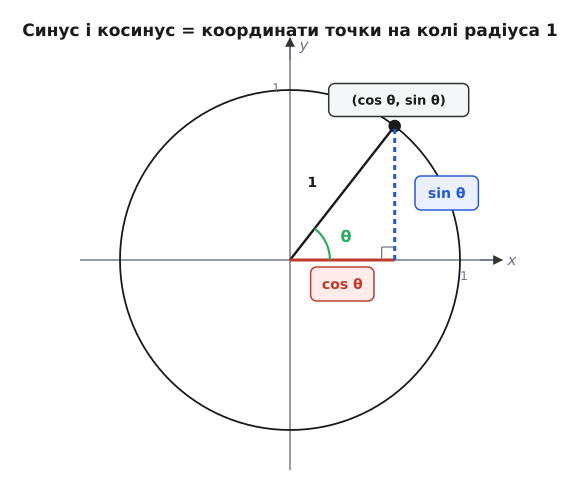
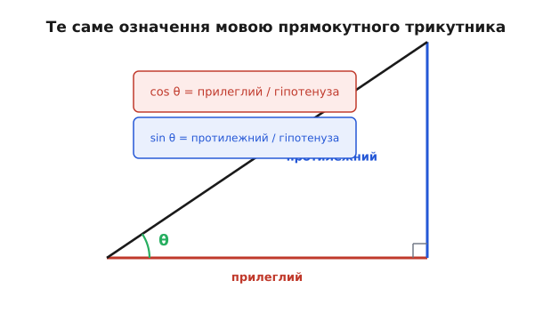
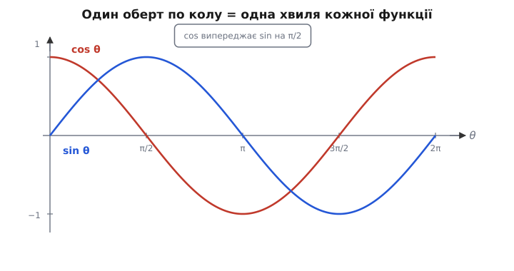

# Синус і косинус

Уявіть колесо, що рівномірно крутиться. Точка на ободі ходить по колу — а от її **тінь** на горизонтальній підлозі совається вперед-назад: до краю, назад через центр, до іншого краю, знову назад. Рух по колу простий і рівномірний, але тінь рухається нерівно — біля країв сповільнюється й завмирає на мить, посередині мчить найшвидше. Звідки береться саме такий рух? І чому та сама крива виринає скрізь, де щось коливається чи обертається — від маятника й змінного струму до звукової хвилі?

Відповідь — дві функції, синус і косинус. Вони не «формули з підручника», які треба завчити; це **відповідь на одне конкретне запитання**: якщо точка йде по колу рівномірно, де саме вона зараз? Варто поставити запитання так — і означення стає неминучим, а всі властивості випливають із картинки самі. Почнемо з кола, бо саме коло — першопричина, з якої все інше витікає.

## Чому коло, а не трикутник

Синус і косинус часто вводять через прямокутний трикутник: «відношення сторін». Це правда, але це не **корінь** — це наслідок, придатний лише для гострих кутів. Бо що таке синус кута 120°? Трикутника з таким внутрішнім кутом між катетом і гіпотенузою не буває. А синус 90°? Гіпотенуза злилася б із катетом. Означення через трикутник упирається в стіну рівно тоді, коли кут виходить за межі гострого — а в реальних задачах кут крутиться вільно, на повний оберт і далі.

Тож почнімо не з трикутника, а з найпростішого рівномірного руху, який тільки буває, — руху по колу. Візьмемо коло **радіуса один** (звідси його назва — одиничне коло) із центром у початку координат. Чому саме радіус один? Бо тоді ніщо не масштабується: координати точки на колі — це вже й є чисті значення, без зайвого множника. Більший радіус лише розтягнув би всю картину однаково в усі боки.

Тепер головний крок. Запустимо точку по цьому колу й вестимемо кут θ (тета, гр. *θῆτα*) від додатного напрямку осі x, проти годинникової стрілки. Кожному куту θ відповідає **рівно одна** точка на колі. У цієї точки є дві координати — і саме їх ми називаємо косинусом і синусом:

```
точка на колі = (cos θ, sin θ)
```

Косинус θ — це **x-координата** точки; синус θ — її **y-координата**. Оце й усе означення. Не «відношення сторін», а просто: куди по горизонталі й по вертикалі зайшла точка, що пройшла кутом θ по одиничному колу.


*Радіус проведено під кутом θ до осі x. Червоний відрізок уздовж осі x — це cos θ, синій вертикальний — sin θ. Сам радіус має довжину 1, тож точка завжди лежить точно на колі, хоч би куди він обертався.*

Подивімося, чи це означення оживає на знайомих кутах. При θ = 0 точка сидить на правому краю кола, у (1, 0): отже cos 0 = 1, sin 0 = 0. Покрутимо до θ = 90°: точка піднялася на самий верх, у (0, 1), тож cos 90° = 0, а sin 90° = 1. Ще чверть оберту, θ = 180° — точка на лівому краю, (−1, 0): cos 180° = −1, sin 180° = 0. І нарешті θ = 270°, точка внизу, (0, −1): cos 270° = 0, sin 270° = −1.

```
θ =   0°  →  (1,  0)   →  cos = 1,   sin = 0
θ =  90°  →  (0,  1)   →  cos = 0,   sin = 1
θ = 180°  →  (−1, 0)   →  cos = −1,  sin = 0
θ = 270°  →  (0, −1)   →  cos = 0,   sin = −1
```

Зверніть увагу, що сталося само собою: для кутів за межами гострого синус і косинус **просто є** — бо точка на колі є завжди, і її координати теж. Сходивши на ліву половину кола, x-координата стала від'ємною — тому cos 180° = −1. Опустившись униз, y-координата стала від'ємною — тому sin 270° = −1. Жодного зусилля: знак функції — це просто знак відповідної координати в тій чверті, де опинилася точка. Те, що з трикутником вимагало окремих застережень, із колом виходить даром.

> 🔧 **Навіщо це.** Коли давач кута (енкодер) на валу повертає 270°, прошивці потрібні `sin` і `cos` цього кута, щоб порахувати проєкції — скажімо, дві складові струму в керуванні двигуном. Кут там вільно бігає 0…360° і за межі, і означення через коло працює на всьому діапазоні без жодного «а тут трикутника вже немає». Саме тому в реальному коді кут майже завжди мислять як точку на колі, а не як ріг трикутника.

## Звідки тоді береться трикутник

Тепер видно, чому трикутникове означення все ж правильне — для гострого кута воно ховається всередині тієї самої картинки. Опустимо з точки на колі перпендикуляр на вісь x. Утвориться прямокутний трикутник: гіпотенуза — це радіус (довжиною 1), горизонтальний катет дорівнює x-координаті, тобто cos θ, а вертикальний катет — y-координаті, тобто sin θ.

У прямокутному трикутнику синус кута за означенням — це протилежний катет, поділений на гіпотенузу. Підставмо наші довжини:

```
sin θ = протилежний / гіпотенуза = sin θ / 1 = sin θ
cos θ = прилеглий   / гіпотенуза = cos θ / 1 = cos θ
```

Усе сходиться — але лише тому, що гіпотенуза дорівнює одиниці й ділення нічого не змінює. Ось де першопричина радіуса один: він прирівнює «відношення сторін» до «координати точки». А якщо трикутник більший, із гіпотенузою довжини r? Тоді катети просто масштабуються разом із ним:

```
протилежний = r · sin θ
прилеглий   = r · cos θ
```

Тобто синус і косинус — це **частка від цілого**: яку частину гіпотенузи становить кожен катет, незалежно від розміру трикутника. Подвоїш гіпотенузу — подвояться обидва катети, а відношення лишиться тим самим. Саме тому синус і косинус залежать **лише від кута**, а не від розмірів фігури: вони вимірюють форму, не величину.


*Для гострого кута θ означення через коло й через трикутник — те саме: прилеглий катет, поділений на гіпотенузу, дає cos θ, а протилежний — sin θ. Коло лише знімає обмеження «кут має бути гострий».*

Ця трикутникова мова — не просто перевірка узгодженості. Саме нею синус і косинус заходять у геодезію, навігацію й будь-яку задачу, де треба з виміряного кута й однієї довжини дістати іншу. Виміряв кут до вершини гори й відстань до її підніжжя — і вже знаєш висоту: висота = відстань · tg θ, а тангенс (лат. *tangens* — дотичний) — це просто sin θ / cos θ, відношення двох наших катетів між собою. Тут проступає той самий прямокутний трикутник, що стоїть за теоремою Піфагора: три його сторони пов'язані жорстко, і знання кута замикає зв'язок.

## Радіани: чому кут варто міряти довжиною дуги

Перш ніж рушити далі, розберімося з одиницями кута, бо від них залежить, чи будуть формули чистими. Градуси — людська умовність: хтось колись поділив повний оберт на 360 частин (число зручне, бо ділиться на безліч дільників, і близьке до кількості днів у році). Математика про це число нічого не знає, і в розрахунках воно тягне за собою множники-перевідники.

Природніший спосіб: міряти кут **довжиною дуги**, яку він вирізає на одиничному колі. Повне коло радіуса 1 має довжину 2π (пі, гр. *περιφέρεια* — окружність) — отже повний оберт це 2π радіанів, півоберту — π, чверть — π/2. Слово «радіан» (від лат. *radius* — промінь) саме й каже: кут, виміряний у радіусах дуги.

```
180° = π   радіанів
 90° = π/2 радіанів
360° = 2π  радіанів
```

Навіщо ця морока, якщо градуси звичніші? Бо в радіанах для малого кута справджується разюче проста річ: дуга, синус і сам кут майже зливаються. Коли θ маленький (у радіанах), точка ще не встигла відхилитися від низу дуги, і її висота над віссю майже дорівнює пройденій дузі:

```
sin θ ≈ θ        (для малого θ у радіанах)
cos θ ≈ 1
```

Перевірмо на числах: при θ = 0.05 рад маємо sin θ = 0.049979…, тобто похибка близько однієї десятитисячної. Ця близькість — не випадковість, а наслідок означення дуги, і вона тримає половину фізики коливань: маятник гойдається синусоїдально саме тому, що для малих відхилень sin θ можна замінити на θ, і рівняння руху стає простим. У градусах це чудо зникло б за множником π/180. Тому всюди, де синус і косинус зустрічаються з аналізом — границями, [похідними](topic:math/derivative), рядами — кут беруть **у радіанах**. Зокрема, акуратний результат «[похідна синуса — це косинус](topic:math/sine-derivative)» правдивий лише в радіанах; у градусах він обріс би стороннім коефіцієнтом.

## Періодичність: коло замикається саме на себе

Тепер повернімося до руху по колу й помітимо те, що було очевидним, та ми ще не назвали вголос. Точка, обійшовши повне коло, повертається точно туди, звідки вийшла. Кут θ і кут θ + 360° (тобто θ + 2π) показують на **ту саму точку** — а отже дають ті самі координати:

```
cos(θ + 2π) = cos θ
sin(θ + 2π) = sin θ
```

Це і є **періодичність** (гр. *περίοδος* — обхід по колу): функція повторює свої значення через сталий проміжок, тут — через 2π. Період 2π — не випадкове число й не властивість, яку треба запам'ятати окремо: це просто **довжина кола радіуса один**. Геометрія замкнулася сама на себе, і функції вслід за нею.

Накресливши, як cos θ і sin θ змінюються в міру обертання, дістаємо дві хвилі — славнозвісну синусоїду. Косинус стартує з вершини (бо при θ = 0 точка праворуч, x = 1), синус стартує з нуля (бо тоді y = 0) і йде вгору. Далі обидва плавно гойдаються між −1 і +1, і за один повний оберт кожен викреслює рівно одну хвилю.


*Горизонтальна вісь — кут θ від 0 до 2π, тобто один оберт. Косинус (червоний) виходить з 1, синус (синій) — з 0. Обидві хвилі мають однакову форму, лише зсунуті одна відносно одної на чверть оберту.*

Тепер видно й те, чому тінь точки на підлозі рухалася нерівно. Її горизонтальне положення — це cos θ, а кут θ росте рівномірно (колесо крутиться рівномірно). Біля країв (θ близько 0 чи π) косинус майже плаский — змінюється повільно, тінь завмирає. Посередині (θ біля π/2) косинус найкрутіший — тінь мчить. Нерівний рух тіні — це проста рівномірність кола, побачена збоку, у проєкції на одну вісь.

> 🔧 **Навіщо це.** Будь-який періодичний сигнал — мережева напруга 50 Гц, тон у динаміку, биття серця на кардіограмі — найприродніше описувати синусом: задаєш амплітуду, частоту й початкову фазу, і одна формула A·sin(ω·t + φ) тримає весь сигнал у часі. Те, що період функції точно 2π, лежить в основі всього спектрального аналізу — [ідеї розкласти сигнал у суму синусоїд](topic:math/fourier-idea): кожна складова має свій цілий період, що рівно вкладається у вікно.

## Як синус і косинус пов'язані між собою

Дві функції, що народилися з координат однієї точки, не можуть бути незалежними — точка ж одна. І справді, між ними є жорсткий зв'язок, який випливає прямо з того, що точка лежить **на колі радіуса один**.

Опустивши той самий перпендикуляр із точки на вісь x, дістаємо прямокутний трикутник, і теорема Піфагора для нього каже: сума квадратів катетів дорівнює квадрату гіпотенузи. Катети — це cos θ і sin θ, гіпотенуза — 1:

```
cos²θ + sin²θ = 1
```

Це найважливіша рівність тригонометрії, і вона — не що інше, як **рівняння кола** x² + y² = 1, записане через кут. Вона каже: хоч би як точка ходила по колу, сума квадратів її координат завжди дорівнює одиниці. Якщо знаєш одну функцію, другу вже майже знаєш — лишається обрати знак за чвертю:

```
sin θ = ±√(1 − cos²θ)
```

Є й другий зв'язок, теж зчитуваний із картинки. Косинус і синус — то сама крива, лише зсунута на чверть оберту. Косинус кута θ дорівнює синусові кута, більшого на 90°:

```
cos θ = sin(θ + 90°)
sin θ = cos(θ − 90°)
```

Чому так? Бо повернути точку на 90° означає поміняти ролями горизонталь і вертикаль. Те, що було x-координатою під одним кутом, стає y-координатою під кутом, поверненим на чверть. Саме цей зсув на π/2 і видно на графіку як те, що косинус «випереджає» синус на чверть хвилі. Інженери називають цю різницю положень двох коливань [фазою, а саме зміщення — зсувом фаз](topic:physics/phase); коли два сигнали зсунуті на чверть періоду, кажуть, що вони «у квадратурі».

Звідси, до речі, і назва. «Синус» прийшла кружним шляхом: індійське *jyā* (тятива лука — бо хорда стягує дугу, як тятива лук) арабські перекладачі передали як *jaib*, що згодом прочитали як «затока, пазуха» й переклали латиною *sinus* — «вигин, складка». А «косинус» — це лат. *complementi sinus*, «синус доповнення»: косинус кута — це синус того, що **доповнює** його до прямого кута (до 90°). Назва прямо кодує щойно виведений зв'язок cos θ = sin(90° − θ).

## Чому ця крива з'являється всюди

Лишилося пояснити головну загадку, з якої ми почали: чому та сама синусоїда виринає в маятнику, струмі, звуці, світлі — у речах, де жодного видимого кола немає. Відповідь криється в обертанні, навіть прихованому.

Перший місток — **рівномірне обертання → коливання**. Будь-яке рівне обертання, побачене збоку (у проєкції на одну вісь), і є синус. Тінь точки на колесі, поршень, що жене вал, маятник у наближенні малих кутів — усе це проєкції руху по колу на пряму. Якщо кут росте рівномірно з часом, θ = ω·t (де ω, омега, гр. *ὦ μέγα* — кутова швидкість, скільки радіанів за секунду), то координати точки в часі — це готові коливання:

```
x(t) = cos(ω·t)
y(t) = sin(ω·t)
```

Другий, глибший місток — **природа сама обирає синус**. Дуже багато систем, виведених із рівноваги, штовхаються назад силою, пропорційною відхиленню: відтягнув маятник — сила тягне його до низу тим дужче, чим далі відтягнув; стиснув пружину — вона відштовхує пропорційно стиску; заряд перетікає в коливальному контурі. У всіх цих випадках розв'язком рівняння руху виявляється саме синус — бо синус має властивість, якої більше немає в жодної елементарної функції: його [друга похідна](topic:math/sine-derivative) дорівнює йому самому зі знаком мінус. А «прискорення = мінус відхилення» — це і є математичний опис відновлювальної сили. Тому синус — не один із можливих описів коливання, а **неминучий**: щойно є сила, що повертає до рівноваги пропорційно зміщенню, рух буде синусоїдальним.

Третій місток — **складність як сума синусів**. Реальні сигнали рідко бувають чистою синусоїдою: голос, музика, форма струму в мережі — усе це складні криві. Але будь-яку періодичну криву можна розкласти в **суму простих синусоїд** різних частот і амплітуд. Це [ідея Фур'є](topic:math/fourier-idea), і вона перетворює синус із однієї конкретної кривої на **цеглинки**, з яких складено будь-яке коливання взагалі. Ось чому інженер, почувши «сигнал», одразу думає синусоїдами: це абетка, якою записано весь світ хвиль і вібрацій.

> 🔧 **Навіщо це.** У змінному струмі напруга й сила струму — синусоїди, часто зсунуті по фазі через ємність чи індуктивність навантаження. Щоб не тягати громіздкі sin(ω·t + φ) крізь усі обчислення, інженери згортають кожну синусоїду в одну точку на колі — амплітуду й фазу — і рахують з нею як з єдиним числом. Цей прийом, [фазори](topic:math/phasors), перетворює диференціальні рівняння кіл на просту арифметику, і тримається він рівно на тому, що ми тут вивели: синусоїда — це проєкція точки, яка рівномірно обертається по колу.

## Що з цього лишається в руках

Якщо звести все до одного образу — синус і косинус це **координати точки, що рівномірно йде по колу радіуса один**. Косинус — куди вона зайшла по горизонталі, синус — по вертикалі. З цього єдиного факту випливає решта, без жодного завчання: значення на чвертях (бо координати країв кола очевидні), знаки в кожній чверті (бо це знаки координат), періодичність із періодом 2π (бо така довжина кола), зв'язок cos²θ + sin²θ = 1 (бо це рівняння кола), зсув між ними на π/2 (бо поворот на чверть міняє осі місцями), збіг із відношеннями сторін трикутника для гострих кутів (бо гіпотенуза дорівнює одиниці).

А далі ці дві функції стають мовою всього, що крутиться чи коливається — від тіні на колесі до змінного струму, звуку й світла, — бо за кожним коливанням, видимо чи приховано, стоїть рівномірне обертання по колу.
