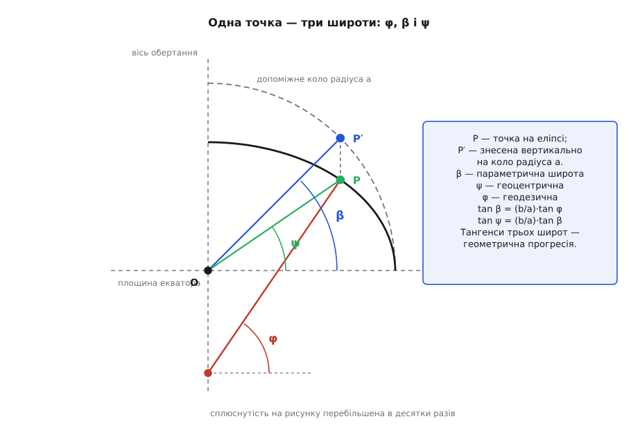
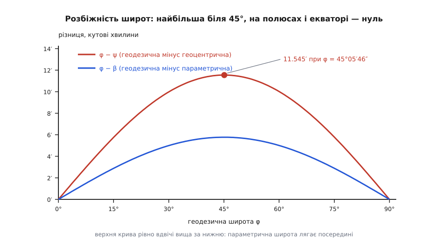
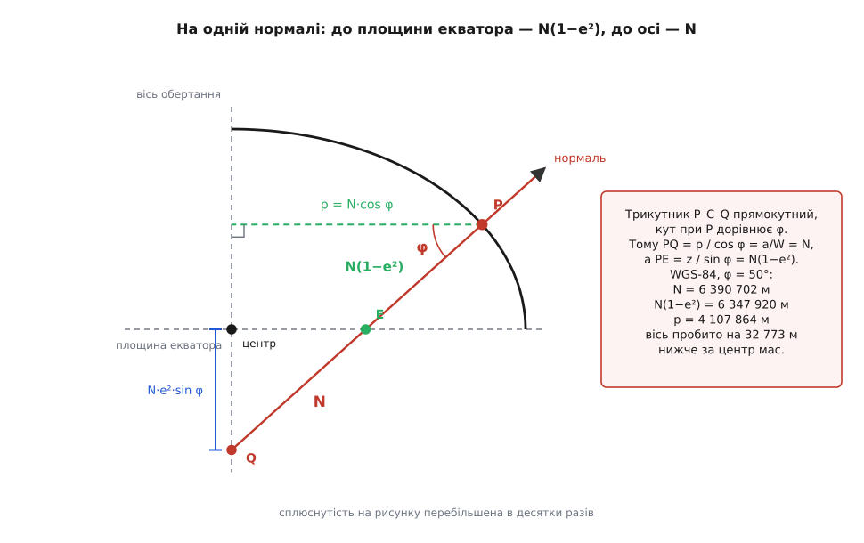

# 🧮 Звідки беруться M і N: кривина еліпсоїда та довжина дуги меридіана

Дві формули геодезичних довідників — `M = a(1−e²)/(1−e²sin²φ)^(3/2)` і `N = a/(1−e²sin²φ)^(1/2)` — подають готовими, і читачеві лишається вірити на слово: що знаменник саме такий, що трійка й одиниця в показниках не переплуталися місцями, що відрізок нормалі від поверхні до осі обертання чомусь дорівнює саме `N`. Тут усе це виведено з нуля — із рівняння еліпса й означення кривини, без жодного кроку «як відомо». З того самого місця виростає й довжина дуги меридіана: стає видно, чому вона не береться елементарними функціями і чому ряд, яким її рахують, сходиться настільки швидко, що чотирьох доданків вистачає на десяту частку міліметра.

Позначення тримаємо сталими до кінця:

```text
a       велика піввісь (екваторіальний радіус)
b       мала піввісь (полярний радіус)
e² = 1 − b²/a²          квадрат ексцентриситету;  b² = a²(1 − e²)
W  = √(1 − e²·sin²φ)    скорочення, що з'явиться в кожному знаменнику
```

Числа WGS-84, на яких перевірятимемо все підряд: `a = 6 378 137 м`, `1/f = 298.257223563`, звідки `e² = 2f − f² = 0.006 694 379 990` і `b = 6 356 752.314 м`.

## Точка еліпса, задана геодезичною широтою

Меридіанний переріз еліпсоїда — це [еліпс](topic:math/ellipse) із півосями `a` та `b`. Поставимо на площину перерізу дві координати: `x` — відстань від осі обертання, `z` — висота над площиною екватора. Тоді

```text
x²/a² + z²/b² = 1
```

Геодезична широта `φ` означена через нормаль, тому спершу треба нормаль. Ліва частина — це функція `F(x, z) = x²/a² + z²/b²`, а поверхня рівня такої функції всюди перпендикулярна до її [градієнта](topic:math/gradient). Градієнт тут очевидний:

```text
∇F = (2x/a² ,  2z/b²)
```

Множник 2 напрям не міняє, тож нормаль дивиться вздовж `(x/a², z/b²)`. Кут цього напряму з площиною екватора — і є `φ`:

```text
tan φ = (z/b²) / (x/a²) = (a²/b²)·(z/x) = (1/(1−e²))·(z/x)
```

Звідси `z = (1 − e²)·x·tan φ`. Підставмо це в рівняння еліпса й розв'яжімо відносно `x`:

```text
x²/a² + (1−e²)²·x²·tan²φ / (a²(1−e²)) = 1
x²·[1 + (1−e²)·tan²φ] = a²
x²·[cos²φ + (1−e²)·sin²φ] = a²·cos²φ
x²·[1 − e²·sin²φ] = a²·cos²φ
```

У квадратних дужках стоїть рівно `W²`. Отже,

```text
x = a·cos φ / W
z = a·(1 − e²)·sin φ / W
```

Дві формули, з яких далі випливе все інше. Перевірка підстановкою займає рядок: `x²/a² + z²/b² = [cos²φ + (1−e²)·sin²φ]/W² = W²/W² = 1`.

## Три широти однієї точки й геометрична прогресія тангенсів

Ту саму точку можна описати трьома різними кутами, і кожен має право зватися широтою.

**Геоцентрична `ψ`** — кут напряму з центра, тобто просто `tan ψ = z/x`. Ділимо одну знайдену формулу на другу — `W` скорочується:

```text
tan ψ = (1 − e²)·tan φ
```

**Параметрична `β`** (її ж звуть зведеною) з'являється, коли еліпс записують у природному параметричному вигляді `x = a·cos β`, `z = b·sin β`. Порівняймо це з нашими формулами:

```text
cos β = cos φ / W                 sin β = (b/a)·sin φ / W
```

Друга рівність варта одного рядка перевірки: `z = b·sin β = b·(b/a)·sin φ/W = a(1−e²)·sin φ/W` — збігається. А `cos²β + sin²β = [cos²φ + (1−e²)sin²φ]/W² = 1`, тобто пара справді законна. Поділивши, дістаємо

```text
tan β = (b/a)·tan φ
```

Тепер поставмо три співвідношення поруч. Оскільки `1 − e² = b²/a²`, маємо

```text
tan φ  :  tan β  :  tan ψ   =   1  :  (b/a)  :  (b/a)²
```

Тангенси трьох широт утворюють геометричну прогресію зі знаменником `b/a`. Параметрична широта сидить рівно посередині — не за примхою означення, а тому, що її тангенс є середнім геометричним двох інших тангенсів.


*Параметрична широта має пряме креслярське значення: знеси точку еліпса вертикально на коло радіуса `a` — центральний кут до знесеної точки й буде `β`. Із цього креслення видно й порядок: `φ > β > ψ` усюди між екватором і полюсом, а на самих кінцях усі три збігаються.*

## Де широти розходяться найдужче

Різницю `φ − ψ` шукаємо через тангенс різниці. Позначмо `k = 1 − e²` і `u = tan φ`:

```text
tan(φ − ψ) = (tan φ − tan ψ)/(1 + tan φ·tan ψ) = (1 − k)·u / (1 + k·u²)
```

Праворуч — функція однієї змінної `u`. Її похідна

```text
d/du [ (1−k)u/(1+ku²) ] = (1−k)·(1 − k·u²)/(1 + k·u²)²
```

обертається в нуль при `u = 1/√k`. Оскільки `√k = √(1−e²) = b/a`, максимум стоїть там, де

```text
tan φ = a/b        і водночас       tan ψ = k·(1/√k) = √k = b/a
```

Тобто `tan φ · tan ψ = 1`, а це означає `φ + ψ = 90°`: у точці найбільшої розбіжності дві широти симетричні відносно 45°. Саме значення максимуму:

```text
tan(φ − ψ)max = (1 − k)/(2√k) = e² / (2·√(1 − e²))
```

**Числа WGS-84.**

```text
√(1 − e²) = b/a = 0.996 647 189
tan(φ−ψ)max = 0.006 694 380 / (2 · 0.996 647 189) = 0.003 358 450
(φ−ψ)max    = 0.192 424 3°  = 11.545 5′ = 11′32.7″
φ           = arctan(a/b)   = 45.096 21°  = 45°05′46″
ψ           = 44.903 79°    (сума рівно 90°)
```

Та сама викладка, прикладена до `tan β = (b/a)·tan φ`, дає максимум `φ − β` у розмірі `f/(2√(1−f)) → 5.772 7′` при `φ = 45.048°`. Відношення двох максимумів — 1.999 997: параметрична широта ділить розбіжність практично точно навпіл, як і належить середньому геометричному.


*Максимум надзвичайно плаский: на рівних 45° різниця `φ − ψ` дорівнює 11.5454′ проти 11.5455′ у справжній точці максимуму — розходження в тисячні частки кутової секунди. Тому в літературі й пишуть просто «близько 11.5′ біля 45°», не уточнюючи, де саме.*

## Чому відрізок нормалі до осі — це радіус кривини

Тепер головна геометрична подія. Відкладімо від точки `P` уздовж нормалі всередину відрізок аж до осі обертання. Його довжину порахувати легко: горизонтальний катет дорівнює `x` (це ж і є відстань до осі), а сам відрізок нахилений до горизонталі під кутом `φ`. Отже, довжина відрізка — `x/cos φ`, а з формули для `x`:

```text
x / cos φ = a / W
```

Ось звідки береться `N`. Але поки що це лише довжина відрізка. Треба ще довести, що вона дорівнює радіусу кривини перерізу, проведеного через нормаль упоперек меридіана, — того самого «першого вертикала».

Почнімо з того, що взагалі означає [радіус кривини](topic:math/curvature-radius) поверхні в заданому напрямі. Проведімо в точці `P` дотичну площину. Будь-яка крива, що лежить на поверхні й виходить із `P` у певний бік, від цієї площини відходить, і пройшовши по поверхні шлях `s`, опиняється на віддалі

```text
δ ≈ s² / (2R)
```

від дотичної площини. Число `R` не залежить від того, яку саме криву ми взяли: у другому порядку по `s` відхилення однакове для всіх кривих одного напряму, бо жодна з них не сходить із поверхні, а відхилення поверхні від своєї дотичної площини — властивість самої поверхні. Це `R` і звуть радіусом нормальної кривини напряму.

Тепер візьмімо криву, для якої все рахується в голові, — **паралель**. Це коло радіуса `x` у горизонтальній площині, і в точці `P` воно йде рівно на схід, тобто в потрібному нам напрямі. Пройшовши по ньому дугу `s`, точка відходить від своєї дотичної прямої на `s²/(2x)`, і відходить **горизонтально, у бік осі**. Нам потрібна складова цього зміщення вздовж нормалі. Внутрішня горизонталь і внутрішня нормаль лежать в одній меридіанній площині й утворюють між собою кут `φ` — той самий кут, що й у попередньому абзаці. Тож проєкція дорівнює

```text
δ = s²·cos φ / (2x)
```

Прирівнюємо до `s²/(2R)`:

```text
1/R = cos φ / x        →        R = x / cos φ = a / W ≡ N
```

Круг замкнувся. Радіус кривини першого вертикала збігається з довжиною відрізка нормалі до осі — і збігається не випадково, а тому що це буквально одна й та сама величина `x/cos φ`, порахована двічі різними шляхами. Залишилось помітити, що переріз першого вертикала лежить у площині, яка містить нормаль, а тому центр його кривини теж лежить на нормалі: відрізок не просто має правильну довжину, він і напрямлений точно в центр кривини, тобто упирається у вісь обертання саме там, де треба.

Множник `cos φ` у цьому міркуванні — окремий випадок [теореми Меньє](topic:math/meusnier-theorem) про косий переріз: сама паралель нормальним перерізом не є, її власний радіус `x` менший за `N` рівно в `1/cos φ` разів.

Той самий трикутник дає й другий відрізок. Уздовж нормалі від `P` до **площини екватора** треба пройти стільки, щоб вертикальна складова з'їла всю висоту `z`, тобто `z/sin φ`:

```text
z / sin φ = a(1 − e²) / W = N·(1 − e²)
```

А різниця двох відрізків, `N·e²`, — це шматок нормалі між площиною екватора й віссю; його вертикальна складова `N·e²·sin φ` і є та глибина, на яку нормаль перетинає вісь **нижче** за центр еліпсоїда.


*Уся конструкція — один прямокутний трикутник із гострим кутом `φ` при вершині `P`. Горизонтальний катет — відстань до осі, гіпотенуза — відрізок нормалі. Точка `E` на нормалі — перетин із площиною екватора, точка `Q` — з віссю обертання; на екваторі й на полюсі вони зливаються з центром, скрізь між ними — ні.*

**Числа для WGS-84 на широті 50°.**

```text
W  = √(1 − 0.006 694 380 · 0.586 824) = 0.998 033 9
N  = 6 378 137 / 0.998 033 9        = 6 390 702.04 м
x  = N·cos 50°                      = 4 107 864.09 м
z  = N(1−e²)·sin 50°                = 4 862 789.04 м
N(1−e²)                             = 6 347 920.26 м
нижче за центр: N·e²·sin 50°        =    32 772.75 м
```

## Меридіанний радіус: кривина самого еліпса

Тут працює звичайна формула кривини плоскої кривої, заданої параметрично:

```text
κ = |x′z″ − z′x″| / (x′² + z′²)^(3/2)
```

Параметр беремо той, у якому еліпс найпростіший, — параметричну широту `β`:

```text
x = a·cos β        x′ = −a·sin β       x″ = −a·cos β
z = b·sin β        z′ =  b·cos β       z″ = −b·sin β
```

Чисельник згортається в одне число, і в цьому вся краса вибору параметра:

```text
x′z″ − z′x″ = (−a sin β)(−b sin β) − (b cos β)(−a cos β) = ab·(sin²β + cos²β) = ab
```

Знаменник же — це `(a²sin²β + b²cos²β)^(3/2)`. Підставмо сюди вже знайдені `sin β` і `cos β` через `φ`:

```text
a²·sin²β + b²·cos²β = a²·(b²/a²)·sin²φ/W² + b²·cos²φ/W² = b²·(sin²φ + cos²φ)/W² = b²/W²
```

Знову все стиснулося. Радіус — обернена кривина:

```text
M = 1/κ = (b²/W²)^(3/2) / (ab) = b³/(a·b·W³) = b²/(a·W³) = a(1 − e²)/W³
```

Тобто

```text
M = a·(1 − e²) / (1 − e²·sin²φ)^(3/2)
```

Показник 3/2 — не окраса: він народився з `(…)^(3/2)` у знаменнику формули кривини, тоді як у `N` він 1/2, бо там ділили просто на `W`. Звідси й відношення, яке відразу все впорядковує:

```text
M/N = (1 − e²)/W² = (1 − e²)/(1 − e²·sin²φ)
```

Чисельник менший за знаменник усюди, крім `sin²φ = 1`. Отже `M ≤ N` завжди, а рівність — лише на полюсах. Ніякої окремої теореми для цього не потрібно.

**Перевірка на межах.** Вона коштує п'ять рядків і ловить майже будь-яку описку:

```text
e² = 0  (куля):   W = 1,  M = N = a                     ✔
екватор, φ = 0:   W = 1,  M = a(1−e²) = b²/a = 6 335 439.33 м,  N = a
полюс, φ = 90°:   W = b/a,  M = N = a²/b   = 6 399 593.63 м
```

На екваторі меридіан вигинається крутіше за переріз першого вертикала (`M < N`), а на полюсі поверхня стає локально сферичною, і обидва радіуси зливаються в одне число `a²/b` — на 21 457 метрів більше за `a`. Той самий полярний радіус кривини `a²/b` і пояснює, чому градус широти біля полюса довший: `M(90°)·π/180 = 111 694 м` проти `M(0)·π/180 = 110 574 м`.

## Дуга меридіана: чому інтеграл виходить еліптичний

Довжина шляху вздовж меридіана береться з означення радіуса кривини. Для плоскої кривої `ds = R·dθ`, де `θ` — кут нахилу дотичної. Дотична до меридіана жорстко перпендикулярна до нормалі, а тому повертається рівно на той самий кут, що й нормаль, — тобто на `dφ`. Значить,

```text
ds = M·dφ
```

і жодного іншого радіуса тут стояти не може. Довжина дуги від екватора до широти `φ`:

```text
S(φ) = ∫₀^φ M dφ′ = a(1 − e²)·∫₀^φ dφ′ / (1 − e²·sin²φ′)^(3/2)
```

Тепер перепишімо те саме в параметричній широті — і побачимо, з чим маємо справу. Прямо з `x = a cos β`, `z = b sin β`:

```text
ds² = dx² + dz² = (a²·sin²β + b²·cos²β)·dβ²
ds  = a·√(1 − e²·cos²β)·dβ
```

Заміна `u = 90° − β` (кут, відрахований не від екватора, а від полюса) перетворює косинус на синус; зміна знака `dβ = −du` тільки перевертає межі:

```text
S = a·∫ √(1 − e²·sin²u) du
```

Праворуч стоїть точнісінько означення [неповного еліптичного інтеграла другого роду](topic:math/elliptic-integral) `E(u, e)`. І це не збіг: цілу родину еліптичних інтегралів так і назвали через те, що вона вперше постала саме із задачі про довжину дуги еліпса. Дуга меридіана — не «застосування» еліптичних інтегралів, а їхнє походження.

Чверть меридіана, від екватора до полюса, дорівнює повному інтегралу:

```text
чверть меридіана = a·E(e),   E(e) = ∫₀^(π/2) √(1 − e²·sin²u) du
```

Елементарної первісної в підінтегрального виразу немає. Це не «поки не знайшли»: критерій, за яким первісну алгебраїчної функції можна або не можна виразити через елементарні функції, дав Жозеф Ліувілль низкою праць 1833–1841 років, і за цим критерієм `√(1 − e²sin²u)` до елементарно інтегровних не належить (за винятком вироджених випадків `e = 0` і `e = 1`). Тобто круглої формули для довжини меридіана не існує в принципі, і рахувати її доводиться або квадратурою, або рядом.

## Ряд, яким її рахують насправді

Оскільки `e² sin²φ ≤ e² ≈ 0.0067`, підінтегральний вираз просто розкладається [біноміальним рядом](topic:math/taylor-series):

```text
(1 − t)^(−3/2) = 1 + (3/2)t + (15/8)t² + (35/16)t³ + (315/128)t⁴ + …      |t| < 1
```

Підставмо `t = e²·sin²φ` і знизимо степені синуса [формулами пониження](topic:math/trig-identities):

```text
sin²φ = (1 − cos2φ)/2
sin⁴φ = (3 − 4·cos2φ + cos4φ)/8
sin⁶φ = (10 − 15·cos2φ + 6·cos4φ − cos6φ)/32
```

Після цього кожен доданок інтегрується почленно, і всі синуси кратних кутів збираються за спільними множниками:

```text
S(φ) = a(1 − e²)·[ A·φ − B·sin2φ + C·sin4φ − D·sin6φ + … ]

A = 1 + 3e²/4 + 45e⁴/64 + 175e⁶/256 + 11025e⁸/16384
B =     3e²/8 + 15e⁴/32 + 525e⁶/1024 + 2205e⁸/4096
C =             15e⁴/256 + 105e⁶/1024 + 2205e⁸/16384
D =                         35e⁶/3072 +  315e⁸/12288
```

Це те саме розвинення, яке Деламбр опублікував 1799 року, у розпал робіт над метричною системою, — і воно досі стоїть у геодезичних бібліотеках слово в слово.

**Числові коефіцієнти WGS-84.** Позбувшись букв, ряд стає майже тривіальним в обчисленні (`φ` — у радіанах, результат — у метрах):

```text
A = 1.005 052 501 78        a(1−e²)·A = 6 367 449.146
B = 2.531 554 291·10⁻³      a(1−e²)·B =    16 038.509
C = 2.656 895 407·10⁻⁶      a(1−e²)·C =        16.833
D = 3.469 529 910·10⁻⁹      a(1−e²)·D =         0.021 98

S(φ) = 6 367 449.146·φ − 16 038.509·sin2φ + 16.833·sin4φ − 0.021 98·sin6φ
```

**Перевірка: чверть меридіана.** При `φ = π/2` усі синуси кратних кутів зникають, лишається один доданок:

```text
S(π/2) = 6 367 449.146 · 1.570 796 327 = 10 001 965.729 м
```

Опубліковане значення чверті меридіана WGS-84 — 10 001 965.729 м; чисельне обчислення `a·E(e)` квадратурою дає 10 001 965.7293. Три незалежні дороги сходяться до десятої частки міліметра, і це підтверджує одразу все: і формулу для `M`, і рівність `ds = M dφ`, і всі чотири коефіцієнти.

**Перевірка: як швидко ряд сходиться.** Доданок при `e⁸` вносить у чверть меридіана 13.4 мм, при `e⁶` — 2.04 м. Викинувши `e⁸`, дістанемо 10 001 965.716 замість 10 001 965.729. Наступний, відкинутий, доданок менший приблизно в 150 разів — тобто дає близько 0.09 мм. Для будь-якої земної задачі це нуль.

**Перевірка: локальний градус.** Ряд дає `S(51°) − S(49°) = 222 458.09 м`, тоді як груба оцінка «радіус на 50° помножити на приріст кута», `2·M(50°)·π/180`, дає 222 458.13 м. Різниця — чотири сантиметри на двісті кілометрів: `M·Δφ` цілком годиться на дрібних відрізках і не годиться на великих, де кривина встигає змінитися.

Ось той самий ряд у коді.

:::tabs
```cpp
#include <cmath>

constexpr double WGS84_A  = 6378137.0;
constexpr double WGS84_E2 = 6.69437999014e-3;      // 2f − f², f = 1/298.257223563

// Довжина дуги меридіана від екватора до широти phi (радіани), метри.
double meridian_arc(double phi) {
    const double e2 = WGS84_E2, e4 = e2 * e2, e6 = e4 * e2, e8 = e4 * e4;
    const double A = 1.0 + 3.0*e2/4 + 45.0*e4/64 + 175.0*e6/256 + 11025.0*e8/16384;
    const double B =       3.0*e2/8 + 15.0*e4/32 + 525.0*e6/1024 + 2205.0*e8/4096;
    const double C =                  15.0*e4/256 + 105.0*e6/1024 + 2205.0*e8/16384;
    const double D =                                 35.0*e6/3072 +  315.0*e8/12288;
    const double k = WGS84_A * (1.0 - e2);
    return k * (A*phi - B*std::sin(2*phi) + C*std::sin(4*phi) - D*std::sin(6*phi));
}
// meridian_arc(M_PI/2) = 10001965.729 — чверть меридіана WGS-84
```
```python
import math

WGS84_A  = 6_378_137.0
WGS84_E2 = 6.69437999014e-3            # 2f − f², f = 1/298.257223563

def meridian_arc(phi: float) -> float:
    """Довжина дуги меридіана від екватора до широти phi (радіани), метри."""
    e2 = WGS84_E2
    e4, e6, e8 = e2*e2, e2**3, e2**4
    A = 1 + 3*e2/4 + 45*e4/64 + 175*e6/256 + 11025*e8/16384
    B =     3*e2/8 + 15*e4/32 + 525*e6/1024 + 2205*e8/4096
    C =              15*e4/256 + 105*e6/1024 + 2205*e8/16384
    D =                            35*e6/3072 + 315*e8/12288
    k = WGS84_A * (1 - e2)
    return k * (A*phi - B*math.sin(2*phi) + C*math.sin(4*phi) - D*math.sin(6*phi))

# meridian_arc(math.pi/2) -> 10001965.729...
```
:::

Обернена задача — знайти широту за заданою довжиною дуги — прямої формули не має так само, як і пряма; її розв'язують або власним рядом із оберненими коефіцієнтами, або [ітераціями Ньютона](topic:math/newton-raphson) по `φ`, де похідна відома точно й дорівнює `M(φ)`. Збіжність тут швидка саме тому, що `M` уздовж усього меридіана міняється лише на відсоток. Для `S = 5 540 847.04 м` груба оцінка `φ ≈ S/(a(1−e²)·A)` промахується на 0.142° — майже шістнадцять кілометрів; перша ітерація зводить похибку до 0.19 м, друга — до машинного нуля.

Наостанок — число, у якому вся ця математика лишила історичний слід. Метр 1790-х років означували як одну десятимільйонну чверті меридіана. Сьогоднішня чверть у сьогоднішніх метрах — 10 001 965.7 м, тобто на 1966 метрів більша за рівно десять мільйонів. Ці 0.02 % — сумарний слід двох речей: похибки самої виміряної дуги Дюнкерк — Барселона й того сплющення, з яким Деламбр і Мешен цю дугу екстраполювали на всю чверть меридіана. Виправити означення пізніше вже не було як: платиновий еталон виготовили, довжину закріпили за ним — і планета лишилася трохи більшою за свою мірку.
