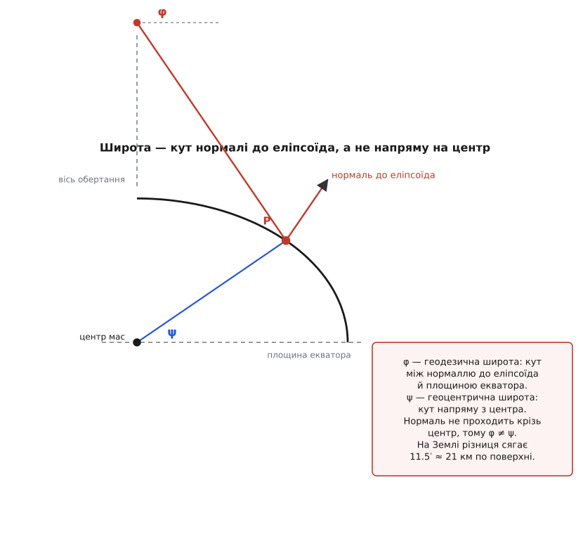
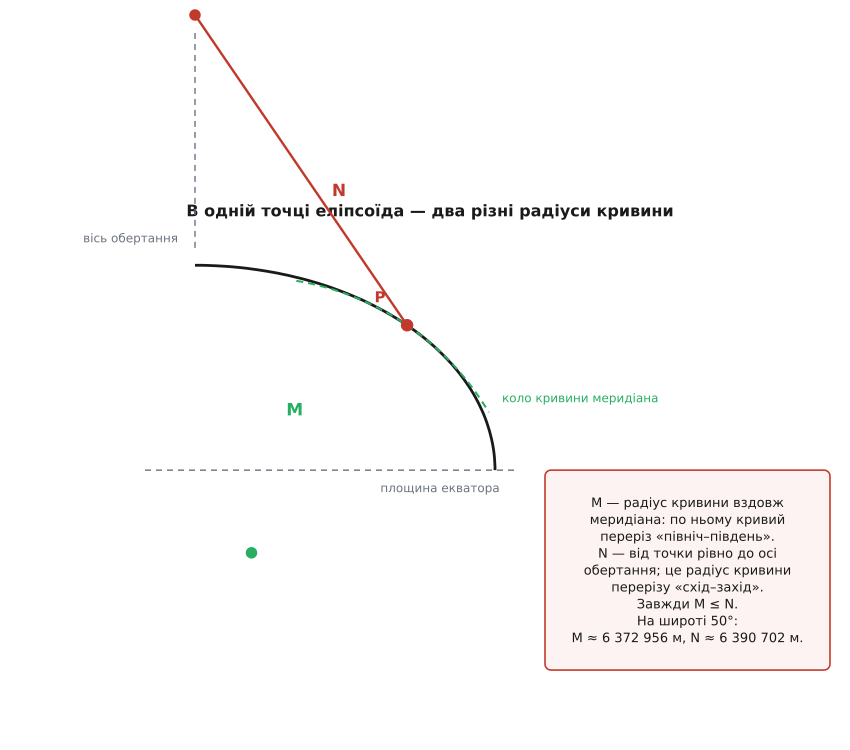
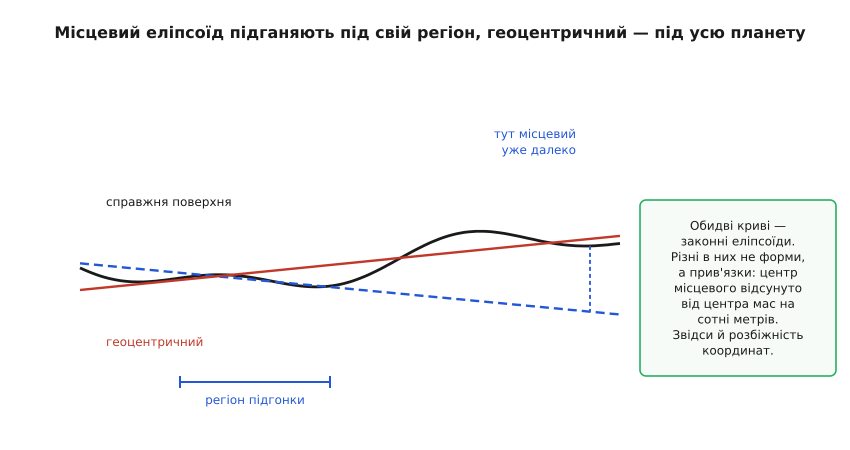

# WGS-84: еліпсоїд і датум

<preknowlist>
- [Еліпс](topic:math/ellipse) — велика й мала півосі, сплюснутість як міра відхилення від кола.
- [Система координат](topic:math/coordinate-system) — координати мають сенс лише щодо домовленої основи.
- [Нормаль до поверхні](topic:math/surface-normal) — напрям, перпендикулярний до поверхні в точці.
- [Синус і косинус](topic:math/sine-cosine) — кут і його проєкції; на них тримається кожна формула широти.
- [Кривина й радіус кривини](topic:math/curvature-radius) — наскільки крива вигинається в точці і яке коло її там заміняє.
- [Відцентрова сила](topic:physics/centrifugal-force) — чому обертання розпихає речовину вздовж екватора.
</preknowlist>

Поклади камінь посеред поля й визнач його координати двічі: супутниковим приймачем і за старою топографічною картою радянської зйомки. Числа розійдуться — не на метр і не на десять, а десь на півтори сотні метрів. Камінь не зрушив, жоден прилад не збрехав, обидві відповіді правильні. Просто це відповіді на різні питання.

Широта й довгота — не адреса на поверхні планети, а **кути**. А кут не існує сам по собі: його міряють від якоїсь площини, навколо якоїсь осі, на якійсь поверхні. Поки не сказано, від чого відлічено «50.45 градуса», це число не вказує на місце. Воно стає місцем лише разом із домовленістю: яку поверхню ми вважаємо Землею і як ця поверхня стоїть у просторі щодо справжньої планети. Дві карти з двома різними домовленостями дають два різні числа для одного каменя, і сто п'ятдесят метрів між ними — не похибка вимірювання, а різниця домовленостей.

WGS-84 (англ. *World Geodetic System 1984* — «всесвітня геодезична система 1984») і є та домовленість, у якій рахує кожен супутниковий приймач. Складається вона рівно з двох частин, і плутанина між ними породжує більшість помилок у роботі з координатами. Перша частина каже, **якої форми фігуру ми вважаємо Землею**, — це еліпсоїд. Друга каже, **як цю фігуру прикладено до справжньої планети**: де опинився її центр, куди дивиться вісь, — і зветься вона датум (лат. *datum* — «дане», те, що покладено в основу). Форма без прив'язки — гола геометрія, яка ні на що не вказує; прив'язка без форми — прив'язка нічого. Обидві мають ціну в метрах, і обидві варто вміти назвати числом.

## Чому фігурі не можна бути кулею

Спершу — чому взагалі потрібна якась фігура. Щоб задати точку двома кутами, потрібна поверхня з віссю симетрії: тоді один кут — це поворот навколо осі (довгота, від умовного нульового меридіана), а другий — «наскільки далеко від екваторіальної площини» (широта). Будь-яка поверхня обертання дасть таку пару кутів. Питання лише в тому, яку взяти, і відповідь диктує одна обставина: **усе, що ми потім порахуємо на моделі, помиляється рівно настільки, наскільки модель відходить від справжньої Землі**. Модель — не зручна вигадка, а джерело похибки, і величину цієї похибки треба знати наперед.

Найпростіша поверхня обертання — куля, і для багатьох задач її досі досить: [відстань між двома точками по великому колу](topic:math/great-circle-distance) чудово рахують саме на кулі. Але Земля не куля, і причина не в горах.

Планета обертається. Кожна частинка речовини на екваторі описує за добу коло радіусом понад шість тисяч кілометрів, а щоб рухатися по колу, потрібна сила, спрямована до осі. Цю силу забирає тяжіння: біля екватора частина ваги йде на утримання речовини на коловій траєкторії, а не на притискання її до центра. На геологічних масштабах планета тече, і тече вона доти, доки поверхня не стане такою, що ефективна вага — тяжіння за відрахуванням відцентрової частки — скрізь до неї перпендикулярна. Розв'язок цієї рівноваги не куля: екватор роздутий, полюси притиснуті. Тіло виходить **сплюснуте вздовж осі обертання**.

Наскільки сплюснуте? Екваторіальний радіус Землі 6 378 137 м, полярний — 6 356 752 м. Різниця — 21 385 метрів, двадцять один кілометр. У відносних числах це 0.335 %, на позір дрібниця, але вона вища за найвищу гору й у тисячі разів більша за точність, яку дає супутникова навігація. На такому тлі куля — не наближення, а помилка.

Що саме виходить із рівноваги обертання й самотяжіння, і як цю форму встановлювали, поки не було ні супутників, ні точних годинників, — окрема історія: [суперечка Ньютона з Кассіні та експедиції, що поїхали міряти градус меридіана до Лапландії й Перу](topic:math/wgs84-datum/hist-figure-of-earth.md). Ньютон вивів сплюснутість із самої лише механіки обертання, паризька школа з власних вимірів отримала протилежний знак, і розв'язати суперечку могли тільки дуги, виміряні на різних широтах.

## Дві сталі, з яких зроблена форма

Обертаючи еліпс навколо його малої осі, дістаємо **еліпсоїд обертання** (гр. *élleipsis* — «нестача», *eîdos* — «вигляд»): у будь-якому перерізі через вісь лежить той самий еліпс, а будь-який переріз, перпендикулярний до осі, — коло. Задають його двома числами: велика піввісь `a` (екваторіальний радіус) і мала `b` (полярний). Другим числом на практиці беруть не `b`, а **сплющення**

```text
f = (a − b) / a
```

бо саме воно безрозмірне й саме воно виходить із фізики обертання. Число це мале, тож публікують обернене до нього — так усі значущі цифри працюють на діло, а не з'їдаються нулями після коми.

WGS-84 задає:

```text
a   = 6 378 137 м        велика піввісь
1/f = 298.257223563      обернене сплющення
```

Слово «задає» тут не фігура мови. Ці два числа не виміряні, а **призначені**: вони визначення, а не результат вимірювання, і не міняються від того, що виміри стають точнішими. Усе інше з них виводиться:

```text
f  = 1 / 298.257223563   = 0.003 352 810 665
b  = a · (1 − f)         = 6 356 752.314 м
e² = 2f − f²             = 0.006 694 380
```

Останній рядок вартий окремого слова. Величина `e` — ексцентриситет (лат. *ex-* «з» + *centrum* «центр»), міра того, наскільки еліпс відійшов від кола; для еліпсоїда зручніше тримати саме її квадрат, бо рівняння еліпса записується як `b² = a²(1 − e²)`, і далі `e²` з'являється в кожній геодезичній формулі як єдиний слід сплюснутості. Коли `e² = 0`, усі формули нижче звертаються в шкільні формули кулі — це корисний спосіб їх перевіряти.

## Широта, яку насправді вживають

Отут ховається річ, яку легко проґавити й дорого проґавити. Здається очевидним, що широта точки — це кут між напрямом із центра Землі на цю точку й площиною екватора. На кулі так і є. На еліпсоїді — ні.

**Широта, якою користуються всі — і карти, і GPS, — це кут між нормаллю до еліпсоїда в точці й площиною екватора.** Її звуть геодезичною. А кут напряму з центра зветься геоцентричною широтою, і це інше число.

Чому обрали нормаль? Бо тільки її й можна було виміряти. Широту здавна визначали астрономічно: міряли висоту небесного полюса чи зорі над горизонтом. Горизонт задає прямовисна лінія — напрям, у який стає виска, тобто напрям сили тяжіння. А сила тяжіння перпендикулярна до рівневої поверхні, моделлю якої і є еліпсоїд. Тож нівелір і виска дають саме нормаль до еліпсоїда, з точністю до кількох кутових секунд. Кут же на центр не дає жоден прилад: щоб його виміряти, треба заздалегідь знати, де той центр, — а це якраз те, чого геодезист до супутників не знав.

Наслідок геометричний і дуже наочний: **нормаль до сплюснутого еліпсоїда не проходить крізь його центр.** Вона перетинає вісь обертання нижче за центр — усюди, крім екватора й полюсів, де за симетрією збігається з радіусом.


*Сплюснутість тут навмисно перебільшена в десятки разів, щоб різниця стала видимою. Червона лінія — нормаль до поверхні, синя — напрям із центра мас; вони розходяться, і разом із ними розходяться два кути, обидва з правом зватися широтою. На справжній Землі розходження менше, але зовсім не мале: до одинадцяти з половиною кутових хвилин.*

Зв'язок між ними виводиться з рівняння еліпса просто:

```text
tan ψ = (1 − e²) · tan φ
```

де `φ` — геодезична широта, `ψ` — геоцентрична. Порахуймо, де вони розходяться найдужче.

**Найбільша різниця між геодезичною й геоцентричною широтою.**

```text
φ = 45°:  tan φ = 1
          tan ψ = 0.993 305 62 · 1 = 0.993 305 62
          ψ     = 44.808 2°
          φ − ψ = 0.191 8°  = 11.51′
на поверхні: 0.191 8° · 111 200 м/° ≈ 21 300 м
```

Двадцять один кілометр. Саме на стільки з'їде точка, якщо взяти геодезичну широту й підставити її у формулу, написану для кулі, — тобто побудувати напрям із центра під цим кутом. Це не тонкість для геодезиста, а звичайна пастка того, хто переводить широту й довготу в тривимірні прямокутні координати: правильний перехід [до земних прямокутних координат](topic:math/ecef-ned-enu) містить `e²` в кількох місцях, і жодне з них не є прикрасою.

> 🔧 **Навіщо це.** Коли в бібліотеці навігації бачиш формулу переходу з широти в тривимірні координати з множником `N(φ)` — це ознака, що вона написана під геодезичну широту, тобто правильно. Формула виду `x = R·cos φ·cos λ` без жодного `e²` написана під кулю: підставивши в неї широту від приймача, дістанеш положення, зміщене на кілометри, причому плавно й правдоподібно — воно не вибухне помилкою, а тихо збреше. Найдешевша перевірка чужого коду перетворення координат — пошукати в ньому `e²` або `298.257`; якщо їх немає, це сферична формула, і в геодезичному контексті вона хибна.

Варто назвати ще одну межу чесно. Прямовисна лінія показує нормаль не до еліпсоїда, а до справжньої рівневої поверхні — [геоїда](topic:math/geoid-and-amsl), який горбкуватий через нерівномірний розподіл мас усередині планети. Розбіжність між ними зветься ухиленням прямовисної лінії і становить одиниці кутових секунд, зрідка десятки. Для всього, про що йдеться далі, цим можна знехтувати; для точного нівелювання — ні.

## Один радіус розпадається на два

На кулі кривина скрізь однакова: у який бік не проведи переріз через нормаль, дістанеш коло радіуса `R`. Еліпсоїд так не вміє. У точці на широті 50° переріз «північ–південь» вигинається інакше, ніж переріз «схід–захід», а тому в кожній точці еліпсоїда живуть **два** радіуси кривини:

```text
M = a·(1 − e²) / (1 − e²·sin²φ)^(3/2)     уздовж меридіана
N = a         / (1 − e²·sin²φ)^(1/2)      упоперек, «перший вертикал»
```

Позначення традиційні: `M` — меридіанний радіус кривини, `N` — радіус кривини першого вертикала. У `N` є красивий геометричний зміст: це рівно довжина відрізка нормалі від точки на поверхні до осі обертання — того самого відрізка, який щойно йшов повз центр. Тобто `N` не треба шукати окремо, він уже накреслений.


*Меридіанний радіус M — це радіус кола, яким меридіан можна замінити біля точки P (зелений пунктир): воно лягає на переріз щільно поруч і відходить далі. Радіус першого вертикала N відкладається по тій самій нормалі, але довше — рівно до осі обертання. Обидва відрізки лежать на одній прямій, тому їх легко переплутати; різняться вони тим, у якому перерізі міряють кривину.*

Обидві величини завжди задовольняють `M ≤ N`, а зрівнюються тільки на полюсах. І звідси одразу випливає те, заради чого ці формули найчастіше й потрібні, — **скільки метрів в одному градусі**:

```text
метрів на градус широти  = M · π/180
метрів на градус довготи = N · cos φ · π/180
```

Логіка тут та сама, що й у довжині дуги: пройти градус широти — це пройти дугу по колу радіуса `M`, пройти градус довготи — дугу по паралелі, радіус якої `N·cos φ`. Порахуймо для широти Києва.

**Коефіцієнти WGS-84 на широті 50°.**

```text
sin 50°  = 0.766 044        sin²50° = 0.586 824
W²       = 1 − e²·sin²φ     = 1 − 0.006 694 38 · 0.586 824 = 0.996 071 6
W        = 0.998 033 9      W³      = 0.994 113 3
N        = a / W            = 6 378 137 / 0.998 033 9  = 6 390 702 м
M        = a(1−e²) / W³     = 6 335 439 / 0.994 113 3  = 6 372 956 м

метрів на градус широти  = 6 372 956 · π/180           = 111 229 м
метрів на градус довготи = 6 390 702 · 0.642 788 · π/180 =  71 696 м
```

Тепер порівняймо з тим, що дала б куля середнього радіуса 6 371 000 м: 111 195 м на градус широти й 71 475 м на градус довготи. Різниця по широті — 34 метри на градус, тобто 0.03 %; по довготі — 221 метр на градус, тобто 0.31 %. Друге число варте уваги: **кожен кілометр, пройдений на схід, накопичує три метри похибки**, якщо коефіцієнт узяти сферичний. Апарат із метровим шумом приймача цього майже не помітить, а система з сантиметровою точністю зіпсована повністю. Саме тому [місцева дотична площина](topic:math/local-tangent-plane), яка перетворює градуси на метри навколо точки-початку, бере коефіцієнти не з круглого радіуса, а з `M` і `N` на своїй широті.

Ту саму сплюснутість видно й напряму: градус широти на екваторі — 110 574 м, на полюсі — 111 694 м. Різниця в кілометр із гаком на градус, і причина її та, що біля полюса поверхня пласкіша, а пласкіша поверхня — це більший радіус кривини.

Ось короткий перерахунок, який робить рівно те, що зроблено вище вручну.

:::tabs
```cpp
#include <cmath>

// Означальні сталі WGS-84 (задані точно, не виміряні).
constexpr double WGS84_A     = 6378137.0;            // велика піввісь, м
constexpr double WGS84_INV_F = 298.257223563;        // обернене сплющення
constexpr double DEG2RAD     = 3.14159265358979324 / 180.0;

struct Radii { double m, n; };                       // меридіанний і першого вертикала

Radii wgs84_radii(double lat_deg) {
    const double f  = 1.0 / WGS84_INV_F;
    const double e2 = 2.0 * f - f * f;               // квадрат ексцентриситету
    const double s  = std::sin(lat_deg * DEG2RAD);
    const double w2 = 1.0 - e2 * s * s;
    const double w  = std::sqrt(w2);
    return { WGS84_A * (1.0 - e2) / (w2 * w), WGS84_A / w };
}

// Скільки метрів в одному градусі широти й довготи на цій широті.
void metres_per_degree(double lat_deg, double& north, double& east) {
    const Radii r = wgs84_radii(lat_deg);
    north = r.m * DEG2RAD;
    east  = r.n * DEG2RAD * std::cos(lat_deg * DEG2RAD);
}
// lat = 50°:  north ≈ 111 229 м/°,  east ≈ 71 696 м/°
```
```python
import math

# Означальні сталі WGS-84 (задані точно, не виміряні).
WGS84_A     = 6_378_137.0          # велика піввісь, м
WGS84_INV_F = 298.257223563        # обернене сплющення

def wgs84_radii(lat_deg: float) -> tuple[float, float]:
    """Меридіанний радіус M і радіус першого вертикала N на заданій широті."""
    f  = 1.0 / WGS84_INV_F
    e2 = 2.0 * f - f * f                      # квадрат ексцентриситету
    s  = math.sin(math.radians(lat_deg))
    w2 = 1.0 - e2 * s * s
    w  = math.sqrt(w2)
    return WGS84_A * (1.0 - e2) / (w2 * w), WGS84_A / w

def metres_per_degree(lat_deg: float) -> tuple[float, float]:
    """Скільки метрів в одному градусі широти й довготи на цій широті."""
    m, n = wgs84_radii(lat_deg)
    rad = math.radians(1.0)
    return m * rad, n * rad * math.cos(math.radians(lat_deg))

# metres_per_degree(50.0) -> (111229.0..., 71696.0...)
```
:::

Звідки беруться самі формули `M` і `N` — не з таблиці, а з рівняння еліпса й означення кривини, — показано окремо: [алгебраїчне виведення обох радіусів кривини та довжини дуги меридіана](topic:math/wgs84-datum/math-radii-of-curvature.md). Там же видно, чому відрізок нормалі до осі дорівнює саме `N`, і чому довжина меридіана від екватора до полюса не виражається елементарними функціями.

## Прив'язка: чому самої форми мало

Еліпсоїд, складений із двох чисел, — чиста геометрія. Він ніде. Щоб із нього вийшли координати, фігуру треба **прикласти** до планети: сказати, куди в просторі потрапив її центр, як розвернулися осі, у якому масштабі все це міряно. Скільки в такому прикладанні свободи? Тверде тіло в просторі має три ступені на зсув і три на поворот, плюс масштаб — бо мережа наземних вимірів сама має свій масштаб, узятий із базисів. Разом сім чисел. Цей набір із семи параметрів і є те, що відрізняє один датум від іншого; перехід між двома датумами — це перетворення, яке ті сім чисел застосовує.

Далі — просте, але неочевидне: **той самий еліпсоїд, прикладений двома різними способами, дає одному й тому ж каменю дві різні пари координат.** Не тому, що хтось помилився, а тому, що координата — це кут щодо конкретно прикладеної поверхні. Пересунь поверхню на сто метрів — усі кути, а отже й усі широти-довготи, зміняться. Ось звідки півтори сотні метрів між супутниковим приймачем і старою картою.


*Синій пунктир — еліпсоїд, підігнаний під один регіон: у смузі підгонки він майже збігається зі справжньою поверхнею, а на віддалі відходить дедалі більше. Червона лінія — підгонка під усю ділянку: ніде не ідеальна, зате скрізь однаково пристойна. Це і є різниця між місцевим і геоцентричним датумом, і полягає вона не у формі фігури, а в тому, під що її прикладали.*

## Чому до супутників датуми були місцевими

Уяви геодезиста дев'ятнадцятого чи двадцятого століття. У нього є теодоліт, мірна база й зорі. Теодоліт міряє кути між сусідніми пунктами, база задає масштаб, зорі дають напрям прямовисної лінії й азимут. Усе це — вимірювання **відносні**: вони кажуть, як пункти розташовані один щодо одного, і нічого не кажуть про те, де серед них центр мас планети. Побачити центр мас нічим.

Тому робили єдине можливе: брали вихідний пункт, оголошували його координати (за астрономічними спостереженнями), оголошували азимут на сусідній пункт — і від цієї основи вирощували мережу тріангуляції на всю країну. А еліпсоїд підбирали [методом найменших квадратів](topic:math/least-squares) так, щоб він якнайкраще узгоджувався з вимірами. Із вимірами **своєї території** — бо іншої не було.

Що виходить у підсумку, видно на фігурі вище: у межах країни така система бездоганна, карти зшиваються, відстані сходяться до метрів. А центр підігнаного еліпсоїда опиняється за сотні метрів від центра мас Землі, і за межами своєї території система відходить хутко. Це не помилка й не недбальство, а найкраще, що взагалі можна було зробити наявними приладами.

Конкретика робить це відчутним. СК-42 (система координат 1942 року, її ж звуть Пулково-1942) стоїть на еліпсоїді Красовського, обчисленому в СРСР 1940 року: `a = 6 378 245 м`, `1/f = 298.3`. Велика піввісь на 108 метрів більша за сучасну — і це ще дрібниця. Головне — прив'язка: щоб перейти від СК-42 до WGS-84, центр треба зсунути приблизно на (+25, −141, −78.5) метра по трьох осях, а це зсув довжиною близько 163 метрів. Саме цей зсув і вилазить, коли на одну карту накладають супутниковий трек і стару зйомку. Україна свою референцну систему УСК-2000 запровадила якраз щоб замінити СК-42 і СК-63, і для неї визначено параметри переходу до WGS-84.

Як ці сім параметрів застосовують на практиці, де в цьому місці найчастіше помиляються і чому «просто додати 150 метрів» не працює — детально розібрано в окремій статті: [Семипараметричне перетворення Гельмерта](topic:math/helmert-transform). Найдорожча з тамтешніх пасток проста: підмінити датум, не перерахувавши координати, приладу нічим не заважає, і система працює далі, лише вся її картина світу зсунута.

Глухий кут із центром мас розірвали супутники. Супутник рухається не навколо «умовної точки», а навколо **центра мас** — саме про нього написані закони руху. Тому спостерігаючи супутник, ти вимірюєш положення своєї станції прямо щодо центра мас, без жодної наземної мережі. Геоцентричність сучасних систем — не смак розробників, а неминучий наслідок способу вимірювання: [супутникова навігація](topic:communications/gnss) інакшої дати просто не вміє побудувати.

## Що таке WGS-84 насправді

Тепер видно, чому WGS-84 — не еліпсоїд. Означальних сталих у ньому чотири:

```text
a   = 6 378 137 м                велика піввісь
1/f = 298.257223563              обернене сплющення
GM  = 3.986004418·10¹⁴ м³/с²     геоцентрична гравітаційна стала
ω   = 7.292115·10⁻⁵ рад/с        кутова швидкість обертання Землі
```

Дві останні можуть спантеличити: до чого тут гравітаційна стала й швидкість обертання, якщо йдеться про координати? До того, що навігаційна система — це не карта, а відповідь на питання «де зараз супутник і де щодо нього я». Щоб порахувати, де супутник, треба інтегрувати його орбіту, а орбіта визначається добутком `GM` — маси Землі на сталу тяжіння. Щоб зіставити орбіту, пораховану в невертливій системі, із Землею, яка під нею крутиться, треба знати `ω`. Тож WGS-84 задає одним набором і геометрію, і динаміку — інакше з нього не вийшло б ефемерид.

Історично сплющення взагалі не було первинним: систему будували від гравітаційного поля, і `f` виводили з нормованого зонального коефіцієнта другого степеня — тієї величини, що описує, наскільки поле Землі відхилене від поля кулі. Звідси кумедний слід: `1/f` у WGS-84 дорівнює 298.257223563, а в дуже близькій системі GRS-80 — 298.257222101. Розбіжність у дев'ятій значущій цифрі означає, що полярні радіуси двох еліпсоїдів різняться на 0.1 міліметра. Практично це той самий еліпсоїд, а сліди двох різних способів його породити лишилися в останніх цифрах.

До четвірки сталих додається ще модель гравітаційного поля, з якої рахують [геоїд — поверхню, від якої відлічують «висоту над рівнем моря»](topic:math/geoid-and-amsl). Це важливо тримати в голові: приймач дає висоту **над еліпсоїдом**, а вона розходиться з висотою над рівнем моря на десятки метрів — у різних місцях планети по-різному.

І остання складова, найменш очевидна й найголовніша для точних робіт: сама **реалізація**. Датум на папері — це набір правил; датум у роботі — це список станцій, чиї координати оголошено. Поки координат станцій немає, прикласти фігуру до планети немає до чого.

## Датум не застигає

Через це WGS-84 переоголошували вже багато разів. Перша реалізація 1987 року спиралася на доплерівські спостереження супутників системи TRANSIT і давала абсолютну точність 1–2 метри. Далі систему перевизначали вже за самим GPS: G730 (запроваджено 29 червня 1994 року, точність близько 10 см), G873 (1997, 5 см), G1150 (2002, 2 см), G1674 (2012, 1 см), потім G1762, G2139 і чинна G2296, запроваджена 7 січня 2024 року з епохою 2024.0 та узгоджена з міжнародною рамкою ITRF2020. Літера «G» у назві означає GPS, а число — тиждень GPS, на якому нову реалізацію ввели в обчислення ефемерид. Різниця між двома останніми реалізаціями — близько 6.3 міліметра.

Причин переоголошувати дві, і друга цікавіша за першу.

Перша очевидна: виміри стають кращими, і система, зроблена з точністю в метр, застаріває поруч із приладами, що бачать сантиметр.

Друга глибша: **станції рухаються**. Континенти дрейфують, і пункт на Євразійській плиті зміщується приблизно на 2.5 сантиметра щороку. Рамка, задана координатами станцій, від цього псується сама собою, без жодної помилки вимірювання. Тому в сучасних систем координат є **епоха**: координати чинні на певний момент, а разом із ними подають швидкості, щоб перерахувати на інший момент. Без епохи сантиметрова координата — не координата.

Звідси й наслідок, який регулярно ловить тих, хто зшиває дані з різних джерел. Європа свою систему ETRS89 навмисно приморозила до епохи 1989.0 і пустила разом із Євразійською плитою — щоб межа земельної ділянки не повзла щороку на два з половиною сантиметри. WGS-84 їде з планетою загалом. Відтоді ці дві системи розходяться зі швидкістю дрейфу плити, і за понад тридцять років розбіжність підбирається до метра. Той самий фізичний пункт має різні координати «у WGS-84» і «в ETRS89», обидві правильні, а різниця між ними росте щороку.

> 🔧 **Навіщо це.** Для апарата з побутовим приймачем, чий шум сягає метрів, уся ця історія з реалізаціями невидима: обирай будь-яку, різниця тоне в шумі. Але щойно з'являється RTK з сантиметровою точністю, кадастр або зшивання зйомок різних років — реалізація й епоха стають частиною відповіді. Фраза «координати в WGS-84» без назви реалізації неоднозначна на рівні дециметра, а суміш WGS-84 з національною системою дає систематичний зсув, який не видно всередині даних: усе взаємно узгоджене, просто зміщене цілком.

## Що врешті дає приймач

Приймач розв'язує задачу в тій системі, у якій йому дали положення супутників, а передавані супутниками ефемериди — саме у WGS-84. Тому первинна його відповідь — трійка прямокутних координат щодо центра мас Землі, і вже з неї, за `a` і `f`, виводяться широта, довгота й висота над еліпсоїдом. Ось чому в будь-якій навігаційній бібліотеці зашито `6378137.0` і `298.257223563`: це не данина традиції, а буквально та форма, у кутах якої видано відповідь. І з тієї ж причини всі веб-карти світу говорять широтою-довготою WGS-84, хай навіть малюють їх [у власній проєкції](topic:math/map-projections).

Наостанок варто побачити, що дві половини цієї домовленості коштують по-різному, і саме через це ловляться вони теж по-різному.

Помилка у **формі** — це помилка **пропорційна**. Узяв кулю замість еліпсоїда: кожен пройдений на схід кілометр додає три метри розбіжності, кожні десять — тридцять. Похибка росте разом із рухом, а тому неминуче виказує себе: трек не сходиться сам із собою, повернення в ту саму точку дає інші числа, ніж відліт із неї.

Помилка в **прив'язці** — це **сталий зсув**. Ті самі півтори сотні метрів будуть і на першому метрі шляху, і на сотому кілометрі. Вона не меншає від коротшої дистанції, не накопичується, не суперечить сама собі — усередині даних усе ідеально узгоджене, просто вся картина світу зсунута вбік. Жодна внутрішня перевірка її не побачить; побачити її можна лише зіставленням із чимось зовнішнім — з іншою зйомкою, з супутниковим знімком, зі стіною будинку, яка вперто стоїть не там, де їй велить карта. Тому першим питанням до будь-яких чужих координат має бути не «яка в них точність», а «у якому вони датумі».
