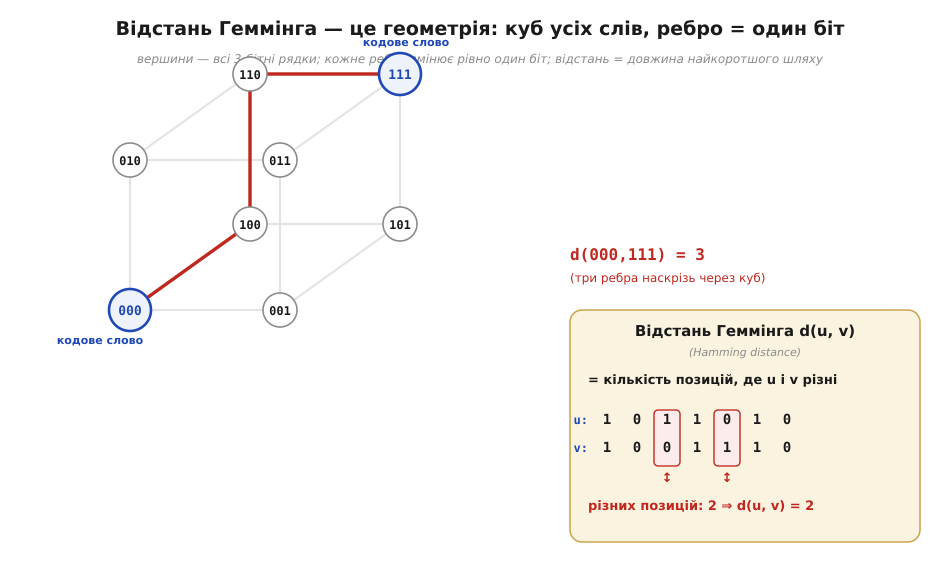
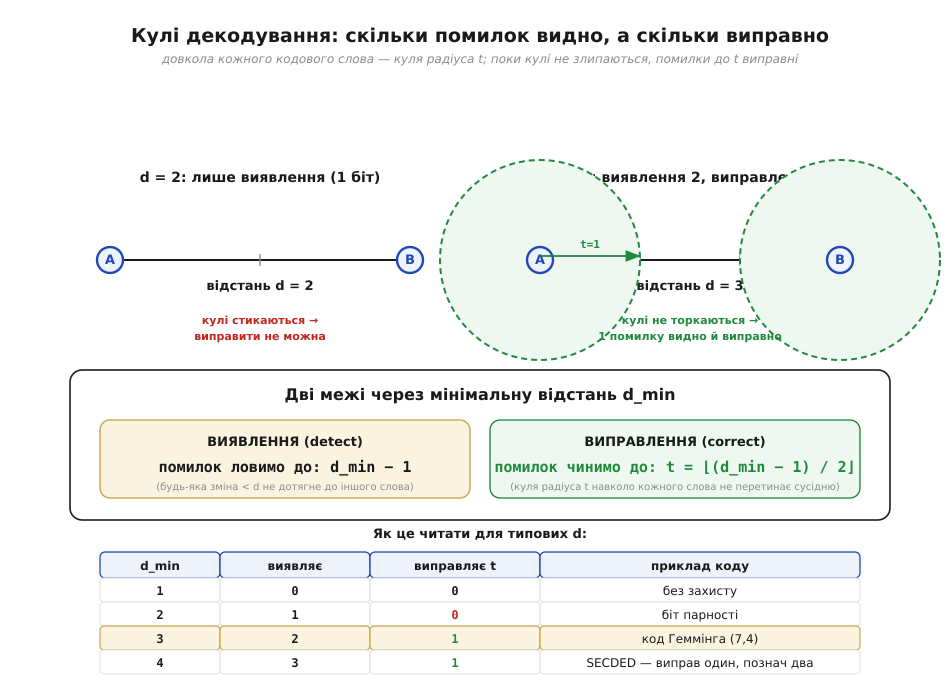
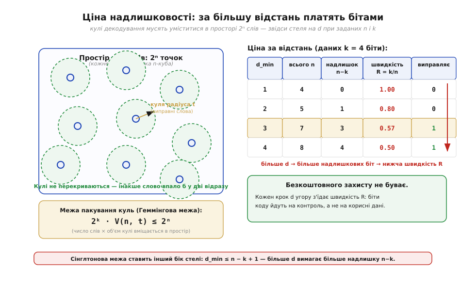

# 🧮 Відстань Геммінга формально: кулі, межі й ціна надлишковості

Головна ідея завадостійкого кодування проста на пальцях: кодові слова треба розкидати «подалі» одне від одного, і тоді поодинока помилка не перетягне одне слово в інше. Підведімо під цей образ точну математику. Виявиться, що «подалі» — не настрій, а конкретне число, **відстань Геммінга**; що «слова-сусіди» живуть на справжній геометричній фігурі — кубі; і що дві прості формули раз і назавжди кажуть, скільки помилок код **видасть**, а скільки ще й **виправить**. А наприкінці порахуємо ціну: за кожен крок надійності платять бітами, і цю плату теж можна обмежити згори точною нерівністю.

### Означення: відстань, вага й мінімальна відстань коду

Почнімо з єдиної величини, на якій тримається вся ця тема. **Відстань Геммінга** (*Hamming distance*, на честь американського математика Річарда Геммінга) між двома двійковими рядками однакової довжини — це кількість позицій, у яких вони різняться:

```
d(u, v) = число розрядів, де біт u ≠ біт v
напр.  d(1011010, 1001110) = 2   (різні 3-й і 5-й біти)
```

Поряд із нею стоїть **вага Геммінга** (*Hamming weight*) — число одиниць у слові, тобто просто `w(u) = d(u, 0)`, відстань до нульового слова. Дві величини пов'язані одним акуратним фактом, який знадобиться нам далі: `d(u, v) = w(u ⊕ v)`, бо XOR двох слів дає одиниці рівно там, де вони різні. Так геометрію відстаней зводять до підрахунку одиниць — до того самого [порозрядного XOR із підрахунком різних бітів](book:electronics/xor-comparison).

Код (*code*) — це не одне слово, а **множина** дозволених слів: лише їх передавач має право відправити, решта 2ⁿ−|код| комбінацій — «недозволені». Якість коду визначає одне-єдине число — його **мінімальна відстань** (*minimum distance*, d_min): найменша відстань між будь-якими двома різними кодовими словами.

```
d_min = min d(cᵢ, cⱼ)   по всіх парах різних кодових слів cᵢ, cⱼ
```

Саме d_min, а не довжина чи кількість слів, вирішує всю силу коду. Щоб зрозуміти чому, відстань варто перестати уявляти як абстрактне число й побачити її такою, якою вона є геометрично.

### Інтуїція: слова живуть на кубі, а декодер ловить найближче

Усі двійкові рядки довжини n — це вершини **n-вимірного куба**: ребро з'єднує дві вершини тоді й лише тоді, коли вони різняться рівно одним бітом. Тоді відстань Геммінга стає буквально довжиною найкоротшого шляху ребрами, а «перевернути один біт» означає «зробити крок уздовж ребра». Це не метафора — це той самий куб, по якому ходить логіка в [картах Карно](book:electronics/combinational-circuits), тільки тут нас цікавлять відстані, а не склеювання сусідніх клітинок.


*Відстань Геммінга як геометрія. Ліворуч — куб усіх восьми 3-бітних слів; кожне ребро змінює рівно один біт, тож відстань — це довжина найкоротшого шляху ним. Червоний шлях 000→100→110→111 показує, що d(000, 111) = 3: щоб дійти від одного кутка до протилежного, треба перетнути три ребра. Якщо взяти кодом лише ці два слова {000, 111}, його мінімальна відстань дорівнює 3 — між ними пролягає весь куб. Праворуч — як рахувати відстань порозрядно: однакові позиції пропускаємо, різні (підсвічені) лічимо.*

На цьому кубі стає очевидним і те, як приймач відновлює дані. Він застосовує **декодування за найближчим сусідом** (*nearest-neighbour decoding*): отримавши якесь слово (можливо, зіпсоване), він оголошує переданим те **кодове** слово, до якого відстань найменша. Уявімо довкола кожного кодового слова **кулю** (*sphere*) радіуса t — усі слова, що відрізняються від нього не більш ніж на t бітів. Поки ці кулі **не перекриваються**, будь-яке псування на t бітів лишає прийняте слово всередині «рідної» кулі, і декодер безпомилково повертається до правильного центру. А чи перекриються кулі — залежить рівно від d_min: що далі рознесені центри, то більші непересічні кулі довкола них поміщаються.

### Апарат: дві межі — виявлення й виправлення

Тепер ця картина дає дві формули, заради яких усе й затівалося. Розгляньмо два найближчі кодові слова на відстані d_min і спитаймо, що з ними роблять помилки.

**Виявлення.** Щоб помилка лишилася непоміченою, вона мусить перетворити одне кодове слово точно в **інше** кодове слово — інакше прийнятого рядка просто немає в коді, і приймач бачить підробку. Але найближче інше слово лежить за d_min кроків. Отже, будь-яке псування, що зачепило менше ніж d_min бітів, гарантовано впаде на «недозволене» слово й буде спіймане:

```
гарантовано виявляємо  до  d_min − 1  помилок
```

**Виправлення.** Тут вимога суворіша: мало помітити псування — треба ще й безпомилково вказати, з якого слова воно прийшло. Це вдається доти, доки прийняте слово ближче до свого центру, ніж до будь-якого чужого. Кулі радіуса t не перекриваються, поки їхні центри рознесені більш ніж на 2t, тобто поки `2t < d_min`. Найбільше ціле t, що задовольняє цю умову:

```
виправляємо  до  t = ⌊(d_min − 1) / 2⌋  помилок
```


*Дві межі через мінімальну відстань. Угорі ліворуч d = 2: кулі виправлення стиснуті в точки-центри й уже стикаються, тож одну помилку видно, але виправити її нікуди — декодер не знає, до якого з двох сусідів повертатися. Угорі праворуч d = 3: довкола кожного слова поміщається куля радіуса t = 1, кулі не злипаються, і поодинока помилка впевнено виправляється. Унизу — обидві формули (виявлення d−1, виправлення ⌊(d−1)/2⌋) і таблиця для типових d: видно, чому d = 2 (біт парності) лише виявляє, а перший код, що **виправляє** один біт, потребує аж d = 3.*

Таблиця внизу малюнка читає ці формули для малих d і одразу пояснює знайомі факти. Код із d_min = 2 (один [біт парності](book:communications/parity-bit)) ловить будь-яку поодиноку помилку, але не виправляє жодної: ⌊(2−1)/2⌋ = 0. Щоб **виправити** хоч один біт, потрібен стрибок до d_min = 3 — і саме стільки має [код Геммінга](book:communications/hamming-code). А d_min = 4 додає до виправлення одного біта ще й виявлення двох — поширена комбінація «один виправ, два познач», на якій тримається [ECC у пам'яті](book:communications/ecc-ram-flash).

Пройдімо весь шлях на конкретних числах — від пари слів до висновку «скільки помилок».

**Дано крихітний код із трьох 6-бітних слів `{000000, 011101, 110110}`. Знайти його d_min і сказати, скільки помилок він виявить і скільки виправить.** Відстань між парою слів беремо найшвидшим способом: XOR дає одиниці рівно там, де біти різні, лишається їх порахувати (це **вага** результату):

```
пара 1:  011101 ⊕ 000000 = 011101   → одиниць 4   ⇒ d = 4
пара 2:  110110 ⊕ 000000 = 110110   → одиниць 4   ⇒ d = 4
пара 3:  011101 ⊕ 110110 = 101011   → одиниць 4   ⇒ d = 4

d_min = min(4, 4, 4) = 4
```

Тепер дві формули читаються механічно:

```
виявлення:    d_min − 1            = 4 − 1       = 3 помилки
виправлення:  ⌊(d_min − 1) / 2⌋    = ⌊3 / 2⌋     = 1 помилка
```

Отже цей код гарантовано **спіймає** будь-яке псування до трьох бітів і **виправить** будь-яке псування одного біта. Перевіримо виправлення «руками»: хай передали `000000`, а прийшло `000100` (перевернувся один біт). Відстань до кожного кодового слова — знову XOR із підрахунком одиниць: до `000000` вона 1, до `011101` дорівнює 3, до `110110` теж 3. Найближчий центр — `000000` на відстані 1, тож декодер за найближчим сусідом упевнено повертає саме його. А якби перевернулося два біти й слово опинилося рівно посередині між двома центрами, однозначно виправити вже не вийшло б — це і є межа ⌊(d_min−1)/2⌋ у дії.

> 🧮 Той самий підрахунок «XOR, а тоді порахувати одиниці» лягає в кілька рядків C — і саме так відстань і вагу рахують у прошивці, де є апаратна команда підрахунку одиниць. Розгорнутий код, трюк Кернігана й машинна `popcount` — у вставці [Відстань і вага через XOR і popcount](book:math/hamming-distance/proj-popcount-distance.md).

### Ціна: за більшу відстань платять бітами

Лишилося чесно порахувати, скільки коштує велике d_min, — бо безкоштовно його не дають. Інтуїція знову з куба: щоб рознести кодові слова далеко, їх має бути **небагато** в наявному просторі 2ⁿ вершин, а решта розрядів іде не на дані, а на «проміжки» між словами. Це відчуття формалізують дві класичні нерівності-стелі.

Перша дивиться з боку даних. Якщо корисних бітів k (тобто кодових слів 2ᵏ) при загальній довжині n, то **межа Сінглтона** (*Singleton bound*) каже:

```
d_min ≤ n − k + 1
```

Більше відстані можна купити лише за більше **надлишкових** бітів n−k. Друга нерівність дивиться з боку геометрії куль. Кулі радіуса t довкола 2ᵏ центрів не сміють перекриватися, тож сумарна кількість слів у них не може перевищити весь простір 2ⁿ. Це **межа пакування куль**, вона ж **Геммінгова межа** (*sphere-packing / Hamming bound*):

```
2ᵏ · V(n, t) ≤ 2ⁿ ,   де  V(n, t) = C(n,0)+C(n,1)+…+C(n,t)
```

тут V(n, t) — кількість слів у кулі радіуса t (центр плюс усі способи перевернути від 1 до t бітів). Обидві нерівності кажуть одне й те саме різними словами: простір скінченний, і за кожну одиницю відстані доводиться віддавати частину розрядів під контроль.


*Ціна за відстань. Ліворуч — наочна Геммінгова межа: кулі виправлення довкола кодових слів не перекриваються, тож їхній сумарний «об'єм» 2ᵏ·V(n, t) мусить уміститися в 2ⁿ точок куба. Праворуч — таблиця для k = 4 бітів даних: щоб підняти d_min з 1 до 4, загальну довжину n доводиться нарощувати з 4 до 8, надлишок n−k росте, а **швидкість коду** (*code rate*) R = k/n падає вдвічі — з 1.00 до 0.50. Це і є плата: при d = 4 половина бітів коду йде на захист, а не на корисний вантаж. Нижня стрічка нагадує другий бік стелі — межу Сінглтона d_min ≤ n−k+1.*

Зручною мірою цієї плати слугує **швидкість коду** (*code rate*) R = k/n — частка корисних бітів у переданому слові. Захист завжди тягне R донизу: що більше d_min ми вимагаємо, то більше надлишкових бітів треба й то менше місця лишається даним. Це фундаментальний компроміс усієї теми — не вада конкретної схеми, а наслідок того, що куб скінченний.

### Чим керують ці числа

Інтуїтивні гасла про надійне кодування зводяться тепер до точного фундаменту. «Розкидати слова подалі» — це максимізувати d_min, мінімальну відстань на n-кубі. «Скільки помилок видно, а скільки виправно» — це рівно дві межі, d_min−1 на виявлення і ⌊(d_min−1)/2⌋ на виправлення; саме вони пояснюють, чому [біт парності](book:communications/parity-bit) з його d_min = 2 лише сигналить про збій, для виправлення потрібен крок до d_min = 3, що його дає [код Геммінга](book:communications/hamming-code), а d_min = 4 дає звичну пару «виправ один, познач два» в [ECC пам'яті](book:communications/ecc-ram-flash). А «надлишковість коштує» — це межі Сінглтона й пакування куль, що згори обмежують, скільки відстані взагалі можна вичавити з даних n і k.

Цей самий каркас прояснює й місце [CRC](book:communications/crc). CRC націлений на **виявлення**, тому грає на лівій межі: довгий контрольний хвіст піднімає d_min настільки, що ловить будь-яку коротку серію перевернутих бітів за дуже малу плату в R, — але виправляти він і не намагається, тож права формула ⌊(d_min−1)/2⌋ до нього просто не застосовна за задумом. Для будь-якого коду, що **виправляє** помилки, усе зводиться до тих самих двох чисел: яким є d_min — і скільки помилок воно дарує задарма, а скільки доведеться докупити надлишковими бітами.

> 🔧 **Навіщо це.** Винесіть одну звичку: **сила коду — це його мінімальна відстань d_min**, і з неї двома формулами одразу читається все інше — d_min−1 помилок видно, ⌊(d_min−1)/2⌋ виправно. Тому, обираючи захист даних на МК, спершу питайте не про назву схеми, а про її d_min: 2 — це «лише сигнал тривоги» (парність, проста контрольна сума), 3 — «виправлю один біт», 4 — «виправлю один і помічу два». І пам'ятайте про ціну: будь-яке підвищення d_min з'їдає швидкість коду R = k/n, бо частина бітів іде на проміжки між словами, а не на корисний вантаж. Це чуття вбереже від двох крайнощів — і від наївної надії «додам пару бітів і все виправлю», і від зайвого надлишку там, де вистачило б простого виявлення.
