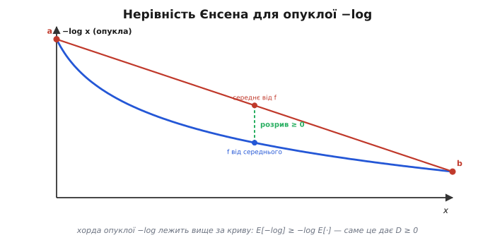
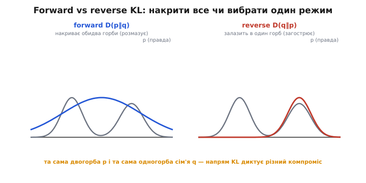
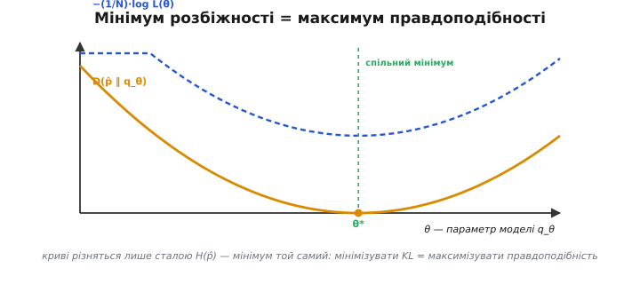

# Розбіжність Кульбака–Лейблера: доведення, напрями й зв'язок із навчанням

Розбіжність Кульбака–Лейблера легко записати одним рядком — `D(p‖q) = Σ p·log₂(p/q)` — і легко пояснити словами: скільки зайвих бітів коштує кодувати джерело `p` оптимальним кодом для хибної моделі `q`. Але за цим рядком стоїть кілька глибших питань, від яких залежить, чи правильно ти нею користуєшся. **Чому** вона ніколи не буває від'ємною — це треба довести, а не повірити. **Чому** порядок аргументів так сильно змінює результат, що від нього залежить, накриє твоя модель усі режими даних чи вчепиться в один. **Як** виходить, що та сама формула задає і дно стиснення без втрат, і мету, до якої сходяться нейромережі. Розберімо все це до кінця, без дір.

### Постановка: справжній розподіл, модель і ціна різниці

Закріпімо позначення, бо далі вони працюватимуть скрізь. Є джерело символів зі справжнім розподілом імовірностей `p`: `pᵢ` — частка, з якою трапляється символ `i`. Є наша **модель** цього джерела — розподіл `q`: те, що ми **вважаємо** ймовірностями, не маючи доступу до правди. Обидва — справжні розподіли (невід'ємні, сума одиниця), просто `p` — реальність, а `q` — наше уявлення про неї.

Оптимальний код для розподілу дає символу довжину, що дорівнює його [Шенноновій ціні](topic:algorithms/entropy) — `log₂(1/ймовірність)` біта. Знали б ми `p`, ми б платили в середньому рівно [ентропію](topic:algorithms/entropy) `H(p) = Σ pᵢ·log₂(1/pᵢ)` — це дно, нижче якого без утрат не стиснути. Але коди ми будуємо під `q`, тож символу `i` даємо довжину `log₂(1/qᵢ)`. Середня довжина за такого коду — це **перехресна ентропія** (*cross-entropy*):

```
H(p, q) = Σ pᵢ · log₂(1/qᵢ)
```

Зважування тут справжнім `p`, а не модельним `q`, — принципове: символи трапляються так, як диктує реальність, навіть якщо коди ми роздали за уявленням. Різниця між тим, що ми платимо насправді, і дном — це і є розбіжність:

```
D(p‖q) = H(p, q) − H(p)
       = Σ pᵢ·log₂(1/qᵢ) − Σ pᵢ·log₂(1/pᵢ)
       = Σ pᵢ · log₂(pᵢ / qᵢ)        бітів на символ
```

Та сама величина зветься ще **відносною ентропією** (*relative entropy*) — бо це ентропія `p`, відрахована **відносно** опорного розподілу `q`. Обидві назви про одне.

Дві технічні угоди, без яких формула інколи зависає. Якщо `pᵢ = 0`, доданок беруть нулем (`0·log0 = 0` за неперервністю — символ, якого в джерелі немає, до плати не додає). А якщо `qᵢ = 0`, а `pᵢ > 0` — тобто модель оголосила **неможливим** символ, що насправді трапляється, — доданок стає нескінченним, і вся розбіжність дорівнює `+∞`. Це не патологія, а чесна відповідь: оптимальний код для `q` узагалі **не передбачив запису** для цього символу, тож закодувати його коштує безмежно. Звідси практичне правило: модель ніколи не повинна ставити строгий нуль там, де подія можлива, — інакше один такий символ робить її нескінченно поганою.

### Біти чи нати: про основу логарифма

Перш ніж рахувати, варто розв'язати одне питання, що інакше плутає: у якій **основі** брати логарифм. Від неї залежить лише **одиниця** результату, не його суть. З `log₂` розбіжність виходить у **бітах** — і це природно для стиснення, де ми міряємо довжину коду в бітах. З натуральним `ln` вона виходить у **натах** (*nats*, від *natural* — натуральна одиниця, скільки інформації несе подія з імовірністю `1/e`). Перехід між ними — множення на сталу:

```
D_бітів(p‖q) = D_натів(p‖q) / ln2 ≈ 1.4427 · D_натів(p‖q)
```

Оскільки це стала, **усі якісні висновки байдужі до основи**: невід'ємність, занулення на `p=q`, несиметрія, місце мінімуму — однакові в будь-яких одиницях. Тому в доведеннях зручно брати `ln` (похідна `ln` чистіша), а у відповідях про стиск — `log₂`. У машинному навчанні майже завжди беруть `ln`, тож тамтешня перехресна ентропія — у натах; на пошук найкращої моделі це не впливає ніяк, бо стала множник мінімум не зсуває. Далі, де йдеться про біти, основа двійкова; де про загальні властивості — основа неважлива.

### Доведення невід'ємності через нерівність Єнсена

Найважливіша властивість розбіжності — `D(p‖q) ≥ 0`, причому нуль лише за `p = q` (**нерівність Гіббса**). Без неї формула не була б мірою «наскільки погано»: від'ємне значення означало б, що чужа модель кодує **краще** за знання правди, а це абсурд. Доведімо строго.

Знаряддя — **нерівність Єнсена** (*Jensen's inequality*, за іменем данського математика Йогана Єнсена). Вона стосується **опуклих** функцій (*convex* — таких, що хорда між будь-якими двома точками графіка лежить **не нижче** за сам графік; типовий приклад — чаша). Нерівність каже: для опуклої функції `φ` усереднення **після** застосування функції не менше за функцію **від** усередненого:

```
E[ φ(X) ]  ≥  φ( E[X] )        для опуклої φ
```

Інтуїція — рівно та сама хорда. Якщо взяти кілька точок на опуклій кривій і усереднити їхні **висоти** (ліва частина), дістанеш точку на хорді; а якщо усереднити спершу **аргументи** й тоді піднятися на криву (права частина), дістанеш точку на самій кривій, нижче за хорду. Розрив між ними — і є запас нерівності, він невід'ємний завжди й нульовий лише коли точки злилися в одну (або функція на цьому відрізку пряма).


*Чому −log опукла й що це дає. Крива −log x вигнута чашею (друга похідна додатна). Червона хорда між точками a і b цілком лежить **вище** за криву. У середній точці відрізка видно два значення: на хорді (середнє від −log) і на кривій (−log від середнього); перше завжди не менше за друге, розрив невід'ємний. Саме цей розрив, застосований до випадкової величини q/p, і дає D(p‖q) ≥ 0.*

Тепер сам доказ. Зручно вести його через натуральний логарифм (перехід до `log₂` — множенням на сталу `1/ln2 > 0`, знака не міняє). Розгляньмо `−ln` — це опукла функція (її друга похідна `1/x² > 0`). Перепишемо розбіжність так, щоб усередину логарифма потрапило відношення `q/p`:

```
D(p‖q) = Σ pᵢ · ln(pᵢ/qᵢ) = Σ pᵢ · ( −ln(qᵢ/pᵢ) ) = E_p[ −ln(qᵢ/pᵢ) ]
```

Тут `E_p` — усереднення за справжнім розподілом `p` (бо ваги — це `pᵢ`). Застосуємо Єнсена до опуклої `φ = −ln` і випадкової величини `X = qᵢ/pᵢ`:

```
E_p[ −ln(qᵢ/pᵢ) ]  ≥  −ln( E_p[ qᵢ/pᵢ ] )
```

Лишилося порахувати середнє всередині. Воно згортається до одиниці, бо `pᵢ` скорочується, а `q` — розподіл:

```
E_p[ qᵢ/pᵢ ] = Σ pᵢ · (qᵢ/pᵢ) = Σ qᵢ = 1
```

Отже права частина дорівнює `−ln1 = 0`, і ми дістали:

```
D(p‖q) = E_p[ −ln(qᵢ/pᵢ) ]  ≥  −ln(1) = 0
```

Невід'ємність доведено. А коли рівність? Нерівність Єнсена для строго опуклої функції (а `−ln` строго опукла) перетворюється на рівність **тільки** тоді, коли величина `X = qᵢ/pᵢ` стала на всій масі `p`. Стале відношення `qᵢ/pᵢ = c` при тому, що обидва — розподіли з сумою одиниця, можливе лише за `c = 1`, тобто `qᵢ = pᵢ` всюди. Звідси: `D(p‖q) = 0` тоді й лише тоді, коли `q` точно збігається з `p`. Це і є повна нерівність Гіббса — невід'ємність плюс умова рівності.

Варто відчути, **що саме** забезпечує знак. Усе тримається на опуклості логарифма — тій самій кривині, що в [Шенноновій ціні](topic:algorithms/entropy) робить біт чесною одиницею. Якби `−ln` була прямою, розрив у Єнсені занулявся б завжди, і розбіжність могла б бути від'ємною — тобто чужа модель інколи кодувала б краще за правду. Опуклість це виключає: неоптимальний код середній запис лише подовжує.

### Несиметрія: чому це не відстань і чому порядок — це вибір

Наступна риса розбіжності збиває з пантелику найчастіше: вона **несиметрична**. Загалом

```
D(p‖q) ≠ D(q‖p)
```

і це видно вже з самої формули — поміняй `p` і `q` місцями, і доданки `p·log(p/q)` перетворяться на `q·log(q/p)`, де інакші й ваги, і логарифми. Покажімо розрив на найпростіших числах. Хай `p = (0.9, 0.1)` — різко перекошене джерело, а `q = (0.5, 0.5)` — рівна модель.

```
D(p‖q) = 0.9·log₂(0.9/0.5) + 0.1·log₂(0.1/0.5)
       = 0.9·log₂1.8       + 0.1·log₂0.2
       = 0.9·(0.848)       + 0.1·(−2.322)
       = 0.763 − 0.232 = 0.531 біта

D(q‖p) = 0.5·log₂(0.5/0.9) + 0.5·log₂(0.5/0.1)
       = 0.5·log₂0.556      + 0.5·log₂5
       = 0.5·(−0.848)       + 0.5·(2.322)
       = −0.424 + 1.161 = 0.737 біта
```

Два різні числа з тих самих двох розподілів — `0.531` проти `0.737`. Це не похибка округлення, а суть.


*Несиметрія на живих числах. Ліворуч джерелом є перекошене p, а код будуємо під рівне q — переплата помірна. Праворуч ролі міняються: джерело тепер рівне q, а код під перекошене p — і символ, якому код для p відвів довгий запис, у джерелі трапляється часто, тож штраф інший. Той самий пара розподілів, інший порядок — інша ціна. Подвійна риска в D(p‖q) нагадує, хто джерело, а хто модель.*

Через несиметрію розбіжність **не є метрикою** — не є справжньою математичною відстанню. Відстань `d` мусила б мати дві властивості, яких у розбіжності немає. Перша — **симетрія**, `d(a,b) = d(b,a)`; розбіжність її порушує, як ми щойно бачили. Друга — **нерівність трикутника**, `d(a,c) ≤ d(a,b) + d(b,c)` (гак через проміжну точку не коротший за прямий шлях); для розбіжності можна підібрати трійку розподілів, де вона теж не виконується. Лишаються в неї лише невід'ємність і занулення на збігу — цього для відстані замало. Тому й слово вжито обережне — **розбіжність** (*divergence*), а не «відстань»: вона міряє напрямлену неузгодженість, а не симетричну віддаленість.

Це не дефект, а відображення задачі, і в застосуваннях напрям — **свідомий вибір**, не випадковість. `D(p‖q)` усереднює за `p`: ваги беруться зі справжнього джерела, тож промахи моделі караються там, де реальні дані **справді бувають**. `D(q‖p)` усереднює за `q`: ваги бере сама модель, тож вона штрафується там, куди **сама себе поставила**. Два різні питання — два різні числа. Який із них правильний, залежить від того, що ти оптимізуєш, і саме це визначає поведінку, до якої переходимо.

### Forward і reverse: накрити все чи вчепитися в один режим

Коли розбіжність використовують як мету — підбирають модель `q`, щоб наблизити її до фіксованої правди `p`, — два напрями дають **якісно різні** наближення. Це особливо разюче, коли `p` має кілька **режимів** (*modes* — горбів-згущень), а сім'я доступних `q` бідніша, наприклад одногорба й не здатна відтворити `p` точно. Тоді доводиться чимось жертвувати, і напрям розбіжності диктує, **чим саме**.

**Forward KL — `D(p‖q)`, мінімізуємо по `q`.** Розкриймо, що карається: `Σ p·log(p/q)`, ваги — справжні `p`. Доданок вибухає там, де `p` велике, а `q` мале: модель **поставила малу ймовірність туди, де дані реально валом**. Щоб уникнути цього штрафу, `q` мусить мати **ненульову масу скрізь, де її має `p`** — інакше десь `p>0` при `q≈0` дасть величезний доданок. Таку поведінку звуть **mode-covering** («накривання режимів») або **zero-avoiding** («уникання нулів»): forward KL змушує `q` **розповзтися й накрити всі горби `p`**, навіть ціною того, що між горбами вона покладе масу, якої в `p` там немає. Результат — широка, розмазана модель, що нічого не пропускає, але й розмиває.

**Reverse KL — `D(q‖p)`, мінімізуємо по `q`.** Тепер карається `Σ q·log(q/p)`, ваги — модельні `q`. Доданок вибухає там, де `q` велике, а `p` мале: модель **поставила велику масу туди, де даних насправді нема**. Щоб уникнути цього, `q` мусить **триматися подалі від зон, де `p` мале** — тобто **залізти всередину одного горба `p`** і там сидіти, не висовуючись у проміжки. Цю поведінку звуть **mode-seeking** («вибір режиму») або **zero-forcing** («примус до нуля»): reverse KL змушує `q` **зосередитися на одному режимі** й зробити решту простору майже нульовою. Результат — гостра, упевнена модель, що добре описує один горб, але **ігнорує інші**.


*Той самий p, той самий клас q, різний напрям — різний компроміс. Справжній розподіл p (сіра крива) має два горби; доступна модель q одногорба й точно його не відтворить. Ліворуч forward KL D(p‖q): щоб не покарати себе там, де p велике, q розповзається й **накриває обидва горби**, кладучи трохи маси й між ними, де p насправді мало (mode-covering). Праворуч reverse KL D(q‖p): щоб не покарати себе там, де p мале, q **залазить в один горб** і ігнорує другий (mode-seeking). Жодне наближення не «правильніше» — вони відповідають на різні питання.*

Звідси практичний висновок. Якщо важливо **нічого не пропустити** — наприклад, оцінити невизначеність так, щоб модель не оголосила можливу подію неможливою, — беруть forward KL і миряться з розмазуванням. Якщо важлива **впевнена, чітка відповідь** в одному режимі — наприклад, згенерувати один правдоподібний варіант, а не сіру суміш усіх, — беруть reverse KL і миряться з тим, що інші режими загублено. Цей вибір — щоденна інженерна розв'язка у варіаційному вивідні та навчанні генеративних моделей, і коріниться вона рівно в несиметрії розбіжності.

Найгостріше ця різниця проступає на **нулях**, і це варто полічити руками, бо саме нескінченний штраф жене обидві поведінки.

**Дано джерело `p = (0.5, 0.4, 0.1)` — усі три символи можливі. Перевірити, що буває, коли модель `q₁ = (0.55, 0.45, 0)` оголошує третій символ неможливим, у двох напрямах розбіжності.**

```
forward  D(p‖q₁) = 0.5·log₂(0.5/0.55) + 0.4·log₂(0.4/0.45) + 0.1·log₂(0.1/0)
                 = (скінченне) + (скінченне) + 0.1·log₂(∞)  =  +∞
```

Третій символ має `p = 0.1 > 0`, а модель дала йому `q = 0` — доданок вибухає, і вся forward-розбіжність нескінченна. Forward KL **категорично забороняє** занулювати можливе — це і є zero-avoiding. А тепер той самий промах у зворотному напрямі:

```
reverse  D(q₁‖p) = 0.55·log₂(0.55/0.5) + 0.45·log₂(0.45/0.4) + 0·log₂(0/0.1)
                 = 0.0756 + 0.0765 + 0       =  0.152 біта
```

Тут вага третього доданка — модельна `q = 0`, тож доданок **тихо випадає** (`0·log0 = 0`), і розбіжність лишається скінченною. Reverse KL **дозволяє** занулювати символи — більше того, заохочує: викинути режим дешевше, ніж розмазуватися на нього. Це zero-forcing у дії.

Симетрична картина — коли модель навпаки **кладе масу туди, де джерело порожнє**. Хай `p₂ = (0.5, 0.5, 0)` (третій символ у джерелі неможливий), а модель розмазалася на нього: `q₂ = (0.4, 0.4, 0.2)`.

```
forward  D(p₂‖q₂) = 0.5·log₂(0.5/0.4) + 0.5·log₂(0.5/0.4) + 0 = log₂1.25 = 0.322 біта   (скінченне)
reverse  D(q₂‖p₂) = 0.4·log₂(0.4/0.5) + 0.4·log₂(0.4/0.5) + 0.2·log₂(0.2/0) = +∞
```

Ролі дзеркальні: тепер **reverse** вибухає (модель `q>0` там, де `p=0`), а forward терпить. Звідси й уся поведінка двох напрямів: forward боїться **пропустити** масу джерела (тож накриває все), reverse боїться **вигадати** масу, якої немає (тож тулиться в один режим). Те саме одне число `D`, лише з різним порядком аргументів, дає протилежні інстинкти — і керує тим, розмажеться модель чи загостриться.

### Зв'язок зі стиском і з втратами навчання

Тепер зведімо три ролі однієї формули докупи, бо саме в їхній єдності — її сила.

**Дно стиснення.** Розклад `H(p,q) = H(p) + D(p‖q)` каже все. Реальний кодек платить перехресну ентропію `H(p,q)`; ідеальний, що знає `p`, платить `H(p)`; розрив між ними — рівно `D(p‖q)`. Оскільки розбіжність невід'ємна, перехресна ентропія **ніколи не менша** за справжню, `H(p,q) ≥ H(p)` — нижче дна не опустишся, а наскільки піднявся над ним, стільки коштувала неточність моделі. Класичні коди по-різному гризуть цей розрив: [код Гаффмана](topic:algorithms/huffman-coding) дає **цілі** біти на символ і тому переплачує до одного біта навіть за вірних частот; [арифметичне кодування](topic:algorithms/arithmetic-coding) працює дробовими бітами й тулиться до `H(p)` впритул, лишаючи саме `D(p‖q)` як решту через неточність частотної моделі.

**Функція втрат у навчанні.** Та сама розбіжність — стандартна мета навчання з учителем. Модель класифікації видає розподіл `q` по класах; правильна відповідь — гострий розподіл `p` (одиниця на істинному класі). Навчити — означає мінімізувати `D(p‖q)`. На практиці мінімізують **перехресну ентропію** `H(p,q)`, і це те саме, бо `H(p,q) = H(p) + D(p‖q)`, а `H(p)` від моделі не залежить (правильні мітки фіксовані) — стала, що зсуває значення, але не зсуває **точку мінімуму**. Тому cross-entropy loss і мінімізація розбіжності до правди — буквально одна дія.


*Перехресна ентропія = дно плюс штраф. Першу частину осі займає незнищенне дно H(p); далі — надбавка D(p‖q), зайві біти за чужу модель q; разом — перехресна ентропія H(p,q). У стисканні це переплата кодека; у навчанні — втрата, яку мінімізують. Зануляється надбавка лише за q = p: ідеальний код або ідеально навчена модель.*

Помітна симетрія двох ролей. У стиску `D(p‖q)` — це **зайві біти**, що їх платиш за хибне уявлення про джерело. У навчанні `D(p‖q)` — це **міра помилки**, наскільки передбачення моделі розходяться з правдою. Обидві кажуть одне: ціна неточної моделі — рівно стільки, наскільки вона не вгадує наступне. Хто краще передбачає, той і тисне сильніше, і помиляється менше.

### Зв'язок із максимальною правдоподібністю

Лишилася остання, найглибша ниточка — між розбіжністю й **методом максимальної правдоподібності** (*maximum likelihood estimation*, MLE), наріжним способом припасувати параметри моделі до даних. Виявляється, мінімізувати розбіжність до даних — це **те саме**, що максимізувати правдоподібність.

Покладімо, ми спостерегли вибірку з `N` незалежних відліків `x₁,…,x_N` зі справжнього джерела, а наша параметрична модель приписує відліку `x` імовірність `q_θ(x)` (`θ` — параметри, які підбираємо). Правдоподібність вибірки — добуток, а зручніше працювати з її логарифмом:

```
ln L(θ) = Σₙ ln q_θ(xₙ)
```

Метод максимальної правдоподібності шукає `θ`, що максимізує цю суму. Перепишімо її через **емпіричний розподіл** `p̂` — просто спостережені частоти символів у вибірці. Згрупувавши однакові відліки, сума по точках стає сумою по символах із вагами-частотами:

```
(1/N)·ln L(θ) = Σᵢ p̂ᵢ · ln q_θ(i) = − H(p̂, q_θ)
```

Праворуч — мінус перехресна ентропія між емпіричним `p̂` і моделлю. Тобто **максимізувати правдоподібність = мінімізувати перехресну ентропію** `H(p̂, q_θ)`. А перехресна ентропія розкладається:

```
H(p̂, q_θ) = H(p̂) + D(p̂ ‖ q_θ)
```

Ентропія даних `H(p̂)` від `θ` не залежить — вибірка фіксована. Тож мінімізувати `H(p̂, q_θ)` по `θ` — це мінімізувати рівно `D(p̂ ‖ q_θ)`, **розбіжність від даних до моделі**.

```
максимум  L(θ)   ⇔   мінімум  H(p̂, q_θ)   ⇔   мінімум  D(p̂ ‖ q_θ)
```


*Чому це одна задача. Уздовж осі параметра θ: золота крива — розбіжність D(p̂‖q_θ) від даних до моделі, синя пунктирна — від'ємна середня логарифмічна правдоподібність −(1/N)·ln L(θ). Вони різняться рівно на сталу H(p̂) — ентропію даних, яка від θ не залежить, тож одна крива є вертикальним зсувом другої. А вертикальний зсув не рухає абсцису мінімуму: точка θ*, де розбіжність найменша, — це та сама точка, де правдоподібність найбільша. Звідси: підганяти модель за максимумом правдоподібності — означає мінімізувати розбіжність до даних.*

Це пояснює, чому метод максимальної правдоподібності так природно лягає на навчання моделей. MLE — не окремий трюк статистики, а **той самий принцип**, що задає дно стиску: припасувати модель означає зменшити зайві біти, якими вона описує реальні дані. І напрям тут саме forward, `D(p̂‖q_θ)` — ваги беруться з даних, тож модель карається там, де дані справді є. Через mode-covering MLE-оцінка тяжіє розмазати модель так, щоб **накрити всі спостереження**, а не зосередитися на найгустішому — корисна риса, коли важливо не оголосити жодну побачену подію неможливою.

Звідси й розплутується термінологічна плутанина, на яку натикаються на практиці. Те, що в навчанні звуть **від'ємною логарифмічною правдоподібністю** (*negative log-likelihood*), і те, що звуть **перехресною ентропією** як функцією втрат, — це **одна й та сама величина** `H(p̂, q_θ)`, лише названа з двох боків: статистика дивиться на неї як на правдоподібність вибірки, теорія інформації — як на середню довжину коду. А мінімум обох — це мінімум розбіжності `D(p̂‖q_θ)` до даних. Тому коли кажуть «навчаємо на cross-entropy loss», «максимізуємо правдоподібність» і «мінімізуємо KL до даних» — це три назви однієї дії, і плутати їх не варто лише через те, що прийшли вони з різних традицій.

### Підсумок теми

**Розбіжність Кульбака–Лейблера** `D(p‖q) = Σ p·log₂(p/q)` (вона ж відносна ентропія) міряє зайві біти на символ за кодування джерела `p` оптимальним кодом для хибної моделі `q`; за угодою `0·log0 = 0`, а `q=0` при `p>0` дає `+∞` — модель не сміє оголошувати можливе неможливим. Вона **невід'ємна** й нульова лише за `p=q` (**нерівність Гіббса**) — це доводиться **нерівністю Єнсена** через опуклість `−log`: усереднення після опуклої функції не менше за функцію від усередненого, а середнє `q/p` за `p` дорівнює одиниці. Вона **несиметрична** (`D(p‖q) ≠ D(q‖p)`) і не підкоряється нерівності трикутника, тому це **не метрика**, а напрямлена ціна; напрям — свідомий вибір: forward `D(p‖q)` накриває всі режими (mode-covering, zero-avoiding), reverse `D(q‖p)` чіпляється за один (mode-seeking, zero-forcing). Розклад `H(p,q) = H(p) + D(p‖q)` ставить її між [ентропією](topic:algorithms/entropy) й перехресною ентропією: розрив над дном — рівно розбіжність, тому вона задає і недосяг кодеків ([Гаффман](topic:algorithms/huffman-coding) — цілі біти, [арифметичне](topic:algorithms/arithmetic-coding) — дробові), і cross-entropy loss у навчанні. Нарешті, мінімізувати `D(p̂‖q_θ)` до емпіричних даних — те саме, що **максимізувати правдоподібність**, бо криві різняться лише сталою `H(p̂)`. Одна формула — дно стиску, мета навчання й принцип припасування моделей; усюди вона штрафує рівно за те, наскільки модель не вгадує наступне.

---
