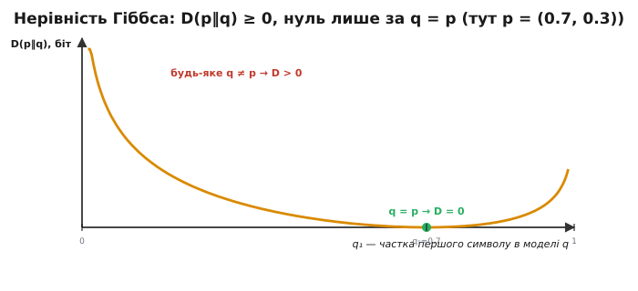
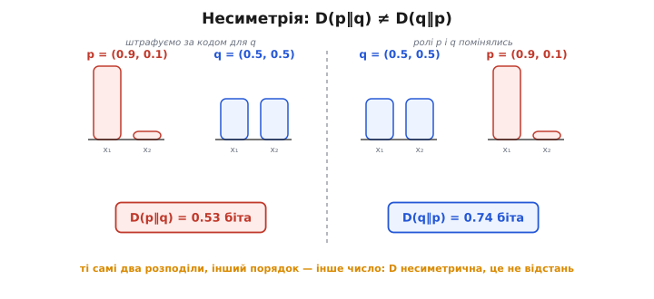
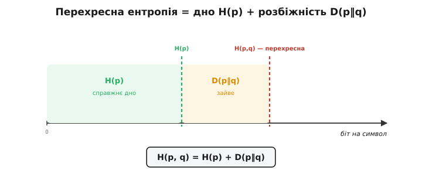
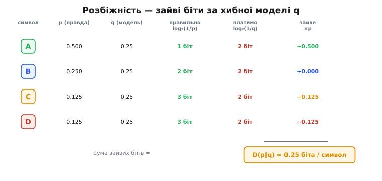

# Розбіжність Кульбака–Лейблера

Уяви, що тобі дали потік даних і сказали його стиснути. Щоб тиснути добре, треба знати, **які символи трапляються часто, а які рідко** — бо частим даємо короткі коди, рідкісним довгі. Але що, коли твоє уявлення про ці частоти **хибне**? Ти налаштував кодек під одну картину світу, а джерело живе за іншою. Дані однаково запишуться й однаково відновляться — але ти **переплатиш бітами**. Питання цієї статті точне: скільки саме зайвого ти платиш за те, що твоя модель не збігається з правдою? Відповідь — одне число, **розбіжність Кульбака–Лейблера**.

### Дві картини світу й ціна різниці між ними

Поставмо задачу чітко. Є справжній розподіл символів джерела — назвімо його `p`. І є наша **модель** цього джерела — назвімо її `q`: те, що ми **думаємо** про частоти, налаштовуючи кодек. Якби ми знали `p` точно, ми б дали кожному символу оптимальний код довжиною [Шеннонової ціни](book:algorithms/entropy) — `log₂(1/p)` біта, — і платили б у середньому рівно [ентропію](book:algorithms/entropy) `H(p)`, дно стиску. Це найкраще, що взагалі можливо.

Та ми знаємо лише `q`. Тож і коди ми будуємо оптимальними **для `q`**: символу з модельною ймовірністю `q` даємо код довжиною `log₂(1/q)` біта. Якщо `q` вгадала погано — рідкісному за нашою моделлю символу ми дамо довгий код, а він візьме й трапиться часто, бо насправді його `p` велике. Виходить систематична переплата.

Порахуймо її чесно. Символ із справжньою частотою `p` трапляється **часто настільки, як каже `p`**, а коштує нам **стільки, як диктує наш код для `q`** — тобто `log₂(1/q)` біта замість законних `log₂(1/p)`. Зайве на цьому символі — різниця цін, а в середньому по джерелу її треба зважити справжньою частотою `p`. Складемо по всіх символах:

```
D(p‖q) = Σ pᵢ · [ log₂(1/qᵢ) − log₂(1/pᵢ) ]
       = Σ pᵢ · log₂(pᵢ / qᵢ)        бітів на символ
```

Це і є **розбіжність Кульбака–Лейблера** (*Kullback–Leibler divergence*, за прізвищами американських математиків Соломона Кульбака й Річарда Лейблера, які ввели її 1951 року). Запис `D(p‖q)` читають «розбіжність від `p` до `q`», подвійна риска нагадує, що порядок важить. Кожен доданок `pᵢ·log₂(pᵢ/qᵢ)` — внесок одного символу: коли модель занижує його частоту (`qᵢ < pᵢ`), логарифм додатний і символ карає нас зайвими бітами; коли завищує (`qᵢ > pᵢ`), логарифм від'ємний і символ навіть «повертає» трохи — але, як побачимо, у сумі повернути більше, ніж заплатив, не вийде ніколи.

> 🔧 **Навіщо це.** Розбіжність — це лічильник марнотратства твоєї моделі, виміряний у бітах на символ. Налаштовуючи стиснення телеметрії чи журналу подій, ти прикидаєш частоти `q` й будуєш під них коди; `D(p‖q)` каже, скільки ти втрачаєш через те, що реальні частоти `p` інші. Мала розбіжність — модель добра, ловити більше нема чого; велика — твоє уявлення про дані хибне, і варто переоцінити частоти, перш ніж винаходити хитріший кодек.

### Чому розбіжність ніколи не від'ємна

У формули є властивість, без якої вона не мала б сенсу: **`D(p‖q) ≥ 0` завжди, і дорівнює нулю тоді й лише тоді, коли `q` точно збігається з `p`**. Це твердження зветься **нерівністю Гіббса** (*Gibbs' inequality*, за іменем американського фізика Джозайї Вілларда Гіббса).

Інтуїція проста й важлива. Оптимальний код для `q` — найкоротший **у середньому саме тоді, коли джерело справді поводиться як `q`**. Щойно справжнє джерело інакше (`p ≠ q`), цей код стає для нього неоптимальним, а будь-яке відхилення від оптимуму може лише **подовжити** середній запис, ніяк не вкоротити. Тому переплата невід'ємна. А нуль буває лише в одному випадку — коли модель ідеальна, `q = p`: тоді код для `q` і є оптимальним кодом для джерела, переплачувати нема за що.


*Нерівність Гіббса наочно. Справжній розподіл закріплено як p = (0.7, 0.3); модель q = (q₁, 1−q₁) міняємо вздовж осі. Розбіжність торкається нуля рівно там, де q збігається з p (q₁ = 0.7), і росте в обидва боки, щойно модель відходить від правди. Чим грубіше q промахується — особливо до країв, де модель майже певна не в тому символі, — то крутіше росте плата. Від'ємною D не буває ніде: неоптимальний код не вкоротить середній запис.*

Цю невід'ємність ще зручно прочитати так: розбіжність — це **завжди штраф, ніколи не премія**. Хоч би яку модель ти взяв, знання справжнього `p` дало б код не довший. Тому `D(p‖q)` чесно міряє, **наскільки ти ще не дотягуєш до ідеалу** — і нуль на цій шкалі досяжний лише досконалою моделлю.

### Порядок важить: D(p‖q) — це не відстань

Найпідступніша риса розбіжності в тому, що вона **несиметрична**: загалом `D(p‖q) ≠ D(q‖p)`. Поміняти ролі «правди» й «моделі» місцями — означає дістати **інше число**. І це не дрібний технічний нюанс, а суть: розбіжність питає «скільки я переплачу, кодуючи **джерело `p`** кодом для `q`», а зворотна питає геть інше — «скільки я переплачу, кодуючи **джерело `q`** кодом для `p`». Це дві різні задачі з різними відповідями.


*Несиметрія на живих числах. Ліворуч беремо джерело p = (0.9, 0.1) і модель q = (0.5, 0.5): кодуючи різко перекошене джерело «рівним» кодом, переплачуємо помірно. Праворуч міняємо ролі — джерело тепер рівне (0.5, 0.5), а код будуємо під перекошене p: тепер символ, якому код для p відвів довгий запис, трапляється у джерелі вдвічі частіше, і штраф інший. Ті самі два розподіли, інший порядок — інше число. Тому подвійна риска в D(p‖q) не декорація: вона нагадує, хто тут джерело, а хто модель.*

Через несиметрію розбіжність **не є метрикою** (*metric* — математична відстань). Справжня відстань мусила б, по-перше, давати однакове значення в обидва боки (`d(a,b) = d(b,a)`) — а розбіжність цього не робить. По-друге, відстань підкоряється **нерівності трикутника** (`d(a,c) ≤ d(a,b) + d(b,c)` — гак через проміжну точку не коротший за пряму) — а розбіжність і цього не гарантує. Тож попри спокусу казати «`q` близька до `p`», `D(p‖q)` — **не відстань між розподілами**, а саме **несиметрична ціна неправильного припущення**. Слово «розбіжність» (а не «відстань») ужито навмисне, щоб не плутати.

Це не вада, якої треба соромитися, — це чесне відображення задачі. Кодувати рідкісну подію кодом, що чекав на часту, і навпаки — справді **різні промахи з різною ціною**, тож і числа мають різнитися.

### Звідки беруться зайві біти: перехресна ентропія

Розбіжність акуратно вкладається в більшу картину разом із ентропією. Полічімо середню довжину запису, коли джерело — `p`, а коди — для `q`. Кожен символ коштує `log₂(1/q)`, трапляється з частотою `p`, зважуємо й додаємо:

```
H(p, q) = Σ pᵢ · log₂(1/qᵢ)        бітів на символ
```

Цю величину звуть **перехресною ентропією** (*cross-entropy*) розподілів `p` і `q` — середня ціна одного символу справжнього джерела `p` за кодом, побудованим під модель `q`. І ось ключовий зв'язок: перехресна ентропія розкладається на справжнє дно плюс розбіжність.

```
H(p, q) = H(p) + D(p‖q)
```


*Перехресна ентропія = дно плюс штраф. Уздовж осі «біт на символ» першу частину займає H(p) — справжня ентропія джерела, незнищенне дно стиску. Далі йде надбавка D(p‖q) — рівно ті зайві біти, що їх коштує кодувати джерело p кодом для чужої моделі q. Сума — перехресна ентропія H(p, q): стільки в середньому займе символ за нашого недосконалого коду. Підіб'єш q точно під p — надбавка зникне, і запис сяде на саме дно H(p).*

Цей розклад одразу пояснює, чому розбіжність невід'ємна: оскільки `D(p‖q) ≥ 0`, перехресна ентропія завжди **не менша** за справжню, `H(p,q) ≥ H(p)`. Кодуючи за чужою моделлю, ти ніколи не опустишся нижче дна `H(p)`, а наскільки **піднімешся над ним** — рівно на `D(p‖q)`. Тому розбіжність і є той самий надлишок, що відділяє реальний кодек від ідеального: **різниця між тим, що ти платиш, і тим, що міг би платити, знаючи правду**.

### Порахуймо розбіжність руками

Щоб формула остаточно ожила, візьмімо конкретне джерело й конкретну хибну модель.

**Давач шле один із чотирьох станів `A, B, C, D` зі справжніми частотами `p`. Кодек же налаштовано наївно — нібито всі чотири стани рівноймовірні, тобто за моделлю `q` кожен має ¼. Порахувати, скільки зайвих бітів на символ коштує ця помилка.**

```
справжнє   p(A)=1/2   p(B)=1/4   p(C)=1/8   p(D)=1/8
модель     q(A)=1/4   q(B)=1/4   q(C)=1/4   q(D)=1/4
```

Частоти підібрано степенями двійки навмисне — тоді кожен логарифм виходить цілим, і видно саму механіку. Беремо доданки `p·log₂(p/q)` по черзі:

```
A:  ½ · log₂( (1/2)/(1/4) ) = ½ · log₂2   = ½ · (+1) = +0.500
B:  ¼ · log₂( (1/4)/(1/4) ) = ¼ · log₂1   = ¼ · ( 0) =  0.000
C:  ⅛ · log₂( (1/8)/(1/4) ) = ⅛ · log₂½   = ⅛ · (−1) = −0.125
D:  ⅛ · log₂( (1/8)/(1/4) ) = ⅛ · log₂½   = ⅛ · (−1) = −0.125
```

Видно обидва знаки в дії. Частий `A` модель **занизила** (думала ¼, а він ½) — і він карає нас додатними півбіта. Рідкісні `C` і `D` модель **завищила** (думала ¼, а їх лише ⅛) — вони трохи повертають. Складаємо:

```
D(p‖q) = 0.500 + 0.000 − 0.125 − 0.125 = 0.25 біта на символ
```


*Звідки беруться 0.25 біта. Для кожного символу: справжня частота p, модельна q, правильна ціна log₂(1/p) (зелена) і та, що ми платимо насправді, log₂(1/q) (червона). Найдорожчий промах — на частому A: правильно 1 біт, а наш «рівний» код витрачає 2. Зважені різниці дають по символах +0.5, 0, −0.125, −0.125; їхня сума — розбіжність 0.25 біта на символ. Завищені рідкісні символи трохи повертають, але перекритий частий важить більше — тож у сумі завжди штраф.*

Перевірмо через перехресну ентропію — має зійтися. За рівної моделі кожен символ коштує `log₂(1/¼) = 2` біти, тож перехресна ентропія `H(p,q) = 2` біти рівно. Справжня ентропія цього джерела (зважена сума `log₂(1/p)`) дорівнює `H(p) = 1.75` біта. Різниця:

```
D(p‖q) = H(p, q) − H(p) = 2.00 − 1.75 = 0.25 біта на символ
```

Те саме число. На практиці це означає: наш наївний кодек запише потік за 2 біти на символ, тоді як ідеальний — за 1.75. Зайва чверть біта на кожен символ — це і є ціна нашого хибного припущення «всі стани рівноймовірні», виражена напряму. Якби давач справді слав стани рівномірно (`p = q`), розбіжність була б нульова, і наш код виявився б оптимальним.

### Чому це функція втрат у машинному навчанні

Та сама розбіжність, що задає дно стиску, нині щодня працює деінде — як **функція втрат** (*loss function*) у навчанні моделей. Зв'язок прямий, і варто його побачити.

Коли модель класифікує — скажімо, дивиться на зображення й вирішує, що на ньому, — вона видає не один наперед даний клас, а **розподіл імовірностей** `q` по класах: «з ймовірністю 0.7 кіт, 0.2 пес, …». Правильна ж відповідь — це теж розподіл `p`, тільки гострий: одиниця на справжньому класі, нулі на решті. Навчити модель означає підігнати її передбачення `q` якомога ближче до правди `p`. Чим це міряти? Розбіжністю `D(p‖q)` — скільки **зайвих бітів** коштує описати справжню відповідь моделиними передбаченнями. Що менша розбіжність, то ближче модель до істини.

На практиці мінімізують не саму розбіжність, а **перехресну ентропію** `H(p,q)` — і це те саме, бо вони різняться лише на `H(p)`, а воно для зафіксованих даних **стале** й на пошук найкращої моделі не впливає. Тож «мінімізувати перехресну ентропію» й «мінімізувати розбіжність до правди» — буквально одна дія. Через це cross-entropy loss — типова втрата для класифікації: вона штрафує модель рівно настільки, наскільки її картина світу `q` розходиться зі справжньою `p`.

Коло замикається красиво. Поняття, що відповідає на питання «скільки зайвих бітів коштує хибна модель джерела», виявляється тим самим, що відповідає на питання «наскільки погано модель навчилася». І там, і там виграє той, хто **точніше передбачає наступне**: кодек, що краще вгадав частоти, тисне сильніше; класифікатор, що краще вгадав клас, помиляється менше. Розбіжність Кульбака–Лейблера — спільна міра цього вгадування.

### Підсумок теми

**Розбіжність Кульбака–Лейблера** `D(p‖q) = Σ p·log₂(p/q)` міряє, скільки **зайвих бітів** на символ ти платиш, кодуючи джерело з істинним розподілом `p` оптимальним кодом для **хибної** моделі `q`. Вона **невід'ємна** і дорівнює нулю лише за `q = p` (нерівність Гіббса): неоптимальний код середній запис не вкоротить, тож розбіжність — завжди штраф, ніколи премія. Вона **несиметрична** (`D(p‖q) ≠ D(q‖p)`) і не підкоряється нерівності трикутника, тому це **не відстань**, а саме напрямлена ціна неправильного припущення. Її місце в загальній картині задає розклад перехресної ентропії `H(p,q) = H(p) + D(p‖q)`: кодуючи за моделлю `q`, ти платиш незнищенне дно [ентропії](book:algorithms/entropy) `H(p)` плюс надбавку `D(p‖q)` за незнання. Та сама величина працює як функція втрат у машинному навчанні — мінімізувати cross-entropy означає підганяти передбачення моделі до правди. Близькі ідеї — [код Гаффмана](book:algorithms/huffman-coding), що округлює ціну до цілого біта й тому теж переплачує, та [арифметичне кодування](book:algorithms/arithmetic-coding), що тулиться до дна впритул.

---
