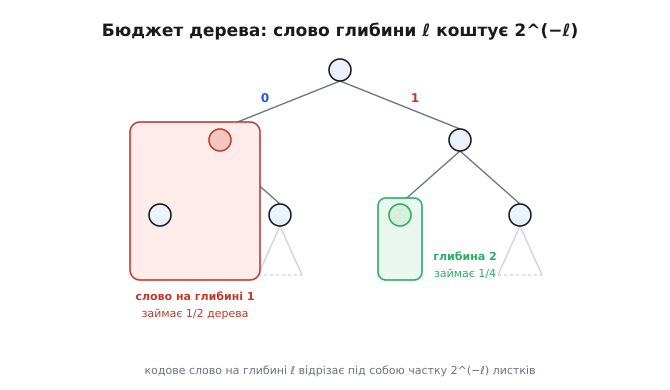
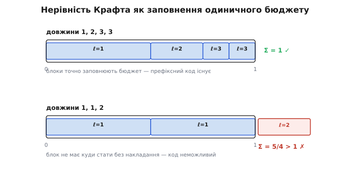
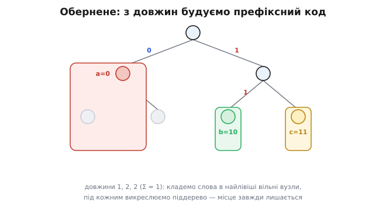
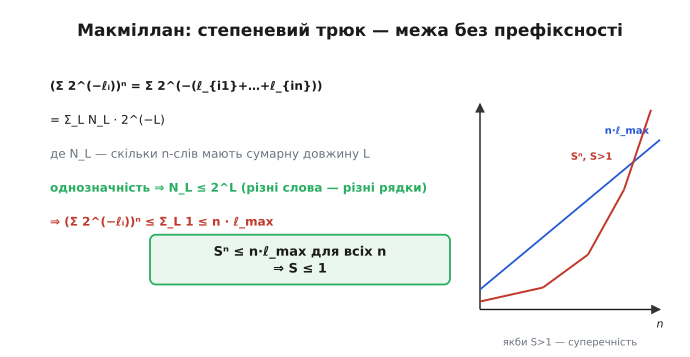

# Нерівність Крафта

Будуючи код змінної довжини, хочеться зробити всі слова короткими: чим коротші коди, тим менший файл. Та одразу наштовхуєшся на стіну — короткі коди швидко «з'їдають» одне одного. Якщо одному символу дати код `0`, то жодне інше слово вже не сміє починатися з нуля, інакше декодер їх сплутає. Виходить, кожне коротке слово коштує дорого: воно забороняє цілий пласт інших. Нерівність Крафта (англ. *Kraft inequality*, на честь Леона Крафта, що описав її 1949 року) перетворює це нечітке відчуття «короткі коди дорогі» на точне рівняння. Вона каже: будь-який набір довжин кодів живе під одним залізним обмеженням — сума `2` в степені «мінус довжина» по всіх словах не може перевищити одиницю. І навпаки: якщо ця сума вкладається в одиницю, потрібний код **точно існує**.

### Короткий код коштує «бюджету»

Почнімо з картини, з якої все стає очевидним. Будь-який [префіксний код](topic:algorithms/huffman-coding) — той, де жодне слово не є початком іншого, — природно лягає на двійкове дерево: ліва гілка це `0`, права `1`, а символи сидять **лише на листках**. Код символу — це шлях від кореня до його листка. Тепер уявімо не скінченне, а **нескінченне** двійкове дерево, що росте вглиб без кінця. Кожне можливе нескінченне продовження бітів — це один «листок на безмежжі».

Обравши якесь кодове слово завдовжки ℓ, ми ставимо листок на глибині ℓ — і тим самим **відрізаємо** під ним цілу гілку: усі нескінченні продовження, що починаються з цього слова, тепер належать йому й нікому більше. А скільки це «всіх продовжень»? Рівно частка `2⁻ℓ` нескінченного дерева: на глибині 1 ми відтинаємо половину, на глибині 2 — чверть, на глибині ℓ — частку `1/2ℓ`.


*Бюджет дерева. Корінь розгалужується на `0` ліворуч і `1` праворуч, дерево росте вглиб без кінця. Кодове слово на глибині 1 (виділене червоним) забирає під собою ціле ліве піддерево — половину всіх нескінченних продовжень, тобто `2⁻¹`. Слово на глибині 2 (зелене) забирає чверть, `2⁻²`. Що коротше слово, то більший шмат дерева воно «з'їдає» й то більше інших слів забороняє.*

Ось у чому суть. Префіксна умова означає, що **відрізані гілки не перетинаються** — бо якби гілка одного слова містила листок іншого, перше слово було б префіксом другого. А якщо непересічні шматки нарізають з одного дерева, їхня сумарна частка не може перевищити ціле дерево. Кожне слово забирає частку `2⁻ℓ`, тож:

```
Σ 2⁻ℓⁱ  ≤  1     (сума по всіх кодових словах коду)
```

Це і є нерівність Крафта. Одиниця праворуч — це весь «бюджет» дерева; кожне слово платить із нього `2⁻ℓ`, і разом усі слова не сміють перевитратити бюджет. Тепер видно, чому коротке слово таке дороге: слово завдовжки 1 коштує половину всього бюджету, тоді як слово завдовжки 10 — лише тисячну. Хочеш багато коротких кодів — швидко лишишся без бюджету на решту.

> 🔧 **Навіщо це.** Нерівність Крафта — це перша перевірка, яку варто зробити, ще **не будуючи** жодного дерева. Маєш бажаний набір довжин кодів (скажімо, хочеш дати чотирьом частим символам по 2 біти, а восьми рідкісним по 4) — порахуй `Σ 2⁻ℓ` за десять секунд. Вийшло більше за одиницю — зупинися: такого префіксного коду не існує в принципі, дерево фізично не вмістить стільки коротких листків, і жодна хитрість не врятує. Вийшло ≤ 1 — код гарантовано побудується. Це рятує від марних спроб ужити неможливий набір довжин.

### Перевіримо набори довжин руками

Найкраще відчути нерівність на конкретних числах. Замість шляхів дерева подивімося на той самий бюджет як на **одиничний відрізок** `[0, 1)`: слово завдовжки ℓ — це блок ширини `2⁻ℓ`, і блоки треба викласти всередині відрізка без накладань. Це той самий бюджет, лише розгорнутий у пряму.

**Перевірити, чи можливий префіксний код із довжинами 1, 2, 3, 3.** Рахуємо суму Крафта прямо за означенням — кожне слово дає `2⁻ℓ`:

```
ℓ = 1  →  2⁻¹ = 1/2
ℓ = 2  →  2⁻² = 1/4
ℓ = 3  →  2⁻³ = 1/8
ℓ = 3  →  2⁻³ = 1/8
                ────────
Σ = 1/2 + 1/4 + 1/8 + 1/8 = 1   ≤ 1  ✓
```

Сума вийшла **рівно 1** — нерівність справджується (та ще й упритул). Отже код існує; ба більше, рівність каже, що блоки заповнюють бюджет без жодної дірки. Один із таких кодів — `0`, `10`, `110`, `111`: легко перевірити на око, що жоден не є початком іншого.

**А тепер набір 1, 1, 2 — чи можливий?** Знову складаємо:

```
ℓ = 1  →  2⁻¹ = 1/2
ℓ = 1  →  2⁻¹ = 1/2
ℓ = 2  →  2⁻² = 1/4
                ────────
Σ = 1/2 + 1/2 + 1/4 = 5/4   >  1  ✗
```

Сума **перевалила за одиницю** — і код неможливий. Подивімося, чому саме, не ховаючись за формулою. Два слова завдовжки 1 — це `0` і `1`; разом вони вже забирають **весь** бюджет дерева, бо на глибині 1 є лише два листки, і обидва зайняті. Для третього слова, хай навіть завдовжки 2, не лишається **жодного** вільного вузла: куди його не постав (`00`, `01`, `10`, `11`), воно опиниться під уже зайнятим `0` чи `1`, тобто матиме їх своїм префіксом. Місця просто немає.


*Нерівність як заповнення бюджету. Угорі — довжини 1, 2, 3, 3: блоки ширини 1/2, 1/4, 1/8, 1/8 точно заповнюють одиничний відрізок, сума рівно 1, код існує. Унизу — довжини 1, 1, 2: два блоки по 1/2 вже забирають увесь відрізок, і третьому блоку (червоний) нікуди стати без накладання — сума 5/4 переповнює бюджет, код неможливий.*

Зверни увагу на тонкість. Той самий набір довжин 1, 2, 2 (а не 1, 1, 2) дав би `1/2 + 1/4 + 1/4 = 1` — і вже був би можливий: `0`, `10`, `11`. Різниця лише в одній цифрі довжини, але вона перекидає суму через межу. Саме тому нерівність така корисна: вона ловить неможливі набори, які на око здаються невинними.

### Обернений бік: якщо сума вкладається — код існує

Досі ми йшли в один бік: є код → сума ≤ 1. Та справжня сила нерівності Крафта в **оберненому** твердженні, і саме воно робить її інструментом, а не просто спостереженням. Воно звучить так: якщо тобі дали будь-який набір довжин ℓ₁, ℓ₂, … , для якого `Σ 2⁻ℓ ≤ 1`, то префіксний код **точно існує** — не «можливо існує», а напевно, і його можна побудувати.

Доведемо це **конструктивно** — тобто не просто заявимо, а покажемо спосіб збудувати код. Відсортуймо довжини за зростанням, від найкоротших до найдовших, і кладімо слова в дерево одне за одним за простим правилом: бери чергову довжину ℓ і став слово в **найлівіший ще вільний вузол** на глибині ℓ; поставив — викресли під ним усе піддерево (бо воно тепер зайняте цим словом і має лишатися порожнім, щоб зберегти префіксність).

Чому місце завжди знайдеться? Бо коли черга доходить до слова завдовжки ℓ, усі раніше поставлені слова коротші або рівні йому, а разом вони викреслили частку `Σ 2⁻ℓ` дерева **по вже розставлених словах** — і ця частка менша за одиницю, поки лишилися ще не розставлені слова. Отже на глибині ℓ лишається невикреслений вузол, і нове слово має куди стати. Бюджет, що не вичерпаний, гарантує вільне місце — раз за разом, аж доки всі слова розставлені.


*Будуємо код із самих довжин. Маємо довжини 1, 2, 2 (сума рівно 1). Сортуємо й кладемо: спершу `a` завдовжки 1 у найлівіший вузол глибини 1 — під ним усе ліве піддерево викреслюється (сірі вузли). Далі `b` і `c` завдовжки 2 стають у вільні вузли праворуч: `10` і `11`. Поки сума ≤ 1, на потрібній глибині завжди лишається вільний вузол — тож код збирається без затримки.*

Тепер обидва боки замкнулися в одну рівносильність, і це головний підсумок: **префіксний код із даними довжинами існує тоді й лише тоді, коли `Σ 2⁻ℓ ≤ 1`**. Нерівність — це повний критерій. Вона не лише забороняє неможливе, а й обіцяє, що все дозволене дійсно збудується.

### Теорема Макміллана: межа ширша, ніж здавалося

Тут на нерівність варто глянути ще раз і засумніватися. Усе наше міркування трималося на дереві, а дерево — це образ саме **префіксного** коду. Та префіксність — не єдиний спосіб зробити код розбірливим. Уяви код, де слова можна однозначно розкодувати, лише дочитавши до кінця або зазирнувши наперед, — він не префіксний, але **однозначно декодовний** (англ. *uniquely decodable*): будь-який потік бітів розпадається на символи єдиним способом. Таких кодів більше, ніж префіксних. Може, серед них є хитрі схеми, що обходять межу Крафта й тиснуть сильніше?

Відповідь — ні, і це довів **Броквей Макміллан** (англ. *Brockway McMillan*) 1956 року. Його теорема каже: **та сама нерівність `Σ 2⁻ℓ ≤ 1` тримається для будь-якого однозначно декодовного коду**, не лише префіксного. Межу не обійти жодною хитрістю розкодування. А наслідок звідси приголомшливо простий: якщо набір довжин узагалі дозволений для якогось однозначного коду, то для нього існує й **префіксний** код із тими самими довжинами. Інакше кажучи, відмова від префіксності **не дає виграшу в довжинах** — навіщо ж тоді мучитися з кодами, які треба розкодовувати із заглядом наперед, коли префіксний дає те саме й читається миттєво?

Доказ Макміллана — гарний трюк, який варто побачити, бо дерево тут уже не працює. Візьмімо суму Крафта `S = Σ 2⁻ℓ` і піднесімо її до **n-го степеня**. Розкривши дужки, дістанемо суму по всіх **послідовностях із n слів**, де показник — сумарна довжина такої послідовності:

```
Sⁿ = (Σ 2⁻ℓⁱ)ⁿ = Σ 2⁻(ℓᵢ₁ + … + ℓᵢₙ)     (сума по всіх n-словах)
```

Згрупуймо доданки за сумарною довжиною L. Нехай `N_L` — скільки різних n-слів мають сумарну довжину рівно L бітів. Тоді сума переписується так:

```
Sⁿ = Σ_L  N_L · 2⁻ᴸ
```

Аж тут вмикається **однозначність**. Кожне n-слово — це якийсь рядок із L бітів; різні n-слова мусять давати **різні** бітові рядки (інакше потік розкодувався б двома способами — суперечність із однозначністю). А різних рядків завдовжки L усього `2ᴸ`. Отже `N_L ≤ 2ᴸ`, і кожен доданок `N_L · 2⁻ᴸ ≤ 1`. Доданків стільки, скільки можливих L — від найкоротшого до `n·ℓ_max`, тобто не більше ніж `n·ℓ_max` штук. Звідси:

```
Sⁿ  ≤  n · ℓ_max     для будь-якого n
```


*Степеневий трюк Макміллана. Піднявши суму Крафта S до n-го степеня, дістаємо суму по всіх n-словах; згрупувавши за сумарною довжиною L, користаємося однозначністю: різних n-слів довжини L не більше за 2ᴸ. Звідси Sⁿ ≤ n·ℓ_max. Праворуч — суть суперечності: якби S було більше за одиницю, ліва частина Sⁿ росла б експоненційно (червона крива) і неминуче перегнала б праву лінійну межу n·ℓ_max (синя пряма). Цього не може бути для всіх n, тож S ≤ 1.*

Останній крок — пастка, що захлопується. Уяви на мить, що `S > 1`. Тоді ліва частина `Sⁿ` росте з n **експоненційно** — стрімко вгору. А права, `n·ℓ_max`, росте лише **лінійно** — повільно. Жодна експонента не може назавжди лишатися під прямою: рано чи пізно `Sⁿ` перевершить `n·ℓ_max`, і нерівність зламається. А вона має триматися для **всіх** n. Єдиний спосіб уникнути суперечності — щоб `S` не перевищувало одиницю, бо тоді `Sⁿ` не росте й мирно сидить під лінійною межею. Отже `S ≤ 1` — навіть без жодного дерева, для будь-якого однозначного коду.

### Чому коротше за ентропію не вийде

Лишилося поєднати нерівність Крафта з тим, заради чого коди й будують, — зі стисненням. Тут вона дає, мабуть, найважливіший свій плід: пояснює, **чому жоден код не може бути коротшим за [ентропію](topic:algorithms/entropy)** джерела. Ентропія H — це середня несподіванка символу, теоретичне дно стиснення; нерівність Крафта показує, що це дно справді непробивне.

Думка така. Хай символи мають імовірності `p₁, p₂, …` , а ми дали їм коди завдовжки `ℓ₁, ℓ₂, …` . Середня довжина коду — це `L = Σ pᵢ·ℓᵢ`, і ми хочемо зробити її якомога меншою. Та довжини не вільні: вони мусять коритися Крафту, `Σ 2⁻ℓ ≤ 1`. Це задача на мінімум за обмеженням, і її розв'язок виходить навдивовижу чистим. Найменшу середню довжину дають **ідеальні** довжини:

```
ℓᵢ = −log₂ pᵢ
```

Перевірмо, що цей вибір точно вичерпує бюджет Крафта, — підставимо його в суму:

```
Σ 2⁻ℓⁱ = Σ 2^(log₂ pᵢ) = Σ pᵢ = 1
```

Сума дорівнює рівно одиниці: ідеальні довжини **впритул** заповнюють бюджет дерева, не лишаючи ні дірки, ні перевитрати. А середня довжина за таких ℓ — це `Σ pᵢ·(−log₂ pᵢ)`, що є точнісінько означенням ентропії H. Виходить, найкраще, на що здатен будь-який код, — це сісти на саму ентропію. Опуститися нижче не дає нерівність Крафта: щоб зробити середню довжину меншою за H, довелося б укоротити коди так, що сума `Σ 2⁻ℓ` перевалила б за одиницю, — а тоді, за Макмілланом, **жодного** однозначно декодовного коду з такими довжинами не існує. Дно стиснення охороняє та сама нерівність бюджету.

Звідси й точне місце [теореми Шеннона про кодування джерела](topic:math/source-coding-theorem): вона стверджує, що до ентропії H можна підібратися як завгодно близько, але не нижче, — і саме нерівність Крафта забезпечує її нижній бік (нижче H не можна), тоді як конкретні коди дають верхній (наблизитися можна). Є, щоправда, тонкість: ідеальна довжина `−log₂ p` майже ніколи не буває цілою, а код мусить давати **цілі** довжини. Через це реальні посимвольні коди трохи переплачують над H; як саме [код Гаффмана](topic:algorithms/huffman-coding) тулиться до цього дна цілими довжинами, а [арифметичне кодування](topic:algorithms/arithmetic-coding) обходить вимогу цілості й сідає ще ближче, — це вже окрема історія. Але саме дно, до якого вони всі прагнуть, накреслила нерівність Крафта.

> 🔧 **Навіщо це.** Винеси з цієї теми один залізний факт: ідеальна довжина коду для символу з імовірністю p — це `−log₂ p` бітів, і саме вона веде до межі-ентропії. Тому, проєктуючи стиснення під конкретні дані, дивися спершу на ймовірності символів: символ, що трапляється в половині випадків (p = 0.5), «заслуговує» рівно 1 біт; рідкісний із p = 1/16 — аж 4 біти; а дуже частий із p = 0.9 — лише 0.15 біта, і тут будь-який посимвольний код приречений переплачувати, бо менше за 1 цілий біт не дасть. Це чуття одразу підказує, де Гаффмана досить, а де по-справжньому виграє арифметичне кодування, — і чому намагатися перейти теоретичну межу H безглуздо: нерівність Крафта не пустить.

### Підсумок теми

Нерівність Крафта `Σ 2⁻ℓ ≤ 1` ставить точну межу на довжини кодів: уявивши коди листками нескінченного двійкового дерева, бачимо, що слово завдовжки ℓ відрізає під собою частку `2⁻ℓ` дерева, а непересічні шматки [префіксного коду](topic:algorithms/huffman-coding) не можуть у сумі перевищити ціле дерево. Перевірка набору довжин зводиться до складання `2⁻ℓ`: набір 1, 2, 3, 3 дає рівно 1 і можливий, а 1, 1, 2 дає 5/4 і неможливий, бо два однобітні слова вже забирають увесь бюджет. Обернене твердження робить нерівність повним критерієм: якщо сума вкладається в одиницю, префіксний код **точно** будується — слова розставляються в найлівіші вільні вузли, і місце завжди лишається. Теорема Макміллана степеневим трюком поширює ту саму межу на **всі** однозначно декодовні коди, тож відмова від префіксності не дає виграшу в довжинах. А поєднання з імовірностями показує дно стиснення: ідеальні довжини `−log₂ p` рівно вичерпують бюджет Крафта, їхня середня довжина дорівнює [ентропії](topic:algorithms/entropy), і опуститися нижче неможливо — чому й [теорема Шеннона про кодування джерела](topic:math/source-coding-theorem) має непробивний нижній бік.

---
