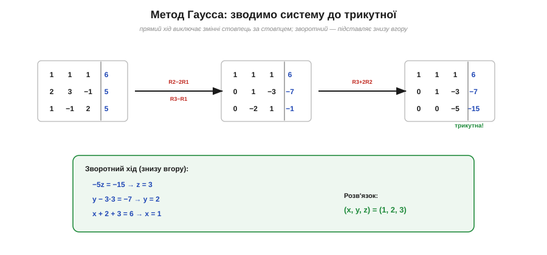
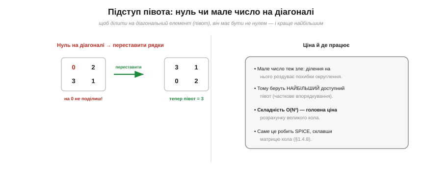

# 🧮 Системи лінійних рівнянь: метод Гаусса руками

[Аналіз кола](book:electronics/circuit-analysis) зводить коло до **системи лінійних рівнянь** (KCL + KVL + Ом). Для двох невідомих її розв'язують підстановкою, а от для трьох і більше потрібен **систематичний** метод. Він є — і називається **методом Гаусса** (*Gaussian elimination*). Це той самий механізм, яким коло розв'язує комп'ютер.

### Задача

Маємо N рівнянь із N невідомими — скажімо, струми кількох контурів. Підставляти одне в інше стає громіздко вже з трьох змінних. Метод Гаусса натомість діє механічно й завжди однаково: спершу **виключити** змінні так, щоб система стала **трикутною**, а тоді розв'язати її знизу вгору. Це — як поетапне згортання кола до простішого, тільки для рівнянь.

### Прямий хід: робимо трикутник

Запишімо систему компактно — **розширеною матрицею** (коефіцієнти зліва, права частина за рискою). Далі дозволено три дії, що не міняють розв'язку: переставляти рядки, множити рядок на число й **додавати один рядок до іншого**. Ними виключаємо змінні стовпець за стовпцем.


*Рис. Прямий хід: рядком 1 обнуляємо перший стовпець під діагоналлю (R2−2R1, R3−R1), потім рядком 2 — другий (R3+2R2). Матриця стає **трикутною**. Зворотний хід знизу вгору дає z=3, далі y=2, далі x=1.*

Розгляньмо конкретно. Нехай:

```
 x +  y +  z =  6
2x + 3y −  z =  5
 x −  y + 2z =  5
```

Беремо перший рядок за опорний і **обнуляємо** перший стовпець нижче: від другого рядка віднімаємо 2×перший (R2 − 2R1), від третього — перший (R3 − R1):

```
x +  y +  z =  6
     y − 3z = −7
   −2y +  z = −1
```

Тепер опорний — другий рядок; обнуляємо під ним другий стовпець: до третього додаємо 2×другий (R3 + 2R2):

```
x +  y +  z =  6
     y − 3z = −7
        −5z = −15
```

Готово — система **трикутна**.

### Зворотний хід: підставляємо знизу вгору

Тепер усе легко. Останнє рівняння має **одну** невідому: −5z = −15 → **z = 3**. Підставляємо вгору: y − 3·3 = −7 → **y = 2**. І ще вгору: x + 2 + 3 = 6 → **x = 1**. Розв'язок (x, y, z) = (1, 2, 3). Жодних здогадів — самі механічні кроки, придатні для будь-якого N.

### Підступ півота й ціна

На кожному кроці ми **ділимо** на діагональний елемент — його звуть **півотом** (*pivot*). І тут чигають дві халепи.


*Рис. Якщо на діагоналі опинився нуль, ділити не можна — рядки **переставляють**, аби підняти ненульовий півот. Мале число теж шкідливе (роздуває похибки округлення), тому беруть найбільший доступний півот — «часткове впорядкування». Складність методу — O(N³).*

По-перше, якщо півот дорівнює **нулю**, поділити неможливо — тоді просто **переставляють** рядки, піднявши на діагональ ненульовий елемент. По-друге (важливо для комп'ютера з його округленнями): навіть **маленький** півот шкідливий, бо ділення на нього роздуває похибки. Тому на практиці завжди підставляють на діагональ **найбільший** доступний елемент стовпця — це й зветься **частковим впорядкуванням** (*partial pivoting*) і робить метод чисельно стійким.

Ціна методу — **O(N³)** операцій для системи N×N (зворотний хід дешевший, O(N²)). Саме ця кубічна вартість і є головним коштом розрахунку великих кіл. І саме метод Гаусса (з впорядкуванням) виконує **SPICE** після того, як склав матрицю кола зі списку з'єднань: топологія схеми дає рівняння, а Гаусс їх розв'язує. Опанувавши ці кілька механічних кроків руками, ви точно знаєте, що відбувається всередині симулятора, — і чому велика схема рахується помітно довше за малу.
