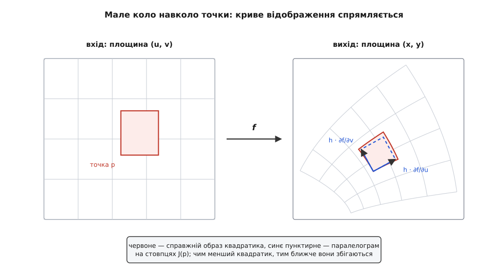
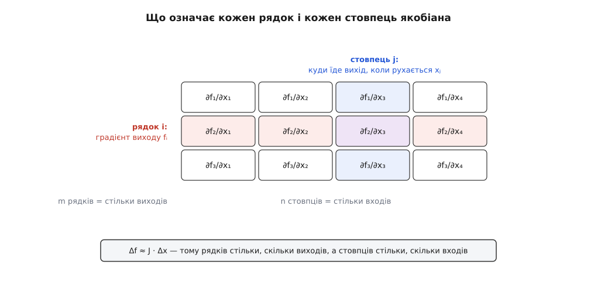
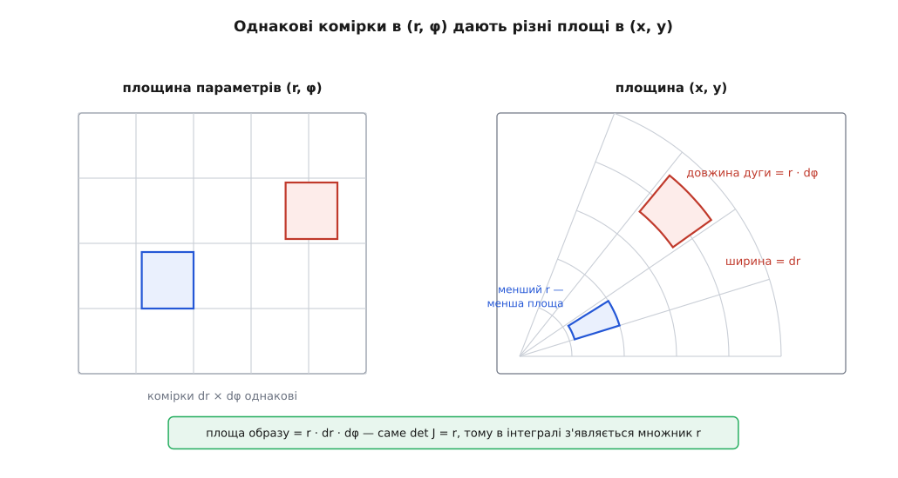
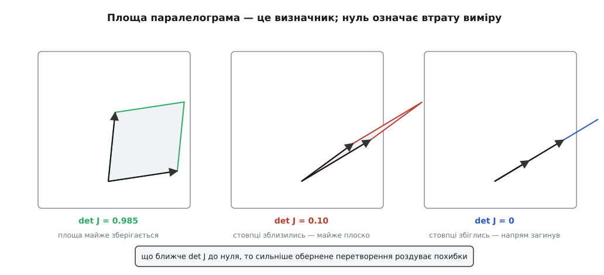

# Якобіан: локальне лінійне наближення відображення

<preknowlist>
- [Похідна](book:math/derivative) — швидкість зміни функції однієї змінної й наближення функції прямою біля точки.
- [Частинна похідна](book:math/partial-derivative) — похідна за однією змінною, коли решта тримається сталою.
- [Складові вектора](book:math/vector-components) — вектор як упорядкований набір чисел.
- [Матриці як дії](book:math/matrices-as-operations) — матриця як перетворення вектора, множення матриці на стовпець.
- [Визначник матриці](book:math/matrix-determinant) — число, що каже, у скільки разів перетворення змінює площу чи об'єм і чи перевертає орієнтацію.
</preknowlist>

Є пристрої, у які заходить кілька чисел, а виходить теж кілька. Камера бере три координати точки в кімнаті й віддає два числа — рядок і стовпець пікселя. Плотер бере кути двох двигунів і ставить перо в якесь місце аркуша. Схема термометра бере опір і температуру плати, а віддає напругу на виході.

Формула такого пристрою відповідає на питання «що буде на виході». Але в роботі майже завжди питають про інше: **покрутили ручку на дрібку — куди поїхав результат?** Наскільки треба крутити, щоб перо зсунулось на міліметр праворуч? Якщо опір виміряно з похибкою, наскільки хибною буде напруга? Який із входів найдужче псує результат?

Коли вхід один і вихід один, відповідь — одне число: похідна каже, у скільки разів швидше змінюється вихід. Коли входів кілька, одним числом не обійтися, бо сам зсув входу тепер має напрямок. Крутнули першу ручку — перо поїхало праворуч і трохи вгору. Крутнули другу на стільки ж — перо поїхало вгору й ліворуч, і вдвічі швидше. Відповідь мусить бути не числом, а **правилом**: дай мені маленький зсув входу — я скажу, який буде зсув виходу.

## Чому це правило неодмінно лінійне

Правило могло б бути будь-яким. Насправді вибору майже немає, і ось чому.

Намалюймо на площині входу дрібну сітку й подивімось на її образ. У великому масштабі образ кривий: лінії вигинаються, клітинки різні за розміром і формою. Тепер беремо все менший клаптик навколо однієї точки. Зсув виходу росте пропорційно розміру клаптика — це перший порядок, h. А викривлення, тобто відхилення образу від прямих ліній, росте як h²: воно міряється другими похідними. Зменшили клаптик удесятеро — зсув упав удесятеро, а кривина в сто разів. Тому в достатньо малому околі кривина стає непомітною на тлі самого зсуву: лінії образу випрямляються, стають рівновіддаленими й паралельними.



*Криве відображення на малому клаптику спрямляється: образ квадратика майже збігається з паралелограмом, побудованим на двох стрілках.*

У такій випрямленій картинці правило має дві властивості. Подвоїли зсув входу — подвоївся зсув виходу. Штовхнули вхід одночасно у двох напрямках — вихід зсунувся на суму того, що дав би кожен поштовх окремо. Пропорційність плюс додавання — це і є лінійність, а лінійне правило, яке з n чисел робить m чисел, повністю задається матрицею m×n.

Лишилось знайти її числа. Для цього штовхаємо вхід уздовж однієї осі: міняється тільки xⱼ, решта входів стоять. Швидкість, з якою при цьому пливе i-й вихід, — це за означенням частинна похідна ∂fᵢ/∂xⱼ. Зібравши всі m виходів разом, дістаємо вектор — те, куди їде вихід від руху одного входу. А будь-який зсув входу розкладається на зсуви вздовж осей, і за додаванням відповідь на нього — сума відповідей на складові. Саме це робить множення матриці на стовпець:

```
        ⎡ ∂f₁/∂x₁   ∂f₁/∂x₂   …   ∂f₁/∂xₙ ⎤
J(p) =  ⎢ ∂f₂/∂x₁   ∂f₂/∂x₂   …   ∂f₂/∂xₙ ⎥        Δf ≈ J(p) · Δx
        ⎢    …         …             …    ⎥
        ⎣ ∂fₘ/∂x₁   ∂fₘ/∂x₂   …   ∂fₘ/∂xₙ ⎦
```

Цю матрицю називають **якобіаном** — на честь Карла Ґустава Якоба Якобі (1804–1851), який 1841 року присвятив таким визначникам окрему працю «De determinantibus functionalibus»; сама ж назва «якобіан» з'явилася на початку 1850-х на пропозицію Джеймса Джозефа Сильвестра. Ідея, втім, старша за обидва імена: [звідки взялися функціональні визначники](book:math/jacobian-matrix/hist-functional-determinants.md) — окрема історія про заміну змінних у кратних інтегралах, у якій Ейлер, Лаґранж і Коші зробили головне ще до Якобі. У літературі словом «якобіан» називають то саму матрицю, то її визначник; тут матриця — якобіан, а число — визначник якобіана.

Одне застереження до слова «неодмінно». Випрямлення при наближенні — не автоматична властивість будь-якого відображення, а те, що називають диференційовністю: існує така матриця J(p), що

```
f(p + δ) = f(p) + J(p)·δ + r(δ),      |r(δ)| / |δ| → 0  при  δ → 0
```

Залишок r має спадати швидше за сам зсув — тоді й тільки тоді лінійне наближення чогось варте. Бувають відображення, у яких усі частинні похідні в точці існують, а такої матриці немає: уздовж осей рух гладкий, а по косому напрямку — уже ні, тож жодне одне лінійне правило не описує всіх напрямків одразу. Робочий критерій простий: якщо частинні похідні існують в околі точки й неперервні, відображення в цій точці диференційовне. Подробиці — у [диференційовності функцій багатьох змінних](book:math/differentiability); тут ми беремо цей критерій як даність, бо він нічого не додає до самої конструкції якобіана.

Побачити, як швидко спадає залишок, найлегше на числах.

**Відображення f(u, v) = (u² − v², 2uv) у точці p = (1, 0.5)**

```
f(p) = (1 − 0.25, 2·1·0.5) = (0.75, 1.00)

J(p) = ⎡ 2u  −2v ⎤ = ⎡ 2  −1 ⎤
       ⎣ 2v   2u ⎦   ⎣ 1   2 ⎦

зсув δ = (0.02, 0.01):
   передбачення  J·δ = (2·0.02 − 1·0.01,  1·0.02 + 2·0.01) = (0.0300, 0.0400)
   насправді     f(1.02, 0.51) − f(p)                      = (0.0303, 0.0404)
   залишок                                                 = (0.0003, 0.0004)

зсув удвічі менший, δ = (0.01, 0.005):
   передбачення  J·δ                                       = (0.0150, 0.0200)
   насправді     f(1.01, 0.505) − f(p)                     = (0.015075, 0.0201)
   залишок                                                 = (0.000075, 0.0001)
```

Зсув зменшився вдвічі — залишок зменшився вчетверо. Він поводиться як квадрат зсуву, а не як сам зсув, і саме тому на малому клаптику ним можна знехтувати.

## Як читати матрицю

Форма матриці не потребує запам'ятовування — вона випливає з рівності Δf ≈ J·Δx. Стовпець множиться на вхід, тож стовпців стільки, скільки входів; результат — вихід, тож рядків стільки, скільки виходів.



*Стовпець — це вектор у просторі виходу: куди їде результат, коли рухається один вхід. Рядок — це градієнт одного скалярного виходу: як він залежить від усіх входів разом.*

Стовпець j — вектор ∂f/∂xⱼ у просторі виходу. Це відповідь на питання «а що зробить ця ручка».

Рядок i — набір усіх похідних одного виходу fᵢ, тобто його [градієнт](book:math/gradient). Це відповідь на питання «а від чого залежить цей показ» і водночас напрямок, у якому цей показ росте найшвидше.

Звідси видно, що якобіан не є ще одним об'єктом поряд зі знайомими. Коли вхід і вихід одновимірні, матриця має розмір 1×1 — це звичайна похідна. Коли вихід один, а входів багато, лишається один рядок — градієнт. Коли вхід один, а виходів багато, лишається один стовпець — вектор швидкості руху точки по кривій. Похідна, градієнт і дотичний вектор — це три форми того самого.

> 🔧 **Навіщо це.** Уявіть прилад із трьома підстроювальними резисторами й трьома показами, які всі троє тягнуть за собою. Крутити навмання — марна праця: кожен гвинт псує два інші покази. Якобіан перетворює налаштування на розв'язання [лінійної системи](book:math/linear-systems): вимірявши, як кожен гвинт зсуває кожен показ, ви складаєте J і розв'язуєте J·Δx = Δf, де Δf — потрібна поправка показів. Один розрахунок замість десятків кіл підбирання.

## Визначник: у скільки разів змінилася площа

Візьмімо тепер квадратик зі стороною h у площині входу. Його сторони — це зсуви вздовж осей, тому образи сторін — стовпці якобіана, помножені на h. Образ квадратика — паралелограм, побудований на цих двох векторах.

Площа паралелограма, побудованого на стовпцях матриці, дорівнює модулю її визначника, помноженому на площу вихідного квадрата. Отже, |det J(p)| — це **множник, на який відображення розтягує площу біля точки p**, а знак визначника каже, чи перевернулася при цьому орієнтація (чи стало «проти годинникової» рухом «за годинниковою»). Для трьох і більше вимірів усе те саме з об'ємом. Визначник тут не нове означення, а вже знайомий визначник матриці — просто застосований до тієї матриці, що виникла з відображення.

Найпряміший наслідок стосується інтегралів. Коли інтеграл по площині рахують у зручних змінних, площину параметрів ріжуть на однакові клітинки — але їхні образи на справжній площині вже не однакові, кожен розтягнутий у свою кількість разів. Тому елемент площі не переноситься сам собою: dx·dy = |det J| · du·dv. Це і є множник у формулі заміни змінних у [кратному інтегралі](book:math/multiple-integral); чому саме визначник і як із цього виходять циліндричні та сферичні координати — у [виведенні об'ємного множника](book:math/jacobian-matrix/math-volume-scale.md).

**Полярні координати: x = r·cos φ, y = r·sin φ**

```
∂x/∂r = cos φ          ∂x/∂φ = −r·sin φ
∂y/∂r = sin φ          ∂y/∂φ =  r·cos φ

J = ⎡ cos φ    −r·sin φ ⎤
    ⎣ sin φ     r·cos φ ⎦

det J = cos φ · r·cos φ − (−r·sin φ) · sin φ
      = r·cos²φ + r·sin²φ
      = r·(cos²φ + sin²φ)
      = r
```

Множник r у подвійному інтегралі ∫∫ f(r, φ)·r·dr·dφ, отже, не домовленість і не поправка «щоб зійшлося»: на відстані r від початку клітинка dr×dφ перетворюється на смужку завширшки dr і завдовжки r·dφ, і що далі від центру, то більша її площа.



*Однакові в параметрах, різні на площині: площа образу росте пропорційно до r, і це саме визначник якобіана.*

При r = 0 визначник дорівнює нулю. Це не хвороба площини, а властивість самих координат: увесь відрізок значень φ при r = 0 злипається в одну точку, тобто відображення там перестає бути взаємно однозначним.

## Коли визначник падає до нуля

Нуль визначника означає, що стовпці якобіана стали лінійно залежними: паралелограм сплющився у відрізок. Геометрично це значить, що є напрямок руху входу, який у першому порядку взагалі не рухає виходу — рух є, а результату немає. Локально відображення втрачає вимір і стає необоротним.



*Що ближче стовпці один до одного, то менша площа образу й то сильніше обернене перетворення роздуває будь-яку неточність.*

Зворотне твердження — теж правда, і саме воно робить якобіан робочим інструментом: якщо det J(p) ≠ 0, то в деякому околі точки p відображення оборотне, а якобіан оберненого дорівнює J(p)⁻¹. Це [теорема про обернену функцію](book:math/inverse-function-theorem), і вона перетворює складне питання «чи можна тут розв'язати систему навпаки» на обчислення одного числа. Сам Якобі довів у тій самій праці споріднену річ: n функцій від n змінних пов'язані між собою залежністю тоді й тільки тоді, коли визначник їхнього якобіана тотожно, у цілій області, дорівнює нулю.

Практично небезпечний не так точний нуль, як мала околиця навколо нього. Якщо det J ≈ 0.001, обернене перетворення множить похибку приблизно на тисячу: крихітна неточність входу дає велетенську помилку відновленого значення. Наскільки саме й уздовж яких напрямків розтягує чи стискає відображення, точно кажуть [сингулярні числа](book:math/svd) матриці J, а їхнє відношення — [умовне число](book:math/matrix-condition-number) — міряє, у скільки разів найгірший напрямок гірший за найкращий.

> 🔧 **Навіщо це.** Щоразу, коли програма збирається обернути якобіан — відновити координати з показів, зробити крок ітерації, перерахувати бажану зміну виходу в потрібну зміну входу, — перевіряють не рівність визначника нулю (точний нуль у числах з комою майже не трапляється), а його малість проти масштабу задачі. Мала величина означає, що обернене рахувати не варто: розумніше вкоротити крок або перейти на спосіб, який не ділить на майже нуль.

## Коли входів і виходів різна кількість

Матриця не мусить бути квадратною, і обидва неквадратні випадки мають ясний зміст.

**Виходів більше, ніж входів (m > n).** Образ такого відображення — не весь простір виходу, а n-вимірна поверхня в ньому. Наприклад, два параметри (u, v) задають точку на поверхні в тривимірному просторі. Два стовпці якобіана — це два вектори, уздовж яких можна рухатись по поверхні, тож вони натягують [дотичну площину](book:math/local-tangent-plane) в цій точці, а їхній векторний добуток дає [нормаль](book:math/surface-normal).

**Входів більше, ніж виходів (m < n).** Тоді неодмінно знайдуться зсуви входу, які J перетворює в нуль: рухаєшся, а вихід стоїть. Такі напрямки утворюють [ядро відображення](book:math/null-space), і це не патологія, а надлишковість. Рука робота з сімома шарнірами, що ставить схват у задане положення (шість чисел), має один вільний ступінь: лікоть їздить, а схват стоїть на місці — це і є ядро якобіана.

Спільна міра для обох випадків — [ранг](book:math/matrix-rank) матриці J: скільки незалежних напрямків виходу насправді досяжні з даної точки. Ранг, менший за можливий, і є виродженням; для квадратної матриці це те саме, що нульовий визначник.

## Чому матриця, а не просто набір похідних

Поки що якобіан виглядав лише зручним способом скласти похідні докупи. Справжня причина тримати їх матрицею — те, що відбувається при складанні відображень.

Хай вихід одного пристрою заходить у другий: спершу f, потім g. Біля точки кожен із них спрямляється у своє лінійне правило, а послідовне застосування двох лінійних правил — це множення їхніх матриць:

```
якобіан (g∘f) у точці p  =  якобіан g у точці f(p)  ·  якобіан f у точці p
```

Для одновимірного випадку це звичайне [ланцюгове правило](book:math/chain-rule) (g∘f)′ = g′·f′; матричний запис лише узагальнює його, зберігаючи порядок множників, бо матриці не переставляються.

Наслідок сильніший, ніж здається. Будь-яке обчислення — це ланцюг простих кроків, і його якобіан дорівнює добутку якобіанів кроків. Добуток можна множити з якого завгодно кінця, і при витягнутих формах ціна разюче різна. Якщо на вході мільйон чисел, а на виході одне, то множення з боку виходу — це щоразу вектор-рядок на матрицю, тобто дешево; множення з боку входу тягне за собою величезні проміжні матриці. Саме на цьому стоять [автоматичне диференціювання](book:algorithms/automatic-differentiation) у зворотному режимі й [зворотне поширення похибки](book:algorithms/backpropagation) в навчанні мереж: це не окремий винахід, а вибір порядку множення в добутку якобіанів.

## Що з ним роблять

Три задачі, у яких якобіан робить головну роботу, побудовані на одному прийомі: нелінійне відображення замінюють його лінійним наближенням і далі працюють засобами лінійної алгебри.

**Розв'язання нелінійних систем.** Треба знайти x, при якому F(x) = 0, де рівнянь стільки ж, скільки невідомих. Біля поточної здогадки F(x + δ) ≈ F(x) + J·δ, тож прирівнюємо до нуля й розв'язуємо лінійну систему J·δ = −F(x). Крок, перерахунок J, знову крок — це [метод Ньютона](book:math/newton-raphson) у багатьох вимірах, і збігається він тим краще, чим далі det J від нуля. Коли рівнянь більше, ніж невідомих (підгонка моделі під виміри), той самий якобіан веде [метод Ґаусса–Ньютона](book:math/gauss-newton) і його стійкіший варіант [Левенберґа–Марквардта](book:math/levenberg-marquardt).

**Перенесення похибок.** Вхід відомий неточно, і треба знати, наскільки неточним буде вихід. Якщо неточність мала, то Δf ≈ J·Δx — похибка входу проходить крізь ту саму матрицю, що й корисний сигнал. Для випадкових похибок, описаних матрицею коваріацій Σ, це дає на виході матрицю J·Σ·Jᵀ: докладніше про сам об'єкт — у [матриці коваріацій](book:math/covariance-matrix-intuition), а про правила такого перерахунку — у [поширенні невизначеності](book:math/uncertainty-propagation). На цій формулі стоїть уся лінеаризована фільтрація, зокрема розширений фільтр Калмана.

**Саме обчислення J.** Аналітичні похідні найточніші, але для довгих формул їх легко наплутати. Скінченні різниці дають матрицю за n+1 обчислення функції, проте вимагають розумного вибору кроку. Автоматичне диференціювання дає точні похідні за ціною, порівнянною з обчисленням самої функції. Практичні деталі, робочий код і пастка з кроком — у [чисельному обчисленні якобіана](book:math/jacobian-matrix/proj-numerical-jacobian.md).

Спільне в усіх трьох — межа довіри. Лінійне наближення чинне доти, доки сама матриця J не встигла помітно змінитися, а швидкість її зміни — це вже наступна похідна: для скалярного виходу її роль грає [матриця Гессе](book:math/hessian-matrix). Тому кожен метод, що спирається на якобіан, має обмеження на довжину кроку, і всі його невдачі — розбіжність ітерацій, недооцінена похибка, зіпсоване керування — це той самий випадок, коли кроком вийшли за околицю, у якій криве ще дозволено вважати прямим.
