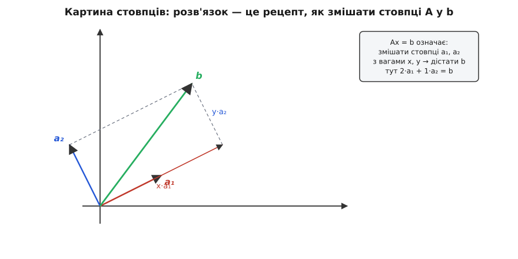
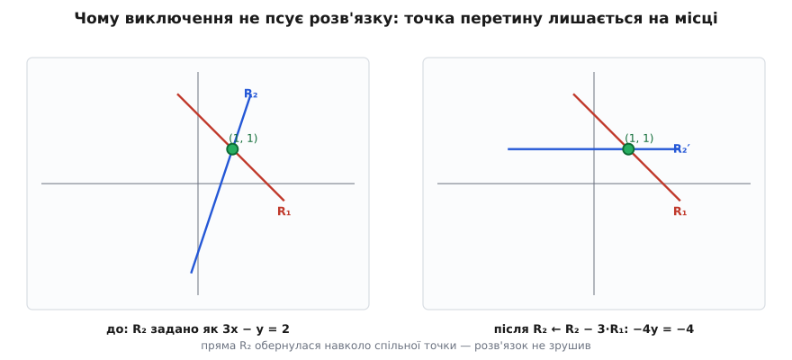
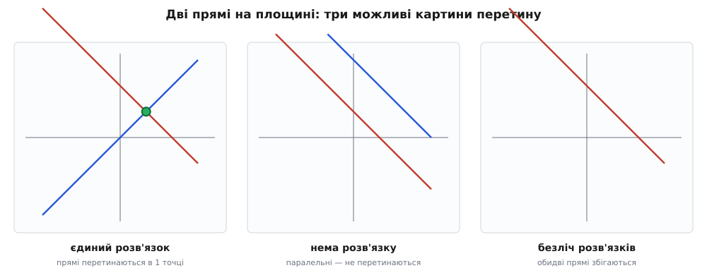

# Лінійні системи

Уявіть, що ви калібруєте давач. Ви знаєте: його вихід — це прямий перерахунок виміряної величини за формулою `вихід = a·вхід + b`, але самі числа `a` і `b` для вашого конкретного екземпляра невідомі. Ви робите два контрольні виміри з відомими еталонами — і дістаєте дві умови на ті самі два невідомі числа. Або інший випадок: ви ведете коло на папері, склали баланс струмів у вузлах і напруг у контурах, і у вас на руках п'ять рівнянь із п'ятьма невідомими струмами. У обох випадках перед вами **лінійна система** — набір рівнянь, де невідомі входять лише в першому степені, без квадратів, добутків чи синусів.

Чому саме «лінійна» і чому це таке часте, що варто окремої статті? Бо величезна частина світу, якщо дивитися зблизька, поводиться **прямо пропорційно**: подвоїв вхід — подвоївся внесок, склав два впливи — дістав їхню суму. Опір не зважає, скільки струму вже тече; жорсткість пружини не залежить від того, наскільки її вже розтягли (поки не зайшли в нелінійну зону). Там, де працює така [суперпозиція](book:math/linearity), задача про багато взаємопов'язаних величин неминуче зводиться до системи лінійних рівнянь. А отже, варто раз і назавжди розібратися, **як її розв'язати, коли розв'язок узагалі існує і чому метод працює**.

### Що таке лінійне рівняння і лінійна система

Почнімо з найпростішого. **Лінійне рівняння** (*linear*, від латинського *linea* — «лінія») з невідомими x, y, z — це рівність, де кожен доданок — або число, або число помножене на одну невідому:

```
2x + 3y − z = 5
```

Заборонено все, що згинає пропорційність: `x²`, `x·y`, `1/x`, `sin x`. Назва «лінійне» не випадкова — з двома невідомими графік такого рівняння на площині є **прямою лінією**, і саме ця геометрія далі все пояснить.

**Система** — це кілька таких рівнянь, які мають виконуватися **одночасно** на тих самих невідомих. Розв'язати систему означає знайти такі значення невідомих, що перетворюють **кожне** рівняння на правильну рівність. Ось приклад системи 3×3 (три рівняння, три невідомі):

```
 x +  y +  z =  6
2x + 3y −  z =  5
 x −  y + 2z =  5
```

З двома невідомими ще можна впоратися підстановкою: виразив y з першого рівняння, підставив у друге. Але вже з трьох змінних це стає плутаниною, а з десяти — безнадією. Потрібен спосіб, що діє **механічно й однаково** за будь-якого розміру. Перш ніж його дістати, переведімо систему в форму, у якій цей спосіб стає очевидним.

### Матрична форма Ax = b

Подивіться на ліві частини системи. Усі невідомі ті самі — x, y, z, — а змінюються лише **коефіцієнти** перед ними. Тож уся інформація розпадається на три окремі шматки: таблицю коефіцієнтів, стовпчик невідомих і стовпчик правих частин. Запишімо їх окремо:

```
 коефіцієнти A      невідомі x   праві b
┌ 1   1   1 ┐       ┌ x ┐       ┌ 6 ┐
│ 2   3  −1 │   ·   │ y │   =   │ 5 │
└ 1  −1   2 ┘       └ z ┘       └ 5 ┘
```

Прямокутна таблиця коефіцієнтів зветься [матрицею](book:math/matrices-as-operations) A, стовпчики невідомих і правих частин — векторами **x** і **b**. Уся система стискається в один короткий запис:

```
A·x = b
```

Це не просто скорочення для краси. Множення матриці на вектор означене так, що i-й рядок результату — це сума «коефіцієнт × невідома» по тому рядку, тобто рівно ліва частина i-го рівняння. Перевірмо перший рядок: `1·x + 1·y + 1·z`, і це має дорівнювати першому елементу **b**, тобто 6. Збігається з першим рівнянням. Запис `A·x = b` — це буквально вся система, лише складена компактно.

> 🔧 **Навіщо це.** Форма `A·x = b` — це інтерфейс між вашою задачею й готовим розв'язувачем. Зібрали ви матрицю кола, систему калібрування чи рівняння фітингу — далі ви не пишете власний алгоритм, а передаєте A і **b** у бібліотеку (LAPACK, Eigen, numpy.linalg.solve) і отримуєте **x**. Уся складність задачі вкладається в **те, як ви заповнили A і b**; решта — стандартна процедура. Тому вміти бачити свою задачу як `A·x = b` важливіше, ніж пам'ятати сам алгоритм.

Є й другий, глибший спосіб прочитати `A·x = b` — не по рядках, а **по стовпцях**, і саме він пояснить питання «коли розв'язок існує».

### Картина стовпців: розв'язок — це рецепт суміші

Подивімося на множення `A·x` інакше. Якщо позначити стовпці матриці A як вектори **a₁**, **a₂**, **a₃**, то результат — це їхня **зважена сума** з вагами x, y, z:

```
A·x  =  x·a₁  +  y·a₂  +  z·a₃
```

Тобто `A·x = b` питає: **з якими вагами треба змішати стовпці матриці, щоб дістати вектор b?** Невідомі — це і є ті ваги. Розв'язати систему означає знайти **рецепт**, як скомбінувати наявні «інгредієнти»-стовпці в потрібний «продукт» **b**.


*Картина стовпців для системи 2×2. Стовпці матриці — вектори a₁ і a₂; шукаємо ваги x, y так, щоб x·a₁ + y·a₂ дало цільовий вектор b. Тут 2·a₁ + 1·a₂ = b, тож розв'язок (x, y) = (2, 1). Складання йде паралелограмом: уздовж a₁ відкладаємо x·a₁, тоді паралельно a₂ доходимо до b.*

Ця картинка одразу робить видимим те, що в рядковому записі ховається. Якщо два стовпці дивляться в **різні боки** (не лежать на одній прямій), то, розтягуючи й комбінуючи їх, можна дотягнутися до **будь-якої** точки площини — отже, розв'язок завжди є і він один. А от якби обидва стовпці лежали **вздовж однієї прямої**, їхні суміші накрили б лише цю пряму — і вектор **b**, що стирчить убік, дістати було б **неможливо**. Звідси прямо випливає вся класифікація випадків, до якої ми йдемо. Спершу — як власне знаходять розв'язок.

### Метод виключення Гаусса і чому він працює

Ідея методу проста до зухвалості: **спрощувати систему, не міняючи її розв'язку**, доки відповідь не стане очевидною. Спрощувати дозволено лише трьома діями над рівняннями — і кожну варто зрозуміти, бо саме на них тримається коректність методу:

- **переставити два рівняння місцями** — порядок умов нічого не значить;
- **помножити рівняння на ненульове число** — `2x + 2y = 4` і `x + y = 2` вимагають того самого;
- **додати одне рівняння до іншого** (помножене на число) — якщо обидві рівності правдиві, то правдива й їхня сума.

Чому жодна з цих дій не псує розв'язку? Бо розв'язок — це набір значень, що задовольняє **всі** рівняння **разом**. Перші дві дії очевидно лишають кожне рівняння рівносильним собі. Третя тонша, тож подивімося на неї геометрично: кожне рівняння системи 2×2 — це пряма, а розв'язок — **точка перетину** двох прямих. Коли ми замінюємо рядок R₂ на «R₂ мінус скільки-то R₁», нова пряма проходить через ту саму точку перетину (бо там обидві вихідні рівності виконувалися, отже й будь-яка їхня комбінація). Пряма ніби **обертається навколо точки-розв'язку** — змінюється сама лінія, але спільна точка лишається прибита на місці.


*Чому виключення не псує розв'язку. Ліворуч система задана прямими R₁ і R₂, що перетинаються в (1, 1). Праворуч рядок R₂ замінено на R₂ − 3·R₁ — коефіцієнти стали інші, нова пряма R₂′ горизонтальна, але вона досі проходить через ту саму точку (1, 1). Операція «обертає» пряму навколо розв'язку, тож відповідь не зрушується — а рівняння стає простішим.*

Тепер сама процедура. Її розбивають на два ходи. **Прямий хід** (*forward elimination*) перетворює систему на **трикутну**: послідовно виключаємо змінні так, щоб під діагоналлю лишилися нулі. **Зворотний хід** (*back substitution*) розв'язує готовий трикутник знизу вгору. Зручно вести лише числа, склавши коефіцієнти й праві частини в одну **розширену матрицю** (риска відділяє праву частину):

```
┌ 1   1   1 │  6 ┐
│ 2   3  −1 │  5 │
└ 1  −1   2 │  5 ┘
```

**Прямий хід.** Беремо перший рядок за опорний і обнуляємо перший стовпець під ним. Від другого рядка віднімаємо 2×перший (R2 − 2R1), від третього — перший (R3 − R1):

```
┌ 1   1   1 │  6 ┐
│ 0   1  −3 │ −7 │
└ 0  −2   1 │ −1 ┘
```

Тепер опорний — другий рядок; обнуляємо під ним другий стовпець, додавши до третього 2×другий (R3 + 2R2):

```
┌ 1   1   1 │  6 ┐
│ 0   1  −3 │ −7 │
└ 0   0  −5 │−15 ┘
```

Система стала **трикутною** — під діагоналлю самі нулі.

**Зворотний хід.** Останній рядок має одну невідому: `−5z = −15`, звідки `z = 3`. Підставляємо вгору, у другий рядок: `y − 3·3 = −7`, тобто `y = 2`. І ще вгору, у перший: `x + 2 + 3 = 6`, тобто `x = 1`. Розв'язок `(x, y, z) = (1, 2, 3)` — і жодного здогаду, самі механічні кроки, придатні за будь-якого N. Цей механізм детально розписано в окремій статті про [метод Гаусса](book:math/gauss-elimination), включно з пасткою малого опорного елемента; нам тут важливо інше — що він **завжди** доводить систему до одного з трьох можливих результатів.

### Коли розв'язок один, коли його нема, коли їх безліч

Не кожна система має рівно одну відповідь — і це не дефект, а зміст задачі. Усе видно на найпростішому випадку двох рівнянь із двома невідомими, де кожне рівняння — пряма, а розв'язок — спільні точки прямих. Можливі рівно три картини.


*Три можливі взаємні розташування двох прямих — і рівно три типи розв'язку системи 2×2. Ліворуч прямі перетинаються в одній точці: єдиний розв'язок. У центрі вони паралельні (однаковий нахил, різні зсуви): спільних точок нема — система суперечлива. Праворуч прямі збігаються (одне рівняння — кратне іншого): спільна вся пряма, тобто безліч розв'язків.*

**Єдиний розв'язок** — прямі перетинаються в одній точці. Це «здоровий» випадок: рівнянь рівно стільки, скільки невідомих, і вони дають **незалежну** інформацію. У картині стовпців це означає, що стовпці дивляться в різні боки й накривають усю площину; у трикутній формі — що **на діагоналі немає нулів**, кожен зворотний крок ділить на ненульове число.

**Немає розв'язку** — прямі паралельні. Рівняння **суперечать** одне одному: умови несумісні, як-от `x + y = 1` і водночас `x + y = 3` (сума двох чисел не може бути одночасно 1 і 3). У прямому ході це проявляється як рядок-абсурд `0 = 3`: усі коефіцієнти зліва обнулилися, а праворуч лишилося ненульове число. Жоден набір x, y такого не вдовольнить. У картині стовпців — вектор **b** стирчить убік від напрямку, який накривають стовпці, і дотягнутися до нього неможливо.

**Безліч розв'язків** — прямі збігаються. Друге рівняння не несе **нічого нового**: воно лише кратне першому (наприклад `2x + 2y = 4` — це подвоєне `x + y = 2`). Інформації менше, ніж невідомих, тож одна змінна лишається **вільною**, а решта виражаються через неї — виходить цілий «промінь» розв'язків. У прямому ході це рядок `0 = 0` (зник цілком), і на діагоналі бракує опорного елемента.

Узагальнюючи на будь-який розмір: усе впирається в те, скільки **незалежної** інформації несуть рівняння. Якщо незалежних рівнянь рівно стільки, скільки невідомих, — розв'язок один. Якщо їх **менше** (якесь рівняння — комбінація інших), — лишаються вільні змінні й розв'язків безліч. А якщо рівняння **суперечать** одне одному — розв'язку нема взагалі. Прямий хід Гаусса якраз і виявляє, який це з трьох випадків: він або дає повний трикутник без нулів на діагоналі, або вилазить рядком `0 = щось ненульове`, або рядком `0 = 0`.

### Де лінійні системи працюють насправді

Лінійна система — це не вправа з підручника, а робочий інструмент, щойно задача стає «знайти кілька невідомих за кількома лінійними умовами».

- **Аналіз кіл.** Закони Кірхгофа (баланс струмів у вузлах і напруг у контурах) разом із законом Ома дають по одному лінійному рівнянню на вузол чи контур. Невідомі — потенціали або струми. Складна схема — це система на десятки рівнянь, і саме її всередині розв'язує SPICE-симулятор методом Гаусса. Докладніше про побудову таких рівнянь — у статті [аналіз кола](root:embedded/circuit-analysis).

- **Калібрування давачів.** Якщо вихід давача лінійно залежить від входу, `вихід = a·вхід + b`, то два контрольні виміри з відомими еталонами дають дві умови на два невідомі коефіцієнти a і b — система 2×2. Розв'язали її раз — і далі перераховуєте будь-який сирий відлік у фізичну величину. Складніший давач (із перехресним впливом кількох осей) дає матрицю калібрування й систему більшого розміру.

- **Фітинг і найменші квадрати.** Коли точок вимірювання **більше**, ніж невідомих параметрів моделі (типова ситуація: шумні дані, два-три параметри прямої чи площини), точного розв'язку зазвичай нема — пряма не пройде крізь усі точки одразу. Тоді шукають не точну рівність, а **найкраще наближення**: параметри, що мінімізують сумарну похибку. Цей пошук теж зводиться до невеликої лінійної системи — так званих нормальних рівнянь — і розв'язується тим самим виключенням. Сам метод розібрано окремо: [найменші квадрати](book:math/least-squares).

Спільне в усіх трьох — однаковий шлях: записати задачу як `A·x = b`, переконатися, що рівнянь і незалежної інформації стільки, скільки треба, і пропустити систему крізь виключення. Хто навчився бачити свою задачу в цій формі й розуміє, **чому** виключення працює і **які** три відповіді можливі, той тримає в руках один із найуніверсальніших інструментів прикладної математики — від паяльника до нейромережі.

### Маленький приклад у коді

Покажемо, як виглядає розв'язання системи 2×2 у прошивці — скажімо, той самий двоточковий перерахунок калібрування, де треба знайти коефіцієнти `a` і `b` за двома вимірами. Для 2×2 виключення зводиться до короткої формули (правило Крамера), і ділити доводиться на **визначник** — те саме число, що дорівнює нулю саме тоді, коли стовпці паралельні, тобто коли єдиного розв'язку нема:

:::tabs
```c
#include <stdbool.h>

// Розв'язати  a11*x + a12*y = b1
//             a21*x + a22*y = b2
// Повертає true й кладе результат у *x,*y; false — якщо розв'язок не єдиний.
bool solve2x2(double a11, double a12, double b1,
              double a21, double a22, double b2,
              double *x, double *y)
{
    double det = a11 * a22 - a12 * a21;   // визначник: 0 ⇒ прямі паралельні
    if (det == 0.0)
        return false;                     // нема єдиного розв'язку

    *x = (b1 * a22 - a12 * b2) / det;
    *y = (a11 * b2 - b1 * a21) / det;
    return true;
}
```
```cpp
#include <optional>
#include <utility>

// Розв'язати  a11*x + a12*y = b1
//             a21*x + a22*y = b2
// Повертає пару (x, y); std::nullopt — якщо розв'язок не єдиний.
std::optional<std::pair<double, double>>
solve2x2(double a11, double a12, double b1,
         double a21, double a22, double b2)
{
    double det = a11 * a22 - a12 * a21;   // визначник: 0 ⇒ прямі паралельні
    if (det == 0.0)
        return std::nullopt;              // нема єдиного розв'язку

    double x = (b1 * a22 - a12 * b2) / det;
    double y = (a11 * b2 - b1 * a21) / det;
    return std::make_pair(x, y);
}
```
```python
# Розв'язати  a11*x + a12*y = b1
#             a21*x + a22*y = b2
# Повертає (x, y); None — якщо розв'язок не єдиний.
def solve2x2(a11, a12, b1, a21, a22, b2):
    det = a11 * a22 - a12 * a21    # визначник: 0 ⇒ прямі паралельні
    if det == 0.0:
        return None                # нема єдиного розв'язку

    x = (b1 * a22 - a12 * b2) / det
    y = (a11 * b2 - b1 * a21) / det
    return x, y
```
:::

Зверніть увагу на перевірку `det == 0.0`: вона ловить рівно ті дві «погані» картини — паралельні прямі (нема розв'язку) і збіжні (безліч), бо в обох визначник нульовий. У реальній прошивці на дійсних числах надійніше порівнювати не з точним нулем, а з малим порогом (`fabs(det) < 1e-9`), бо округлення рідко дає рівний нуль; а для систем більшого розміру той самий код перетворюється на повноцінне [виключення Гаусса](book:math/gauss-elimination) з вибором опорного елемента. Але суть та сама, що й на прямих: ділимо на визначник, і якщо він нульовий — єдиної відповіді просто не існує.
