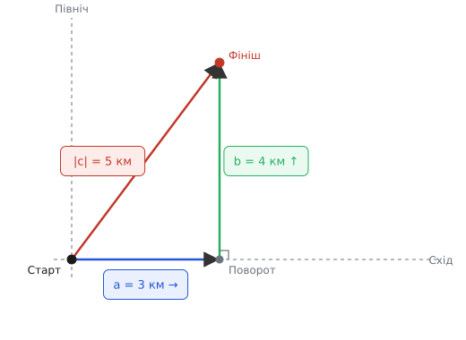
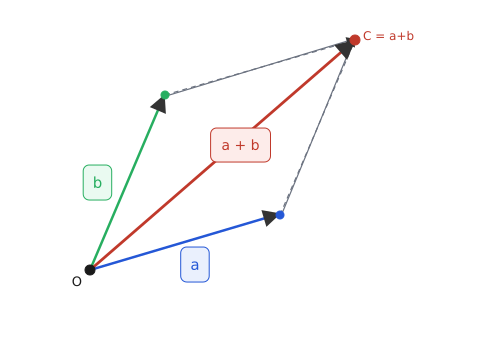
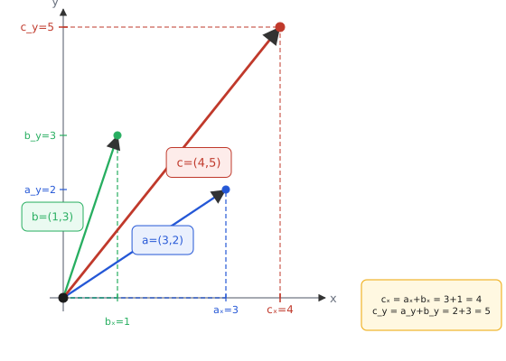

# Додавання векторів

Уявіть дрон, що висить на місці: двигуни тягнуть його вгору, вітер штовхає вбік, гравітація тягне донизу. Куди він полетить? Перша спокуса — скласти числа: 10 Н угору плюс 3 Н убік плюс 8 Н додолу. Але «вгору» і «вбік» — різні напрями, і проста сума 10 + 3 + 8 = 21 не відповідає ні на яке фізичне питання. Кожна з цих сил має не лише величину, а й напрям — і це все змінює.

Величини, що мають і розмір, і напрям, називають векторами (лат. *vector* — носій, перевізник, від *vehere* — везти; математичний термін у сучасному сенсі ввів Вільям Роуен Гамільтон у 1846 р.). Величини без напряму — лише число на шкалі — називають скалярами (лат. *scalaris*, від *scala* — сходи, шкала; термін теж запровадив Гамільтон у 1846 р. для дійсної частини кватерніона). Маса, температура, час — скаляри; сила, швидкість, переміщення — вектори. Питання «скільки разом?» для векторів не зводиться до арифметики над одним числом.

Ця стаття показує, як правильно скласти два вектори. Спочатку — геометрична інтуїція (чому не можна просто додати числа), потім — правило паралелограма як інший погляд на ту саму операцію, і нарешті — покомпонентне складання, яке перетворює «страшну» векторну дію на дві звичайні суми.

### Чому напрям усе змінює

Найчистіший вектор — переміщення (лат. *dislocatio* — зміна місця): воно однозначно задається відстанню і напрямом, і його поведінка при складанні найпростіша для сприйняття. Уявіть: ви пройшли 3 км строго на схід, а потім 4 км строго на північ. Де ви відносно початку? Не за 7 км: підсумкове переміщення коротше, бо кроки пішли в різні боки і частково «скасовують» відстань один від одного.

Щоб знайти підсумок, малюють перший вектор (стрілку від хвоста до голови), а другий — «чіпляють» хвостом до голови першого. Підсумок — стрілка від хвоста першого до голови другого. Це метод «голова до хвоста», або метод трикутника. Логіка проста: вектор каже «звідси — отуди»; додати другий — означає продовжити подорож із місця, де скінчився перший. Підсумкова подорож — від справжнього старту до справжнього фінішу.


*Метод трикутника: перший вектор (схід, 3 км) + другий (північ, 4 км). Результанта — пряма від старту до фінішу, її довжина 5 км — менша, ніж 3+4.*

Підсумок векторного складання називають результантою (лат. *resultans* — той, що виходить із чогось). Ключова властивість: її довжина залежить від кута між векторами, а не лише від їхніх довжин. Ті самі 3 і 4 дадуть 7 (однонапрямлені вектори, кут 0°), 1 (зустрічні, кут 180°) або 5 (прямий кут, 90°) — три різні відповіді для однієї пари чисел. Тому операція і є окремою — не скорочується до звичайного додавання.

Звідси пряме слідство — нерівність трикутника: |**a** + **b**| ≤ |**a**| + |**b**|, де |·| означає довжину вектора. Рівність досягається лише тоді, коли обидва вектори однонапрямлені (або один із них нульовий): тільки тоді діагональ «розгладжується» в пряму лінію і коротший шлях дорівнює сумі шляхів. В усіх інших випадках пряма між двома точками коротша за обхідну стрілку.

> 🔧 **Навіщо це.** Навігація і керування рухомими об'єктами будуються саме на цій операції. Підсумкова швидкість тіла у воді чи повітрі — це власна швидкість плюс знесення середовищем. Якщо скласти числа, а не вектори, розрахована траєкторія не збіжиться з реальною: дрон промахне повз ціль, корабель пристане не туди.

### Правило паралелограма

Метод трикутника працює, коли вектори «йдуть один за одним». Але уявіть дві сили, що одночасно діють на одне тіло — їх природно малювати з **однієї** точки (хвости разом, як два промені). Тут зручніша інша картинка — правило паралелограма: сума — діагональ паралелограма, побудованого на двох векторах.

Чому це та сама операція? Паралелограм будується так: до кінця першого вектора приставляємо копію другого (паралельно й тієї самої довжини), і навпаки. Копія другого, приставлена до кінця першого — це і є крок «голова до хвоста». Тобто діагональ паралелограма = результанта методу трикутника. Два погляди на одну й ту саму геометрію.


*Два вектори з однієї точки утворюють паралелограм. Пунктир — перенесення другого вектора до кінця першого. Видно, що тут ховається той самий трикутник: результанта однакова.*

Коли яка картинка зручніша? Метод трикутника — для послідовних переміщень (крок-потім-крок). Паралелограм — для одночасних впливів із однієї точки (дві сили, два прискорення). Підсумок у обох однаковий, але паралелограм наочніше показує симетрію.

Саме завдяки симетрії паралелограма відразу видно комутативність: **a** + **b** = **b** + **a**. Паралелограм симетричний відносно діагоналі — переставте ролі двох сторін, і та сама діагональ лишиться на місці. Тобто порядок доданків не впливає на результант — і це не аксіома, а геометричний факт.

### Розкладання на осі

Геометрія дає інтуїцію, але малювати й міряти лінійкою на практиці не виходить: не точно і не масштабується. Потрібен спосіб складати вектори числами — і він є, причому напрочуд простий, якщо розкласти кожен вектор на складники вздовж осей координат.

Будь-який вектор на площині можна подати як суму двох: «стільки вправо» і «стільки вгору». Ці дві складові — компоненти (лат. *componens* — складник), або проєкції на осі. Вектор **a** записують як пару (*aₓ*, *a_y*), де *aₓ* — горизонтальна компонента, *a_y* — вертикальна. Про те, як саме виміряти компоненти довільного вектора за кутом і довжиною, йдеться у статті [складові вектора](book:math/vector-components): там пояснено, чому *aₓ = |a|·cos θ* та *a_y = |a|·sin θ* і звідки беруться ці тригонометричні функції.

Маючи компоненти, складання набуває вражаючої простоти. Уздовж кожної осі вектори додаються як звичайні числа, незалежно одна від одної:

```
(a + b)ₓ = aₓ + bₓ
(a + b)_y = a_y + b_y
```

Чому незалежно? Тому що осі перпендикулярні: рух уздовж *x* не дає жодного зсуву вздовж *y*, і навпаки. Горизонтальні внески збираються лише між собою, вертикальні — лише між собою. Ось чому «страшна» векторна операція розпадається на дві прості скалярні суми — кожна вісь є незалежним каналом.


*Компоненти двох векторів складаються окремо: горизонталі до горизонталей, вертикалі до вертикалей. Вектор результанти збирається з двох незалежних сум.*

Це не просто обчислювальний трюк — за ним стоїть принцип адитивності, докладніше описаний у статті [суперпозиція](book:math/linearity): якщо система (тут — координатна проєкція) лінійна, відгук на суму дорівнює сумі відгуків. Кожна вісь — свій незалежний «канал» обробки.

Склавши компоненти, можна повернутися до довжини й напряму. Довжина результанти |**c**| = √(*cₓ*² + *c_y*²) — це Піфагор: компоненти є катетами прямокутного трикутника, а сам вектор — гіпотенузою. Напрям θ = atan2(*c_y*, *cₓ*): функція atan2 бере обидва катети і повертає кут у правильному квадранті від −π до π.

> 🔧 **Навіщо це.** Саме так будь-яка прошивка, фізичний рушій або симулятор додає вектори: не геометрично, а покомпонентно. Підсумкова сила у фізичному двигуні — це `fx += f2x`, `fy += f2y`. Фільтр орієнтації складає прискорення й гіроскопні приріри поосьово. Дві прості суми — і ніякої геометрії.

### Порахуймо: човен через річку

**Умова.** Човен веслує строго поперек річки зі швидкістю 3 м/с (вектор **b** = (0, 3), вісь *y* — поперек). Течія зносить його вздовж берега зі швидкістю 4 м/с (вектор **a** = (4, 0), вісь *x* — уздовж берега). Яка підсумкова швидкість човна відносно берега — величина й напрям?

```
Крок 1. Компоненти векторів:
  a = (4, 0)    — течія вздовж берега
  b = (0, 3)    — веслування поперек

Крок 2. Покомпонентна сума c = a + b:
  cₓ = 4 + 0 = 4 м/с
  c_y = 0 + 3 = 3 м/с

Крок 3. Модуль (Піфагор):
  |c| = √(4² + 3²) = √(16 + 9) = √25 = 5 м/с

Крок 4. Напрям (кут відносно берега):
  θ = atan2(3, 4) ≈ 36.87°  від лінії течії
  або  90° − 36.87° ≈ 53.13°  від берегової лінії
```

Результат: 3 і 4 дали 5, а не 7. Човен іде під кутом — реальна траєкторія є діагоналлю. Щоб потрапити точно напроти, веслувальник мав би веслувати під кутом проти течії — «компенсувати» 4 м/с знесення. Це вже операція віднімання: від власного вектора відняти знесення.

Ось як це виглядає в реальному C-коді:

```c
typedef struct { float x, y; } Vec2;

Vec2 vec2_add(Vec2 a, Vec2 b) {
    return (Vec2){ a.x + b.x, a.y + b.y };
}

/* використання */
Vec2 current  = {4.0f, 0.0f};   /* течія */
Vec2 paddling = {0.0f, 3.0f};   /* веслування */
Vec2 result   = vec2_add(current, paddling);

float speed = hypotf(result.x, result.y);     /* = 5.0 */
float angle = atan2f(result.y, result.x);     /* ≈ 0.6435 рад ≈ 36.87° */
```

Дві суми, ніякої геометрії. `hypotf(x, y)` повертає √(*x*² + *y*²), `atan2f(y, x)` — кут у правильному квадранті (перший аргумент *y*, другий *x*, повертає значення у діапазоні (−π, π]).

### Алгебра, що з цього випливає

Покомпонентне складання автоматично успадковує всі алгебраїчні властивості від звичайного додавання чисел — поосьово. Їх варто знати, але жодної з них не треба «вводити» як окрему аксіому: вони прозоро виводяться.

**Комутативність** **a** + **b** = **b** + **a** видна з паралелограма — і підтверджується числом: *aₓ + bₓ = bₓ + aₓ* на кожній осі, бо додавання чисел комутативне.

**Асоціативність** (**a** + **b**) + **c** = **a** + (**b** + **c**) — якщо малюємо три переміщення ланцюжком «голова до хвоста», підсумок від першого хвоста до останньої голови однаковий незалежно від того, як ми їх групуємо. Числово: скласти три числа можна в будь-якому порядку.

**Нульовий вектор** **0** = (0, 0) — «нікуди не рухатися». Додавання нуля нічого не змінює: *aₓ + 0 = aₓ*, *a_y + 0 = a_y*. Це вектор, що грає роль нуля в звичайній арифметиці.

**Множення на скаляр** *k*·**a** = (*k*·*aₓ*, *k*·*a_y*) — розтяг або стиск (при *k* > 1 або 0 < *k* < 1), при *k* < 0 — розворот на 180°. Ця операція потрібна, щоб означити протилежний вектор: −**a** = (−1)·**a** = (−*aₓ*, −*a_y*).

**Віднімання** **a** − **b** = **a** + (−1)·**b** — вектор «від кінця **b** до кінця **a**» (якщо вони виходять з однієї точки). Практичний сенс: різниця двох положень — це переміщення між ними; різниця двох швидкостей — відносна швидкість. Веслувальник, що хоче вирівняти знесення течією, мусить вибрати напрямок: власна швидкість = бажана швидкість − вектор течії — це і є віднімання.

### Де працює

Ця проста операція несе на собі значну частину фізики й інженерії — просто тому, що будь-яка векторна величина складається саме так. Сили: рівнодійна кількох сил — паралелограм чи покомпонентна сума. Швидкості та прискорення: відносний рух, знесення, ефект Доплера — все це векторні суми і різниці. Переміщення: будь-яка траєкторія — ланцюжок переміщень, і підсумкове — їхня векторна сума. Поля: накладання електричних чи магнітних полів від кількох джерел — суперпозиція векторних полів, де в кожній точці простору поля складаються покомпонентно.

В математиці й коді ця операція є фундаментом лінійної алгебри. Векторний простір означується саме через коректне додавання векторів і множення на скаляр — і все подальше (базис, лінійні відображення, матриці) стоїть на цьому. Зв'язок прямий: матриця діє на вектор саме так, що її стовпці «покомпонентно зважуються» і складаються — докладніше в статті [матриці як дії](book:math/matrices-as-operations).

Страх перед «векторами» зайвий. Щойно є осі, додавання — це дві незалежні суми чисел. Уся хитрість була в тому, щоб правильно розкласти вектор на складники — а не в самому додаванні. Напрям є рівноправним із величиною: він не «ускладнює» математику, він просто вимагає окремого рахування вздовж кожної осі. І саме ця простота дозволяє закладати векторне складання в мікроконтролер у вигляді двох рядків коду.
