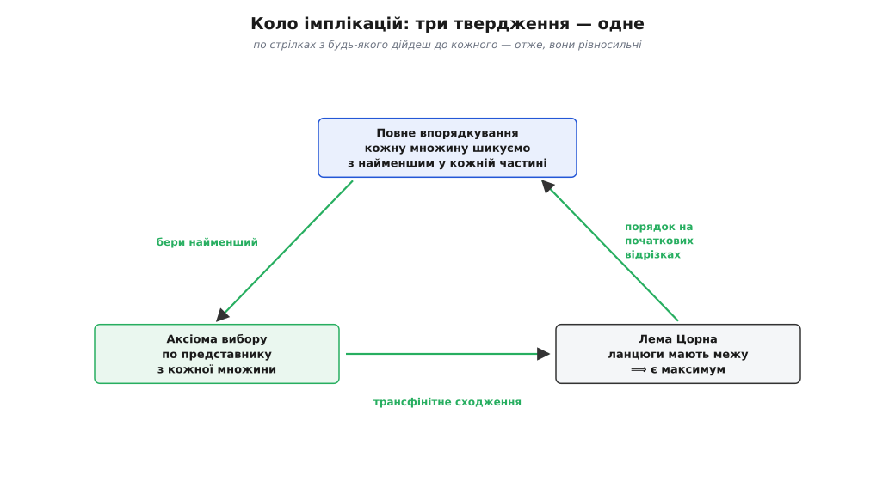
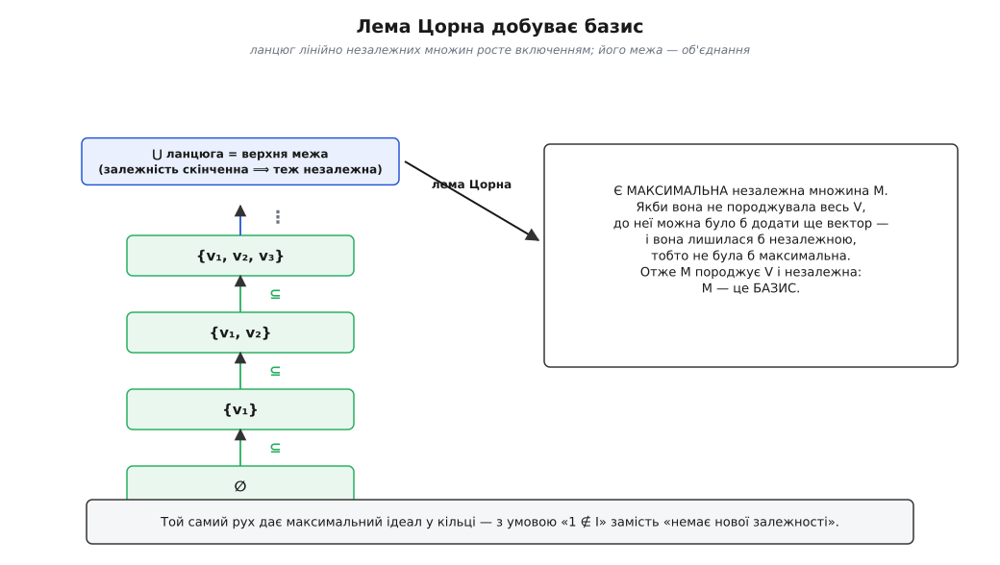

# 🧮 Замкнене коло: вибір, порядок і максимум доводяться одне з одного

Три твердження говорять про геть різні речі. Одне обіцяє **функцію-вибірку** — по представнику з кожної множини нараз. Друге накидає на будь-яку множину **порядок**, у якому завжди є найменший. Третє видає **максимальний елемент**, щойно ланцюги мають межу. На перший погляд між ними нема нічого спільного: вибірка, порядок, максимум — три окремі бажання. А проте в теорії множин без вибору кожне з них тягне за собою два інші, тож прийняти одне означає мовчки прийняти всі три.

Щоб у цьому пересвідчитися, порівнювати їхні змісти марно — треба **збудувати мости й пройти ними**. План простий: доведемо коло імплікацій

```
повне впорядкування  →  аксіома вибору  →  лема Цорна  →  повне впорядкування
```

Коли коло замкнеться, три твердження зваряться в одне: з будь-якого дійдеш до будь-якого, ідучи по стрілках. Дорогою ми лемою Цорна за півсторінки добудемо базис якого завгодно векторного простору й максимальний ідеал якого завгодно кільця — а тоді розберемо, **чому** «накинути порядок», «знайти максимум» і «вибрати представників» — це насправді одна й та сама сила під трьома масками.

### Словник, без якого не рушити

Дві ланки з трьох живуть у світі **часткових порядків**, тож спершу домовмося про слова — інакше лема Цорна лишиться пустим звуком.

**Частковий порядок** на множині *P* — це відношення `≤`, що справджує три звичні властивості: кожен елемент не менший за себе (рефлексивність), якщо *a* ≤ *b* і *b* ≤ *a*, то це той самий елемент (антисиметричність), і з *a* ≤ *b* ≤ *c* випливає *a* ≤ *c* (транзитивність). Слово **частковий** тут — ключове: воно означає, що деякі пари елементів можуть бути **непорівнянні**, ні *a* ≤ *b*, ні *b* ≤ *a*. Взірцевий приклад — підмножини якоїсь множини, упорядковані **включенням** ⊆: {1} і {2} не порівняти, жодна не сидить у другій, хоча обидві є в {1, 2}.

```
Частковий порядок (P, ≤):
    a ≤ a                        (рефлексивність)
    a ≤ b  і  b ≤ a   ⟹  a = b   (антисиметричність)
    a ≤ b  і  b ≤ c   ⟹  a ≤ c   (транзитивність)
непорівнянні пари ДОЗВОЛЕНІ — тим він і «частковий»
```

**Ланцюг** — це така частина *P*, у якій непорівнянних пар немає зовсім: будь-які два її елементи стоять в одну лінію (*a* ≤ *b* або *b* ≤ *a*). Ланцюг — острівець повного, лінійного порядку посеред частково впорядкованого моря. **Верхня межа** ланцюга (чи взагалі будь-якої частини) — елемент *u* ∈ *P*, не менший за кожен елемент тієї частини; він не мусить належати до неї сам. І нарешті **максимальний елемент** *m* — той, над яким **нікого немає**: не існує *x* ∈ *P* з *x* > *m*.

Лема Цорна тепер звучить так: *якщо в частково впорядкованій множині кожен ланцюг має верхню межу, то в усій множині є максимальний елемент.* Робочий важіль: щоб добути «найбільший можливий» об'єкт, перевіряєш умову лише на ланцюгах — і лема безкоштовно видає максимум.

> 🔧 **Навіщо це.** Максимальний — не те саме, що найбільший. **Найбільший** елемент стоїть над **усіма** без винятку; **максимальний** — лише над тими, з ким його взагалі можна порівняти, а поряд може бути ще один такий самий, йому непідвладний. У множині {{1}, {2}, {1, 2}} за включенням найбільший є — це {1, 2}. А в множині {{1}, {2}} максимальних **двоє** (обидві одноелементні), а найбільшого немає. Лема Цорна обіцяє саме максимальний — «нікого над ним», а не «над усіма»; змішати ці два поняття означає довести не те, що хотів.

Останнє слово — про [повне впорядкування](book:math/well-ordering-principle): це лінійний порядок, у якому **кожна** непорожня частина має **найменший** елемент. Саме він перетворює множину на щось, з чого можна брати «найменший» так само впевнено, як з натуральних чисел, — хоч би що то була за множина.

### Легка ланка: маючи порядок, вибирай найменший

Почнімо з найкоротшого моста — від повного впорядкування до вибору. Він настільки простий, що майже не потребує доказу, — і саме тому добре показує, у чому суть.

Нехай дано родину непорожніх множин { *Aᵢ* : *i* ∈ *I* }, з якої треба взяти по представнику. Складімо всі елементи докупи в одну множину *U* = ⋃ *Aᵢ* і — за припущенням, яким ми зараз користуємося, — **цілком упорядкуймо** її: накиньмо на *U* повний порядок `≤`, у якому кожна непорожня частина має найменший. Тепер функція вибору виписується сама:

```
Дано:  повний порядок ≤ на  U = ⋃ Aᵢ
Кожна Aᵢ ⊆ U непорожня  ⟹  має в цьому порядку НАЙМЕНШИЙ елемент.
Означ:   f(i) = min(Aᵢ)   — найменший елемент Aᵢ за порядком ≤.
Тоді  f(i) ∈ Aᵢ  при кожному i.   ∎
```

Ось і все. Жодного свавілля, жодного «тицяння пальцем»: порядок сам, одним розчерком, каже, кого брати з кожної множини — найменшого. Це Расселлові черевики, тільки доведені до краю: повний порядок — то **універсальне правило «бери лівий»**, накинуте на цілий світ нараз. Де є порядок, там представник вибирається безкоштовно, і аксіома вибору тут ні до чого — уся її робота вже зроблена тим, хто дав порядок.

Мораль ланки: **порядок виготовляє вибір**. «Найменший» — це готове правило, а правило — це саме те, чого бракувало Расселловим шкарпеткам. Тому теорема про повне впорядкування не просто **тягне** аксіому вибору — вона дає її майже задарма.

### Ланка через нескінченність: вибір розганяє сходження

Тепер важча стрілка — від вибору до леми Цорна. Її ми доведемо **ескізом**: покажемо кістяк, а тонку бухгалтерію лишимо трансфінітній рекурсії. Але саме в цьому ескізі видно, **навіщо** взагалі потрібен вибір.

Маємо частковий порядок *P*, у якому кожен ланцюг має верхню межу. Треба знайти максимальний елемент. Ведімо **від супротивного**: припустімо, максимального **немає**. Тоді над кожним *x* ∈ *P* хтось та стоїть — множина

```
U(x) = { y ∈ P : y > x }   непорожня при КОЖНОМУ x
```

За аксіомою вибору візьмімо по представнику з кожної *U*(*x*) — дістанемо функцію *g*, що кожному *x* призначає **якийсь строго вищий** елемент:

```
g(x) ∈ U(x),   тобто   g(x) > x   для всіх x ∈ P.
```

Ось де вступив вибір — і вступив по суті. Функція *g* — це правило «з будь-якої точки крокни вгору», а такого правила **саме по собі може не бути**: над *x* хтось є, але хто саме — жодна ознака не підказує, як над Расселловими шкарпетками. Аксіома вибору дарує *g* попри те, що виписати її неможливо. І цією *g* ми тепер розганяємо нескінченне сходження.

Будуймо ланцюг, що дереться вгору й ніколи не спиняється. Візьмімо якесь *a*₀. Далі *a*₁ = *g*(*a*₀) > *a*₀, *a*₂ = *g*(*a*₁) > *a*₁, і так по натуральних кроках. Коли натуральні кроки вичерпано, зібране { *a*₀, *a*₁, *a*₂, … } — ланцюг; за нашою умовою в нього є верхня межа *b*, і ми штовхаємо сходження далі: *a*ω = *g*(*b*) стоїть над усім, що набудовано. Потім знову крок за кроком, знову межа на новій границі — і так **крізь усі [порядкові числа](book:math/ordinal-numbers)**, крізь ординали, довші за будь-яку нескінченність.

Придивімося, що вийшло. Кожен наступний елемент **строго більший** за всі попередні, тож усі *a*α — різні, і їх рівно стільки, скільки ординалів. А це вже катастрофа: ми впхнули **всі ординали** (а їх незліченно, більше за будь-яку множину) у нашу єдину множину *P*. Теорема Гартоґса (нім. Friedrich Hartogs, 1915) каже, що так не буває: для кожної множини знайдеться ординал, який у неї не вкладається. Суперечність. Отже, наше припущення хибне — **максимальний елемент таки є**.

```
Ескіз  вибір → лема Цорна:
  1. Нема максимуму  ⟹  над кожним x є вищий  ⟹  U(x) ≠ ∅.
  2. Вибір дає g:  g(x) > x  для всіх x        (правило «крокни вгору»).
  3. Трансфінітно будуємо  a₀ < a₁ < … < aω < …  крізь усі ординали
     (наступник — через g, границя — верхня межа ланцюга, тоді знов g).
  4. Строго зростає  ⟹  усі ординали вклалися в P  ⟹  суперечність (Гартоґс).
  5. Значить, максимум існує.   ∎ (ескіз)
```

Дві деталі несуть усю вагу. **Вибір** дає крок — без нього сходження не зрушить із місця, бо «вищий є, але котрий?» лишається без відповіді. **Умова про ланцюги** дає границю — без неї сходження обірвалося б на першій же нескінченності. Разом вони гнали б угору **вічно**, якби нагорі не стояла стіна. Ця стіна — максимальний елемент; лема Цорна лише називає її вголос.

### Замикання кола: максимум накидає порядок

Лишилася третя стрілка — від леми Цорна назад до повного впорядкування. Вона замкне коло, а заразом покаже другий бік тієї самої монети: якщо перша ланка робила **вибір із порядку**, то ця робить **порядок із максимуму**.

Візьмімо будь-яку множину *X* і збудуймо для леми Цорна правильну «арену». Її елементи — не самі точки *X*, а **пари** (*A*, ≤*A*): підмножина *A* ⊆ *X* разом із повним порядком ≤*A* на ній. Тобто кожен елемент арени — це шматок *X*, уже цілком упорядкований. Порядок на самій арені задаймо так: (*A*, ≤*A*) ≼ (*B*, ≤*B*), якщо *B* **продовжує** *A* — містить його як **початковий відрізок** (усе нове дописане згори, а на старому порядок не змінився).

Перевіримо умову Цорна на ланцюгах. Нехай є ланцюг таких пар — сімейство впорядкованих шматків, кожен продовжує попередні. Їхнє **об'єднання** — множина *A** = ⋃ *A* з «клеєним» порядком — знову цілком упорядковане (будь-яка непорожня частина зачіпає котрийсь шматок, а в ньому вже є найменший, і він найменший скрізь), і кожен шматок ланцюга сидить у ньому початковим відрізком. Отже, об'єднання — верхня межа ланцюга. Умова виконана, і лема Цорна видає **максимальну** пару (*M*, ≤*M*).

Лишилося показати, що *M* — це вся *X*. Припустімо навпаки: є точка *x* ∈ *X*, якої в *M* немає. Тоді допишімо її **згори** — над усіма елементами *M*. Дістанемо повний порядок на *M* ∪ {*x*}, що строго продовжує (*M*, ≤*M*), — а це суперечить її максимальності. Значить, зайвих точок немає: *M* = *X*, і ≤*M* повністю впорядковує всю *X*.

```
Ескіз  лема Цорна → повне впорядкування:
  Арена:  пари (A, ≤A) — упорядковані шматки X;
          (A,≤A) ≼ (B,≤B)  ⟺  B продовжує A як початковий відрізок.
  Ланцюг таких пар  ⟶  об'єднання знову цілком упорядковане = верхня межа.
  Цорн  ⟶  максимальна пара (M, ≤M).
  Якби M ≠ X — допиши пропущену точку згори → продовження → суперечність.
  Отже M = X:  уся X цілком упорядкована.   ∎
```

Коло замкнулося. Повне впорядкування дало вибір, вибір дав лему Цорна, лема Цорна повернула повне впорядкування — з будь-якого твердження, йдучи по стрілках, дійдеш до кожного іншого. Троє рівносильні. (Історично найгучнішою була саме стрілка вибір → повне впорядкування: її 1904 року провів Ернст Цермело (нім. Ernst Zermelo) як теорему про повне впорядкування — і збурив усю французьку школу. Наше коло переказує ту саму рівносильність довшим шляхом, через Цорнів максимум.)



*Коло замикається — і три твердження стають одним. Кожна стрілка — окремий доказ; пройшовши колом, з будь-якого з трьох дістанешся до решти двох.*

### Робота леми: у кожного простору є базис

Тепер — заради чого все це затівалося. Покажімо лемою Цорна, що **кожен** [векторний простір](book:math/vector-space) *V* має **базис**: таку лінійно незалежну множину, що нею через скінченні лінійні комбінації виражається весь простір. Для звичних скінченновимірних просторів це шкільна річ; уся сіль — у нескінченновимірних (простори функцій, послідовностей), де базис поелементно не збудуєш ніколи.

Ставимо арену для леми. Її елементи — **лінійно незалежні** підмножини *V*, а порядок — звичайне **включення** ⊆. Арена непорожня: порожня множина лінійно незалежна за домовленістю. Перевіримо умову на ланцюгах — і тут ховається єдиний, зате вирішальний, доказовий крок.

Нехай є ланцюг лінійно незалежних множин *S*₁ ⊆ *S*₂ ⊆ … (можливо, незліченно довгий). Їхнє **об'єднання** *U* = ⋃ *S* — чи воно теж лінійно незалежне? Так, і ось **чому**. Лінійна залежність — явище **скінченне**: якщо в *U* є нетривіальна залежність, то вона зачіпає лише скінченно багато векторів *v*₁, …, *vₙ*. Кожен із них лежить у котромусь члені ланцюга; а що члени **лінійно впорядковані включенням**, то серед цих скінченно багатьох знайдеться один найбільший *S*, який містить **усі** *v*₁, …, *vₙ*. Але *S* — лінійно незалежна, тож ніякої залежності між її векторами бути не може. Суперечність: залежності в *U* немає.

```
Чому об'єднання ланцюга лишається незалежним:
  Залежність  c₁v₁ + … + cₙvₙ = 0  (не всі cₖ нулі) зачіпає СКІНЧЕННО багато vₖ.
  Кожен vₖ ∈ якомусь Sₖ ланцюга;  ланцюг лінійний  ⟹  усі vₖ ∈ одному найбільшому S.
  S незалежна  ⟹  такої залежності нема.  Отже U = ⋃S — незалежна.
```

Об'єднання *U* лінійно незалежне й містить кожен член ланцюга — тобто це **верхня межа** ланцюга просто в самій арені. Умова Цорна виконана, і лема видає **максимальну** лінійно незалежну множину *M*.

Лишається довести, що ця *M* — базис, тобто що вона **породжує** весь *V*. Знову від супротивного: хай є вектор *v* ∈ *V*, який не виражається через *M*. Тоді *M* ∪ {*v*} — теж лінійно незалежна! Справді, будь-яка залежність у ній має вигляд *a*·*v* + (комбінація з *M*) = 0; якби *a* ≠ 0, ми виразили б *v* через *M* (усупереч вибору *v*), тож *a* = 0 — а тоді лишається залежність усередині самої *M*, якої там нема. Отже, *M* ∪ {*v*} строго більша за *M* й досі незалежна — а це суперечить максимальності *M*. Значить, невиразних векторів немає: *M* породжує *V* і лінійно незалежна, тобто **базис**.

```
Ескіз  лема Цорна → базис:
  Арена: лінійно незалежні підмножини V, порядок — включення ⊆.
  Ланцюг  ⟶  об'єднання незалежне (залежність скінченна) = верхня межа.
  Цорн   ⟶  максимальна незалежна множина M.
  M породжує все: інакше M ∪ {v} досі незалежна → M не максимальна.
  Отже M — базис.   ∎
```



*Механізм у дії: ланцюг незалежних множин, об'єднання-межа, максимум-базис. Той самий рух із заміною однієї умови добуває максимальний ідеал.*

> 🔧 **Навіщо це.** Ось де аксіома вибору тихцем заходить у щоденну алгебру. Коли пишуть «нехай {*eᵢ*} — базис простору» для нескінченновимірного *V*, це **виклик леми Цорна**, а через неї — вибору. Найгостріший приклад: у дійсних числах ℝ, взятих як векторний простір над раціональними ℚ, базис (його звуть базисом Гамеля, нім. Georg Hamel, 1905) — **незліченний**, і жодного такого базису ніхто ніколи не виписав і не випише. Лема Цорна присягає, що він **є**, — і замовкає, не давши в руки жодного вектора. Це «у кожного простору є базис» не просто випливає з вибору: воно йому **рівносильне**, ще одне обличчя тієї самої сили.

### Принагідно: максимальний ідеал у кільці

Той самий важіль добуває наріжний факт алгебри: **у кожному ненульовому [кільці](book:math/rings) з одиницею є максимальний ідеал**. Доказ — той самий рух, майже дослівно.

Арена — усі **власні** ідеали кільця *R* (власний означає *I* ≠ *R*, що для кільця з одиницею те саме, що 1 ∉ *I*), упорядковані включенням. Непорожня: нульовий ідеал {0} власний, бо *R* ненульове. Ланцюг власних ідеалів: їхнє об'єднання знову ідеал (будь-які два елементи лежать у спільному члені ланцюга, тож і сума, і кратні нікуди з об'єднання не випадають), і він **власний** — бо одиниці немає в жодному члені, отже, немає й в об'єднанні. Верхня межа знайшлася; лема Цорна видає максимальний елемент арени — **максимальний ідеал**.

```
Ескіз  лема Цорна → максимальний ідеал:
  Арена: власні ідеали R (тобто 1 ∉ I), порядок — включення ⊆.
  Ланцюг  ⟶  об'єднання — власний ідеал (1 в жодному ⟹ 1 ∉ ⋃) = верхня межа.
  Цорн   ⟶  максимальний власний ідеал.   ∎
```

Цей факт носить ім'я **Вольфганга Крулля** (нім. Wolfgang Krull), що довів його 1929 року — щоправда, ще трансфінітною індукцією, бо лема Цорна ввійде в ужиток лише за шість років по тому; сьогодні її однорядковий доказ став канонічним.

Придивіться, у чому близнюки два останні докази. В обох арена трималася на одній забороні: у базисі — «жодної нової лінійної залежності», в ідеалі — «одиниці всередині немає». І в обох випадках об'єднання ланцюга проходить крізь умову рівно тому, що **отруйний елемент не може прослизнути в об'єднання**: залежність зачепила б скінченно багато векторів, усі з одного члена, — а там її нема; одиниця мусила б лежати в котромусь члені — а там її нема. Уся механіка леми Цорна щоразу впирається в цю саму дрібницю про об'єднання ланцюга.

### Чому це одна сила

Тепер відступімо на крок і подивімося на всі три твердження разом. Вони справді про різне — і водночас про одне.

**Вибрати представників** — це роздобути одну функцію *f*, яка нараз, для всієї нескінченної родини, каже, кого брати. **Накинути порядок** — це роздобути одне відношення `≤`, у якому «найменший» стає правилом; а правило — це і є готовий вибір, тому порядок **виготовляє** вибірку задарма (перша ланка). Навпаки, маючи вибір, порядок можна **виростити**: раз по раз відкладай «наступного, ще не поставленого», крізь усі ординали, — і Цермелове сходження цілком упорядкує множину. **Знайти максимум** — це роздобути один об'єкт, на якому сходження мусить спинитися; а щоб те сходження вести, ти на кожному кроці **вибираєш** вищу точку (вибір) і нанизуєш кроки в **порядок** (ланцюг). Три дії сплетені так тісно, що виявляються однією.

Де ж корінь? У **нескінченності**. Придивіться: для **скінченної** арени жодне з трьох тверджень нічого не коштує. Зі скінченної родини вибірку будуєш по черзі, і черга закінчиться. Скінченну множину впорядкуєш перебором. Скінченний частковий порядок має максимум просто тому, що більшати нема куди. Уся сила — і вся ціна — з'являється рівно тоді, коли арена **нескінченна** й процес «крок за кроком» **не має кінця**. Тоді завершеного об'єкта — вибірки, порядку, максимуму — не **збудуєш** послідовністю дій, бо послідовність не вривається; його доводиться **постулювати цілим**, одним махом.

Ось чому три твердження рівносильні: усі троє — це той самий єдиний акт, **завершити нескінченне в один розчерк**. Функція, що вибирає все нараз; порядок, що шикує все нараз; максимум, що вивершує все нараз. Різні на слух, вони промовляють одне бажання — обійняти нескінченне однією дією, — і тому стоять або падають разом. Форму з максимумом незалежно намацали троє: Фелікс Гаусдорф (нім. Felix Hausdorff) 1914 року своїм принципом про максимальний ланцюг, Казимеж Куратовський (пол. Kazimierz Kuratowski) 1922-го й Макс Цорн (нім. Max Zorn) 1935-го. Саме її — «перевір ланцюги, дістань максимум» — робочий математик кличе щодня, навіть не згадуючи ні про вибір, ні про Расселлові шкарпетки, з яких усе почалося.

І та сама двоїстість, що й скрізь у цій історії: жодне з трьох не **дає** тобі об'єкт у руки. Порядок на ℝ існує — але не виписаний. Базис Гамеля існує — але не пред'явлений. Максимальний ідеал існує — але не побудований. Три обличчя однієї сили, і в кожного та сама усмішка: «воно є» — і ні слова про те, де його шукати.
