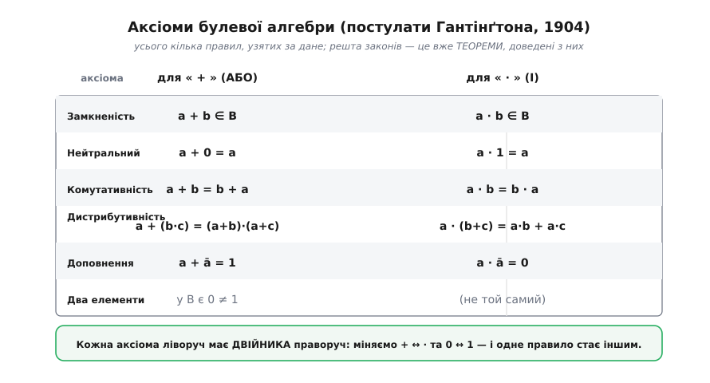
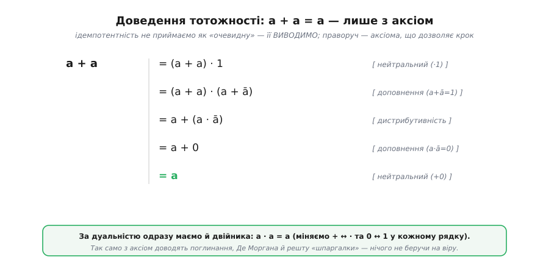
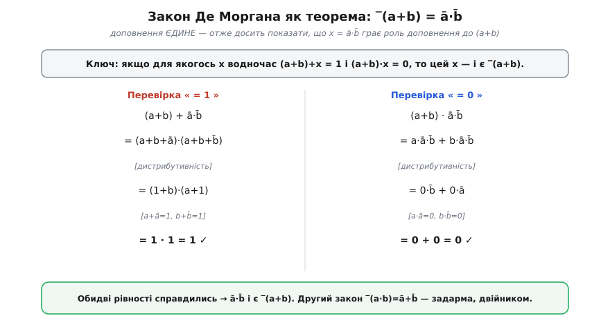
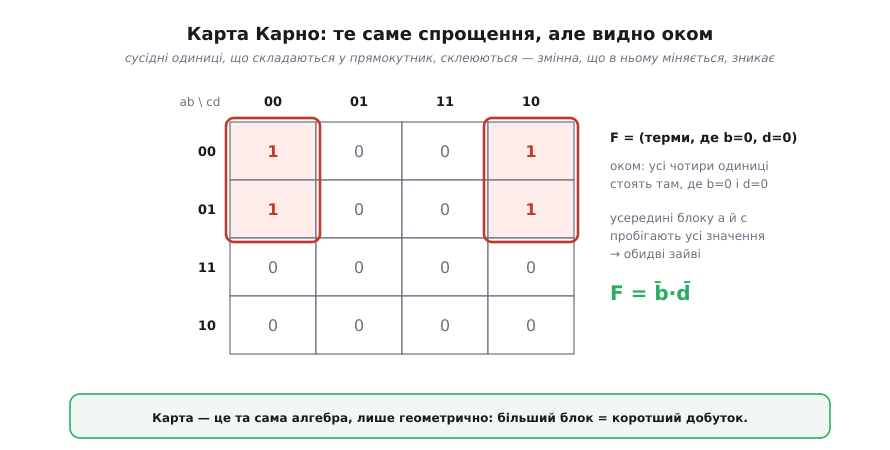

# 🧮 Аксіоми булевої алгебри й доведення тотожностей

Закони [булевої алгебри](topic:math/boolean-algebra) зручно тримати готовим списком — шпаргалкою тотожностей, якими спрощують логічні схеми. Для роботи цього досить, але одне питання лишається без відповіді: а **звідки** ці закони і чому їм можна вірити? Чому, скажімо, дивна друга дистрибутивність `a+(b·c)=(a+b)·(a+c)` справджується, а не просто «так уже є»? Поставмо алгебру на строгий фундамент: візьмемо за дане **зовсім небагато** правил (аксіом) — і покажемо, що вся решта **виводиться** з них як теореми. Заразом доведемо закони Де Моргана, на яких тримається універсальність [вентилів NAND і NOR](topic:electronics/nand-nor).

Сам Джордж Буль (*George Boole*) у книзі «Дослідження законів думки» (*An Investigation of the Laws of Thought*, 1854) трактував свою алгебру через зміст — класи предметів і операції над ними. Те, що ми зробимо тут, — пізніший крок: звести все до **чистої структури**, де символи 0, 1, «+», «·», «‾» не означають наперед нічого, а підкоряються лише виписаним правилам. Як ця ідея народилася й чому майже сто років чекала застосування — у нарисі [Джордж Буль: алгебра, що навчилася думати](topic:math/boolean-algebra/hist-boole.md).

### Означення: булева алгебра як набір аксіом

Формально **булева алгебра** (*Boolean algebra*) — це не «логіка», а **структура**: множина B щонайменше з двох елементів, на якій задано дві бінарні операції «+» (*OR*) і «·» (*AND*), одну унарну «‾» (*NOT*, доповнення) і два виокремлені елементи **0** та **1**. Щоб ця структура справді була булевою, операції мусять підкорятися кільком **постулатам** (лат. *postulatum* — вимога) — тобто аксіомам (гр. *axíōma* — те, що приймають без доведення). Зручний їх набір 1904 року дав американський математик **Едвард Гантінґтон** (*Edward V. Huntington*) у праці «Множини незалежних постулатів для алгебри логіки». Він навіть навів **кілька рівноправних наборів** — і показав головне: уся алгебра в абстрактній формі розгортається з невеликого набору **незалежних** постулатів, з яких решта тверджень дістається суто формально. Постулатів напрочуд мало.


*Постулати Гантінґтона. Береться за дане лише це: замкненість, нейтральні елементи (0 для «+», 1 для «·»), комутативність, дистрибутивність обох дій одна крізь одну, наявність доповнення (a+ā=1, a·ā=0) і те, що 0 та 1 — різні. Головне видно одразу: список іде **дуальними парами** — кожне правило для «+» має двійника для «·». Уся решта [законів булевої алгебри](topic:math/boolean-algebra) — це вже не аксіоми, а теореми.*

У цьому списку причаїлися дві несподіванки. По-перше, тут **немає** асоціативності — її не постулюють, а **доводять** із решти (тому ми й маємо право писати a+b+c без дужок). По-друге, дистрибутивність вимагається **в обидва боки** — і звичну `a·(b+c)=a·b+a·c`, і ту саму «екзотичну» `a+(b·c)=(a+b)·(a+c)`, що для чисел хибна. У булевому світі вона не диво, а **аксіома** — одне з правил гри, без якого структура просто не була б булевою.

Варто наголосити на слові «зручний», а не «єдиний». Гантінґтон не вигадав аксіоми з порожнечі — їх готували Буль, Джевонс, Пірс, Шрьодер, а далі Вайтгед і Расселл; внесок Гантінґтона в тому, що він дібрав **незалежні** набори (жоден постулат не випливає з інших) і подав алгебру як абстрактну структуру, відірвану від будь-якого тлумачення. Саме абстрактність і дає всю силу: один і той самий апарат описує логіку висловлень, множини, перемикачі й біти в регістрі — бо жодне з цих тлумачень не зашите в аксіоми.

### Інтуїція: навіщо аксіоми, якщо закони «й так очевидні»

Постає природне заперечення: навіщо ця строгість, якщо [закони булевої алгебри](topic:math/boolean-algebra) і так зрозумілі зі змісту «+» як «або»? Відповідь — у **надійності й економії**. Спираючись на «очевидність», легко прийняти на віру щось хибне; аксіоматичний підхід натомість каже точно, що саме взято за дане, а все інше **зобов'язане** з цього випливати — або воно неправильне. Це той самий хід, що й у геометрії Евкліда: кілька постулатів, а далі — самі доведення. Різниця між «здається правильним» і «доведено з аксіом» — це різниця між здогадом і знанням.

Аксіоматика дарує ще й безкоштовний подарунок — **принцип двоїстості** (*duality*). Оскільки постулати йдуть дзеркальними парами (+ ↔ ·, 0 ↔ 1), то й **будь-яка** доведена теорема автоматично має правильного двійника, здобутого тією самою заміною. Доводиш один закон — і задарма отримуєш другий. Працює це не випадково: візьми доведення якоїсь теореми, заміни в **кожному** його рядку + на ·, · на +, 0 на 1, 1 на 0 — кожне посилання на аксіому перетвориться на посилання на її ж двійника (а він теж аксіома), тож і весь ланцюг лишиться правильним, тільки доводитиме вже дзеркальне твердження. Саме ця симетрія стоїть за тим, що [вентилі NAND і NOR](topic:electronics/nand-nor) такі схожі: вони — двійники один одного.

> 🔧 **Навіщо це.** Двоїстість — це безпосередньо вдвічі менше роботи. Перевіривши на платі одну тотожність для «і», ви безкоштовно маєте її двійника для «або», тож не мусите окремо ловити помилку в дзеркальному варіанті схеми. А знання, що набір постулатів **незалежний**, рятує від марних спроб «спростити» аксіому через інші — її там просто нема, і доводити її нема з чого.

### Формальний апарат: як доводять тотожність

Покажемо сам **метод** на «найочевиднішому» законі — ідемпотентності (лат. *idem* — той самий + *potens* — здатний: повторення дає те саме) `a+a=a`. Саме тому, що він здається самозрозумілим, він добре демонструє: ми його **не приймаємо**, а виводимо — крок за кроком, посилаючись лише на постулати Гантінґтона.


*Ланцюг рівностей, кожну з яких виправдовує конкретна аксіома (підписана праворуч). Жодного «очевидно» — самі правила гри.*

```
a + a = (a + a)·1            [нейтральний: x·1 = x]
      = (a + a)·(a + ā)      [доповнення: a + ā = 1]
      = a + (a·ā)            [дистрибутивність (друга)]
      = a + 0                [доповнення: a·ā = 0]
      = a                    [нейтральний: x + 0 = x]
```

Готово: `a+a=a` доведено з нуля. А за принципом двоїстості нам **не треба** окремо мучити `a·a=a` — замінивши в кожному рядку + ↔ · та 0 ↔ 1, дістаємо його доведення задарма. Цей самий каркас — «перепиши вираз, посилаючись на аксіому» — працює для **будь-якої** тотожності зі звичної [шпаргалки законів](topic:math/boolean-algebra).

Розгляньмо приклад трохи серйозніший — закон **поглинання** `a + a·b = a`. На вигляд він дивний (ліворуч згадано b, праворуч його нема), і це робить його гарною перевіркою методу:

```
a + a·b = a·1 + a·b         [нейтральний: a = a·1]
        = a·(1 + b)         [дистрибутивність (перша): винесли a]
        = a·1               [тотожність 1 + b = 1, доведена нижче]
        = a                 [нейтральний: a·1 = a]
```

Тут ми скористалися допоміжною тотожністю `b + 1 = 1`, яку теж не постулюють. Доведімо й її тим самим способом — щоб не лишалося жодного «на віру»:

```
b + 1 = (b + 1)·1            [нейтральний: x·1 = x]
      = (b + 1)·(b + b̄)      [доповнення: b + b̄ = 1]
      = b + (1·b̄)            [дистрибутивність (друга)]
      = b + b̄                [нейтральний: 1·b̄ = b̄]
      = 1                    [доповнення: b + b̄ = 1]
```

Суть одна: **кожен** крок спирається лише на аксіому, нічого не береться зі стелі. Саме так, шар за шаром, із жменьки постулатів виростає вся таблиця законів.

> 🔧 **Навіщо це.** Кожне алгебричне спрощення схеми — це такий самий ланцюг рівностей, тільки прикладний. Коли синтезатор логіки (чи ви на папері) зводить громіздкий вираз до коротшого, за кожним його кроком стоїть одна з цих доведених тотожностей. Розуміючи, **звідки** береться поглинання чи дистрибутивність, ви не сплутаєте справжнє спрощення з «оптимізацією», що тихо міняє поведінку схеми.

### Worked-приклад: спрощуємо реальний вираз

Покажемо метод у дії на виразі, що міг би трапитися в умові ввімкнення на платі. Нехай вихід задано так:

**Умова.** `F = a·b + a·b̄·c + a·c`. Спростити й оцінити виграш у вентилях.

```
F = a·b + a·b̄·c + a·c
  = a·b + a·c + a·b̄·c        [комутативність: переставили доданки]
  = a·b + a·c                 [поглинання: a·c поглинає a·b̄·c, бо a·c·(…)=a·c]
  = a·(b + c)                 [дистрибутивність: винесли спільне a]
```

Розпишемо середній крок, щоб не було магії: `a·c + a·b̄·c = a·c·1 + a·c·b̄ = a·c·(1 + b̄) = a·c·1 = a·c`. Тобто доданок `a·b̄·c` цілком **уже міститься** в `a·c` — він зайвий. Вийшло: замість трьох добутків і двох інверсій маємо `a·(b+c)` — один OR і один AND. Перевіримо результат у коді прошивки, де `a`, `b`, `c` — це біти стану:

```c
// було: дослівно за початковим виразом
int f_raw = (a & b) | (a & (!b) & c) | (a & c);
// стало: після алгебричного спрощення
int f = a & (b | c);
// f_raw і f дають однаковий біт на всіх 8 комбінаціях a,b,c
```

Виграш не косметичний: менше операцій — це менше вентилів у залізі (дешевша, холодніша, швидша схема) або менше роботи на такт у прошивці. І певність, що поведінка **не змінилася**, дає не тестування навмання, а саме ланцюг тотожностей: кожен крок зберігає значення на всіх входах за побудовою.

### Закони Де Моргана: теорема, а не постулат

Тепер — **закони Де Моргана** (*De Morgan's laws*), названі на честь британського математика Огастеса Де Моргана (*Augustus De Morgan*), приятеля й листувальника Буля:

```
‾(a + b) = ā · b̄            (НЕ«або» = «і» заперечень)
‾(a · b) = ā + b̄            (НЕ«і» = «або» заперечень)
```

Їх теж не постулюють — вони **теореми**. Строге доведення спирається на одну тонку, але потужну властивість: **доповнення єдине**. Тобто для кожного елемента x існує рівно один елемент, що грає роль його доповнення; якщо для якогось кандидата y виконано і `x+y=1`, і `x·y=0`, то цей y **і є** ‾x, іншого нема. Отже, щоб довести `‾(a+b)=ā·b̄`, досить взяти кандидата y = ā·b̄ і перевірити обидві рівності для x = a+b.


*Дві перевірки. Ліворуч показуємо (a+b)+ā·b̄ = 1, праворуч — (a+b)·ā·b̄ = 0; обидві сходяться на самих лише аксіомах комутативності, дистрибутивності й доповнення. Раз кандидат ā·b̄ задовольняє обидві умови доповнення — він і є ‾(a+b).*

```
(a+b) + ā·b̄ = (a+b+ā)·(a+b+b̄)   [друга дистрибутивність]
            = (1+b)·(a+1)        [a+ā=1, b+b̄=1]
            = 1·1 = 1            ✓

(a+b) · ā·b̄ = a·ā·b̄ + b·ā·b̄     [перша дистрибутивність]
            = 0·b̄ + ā·0          [a·ā=0, b·b̄=0]
            = 0 + 0 = 0          ✓
```

Обидві умови доповнення справдилися, тож `ā·b̄` справді є `‾(a+b)` — перший закон доведено. Другий закон `‾(a·b)=ā+b̄` отримуємо двійником, не доводячи наново: замінили + ↔ · та 0 ↔ 1 — і готово.

Є й коротший, цілком строгий шлях для **скінченної** двійкової алгебри {0, 1} — **довершена індукція** (*perfect induction*): просто перебрати **всі** комбінації входів і переконатися, що ліва й права частини збігаються в кожному рядку. Для двох змінних це лише чотири рядки [таблиці істинності](topic:math/boolean-algebra) — і тотожність доведено вичерпно. Це той самий метод, яким зрештою перевіряють будь-яку рівність над бітами автоматично. Алгебричне доведення й перебір не суперечать одне одному: перебір певний у {0,1}, алгебра ж працює в **будь-якій** булевій алгебрі (і над множинами, і над висловленнями), бо спирається лише на аксіоми.

> 🔧 **Навіщо це.** Де Морган — це щоденний інструмент чистки умов. Заперечення складної умови `!(gotovo && !pomylka)` за Де Морганом стає `!gotovo || pomylka` — читабельніше й без подвійних інверсій, що плодять помилки. У залізі ці самі закони дозволяють «перекидати бульбашку» інверсії й зводити схему до однотипних [вентилів NAND чи NOR](topic:electronics/nand-nor) — а отже, до однієї дешевої цеглинки на всю плату.

### Карти Карно: те саме спрощення, але оком

Алгебра потужна, та коли змінних кілька, ланцюги рівностей довшають і легко проґавити крок. Для невеликого числа входів є наочна заміна — **карта Карно** (*Karnaugh map*): та сама таблиця істинності, але клітинки розкладені так, що **сусідні** відрізняються рівно одним бітом. Тоді спрощення стає геометрією: суміжні одиниці, що складаються у прямокутник зі сторонами-степенями двійки, **склеюються**, а змінна, що всередині блоку міняється, з добутку **зникає**.


*Чотири одиниці стоять там, де b=0 і d=0. Усередині цього блоку a й c пробігають усі значення — отже обидві з добутку випадають, і вся група згортається в один короткий терм b̄·d̄. Те, що алгебрично вимагало б кількох кроків поглинання, тут видно одним поглядом; рамки по краях нагадують, що карта «згортається» — лівий і правий стовпці теж сусідні.*

Той самий результат алгеброю — щоб видно було, що карта нічого не вигадує, а лише пакує знайомі кроки:

```
F = ā·b̄·c̄·d̄ + ā·b̄·c·d̄ + a·b̄·c̄·d̄ + a·b̄·c·d̄
  = b̄·d̄·(ā·c̄ + ā·c + a·c̄ + a·c)     [винесли спільне b̄·d̄]
  = b̄·d̄·(ā·(c̄+c) + a·(c̄+c))         [згрупували за a]
  = b̄·d̄·(ā + a)                       [c̄+c = 1]
  = b̄·d̄·1 = b̄·d̄                       [a+ā = 1, потім ·1]
```

Карта дала `b̄·d̄` одним поглядом; алгебра підтвердила той самий результат чотирма кроками. Це й є зміст карти Карно: вона не нова теорія, а **зручний інтерфейс** до поглинання й дистрибутивності, поки змінних мало (практична межа — десь до чотирьох-п'яти). Глибше про побудову, код Грея, групи й випадки «байдуже» — у темі [карти Карно](topic:math/karnaugh-maps).

### Де це працює на практиці

Формальний шар — не самоціль, він **підпирає** все прикладне. Те, що набір {AND, OR, NOT} функціонально повний (будь-яку функцію записують сумою добутків), — це теж теорема цієї алгебри, а не спостереження; з неї випливає, що жодних інших базових дій вигадувати не треба. Закони Де Моргана — прямий ключ до зведення схем на самих [вентилях NAND чи NOR](topic:electronics/nand-nor): саме вони дозволяють переходити до однотипних елементів. А кожне алгебричне спрощення виразу (а отже, дешевша й швидша схема) — це такий самий ланцюжок рівностей, як у доведенні `a+a=a`, тільки складніший.

> 🔧 **Навіщо це.** Уся ця строгість зрештою конвертується в речі, які видно на платі й у бюджеті: менше вентилів, нижче енергоспоживання, коротша затримка, простіший і надійніший код умов. Коли ви доводите, що складний вираз тотожно дорівнює простому, ви маєте право викинути зайве залізо **без страху** змінити поведінку — бо за кожним кроком стоїть аксіома, а не здогад. Це різниця між «здається, працює так само» і «доведено, що працює так само».

За кожним кроком спрощення логіки стоїть доведена тотожність — і тепер видно, **звідки** вона береться й чому їй можна довіряти беззастережно. Жменька постулатів Гантінґтона, принцип двоїстості, єдиність доповнення — і з цього виростає вся робоча шпаргалка, якою інженер щодня робить схеми меншими, дешевшими й швидшими.
