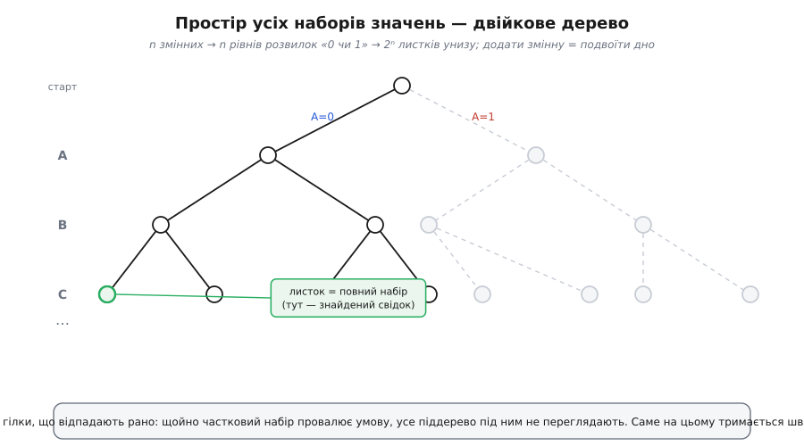
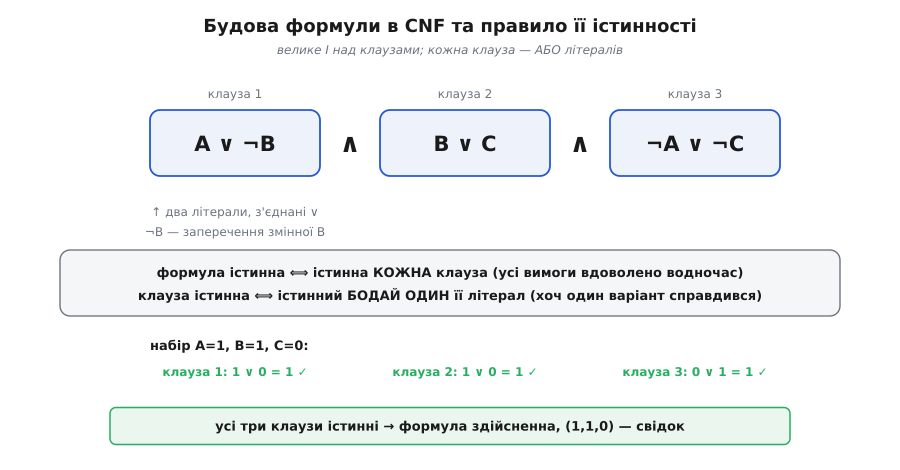
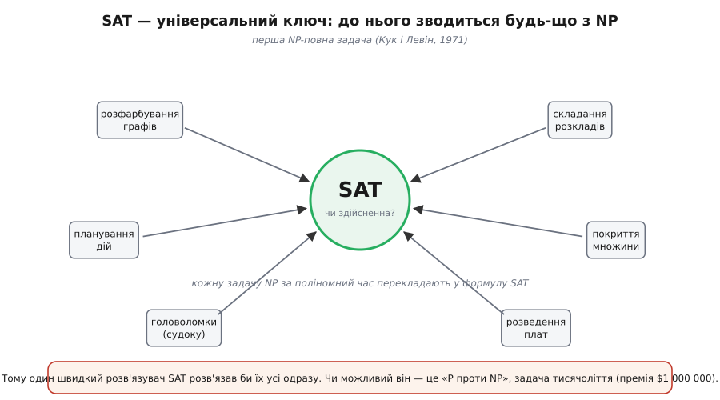

# Задача здійсненності (SAT): чи можна вгодити всім умовам

<preknowlist>
- [Булева алгебра](book:math/boolean-algebra) — змінні зі значеннями 0/1, дії І (∧), АБО (∨), НЕ (¬) і як формула з них набуває свого значення.
- [Асимптотична складність](book:algorithms/asymptotic-complexity) — як росте час залежно від розміру задачі: поліном проти експоненти, чому 2ⁿ — це стіна.
</preknowlist>

Розсадіть гостей за столом так, щоб пересварені не сиділи поруч, а кожен мав біля себе бодай одного приятеля. Складіть розклад, де жодна аудиторія не зайнята двома парами водночас, а викладач читає лише те, що вміє. Розведіть доріжки на друкованій платі так, щоб жодні дві не перетнулися. На перший погляд — три різні клопоти. Та в кожному сидить одне й те саме: купа простих умов «так/ні», сплетених спільними величинами, і питання — **чи можна вгодити їм усім разом**.

Саме це питання й називають **задачею здійсненності** (SAT — від англ. *satisfiability*, а глибший корінь — латинське *satis facere*, «зробити достатньо, вдовольнити»). Вона стоїть у серці [булевої алгебри](book:math/boolean-algebra) і формулюється в найчистішій формі, без гостей і плат — самими лише логічними змінними.

## Що це точно

Візьмімо кілька змінних, кожна — або істинна (1), або хибна (0). Сплетімо їх в одну логічну формулу діями ∧ (І), ∨ (АБО), ¬ (НЕ). На кожному наборі значень формула сама набуває 0 або 1 — це вже вміє булева алгебра. Питання SAT одне-єдине:

> чи існує такий набір значень змінних, що вся формула стає істинною (1)?

Знайшовся такий набір — формула **здійсненна** (*satisfiable*), і сам набір є її свідком, живим доказом. Немає жодного — формула **нездійсненна** (*unsatisfiable*): хоч як крути значення, вона завжди хибна. Зверніть увагу, чого SAT **не** питає: ні «за яких саме значень», ні «за скількох різних наборів». Лише «чи існує бодай один». Це задача на «так чи ні» — рішенева (*decision problem*), і в цій скромності вся її сила.

## Наївний спосіб і стіна

Здавалося б, у чому клопіт? Змінних скінченно, кожна має два значення — то переберімо всі можливі набори й перевірмо кожен. Перевірка одного набору мовчазна й миттєва: підставив нулі та одиниці, порахував формулу. От тільки самих наборів...

```
n змінних  →  2ⁿ можливих наборів
   10       →  1 024
   30       →  ≈ 1.07 мільярда
   60       →  ≈ 1.15 · 10¹⁸   (більше, ніж секунд минуло від Великого вибуху)
  100       →  ≈ 1.27 · 10³⁰
```

Кожна нова змінна **подвоює** простір пошуку. Це не вада конкретного методу перебору, а сама природа задачі — **комбінаторний вибух**. Уже на кількох десятках змінних чесний перебір безнадійний, а реальні задачі мають їх тисячі й мільйони.


*Кожна змінна — розвилка «0 чи 1», тож усі набори лягають у двійкове дерево: n рівнів, 2ⁿ листків унизу. Додати одну змінну — це додати цілий поверх і подвоїти дно. Розв'язувач не сліпо перебирає листки: щойно частковий набір уже провалює якусь умову, ціла гілка під ним відрубується (сірі піддерева) — і часто цього досить, щоб не заглядати в переважну більшість листків.*

## CNF — стандартна форма

Формула буває якою завгодно заплутаною, але для SAT її звикли зводити до єдиної, дуже однорідної подоби — **кон'юнктивної нормальної форми** (*conjunctive normal form*, CNF). Це велике І над **клаузами** (*clause*, з латини *clausula* — «замикальна частинка»), де кожна клауза — це АБО кількох **літералів** (*literal*), а літерал — то змінна або її заперечення.


*Формула в CNF — це набір клауз, з'єднаних І; кожна клауза — набір літералів, з'єднаних АБО. Читається так: уся формула істинна ⟺ істинна **кожна** клауза; клауза істинна ⟺ в ній істинний **бодай один** літерал. Тому клаузу природно бачити як умову-вимогу («хоч одне з цього мусить справдитися»), а всю формулу — як список вимог, які треба вдовольнити водночас.*

Чому саме така форма стала стандартом — бо вона точно копіює будову реальних задач. Обмеження життя майже завжди звучать як «хоч один із цих варіантів мусить бути виконаний», а всі обмеження разом — як «і те, і те, і те». Клауза — це рівно «хоч один», кон'юнкція клауз — це рівно «і все разом». Заганяючи задачу в CNF, ми не спотворюємо її, а лише перекладаємо однією рівною мовою, зрозумілою розв'язувачу.

**Приклад (перевірка свідка).** Візьмімо формулу (A ∨ ¬B) ∧ (B ∨ C) ∧ (¬A ∨ ¬C) і спробуймо набір A=1, B=1, C=0:

```
клауза 1:  A ∨ ¬B   =  1 ∨ ¬1  =  1 ∨ 0  =  1    ✓
клауза 2:  B ∨ C    =  1 ∨ 0   =  1            ✓
клауза 3:  ¬A ∨ ¬C  =  ¬1 ∨ ¬0 =  0 ∨ 1  =  1    ✓
уся формула:  1 ∧ 1 ∧ 1  =  1
```

Усі три вимоги вдоволено — формула здійсненна, а (1,1,0) є свідком. Ось де захована асиметрія, довкола якої крутиться вся задача: **перевірити** запропонований свідок — робота на секунду (підставив і порахував), а **знайти** його з нуля — те, за чим ховається весь тягар.

Побачити цю асиметрію ще різкіше допомагає нездійсненний випадок. Формула (A ∨ B) ∧ (A ∨ ¬B) ∧ ¬A свідка не має взагалі: остання клауза жадає A=0, і тоді дві перші вимагають водночас B=1 та B=0 — суперечність. Аби впевнено сказати «так», досить пред'явити один набір; аби сказати «ні», треба якось охопити всі 2ⁿ наборів і переконатися, що жоден не годиться. «Ні» дається дорожче за «так» — і це не примха, а знову ж таки природа задачі.

## Чому SAT славетний

Ця асиметрія — «легко перевірити, важко знайти» — виявилася не дрібною рисою SAT, а візитівкою цілого класу задач. Клас звуть **NP**: до нього належить усе, чий готовий розв'язок можна швидко (за поліномний час) **перевірити**, навіть якщо знайти його важко. Розкладів, маршрутів, розкроїв, головоломок такого штибу — безліч, і всі вони давно муляли: чи справді знайти розв'язок принципово важче, ніж перевірити, чи ми просто ще не додумалися до розумного способу?

1971 року Стівен Кук (*Stephen Cook*), а незалежно від нього й у той самий час Леонід Левін (*Leonid Levin*) — тоді в СРСР, родом із Дніпра, учень Колмогорова — довели про SAT приголомшливу річ. **Будь-яку** задачу з класу NP можна за поліномний час перекласти («звести») на SAT: закодувати її умови однією булевою формулою так, що формула здійсненна ⟺ задача має розв'язок. Отже, SAT не просто одна з важких задач — це задача **найзагальніша**: якби хтось знайшов справді швидкий (поліномний) спосіб розв'язувати SAT, він тим самим отримав би швидкий спосіб для **кожної** задачі з NP одразу. SAT став першою [NP-повною](book:algorithms/np-completeness) задачею — тим самим універсальним ключем.


*Розфарбування графів, складання розкладів, планування, головоломки — усі задачі класу NP зводяться до SAT (стрілки всередину). Тому один-єдиний швидкий розв'язувач SAT миттєво розв'язав би їх усі. Чи існує він у принципі — і є славетне питання «P проти NP», одна з семи «задач тисячоліття» з премією в мільйон доларів; відповіді досі немає.*

Ця універсальність працює й у зворотний, дуже практичний бік. Не треба вигадувати окремий алгоритм під розклад, окремий — під розкрій, окремий — під перевірку схеми. Досить закодувати свою задачу формулою, віддати її готовому розв'язувачу SAT і розкодувати відповідь. [Як інші задачі перекладають мовою булевих формул](book:math/boolean-satisfiability/math-reductions.md) — окрема механіка зведень (і саме нею SAT сплетений із розфарбуванням графів, покриттям множин та десятками інших); там же видно, чому досить навіть скромного різновиду з трьома літералами в клаузі (3-SAT), щоб лишитися NP-повним. А про те, як народилося саме поняття NP-повноти, про паралельне відкриття по два боки залізної завіси й про долю мільйонної премії — [нарис про теорему Кука–Левіна](book:math/boolean-satisfiability/hist-cook-levin.md).

## Практичний поворот

Здавалося б, вирок винесено: SAT нездоланний за розумний час, руки геть. Але сталося дивовижне — і в цьому найкорисніший урок усієї теми.

**Найгірший** випадок SAT справді експоненційний, і ніхто не вміє його оминути. Проте формули, що виникають із реальних задач — перевірки мікросхем, планування, аналізу програм, — не випадкові: вони пронизані структурою, прихованими залежностями, повторами. І виявилося, що розумні алгоритми цю структуру нещадно експлуатують. Сучасні розв'язувачі SAT буденно перемелюють формули на **мільйони** змінних і клауз за секунди — те, що наївний перебір не осилив би й до кінця віку Всесвіту.

Стрижень цих алгоритмів — не сліпий перебір, а розумне блукання деревом наборів із двома простими, але потужними ідеями. Перша: щойно частковий набір уже провалює якусь клаузу, ціла гілка під ним відрубується — не варто добудовувати те, що приречене (це й є ті сірі піддерева на першому рисунку). Друга: якщо в клаузі лишився **єдиний** іще не призначений літерал, а решта вже хибні, то його значення **вимушене** — вибору немає, тож і перебирати нема чого. Ці дві ідеї — кістяк класичного алгоритму DPLL (1962), а його нащадки, що вміють ще й **учитися на власних глухих кутах**, і дають ту саму фантастичну швидкодію. [Як влаштований справжній SAT-розв'язувач](book:math/boolean-satisfiability/proj-dpll-solver.md) — від DPLL до навчання на суперечностях — розібрано з робочим кодом окремо.

Розрив між «найгірший випадок безнадійний» і «на практиці розв'язується миттєво» — одне з найважливіших явищ прикладної інформатики. Теоретична складність задачі — це вирок **найгіршому** входу, а не тому, що трапляється вам. Плутати їх дорого: можна опустити руки перед задачею, яку насправді сучасний інструмент бере за секунди.

> 🔧 **Навіщо це.** SAT — не головоломка для теоретиків, а робочий двигун під капотом цілих галузей. Перевірка мікросхем: правильність схеми записують формулою, а питання «чи можлива хибна поведінка?» стає питанням про здійсненність — так ловлять помилки процесорів **до** того, як їх виллють у кремній. Аналіз програм і пошук вразливостей: «чи існує вхід, що заведе програму в цей небезпечний стан?» — знову SAT. Планувальники, конфігуратори (сумісність пакетів, комплектацій), розведення плат, розклади, навіть розв'язання судоку — усе це задачі, які сьогодні буквально перекладають у формулу й віддають розв'язувачу. Уміти впізнати SAT у своїй задачі — значить перестати винаходити велосипед і скористатися десятиліттями чужої праці над одним універсальним інструментом.

---

Отже, **задача здійсненності** питає найпростіше, що взагалі можна спитати про логічну формулу: чи існує набір значень змінних, за якого вона істинна. Формулу звично беруть у **кон'юнктивній нормальній формі** — І над клаузами, кожна клауза — АБО літералів, — і тоді задача читається як «вдовольни кожну вимогу водночас». Наївний перебір розбивається об стіну 2ⁿ, і це не випадковість: SAT — **перша NP-повна** задача (Кук і Левін, 1971), універсальний ключ, до якого зводиться будь-що з класу NP, а питання про його швидкий розв'язок — це і є славетне «P проти NP». І попри експоненційний найгірший випадок, сучасні розв'язувачі беруть реальні формули на мільйони змінних за секунди — вражаючий доказ того, що «важко в найгіршому випадку» і «важко на практиці» — зовсім різні речі.
