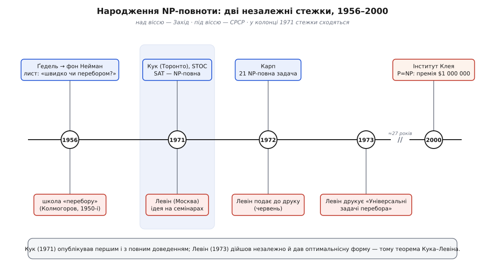

# 📜 По два боки завіси: як народилася NP-повнота

Коли ви складаєте пазл, готову картинку впізнати легко — досить глянути. А от зібрати її з тисячі шматків можна й цілий вечір. Заповнену судоку перевіряють за хвилину; розв'язати порожню — зовсім інша робота. У готовий математичний доказ можна вчитатися й пересвідчитися, що він правильний, — але знайти той доказ здатні одиниці, і то роками. Скрізь та сама тріщина між двома діями: **перевірити** запропоновану відповідь і **знайти** її з нуля. Перше раз по раз виявляється легким тоді, коли друге — майже безнадійне.

Чи справді ця тріщина глибока — чи знайти принципово важче, ніж перевірити, чи ми просто ще не додумалися до кмітливого способу шукати, — виявилося одним із найупертіших питань усієї математики. Відповіді немає й досі, за неї обіцяють мільйон доларів, а свою першу чітку форму питання набуло навдивовижу пізно й одразу двічі: незалежно, по два боки залізної завіси, майже одночасно. Ось як це сталося — і чому одну теорему підписують двома прізвищами.

## Питання, що висіло в повітрі

Уперше здогад про цю тріщину записав не інформатик, а логік — і не у статті, а в приватному листі до вмирущого товариша.

Навесні 1956 року Курт Ґедель (*Kurt Gödel*), той самий, чиї [теореми про неповноту](topic:math/godel-incompleteness) за чверть століття до того похитнули певність, ніби математику можна замкнути в один несуперечливий звід правил, написав Джонові фон Нейману (*John von Neumann*). Фон Нейман — один із батьків самого поняття комп'ютера — доживав останні місяці, зжираний раком, і Ґедель, аби чимось зайняти його думку, поставив запитання, до якого світ доросте лише через п'ятнадцять років.

Питання звучало приблизно так. Уявімо машину, що для будь-якого твердження й заданої межі довжини шукає доказ не довший за цю межу. Найтупіший спосіб — **перебрати** всі можливі тексти такої довжини й перевірити кожен: чи це, бува, не доказ. Але таких текстів астрономічно багато. Ґедель питав: чи можна оминути цей сліпий перебір — упоратися за час, що росте з розміром задачі лише як n або n², а не вибухає експонентою? І сам-таки завважив, чим це обернулося б: якби так, то праця математика над питаннями «так чи ні» звелася б до накрутки ручки, і саме відшукання доказів можна було б доручити машині.

Це і є, слово в слово, майбутнє питання «P проти NP» — тільки за п'ятнадцять років до того, як воно дістало ім'я. Фон Нейман, надто хворий, відповісти не встиг і невдовзі помер. Лист загубився серед паперів і сплив аж наприкінці 1980-х — коли теорія, якої він торкався, уже давно розрослася без нього. Здогад був точний, але передчасний: мова, якою його можна було строго висловити й довести бодай щось, іще не існувала.

## Радянський «перебор»

Поки на Заході питання дрімало в загубленому листі, на іншому боці завіси в нього вже було ім'я — і ціла школа, що билася над ним.

Радянські математики називали сліпий перебір варіантів словом **«перебор»** (рос. *перебор* — повне перебирання всіх можливостей; українською це «перебір»). І з 1950-х у Москві вже цілком свідомо питали те саме, що Ґедель у листі: для яких задач перебору не уникнути, а для яких є розумний обхід? Питання «чи можна обійтися без перебору?» стало окремою темою, довкола якої точилися суперечки. Згодом Борис Трахтенброт (*Boris Trakhtenbrot*) опише цю історію в окремому нарисі — «Огляд радянських підходів до перебору», де видно, що інтуїція «перевірити легко, знайти важко» жила в радянській науці задовго до того, як здобула строгу форму.

Осердям цієї школи був Андрій Колмогоров (*Andrey Kolmogorov*) — один із найбільших математиків XX століття, людина, що дала строгу основу теорії ймовірностей і думала про складність не наздогад, а як про величину, яку можна виміряти. Саме в його московському семінарі виросте той, хто відкриє NP-повноту незалежно від Заходу. Ґрунт, з якого проросло радянське відкриття, — це не випадок і не осяяння одинака, а десятиліття роздумів цілої традиції про природу перебору.

## Стівен Кук у Торонто

Захід дійшов до тієї самої межі 1971 року — і теж не там, де на нього чекали.

Стівен Кук (*Stephen Arthur Cook*) кількома роками раніше працював у Берклі, та математичний факультет відмовив йому в постійній посаді. Річард Карп (*Richard Karp*), його майбутній колега по славі, згодом назве це рішення «вічною ганьбою» факультету — вони проґавили людину, що ось-ось перевизначить усю галузь. Кук перебрався до Торонтського університету, і саме там, 1971 року, подав на молоду тоді конференцію STOC (перший рік її існування) статтю з непоказною назвою «Складність процедур доведення теорем» (*The complexity of theorem proving procedures*).

У цій статті Кук зробив дві речі, і друга приголомшила. Спершу він строго окреслив клас **NP** — задачі, чий готовий розв'язок можна **перевірити** за [поліномний час](topic:algorithms/asymptotic-complexity) (тобто за час, що росте з розміром задачі як многочлен, а не вибухає експонентою), навіть якщо знайти той розв'язок важко — та сама тріщина Ґеделя, нарешті в чіткій формі. А тоді довів про задачу здійсненності те, чого ніхто не чекав: **будь-яку** задачу з NP можна за поліномний час **звести** до неї. Не «здійсненність теж важка» — а «здійсненність **найзагальніша**»: у ній ховається кожна задача класу NP одразу.

Що таке «звести» — варто побачити на очах, бо на цьому тримається все. Звести задачу A до задачі B означає навчитися будь-який приклад A за поліномний час перекладати в приклад B так, щоб відповідь «так/ні» збереглася. Тоді розв'язувач для B стає розв'язувачем і для A: переклав, розв'язав, отримав відповідь.

```
NP              — задачі, чий готовий розв'язок можна ПЕРЕВІРИТИ за поліномний час
A ≤ₚ B          — «A зводиться до B»: будь-який приклад A за поліномний час
                  перекладають у приклад B зі збереженою відповіддю «так/ні»
L — NP-повна    ⟺   L ∈ NP   І   для КОЖНОЇ A ∈ NP:  A ≤ₚ L
```

Останній рядок і є означення [NP-повноти](topic:algorithms/np-completeness), а теорема Кука каже: здійсненність цьому означенню задовольняє. Наслідок вражає уяву. Якби хтось знайшов справді швидкий (поліномний) спосіб розв'язувати одну лише здійсненність, він тим самим отримав би швидкий спосіб для **кожної** задачі з NP — для розкладів, маршрутів, розкроїв, головоломок, перевірки схем. Одна задача виявилася ключем до всіх. За це відкриття Кук 1982 року дістане премію Тюрінга.

## Леонід Левін, родом із Дніпра

Тоді ж, за тисячі кілометрів, у зовсім іншому світі, до тієї самої вершини піднявся інший чоловік — сам, іншою стежкою, і про Кука ще нічого не знаючи.

Леонід Анатолійович Левін (*Leonid Levin*) народився 2 листопада 1948 року в Дніпрі (тоді Дніпропетровськ), в Україні, у єврейській родині. Математику він студіював у Москві, у семінарі Колмогорова, і 1971 року захистив дипломну працю про колмогоровську складність — міру заплутаності окремого об'єкта, схвалену самим Колмогоровим. (Довідники за звичкою чіпляють Левіну ярлик «російський математик»; та народження в Дніпрі, єврейське коріння й московська школа — це різні виміри, і жоден з них не «російськість» за замовчуванням.)

Приблизно того самого 1971 року Левін дійшов до NP-повноти й почав розповідати про неї на семінарах у Москві та Ленінграді. Його кут зору був навіть гострішим за Куків. Кук говорив про зведення й доведення теорем; Левін мислив категоріями рідного «перебору» й **оптимальності**. Він виділив кілька задач і показав, що всі вони — **універсальні задачі перебору**: якщо бодай якусь задачу перебору не можна розв'язати швидше за деякий час f(n), то й жодну з цих універсальних не можна. Вони — найважчі, спільна стеля для всього класу. Це те саме відкриття, що й Кукове, побачене з протилежного боку гори.

Свою роботу Левін подав до друку в червні 1972 року, а вийшла вона аж у другій половині 1973-го — двосторінкова замітка «Універсальні задачі перебора» (*Универсальные задачи перебора*) в журналі «Проблеми передачі інформації». Замітка була телеграфно стисла: строгі означення, шість задач-прикладів — і **жодного доведення**. Такий був стиль школи Колмогорова: сформулюй суть, а деталі читач добудує сам. За цією скупістю ховалося те саме, що Кук розписав докладно на Заході.

Чому між відкриттям і публікацією лягло майже два роки — окрема сумна історія радянської науки: закритість, важка машина рецензування, тінь академічних чвар навколо «перебору». Левін пропрацював у Москві ще кілька років, а 1978 року емігрував до США, захистив докторат у MIT і став професором Бостонського університету. Той, кого радянська система випустила з великими труднощами, на Заході визнаний одним із творців цілого розділу науки.


*Одна ідея — дві незалежні стежки. Над віссю — Захід: загублений лист Ґеделя (1956), стаття Кука (1971), лавина Карпа (1972). Під віссю — СРСР: школа «перебору» Колмогорова, відкриття Левіна (1971), подання до друку (1972) і публікація (1973). У колонці 1971 року стежки сходяться: той самий результат, здобутий одночасно людьми, що не мали між собою жодного зв'язку. Праворуч — 2000 рік: питання «P проти NP» вносять до задач тисячоліття з премією в мільйон доларів, і воно досі відкрите.*

## Чому «незалежно» — не формальність

Легко проминути слово «незалежно» як дрібну деталь. Насправді воно — найважливіше в усій історії.

Двоє людей, розділені політичними світами, мовами, залізною завісою, без листування й спільних семінарів, у той самий рік намацали ту саму глибоку правду про природу обчислень. Кук ішов від зведень і логіки доведень; Левін — від «перебору» й оптимальності. Стежки різні, вершина одна. Коли істину незалежно відкривають двоє, це найсильніший доказ, що вона **об'єктивна**: NP-повноту не вигадали з примхи означень — її **відкрили**, як відкривають гірський хребет, що стояв там завжди.

Тому теорему справедливо називають **теоремою Кука–Левіна**, а не самого лише Кука. Кук опублікував першим і розписав повне доведення; Левін дійшов до суті самостійно й водночас, дав навіть гострішу — оптимальнісну — форму. Історія тут рідкісно чесна: вона не вибирає одного переможця й не приписує першість одному боку завіси, бо обидва праві.

> 🔧 **Навіщо це.** Ця подвійність — не просто гарний сюжет. Вона застерігає від двох спокус, що псують історію науки. Перша — міф про самотнього генія: мовляв, велике робить один осяяний одинак. Насправді і Кук, і Левін виросли з традицій — американської теорії обчислень і московської школи перебору — і думка визріла там, де для неї був ґрунт, тож і проросла одразу у двох місцях. Друга спокуса — національна першість: перетягти відкриття цілком на «свій» бік. Але правда не має паспорта. Уміти бачити відкриття як спільну, наднаціональну працю — значить читати історію науки чесно, а не як хроніку перемог одного прапора.

## Карп і лавина

Відкриття Кука могло б лишитися вишуканою дивовижею для вузького кола — якби наступного року інший чоловік не показав, наскільки далеко воно сягає.

1972 року Річард Карп (*Richard Manning Karp*) узяв ключ Кука й відімкнув ним двері одні за одними. У статті «Звідність серед комбінаторних задач» (*Reducibility Among Combinatorial Problems*) він звів здійсненність до **двадцяти однієї** давно відомої, практичної, на позір цілком не пов'язаної між собою задачі — розфарбування графів, комівояжера, покриття множин, розбиття, кліки — і тим показав, що всі вони теж NP-повні. Раптом виявилося: десятки славетних головоломок, над якими роками бідкалися в різних галузях, — це насправді **одна й та сама задача** в різних одежах.

Оце й підпалило лавину. Один приклад NP-повної задачі — цікавинка; список із двадцяти двох, повний упізнаваних, важливих імен — доказ, що йдеться про фундаментальне явище, а не про курйоз. Дослідники кинулися перевіряти свої задачі на NP-повноту, список розрісся до тисяч, і NP-повнота з теореми перетворилася на щоденний робочий інструмент: натрапивши на нову вперту задачу, першим ділом питають, чи не NP-повна вона.

## Як назвали звіра

Було лише одне: у звіра ще не було пристойного імені. Кук казав «поліномно зводжувана», Карп — «повна». Термін «NP-повна» народився з голосування.

1973 року Дональд Кнут (*Donald Knuth*) — автор класичної багатотомної праці про алгоритми — розіслав колегам бюлетень із проханням обрати назву. Сам він пропонував пишномовне: «геркулесова», «грізна», «трудомістка». Колеги ж навперебій дописували своє, часом жартома: «непіддатлива», «крутá», навіть «hard-boiled» (гра слів — «крутозварена», з натяком на прізвище Cook, «кухар») і «hard-ass» — «тверда, як satisfiability». У січні 1974 року Кнут підбив підсумки: переміг дописаний варіант «NP-complete», «NP-повна», що його запропонували кілька людей із Bell Labs. Заразом домовилися про «NP-важку» — для задач, не легших за все в NP, але, можливо, самих поза цим класом. Відтоді звір носить це ім'я.

## Мільйон доларів і досі відкрите питання

Минуло чверть століття, теорія розрослася в цілий материк — а серцевинне питання Ґеделя й Кука лишилося без відповіді.

24 травня 2000 року Математичний інститут Клея (*Clay Mathematics Institute*) на честь нового тисячоліття оголосив **сім «задач тисячоліття»** — сім найглибших відкритих проблем математики, за кожну по мільйону доларів тому, хто розв'яже. Серед них — гіпотеза Рімана, рівняння Нав'є–Стокса, гіпотеза Пуанкаре… і **«P проти NP»**. Те саме питання, що його Ґедель накидав у листі вмирущому другові: чи справді знайти важче, ніж перевірити? Формально: чи збігаються клас задач, розв'язних швидко (P), і клас задач, чий розв'язок можна швидко перевірити (NP)?

Із семи задач розв'язали поки одну — гіпотезу Пуанкаре (це зробив Григорій Перельман (*Grigori Perelman*), який на диво відмовився і від медалі Філдса, і від мільйона Клея). «P проти NP» стоїть незрушно. Майже всі, хто над нею думає, певні, що P ≠ NP — що знайти таки принципово важче, ніж перевірити, — але **довести** цього не вміє ніхто. А ставка величезна: якби виявилося, що P = NP і здійсненність насправді розв'язна швидко, впала б чи не вся сучасна криптографія, а машина справді змогла б відшукувати математичні докази — рівно те, що передбачав Ґедель.

Отже, тріщина між «перевірити» й «знайти», яку кожен відчуває, складаючи пазл, дістала строге ім'я — **NP-повнота**, — свого універсального представника — **здійсненність**, — і двох першовідкривачів, що ніколи не бачилися: американця в Торонто й уродженця Дніпра в Москві. А чи глибока та тріщина насправді, чи нам просто бракує кмітливості, — це і є найдорожче невідповіджене питання інформатики, оцінене рівно в мільйон доларів і незмірно дорожче за суттю.
