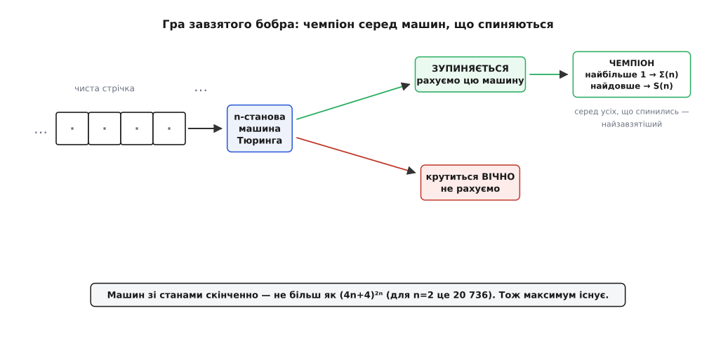
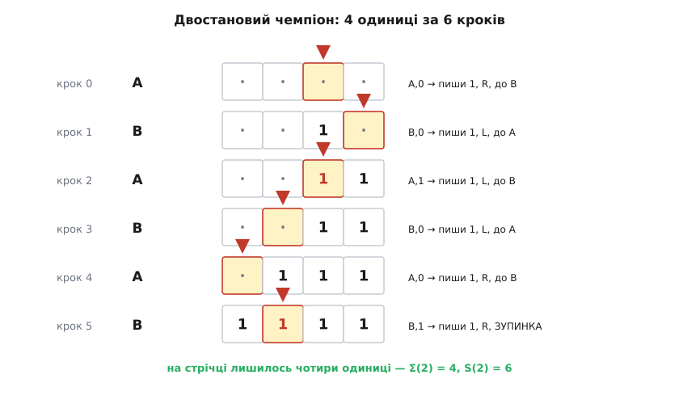
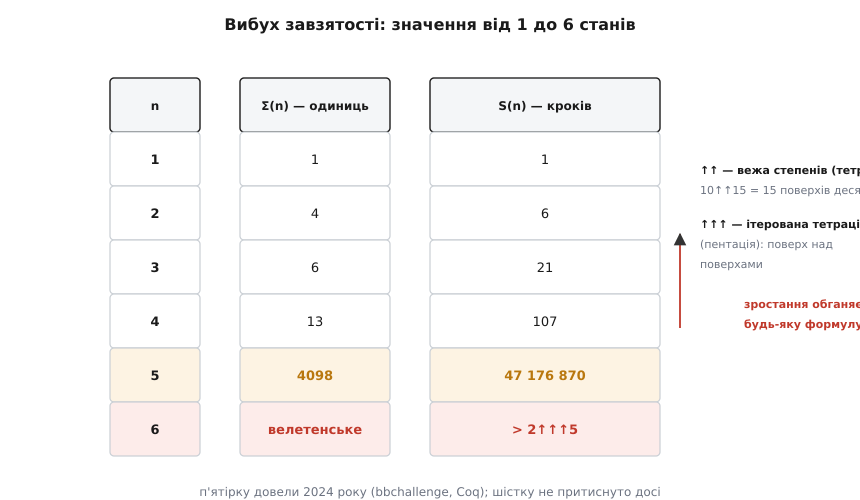
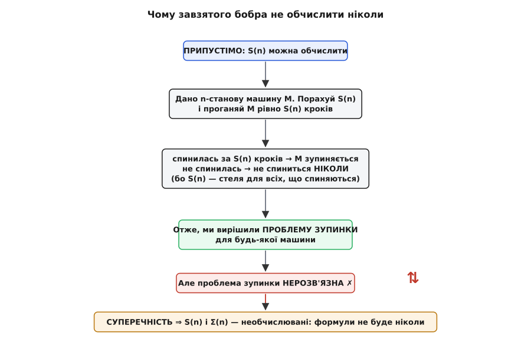

# Завзятий бобер (busy beaver)

<preknowlist>
- [Машина Тюринга](topic:math/turing-machine) — скінченне керування зі станами, необмежена стрічка, функція переходів δ: (стан, символ) → (стан, запис, зсув); машина або зупиняється, або крутиться вічно.
- [Проблема зупинки](topic:algorithms/halting-problem) — не існує алгоритму, який про будь-яку машину й вхід наперед скаже, зупиниться вона чи крутитиметься без кінця.
- [Теза Черча–Тюринга](topic:math/church-turing-thesis) — «обчислювана функція» означає рівно ту, яку рахує якась машина Тюринга; це межа всякого механічного обчислення.
</preknowlist>

Візьмімо найпростіше питання про найпростіші машини — і воно приведе нас до числа, яке не здатен обчислити жоден комп'ютер у Всесвіті, і яке саме математика, з усіма її аксіомами, не може визначити.

Ось питання. Зафіксуймо число станів — скажімо, `n`. Розгляньмо **всі** [машини Тюринга](topic:math/turing-machine) з рівно `n` станами (і двома символами, `0` та `1`), які стартують на **чистій стрічці**, самими нулями. Деякі з них швидко спиняться. Деякі закрутяться навічно. А серед тих, що таки зупиняються, знайдеться **чемпіон** — та, що працює найдовше або лишає на стрічці найбільше одиниць, перш ніж стати. Оцей найпрацьовитіший скінченний автомат і зветься **завзятий бобер** (англ. *busy beaver*, від приказки *busy as a beaver* — «зайнятий, мов бобер», що невтомно гатить греблю). Назву дав угорський математик Тібор Радо (*Tibor Radó*), який увів цю ідею [1962 року в статті «Про необчислювані функції»](topic:math/busy-beaver/hist-beaver-hunt.md).

Звучить як гра для дозвілля. А виявиться — як найгостріший ніж, яким взагалі можна різати межу обчислюваного.

## Гра: хто найпрацьовитіший

Домовмося точно. Машина має `n` станів; на стрічці лише два символи, `0` (він же порожня клітинка) і `1`. Старт — чиста стрічка. Кожну машину чекає одна з двох доль: або вона колись потрапляє в стан зупинки, або крутиться без кінця. Другі нас не цікавлять — у них немає «кінця роботи», який можна виміряти. А от серед машин, що **зупиняються**, є що порівнювати, і Радо ввів дві мірки завзятості.

```math
Σ(n) — «сигма»: найбільша кількість одиниць, яку n-станова машина
        лишає на стрічці, перш ніж зупинитися.
S(n)         : найбільша кількість кроків, яку n-станова машина
        робить, перш ніж зупинитися.
```

Обидві беруть максимум **лише по тих машинах, що зупиняються**. Функцію Σ(n) зазвичай і називають функцією завзятого бобра; S(n) — її близнюк, що міряє не слід на стрічці, а час роботи. Машину, на якій цей максимум досягається, звуть бобром-чемпіоном для `n` станів.

## Чому це взагалі має відповідь

Перше, що варто зрозуміти: Σ(n) і S(n) — **справжні, цілком визначені числа**, а не розпливчасте «якнайбільше». Причина проста й міцна: машин із `n` станами **скінченно багато**.

Погляньмо, чому. Машина — це її таблиця переходів: для кожної пари «стан + символ під голівкою» треба сказати, що робити. Пар таких `2n` (n станів × 2 символи). У кожній клітинці таблиці вибір теж скінченний: який символ записати (2 варіанти), куди зсунутися (ліворуч чи праворуч — 2 варіанти) і в який стан перейти (`n` станів або зупинка — `n+1` варіант). Разом на клітинку `2·2·(n+1) = 4n+4` варіантів, а клітинок `2n`. Отже, різних машин **не більш як**:

```math
(4n + 4)^(2n)
```

Для `n = 2` це `12⁴ = 20 736` машин. Число велике, але **скінченне** — їх усі можна, у принципі, перелічити й перевірити. А максимум по скінченній множині чисел завжди існує. Тож Σ(2) — це якесь конкретне натуральне число, і питання «яке саме» цілком коректне.

Ось де захована пастка, до якої ми ще повернемось: множина скінченна, і максимум **існує**, — але щоб його знайти, треба спершу **відсіяти** машини, що зупиняються, від тих, що крутяться вічно. А це вже не підрахунок, а [проблема зупинки](topic:algorithms/halting-problem).


*Гра завзятого бобра. Кожна з `n`-станових машин стартує на чистій стрічці й прямує до однієї з двох доль: зупинки (зелене) або нескінченного циклу (червоне). Максимум завзятості беремо лише по тих, що зупинилися. Він існує, бо машин скінченно багато — але, щоб його дістати, треба вміти розрізняти дві долі.*

## Найменший бобер за роботою

Найкраще відчути гру на найдрібнішому нетривіальному випадку — двох станах. Ось чемпіон для `n = 2` (стани `A`, `B`, `H` — зупинка):

```math
стан  бачить →  (пише, зсув, новий стан)
A     0      →  (1,  R,  B)
A     1      →  (1,  L,  B)
B     0      →  (1,  L,  A)
B     1      →  (1,  R,  H)   # H — зупинка
```

Проженімо його з чистої стрічки. Показую вікно з чотирьох клітинок, а `▸` стоїть перед клітинкою під голівкою; `·` — порожня клітинка (нуль):

```math
крок 0:  A    ·  ·  ▸·  ·        A,0 → пиши 1, R, до B
крок 1:  B    ·  ·   1 ▸·        B,0 → пиши 1, L, до A
крок 2:  A    ·  ·  ▸1  1        A,1 → пиши 1, L, до B
крок 3:  B    · ▸·   1  1        B,0 → пиши 1, L, до A
крок 4:  A   ▸·  1   1  1        A,0 → пиши 1, R, до B
крок 5:  B    1 ▸1   1  1        B,1 → пиши 1, R, ЗУПИНКА
────  зупинка:  1  1  1  1   — чотири одиниці, зроблено 6 кроків
```

Отже, Σ(2) = 4 і S(2) = 6. Крихітна машина з двох станів, а вже метушиться стрічкою туди-сюди, лишаючи по собі акуратні чотири одиниці. Зверніть увагу: жодна клітинка таблиці не «наказує» зробити чотири одиниці — це число **проступає само** з гри правил. Ми не задавали відповідь; ми її **виявили**, перебравши поведінку. Цей перебір можна доручити комп'ютеру: [невеликий симулятор, що генерує всі `n`-станові машини й полює на чемпіона для двох-трьох станів](topic:math/busy-beaver/proj-beaver-search.md), наочно показує і скінченність арени, і ту саму стіну — бо машину, що досі працює, годі відрізнити від тієї, що не спиниться вже ніколи, без наперед відомої стелі S(n).


*Двостановий чемпіон крок за кроком. Кожен рядок — стан стрічки перед відповідним кроком; підсвічена клітинка — під голівкою. Машина снує в обидва боки й за шість кроків лишає чотири одиниці. Σ(2) = 4, S(2) = 6 — і ці числа ніхто не «вписав», вони випали з перебору поведінки.*

## Числа, що зриваються з ланцюга

А тепер подивімося, що діється, коли додавати стани. Тут відомі точні значення (кожне — не здогад, а результат величезної праці):

```math
 n    Σ(n)  (одиниць)        S(n)  (кроків)
 1       1                      1
 2       4                      6
 3       6                     21
 4      13                    107
 5    4098             47 176 870
 6    ?  (велетенське)   > 2↑↑↑5  (позамежне)
```

До четвірки все скромно: сто сім кроків, тринадцять одиниць. А на п'ятірці S(5) підстрибує до **сорока семи мільйонів** кроків. Цю п'ятистанову вершину знайшли Гайнер Марксен і Юрґен Бунтрок ще 1989 року, але **довести**, що більшого п'ятистанового бобра не існує, змогли аж 2024-го — це зробила відкрита спільнота-аматорів bbchallenge, і остаточну перевірку записали формально у Coq. [Історія цього полювання — від першого рахунку Радо до онлайн-спільноти, що закрила п'ятірку через шістдесят років](topic:math/busy-beaver/hist-beaver-hunt.md) — окрема й дуже людська.

А `n = 6` — це вже інший світ. Шестистанового чемпіона не запишеш звичайним числом: доведено лише, що S(6) **перевищує** `2↑↑↑5`. Тут `↑↑` — це вежа степенів (тетрація): `10↑↑15` означає `10` у степені `10` у степені `10`… — і так п'ятнадцять поверхів заввишки. А `↑↑↑` (пентація) вже **ітерує саму тетрацію** — це поверх над поверхами, число, чий опис потребує нового ярусу арифметики. Мало того: щоб узагалі притиснути S(6), доводиться розв'язувати задачі колацівського типу (як-от машина-«антигідра», знайдена 2024 року) — а вони самі роками не піддаються. Функція, яка починалася з невинних `1, 4, 6, 13`, на шостому кроці зривається з будь-якого ланцюга, яким її можна було б утримати.


*Вибух завзятості. До `n = 4` значення ще людські; на `n = 5` кількість кроків стрибає до 47 176 870; на `n = 6` число вже не вкладається у звичайний запис — воно більше за `2↑↑↑5`. Це не просто «швидке зростання» — це зростання, що обганяє будь-яку формулу.*

## Чому цього не обчислити ніколи

Дивовижне не в тому, що числа великі. Великі числа бувають різні. Дивовижне — що функцію завзятого бобра **неможливо обчислити взагалі**: немає й не може бути жодної програми, яка на вхід `n` видасть Σ(n) чи S(n) для всіх `n`. Це не «поки не придумали» і не «надто повільно» — це доведена, остаточна неможливість.

Радо довів сильне твердження: Σ **росте швидше за будь-яку** [обчислювану функцію](topic:math/church-turing-thesis). Хоч яку функцію `f` ви вмієте порахувати програмою — хай найшвидше зростаючу, яку лишень уявите, — від певного `n` буде `Σ(n) > f(n)`, і далі розрив тільки шириться. Отже, Σ не може збігтися з жодною обчислюваною `f`: вона їх **усі переростає**.

Найчистіше цю неможливість видно через [проблему зупинки](topic:algorithms/halting-problem). Уявімо на секунду, що S(n) **можна** обчислити. Тоді ось як я розв'язав би нерозв'язне. Дайте мені будь-яку машину з `n` станами й спитайте, чи спиниться вона на чистій стрічці. Я обчислюю S(n) — стелю кроків для будь-якого `n`-станового бобра, що взагалі зупиняється, — і проганяю вашу машину рівно S(n) кроків. Якщо за цей час вона стала — відповідь «так». Якщо **не стала** — вона не спиниться **ніколи**: адже S(n) за означенням є найбільше число кроків серед усіх `n`-станових машин, що зупиняються, тож машина, яка перебрала цю межу, до тих, що зупиняються, не належить. Я щойно збудував безпомилковий провісник зупинки — а його **не існує**. Суперечність. Значить, хибним було припущення: S(n) обчислити не можна. Те саме з Σ(n).


*Чому формули не буде. Припустімо, S(n) обчислюване. Тоді для будь-якої `n`-станової машини досить прогнати її S(n) кроків: не спинилась — не спиниться ніколи. Це розв'язало б проблему зупинки, якої розв'язати не можна. Суперечність убиває припущення: завзятий бобер лежить **поза** межею обчислюваного.*

> 🔧 **Навіщо це.** Завзятий бобер — це еталон межі, за яку не пускає жоден інструмент. Він проводить чітку лінію між «повільно» і «неможливо»: аналізатор, що для **будь-якої** програми певно скаже, чи та зупиниться, — це буквально обчислення S(n), тож його не буде ніколи, хоч скільки рости обчислювальній потузі. Тому засоби перевірки завершуваності (у компіляторах, верифікаторах, доведеннях) працюють **наближено** — ловлять типові випадки, а в непевних чесно кажуть «не знаю». Знати про бобра означає не полювати на неможливий ідеал, а свідомо будувати розумне наближення. А ще Σ(n) — природна лінійка «сили»: щоб довести значення бобра для дедалі більших `n`, математиці треба дедалі потужніших аксіом, і на цьому міряють, наскільки сильна формальна система. [Повне доведення, що Σ переростає кожну обчислювану функцію, і як воно пов'язує бобра з проблемою зупинки в обидва боки](topic:math/busy-beaver/math-uncomputable.md) — окремий, вартий уваги шар.

## Бобер, що знає всі відповіді

Найглибше вражає останнє. У значеннях завзятого бобра **закодовані відповіді на відкриті питання математики** — треба лише вміти їх прочитати.

Ось як. Візьмімо будь-яку гіпотезу, яку можна перевіряти механічно, — скажімо, гіпотезу Ґольдбаха (що кожне парне число, більше за два, є сумою двох простих). Збудуймо машину, яка методично перебирає парні числа й **зупиняється, щойно натрапить на контрприклад** — парне число, що не розкладається у суму двох простих. Така машина існує, і в неї якесь конкретне число станів — назвімо його `k`. Тепер стежте за руками: якби ми знали S(k), ми запустили б цю машину рівно на S(k) кроків. Спинилась у цей строк — контрприклад є, гіпотеза хибна. Не спинилась — за нашим-таки міркуванням вона не спиниться ніколи, тобто контрприкладу немає й гіпотеза **правдива**. Знання одного числа S(k) **вирішило б** столітню задачу. Так само машинами кодують гіпотезу Рімана та інші відкриті проблеми.

І тоді неминучий фінал. Можна збудувати машину, яка зупиняється тоді й лише тоді, коли в [**ZFC**](topic:math/zfc-set-theory) — стандартній аксіоматиці математики (теорії множин Цермело–Френкеля з аксіомою вибору) — знайдеться суперечність. Таку машину справді виписали, і в її найощадливішій версії — **745 станів** (Йоганнес Рібель, 2023, слідом за оцінками Йедідії й Ааронсона). Наслідок приголомшливий: значення S(745) **незалежне від ZFC**. Якби ZFC могла довести, чому S(745) дорівнює саме такому-то числу, вона довела б і власну несуперечність, — а цього, за [другою теоремою Геделя про неповноту](topic:math/godel-incompleteness), несуперечлива система про себе зробити не може. Отже, є цілком конкретне, скінченне натуральне число — S(745), — яке існує, визначене грою бобра до останньої одиниці, і яке **вся сучасна математика не здатна визначити**.

> 🔧 **Навіщо це.** Це найтвердіший ґрунт під ногами, коли говоримо про межі знання. [Неповнота за Геделем](topic:math/godel-incompleteness) звучить абстрактно — «є істинні недоказовні твердження». Завзятий бобер робить її відчутною на дотик: недоказовне твердження — це конкретне число, яке ви **могли б** записати, якби математика була всесильна, і яке вона записати не може. Тому бобра беруть як мірило: до якого `n` та чи інша система здатна визначити Σ(n) — така її справжня сила.

## Що з цього лишається

Завзятий бобер починається як дитяча гра — «яка з крихітних машинок найпрацьовитіша?» — і закінчується як лінійка, прикладена до абсолютної межі обчислення й доведення. Формально це дві функції, Σ(n) і S(n), кожна бере максимум по скінченній множині `n`-станових машин, що зупиняються. Кожне їхнє значення — звичайне натуральне число: `1, 4, 6, 13, 4098, …` Числа як числа. І все ж ця послідовність **обганяє кожен алгоритм** (бо обчислити її означало б розв'язати [проблему зупинки](topic:algorithms/halting-problem)) і **обганяє кожну систему аксіом** (бо в її хвості закодована несуперечність самої математики). Проблема зупинки й [неповнота Геделя](topic:math/godel-incompleteness) — сухі, далекі теореми — тут одягли найдоброзичливішу з масок: змагання працьовитих бобрів, де кожен переможець — просто велике, чесне, недосяжне ціле число.
