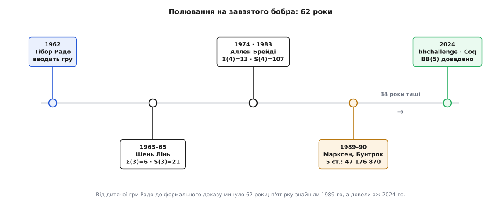

# 📜 Полювання на завзятого бобра

Гру, у якій крихітні машини змагаються за звання найпрацьовитішої, придумав чоловік, що сам вижив у сибірському полоні. А довели останнє відоме її значення не професори з кафедр, а розкидана по світу спільнота аматорів — серед них самоук-програмістка, що покинула університет, і людина під псевдонімом, справжнього імені якої не знає ніхто. Між цими двома точками — шістдесят два роки полювання, в якому кожне нове число доводилося виривати з рук машин, що вперто не хотіли зізнаватися, спиняться вони колись чи ні.


*Шлях полювання. Гру придумали 1962 року; далі кожен наступний стан давався дедалі тяжче. Найдовша пауза — тридцять чотири роки між тим, як п'ятистанову машину знайшли (1989), і тим, як довели, що більшої за неї немає (2024).*

## Чоловік, що втік із Сибіру

Тібор Радо (угор. *Radó Tibor*) народився 2 червня 1895 року в Будапешті. Спершу він і не думав про чисту математику: вступив до Будапештського політехнічного вчитися на інженера-будівельника. Далі почалася Перша світова, і життя звернуло різко. Радо пішов лейтенантом в австро-угорське військо, 1916 року потрапив у російський полон і провів чотири роки за колючим дротом — здебільшого в таборі під Тобольськом у Сибіру.

Саме там, у полоні, з ним сталося те, що визначило все подальше. Серед в'язнів був австрійський математик Едуард Геллі (*Eduard Helly*), і він узявся навчати Радо математики — просто в бараку, без бібліотек і майже без паперу. Коли Радо нарешті вибрався з Сибіру й повернувся 1920 року до Угорщини, він уже був математиком. В Університеті Сегеда він потрапив до Альфреда Гаара (*Haar Alfréd*) і Фридєша Рісса (*Riesz Frigyes*) — двох першорядних угорських аналітиків — і 1922 року захистив дисертацію.

Далі була звичайна для тих десятиліть траєкторія: рокфеллерівська стипендія 1928 року, робота в Мюнхені й Лейпцигу, переїзд до США 1929-го й, від 1930-го, професура в Університеті штату Огайо (Ohio State University), де Радо й лишився до кінця. Ім'я собі він зробив не на машинах, а на класичному аналізі: розв'язав **проблему Плато** — довів існування мінімальної поверхні, натягнутої на заданий контур (це та сама поверхня, яку показує мильна плівка на дротяній рамці). Для математиків тридцятих це й був «той самий Радо».

А тоді, наприкінці кар'єри, він поставив питання, яке пережило всі його поверхні. 1962 року у фаховому журналі телефонної компанії — *Bell System Technical Journal* (том 41, число 3, травень 1962, с. 877–884) — вийшла його стаття «Про необчислювані функції» (*On Non-Computable Functions*). Тодішня наука вже знала від Тюринга й Черча, що необчислювані функції існують; але то було абстрактне знання — «десь є функція, якої не порахувати». Радо зробив інше: він **збудував** таку функцію, та ще й у вигляді, який можна пояснити дитині.

Візьми, каже він, усі [машини Тюринга](book:math/turing-machine) з `n` станами, запусти кожну на чистій стрічці й спитай: котра з тих, що зупиняються, працює найдовше? Оце змагання Радо і назвав **грою завзятого бобра** (*busy beaver game*). Назва — з англійської приказки *busy as a beaver*, «зайнятий, мов бобер»: бобер невтомно гатить греблю, тягає й тягає гілки, і машину-переможницю, що найдовше й найзавзятіше «працює» стрічкою, перш ніж стати, Радо жартома охрестив бобром-чемпіоном. Так найглибша з ідей теорії обчислень дістала найдобродушнішу з назв.

## Перший, хто порахував: Шень Лінь

Питання поставити легко — рахувати важко. Уже для трьох станів перебрати всі машини руками неможливо, тож Радо взявся до діла зі своїм аспірантом. Ним був **Шень Лінь** (*Shen Lin*), і саме він написав перший у світі мисливський інструмент на бобрів — програму, що генерувала всі трьохстанові машини й проганяла їх, полюючи на чемпіона. У дисертації 1963 року з промовистою назвою «Комп'ютерні дослідження задач про машини Тюринга» (*Computer studies of Turing machine problems*) Лінь установив перші нетривіальні значення, а разом із Радо оформив результат у статті для *Journal of the ACM* (том 12, число 2, квітень 1965):

```math
Σ(3) = 6      S(3) = 21
```

Три стани — а вже двадцять один крок; більша за неї трьохстанова машина або зупиняється раніше, або не зупиняється взагалі. Здавалося б, дрібниця. Але навіть тут Лінь наткнувся на стіну, об яку розіб'ються всі наступні: щоб коронувати чемпіона, мало знайти найдовшу машину, що спинилась, — треба ще **довести, що всі інші не втечуть далі**, а серед «інших» знайдуться такі, що крутяться і крутяться, і годі напевно сказати, чи стануть вони колись. Уже на трьох станах таких упертюхів довелося розбирати поодинці.

Історія Ліня має несподіване продовження. Полишивши бобрів, він перейшов до Bell Labs і став там класиком зовсім іншого ремесла — практичної оптимізації. Разом із Браяном Керніганом (*Brian Kernighan*) він створив **евристику Ліна–Кернігана** для задачі комівояжера — донині один із найсильніших способів шукати короткі маршрути — та алгоритм Кернігана–Ліна для розбиття графів. Той самий чоловік, що першим полював на завзятого бобра, увійшов у підручники як майстер приборкання практично нерозв'язних задач. Ниточка від дитячої гри тягнеться в саме серце інженерної інформатики.

## Стіна на чотирьох станах: Брейді й «різдвяні ялинки»

Наступний крок — чотири стани — забрав не роки, а десятиліття, і показав, чому полювання на бобра таке підступне. За справу взявся американський математик **Аллен Брейді** (*Allen Brady*). Уже 1966 року він **вгадав** відповідь — знайшов машину, що дає `Σ(4)=13` і `S(4)=107`, і висловив гіпотезу, що більшої немає:

```math
Σ(4) = 13     S(4) = 107
```

Від здогаду до доказу минуло вісім років: `S(4)=107` Брейді довів 1974 року, а повну, ретельно виписану роботу опублікував аж 1983-го, у журналі *Mathematics of Computation*. Чому так довго? Бо чемпіон — це не одна машина, а **вирок усім решті**. Треба перебрати всі чотирьохстанові машини й про кожну сказати одне з двох: або вона спиняється не пізніше за сто сьомий крок, або не спиняється ніколи. Перше перевіряється просто — женеш машину й дивишся. А от друге впирається просто в [проблему зупинки](book:algorithms/halting-problem): загального способу довести, що машина крутитиметься вічно, **не існує**, тож кожну вперту доводиться ловити окремим хитрим аргументом.

Ці впертюхи Брейді назвав **невдахами-недобитками** (*holdouts*) — машини, що пережили всі автоматичні перевірки й уперто не зізнаються, спиняться вони чи ні. Найпідступніший їхній різновид він охрестив **різдвяними ялинками** (*Christmas trees*, або *Xmas trees*): це машини, що будують на стрічці правильний, симетрично наростаючий візерунок — «гілку за гілкою», — і треба довести, що цей візерунок росте вічно й наверху ніколи не спрацює умова зупинки. Спосіб приборкати цілий клас таких «ялинок» Брейді, за його ж словами, підказала розмова з Шенем Лінем — тим самим, що колись бив стіну на трьох станах. Останні недобитки Брейді розбирав руками, гортаючи «розлогі роздруківки їхніх історій», аж поки не переконався: жоден не спиниться.

> 🔧 **Навіщо це.** Оці недобитки — не технічна морока, а сама суть полювання. Знайти рекордну машину порівняно легко: досить пощастити з перебором. Уся праця — довести, що **більшої немає**, тобто про кожну машину-конкурента з'ясувати, спиниться вона чи закрутиться навіки. А це в загальному випадку нерозв'язне. Тому кожне значення завзятого бобра беруть не формулою, а облогою: автоматичні «вирішувачі» відсіюють мільйони простих випадків, а жменю найтвердіших горішків математики колють поодинці, вигадуючи під кожен свій доказ. Полювання на бобра — це, по суті, проблема зупинки, роздрібнена на тисячі окремих сутичок.

Значення `BB(4)=107` лишалося останнім **точно відомим** значенням функції завзятого бобра майже пів століття. Наступного числа світ чекав до 2024 року.

## П'ятистанова вершина, що стояла тридцять п'ять років

П'ять станів виявилися велетенським стрибком. 1989 року двоє німецьких дослідників — **Гайнер Марксен** (*Heiner Marxen*) і **Юрґен Бунтрок** (*Jürgen Buntrock*) — знайшли п'ятистанову машину, яка приголомшила всіх: вона працює **47 176 870 кроків** і лишає на стрічці 4098 одиниць, перш ніж стати. Свій результат вони описали в замітці з бойовою назвою «Штурмуючи завзятого бобра 5» (*Attacking the Busy Beaver 5*) у бюлетені Європейської асоціації теоретичної інформатики (число 40, лютий 1990). Ось ця машина повністю — п'ять станів `A…E`, `H` — зупинка:

```math
стан  0 →                1 →
 A    1 R B              1 L C
 B    1 R C              1 R B
 C    1 R D              0 L E
 D    1 L A              1 L D
 E    1 R H              0 L A     (H — зупинка)
```

П'ять рядків, десять інструкцій — і сорок сім мільйонів кроків. Ніхто ці кроки в машину не «вписував»: число проступає само з взаємодії десяти правил, і жодним поглядом на таблицю його не вгадати — тільки прогнати.

Але тут криється тонкість, через яку п'ятірка стояла нескореною **тридцять п'ять років**. Марксен і Бунтрок знайшли машину, що дає 47 мільйонів; це означало лише `S(5) ≥ 47 176 870` — **нижню межу**. Щоб перетворити «щонайменше» на «рівно», треба було зробити те саме, що й Брейді, тільки в незрівнянно більшому масштабі: перебрати всі п'ятистанові машини (а їх — мільярди) і про кожну довести, що вона або спиняється не пізніше, або не спиниться ніколи. І серед них знайшлася жменя недобитків такої твердості, що вони не піддавалися нікому роками. Дехто з них поводився за законом **колацівського типу** — як ота знаменита гіпотеза Коллатца про «3n+1», яку простіше сформулювати, ніж довести: щоб з'ясувати, чи спиниться така машина, треба було розв'язати самостійну числову загадку, а вони не розв'язуються на замовлення. Найлютіший із недобитків навіть дістав власне ім'я — «Скелет №17» (*Skelet #17*), на честь дослідника під ніком Skelet, що склав список найупертіших машин. Роками ця жменя вперто мовчала, і разом із нею мовчала вся п'ятірка.

## Аматори, що закрили п'ятірку: bbchallenge

І тоді сталося те, чого ніхто не планував. П'ятистанового бобра дотиснула не наукова група з грантом, а **відкрита онлайн-спільнота ентузіастів**.

Почалося з одного аспіранта. **Трістан Стерен** (*Tristan Stérin*), що працював над ДНК-обчисленнями в Мейнутському університеті в Ірландії, влітку 2020-го прочитав оглядову статтю про завзятого бобра, яку йому підкинув науковий керівник Дам'єн Вудс (*Damien Woods*). Стерен загорівся — і головне, чесно оцінив свої сили: «Я мав тверде відчуття, що сам цього не зроблю. Але мав і відчуття, що це зробити **можна**». Тож навесні 2022 року він не сів писати статтю, а запустив **bbchallenge** — спільний проєкт, куди міг долучитися будь-хто.

Улаштований він був як добра відкрита майстерня, а не як кафедра: чат у Discord для живого спілкування, форум і вікі для нотаток, репозиторії на GitHub для коду й доказів, а ще інтерактивний сайт, де можна було на власні очі бачити, як та чи інша машина малює свій візерунок на стрічці в часі. Зібралося понад двадцятеро дописувачів з усього світу — і, що вражає найдужче, **більшість без жодних наукових звань**. Полювання на одну з найглибших сталих теорії обчислень вели інженери, студенти й самоуки у вільний час.

Ось лишень кілька з тих облич. **Шон Ліґоцкі** (*Shawn Ligocki*), програміст, «підхопив бобра» ще першокурсником 2004 року й через двадцять років воскресив призабутий «метод замкненої мови стрічки» — потужний спосіб доводити, що машина не спиниться. **Джастін Бланшар** (*Justin Blanchard*), колишній аспірант-математик, придумав, як рахувати цей метод ефективно. **Кріс Сю** (*Chris Xu*) багатошаровим, майже криптографічним аналізом розколов того самого «Скелета №17», що стільки років не давався нікому. **Мая Кондзьолка** (*Maja Kądziołka*, під ніком *mei*) — двадцятиоднорічна самоучка-програмістка з Польщі, що покинула університет, — вивчила систему доведень Coq і взялася перекладати неформальні аргументи спільноти на мову, яку перевіряє машина, кажучи, що це заняття «майже затягує, як залежність».

А зшив усе докупи хтось під псевдонімом **mxdys**, чийого справжнього імені не знає ніхто. Навесні 2024 року ця людина звела дворічну роботу десятків дописувачів у єдиний доказ у [системі формальної верифікації](book:programming/formal-verification) Coq (нещодавно перейменованій на Rocq) — на кілька десятків тисяч рядків. Річ у тім, що доказ спирався на перебір **181 385 789** машин, і раніше в спільноті вважали, що загнати такий перебір усередину машинно-перевірюваного доведення надто важко й надто дорого. mxdys зробив саме це: не лише сформулював вирішувачі в Coq, а й довів їх правильність і **пропустив крізь них усі 181 мільйон машин просто в тілі доказу**, так що жодну ланку не треба брати на віру.

2 липня 2024 року bbchallenge оголосила результат:

```math
BB(5) = S(5) = 47 176 870
```

Машина Марксена й Бунтрока таки була чемпіоном — тепер це не гіпотеза, а теорема, перевірена до останнього кроку. Шістдесятирічне полювання на п'ятірку скінчилося.

## Що каже це полювання

Сама п'ятірка — трофей без ужитку: 47 176 870 нічого не рахує й нікому в господарстві не здасться. Цінне інше. Радо, що виніс математику з сибірського барака, придумав гру, у якій межа обчислюваного стала майже відчутною на дотик, — і ця гра шістдесят років вабила до себе людей найрізноманітніших доль: студента, що став класиком оптимізації; впертого одинака з роздруківками; німецьких програмістів; і, нарешті, різношерсту онлайн-ватагу самоуків із Discord-сервера. Кожне покоління натикалося на ту саму стіну — неможливість наперед сказати, чи спиниться вперта машина, — і щоразу проходило крізь неї не формулою, а людською винахідливістю, розбираючи впертюхів по одному.

Стерен потім сказав, що виніс із цієї історії «глибоке-глибоке переконання: це надзвичайно дієвий спосіб робити науку». Полювання на завзятого бобра — рідкісний випадок, коли одна з найтвердіших задач теорії обчислень піддалася не самотньому генієві, а спільноті аматорів, що зібралися навколо доброзичливої гри й довели її до машинно-перевіреного доказу. Наступний бобр — шестистановий — уже чекає на своїх мисливців, і поки що не видно нікого, кому він по зубах.
