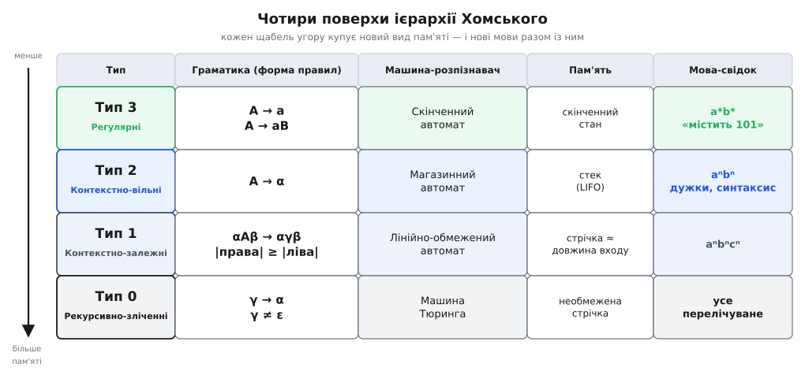
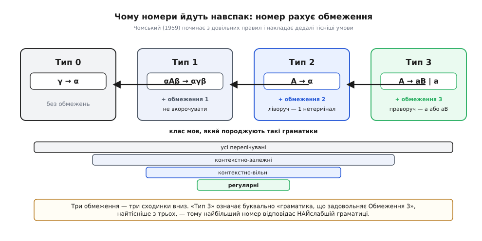
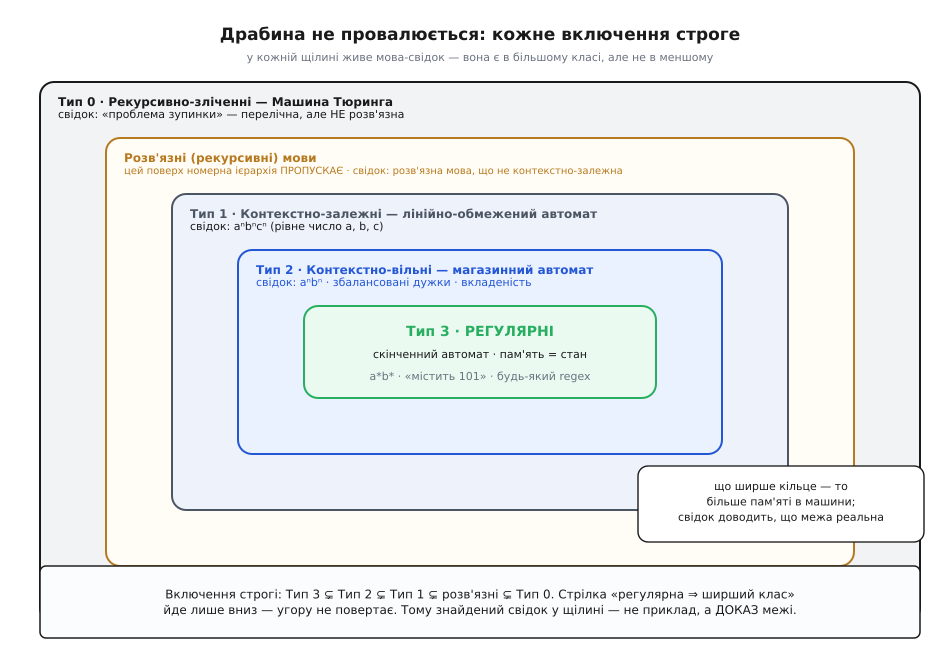

# Ієрархія Хомського

<preknowlist>
- [Формальна мова](topic:math/formal-language) — алфавіт Σ, слово, множина всіх слів Σ*; мова — це просто якась множина слів.
- [Формальні граматики](topic:math/formal-grammar) — правила породження, що заміняють нетермінали рядками, аж поки не лишаться самі термінали.
- [Скінченні автомати](topic:math/finite-automata) — машина зі скінченним числом станів, що читає слово по символу й каже «так» чи «ні».
- [Магазинні автомати](topic:math/pushdown-automata) — скінченний автомат плюс стек; клас контекстно-вільних мов.
- [Машина Тюринга](topic:math/turing-machine) — скінченне керування плюс необмежена стрічка; найсильніша модель обчислення.
</preknowlist>

Уявіть, що ви зібрали цілий звіринець моделей обчислення. Є скінченний автомат — читає рядок і тримає в голові один зі скінченного числа станів. Є магазинний автомат — той самий, але зі стеком. Є машина Тюринга — з нескінченною стрічкою, на якій можна писати й стирати будь-де. І окремо — способи **описати** мову: формулою (регулярний вираз), правилами породження (граматика). Звіринець строкатий, і природно спитати: чи є в ньому лад? Чи це просто перелік різних апаратів, чи вони шикуються у щось одне?

Виявляється, лад є, і напрочуд чіткий. Усі ці моделі шикуються **вздовж однієї осі**, і ця вісь — **пам'ять**. Кожен наступний апарат сильніший за попередній рівно тому, що йому дали пам'ять нового роду; кожен клас мов, який він охоплює, ширший рівно на ті мови, для яких цієї пам'яті бракувало. Мапу, що розкладає моделі по цій осі на чотири поверхи, 1956 року накреслив лінгвіст **Ноам Чомський** (Avram Noam Chomsky, нар. 1928), і сьогодні її звуть **ієрархією** (гр. *hierarchía* — порядок підпорядкування) **Хомського**.

## Одна вісь усе впорядковує

Щоб мапа мала сенс, домовмося, що на ній зображено. **Мова** — це якась множина слів над скінченним алфавітом Σ (наприклад, «усі двійкові слова з парним числом одиниць» або «усі правильно складені арифметичні вирази»). Мов незліченно багато, і переважна їх більшість жодному скінченному опису не піддається. Нас цікавлять ті, що піддаються, — і питання щоразу те саме: **скільки пам'яті треба машині, щоб таку мову розпізнати?**

Один і той самий клас мов можна намацати з двох боків, і це не дрібниця, а серце всієї конструкції. З боку **розпізнавача** — це машина, що читає слово й каже «належить мові чи ні». З боку **породження** — це [граматика](topic:math/formal-grammar), набір правил, що вирощують правильні слова з єдиного стартового символу, заміняючи нетермінали (лат. *terminus* — межа; нетермінал — проміжний символ, що ще підлягає заміні) доти, доки не лишаться самі термінали. Ієрархія тому й міцна, що на кожному поверсі ці два боки **збігаються**: певна форма правил граматики породжує рівно той клас мов, який розпізнає певна машина з певним обсягом пам'яті. Обмежили форму правил — обмежили пам'ять машини, і навпаки.

> 🔧 **Навіщо це.** Питання «якого класу моя мова» — не абстракція, а вибір інструмента наперед. «Коректна IP-адреса», «збалансовані дужки», «синтаксично правильна програма» — це формальні мови різних поверхів. Знаючи поверх, ви одразу знаєте, чи вистачить регулярного виразу, чи потрібен розбірник зі стеком, чи задача взагалі впирається в межу обчислюваного. Це економить дні, витрачені на спроби зробити слабким інструментом те, що йому не під силу за теоремою.

## Чотири поверхи

Розкладімо звіринець по осі — від найскупішої пам'яті до найщедрішої. Виходить рівно чотири поверхи, і кожен варто побачити як **пару**: форма правил ↔ машина ↔ вид пам'яті ↔ мова-свідок, що на цьому поверсі вже живе, а на нижчому — ще ні.


*Чотири поверхи ієрархії як одна таблиця. Рядок — це тип: форма правил граматики, машина, що його розпізнає, обсяг її пам'яті й проста мова-свідок. Згори вниз пам'ять росте: скінченний стан → стек → стрічка завдовжки як вхід → необмежена стрічка. Права форма правил і ліва машина на кожному рядку описують РІВНО той самий клас мов.*

**Тип 3 — регулярні мови.** Найскупіший поверх. Правила граматики мають вигляд `A → a` або `A → aB`: дописати один термінал і, можливо, перейти до одного нетерміналу. Машина — [скінченний автомат](topic:math/finite-automata), пам'ять якого вичерпується поточним станом. Свідки: `a*b*`, «слово містить 101», будь-що, що бере регулярний вираз. Це рівно [регулярні мови](topic:math/regular-languages) — клас, у якому досить пам'ятати скінченний стан і нічого більше.

**Тип 2 — контекстно-вільні мови.** Додаємо стек. Правила слабшають до `A → α`: один нетермінал ліворуч, а праворуч — будь-який рядок. Машина — [магазинний автомат](topic:math/pushdown-automata): скінченне керування плюс стек, куди можна лише класти зверху й знімати зверху. Свідок, недосяжний нижче, — мова **aⁿbⁿ** (скільки `a`, стільки потім `b`): стек рахує `a`, знімає на `b`. Сюди ж лягає вся вкладеність — збалансовані дужки, а отже й синтаксис мов програмування.

**Тип 1 — контекстно-залежні мови.** Стека вже замало. Правила мають форму `αAβ → αγβ`: нетермінал `A` перепишеться на непорожнє `γ`, **але лише в контексті** (лат. *contextus* — сплетіння) — коли ліворуч стоїть `α`, а праворуч `β`. Рівносильно й наочніше: правила **не вкорочують** рядок, ліва частина ніколи не довша за праву. Машина — **лінійно-обмежений автомат**: та сама машина Тюринга, але голівці дозволено ходити лише в межах клітинок, зайнятих входом (пам'ять росте не безмежно, а пропорційно довжині слова). Свідок — **aⁿbⁿcⁿ**: рівне число `a`, `b` і `c`, чого один стек уже не витягне. [Що це за машина й чому саме «лінійно-обмежена»](topic:math/linear-bounded-automaton) — окрема тема.

**Тип 0 — рекурсивно-зліченні мови.** Знімаємо всі обмеження. Правила `γ → α` довільні (ліворуч будь-який непорожній рядок). Машина — [машина Тюринга](topic:math/turing-machine) з необмеженою стрічкою. Це найширший клас узагалі — усі мови, для яких існує машина, що **перелічує** їхні слова (звідси й назва: рекурсивно-зліченна — та, слова якої можна породжувати одне за одним обчисленням). Якщо слово в мові — машина рано чи пізно скаже «так»; якщо ні — може крутитися вічно.

## Як грати рівнями: дві граматики

Абстракція оживає, коли бачиш правила в дії. Візьмімо дві мови із сусідніх поверхів і виростимо по слову з кожної — різниця в пам'яті стане відчутною на дотик.

**Тип 2: граматика для aⁿbⁿ.** Два правила:

```
S → a S b        (обгорнути: додати a зліва, b справа)
S → a b          (закрити найменшим словом)
```

Виведення слова `aaabbb` — послідовність замін від стартового `S`:

```
S  ⇒  a S b  ⇒  a a S b b  ⇒  a a a b b b
      (S→aSb)   (S→aSb)       (S→ab)
```

Кожне обгортання додає по одному `a` ліворуч і `b` праворуч **симетрично** — тому їх завжди порівну. Це і є контекстно-вільна сила: один нетермінал `S` тримає всю ще-не-дописану вкладеність, як стек магазинного автомата.

**Тип 1: граматика для aⁿbⁿcⁿ.** Тепер потрібна третя однакова кількість, і сама форма правил мусить подорослішати:

```
S → a S B C   |   a B C       (наростити a; за кожним — по значку B і C)
C B → B C                     (пересортувати: усі B наперед, усі C назад)
a B → a b       b B → b b      (перетворити B на b поряд з a/b)
b C → b c       c C → c c      (перетворити C на c поряд з b/c)
```

Виведення `aabbcc`:

```
S  ⇒  a S B C  ⇒  a a B C B C        (наростили два a)
   ⇒  a a B B C C                    (правило CB→BC: B наперед)
   ⇒  a a b B C C  ⇒  a a b b C C     (B → b поряд з a, тоді з b)
   ⇒  a a b b c C  ⇒  a a b b c c     (C → c поряд з b, тоді з c)
```

Придивіться до правила `CB → BC`: ліворуч **два** символи, і жоден не «головний» — переписування `B` залежить від того, що поряд стоїть `C`. Саме тут ховається слово «контекстно»: доля символу вирішується не сама по собі, а **у сплетінні із сусідами**. Один стек так не вміє — тому й довелося піднятися на поверх.

## Чому номери йдуть навспак

Тут мапа підкидає загадку, від якої спотикаються всі новачки. **Тип 3 — найслабший, Тип 0 — найсильніший.** Номер росте, а сила падає. Чому не навпаки?

Розгадка — у тому, **як** Чомський означив типи 1959 року, у статті «Про деякі формальні властивості граматик» (*On Certain Formal Properties of Grammars*, Information and Control 2(2), 137–167). Він не будував драбину знизу вгору. Він узяв **найзагальніший** механізм — довільні правила переписування (це Тип 0) — і почав накладати обмеження одне за одним, нумеруючи їх по порядку.


*Номер типу рахує накладені обмеження, а не силу. З довільних правил (Тип 0) додаємо Обмеження 1 (не вкорочувати рядок) → Тип 1, Обмеження 2 (ліворуч рівно один нетермінал) → Тип 2, Обмеження 3 (права частина — термінал або термінал з нетерміналом) → Тип 3. Кожне обмеження тісніше за попереднє, тож клас мов щокроку вужчає — смуги внизу коротшають.*

Обмеження 1 забороняє правилам вкорочувати рядок — дістаємо Тип 1. Обмеження 2 (тісніше) дозволяє ліворуч лише один нетермінал — Тип 2. Обмеження 3 (найтісніше) велить правій частині бути `a` або `aB` — Тип 3. Ось і вся розгадка: **«Тип 3» означає буквально «граматика, що задовольняє Обмеження 3»**, а третє обмеження було найсуворішим у списку. Більший номер — більше обмежень — вужчий клас — слабша граматика. Це не задум, а порядок пунктів на одній сторінці 1959 року. [Як народилася ця нумерація й уся ієрархія](topic:math/regular-languages/hist-chomsky-hierarchy.md) — окрема історія, і повчальна: сам Чомський будував найнижчий щабель як мішень, щоб довести, що скінченної пам'яті замало для природної мови.

## Драбина не провалюється

Мапа була б порожньою обіцянкою, якби поверхи насправді збігалися. Тому головне твердження ієрархії — що включення **строгі**:

```
Тип 3  ⊊  Тип 2  ⊊  Тип 1  ⊊  Тип 0
регулярні ⊊ контекстно-вільні ⊊ контекстно-залежні ⊊ рекурсивно-зліченні
```

Знак `⊊` (строге включення) читається так: кожна регулярна мова є контекстно-вільною, але **існує** контекстно-вільна, що не регулярна, — і так на кожному стику. Доводять це не загальним міркуванням, а **свідком**: конкретною мовою, що живе у ширшому класі й доведено відсутня у вужчому.

Свідки нам уже трапилися. Мова **aⁿbⁿ** контекстно-вільна, але не регулярна: скінченний автомат не втримає в скінченному стані необмежене число `a`, щоб звірити його з числом `b`. Мова **aⁿbⁿcⁿ** контекстно-залежна, але не контекстно-вільна: один стек порахує `a` проти `b`, та на звірку з `c` фішок уже не лишиться. Кожен свідок — це не приклад, а **доказ**: він показує рівно ту здатність, якої нижчому поверху бракує. [Як строго доводять кожне з цих включень](topic:math/chomsky-hierarchy/math-strict-inclusions.md) — від леми про накачування до діагоналізації — зібрано окремо.


*Класи як вкладені кільця: що ширше кільце, то більше пам'яті в машини. У кожній щілині сидить мова-свідок, що доводить строгість включення: aⁿbⁿ між регулярними й контекстно-вільними, aⁿbⁿcⁿ — на сходинку вище. Окремо, амбровим, показано поверх РОЗВ'ЯЗНИХ мов між Тип 1 і Тип 0 — його номерна ієрархія пропускає.*

## Прихований поверх: розв'язні мови

Мапа з чотирьох поверхів має одну тонкість, яку легко проґавити. Між Типом 1 і Типом 0 тихо ховається ще один клас — **розв'язні** (рекурсивні) мови: ті, для яких машина Тюринга завжди зупиняється й дає чітке «так» або «ні». Це не те саме, що Тип 0.

Різниця тонка, але суттєва. Рекурсивно-зліченна (Тип 0) мова гарантує лише те, що на **своїх** словах машина скаже «так»; на чужих вона може крутитися вічно, так ніколи й не відповівши «ні». Розв'язна мова — та, де машина завжди **зупиняється**. І ці класи не збігаються:

```
контекстно-залежні  ⊊  розв'язні  ⊊  рекурсивно-зліченні
        (Тип 1)                          (Тип 0)
```

Ліве включення строге: кожна контекстно-залежна мова розв'язна (лінійно-обмежений автомат завжди зупиняється, бо в нього скінченне число можливих конфігурацій), але існує розв'язна мова, що не контекстно-залежна — це помітив ще **Гілері Патнем** у примітці до статті 1959 року. Праве включення теж строге, і його свідок — знаменита [проблема зупинки](topic:algorithms/halting-problem): мова пар «програма, вхід», де програма зупиняється, — рекурсивно-зліченна (запусти й чекай), але **не розв'язна** (немає машини, що для всіх пар безпомилково скаже «не зупиниться»). [Що таке розв'язні мови й чим вони відрізняються від перелічних](topic:math/decidable-languages) — тема сама по собі.

Отже номерні поверхи Хомського — не вся картина обчислюваності, а її **граматичний** зріз. Розв'язність — властивість не граматики, а машини: чи та завжди спиняється. Тому клас розв'язних мов ліг **між** двома верхніми типами, не діставши власного номера.

## Де це працює

Уся ця драбина — не музейна класифікація, а щоденний компас. Знаючи поверх мови, ви знаєте інструмент — і, що важливіше, знаєте, коли інструмент **безсилий за теоремою**, а не через вашу невправність.

- **Регулярний (Тип 3).** Перевірка форматів (дата, число, адреса), поділ тексту на лексеми, прості текстові протоколи, `grep`. Регулярний вираз компілюється в скінченний автомат, що біжить по тексту за один прохід. Але щойно задача вимагає рахувати без стелі — регекс безсилий: `aⁿbⁿ` йому не по зубах, хоч як його ускладнюй.
- **Контекстно-вільний (Тип 2).** Розбір усього вкладеного: JSON, XML, арифметичні вирази, синтаксис мов програмування. Тут працює магазинний автомат зі стеком. Знаменита пересторога «не розбирай HTML регулярним виразом» — це пряме прочитання межі між Типом 3 і Типом 2: HTML має необмежену вкладеність, а скінченний автомат вкладеність не рахує.
- **Контекстно-залежний і вище (Тип 1, Тип 0).** Узгодження, що тягнуться крізь увесь текст, повна семантика програм, будь-яке обчислення загального вигляду. А з силою Тюринга приходить і її тінь — **нерозв'язність**: ідеального аналізатора, що для будь-якої програми скаже, чи та зациклиться, не існує, бо це буквально проблема зупинки.

> 🔧 **Навіщо це.** Найцінніше в ієрархії — не «до якого класу віднести мову», а зворотне читання: **чого певним інструментом зробити не можна ніколи**. Коли колега пропонує «докрутити регекс», щоб він розбирав вкладені дужки, ієрархія дає точну відповідь — це не питання вправності, а межа Типу 3, і ніяке ускладнення виразу її не перейде. Так теорія економить не години, а хибні напрями цілих проєктів.

Складімо все докупи. Ієрархія Хомського впорядковує моделі обчислення вздовж однієї осі — **пам'яті** — на чотири поверхи, і на кожному форма правил граматики точно збігається з машиною певної потужності: скінченний стан (регулярні, Тип 3), стек (контекстно-вільні, Тип 2), стрічка завдовжки як вхід (контекстно-залежні, Тип 1), необмежена стрічка (рекурсивно-зліченні, Тип 0). Номери рахують накладені обмеження, тому більший номер означає слабшу граматику. Включення строгі, і кожне доводить конкретна мова-свідок — `aⁿbⁿ`, `aⁿbⁿcⁿ`, проблема зупинки. А між двома верхніми поверхами ховається безномерний клас розв'язних мов, що нагадує: ця мапа — граматичний зріз обчислюваності, а не вся вона. Головна ж користь драбини практична: вона наперед каже, який апарат упорається із задачею, — і чесно попереджає, коли задача лежить за межею того, що обраний апарат уміє в принципі.
