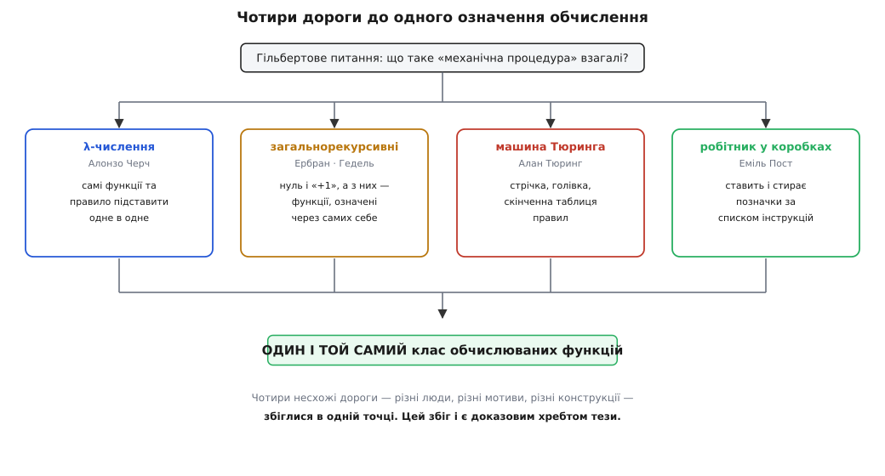
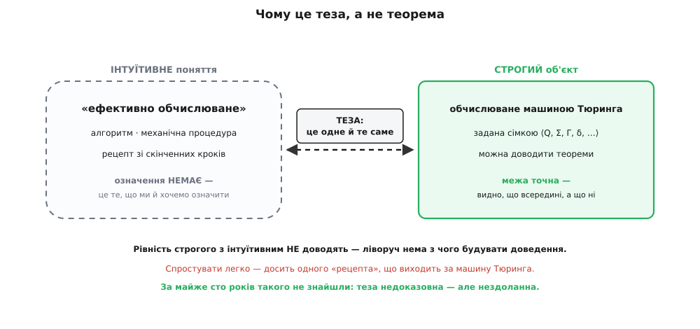

# Теза Черча–Тюринга

<preknowlist>
- [Машина Тюринга](topic:math/turing-machine) — стрічка, голівка й функція переходів δ; головне — ідея «обчислюване = те, що обчислює якась машина Тюринга». Теза вся крутиться саме навколо цієї мірки.
</preknowlist>

Слово «алгоритм» (від латинізованого імені математика IX ст. аль-Хорезмі, *al-Khwārizmī*) ми вживаємо так, ніби воно очевидне: рецепт, скінченний список кроків, які машинально виконуєш — і дістаєш відповідь. Поки йдеться про «поділити стовпчиком» чи «знайти найбільший спільний дільник», інтуїції цілком вистачає. Але спробуйте довести, що для якоїсь задачі рецепту **не існує взагалі** — і ґрунт тікає з-під ніг. Щоб сказати «жоден алгоритм не впорається», спершу треба точно знати, що таке «алгоритм узагалі». А такого означення не було. Дві з половиною тисячі років математики писали алгоритми, не вміючи сказати, що ж воно таке.

Мовчати про це можна було доти, доки ніхто не питав. Питання приперло до стіни на початку XX століття. Давид Гільберт (*David Hilbert*) поставив **Entscheidungsproblem** (нім. *Entscheidung* — «рішення»): чи є механічна процедура, що про будь-яке математичне твердження скаже, доказовне воно чи ні? Щоб відповісти «ні, немає» — а відповідь виявилася саме така, — доводилося вперше в історії **строго означити механічну процедуру**. Інакше «процедури не існує» — просто струс повітря: не існує чого саме? Гільбертове питання змусило перетворити розпливчасте інтуїтивне поняття на точний математичний об'єкт, який можна вивчати й про який можна щось доводити.

## Чотири дороги, один клас

Найдивовижніше сталося далі. У 1930-х кілька людей, майже не змовляючись, узялися впіймати те саме «що можна обчислити механічно» — і кожен піймав по-своєму, власним інструментом.

Алонзо Черч (*Alonzo Church*) збудував [лямбда-числення](topic:math/lambda-calculus) — систему, де немає ні чисел, ні машин, самі функції та єдине правило: підставити одне в одне. «Обчислити» тут означає «спрощувати вираз, доки він спрощується».

Жак Ербран (*Jacques Herbrand*) і Курт Гедель (*Kurt Gödel*) означили [загальнорекурсивні функції](topic:math/general-recursive-functions) — ті, що будуються з кількох найпростіших цеглинок (нуль, «додати одиницю») скінченним набором прийомів, серед яких і означення функції через саму себе.

Алан Тюринг (*Alan Turing*) описав [машину Тюринга](topic:math/turing-machine) — стрічку, голівку й скінченну таблицю правил, що читає й переписує символи.

А Еміль Пост (*Emil Post*) незалежно від Тюринга накреслив майже ту саму машину, тільки іншими словами: робітник ходить рядом клітинок і ставить чи стирає позначки за списком інструкцій.

Чотири конструкції, які й на вигляд не мають нічого спільного: чисті функції, рекурсії, машина зі стрічкою, робітник із коробками. Логічно було б чекати, що вони окреслять різні класи задач — щось одне сильніше, щось слабше, десь один метод дістане туди, куди інший не дотягнеться. Натомість вийшло приголомшливе. **Клас функцій, які вони означують, — той самий, до останньої функції.** Усе, що обчислює λ-числення, обчислює й машина Тюринга, і навпаки; те саме з рекурсіями й Постовим робітником. Дороги різні, а прийшли **в одну-єдину точку**.


*Чому теза така надійна. Чотири людини з різними мотивами й несхожими інструментами намацували межу «механічно обчислюваного» — і всі впали в один клас функцій. Такий збіг важко списати на випадок: схоже, вони описали одну об'єктивну річ із різних боків. Цей збіг — головний доказовий факт усієї теорії обчислюваності.*

## Обчислення без жодної машини

Щоб відчути, наскільки різними бувають ці дороги — і наскільки однаковою їхня сила, — гляньмо на найдальшу від машин, λ-числення. У ньому немає числа «три». Число — це **дія**: «три» означає «повтори щось тричі». Нуль повторює нуль разів, наступне число — на один повтор більше за попереднє. Додати два числа — повторити спершу стільки разів, скільки каже перше, а тоді ще стільки, скільки каже друге. Ось ця думка словами й кодом (у Python його `lambda` — це буквально λ, у Haskell функція та її застосування і є вся мова):

:::tabs
```python
zero = lambda f: lambda x: x                     # 0: f не застосовуємо
suc  = lambda n: lambda f: lambda x: f(n(f)(x))  # n+1: іще раз f поверх n
add  = lambda a: lambda b: lambda f: lambda x: a(f)(b(f)(x))

to_int = lambda n: n(lambda k: k + 1)(0)         # число Черча → звичайний int
two    = suc(suc(zero))
three  = suc(two)
print(to_int(add(two)(three)))                   # 5
```
```haskell
zero    f x = x            -- 0: f не застосовуємо
suc   n f x = f (n f x)    -- n+1: іще раз f поверх n
add a b f x = a f (b f x)

toInt n = n (+1) (0 :: Int)   -- число Черча → звичайний Int
two     = suc (suc zero)
three   = suc two

main = print (toInt (add two three))   -- 5
```
:::

Тут немає ні стрічки, ні клітинок, ні лічильника — самі функції, що беруть інші функції. І все ж це повноцінне обчислення: так само кодуються будь-яка арифметика, умови, рекурсія — усе, на що здатна машина Тюринга. Дві картини світу, між якими начебто немає нічого спільного, обчислюють **рівно один клас функцій**. Саме такі збіги й стоять за тезою. [Порахувати одну й ту саму функцію трьома несхожими моделями — λ-численням, рекурсіями й машиною Тюринга — і побачити на власні очі, як усі три сходяться](topic:math/church-turing-thesis/proj-three-models.md) — найкоротший спосіб відчути цей збіг руками.

## Що саме стверджує теза

Тепер її можна вимовити. **Теза Черча–Тюринга** (теза, гр. *thésis* — «твердження, покладене в основу») каже:

> Будь-яка функція, яку взагалі можна обчислити якоюсь скінченною механічною процедурою — «ефективно обчислювана», — обчислюється машиною Тюринга (рівнозначно: вона λ-визначна й загальнорекурсивна).

Один бік цієї рівності легкий, другий — ні. Що машина Тюринга робить лише механічне — очевидно: вона і є втілення тупого виконання правил, нічого «розумного» в ній немає. Небанальне — зворотне: що **всяка** механічна процедура, яку тільки здатна вигадати людина, не виходить за межі машини Тюринга; що нема й не буде такого хитрого рецепту, який машина не відтворила б. Саме це перетворює її на **еталонну мірку обчислення**: сказати «задача обчислювана» — те саме, що «її розв'язує якась машина Тюринга»; сказати «алгоритму немає» — те саме, що «жодна машина Тюринга її не розв'язує».

## Чому це теза, а не теорема

Назва не випадкова, і в ній схована вся тонкість. Рівність, яку стверджує теза, з'єднує два поняття **різної природи**. Праворуч стоїть строгий математичний об'єкт: машина Тюринга задана сімкою ⟨Q, Σ, Γ, δ, …⟩, її можна вивчати, про неї доводять теореми. Ліворуч — **інтуїтивне** поняття: «те, що людина назвала б механічною процедурою». У нього немає означення — воно і є те, що ми щойно намагалися означити.

А рівність, в якій один бік не означений строго, **не можна довести**. Немає з чого будувати доведення: доводять твердження про точні об'єкти, а «ефективно обчислюване» — не точний об'єкт, а наша дочислова інтуїція про рецепти й кроки. Тому це назавжди лишається **тезою** — твердженням, яке ми приймаємо, зваживши всі докази, а не теоремою, яку виводимо з аксіом.

Але дещо тут разюче несиметричне. Спростувати тезу було б, у принципі, **легко**: досить пред'явити одну-єдину функцію, яку будь-яка розсудлива людина визнала б «обчислюваною за скінченним рецептом», але яку не бере жодна машина Тюринга. Одного контрприкладу вистачило б, щоб теза впала. За майже сто років — жодного. Кожне нове означення обчислення, яке хтось пропонував (реєстрові машини, клітинні автомати, найхимерніші мови програмування, які лишень вигадали), щоразу давало **той самий** клас, ні на функцію більший. Теза недоказовна — і водночас уперто нездоланна.


*Що з'єднує теза і чому її статус саме такий. Праворуч — точний об'єкт із означенням; ліворуч — розпливчаста інтуїція, яку означити й хотіли. Місток між ними не можна довести (ліворуч нема з чого будувати доведення), зате легко було б спростувати одним контрприкладом — а його за майже сто років не знайшли. Звідси й дивний статус: недоказовна, та нездоланна.*

Варто розрізнити два джерела впевненості, бо їх постійно плутають. Перше — той самий **збіг** незалежних означень: доказ сильний, але сам по собі він каже лише «наші формалізми узгоджені між собою», а не «вони узгоджені з людською інтуїцією». Друге джерело, глибше, дав саме Тюринг. Він не просто додав п'яту конструкцію — він **проаналізував людину, що рахує**: у неї скінченно багато чітко різних станів свідомості, вона за раз дивиться на скінченний шматок паперу, змінює один символ і переходить у наступний стан за незмінним правилом. З цього аналізу машина Тюринга не постульована навмання, а **виведена** як точний портрет того, що взагалі робить обчислювач. Ось чому Гедель, який Черчеву λ-визначність вважав непереконливою підставою, прийняв саме Тюрингів варіант: той не вгадав вдале означення, а обґрунтував, чому воно неминуче. [Як пропозиція Черча Геделю 1934 року переросла в тезу, чому 1936-й став дивом-роком обчислюваності й хто дав тезі її назву](topic:math/church-turing-thesis/hist-thesis-birth.md) — окрема розповідь, і людей у ній більше, ніж двоє в назві.

## Навіщо теза

Без неї вся теорія обчислюваності зависла б у повітрі. Візьмімо [проблему зупинки](topic:algorithms/halting-problem): доведено, що **жодна машина Тюринга** не вміє за описом програми та її входом безпомилково сказати наперед, чи та колись зупиниться. Це строга теорема — але про машини Тюринга. Цінною для життя вона стає лише разом із тезою: теза дозволяє перекласти «жодна машина Тюринга не вміє» на «**жоден алгоритм узагалі** не вміє», тобто такого аналізатора не напише ніхто й ніколи — жодною мовою, на жодному залізі, хоч би скільки старався. Без тези завжди лишалася б лазівка: «а може, є якийсь хитріший метод, не машина Тюринга?». Теза цю лазівку зачиняє наглухо. Того ж роду й негативна відповідь на Entscheidungsproblem, і споріднені їй [теореми Геделя про неповноту](topic:math/godel-incompleteness): не все чітко поставлене — обчислюване, і теза каже, що це «не все» — назавжди, а не до винайдення кращого методу.

> 🔧 **Навіщо це.** Практичний бік тези бачить кожен програміст, навіть не називаючи її. Коли кажуть, що мова «повна за Тюрингом» (Turing-complete), мають на увазі рівно одне: нею можна виразити будь-який алгоритм, бо вона дотягується до межі машини Тюринга. C, Python, лямбди, навіть система шаблонів C++ чи формули в таблиці Excel — усі **однакові за силою**, і жодна майбутня мова не обчислить того, чого не обчислить решта; різняться вони зручністю, а не потужністю. І навпаки: якщо задача доведено нерозв'язна — ідеальний детектор зациклень, точний антивірус, що самим аналізом поведінки відрізнить будь-яку шкідливу програму від безпечної, — теза радить не марнувати життя на її облогу. Це не інженерна складність, яку здолає швидше залізо чи розумніший підхід, а стіна, за якою немає нічого.

## Чого теза не каже

Найчастіша плутанина — сплутати «**чи можна** обчислити» з «**чи швидко**». Теза Черча–Тюринга — тільки про перше. Вона запевняє, що машина Тюринга дотягнеться до кожної обчислюваної функції, але про **час** не обіцяє нічого: щось вона зробить за мить, а щось — за кількість кроків, більшу за число атомів у Всесвіті, і з погляду тези обидва однаково «обчислювані».

Питання швидкості накриває **інша** заява — значно смілива й досі спірна: так звана **розширена** (або **фізична**) теза Черча–Тюринга. Вона твердить, що жоден фізичний пристрій не тільки не обчислить більшого за машину Тюринга, а й не обчислить **істотно швидше** — те, на що в нього йде поліноміальний час, машина Тюринга теж устигне за поліноміальний час. Це вже не про логіку, а про фізику нашого світу, і ґрунт тут хиткий. Квантовий комп'ютер, схоже, кидає саме цій розширеній тезі виклик: алгоритм Шора розкладає великі числа на множники за поліноміальний час, а для звичайного комп'ютера такого швидкого способу не знають. На **основну** тезу це не впливає ані на йоту — квантова машина обчислює той самий клас функцій, лише подекуди швидше; під сумнівом опиняється тільки версія «про швидкість».


*Дві межі, які легко сплутати. Зовнішня — «що взагалі обчислюване»: її стереже основна теза, майже беззаперечна. Внутрішня, пунктирна, — «що обчислюване швидко»: це вже розширена, фізична теза, значно спірніша. Квантовий комп'ютер тисне на внутрішню межу (можливо, рахує щось швидше), але зовнішньої не руше: більшого за машину Тюринга він не обчислює. [Сама межа «швидко/повільно» — це класи P і NP](book:algorithms/np-completeness), окрема історія.*

І ще двох речей теза не стверджує, хоч їх раз у раз їй приписують. Вона **не доводить, що мозок чи Всесвіт — машина Тюринга**: чи можна фізичний процес звести до обчислення — окреме, відкрите й гостро дискусійне питання, а не наслідок тези. І вона **не забороняє фантазувати** про гіпотетичні надобчислювачі, що вийшли б за машину Тюринга, — просто всі такі проєкти лишаються умоглядними, бо жоден не спирається на фізику, яку ми справді вміємо будувати.

## Підсумок

Складімо ланцюжок. Гільбертове питання про механічну процедуру змусило вперше **строго означити обчислення** — інакше «алгоритму не існує» лишалося б беззмістовним звуком. У 1930-х чотири незалежні дороги — [λ-числення](topic:math/lambda-calculus) Черча, [загальнорекурсивні функції](topic:math/general-recursive-functions) Ербрана й Геделя, [машина Тюринга](topic:math/turing-machine) і робітник Поста — привели **в один і той самий клас функцій**. Теза Черча–Тюринга піднімає цей збіг у принцип: **обчислюване = обчислюване машиною Тюринга**. Це саме теза, а не теорема, бо прирівнює строгий об'єкт до інтуїтивного поняття; довести її не можна, а спростувати за майже сто років не вдалося нікому — і найпереконливіший доказ дав не сам збіг, а Тюрингів аналіз людини-обчислювача. Завдяки їй «алгоритму не існує» стає строгим твердженням про машини Тюринга, а «повна за Тюрингом» — точною межею сили будь-якої мови програмування. Треба лише не плутати цю межу — «що взагалі обчислюване» — із зовсім іншою, «що обчислюване **швидко**», якої основна теза не торкається зовсім.
