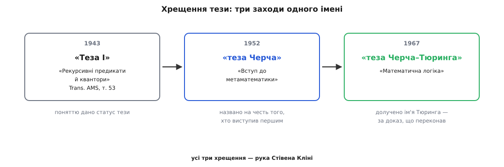

# 📜 Диво-рік і хрещення: як пропозиція Черча переросла в тезу Черча–Тюринга

У назві «теза Черча–Тюринга» стоять двоє. Насправді за нею ховається щонайменше шестеро людей, три країни й одна гостра іронія: той, чий клас функцій зробили узаконеним боком тези, спершу саму тезу **відкинув**. Звали його Курт Гедель (*Kurt Gödel*), і вся історія починається з його вироку — «геть незадовільно».

Це варто розповісти саме як історію, а не як низку дат, бо тут дати брешуть, якщо їх не оживити. За сухими роками — люди, які місяцями сумнівалися, сперечалися через океан, ловили одну й ту саму думку, не змовляючись, і врешті дали спільній знахідці ім'я через десятиліття після того, як вона народилася. Найцікавіше не *що* сталося 1936 року, а **чому** саме тоді розпливчаста інтуїція про «механічний рецепт» раптом стала точним поняттям — і чому переконав скептика зовсім не той, чиє ім'я в назві стоїть першим.

## «Геть незадовільно»: розмова, з якої начебто нічого не вийшло

Прінстон, початок 1934 року. Молодий Гедель, якому щойно виповнилося 28 і який уже перевернув логіку своїми [теоремами про неповноту](topic:math/godel-incompleteness), приїхав з Відня читати лекції. Поруч працював Алонзо Черч (*Alonzo Church*) зі своїми учнями — Стівеном Кліні (*Stephen Kleene*) і Барклі Россером. Черч кілька років будував [лямбда-числення](topic:math/lambda-calculus) — систему, де все на світі є функцією, а «обчислити» означає «спрощувати вираз за єдиним правилом підстановки». І він мав сміливу здогадку: **усе, що взагалі можна обчислити механічно, — це рівно те, що виражається в його численні** (λ-визначне).

Здогадку він виніс на суд найгострішого розуму, який був під рукою. Підійшов до Геделя й запропонував: означмо «ефективно обчислюване» як «λ-визначне». Реакція Геделя була крижана: він визнав таку пропозицію **«геть незадовільною»** (*thoroughly unsatisfactory*). Знаємо ми це не з пізньої легенди — слова збереглися в листі самого Черча до Кліні від 29 листопада 1935 року, десь за рік після розмови; Кліні оприлюднив цей документ аж 1981-го. Свідчення, отже, майже сучасне події й з перших рук учасника, а не переказ через півстоліття.

> 🔧 **Навіщо це.** Тут захований урок, який не старіє: **збіг цифр — ще не пояснення**. Черч приніс клас функцій і сказав «повірте, це воно». Для інженера цього досить; для Геделя — ні. Він хотів не готового переліку, а **аргументу, чому саме цей перелік і жоден інший**. Різниця між «ось відповідь» і «ось чому це неминуче відповідь» — і є різниця між гарним формалізмом і справжнім означенням поняття. Ця вимога Геделя, а не Черчева сміливість, урешті й вивела теорію на твердий ґрунт.

Чому Гедель уперся? Лямбда-числення давало **точний клас**, але не пояснювало, звідки певність, що поза ним не лишилося жодного «обчислюваного» рецепту. Це виглядало як означення навмання: ось вам система, вона багато що вміє, повірте, що вміє геть усе. Для людини, яка щойно показала, що навіть арифметика ховає твердження, недосяжні для будь-якої формальної системи, таке «повірте» звучало нестерпно.

І тут — перша іронія. У тих самих прінстонських лекціях 1934 року Гедель **сам** означив клас, який стане класичним: **загальнорекурсивні функції**. Поштовх дав француз Жак Ербран (*Jacques Herbrand*) листом 1931 року; Гедель ідею допрацював і виклав у лекціях, конспект яких вели Кліні й Россер. Рекурсія (лат. *recurrere* — вертатися, бігти назад) — це коли функцію означують **через саму себе**, зводячи більший випадок до меншого:

```
дод(m, 0)   = m                   # база: додати нуль — нічого не робити
дод(m, n+1) = дод(m, n) + 1       # крок: значення через попереднє, на 1 менше
```

Із таких означень-«через-себе» плюс однієї сміливішої операції — «взяти найменше n, при якому щось обертається на нуль» —

```
f(x) = μn [ g(x, n) = 0 ]         # μ: найменше n, при якому g(x,n)=0
```

виростає **весь** клас загальнорекурсивних функцій. Саме він стане правим боком майбутньої тези в її «офіційному» формулюванні. І саме його автор, Гедель, відмовився назвати означенням «обчислюваного». Клас — його; благословення — ні.

Далі сталося те, що робить науку наукою. Черч не образився — він **послухав**. Отримавши холодну відповідь, він змінив тактику: перевів своє означення з λ-визначності на геделеву загальнорекурсивність (а що обидва класи — той самий, Кліні незабаром довів строго). Це не відступ, а посилення: тепер за здогадкою стояли **два** незалежні формалізми, що збігаються. І з цим Черч нарешті наважився сказати вголос.

## 1935: Черч наважується вголос

19 квітня 1935 року Черч виступив перед Американським математичним товариством. Тези доповіді того ж року вийшли коротким **абстрактом** у *Bulletin of the American Mathematical Society* (том 41, стор. 332–333), а слідом — другим повідомленням (стор. 453). Це і є перша прилюдна поява того, що згодом назвуть тезою: пропозиція **прирівняти «ефективно обчислюване» до загальнорекурсивного** (рівнозначно — λ-визначного).

Повна стаття дозріла наступного року — **«Нерозв'язна задача елементарної теорії чисел»** (*An Unsolvable Problem of Elementary Number Theory*), *American Journal of Mathematics*, том 58 (1936), стор. 345–363. Назва скромна, а всередині — бомба. Черч показав, що існує цілком чітко поставлена задача про числа, яку **не бере жоден рецепт**: немає загальнорекурсивної процедури, що про два вирази λ-числення завжди скаже, чи зводяться вони один до одного. А в супутній замітці того ж року він приклав це до Гільбертового питання й довів: **загального механічного розв'язувача для логіки не існує** — негативна відповідь на [Entscheidungsproblem](topic:math/turing-machine/hist-computable-numbers.md).

Зверніть увагу на порядок думки, бо він тонкий. Щоб довести, що чогось **не існує**, Черчеві спершу довелося точно сказати, що це «щось» таке. Без тези «рецепту немає» — струс повітря: немає *чого* саме? Теза тут — не прикраса, а **несуча балка** доведення: вона перекладає «жодна загальнорекурсивна функція не впорається» на «жоден алгоритм узагалі не впорається». Черч уперше в історії міг вимовити «розв'язати цю задачу неможливо» й мати на увазі точну, доказову річ.

Був тільки один клопіт. Теза Черча спиралася на ту саму підставу, яку відкинув Гедель: «ось клас, повірте, що він повний». Збіг λ-числення з рекурсіями вражав, але сам собою свідчив лише про те, що **два формалізми узгоджені між собою** — а не про те, що вони узгоджені з людською інтуїцією про рецепти. Скептик мав право спитати: а може, обидва однаково промахнулися повз щось обчислюване? Бракувало доказу іншого роду — не ще одного класу, а **пояснення, чому клас саме такий**. І в ту саму пору, за океаном, нікому не відомий випускник із Кембриджа вже це пояснення писав, гадки не маючи ні про Черча, ні про Геделя.

## Рік, коли все зійшлося

1936-й недарма звуть роком-дивом обчислюваності. За кілька місяців, майже не перетинаючись, четверо людей упіймали те саме поняття — і кожен своїм знаряддям.

**Черч** друкує повну «Нерозв'язну задачу» (*American Journal of Mathematics* 58, 1936) — λ-числення й рекурсії.

**Алан Тюринг** (*Alan Turing*) у Кембриджі пише **«Про обчислювані числа, із застосуванням до Entscheidungsproblem»** (*On Computable Numbers…*). Рукопис надійшов до Лондонського математичного товариства **28 травня 1936 року**, прочитаний 12 листопада, надрукований у *Proceedings of the London Mathematical Society* (серія 2, том 42, стор. 230–265) на межі 1936–1937 років. Тюрингове знаряддя — [машина Тюринга](topic:math/turing-machine): стрічка, голівка, скінченна таблиця правил.

**Еміль Пост** (*Emil Post*) у Нью-Йорку незалежно накреслює майже ту саму машину іншими словами — «робітник» ходить рядом клітинок і ставить чи стирає позначки за списком інструкцій. Його **«Скінченні комбінаторні процеси — формулювання 1»** (*Finite Combinatory Processes — Formulation 1*) надійшли до *Journal of Symbolic Logic* **7 жовтня 1936 року** (том 1, стор. 103–105).

**Стівен Кліні** тим часом доводить строгі рівності між формалізмами: λ-визначне = загальнорекурсивне. Триптих означень зшивається в одне.

Тут доречно спинитися на одній деталі, бо вона вирішує питання «а чи не списали одне в одного». Праці Тюринга й Поста надійшли з різницею в чотири місяці й описують по суті одну машину — та **незалежність тут документована**. Редактором номера *Journal of Symbolic Logic* був сам Черч, і він приписав до Постової статті примітку: робота, дарма що з пізнішою датою, написана **цілком самостійно**, без знання Тюрингової. Двоє людей по різні боки океану, не читавши одне одного, накреслили той самий пристрій. Такий збіг важко списати на моду чи запозичення — схоже, вони намацали щось об'єктивне.


*Густина, від якої й пішла назва «рік-диво». За два з половиною роки розпливчаста інтуїція про «механічний рецепт» стала точним поняттям — і не в одній голові, а майже одночасно в чотирьох, кожна зі своїм знаряддям. Точні дати надходження (Тюринг — 28 травня, Пост — 7 жовтня 1936) показують, наскільки незалежними й наскільки збіжними були ці спроби.*

Чотири дороги, один клас. Але серед цих чотирьох одна відрізнялася **природою доказу**, і саме вона зрушила з місця того, кого не зрушив ніхто.

## Чому Геделя переконав не Черч, а Тюринг

Повернімося до скептика. Гедель прийняв тезу не 1936-го й не від Черча. Йому бракувало саме того, чого не давали ні λ-числення, ні рекурсії, ні навіть Кліні з його рівностями: **аргументу від першопричини**. І цей аргумент дав Тюринг — тим, що зробив у своїй статті щось геть несхоже на решту.

Черч, Кліні, Гедель будували **класи функцій** і питали: чи великий цей клас? Тюринг натомість почав не з математики, а з **людини, що рахує**. Він придивився, що насправді робить обчислювач із олівцем і папером, і виснував: у такої людини скінченно багато чітко різних станів свідомості; за раз вона дивиться лише на скінченний шматок запису; змінює за крок один символ; переходить у наступний стан за незмінним правилом. Більше — нічого. З цього портрета машина не постулюється навмання, а **виводиться**: вона є точний зліпок того, що взагалі здатний зробити той, хто виконує рецепт. Тюринг не запропонував ще одне вдале означення — він **обґрунтував, чому воно неминуче**.

Ось цього Гедель і чекав. Раптом стало видно не «ще один клас, що збігається з попередніми», а **причину**, з якої всі класи мусили збігтися: усі вони, кожен по-своєму, описували ту саму скінченну істоту за роботою. Розмова 1934 року нарешті дістала відповідь — тільки не від співрозмовника.

Свій присуд Гедель висловлював потім не раз, і щоразу однозначно. У доповіді на Прінстонській двохсотрічній конференції 1946 року він сказав, що з поняттям обчислюваності Тюринга **вперше** вдалося дати «абсолютне» означення цікавого гносеологічного поняття — таке, що **не залежить від обраного формалізму**. У примітках, доданих 1963 і 1964 років до перевидань своїх ранніх праць, він повторив: саме завдяки Тюринговій роботі тепер можна дати «точне й безсумнівно адекватне означення загального поняття формальної системи». А в розмовах із Гао Ваном формулював зовсім по-людськи: **до Тюринга ми не бачили гострого поняття механічної процедури гостро** — це він привів нас до правильного погляду.

І тут — найтонше місце всієї історії, яке легко проґавити. Гедель не просто визнав Тюрингів варіант кращим. Він **відмовив** λ-численню й навіть власній загальнорекурсивності у праві бути **означенням** «алгоритму». Клас функцій вони, звісно, ловили правильний — з цим Гедель не сперечався. Але сказати, *який* клас, і пояснити, *чому саме цей*, — різні речі. λ-числення й рекурсії давали перше й мовчали про друге; вони були точні, та німі. Тільки Тюрингів аналіз людини-обчислювача говорив — і тому, на думку Геделя, тільки він був справжнім означенням поняття, а не вдалим його описом. Автор загальнорекурсивних функцій власноруч зняв із них корону означення й віддав її машині суперника.

## Тюринг у Прінстоні: три означення в одне

Історія любить симетрію. 1936 року Тюринг приїхав до Прінстона — і потрапив просто в руки Черча, під чиїм наглядом узявся до докторату. Двоє, що незалежно впіймали одне поняття, тепер працювали за сусідніми столами.

Тюринг зробив те, що замкнуло коло. Дізнавшись про Черчеву працю саме тоді, коли готував до друку власну, він **довів рівність** свого поняття обчислюваності й Черчевої λ-визначності — спершу коротко, додатком до «Про обчислювані числа», а тоді повно, окремою заміткою **«Обчислюваність і λ-визначність»** (*Computability and λ-definability*, *Journal of Symbolic Logic*, том 2, 1937, стор. 153–163). Кліні вже пов'язав λ-числення з рекурсіями; Тюринг доклав третю вершину. Відтоді **обчислюване машиною = λ-визначне = загальнорекурсивне** — не три схожі поняття, а три імені одного. Триптих став тотожністю, і руку до останнього стібка приклав саме Тюринг.

Тепер за тезою стояли обидва джерела впевненості, які не можна плутати. Перше — **збіг**: незалежні формалізми дали той самий клас, і Тюринг довів це для свого. Друге, глибше, — Тюрингів **аналіз обчислювача**, що пояснює, *чому* збіг був неминучий. Черч приніс сміливу пропозицію й перше доведення нерозв'язності; Тюринг — арґумент, що зробив пропозицію переконливою. Двоє зробили різну роботу, і обидві були потрібні. Лишалося дати цьому спільне ім'я — а це забрало ще десятиліття й третю людину.

## Хрещення: як Кліні дав тезі ім'я

Ані Черч, ані Тюринг своєї тези так не називали. Слово «теза» до неї приклав **Стівен Кліні** — той самий, що студентом конспектував геделеві лекції 1934 року й доводив рівності формалізмів. Він і став її хрещеним батьком, у три заходи.

Спершу — **«Теза I»**. У статті «Рекурсивні предикати й квантори» (*Recursive Predicates and Quantifiers*, *Transactions of the American Mathematical Society*, том 53, 1943) Кліні в розділі про алгоритмічні теорії вперше подав твердження як окрему іменовану **тезу**: «кожна ефективно обчислювана функція (ефективно розв'язний предикат) є загальнорекурсивною». Це перший раз, коли здогадка Черча дістала статус названого припущення, а не просто робочого означення.

Далі — **«теза Черча»**. У класичному підручнику **«Вступ до метаматематики»** (*Introduction to Metamathematics*, 1952) Кліні повторив те саме твердження і вперше назвав його **тезою Черча** (*Church's thesis*) — на честь того, хто виступив із ним прилюдно й надрукував перший. Саме з цієї книжки, найвпливовішого підручника логіки свого часу, назва пішла в широкий ужиток.

Нарешті — **«теза Черча–Тюринга»**. У пізнішому підручнику **«Математична логіка»** (*Mathematical Logic*, 1967) Кліні долучив до назви й Тюрингове ім'я. Справедливість вимагала: Черч виступив і надрукував перший, але переконливим твердження зробив саме Тюрингів аналіз — той, що врешті схилив навіть Геделя. Одне ім'я віддавало належне ініціативі, друге — доказові. Так усталилася назва, під якою тезу знають сьогодні.


*Три заходи одного хрещення, і всі три — руки Кліні. Показово, що назва дозрівала десятиліттями після самої знахідки 1936 року: спершу поняттю дали статус тези, потім — ім'я першовідкривача, і аж наприкінці — друге ім'я, що визнало: переконав не той, хто виступив першим. Назва з двох людей чесно ділить дві різні заслуги — ініціативу й доказ.*

## Шестеро в двох іменах

Ім'я «Черч–Тюринг» коротке, а людей за ним багато, і кожен вартий того, щоб назвати його точно — не приблизно.

**Алонзо Черч** (1903–1995) — американець, народжений у Вашингтоні. Він виступив із тезою першим, дав λ-числення й перше доведення нерозв'язності. І він же — той рідкісний учений, що на холодне «ні» Геделя відповів не образою, а переробкою власного означення.

**Алан Тюринг** (1912–1954) — британець, народжений у Лондоні. Його ім'я стоїть у назві другим, а внесок — не другорядний: саме його аналіз людини-обчислювача перетворив сміливу пропозицію на переконливу. Без Тюринга теза лишилася б Черчевою здогадкою, у яку скептик мав право не вірити.

**Курт Гедель** (1906–1978) — народжений у Брні (нім. *Brünn*), тодішній Моравії Австро-Угорщини, у німецькомовній родині; згодом австрійський, а з 1948-го — американський громадянин. Називати його просто «австрійцем» — груба монета: точніше сказати «уродженець Брна, німецькомовний моравець, австрійсько-американський логік». Він дав клас, що став правим боком тези, відмовився благословити саму тезу — і врешті першим у світі привселюдно визнав, що правильне означення знайшов Тюринг.

**Еміль Пост** (1897–1954) — тут потрібна особлива акуратність, бо його ідентичність легко перекрутити. Він народився в Білостоці, який тоді належав Російській імперії, а нині — польське місто; родина була **польсько-єврейська**, і хлопчиком, 1904 року, Пост переїхав до Нью-Йорка, де й став **американським** математиком. Клеїти йому ярлик «російський» — саме та імперська підміна, якої слід уникати: імперська приналежність міста при народженні не робить росіянином польського єврея, що виріс і працював у США. Пост незалежно від Тюринга накреслив ту саму машину — і зробив це, роками борючись із важкою недугою, яка щоразу вибивала його з наукового життя.

**Стівен Кліні** (1909–1994) — американець із Гартфорда, штат Коннектикут. Він не претендував на місце в назві, хоч тримав у руках усі нитки: конспектував Геделя, доводив рівності формалізмів, а тоді дав тезі і статус, і обидва імені. Хрестити чуже відкриття, не вписавши себе, — окрема шляхетність.

**Жак Ербран** (1908–1931) — француз, чия участь найтихіша й найтрагічніша. Саме його лист 1931 року підказав Геделеві схему загальнорекурсивних функцій. Дожити до диво-року він не встиг: того ж 1931-го, у 23 роки, Ербран загинув в Альпах під час сходження. Один із наріжних каменів тези заклала людина, що не побачила навіть її народження.

Ось чому назва з двох слів — оманлива. За «тезою Черча–Тюринга» стоїть не пара геніїв, а **гурт** людей із різних країн і різних доль, які протягом кількох років, здебільшого не змовляючись, обточили одне з найглибших понять науки. Черч наважився, Гедель засумнівався, Тюринг пояснив, Пост підтвердив незалежністю, Ербран підказав, Кліні зшив і назвав. Знадобилися всі шестеро — і саме тому теза така міцна: її не вигадала одна голова, її **намацали** з різних боків незалежні руки, і всі намацали одне.
