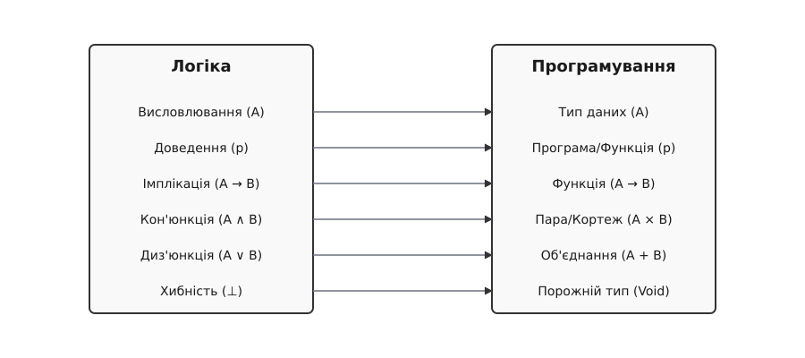

# Ізоморфізм Каррі — Говарда

<preknowlist>
- Логіка висловлювань
- Лямбда-числення
</preknowlist>

> [!TIP] 🔧 Навіщо це
> Розуміння ізоморфізму Каррі — Говарда дозволяє побачити глибинний зв'язок між написанням комп'ютерних програм та математичним доведенням теорем. Це фундамент сучасних систем автоматичного доведення (Coq, Agda, Lean) і строгих систем типізації, що гарантують безпомилковість коду ще до його виконання.

## Вступ до фундаментальної симетрії

Що спільного між доведенням складної математичної теореми та написанням функції на мові програмування? На перший погляд, це дві абсолютно різні сфери. Математик оперує абстракціями, аксіомами та правилами виведення, щоб довести, що певне твердження є істинним. Програміст, натомість, оперує типами даних, змінними та функціями, щоб змусити комп'ютер виконати певну корисну дію. Але що, якби ми сказали вам, що ці два процеси — це буквально одне й те саме?

Ізоморфізм Каррі — Говарда — це дивовижне відкриття, яке стверджує: **логічні висловлювання еквівалентні типам даних, а математичні доведення еквівалентні комп'ютерним програмам**.

Давайте розберемо цю ідею максимально просто, використовуючи метод Фейнмана. Уявіть собі рецепт приготування пирога. Рецепт (програма) вимагає борошна та яєць (вхідні типи даних), і в результаті ви отримуєте пиріг (вихідний тип). У логіці це звучить так: "Якщо у мене є борошно і яйця, то я можу отримати пиріг" (A ∧ B → C). Сам процес випікання — це і є доведення того, що пиріг справді існує.

## Логіка як програмування

### Висловлювання — це типи (Propositions as Types)

У логіці ми маємо справу з висловлюваннями (пропозиціями). Наприклад, A — це висловлювання "Сьогодні йде дощ". У програмуванні ми маємо типи даних: цілі числа, рядки, списки. 

За ізоморфізмом Каррі — Говарда, будь-якому логічному твердженню відповідає певний тип даних у мові програмування. 
- Якщо твердження **істинне**, йому відповідає тип, для якого ми можемо створити хоча б одне значення (об'єкт). 
- Якщо твердження **хибне**, йому відповідає тип, для якого неможливо створити жодного значення (порожній тип).

### Доведення — це програми (Proofs as Programs)

Щоб довести, що висловлювання істинне, ми маємо надати доведення. У світі програмування, щоб показати, що тип має значення, ми маємо написати програму (вираз), яка створює або повертає значення цього типу.

Отже, довести теорему T — означає просто написати функцію, яка повертає значення типу T! Якщо компілятор приймає вашу програму (тобто програма успішно проходить перевірку типів), це означає, що ваше доведення є правильним. Компілятор виступає в ролі безпристрасного математичного рецензента.

## Словник перекладу: від логіки до типів

Давайте складемо детальний словник того, як логічні операції перекладаються на мову програмування.

### 1. Імплікація (A → B) та Функції

У логіці імплікація A → B означає: "Якщо істинне A, то істинне B". Правило Modus Ponens каже: якщо ми знаємо A → B і ми знаємо A, то ми отримуємо B.

У програмуванні A → B — це просто **тип функції**, яка приймає аргумент типу A і повертає результат типу B. 
Якщо у вас є функція `f` типу A → B, і ви даєте їй аргумент `x` типу A, ви отримуєте результат `f(x)` типу B. 

Бачите паралель? Застосування функції до аргументу — це точнісінько те саме, що застосування правила Modus Ponens у логіці!

### 2. Кон'юнкція (A ∧ B) та Кортежі

У логіці кон'юнкція A ∧ B означає "A і B". Щоб довести A ∧ B, вам потрібно довести A і довести B.

У програмуванні кон'юнкція — це тип-добуток (product type), наприклад, пара або кортеж `(A, B)`. Щоб створити значення типу `(A, B)`, вам потрібно надати значення типу A і значення типу B. Логічні правила виділення (якщо A ∧ B істинне, то A істинне) відповідають функціям отримання першого або другого елемента кортежу (`fst` та `snd`).

### 3. Диз'юнкція (A ∨ B) та Об'єднання (Тип-сума)

У логіці диз'юнкція A ∨ B означає "A або B". Щоб довести A ∨ B, достатньо довести A або довести B.

У програмуванні це відповідає типу-сумі (sum type, enum, variant), наприклад `Either A B`. Значенням цього типу є або щось типу A, або щось типу B. 

### 4. Істина (⊤) та Одиничний тип

Логічна істина ⊤ — це тривіальне твердження, яке завжди істинне. У програмуванні йому відповідає тип, який має рівно одне значення. У мовах програмування його часто називають `Unit` (з єдиним значенням `()`).

### 5. Хибність (⊥) та Порожній тип

Хибність ⊥ — це твердження, яке неможливо довести. У програмуванні йому відповідає порожній тип (тип, який не містить жодного значення). Його часто називають `Void` або `Never`. Оскільки неможливо створити значення такого типу, ми не можемо написати програму, яка його повертає (якщо не використовуємо нескінченні цикли чи винятки).

## Глибоке занурення: Лямбда-числення та Природний вивід

Ізоморфізм Каррі — Говарда був відкритий не на порожньому місці. Він виник зі спостереження, що система правил дедукції, відома як природний вивід (Natural Deduction), структурно ідентична правилам типізації просто типізованого лямбда-числення (Simply Typed Lambda Calculus).

Лямбда-числення — це мінімалістична мова програмування, що складається лише зі змінних, абстракцій (створення функцій: λx. M) та аплікацій (виклику функцій: M N). 

Коли ми перевіряємо, чи має лямбда-вираз певний тип, ми буквально будуємо дерево доведення в системі природного виводу! Змінні виступають як гіпотези, абстракція відповідає введенню імплікації, а аплікація — усуненню імплікації (Modus Ponens).

## Наслідки та філософське значення

Це відкриття має колосальні наслідки. Воно означає, що логіка і програмування — це дві сторони однієї медалі. 

Для програмістів це означає, що **сильна система типів — це інструмент математичного доведення**. Коли ви пишете програму на мовах на зразок Haskell, Rust, або Scala, компілятор працює як автоматичний перевіряльник доведень. Ви не просто пишете код — ви формулюєте теореми (типи) і доводите їх (реалізації).

Для математиків це відкрило еру комп'ютерних доведень. Якщо доведення — це просто програма, то комп'ютер може автоматично перевіряти доведення на коректність, виключаючи людський фактор. Це призвело до створення асистентів доведень, таких як Coq, Agda, та Lean, за допомогою яких сьогодні перевіряються найскладніші математичні теореми (наприклад, теорема про чотири фарби або гіпотеза Кеплера).

## Системи типізації як логічні числення

Давайте поглибимо наше розуміння, розглянувши формальні правила типізації та їхній точний еквівалент у логіці. У природному виводі Ґентцена, кожній логічній зв'язці відповідають два типи правил: правила введення (introduction) та правила усунення (elimination). 

### Правило введення імплікації (Абстракція)

У логіці, якщо ми припускаємо, що твердження A є істинним, і на основі цього припущення можемо довести твердження B, то ми маємо право вивести, що істинною є імплікація A → B (вже без припущення A). Це називається теоремою дедукції.

У програмуванні це відповідає створенню функції (лямбда-абстракції). Якщо ви маєте змінну x типу A (припущення), і ви можете написати вираз M, який має тип B (спираючись на x), то функція (λx. M) має тип A → B. 
Таким чином, написання тіла функції — це конструювання доведення того, що з A випливає B. Коли компілятор перевіряє тіло вашої функції, він буквально перевіряє коректність вашого логічного міркування.

### Правило усунення імплікації (Аплікація)

Як ми вже згадували, у логіці це правило Modus Ponens: маючи A → B та маючи A, ми виводимо B.
У програмуванні це виклик функції. Якщо у вас є функція f типу A → B, і ви маєте значення a типу A, ви можете застосувати f до a, отримавши вираз f(a) типу B.
Обчислення програми (execution) відповідає процесу нормалізації доведення — перетворенню складного доведення на простіше, пряме доведення.

## Логічні парадокси та типи

Ізоморфізм Каррі — Говарда також дає нам свіжий погляд на логічні парадокси. Наприклад, парадокс Рассела базується на можливості створення множини, яка містить саму себе. У термінах нетипізованого лямбда-числення це еквівалентно написанню функції, яка приймає саму себе як аргумент і застосовує себе до себе ж: (λx. x x).

Коли ми намагаємося присвоїти тип цьому виразу у просто типізованому лямбда-численні, ми стикаємося з проблемою. Якщо x має тип A, то để x міг прийняти x як аргумент, A має дорівнювати A → B. Але жоден скінченний тип не може дорівнювати функції, яка приймає цей самий тип (це створює нескінченний рекурсивний тип). Таким чином, система типів забороняє парадокс Рассела! Просто типізоване лямбда-числення є сильно нормалізовним — будь-яка програма, написана на ньому, гарантовано завершується і не містить нескінченних циклів. З погляду логіки це означає, що логічна система є несуперечливою (в ній неможливо довести хибність).

Якщо ми додамо до мови програмування оператор нерухомої точки (Y-комбінатор) для підтримки загальної рекурсії (що дозволяє створювати нескінченні цикли), мова стає Тюрінг-повною. Проте з точки зору ізоморфізму Каррі — Говарда, це катастрофа! Загальна рекурсія дозволяє написати програму типу A для будь-якого типу A, включаючи порожній тип (Хибність). Іншими словами, Тюрінг-повна мова програмування відповідає суперечливій логічній системі, в якій кожне твердження можна "довести" нескінченним циклом.

Ось чому сучасні асистенти доведень (Coq, Agda, Lean) не є Тюрінг-повними за замовчуванням: вони вимагають, щоб усі рекурсивні функції гарантовано завершувалися (termination check). Тільки так вони можуть гарантувати, що їхня внутрішня логіка залишається строго несуперечливою.

## Розширення ізоморфізму: Від простого до вищого

Ізоморфізм Каррі — Говарда не закінчується на логіці висловлювань. Як ми бачили, Π- та Σ-типи розширюють його до логіки першого порядку. Але що далі?

### Логіка другого порядку та Поліморфізм

У логіці другого порядку ми можемо використовувати квантори не лише над значеннями (елементами), але й над самими властивостями (предикатами). Ми можемо сформулювати твердження на кшталт "Для будь-якого висловлювання X, істинно X → X".

У програмуванні це відповідає **параметричному поліморфізму** (узагальненим типам, дженерикам). Наприклад, у C++ або Java ми можемо написати функцію ідентичності (яка повертає об'єкт без змін). Її тип — "Для будь-якого типу T: T → T". Це система типів, відома як Система F (System F), розроблена Жаном-Івом Жираром (який мислив як логік) та Джоном Рейнольдсом (який мислив як програміст) незалежно один від одного. 

Система F — це прямий аналог логіки другого порядку. Тут типи самі стають параметрами, що дозволяє створювати надзвичайно потужні абстракції, зберігаючи при цьому гарантію несуперечливості.

### Модальна логіка та Монади

Ще один цікавий приклад розширення — модальна логіка, яка вивчає поняття необхідності ("обов'язково істинно") та можливості ("можливо істинно"). Виявляється, що оператори модальної логіки тісно пов'язані з поняттям монад у функціональному програмуванні.

Монада — це конструкція, яка інкапсулює побічні ефекти. У логіці вона може моделювати контекстно-залежні твердження, темпоральну логіку (твердження істинне "завжди в майбутньому") або епістемічну логіку (твердження "хтось знає, що A"). Ця гілка досліджень є дуже активною і доводить, що навіть найбільш філософські розділи логіки мають практичне відображення в архітектурі програмного забезпечення.

## Практичне застосування у сучасному світі

Сьогодні ізоморфізм Каррі — Говарда лежить в основі революції у сфері розробки високонадійного програмного забезпечення.

1.  **Апаратна верифікація:** У процесорах та мікросхемах ціна помилки може становити мільярди доларів. Компанії на кшталт Intel та AMD використовують системи на основі цього ізоморфізму для математичного доведення того, що логічні схеми їхніх чипів відповідають специфікаціям, до моменту початку їхнього фізичного виробництва.
2.  **Безпечне програмне забезпечення:** У критично важливих системах, таких як системи керування польотами, медичне обладнання чи криптографічні протоколи, традиційного тестування недостатньо. Тестування може лише показати наявність помилок, але не може довести їхню відсутність. За допомогою формальної верифікації (написання програм, що є доведеннями власної коректності), розробники отримують математичну 100-відсоткову гарантію того, що програма ніколи не видасть помилку пам'яті та завжди повертатиме правильний результат відповідно до вимог. 
3.  **Математика:** Асистенти доведень кардинально змінюють роботу сучасних математиків. Коли у 1998 році Томас Гейлз довів 400-річну гіпотезу Кеплера про найщільніше пакування куль (використавши величезні комп'ютерні обчислення), експерти зізналися, що не можуть бути на 100% впевненими у правильності результату через складність коду. Тоді Гейлз ініціював проєкт Flyspeck і переписав своє доведення у формальній системі (відповідно до парадигми Каррі — Говарда). У 2014 році перевірка була успішно завершена: комп'ютер, як строгий рецензент, підтвердив кожен логічний крок теореми.

## Висновок

Ізоморфізм Каррі — Говарда — це не просто химерний академічний факт. Це одне з найважливіших відкриттів інформатики, своєрідна "теорія відносності" для логіки та обчислень. Він розкриває глибинну єдність між дією (програмою) та знанням (доведенням), стираючи межу між математиком та програмістом. Для будь-кого, хто серйозно цікавиться підвалинами комп'ютерних наук, розуміння цього принципу є ключем до створення абсолютно надійного коду та бачення краси в найабстрактніших конструкціях логіки.
