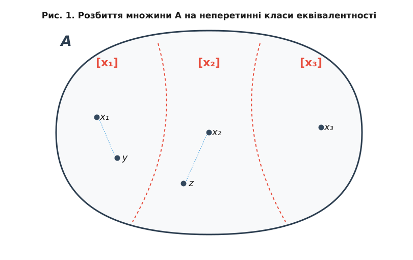

# Відношення еквівалентності та класи еквівалентності

<preknowlist>
- [Множини та їх операції](/math/logic-foundations/set-theory)
- [Бінарні відношення](/math/logic-foundations/binary-relations)
- [Логічні зв'язки та імплікація](/math/logic-foundations/truth-tables)
</preknowlist>

У повсякденному житті ми часто вважаємо різні об'єкти "однаковими" з певної точки зору. Наприклад, дві купюри по 100 гривень є різними фізичними об'єктами, але з точки зору купівельної спроможності вони абсолютно еквівалентні. Два слова "кіт" і "КІТ" складаються з різних символів (малі та великі літери), але мають однакове значення. У математиці концепція "однаковості з певної точки зору" формалізується через глибоке та універсальне поняття — **відношення еквівалентності**.

> 🔧 **Навіщо це.**
> Відношення еквівалентності дозволяють математикам абстрагуватися від несуттєвих деталей і зосередитися на ключових властивостях об'єктів. Замість того, щоб працювати з нескінченною множиною всіх можливих дробів (таких як 1/2, 2/4, 3/6), ми можемо згрупувати їх у класи еквівалентності і працювати з одним абстрактним об'єктом — раціональним числом. Це фундаментальний інструмент у всій вищій математиці (алгебра, топологія, геометрія), програмуванні (оптимізація, перевірка типів) та алгоритмах (структура Disjoint Set Union). Більше того, саме через відношення еквівалентності математика будує нові числові системи, переходячи від натуральних чисел до цілих, а від цілих — до раціональних та дійсних.

Відношення еквівалентності — це особливий тип бінарного відношення, що має три ключові властивості: кожний об'єкт еквівалентний сам собі, якщо перший еквівалентний другому, то й другий першому, і якщо перший еквівалентний другому, а другий третьому, то перший еквівалентний третьому. Звучить логічно і майже інтуїтивно зрозуміло, але за цією простотою ховається механізм створення цілих алгебраїчних всесвітів. Давайте розберемо це ґрунтовно і послідовно.

## Що таке бінарне відношення?

Перш ніж говорити про еквівалентність, згадаймо формальне визначення того, що таке бінарне відношення R на множині A. З точки зору теорії множин, бінарне відношення — це просто підмножина декартового добутку множини на саму себе:
R ⊆ A × A.

Якщо пара елементів (x, y) належить цій підмножині R (тобто (x, y) ∈ R), ми кажемо, що "x перебуває у відношенні R до y", і зазвичай записуємо це у зручнішій інфіксній формі:
x R y.

Бінарні відношення можуть описувати будь-що: "менше ніж" (<), "дорівнює" (=), "є підмножиною" (⊆), "поділяється на" тощо. Але відношення еквівалентності покликане моделювати саме поняття тотожності, а тому воно має відповідати жорстким правилам, які властиві звичайній рівності.

## Три стовпи еквівалентності

Щоб довільне бінарне відношення R (часто позначається символами ~, ≡ або ≃) стало **відношенням еквівалентності**, воно повинно задовольняти три фундаментальні аксіоми. Нехай R — відношення на множині A.

### 1. Рефлексивність (Reflexivity)

Будь-який об'єкт має бути еквівалентним самому собі. Це базовий принцип тотожності: ніщо не може бути відмінним від самого себе.

Формальний логічний запис:
∀ x ∈ A : x R x

Приклад: Відношення "дорівнює" (=) на множині дійсних чисел є рефлексивним, бо для будь-якого числа x завжди виконується x = x. Відношення "бути паралельним" на множині всіх прямих на площині є рефлексивним (кожна пряма паралельна сама собі). А от відношення "бути суворо більшим за" (>) не є рефлексивним, адже жодне число не може бути більшим за самого себе (нерівність 5 > 5 хибна).

### 2. Симетричність (Symmetry)

Якщо об'єкт x еквівалентний об'єкту y, то y також має обов'язково бути еквівалентним x. Порядок елементів у відношенні еквівалентності не має жодного значення; зв'язок є двостороннім.

Формальний логічний запис:
∀ x, y ∈ A : x R y ⇒ y R x

Приклад: Якщо Анна одного віку з Богданом, то Богдан стовідсотково одного віку з Анною. Це відношення симетричне. Натомість, відношення "бути батьком" не є симетричним: якщо Петро — батько Олени (x R y), це не означає, що Олена — батько Петра (y R x). Відношення подільності на множині натуральних чисел теж не симетричне (2 ділить 4, але 4 не ділить 2).

### 3. Транзитивність (Transitivity)

Ця властивість забезпечує розповсюдження еквівалентності ланцюжком. Якщо об'єкт x еквівалентний об'єкту y, а об'єкт y, у свою чергу, еквівалентний об'єкту z, то x має бути безпосередньо еквівалентним z. "Друг мого друга — мій друг" (у сенсі повної тотожності).

Формальний логічний запис:
∀ x, y, z ∈ A : (x R y ∧ y R z) ⇒ x R z

Приклад: Якщо олівець A тієї ж довжини, що й олівець B, а олівець B тієї ж довжини, що й олівець C, то ми з абсолютною впевненістю можемо стверджувати, що олівець A такої ж довжини, як і C.

> **Визначення.** Бінарне відношення R на непорожній множині A називається **відношенням еквівалентності**, якщо воно одночасно є рефлексивним, симетричним та транзитивним.

У математичних текстах для позначення такого відношення майже завжди використовують символ ≡, або ~. Запис x ≡ y читається як "x еквівалентно y".

### Розбір тонких моментів: Чи можна вивести рефлексивність з інших аксіом?

Іноді студенти намагаються довести, що рефлексивність можна логічно вивести із симетричності та транзитивності. Аргументація зазвичай така:
"Нехай x R y. Тоді за симетричністю y R x. Тепер застосуємо транзитивність до x R y та y R x, і отримаємо x R x. Отже, відношення рефлексивне автоматично!"

У чому тут помилка? Помилка полягає у припущенні, що для *кожного* x ∈ A обов'язково існує хоча б один такий y, що x R y. Якщо елемент x взагалі ні з чим не перебуває у відношенні (навіть із самим собою), то ми не зможемо зробити перший крок у цьому "доведенні".
Наприклад, розглянемо множину A = {1, 2, 3} і порожнє відношення R = ∅ (жоден елемент не пов'язаний з іншим). Порожнє відношення є симетричним (адже посилка x R y завжди хибна, отже імплікація x R y ⇒ y R x є істинною за правилами логіки) і транзитивним. Але воно явно не є рефлексивним, бо 1 не перебуває у відношенні з 1. Тому всі три аксіоми є незалежними і необхідними.

## Класи еквівалентності

Коли ми задаємо відношення еквівалентності на множині, воно діє як ідеальний сортувальник або класифікатор: воно групує всі "однакові" (тобто еквівалентні між собою) елементи у відокремлені "мішки". Такий "мішок" називається **класом еквівалентності**.

Для будь-якого елемента x ∈ A його клас еквівалентності позначається [x] (або іноді x̅) і визначається як множина всіх елементів з A, які еквівалентні x.

Формально за допомогою нотації теорії множин:
[x] = { y ∈ A | y ≡ x }

Елемент x називається **представником** класу [x]. Оскільки відношення еквівалентності симетричне і транзитивне, абсолютно будь-який елемент з цього класу може виступати його представником. Це означає, що якщо y ∈ [x], то [y] = [x]. Всі елементи всередині одного класу абсолютно "рівноправні". Кожен з них може служити ідентифікатором усього класу.

### Приклад: Остачі від ділення (Модульна арифметика)

Візьмемо множину всіх цілих чисел ℤ. Введемо відношення: ціле число x еквівалентне числу y, якщо їх різниця ділиться на 3. Еквівалентним формулюванням є: вони дають однакову остачу при діленні на 3. Це записується як:
x ≡ y (mod 3)

Перевіримо аксіоми:
- **Рефлексивність**: x - x = 0, а 0 ділиться на 3. (Або: число дає таку ж остачу, як і воно саме). Виконується.
- **Симетричність**: Якщо x - y ділиться на 3, то і -(x - y) = y - x ділиться на 3. Виконується.
- **Транзитивність**: Якщо (x - y) ділиться на 3, і (y - z) ділиться на 3, то їхня сума (x - y) + (y - z) = x - z також ділиться на 3. Виконується.
Отже, це повноцінне відношення еквівалентності.

Які будуть класи еквівалентності?
Їх всього три, і вони містять усі можливі нескінченні цілі числа:
[0] = { ..., -6, -3, 0, 3, 6, 9, ... } — числа, що діляться на 3 без остачі.
[1] = { ..., -5, -2, 1, 4, 7, 10, ... } — числа з остачею 1.
[2] = { ..., -4, -1, 2, 5, 8, 11, ... } — числа з остачею 2.

Зверніть увагу: клас [4] — це той самий клас, що й [1]. Їхні множини повністю збігаються, бо 4 ∈ [1], а отже [4] = [1].

### Геометричний приклад: Подібність трикутників

У геометрії відношення "бути подібним до" на множині всіх можливих трикутників є відношенням еквівалентності.
Два трикутники T₁ та T₂ подібні (T₁ ~ T₂), якщо їх відповідні кути рівні, а сторони пропорційні.
Клас еквівалентності [T] містить усі трикутники, які мають таку саму форму, як і T, незалежно від їхнього розміру, розташування чи обертання. Фактично, клас еквівалентності тут ідентифікує чисту "форму" трикутника, абстрагуючись від його масштабу.

## Теорема про розбиття множини (Основна теорема про відношення еквівалентності)

Найважливіша, найфундаментальніша властивість відношень еквівалентності виражається в одній елегантній теоремі, яка пов'язує їх з концепцією розбиття множини. Спочатку з'ясуємо, що таке розбиття в математичному сенсі.

**Розбиття** множини A — це набір непорожніх підмножин множини A, таких що:
1. Будь-які дві різні підмножини з цього набору не перетинаються (їх перетин є порожньою множиною).
2. Об'єднання всіх цих підмножин дає всю початкову множину A.

Уявіть, що ви розрізаєте пиріг на шматки. Кожен шматочок — це підмножина. Ніякі два шматочки не накладаються один на одного (не перетинаються), і разом вони складають цілий пиріг (об'єднання дорівнює всій множині). Жодна крихта не може належати двом шматкам одночасно, і жодна крихта не залишається неврахованою.

> **Теорема про розбиття (Фундаментальна теорема про еквівалентність).** 
> 1. Будь-яке відношення еквівалентності на множині A розбиває цю множину на неперетинні класи еквівалентності.
> 2. І навпаки, будь-яке розбиття множини A автоматично визначає на ній унікальне відношення еквівалентності (де два елементи вважаються еквівалентними тоді і тільки тоді, коли вони належать до однієї й тієї ж підмножини розбиття).

Ця теорема встановлює надзвичайно глибокий і красивий зв'язок: відношення еквівалентності і розбиття множини — це буквально дві сторони однієї медалі. Задати еквівалентність — це те саме, що розрізати множину на класифікаційні шматки, і навпаки.

Доведення першої (і головної) частини цього факту напрочуд просте і спирається безпосередньо на три аксіоми еквівалентності:
1. Завдяки **рефлексивності** (x ≡ x), кожен елемент x ∈ A гарантовано потрапляє принаймні у свій власний клас [x]. Тому жоден елемент не залишиться "за бортом", і об'єднання всіх класів точно покриває всю множину A.
2. Тепер припустимо, що два класи [x] і [y] перетинаються, тобто вони мають хоча б один спільний елемент z.
   Це означає, що z ∈ [x] (отже, z ≡ x) і z ∈ [y] (отже, z ≡ y). 
   Завдяки **симетричності**, якщо z ≡ x, то x ≡ z. 
   Тепер ми маємо ланцюжок: x ≡ z і z ≡ y. 
   Завдяки **транзитивності**, з x ≡ z та z ≡ y випливає, що x ≡ y.
   А якщо x ≡ y, то будь-який елемент, який еквівалентний x, буде еквівалентний і y. Отже, класи [x] і [y] містять абсолютно однакові елементи, тобто [x] = [y].
Висновок: два класи еквівалентності або повністю не перетинаються (якщо x не еквівалентно y), або збігаються до останнього елемента (якщо x ≡ y). Часткового перетину бути не може!

## [Фактор-множини](topic:math/quotient-sets)а: Створення нових математичних світів

Множина всіх можливих класів еквівалентності множини A за відношенням R називається **[Фактор-множини](topic:math/quotient-sets)ою** (або множиною часток, англ. quotient set) і позначається як:
A / R

Цей запис читається як "A за модулем R" або "[Фактор-множини](topic:math/quotient-sets)а A по R". 

Кожен елемент [Фактор-множини](topic:math/quotient-sets) — це не окреме число чи об'єкт з A, а цілий *клас еквівалентності* (цілий "мішок"). Перехід від A до A / R — це процес абстрагування, коли ми змушуємо математику "забути" відмінності між елементами одного класу, зливаючи їх в один єдиний супер-об'єкт.

Повернемося до нашого прикладу з остачами від ділення на 3. 
Множина всіх цілих чисел — це ℤ. Відношення еквівалентності за модулем 3 позначимо як ≡₃.
Тоді [Фактор-множини](topic:math/quotient-sets)а ℤ / ≡₃ складається лише з трьох елементів (трьох величезних, нескінченних мішків):
ℤ / ≡₃ = { [0], [1], [2] }.

Ми феноменальним чином згорнули нескінченну множину чисел у дуже компактну, скінченну множину з 3 об'єктів! З цією новою [Фактор-множини](topic:math/quotient-sets)ою ми можемо робити алгебраїчні операції, наприклад, додавати або множити самі класи. Ця концепція утворює основу сучасної алгебри і криптографії, дозволяючи будувати циклічні групи, фактор-кільця та скінченні поля (наприклад, поле Галуа GF(p)).

### Конструювання раціональних чисел

[Фактор-множини](topic:math/quotient-sets) — це не просто зручна нотація. Це інструмент, за допомогою якого математики фізично (логічно) "створюють" нові види чисел.
Ви коли-небудь замислювалися, що насправді таке дріб 1/2? Чому 1/2 і 2/4 — це одне і те ж число, хоча числа 1, 2 і 2, 4 різні?

У строгій математиці множина раціональних чисел (дробів) ℚ конструюється саме через класи еквівалентності!
Береться множина всіх можливих пар цілих чисел (p, q), де q не дорівнює нулю. Тобто множина A = ℤ × (ℤ \ {0}).
На цій множині пар задається специфічне відношення еквівалентності:
Пара (p, q) еквівалентна парі (r, s), якщо p * s = q * r.

(Це формалізує наше шкільне правило: p/q = r/s тоді і тільки тоді, коли ps = qr).

Далі застосовується теорема про розбиття: це відношення розбиває всі пари чисел на неперетинні класи. Наприклад, пари (1, 2), (2, 4), (5, 10), (-3, -6) потрапляють в один гігантський мішок.
І саме цей **клас еквівалентності (мішок)** і називається раціональним числом! 
Раціональне число "одна друга" — це не просто пара (1, 2). Це нескінченна множина всіх пар вигляду (k, 2k). Завдяки відношенню еквівалентності, математика змогла створити раціональні числа зі звичайних цілих. 

Точно такий самий механізм використовується для побудови цілих чисел з натуральних (через еквівалентність пар, що представляють різницю), та дійсних чисел з раціональних (класи еквівалентності фундаментальних послідовностей Коші).

## Інваріанти класів еквівалентності

Часто виникає задача: як визначити, чи належать два елементи до одного класу еквівалентності, не генеруючи всі класи? Для цього використовують поняття інваріанта.

**Інваріант** — це певна властивість або функція f(x), яка має однакове значення для всіх елементів одного класу еквівалентності, і різні значення для елементів різних класів.
Якщо x ≡ y ⇔ f(x) = f(y), то функція f(x) є повним інваріантом.

У нашому прикладі з цілими числами за модулем 3, функція f(x) = x mod 3 (остача від ділення) є повним інваріантом. Щоб дізнатися, чи еквівалентні 100 і 25, нам не треба виписувати нескінченні мішки. Достатньо обчислити їхні інваріанти:
f(100) = 100 mod 3 = 1
f(25) = 25 mod 3 = 1
Оскільки інваріанти збігаються, вони лежать в одному класі.

Пошук повних інваріантів для складних відношень еквівалентності (наприклад, топологічної еквівалентності фігур або ізоморфізму графів) є однією з найважливіших і найскладніших задач сучасної математики.

## Висновок

Відношення еквівалентності — це потужний інструмент абстракції. Воно дозволяє нам дивитися на складні, хаотичні або нескінченні множини через призму того, що нас цікавить, повністю ігноруючи решту. Воно формалізує поняття "однаковості", створюючи класи еквівалентності і перетворюючи вихідну множину на нову абстрактну конструкцію ([Фактор-множини](topic:math/quotient-sets)у). Без цього інструменту неможливо було б ні розширювати числові системи, ні оптимізувати автомати, ні розуміти глибинні симетрії простору. Розуміння цієї концепції є абсолютно критичним кроком для опанування того, як абстрактна математика будує нові об'єкти з уже існуючих.
