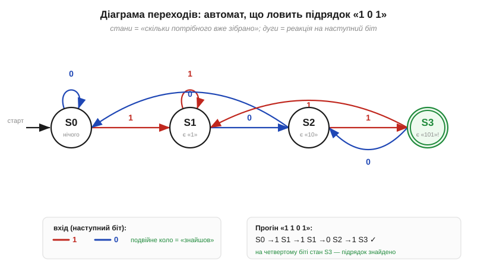
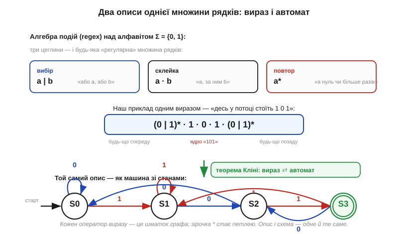
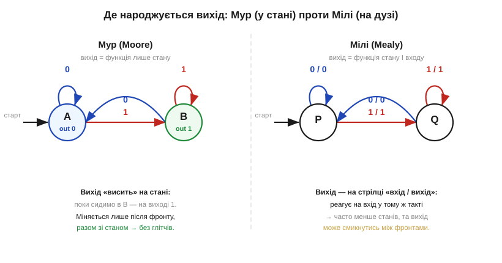

# 📜 Звідки взялися автомати: від нейрона-ідеалізації до пошуку рядків

> Перш ніж розкласти формалізм скінченних автоматів по поличках, варто побачити, **звідки** він узявся: ідея «машини зі станами» народилася не в інженерів, що паяли тригери, а на стику нейрофізіології, чистої математики й логіки — і лише згодом повернулася в залізо й код. Дорога вийшла гарна, з кількома справді яскравими постатями; вона ще й пояснює назви, що міцно засіли в обігу (автомат, регулярний вираз, машини Мура й Мілі).

### Нерви як логіка: ідеалізація Мак-Каллока й Піттса

Усе почалося далеко від цифрової техніки. У 1943 році нейрофізіолог **Воррен Мак-Каллок** (*Warren McCulloch*) і юний математик-самоук **Волтер Піттс** (*Walter Pitts*) опублікували працю, у якій спробували відповісти на питання, що бентежило не одне покоління: **як мережа нейронів може щось «обчислювати»?** Їхній хід був сміливим спрощенням — вони замінили живий нейрон гранично ідеалізованою цеглинкою: вона має поріг, підсумовує входи й видає 0 або 1. Жодної біохімії, сама логіка.

Цінність цього кроку — не в правдоподібності моделі нерва (вона дуже груба), а в тому, що з'явилося. Виявилося, що мережа таких «нейронів» зі зворотними зв'язками поводиться як **система зі скінченним числом станів**: вона пам'ятає не всю історію входів, а лише те, у якому з кількох внутрішніх станів зараз перебуває. Саме ця думка — «пам'ять = скінченний набір станів» — і є зерном усієї теорії автоматів. Цікаво, що Піттс прийшов до неї без формальної освіти: підлітком він самотужки опанував логіку за «Principia Mathematica» Рассела й Вайтгеда (а за легендою, що часто переказують, навіть написав Расселові про знайдені огріхи — деталь радше анекдотична, *(перевірити)*). Постать трагічна — більшу частину пізнього доробку він під кінець життя знищив, — але саме з його та Мак-Каллокової ідеалізації виросла ціла дисципліна.

### Кліні дає імена: «регулярні події» та зірочка

Модель нерва була цікавою, та лишалося питання математика: а **що саме** така мережа здатна розпізнавати — який клас «візерунків» у потоці входів вона ловить, а який ні? Відповідь дав один з найвпливовіших логіків XX століття — **Стівен Кліні** (*Stephen Cole Kleene*). У меморандумі корпорації RAND 1951 року (широко опублікованому 1956-го у збірнику «Automata Studies» за редакцією Шеннона й Маккарті) він довів те, що сьогодні звуть **теоремою Кліні**: множини рядків, які розпізнає скінченний автомат, — це **рівно** ті множини, які можна записати особливим алгебричним виразом із трьох операцій (вибір, склейка, повтор). Ці множини він назвав **регулярними подіями** (*regular events*), а вирази — **регулярними виразами** (*regular expressions*). Звідси й знайома програмістам **зірочка Кліні** (*Kleene star*) — позначка «повторити нуль чи більше разів».

Варто наголосити на колективності цього відкриття, бо назва «теорема Кліні» легко створює враження одинака. Кліні спирався прямо на Мак-Каллока й Піттса (його стаття так і зветься — про події в нервових сітках і скінченних автоматах), а паралельно над спорідненими ідеями автоматів працювали **Джон фон Нейман**, **Клод Шеннон** і молодий **Джон Маккарті** — той самий, що згодом дасть світові слово «штучний інтелект». Це була радше спільна хвиля кінця 1940-х — початку 1950-х, аніж осяяння однієї людини.

### Мур і Мілі: автомат, що ще й відповідає

Доти автомат лише «розпізнавав» — наприкінці казав «так» чи «ні». Але інженерам зв'язку потрібна була машина, що на кожному кроці **видає вихід**, а не лише мовчки міняє стан. Двоє дослідників з **Bell Labs** незалежно й майже одночасно дали дві відповіді, що й донині звуться їхніми іменами. **Джордж Мілі** (*George H. Mealy*) у 1955 році описав автомат, у якому вихід залежить **і від стану, і від поточного входу**. **Едвард Мур** (*Edward F. Moore*) у 1956-му — автомат, у якому вихід визначається **лише станом**. Обидві моделі еквівалентні за можливостями (одну завжди можна перебудувати в іншу), але дають різний інженерний компроміс — між чистотою виходу й компактністю машини.

Прізвища тут варто вимовляти точно, бо в текстах вони часто зливаються в безлике «Мур-Мілі автомати». Мур, до речі, відомий і поза автоматами — як автор елегантного мисленнєвого експерименту про те, чи можна, не відчиняючи «чорної скриньки», дізнатися її внутрішній стан лише з входів і виходів (це й досі класична задача про спостережуваність).

### Рабін і Скотт: недетермінізм і Тюрингова премія

Лишалася технічна, але глибока загадка. Будувати автомат, де з кожного стану по кожному входу веде **рівно одна** стрілка (детермінований), часом громіздко; куди зручніше дозволити **кілька** стрілок одразу — хай машина «вгадує» правильний шлях. Чи не стає така **недетермінована** машина потужнішою? У 1959 році **Майкл Рабін** (*Michael Rabin*) і **Дана Скотт** (*Dana Scott*) довели чудовий результат: ні, **не стає** — будь-який недетермінований скінченний автомат можна перетворити на звичайний детермінований, що розпізнає ту саму множину (хоч і ціною більшого числа станів). За ці та подальші роботи з основ обчислень обидва 1976 року здобули **премію Тюринга** — найвищу нагороду в інформатиці.

Цей результат — не педантизм, а саме те, що робить регулярні вирази практичними: ви пишете **зручний** недетермінований опис, а машина мовчки перетворює його на **швидкий** детермінований автомат, який виконується за один прохід по тексту.

### Кен Томпсон приносить це в код

І останній місток — від теорії до інструмента, яким сьогодні щодня користуються мільйони. У 1968 році **Кен Томпсон** (*Ken Thompson*) — згодом один із батьків Unix і мови C — описав, як **механічно** перетворити регулярний вираз на автомат і прогнати ним текст, шукаючи збіги. Так теорема Кліні з абстракції стала кодом: саме томпсонівська побудова лежить в основі команди пошуку `grep` і всіх «регексів», що з них виросла ціла культура обробки тексту. Коло замкнулося: ідеалізований нейрон 1943 року через алгебру Кліні, машини Мура й Мілі та теорему Рабіна-Скотта перетворився на робочий інструмент у руках програміста.

Тримаючи в голові цю дорогу, до самого формалізму вже стаєш інакше: він читається не як суха аксіоматика, а як акуратний запис ідей, що їх вистраждали ці люди.

---

# 🧮 Формалізм скінченних автоматів: стани, входи, діаграми переходів

> Машину зі станами можна збудувати [просто зі схеми](book:electronics/finite-state-machines) — з регістра стану й комбінаційної логіки переходів. Тут підкладемо під неї точний **математичний** опис: що таке стан, вхід і перехід **строго**, як намалювати автомат **діаграмою**, і чому той самий об'єкт уміють описувати **регулярним виразом**. Жодного заліза — лише мова, якою про автомати говорять, і яка робить їх передбачуваними.

### Означення: автомат — це п'ятірка ⟨стани, алфавіт, переходи, старт, прийом⟩

Інтуїтивно **скінченний автомат** (*finite-state machine*, FSM) — це машина, що завжди перебуває в **одному** з кількох наперед відомих **станів** і стрибає між ними, читаючи входи по одному. Формально його задають **п'ятіркою** (*5-tuple*):

```
M = ⟨ Q, Σ, δ, q₀, F ⟩

Q  — скінченна множина станів        (напр. {S0, S1, S2, S3})
Σ  — алфавіт входів  (Sigma)         (напр. {0, 1})
δ  — функція переходів  (delta)      δ: Q × Σ → Q
q₀ — початковий стан,  q₀ ∈ Q        (де машина прокидається)
F  — множина приймальних станів, F ⊆ Q
```

Ціла суть — у функції переходів **δ**. Вона бере пару «де ми зараз і що прочитали» й однозначно каже, **куди перейти**: δ(стан, вхід) = новий стан. Усе інше — обрамлення: Q перелічує можливі стани, Σ — припустимі символи входу, q₀ задає старт, а F позначає стани-«успіхи» (наприклад, «візерунок щойно знайдено»). Коли δ для кожної пари дає рівно одне значення, автомат **детермінований** (*DFA*): з будь-якого стану по будь-якому входу веде єдиний шлях. Це прямо відповідає [апаратному втіленню автомата](book:electronics/finite-state-machines) — регістр тримає поточний стан із Q, а комбінаційна логіка обчислює δ до наступного фронту.

### Інтуїція: стан — це «стиснута пам'ять» про минуле

Чому скінченних станів **вистачає**, адже вхідний потік буває як завгодно довгим? Ключ ось у чому: автомат **не пам'ятає всю історію** входів — він пам'ятає лише те, що знадобиться **далі**, спресувавши минуле в один зі скінченного числа станів. Це найважливіша думка всієї теми, і її добре видно на класичній задачі — **детекторі підрядка**: машина читає потік бітів і має «спрацювати», коли побачить послідовність `1 0 1`.


*Рис. **Діаграма переходів** (*state diagram*) детектора «101». Кружки — стани, і кожен кодує **єдине, що варто пам'ятати**: скільки початку візерунка вже зібрано. S0 — «нічого», S1 — «бачив 1», S2 — «бачив 10», S3 — «знайшов 101» (подвійне коло — приймальний стан, F = {S3}). Стрілки — це δ: на кожній підписано вхід (червона — «1», синя — «0»). Зверніть увагу на **відкати**: з S2 по «0» (вийшло «100») автомат падає аж у S0, а з S3 по «1» — у S1, бо хвіст «…1» знову може початися візерунком. Знизу — прогін «1 1 0 1»: на останньому біті ми в S3. Машині досить чотирьох станів, а не цілого рядка.*

Перебуваючи в S2, машина вже **забула**, що саме йшло перед `10`: для майбутнього це байдуже — важить лише хвіст `10`, і досить однієї `1`, щоб виграти. Уся попередня різноманітність входів стиснулася в один факт «я в S2». Ось чому **скінченної** пам'яти вистачає для **нескінченної** множини рядків: автомат тримає не рядок, а його доречний «залишок».

### Апарат: таблиця переходів — це та сама δ числом

Діаграма гарна для ока, та машині (і нам, коли час будувати схему чи код) потрібна δ у вигляді **таблиці**. **Таблиця переходів** (*state-transition table*) — це просто δ, виписана рядок-на-стан, стовпець-на-вхід; на перетині — наступний стан.

```
        вхід=0   вхід=1
S0  →     S0       S1
S1  →     S2       S1
S2  →     S0       S3
S3  →     S2       S1      (S3 ∈ F — тут «спрацювало»)
```

Це повний, однозначний опис автомата — діаграма й таблиця несуть **те саме**, лише в різній формі. Саме таблицю прямо втілюють у залізі (ПЗП «стан+вхід → стан») і в коді (масив переходів), тож для інженера вона часто практичніша за малюнок. Від таблиці прямий шлях до [апаратного автомата](book:electronics/finite-state-machines): **комбінаційна логіка** обчислює δ, а **регістр** зберігає стан — формалізм і схема стуляються один в один.

### Зв'язок із regex: вираз і автомат описують ту саму множину

А тепер найкрасивіше — місток до того, що багато хто знає як «регулярні вирази». Множину рядків, що їх автомат **приймає** (приводить у стан із F), можна задати не лише машиною, а й коротким **виразом** із трьох операцій над алфавітом: **вибір** (`a|b` — «a або b»), **склейка** (`a·b` — «a, за ним b`) і **повтор Кліні** (`a*` — «a нуль чи більше разів»). Наш детектор «101» — це «будь-що, потім `101`, потім будь-що».


*Рис. **Одна множина рядків — два описи.** Угорі — алгебра: три цеглини (вибір, склейка, повтор) і наш приклад одним виразом `(0|1)*·1·0·1·(0|1)*` — «десь у потоці стоїть 101». Унизу — **той самий** опис як машина зі станами (та сама діаграма, у компактному вигляді). Стрілка між ними — **теорема Кліні**: вираз і автомат описують одне й те саме. Кожен оператор виразу відповідає шматкові графа: склейка `·` ниже стани в ланцюг, вибір `|` розгалужує, а зірочка `*` стає **петлею**.*

Цю двоїстість варто прочути по-справжньому: **регулярний вираз і скінченний автомат — це дві мови про той самий об'єкт**, як креслення та формула однієї деталі. Вираз зручно **писати** людині; автомат зручно **виконувати** машині (один прохід по входу, на кожен символ — один перехід). Перетворення «вираз → автомат» механічне — тому пошук за регексом такий швидкий. На **якісному** рівні досить бачити головне: формальний апарат автомата й знайомий regex — одне й те саме з двох боків.

### Де це працює

Цей формалізм — не теорія заради теорії, а пряма опора практики.

- **Автомат зі схеми.** [У залізі](book:electronics/finite-state-machines) регістр стану зберігає поточний елемент Q; комбінаційна логіка обчислює δ; вибір **Мура чи Мілі** — це вибір, чи приписати вихід **станові**, чи **переходу**. П'ятірка ⟨Q, Σ, δ, q₀, F⟩ — це і є контракт, який схема втілює.
- **Лічильник як окремий випадок.** [Лічильник](book:electronics/counters) — це автомат, де Q = {0…2ᴺ−1}, а δ завжди те саме: «наступне число». Дуже спеціальний автомат, та все ж автомат.
- **Розбір протоколів і команд.** Усе, що читає вхід **по символу** й реагує станом, — від декодера інструкцій до парсера кадру UART — це скінченний автомат; формалізм дає мову описати його без двозначностей.


*Рис. Той самий формалізм, два способи приписати **вихід** — і це є відмінність автоматів Мура й Мілі. **Мур** (ліворуч): вихід — функція **лише стану**, тож його малюють **усередині кружка** (A видає 0, B видає 1); він міняється тільки разом зі станом, після фронту, — тому чистий, без глітчів. **Мілі** (праворуч): вихід — функція **стану й входу**, тож його підписують **на стрілці** як «вхід / вихід»; Мілі реагує в тому ж такті й часто обходиться меншим числом станів, та вихід може смикнутися між фронтами. Обирають за тим, що важливіше: чистота виходу (Мур) чи компактність (Мілі).*

Підсумуймо коротко. Скінченний автомат строго задають **п'ятіркою** ⟨Q, Σ, δ, q₀, F⟩, де серце — функція переходів **δ: стан × вхід → стан**; її однаково несуть **діаграма** (для ока) і **таблиця переходів** (для схеми й коду). Головна ідея — стан як **стиснута пам'ять** про минуле: машині досить скінченного числа станів, бо вона тримає не всю історію, а лише доречний її залишок. Той самий об'єкт описує **регулярний вираз** (вибір, склейка, зірочка Кліні) — і це не випадковість, а теорема Кліні. А вибір **Мура чи Мілі** — лише питання, де приписати вихід: станові чи переходу. Маючи цю мову, [автомат зі схеми](book:electronics/finite-state-machines) будують без жодної двозначності.
