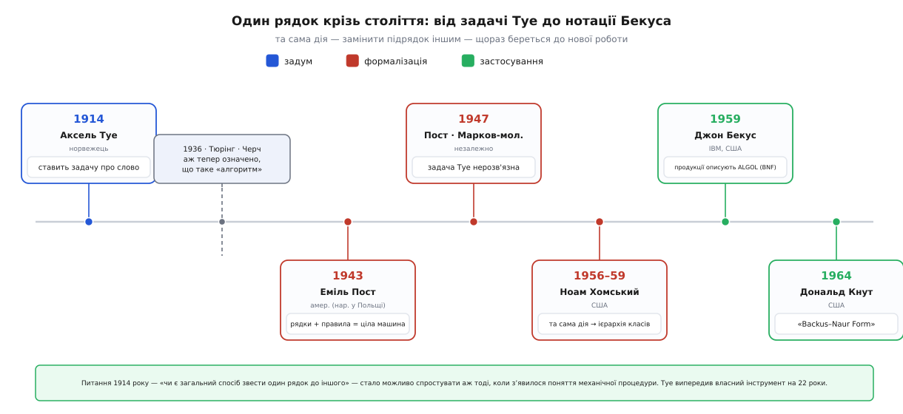

# 📜 Переписати рядок: від задачі Туе до нотації Бекуса

1914 рік. Комп'ютерів немає — немає навіть слова, яким їх колись назвуть. Немає й поняття «алгоритм»: думка, що процедуру обчислення можна означити точно, з'явиться аж за двадцять із гаком років. І от у Крістіанії (так тоді звався Осло) норвезький математик Аксель Туе (нор. *Axel Thue*, 1863–1922) друкує працю з дивним питанням. Дано жменьку правил, кожне з яких дозволяє замінити один короткий шматок рядка іншим. Чи можна **завжди** сказати, чи перетворюється один рядок на другий скінченним ланцюжком таких замін?

Питання виглядає як дитяча гра в перестановку літер. Але за грою ховається найтвердіший різновид запитання, який лишень буває: чи існує **механічна процедура**, що на будь-який вхід за скінченний час дає правильну відповідь? Туе не міг сформулювати його навіть так — слів «механічна процедура» ще не існувало. Він питав про те, чого його доба не вміла висловити.

Ця вставка простежує одну-єдину дію — **замінити підрядок іншим підрядком** — крізь півстоліття, за яке вона встигла побути математичною цікавинкою, основою всього обчислення і врешті інструментом, що працює в кожному компіляторі.


*Одна дія — заміна підрядка — крізь три доби: синє — задум (Туе), червоне — формалізація (Пост, Марков, Хомський), зелене — застосування (Бекус, Кнут). Проміжок 1914→1936 не порожній випадково: питання Туе про «механічну процедуру» неможливо було навіть точно поставити, доки Тюрінг і Черч не означили, що таке процедура.*

## Аксель Туе: питання, що випередило машини

Туе був фахівцем із теорії чисел і комбінаторики — людиною, яку тішили самі візерунки в послідовностях символів, без огляду на те, чи є з них ужиток. У праці 1914 року «Probleme über Veränderungen von Zeichenreihen nach gegebenen Regeln» («Задачі про зміну рядів знаків за заданими правилами») він поставив те, що згодом назвуть **задачею про слово** (англ. *word problem*).

Влаштована вона так. Береться алфавіт і скінченний список правил, кожне з яких каже: «де завгодно в рядку шматок *u* можна замінити на шматок *v*, і навпаки». Два рядки вважаються **рівними**, якщо один переходить у другий скінченним ланцюжком таких замін. Питання: чи є загальний спосіб — на будь-який список правил і будь-яку пару рядків — вирішити, рівні вони чи ні?

```
Правила:   ab ↔ ba          (сусідні «a» і «b» вільно міняються місцями)

aabb  →  a[ab]b  →  a[ba]b  =  abab      рівні: переставили середні a і b
```

На цьому лагідному списку відповідь легка: два слова рівні тоді й лише тоді, коли в них однаково a та однаково b. Але Туе питав не про конкретний список, а про **всі мислимі**. А там доброзичливість зникає: правила можуть плодити один одного, ланцюжок замін — вихлятися й видовжуватися, і жоден очевидний спосіб не проглядається. Туе довів розв'язність в окремих охайних випадках (коли переписування завжди завершується й не залежить від порядку кроків) і навіть намацав ідею, яку через півстоліття перевідкриють як алгоритм поповнення. Загальний випадок він лишив відкритим.

І не міг не лишити. Питання «чи існує загальний спосіб» безмовно припускає, що ми знаємо, **що таке спосіб**. А точного означення механічної процедури 1914 року не існувало. Воно з'явиться лише 1936-го, коли Алан Тюрінг і Алонзо Черч, кожен своєю дорогою, [означать поняття алгоритму](book:math/church-turing-thesis) — і аж тоді питання Туе набуде сенсу, який можна довести чи спростувати. Туе випередив цей інструмент на двадцять два роки. Через це його статті довго лежали непрочитані, а результати перевідкривали математики, що й не чули про норвежця; його єдиний відомий аспірант Туральф Скулем (нор. *Thoralf Skolem*) сам згодом став класиком логіки. Систему переписування рядків досі звуть **системою Туе** на його честь — визнання, що прийшло з великим запізненням.

## Еміль Пост: рядки й правила — це вже ціла машина

Наступний крок зробив Еміль Леон Пост (*Emil Leon Post*, 1897–1954). Його часто помилково приписують до «російських» математиків через місце народження — а варто бути точним. Пост народився в Августові (тоді — Царство Польське у складі Російської імперії, нині Польща) у польсько-єврейській родині, що 1904 року переїхала до Нью-Йорка. Виріс, навчався й працював він у США; це **американський** логік, вихованець Колумбійського університету, професор Міського коледжу Нью-Йорка. У дитинстві він втратив ліву руку в вуличній пригоді, а мрію про астрономію проміняв на математику — і саме там зробив те, чого не зробив ніхто до нього.

1943 року в праці «Formal Reductions of the General Combinatorial Decision Problem» Пост означив **канонічні системи-продукції**. Влаштовані вони як гра переписування: є початкові рядки й скінченний набір **продукцій** — правил вигляду «взірець → на що замінити». Застосовуєш правила знову й знову, і множина всього, що можна виростити, і є мовою цієї системи. Мало того, Пост довів **теорему про нормальну форму**: хоч яку заплутану систему-продукцію візьми, її можна звести до однієї найпростішої форми, де кожне правило лише зчищає фіксований шматок спереду й дописує фіксований шматок ззаду:

```
g $  →  $ h
```

Це виглядає до безглуздого бідно. Але саме тут ховається удар. Такими системами можна змоделювати **будь-яку машину Тюрінга** — а отже, будь-яке обчислення взагалі. Проста заміна підрядків за скінченним списком правил не слабша за найпотужніший комп'ютер: вона [обчислювально універсальна](book:math/turing-machine). Ось чому «порожнє» означення формальної мови має зуби — маніпуляція самими лише ланцюжками значків це вже все, що вміє обчислення.

> 🔧 **Навіщо це.** Щоразу, коли ви пишете прохід «заміни цей взірець на той» — розкриття макросів, шаблонний рушій, цикл підстановок за регулярним виразом, переписування виразу в оптимізаторі — ви тримаєте в руках уламок універсальної машини. Звідси два практичні наслідки. По-перше, така заміна може зациклитися назавжди, і це не хиба реалізації, а невіддільна властивість: система переписування здатна робити те саме, що й програма, яка не спиняється. По-друге, є системи переписування, для яких питання «чи зведеться це до того» **нерозв'язне в принципі** — не «поки не написали», а неможливе. Той, хто плутає переписування рядків із безпечним пошуком-і-заміною, рано чи пізно на це наступить.

У Поста була ще й особиста драма, яку варто назвати чесно. Ще на початку 1920-х він приватно дійшов до результатів, дуже близьких до майбутньої [теореми Ґеделя про неповноту](book:math/godel-incompleteness) та тюрінгової нерозв'язності — за десяток років до їхніх авторів. Але недуга, що поверталася важкими нападами, і брак готового рукопису завадили опублікувати це вчасно. Тож теореми справедливо носять імена тих, хто їх **довів і надрукував**, — Ґеделя (1931) і Тюрінга (1936), — а не того, хто першим побачив. Пост описав своє випередження вже пізніше; сам той текст надрукували аж по його смерті. Історія настільки ж повчальна, наскільки й гірка: у науці лічиться доведене й оприлюднене, а не вгадане на самоті.

## 1947: задачу Туе доведено нерозв'язною

Ланцюг, що почався 1914 року, замкнувся 1947-го. У праці з відвертою назвою «Recursive Unsolvability of a Problem of Thue» Пост довів: **задача про слово для півгруп нерозв'язна**. Загального способу, про який питав Туе, не існує — і це тепер не здогад, а теорема. Довести її стало можливо рівно тому, що тим часом народилося поняття алгоритму: без нього не було б чого спростовувати. Питання чекало на власний інструмент тридцять три роки.

Півгрупа тут — просто множина рядків із дією склеювання, підпорядкована заданим правилам рівності; «нерозв'язна задача про слово» означає, що немає машини, яка на будь-які два рядки скаже, рівні вони в цій півгрупі чи ні. Спорідненість цього результату із [задачею зупинки](book:algorithms/halting-problem) не випадкова: обидва — про те, що деякі питання про символьні процеси не має відповіді жоден алгоритм.

Того самого 1947 року той самий результат незалежно здобув Андрій Марков-молодший (рос. *Андрей Андреевич Марков*, 1903–1979) — радянський математик, син Андрія Маркова-старшого, того самого, чиїм іменем звуть ланцюги. Тут імперської підміни немає: Марков справді був російським ученим, і його першість варто визнати нарівні з постовою. Цікавий перехрест інструментів: Марков сперся у своїй побудові на **постові нормальні системи**, а Пост у своїй — на **машини Тюрінга**. Двоє незалежних доведень однієї теореми, зіперті кожне на чужий формалізм, — рідкісний і красивий випадок того, як ідеї однієї доби вже сплелися в спільну тканину.

## Ноам Хомський: та сама дія стає драбиною

Дотепер переписування рядків жило в логіці й основах математики. У мовознавство його привів Ноам Хомський (*Noam Chomsky*). У праці «Three Models for the Description of Language» (вересень 1956) він порівняв три способи описати мову, а в «On Certain Formal Properties of Grammars» (1959) вибудував із них драбину. Його **породжувальні граматики** — це, з математичного боку, ті самі системи переписування Поста, тільки повернуті іншим боком: не «звести один рядок до іншого», а «виростити рядок із початкового значка правилами вигляду `ліворуч → праворуч`».

```
S  →  a S b            правило граматики
S  →  ε

S  ⇒  aSb  ⇒  aaSbb  ⇒  aabb           виросло слово aabb
```

Ця крихітна граматика породжує рівно слова aⁿbⁿ — стільки ж a, скільки b, у такому порядку. І вона показує, навіщо взагалі потрібна драбина: така мова [непосильна для скінченного автомата](book:math/finite-automata), бо лічити відкриті дужки він не вміє, зате під силу граматиці. Обмежуючи форму правил дедалі суворіше, Хомський вирізав класи мов — від найзагальніших до регулярних, — і ця [ієрархія Хомського](book:math/chomsky-hierarchy) досі є хребтом теорії [формальних граматик](book:math/formal-grammar).

Тут історія має незручний вузол, який чесна розповідь оминати не повинна. Математичний факт безсумнівний: граматики Хомського — це окремий випадок постових систем-продукцій. А от із визнанням складніше. За реконструкцією істориків науки — зокрема мовознавця Джефрі Пуллема (*Geoffrey K. Pullum*) та логіка Аласдера Уркварта (*Alasdair Urquhart*) — Хомський дізнався про системи-продукції не з першоджерела, а з підручника Пола Розенблума (*Paul Rosenbloom*) «The Elements of Mathematical Logic» (1950), який він і цитує у своїх працях 1956 року; саме Розенблум 1950-го першим і запропонував прикласти системи Поста до мови. Проте у знаменитих «Syntactic Structures» (1957) немає посилання ні на Розенблума, ні тим паче на Поста. Мовознавча література десятиліттями переповідала народження породжувальної граматики, майже не називаючи імені математика, чий апарат вона переспівала. Що це — недбалість цитування чи щось більше — питання, яке історики й досі обговорюють; безперечне лише те, що **апарат прийшов від Поста**, а його ім'я з розповіді тихо випало.

## Джон Бекус: продукції описують мову програмування

Остання ланка перенесла переписування рядків із теорії просто в інженерію. 1959 року на конференції ЮНЕСКО з обробки інформації в Парижі інженер IBM Джон Бекус (*John Backus*, 1924–2007) представив спосіб **точно записати синтаксис** проєктованої мови програмування — тієї, що стане ALGOL 58. Доти синтаксис описували плутаною прозою; Бекус запропонував «металінгвістичні формули» — правила вигляду «поняття визначається так-то через простіші поняття». Це був перший формальний опис синтаксису мови програмування, і побудований він точно на постовому задумі: за багатьма свідченнями нотація Бекуса спирається саме на канонічні системи Поста (хоча достеменно простежити, що́ саме Бекус читав, історія не дає).

Порівняйте чотири записи — і побачите одну дію в чотирьох убраннях:

```
Туе, 1914:       … a b …  →  … b a …            переписати рядок
Пост, 1943:      g $  →  $ h                     продукція (породжує)
Хомський, 1956:  S  →  a S b                      правило граматики
Бекус, 1959:     <вираз> ::= <вираз> + <доданок>  правило BNF
```

Усюди одне й те саме: ліворуч — взірець, праворуч — на що його замінити. Кожен, хто відкривав опис синтаксису будь-якої мови програмування, читав правнука задачі Туе.

Далі нотацію підхопив і розширив данець Петер Наур (*Peter Naur*), редактор звіту про ALGOL 60 (1960, редакція 1963); у тому звіті він і назвав її **Backus normal form** — «нормальною формою Бекуса». А 1964 року Дональд Кнут (*Donald Knuth*) надіслав до *Communications of the ACM* коротенького листа з двома доводами: по-перше, це технічно не «нормальна форма» в тому сенсі, що в нормальній формі Хомського (нормальна форма мала б означати єдиний правильний спосіб запису, а тут його немає); по-друге, до заслуги варто долучити й Наура. Він запропонував читати абревіатуру BNF як **Backus–Naur Form** — і назва прижилася. Дрібний, але промовистий контраст: тут, на очах у всіх, спільнота перейменувала апарат, щоб віддати належне **другому** внескові, — одразу по тому, як ім'я Поста з подібної історії безшумно зникло.

## Що переніс цей ланцюг

Одна дія — знайти підрядок і замінити його іншим — пройшла крізь півстоліття, щораз беручись до нової роботи. У Туе (1914) вона була чистою цікавинкою про візерунки в рядках. У Поста (1943) виявилося, що це вже все обчислення: рядки й правила рівносильні будь-якій машині. У Поста й Маркова (1947) з'ясувалося, що деякі питання про це переписування не має відповіді жоден алгоритм. У Хомського (1956–59) та сама дія розклала мови на драбину класів. У Бекуса (1959) вона стала повсякденним інструментом, яким описують синтаксис мов програмування.

Означення формальної мови, з якого все починалося, виглядає ображено бідним — скінченний алфавіт, скінченні ланцюжки, вибрана підмножина, жодного змісту. Ця історія й пояснює, чому бідність було варто виборювати. Погодитися бачити в рядку лише послідовність значків, викинути зміст — означало здобути об'єкт, про який раптом стало можливо доводити теореми: що переписування універсальне, що деякі задачі про нього нерозв'язні, що мови шикуються в класи. Задум → формалізація → застосування, з несподіванкою посередині: те, що здавалося дитячою грою в перестановку літер, було насправді прихованим обличчям усього, що вміє машина.
