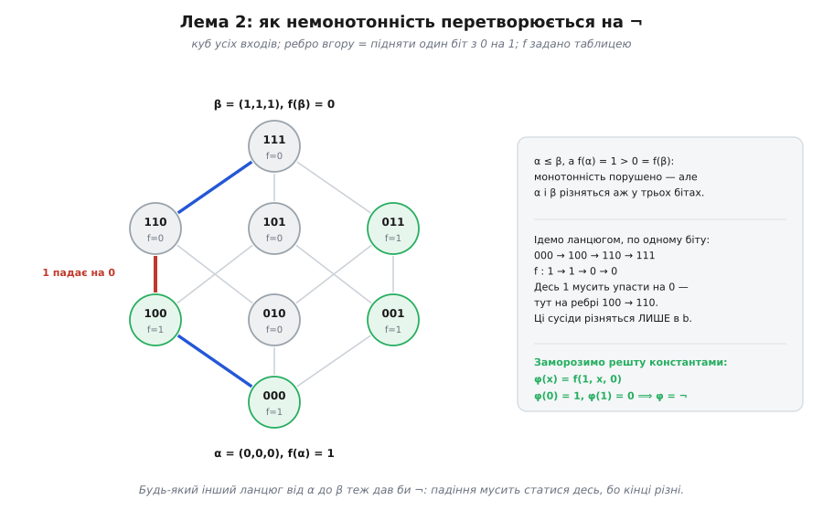
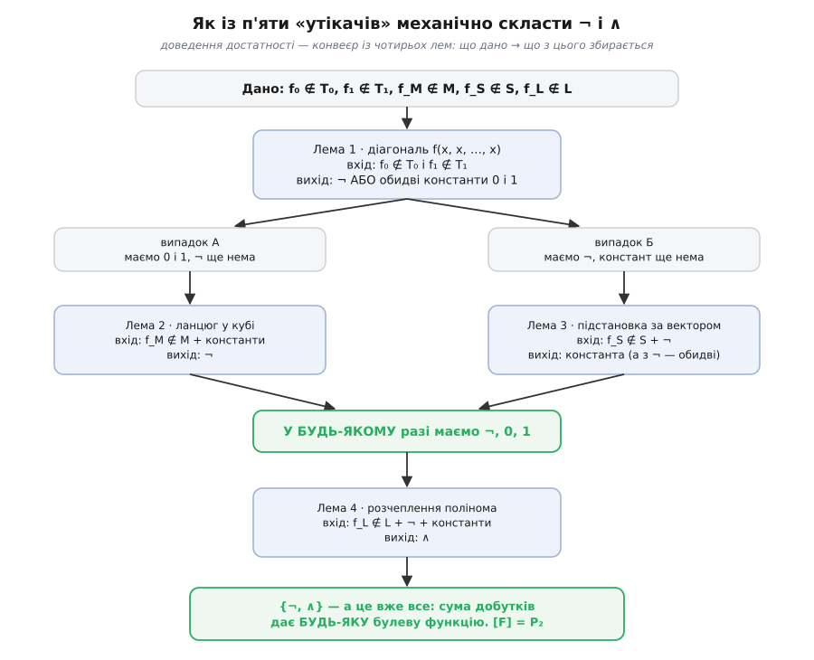

# 🧮 Критерій Поста: чому стін рівно п'ять і чому їх досить

П'ять перевірок — і присуд про нескінченність. Набір операцій породжує нескінченно багато формул: складай їх як завгодно довго, вкладай одну в одну скільки заманеться, повторюй входи. І от хтось каже: не треба нічого складати, зазирни у п'ять місць таблиці істинності — і знатимеш напевно, чи збудуєш із цього набору геть усе.

Такий обмін надто вигідний, щоб брати його на віру. Ба більше — у ньому сховано два зовсім різні твердження, і кожне вимагає свого доведення.

**Перше: стіна справді тримає.** Якщо всі функції набору монотонні, то нічого немонотонного з них не складеш — ніколи, жодною формулою. Звучить розважливо. Але формул нескінченно багато; звідки певність, що серед них немає хитрої, яка таки перелізе?

**Друге: стін рівно п'ять.** Хто пообіцяв, що немає шостої властивості, яку ми проґавили, — і набір, що бадьоро пройшов усі п'ять перевірок, застряг у ній?

Обидва твердження — теореми. Ось їхні доведення.

## Спершу — домовитися, що таке «виразити»

Кожне доведення неможливості починається з того, що ти точно окреслюєш, **чого саме** не можна зробити. Поки «виразити» означає «якось скласти», доводити нема чого: на «якось» аргументу не збудуєш.

Позначмо через **P₂** усі булеві функції — геть усі, від будь-якого числа входів. (Константи 0 і 1 зручно вважати теж функціями: просто такими, що не дивляться на свої входи. Тоді ніяких окремих випадків не виникає.)

Нехай F ⊆ P₂ — наш набір. **Формула над F** означається рекурсивно, двома правилами:

```
1)  кожна змінна x — це формула;
2)  якщо f ∈ F — функція від n входів, а Φ₁, …, Φₙ — формули,
    то f(Φ₁, …, Φₙ) — теж формула.
```

Це і є **суперпозиція** (лат. *superpositio* — накладання), вона ж сполучення функцій: підставляння формул у функції. Правило (2) не обмежує нічого — аргументи можна повторювати (f(Φ, Φ)), переставляти, підставляти ту саму змінну хоч у всі місця. Правило (1) на позір безневинне, але саме воно дає нам безкоштовно тотожну функцію x і всі **проєкції** — функції на кшталт p(x, y) = x, що беруть один зі своїх входів і викидають решту.

**Замиканням** [F] звуть множину всіх функцій, які задає бодай одна формула над F. Це рівно «все, до чого з F можна дотягтися». І тепер повнота означається без жодного «якось»:

```
F функціонально повний   ⟺   [F] = P₂
```

Замикання має три властивості, які варто відзначити просто тому, що вони роблять його гідним свого імені:

```
F ⊆ [F]                кожна функція набору задається формулою — сама собою
F ⊆ G  ⟹  [F] ⊆ [G]    з більшого набору складається не менше
[[F]] = [F]            формула з формул — це знову просто формула
```

Третя — найцікавіша: **другого кола не буває**. Склавши щось нове з уже складеного, ти не вийдеш за межі формул над F, бо результат — теж формула над F. Оператор із цими трьома властивостями звуть **оператором замикання**, і поводиться він точно як інтуїтивне «усе досяжне».

Клас K ⊆ P₂ звуть **замкненим**, якщо [K] = K: із його функцій суперпозиціями нічого нового не збудуєш — ти в ньому замкнений, як у кімнаті без дверей. (Сьогодні замкнені класи, що містять усі проєкції, звуть **клонами**; Пост іще працював зі своїми «ітеративними системами», трохи іншими.)

І ось — уся механіка доведень неможливості в одному рядку:

```
якщо  F ⊆ K  і  K замкнений,   то   [F] ⊆ [K] = K
```

Читається просто: **набір, замкнений у кімнаті, не виводить із кімнати**. А якщо K ≠ P₂ — тобто хоч одна функція лишилася зовні, — то й [F] ≠ P₂, і F неповний. Крапка. Жодного перебору.

> 🔧 **Навіщо це.** Ось де ховається справжня вигода. Пряме питання «чи можна скласти ¬ із {∧, ∨}» пробігає нескінченність: формул нескінченно багато, і кожну треба відкинути. Питання «чи ∧ і ∨ обидві монотонні» дивиться на дві функції й закінчується за мить. Перехід від першого до другого — не хитрощі, а зміна предмета розмови: замість перебирати **формули**, ми називаємо **властивість**, якої жодна формула не порушує, і показуємо, що ціль її не має. Той самий хід ловить і неможливість поділити кут навтроє циркулем та лінійкою (інваріант — степінь розширення поля, завжди двійка в якомусь степені), і нерозв'язність загального рівняння п'ятого степеня в радикалах (інваріант — розв'язність групи Ґалуа). Критерій Поста — найохайніша вітрина цього прийому: п'ять інваріантів, і, як виявиться, цього досить на все.

## П'ять кімнат, названі точно

Тепер самі класи. Для трьох із них потрібен один допоміжний знак: для векторів α = (a₁, …, aₙ) і β = (b₁, …, bₙ) пишемо α ≤ β, коли aᵢ ≤ bᵢ на кожній позиції — тобто β має одиниці всюди, де їх має α, і, можливо, ще десь. Це не «менше» для чисел, а порядок на кубі входів: β лежить вище або на тому самому рівні.

```
T₀  (зберігає 0):   f(0, 0, …, 0) = 0
T₁  (зберігає 1):   f(1, 1, …, 1) = 1
M   (монотонна):    α ≤ β  ⟹  f(α) ≤ f(β)
S   (самодвоїста):  f(¬a₁, …, ¬aₙ) = ¬f(a₁, …, aₙ)   на ВСІХ входах
L   (лінійна):      f(x₁,…,xₙ) = c₀ ⊕ c₁x₁ ⊕ … ⊕ cₙxₙ   для якихось сталих cᵢ ∈ {0,1}
```

Одна річ впадає в око одразу: **усі п'ять класів містять проєкції**. Тотожна функція x зберігає 0 і 1, монотонна, самодвоїста (¬x = ¬x) і лінійна (x = 0 ⊕ 1·x) — вона сидить у всіх п'яти кімнатах воднораз. Це не дрібниця, а несуча балка: безкоштовні змінні з правила (1) нікому не дають утекти. Якби бодай одна проєкція виходила з якогось класу, критерій розсипався б — будь-який набір вибивав би цю стіну самими лише змінними, ще й не почавши працювати.

Означення класу L варто перечитати повільніше за інші. Воно каже «f **записується** так» — а не «f якось поводиться». Це був би кепський критерій (як перевірити «записується»? перебирати всі набори сталих?), якби не факт, що робить лінійність придатною до вжитку: кожна булева функція записується як сума за модулем 2 добутків змінних, і то **єдиним** способом — [поліномом Жегалкіна](topic:math/zhegalkin-polynomial). Єдиність перетворює хистке «записується» на тверде «має нулі при всіх доданках із добутком»: не пошук, а погляд на коефіцієнти.

## Половина перша: чому стіни тримають

Твердження, що знімає перший сумнів: **кожен із п'яти класів замкнений**. Хитрої формули, яка перелізе стіну, не існує.

Доводити його треба не для формул «взагалі», а **індукцією за будовою формули** — тим самим прийомом, що й [математична індукція](topic:math/mathematical-induction), тільки крок робиться не з n на n+1, а від частин до цілого: перевіряємо твердження на найпростіших формулах (змінних) і показуємо, що складання формул його не псує. Оскільки кожна формула зроблена зі змінних скінченним числом складань, це накриває їх усі — усю нескінченність, за п'ять коротких міркувань.

**T₀.** Хай усі функції F зберігають 0. Стверджуємо: кожна формула Φ над F дає Φ(0,…,0) = 0. База: Φ = x — на нульовому вході це 0. Крок: Φ = f(Φ₁,…,Φₙ); за припущенням кожна Φᵢ(0,…,0) = 0, тож усередину f приходять самі нулі, а f ∈ T₀ повертає з них 0. Отже на всуціль нульовому вході **кожна** формула чесно віддає 0 — і функції, що дає там одиницю, з такого набору не буде ніколи.

**T₁.** Дзеркально, слово в слово, з одиницями.

**M.** Хай усі функції F монотонні. База: змінна монотонна. Крок: Φ = f(Φ₁,…,Φₙ), візьмімо α ≤ β. За припущенням Φᵢ(α) ≤ Φᵢ(β) на кожній позиції — а це означає, що й самі вектори значень упорядковані: (Φ₁(α),…,Φₙ(α)) ≤ (Φ₁(β),…,Φₙ(β)). Тепер монотонність самої f дає f(меншого) ≤ f(більшого), тобто Φ(α) ≤ Φ(β). Ланцюг, у якому жодна ланка не вміє опускати, не опускає й цілком.

**S.** Хай усі функції F самодвоїсті. Крок розписується просто:

```
Φ(¬α) = f(Φ₁(¬α), …, Φₙ(¬α))     розписали за означенням
       = f(¬Φ₁(α), …, ¬Φₙ(α))     кожна Φᵢ самодвоїста — припущення індукції
       = ¬f(Φ₁(α), …, Φₙ(α))      сама f самодвоїста
       = ¬Φ(α)
```

База: для змінної ¬x = ¬x. Перевертання входів проходить крізь усю формулу наскрізь і виходить із неї перевертанням виходу.

**L.** Хай усі функції F лінійні. Крок: підставмо в лінійну f лінійні ж Φᵢ:

```
f(Φ₁, …, Φₙ) = c₀ ⊕ c₁Φ₁ ⊕ … ⊕ cₙΦₙ           f лінійна
Φᵢ           = dᵢ₀ ⊕ dᵢ₁x₁ ⊕ … ⊕ dᵢₘxₘ        Φᵢ лінійні — припущення індукції

розкриваємо: сталі складаються за модулем 2, коефіцієнти при
кожній змінній — теж; виходить знову  e₀ ⊕ e₁x₁ ⊕ … ⊕ eₘxₘ
```

Добутку двох змінних тут узятися нізвідки: щоб він з'явився, треба щось перемножити, а в лінійних функціях множення нема — самі ⊕.

**Наслідок — необхідність.** Жоден із п'яти класів не є всім P₂: щось неодмінно лишається зовні. Константа 1 ∉ T₀, константа 0 ∉ T₁, ¬ ∉ M, ∧ ∉ S, ∧ ∉ L. Тому за правилом «замкнений у кімнаті не виводить із кімнати»: набір, що ввесь уміщається в одному з п'яти класів, — **неповний**. Половину критерію доведено, і доведено суворо: у цей бік перевірка помилитися не може.

## Половина друга: чому п'яти вистачає

Тепер найважче — зворотне. Хай F виходить з усіх п'яти класів: у ньому є f₀ ∉ T₀, f₁ ∉ T₁, f_M ∉ M, f_S ∉ S, f_L ∉ L. Це не конче п'ять різних функцій — NAND, наприклад, сам собі всі п'ятеро. Назвімо їх **утікачами**: кожен утік зі своєї кімнати. Треба показати, що [F] = P₂ — тобто збудувати з них **усе**.

«Усе» будувати, на щастя, не доведеться. Досить дістати **¬** і **∧**: маючи їх, будь-яку таблицю істинності механічно переписують [сумою добутків](topic:math/boolean-algebra). Отже мета скінченна й конкретна: витягти з п'ятьох утікачів дві операції. Далі — чотири леми, кожна робить рівно один крок: бере утікача й те, що вже зібрано, і повертає нову цеглину.

### Лема 1: діагональ дає ¬ або обидві константи

Найдешевший хід у всій теорії — **ототожнити всі входи**. З f₀ ∉ T₀ від n входів зробімо функцію одного входу:

```
g(x) = f₀(x, x, …, x)
```

Це законна формула над F (правило 2: в усі аргументи підставлено ту саму змінну). Що ми про g знаємо? Рівно одне: g(0) = f₀(0,…,0) = 1 — саме цим f₀ і виходить із T₀. А g(1) — або 0, або 1, третього нема. І кожен варіант виявляється подарунком:

```
g(0) = 1,  g(1) = 0   →   g = ¬       (таблиця заперечення і є 1, 0)
g(0) = 1,  g(1) = 1   →   g ≡ 1       (стала — маємо константу 1)
```

Те саме з другого боку. З f₁ ∉ T₁ складімо h(x) = f₁(x, x, …, x); тут напевно h(1) = 0, а h(0) — знову як пощастить:

```
h(1) = 0,  h(0) = 1   →   h = ¬
h(1) = 0,  h(0) = 0   →   h ≡ 0       (маємо константу 0)
```

Складімо це докупи. Якщо бодай одна діагональ дала ¬ — маємо ¬. Якщо жодна — то неминуче g ≡ 1 і h ≡ 0, тобто маємо **обидві константи**. Третього не буває, і саме тут доведення розходиться на два випадки:

```
випадок A:   маємо 0 і 1, але ¬ поки нема
випадок Б:   маємо ¬, але констант поки нема
```

Кожен випадок латає свій утікач — і кожен із них потрібен саме там, де стоїть.

### Лема 2: немонотонність + константи = ¬ (випадок A)

У випадку A є дві константи й нема ¬. Витягне його немонотонна f_M.

Немонотонність означає, що знайдеться пара входів α ≤ β, на якій функція таки опускає вихід: f_M(α) = 1, а f_M(β) = 0. Це майже те, чого ми хочемо — одиниця переходить у нуль, чисте заперечення! — але з однією бідою: α і β можуть різнитися відразу в багатьох бітах, а ¬ міняє **один**. Провалля треба звузити до одного кроку.

Тут і працює **ланцюг**. Від α до β можна дійти, піднімаючи по одному нулю на одиницю — рівно стільки кроків, у скількох бітах вони різняться:

```
α = γ⁰ ≤ γ¹ ≤ γ² ≤ … ≤ γᵐ = β        сусіди різняться РІВНО в одному біті
f_M:  1  →  …  →  0                   на початку 1, у кінці 0
```

Значення пробігає цим ланцюгом від 1 до 0 — отже **десь мусить упасти**. Знайдеться крок i, де f_M(γⁱ) = 1, а f_M(γⁱ⁺¹) = 0. А ці два вектори — сусіди: збігаються всюди, крім однієї позиції j, де в першому 0, у другому 1. Далі беремо константи й **заморожуємо** ними всі позиції, крім j:

```
φ(x) = f_M(c₁, …, x, …, cₙ)      x стоїть на позиції j; решта cₖ — біти γⁱ
                                  (поза позицією j вони ж і біти γⁱ⁺¹)
φ(0) = f_M(γⁱ)   = 1
φ(1) = f_M(γⁱ⁺¹) = 0
⟹  φ = ¬
```

Ось для чого потрібні були константи: без них немає чим заморозити решту входів, і заперечення так і лишиться закопаним усередині багатовимірної функції.


*Вузли — усі входи трьох змінних, ребро вгору піднімає один біт з 0 на 1. Функцію задано таблицею; зелений вузол — f = 1, сірий — f = 0. Пара α = (0,0,0) і β = (1,1,1) порушує монотонність (α ≤ β, а значення падає з 1 на 0), та між ними аж три біти різниці. Ідемо ланцюгом по одному біту — і падіння мусить статися на якомусь одному ребрі: тут на 100 → 110, де сусіди різняться лише в b. Заморозивши решту константами, дістаємо φ(x) = f(1, x, 0) — а це і є ¬.*

### Лема 3: несамодвоїстість + ¬ = константа (випадок Б)

Дзеркальна ситуація: ¬ уже є, констант нема. Їх зробить f_S.

Самодвоїстість — це обіцянка «переверни всі входи, і вихід перевернеться». f_S ∉ S означає, що обіцянку десь порушено: знайдеться вектор α = (a₁, …, aₙ), для якого f_S(¬α) ≠ ¬f_S(α) — тут і далі ¬α означає той самий α з переверненими всіма бітами. А оскільки значень усього два, «не дорівнює запереченню» означає просто «дорівнює»:

```
f_S(¬a₁, …, ¬aₙ)  =  f_S(a₁, …, aₙ)
```

Ось воно: є місце, де перевертання **всіх** входів не міняє нічого. Лишається змусити одну-єдину змінну пробігти рівно між цими двома входами — між α і ¬α. Складімо для цього ψ(x): це та сама f_S, у яку на кожну позицію i підставлено

```
x,    якщо aᵢ = 1
¬x,   якщо aᵢ = 0        (¬ у нас є — саме тут він і потрібен)
```

Тобто підстановку веде сам вектор α: де в ньому одиниця — ставимо x, де нуль — ¬x. Порахуймо обидва значення ψ:

```
ψ(1):  де aᵢ = 1 → підставили x = 1 = aᵢ;    де aᵢ = 0 → підставили ¬x = 0 = aᵢ
       на кожній позиції вийшло рівно aᵢ    ⟹   ψ(1) = f_S(α)

ψ(0):  де aᵢ = 1 → підставили x = 0 = ¬aᵢ;   де aᵢ = 0 → підставили ¬x = 1 = ¬aᵢ
       на кожній позиції вийшло рівно ¬aᵢ   ⟹   ψ(0) = f_S(¬α)
```

Змінна x пробігла рівно між α і ¬α — а на цій парі f_S дає **однакове** значення. Отже ψ(0) = ψ(1): ψ — константа. Яка саме, байдуже: маючи ¬, з однієї константи миттю робиться друга.

Обмін вийшов дзеркальний: у випадку A монотонність віддає ¬ за константи, у випадку Б самодвоїстість віддає константу за ¬. Хоч звідки зайди — на виході однакове:

```
у [F] є   ¬,   0   і   1
```

### Лема 4: нелінійність + ¬ + константи = ∧

Лишилося ∧ — його дасть f_L. Тут єдине місце, де потрібна справжня алгебра, і ключ до неї — той самий [поліном Жегалкіна](topic:math/zhegalkin-polynomial).

Нелінійність f_L означає рівно те, що в її поліномі є доданок із **добутком** щонайменше двох змінних. Виберімо такий доданок і назвімо дві його змінні x₁ та x₂ (решту перенумеруємо як завгодно). Тепер розчепімо весь поліном за цими двома змінними — кожен його доданок або містить обидві, або лише x₁, або лише x₂, або жодної:

```
f_L(x₁, x₂, x₃, …, xₙ) =  x₁x₂ · g(x₃,…,xₙ)
                        ⊕ x₁ · h₁(x₃,…,xₙ)
                        ⊕ x₂ · h₂(x₃,…,xₙ)
                        ⊕      h₃(x₃,…,xₙ)
```

Найважливіше в цьому записі: **g ≢ 0**. Саме тому, що знайшовся доданок і з x₁, і з x₂ — він потрапив у першу купку й лишив у g слід. А поліном, у якому є бодай один доданок, не задає тотожного нуля: це і є та сама єдиність запису Жегалкіна — нулеві відповідає рівно один поліном, порожній.

Отже є набір бітів (c₃, …, cₙ), на якому g(c₃,…,cₙ) = 1. Підставмо їх — константи в нас є:

```
φ(x₁, x₂) = f_L(x₁, x₂, c₃, …, cₙ) = x₁x₂ ⊕ αx₁ ⊕ βx₂ ⊕ γ
де  α = h₁(c₃,…,cₙ),   β = h₂(c₃,…,cₙ),   γ = h₃(c₃,…,cₙ)  — уже просто біти
```

Ми майже вдома: x₁x₂ — це і є ∧, тільки обвішане трьома сміттєвими доданками. Прибрати їх — суто арифметична вправа. Візьмімо

```
ψ(x, y) = φ(x ⊕ β,  y ⊕ α) ⊕ (αβ ⊕ γ)
```

і розкриймо, пам'ятаючи, що за модулем 2 z ⊕ z = 0, тож усе, що трапилося парне число разів, зникає безслідно:

```
φ(u, v) = uv ⊕ αu ⊕ βv ⊕ γ        це та сама φ, лише з іншими іменами входів
підставляємо  u = x ⊕ β,  v = y ⊕ α  і розкриваємо кожен доданок:

  (x⊕β)(y⊕α)  =  xy ⊕ αx ⊕ βy ⊕ αβ
  α(x⊕β)      =  αx ⊕ αβ
  β(y⊕α)      =  βy ⊕ αβ
  γ           =  γ
  ────────────────────────────────────────────────────────────
  усе разом (⊕):  xy ⊕ (αx⊕αx) ⊕ (βy⊕βy) ⊕ (αβ⊕αβ⊕αβ) ⊕ γ
                =  xy ⊕ αβ ⊕ γ         αx і βy зникли парами;
                                        αβ трапилося тричі — лишилося одне

⟹  ψ(x, y) = (xy ⊕ αβ ⊕ γ) ⊕ (αβ ⊕ γ) = xy = x ∧ y
```

Кожен ужитий тут крок ми вміємо. «x ⊕ β» — це або сам x (якщо β = 0), або ¬x (якщо β = 1); так само «y ⊕ α»; зовнішнє «⊕ (αβ ⊕ γ)» — теж або нічого, або ¬. Тобто ¬ і константи, і більше нічого. ∧ зібрано.

### Складаємо конвеєр

Чотири леми стають на місця так:


*Лема 1 бере двох утікачів, f₀ і f₁, і завжди щось віддає: або ¬, або обидві константи. Далі — розвилка. Бракує ¬ — його дістає лема 2 з немонотонної функції (за константи, які вже є). Бракує констант — їх дістає лема 3 з несамодвоїстої (за ¬, який уже є). Обидві гілки сходяться в тому самому: ¬, 0 і 1. Тоді лема 4 обмінює нелінійну функцію на ∧ — і сума добутків добудовує решту світу.*

Отже [F] ⊇ {¬, ∧}, а {¬, ∧} породжує P₂. Критерій доведено в обидва боки.

**Приклад (проганяємо машину на наборі {→, 0}).** Візьмімо імплікацію та константу нуль і пройдімо конвеєр буквально, крок за кроком.

**Лема 1.** Утікач із T₀ — це →: адже 0 → 0 = 1. Його діагональ: g(x) = x → x, а це стала одиниця (0→0 = 1, 1→1 = 1). Маємо константу 1. Утікач із T₁ — сама константа 0 (одиниці вона, ясна річ, не дає), і її діагональ — вона сама. Обидві константи є, ¬ нема — випадок A.

**Лема 2.** Утікач із M — знову →: підняти a з 0 на 1 при b = 0, і вихід падає з 1 на 0. Ці входи вже сусіди (різняться лише в a), ланцюг не потрібен. Заморожуємо решту константою (b = 0):

```
φ(x) = x → 0     φ(0) = 0→0 = 1,   φ(1) = 1→0 = 0     ⟹  φ = ¬
```

**Лема 4.** Утікач із L — теж →: її поліном 1 ⊕ a ⊕ ab містить добуток. Розчеплюємо за a і b: g = 1, α = h₁ = 1, β = h₂ = 0, γ = h₃ = 1. Інших змінних нема, підставляти нічого. Формула леми дає:

```
ψ(x, y) = φ(x ⊕ 0, y ⊕ 1) ⊕ (1·0 ⊕ 1) = ¬ φ(x, ¬y)     тобто   x ∧ y = ¬(x → ¬y)
```

Лишилося розгорнути кожне ¬ через «→ 0» — і обидві цеглини стоять, зібрані самою імплікацією та нулем:

```python
def imp(a, b):  return 1 if (a == 0 or b == 1) else 0   # єдина дія набору
ZERO = 0                                                 # єдина константа набору

not_ = lambda x:    imp(x, ZERO)                         # ¬x    = x → 0
and_ = lambda x, y: imp(imp(x, imp(y, ZERO)), ZERO)      # x ∧ y = ((x → (y → 0)) → 0)

assert [not_(x)    for x    in (0, 1)]                       == [1, 0]
assert [and_(x, y) for x, y in [(0,0), (0,1), (1,0), (1,1)]] == [0, 0, 0, 1]
print("з {→, 0} зібрано ¬ і ∧ — а отже й усе решта")
```

Жоден `assert` не спрацював: заперечення й кон'юнкцію складено з імплікації та нуля, а з них — уся логіка. Критерій сказав «повний»; доведення сказало, **як саме**.

> 🔧 **Навіщо це.** Придивіться, чим щойно виявилося доведення. Воно не переконує, що потрібні формули «десь існують», — воно їх виписує. По суті це компілятор: на вході п'ять утікачів, на виході — готовий вираз для ¬ і ∧, а з них механічно й для будь-чого іншого. Різниця не філософська: присуд «набір повний» тішить, а формула ((x → (y → 0)) → 0) лягає у схему. Та сама властивість робить критерій придатним і для машини — кожна з чотирьох лем зводиться до скінченного пошуку в таблиці істинності (знайти сусідів у ланцюгу, знайти вектор α, знайти біти c₃…cₙ), а не до осяяння.

## Чому не чотири: жодну стіну не викинеш

П'яти вистачає. А чи не забагато? Може, якась перевірка зайва, і чотирьох досить?

Ні — і показати це можна найпряміше. Для **кожної** з п'яти стін знайдеться набір-**свідок**, який проходить решту чотири й усе одно неповний. Викинь цю стіну з критерію — і саме цей набір він оголосить повним. Помилково.

```
{¬a ∧ b}     «b, і не a»               застряг у T₀ — з T₁, M, S, L виходить
{a → b}      імплікація                застряг у T₁ — з решти чотирьох виходить
{0, 1, ∧}    константи й «і»           застрягли в M — з решти виходять
{¬, maj}     «не» й більшість трьох    застрягли в S — з решти виходять
{¬, ⊕}       «не» й XOR                застрягли в L — з решти виходять
```

Прочитаймо один рядок повільно — у ньому видно всю ідею. Візьмімо {0, 1, ∧}. Константа 1 виходить із T₀ (на нульовому вході дає одиницю) — стовпець T₀ пробито. Константа 0 виходить із T₁ — пробито другий. Кон'юнкція не самодвоїста й не лінійна (у її поліномі стоїть добуток ab) — пробито ще два. Чотири стіни з п'яти! А проте з цього набору не збудувати навіть ¬: усі три функції **монотонні**, а монотонності, за лемою про замкненість, формула не порушує. Одна непробита стіна — і весь набір безнадійний.

Рядок {¬, maj} — той самий урок з іншого боку. Більшість трьох, maj(a, b, c) = ab ⊕ bc ⊕ ca (одиниця, коли одиниць щонайменше дві), нелінійна — стовпець L пробито; ¬ пробиває аж три стовпці, T₀, T₁ і M. Знову чотири з п'яти, і знову марно: і ¬, і maj **самодвоїсті**, а із самодвоїстих виходить лише самодвоїсте. ∧ таким не є — отже його з них не скласти нізащо.


*Червоні клітини лягають рівно по діагоналі — і це не збіг, а конструкція. Кожен рядок зроблено так, щоб набір пробивав чотири стіни й застрягав рівно в п'ятій; тому кожен рядок окремо спростовує спробу викинути «свою» перевірку. П'ять рядків — п'ять доказів того, що коротшого списку не буває.*

## Чому не шість: п'ять — це всі максимальні класи

Лишився другий сумнів, найглибший. Хай стін п'ять і кожна потрібна — але **звідки певність, що не бракує шостої**? Раптом є якась хитра властивість, замкнена відносно суперпозиції, у якій набір застрягне непомітно для наших п'яти перевірок?

Її немає — і це вже доведено, тільки треба прочитати доведення в інший бік.

Нехай K — будь-який замкнений клас, що не є всім P₂: хоч яка «шоста кімната». Клас — це теж набір функцій; спитаймо, чи він повний **як набір**. Його замикання — він сам, [K] = K ≠ P₂, отже ні, неповний. А неповний набір, за критерієм (за тією половиною, яку ми щойно довели конструктивно), мусить уміщатися в одному з п'яти класів. Тобто:

```
кожна замкнена кімната, крім самої P₂, стоїть усередині однієї з п'яти
```

Шостій кімнаті, незалежній від наших п'яти, просто немає де взятися: будь-яка з них уже всередині котроїсь. А застрягти в кімнаті, що сама сидить у T₀, — означає застрягти в T₀, і перевірка це побачить.

Звідси й точна назва того, чим є ці п'ять. Клас звуть **максимальним** (передповним), якщо він не є всім P₂, але додай до нього **будь-яку** зовнішню функцію — і замикання стане всім P₂. Кожен із п'яти саме такий, і доводять це ті самі свідки. Візьмімо K = M і будь-яку немонотонну f. Набір M ∪ {f} виходить із M — завдяки f. А з решти чотирьох класів він виходить завдяки самому M: усередині M сидить наш свідок {0, 1, ∧}, який пробиває T₀, T₁, S і L. П'ять стін пробито — за критерієм набір повний. Те саме з рештою: кожен із п'яти класів містить свідка, що пробиває інші чотири, — рядки таблиці свідків працюють тут удруге.

Отже п'ятірка — не випадкове число, що випало з доведення, і не список, який комусь спало на думку перевірити. Це **всі максимальні замкнені класи двозначної логіки, скільки їх узагалі є**. Критерій Поста у своєму справжньому вигляді звучить так:

```
F повний   ⟺   F не вміщується в жодному максимальному замкненому класі
```

— а «п'ять» — це просто скільки їх виявилося. І тут двозначній логіці неабияк пощастило. Додайте третє значення, і картина міняється до невпізнання: у тризначній логіці передповних класів уже **вісімнадцять** (Сергій Яблонський, 1954), а для довільного скінченного k їх опис — окрема велика теорема Іво Розенберга (1934–2018), оголошена 1965 і надрукована 1970: максимальні класи — це функції, що зберігають відношення шести означених типів. Скінченний список лишається, тобто перевірка існує для будь-якого k, — але коротким він більше не буває. А мапа **всіх** замкнених класів розростається ще нещадніше: у двозначній логіці їх зліченно багато й у кожного скінченний базис, а вже в тризначній — континуум, і трапляються класи без скінченного базису (Юрій Янов і Альберт Мучник, 1959).

П'ять коротких перевірок замість нескінченного перебору — це не загальний закон логіки, а щедрий подарунок саме двом значенням.

## Розплата: чому функцій Шеффера рівно дві

Функцію, що повна сама-одна, звуть **функцією Шеффера** (*Sheffer function*). Критерій дає змогу не перебирати всі шістнадцять двовходових операцій, а вирахувати відповідь майже усно.

Хай f — двовходова й повна сама. Тоді вона мусить пробити всі п'ять стін самотужки. Дві перші перевірки коштують по одній клітині таблиці — і одразу забивають два з чотирьох її значень:

```
f ∉ T₀   ⟹   f(0,0) = 1
f ∉ T₁   ⟹   f(1,1) = 0
```

Таблиця вже має вигляд (1, ?, ?, 0): вільними лишилися рівно два місця, а отже кандидатів усього чотири. Це, до речі, дає задарма й третю стіну: (0,0) ≤ (1,1), а функція на них падає з 1 на 0 — тож **будь-який** кандидат уже немонотонний. Лишається переглянути четвірку:

```
   f(0,0)  f(0,1)  f(1,0)  f(1,1)      що це
     1       0       0       0         NOR  = ¬(a ∨ b)
     1       1       1       0         NAND = ¬(a ∧ b)
     1       0       1       0         ¬b   — вихід просто заперечує b
     1       1       0       0         ¬a   — вихід просто заперечує a
```

Двоє останніх — самозванці: переодягнене заперечення однієї змінної, яке другої навіть не помічає. Критерій вибраковує їх негайно, ба навіть двічі: ¬a і ¬b **лінійні** (¬a = 1 ⊕ a — жодного добутку) і **самодвоїсті** (переверни обидва входи — і вихід слухняно перевернеться, бо він же просто заперечення одного з них). Дві стіни цілі — обидва неповні.

А NAND і NOR? Їхні поліноми — 1 ⊕ ab і 1 ⊕ a ⊕ b ⊕ ab — містять добуток, отже нелінійні. Самодвоїстість теж порушена: для NAND досить глянути на входи (0,1) і (1,0) — обидва дають 1, тобто перевертання входів вихід не перевернуло. П'ять стін із п'яти. Повні.

Ось і вся відповідь: **рівно дві**. Не тому, що комусь пощастило, а тому, що дві перевірки зафіксували половину таблиці, третя виявилася їхнім наслідком, а четверта з п'ятою відсіяли двох самозванців із чотирьох кандидатів. З тієї самої причини серед одновходових функцій повних немає жодної: їх усього чотири — 0, 1, x, ¬x — і кожна застрягла бодай в одній стіні (перші дві монотонні, третя взагалі сидить у всіх п'яти, а ¬ лінійна).

## Що з цього забрати

Критерій Поста стоїть на двох різних доведеннях, і кожне відповідає на свій сумнів.

**Стіни тримають** — бо кожен із п'яти класів **замкнений** відносно суперпозиції, і це доводиться індукцією за будовою формули: п'ять коротких міркувань накривають усю нескінченність формул одразу. Звідси половина критерію: набір, що ввесь уміщається в класі, неповний — хоч мільйон років складай.

**П'яти вистачає** — бо з п'ятьох утікачів чотири леми механічно збирають ¬ і ∧. Діагональ f(x,…,x) дає ¬ або константи; ланцюг у кубі міняє константи на ¬; підстановка за вектором міняє ¬ на константу; розчеплення полінома Жегалкіна віддає ∧. А {¬, ∧} — це вже все.

**Стін не чотири** — бо для кожної є свідок, що проходить решту чотири й лишається неповним. **І не шість** — бо будь-яка замкнена кімната, крім самої P₂, сама стоїть усередині однієї з п'яти. П'ять — це не число з доведення, а число максимальних замкнених класів двозначної логіки; у тризначній їх уже вісімнадцять.

І остання риса, найпрактичніша: доведення достатності **конструктивне**. Воно не просто відповідає «так» — воно виписує формули. З набору {→, 0} воно саме дістає ¬x = x → 0 і x ∧ y = ((x → (y → 0)) → 0). Критерій каже, чи можна; його доведення каже, як.
