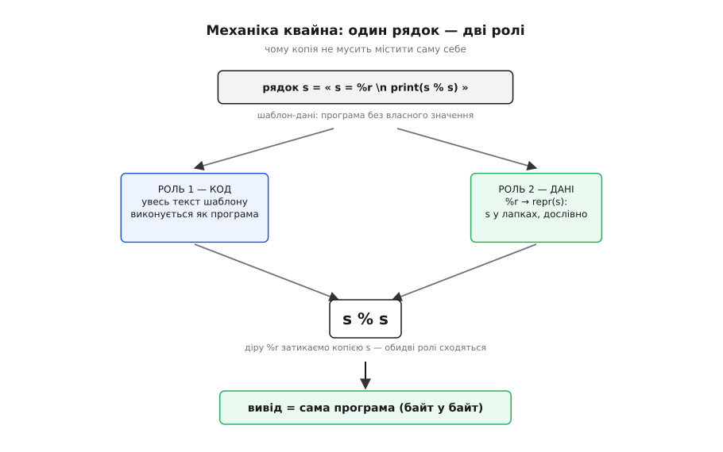
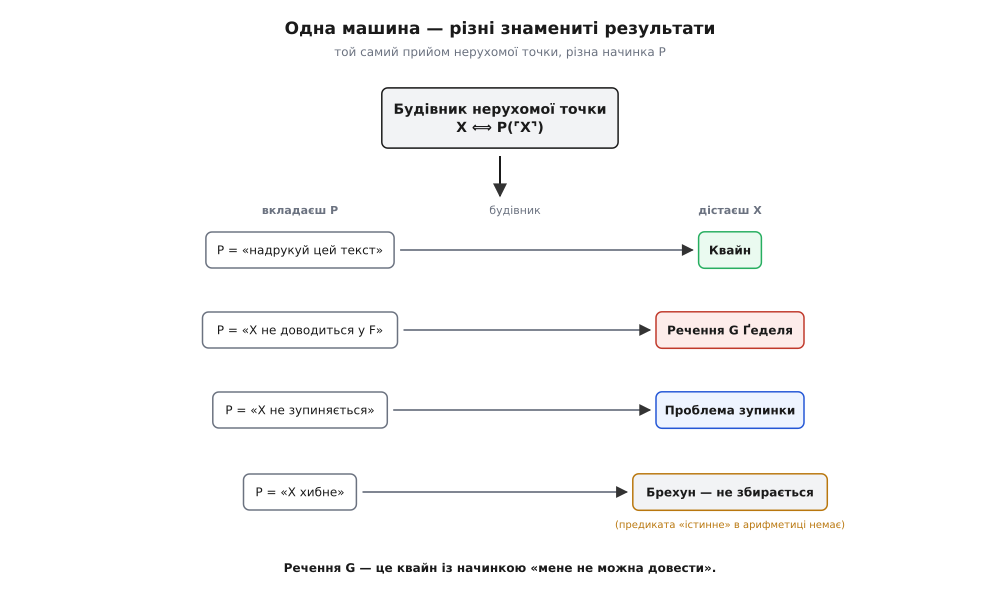

# ⚙️ Квайн: самопосилання, яке можна запустити

Діагональна лема запевняє: для будь-якої властивості знайдеться речення, яке приписує цю властивість самому собі. Звучить як абстракція для логіків. А проте та сама конструкція запускається на звичайному ноутбуці за секунду — її можна помацати руками. Програма, що друкує власний вихідний текст, — **квайн** (англ. *quine*) — це діагональна лема, скомпільована й виконана.

Назву придумав Дуглас Гофстедтер у книжці «Ґедель, Ешер, Бах» (1979) на честь американського логіка Вілларда Ван Ормана Квайна (*Willard Van Orman Quine*, 1908–2000), що все життя копав непряме самопосилання. Його варіант брехуна обходиться без слова «це»: «дає хибу, коли йому передує його ж лапкування» — дає хибу, коли йому передує його ж лапкування. Речення говорить про себе, жодного разу на себе не показавши пальцем. Рівно цей трюк ми зараз змусимо працювати в коді.

## Задача

Правила прості й безжальні. Напишіть програму, яка, запущена без жодного введення, друкує на екран точну копію власного вихідного тексту — символ у символ. Заборонено читати власний файл із диска (`open(__file__)`, `cat`): це не самопосилання, а підглядання в середовище — програма дізнається про себе ззовні, а не зі своєї будови. Заборонена й порожня програма, яка в деяких мовах «друкує себе», не роблячи нічого, — це виродження умови, а не розв'язок.

Спробуймо навпростець:

```python
print("...що сюди вписати?...")
```

Усередину лапок треба вкласти весь текст програми, тобто разом із самим `print(" ")`. Але щойно ми вписуємо туди `print("")`, програма подовжується — і тепер у лапках має опинитися вже цей довший текст. Він знову подовжує програму. Кіт ганяється за хвостом: щоб описати себе повністю, опис мусить містити опис опису, і так без кінця. Наївний шлях **не збігається** — і це не технічна незручність, а те саме замкнене коло, яке діагональна лема розриває у Ґеделя.

## Ідея: код — це дані

Вихід із регресу один, і він геніально скупий. Розділімо програму на дві ролі, які грає **той самий** шматок тексту: **шаблон** (те, що виконується як код) і **дані** (рядок, який цей код тримає в собі). Фокус у тому, щоб надрукувати дані **двічі, у двох подобах**: раз — як **код** (розгорнути шаблон), і раз — як **дані** (той самий рядок у лапках, дослівно). Тоді рядок не мусить містити сам себе — йому досить містити програму **без себе**, а бракуючу копію постачає друге вживання.

Ось найчистіший приклад, мовою Python, і він справді працює:

```python
s = 's = %r\nprint(s %% s)'
print(s % s)
```

Простежмо по кроках, бо тут — усе:

```
s        =  рядок:  s = %r⏎print(s % s)     ← шаблон-дані (програма БЕЗ значення s)
%r       →  сюди підставиться repr(s): s у лапках, дослівно, з екрануванням
s % s    →  у шаблон s підставляємо самé s:
            «s = » + repr(s) + «⏎print(s % s)»
         =  s = 's = %r\nprint(s %% s)'
            print(s % s)
```

Змінна `s` тримає текст програми з єдиною дірою на місці власного значення — цю діру позначено `%r`. Операція `s % s` затикає діру, вставляючи туди `s` **у вигляді лапкованого літерала** (це й робить `%r`: бере `repr`, який повертає рядок у лапках, сам подбавши про екранування). Отже, `s` виходить назовні двома шляхами водночас: як **код** (увесь навколишній текст шаблону) і як **дані** (лапкована копія в дірі). Збіг точний, регрес розірвано.


*Чому квайн не впадає в нескінченний регрес. Той самий рядок s іде двома дорогами: ліворуч — як код (шаблон, який виконується), праворуч — як дані (дослівна лапкована копія, яку вставляє %r). Операція s % s зводить обидві дороги докупи, і результат байт у байт дорівнює самій програмі. Дані не містять себе — вони містять програму без себе, а відсутню копію дає друге вживання.*

Придивімося до `%r` пильно — це серце всієї механіки. `%r` бере рядок і повертає його **зображення в лапках**: був текст `s = %r\nprint(s % s)`, стало `'s = %r\\nprint(s %% s)'` — із лапками по краях і зі зворотними скісними там, де символ інакше зламав би літерал. Ця операція — «взяти об'єкт і дати його дослівний опис» — і є комп'ютерне втілення Ґеделевого лапкування ⌜·⌝: перетворення коду на дані, які цей код однозначно описують. Квайн — це програма, чий вивід дорівнює ⌜себе⌝.

## Той самий квайн у кількох мовах

Трюк один, але кожна мова тримає лапки й друк по-своєму, тож у кожній квайн виходить свій. Нижче — робочі квайни (перевірені: вивід збігається з текстом байт у байт). Придивіться, **де** саме кожна мова ховає лапки-в-лапках.

:::tabs
```python
s = 's = %r\nprint(s %% s)'
print(s % s)
```
```c
#include <stdio.h>
char*s="#include <stdio.h>%cchar*s=%c%s%c;%cint main(){printf(s,10,34,s,34,10,10);return 0;}%c";
int main(){printf(s,10,34,s,34,10,10);return 0;}
```
```js
var s = "var s = %j;\nconsole.log(s.replace('%j', JSON.stringify(s)));";
console.log(s.replace('%j', JSON.stringify(s)));
```
:::

Python бере на себе найбільше: `%r` сам робить і лапки, і екранування. JavaScript чинить так само, тільки руками — `JSON.stringify(s)` обгортає рядок у лапки й екранує все всередині, а `replace` підставляє результат у єдину діру `%j`. (Другий `%j`, той, що в `s.replace('%j', …)`, лишається дослівним — бо `replace` міняє лише **перший** збіг, і саме це нам і треба.)

А от C оголює пастку, яку інші ховають. У C рядок обмежено подвійними лапками `"`, і всередині рядка-даних цей самий символ `"` не можна написати просто так — він урвав би літерал. Екранувати `\"` теж не вихід: тоді в даних лежатиме `\"`, а у виводі має бути гола `"`. Тому лапки в C-квайні **не пишуть узагалі** — їх підставляють за кодом символу:

```
printf(s, 10, 34, s, 34, 10, 10)  збирає текст так:
  10         →  перенесення рядка
  char*s=    →  дослівно
  34         →  "     (лапка; писати її в даних не можна)
  %s ← s     →  увесь рядок s дослівно — його %c/%s другий раз НЕ тлумачаться
  34         →  "
  ;          →  дослівно
  10         →  перенесення
  int main(){…}  →  дослівно
  10         →  перенесення
```

Число `34` — це ASCII-код подвійної лапки, `10` — код перенесення рядка. Ключ у `%s`: він вставляє **сирий** вміст `s`, і специфікатори `%c`, `%s` всередині вставленої копії другий раз не тлумачаться, тож текст лягає буква в букву. Те число `34` — це і є та сама діра, яку в Python затуляв `%r`, лише прокладена вручну, в обхід забороненого символу.

Три мови — три різні способи вимовити лапку всередині лапок: `%r` (Python бере на себе), `JSON.stringify` (JavaScript просить бібліотеку), `%c`+34 (C обходить символ через його код). Ідея скрізь та сама; відрізняється лише **бухгалтерія екранування**.

## Найчистіша форма: коли код і є дані

Є родина мов, де квайн майже не потребує хитрощів, — Lisp і його нащадки. Причина в **гомоіконності** (грец. *homós* — однаковий, *eikṓn* — образ): програма на Lisp записана як список, і той самий список — звичайна структура даних мовою. Код і дані тут не дві речі, з'єднані містком, а одна річ. Лапкування, яке в інших мовах доводиться майструвати, тут є вбудований примітив — `quote` (скорочено `'`), що каже «візьми оце як дані, не виконуй».

Класичний самовідтворний вираз Scheme евалюється **сам у себе**:

```scheme
((lambda (x) (list x (list 'quote x)))
 '(lambda (x) (list x (list 'quote x))))
```

Тут `x` зв'язується з лапкованим списком `(lambda (x) …)`, а тіло `(list x (list 'quote x))` будує список із двох частин: сам `x` (це шаблон-код) і `(quote x)` (це `x` як лапковані дані). Результат — той самий вираз, з якого почали. Помітьте: у Lisp самовідтворення живе не на друці, а на **обчисленні** — вираз, рівний власному результату. Це найточніший портрет діагональної леми, який тільки буває: терм, що дорівнює собі, застосованому до власного лапкування.

## Чому квайн — це діагональна лема

Тепер видно кістяк, спільний для квайна й для Ґеделевого речення. Обидва — **нерухомі точки** операції «застосувати опис до самого себе». Обчислювальний бік цієї ідеї має точну назву — **теорема рекурсії Кліні**.

> Теорема рекурсії Кліні (Стівен Кліні, 1938) каже: для будь-якого обчислюваного перетворення текстів програм `f` знайдеться програма `e`, яку `f` лишає без змін **за поведінкою**: `e` і `f(e)` обчислюють те саме. Це нерухома точка у просторі програм. [Що це за теорема, чому нерухома точка існує завжди й до чого тут квайни](book:math/kleene-recursion-theorem).

Чому нерухома точка існує завжди — видно з того самого `s % s`. Уявімо помічника `dbl(d)`: він бере опис `d` і будує програму «запусти `d`, підсунувши їй копію `d`». А тепер згодуймо `dbl` **його власний опис**. Отримана програма запускає `dbl` на `dbl`, тобто будує програму «запусти `dbl` на `dbl`» — а це знову вона сама. Подвоєння опису й породжує нерухому точку: об'єкт дістає доступ до себе, бо його склали, згодувавши його опис самому собі. Python-квайн `s % s` — це `dbl` у мініатюрі: `s`, застосований до `s`.

Візьмімо `f` = «обгорни програму так, щоб вона друкувала свій текст». Нерухома точка цього `f` — програма, яка друкує **власний** текст. Квайн існує не тому, що хтось спритний його склав, а тому, що **теорема гарантує** нерухому точку. Спритність потрібна лише щоб її виписати.

І ось головне. Конструкція, що дає нерухому точку, не залежить від того, **яку саме** властивість ми самопосилаємо. Одна й та сама діагональна машина, змінюючи лише «начинку» P, викидає різні знамениті результати:

```
Будівник(P)  →  об'єкт X, для якого   X ⟺ P(⌜X⌝)

P = «надрукуй цей текст»        →  X = квайн
P = «X не доводиться у F»        →  X = речення G Ґеделя
P = «X не зупиняється»           →  X = діагональна програма проблеми зупинки
P = «X хибне»                    →  парадокс брехуна (але «хибне» невиразне)
```

Речення G Ґеделя — це квайн, якому замість «надрукуй себе» вклали начинку «мене не можна довести». Механіка складання **та сама**: береш властивість, будуєш об'єкт, що приписує її власному кодові. Тому квайн — не аналогія до G, а **той самий прийом** у легшій обгортці. Там, де Ґедель мусив кодувати формули числами й доводити, що відношення «бути доведенням» узагалі виразне в арифметиці, комп'ютер уже вміє тримати код як дані від народження — і нерухома точка виходить у два рядки.


*Чому квайн і речення G — той самий прийом. Будівник бере властивість P і повертає об'єкт X, що приписує P власному кодові ⌜X⌝. Вклади «надрукуй цей текст» — вийде квайн; «мене не довести» — вийде Ґеделеве G; «я не зупиняюся» — діагональна програма Тюрінга. Начинка «я хибне» не збирається у формальне речення: предиката «істинне» в арифметиці немає, і саме тому Ґедель узяв «не доводиться» замість «хибне».*

Останній рядок таблиці показує межу. Начинка «X не зупиняється» дає діагональну програму, якою Тюрінг закрив [неможливість механічно розв'язати, чи спиниться довільна програма](book:algorithms/halting-problem), — це той самий квайн-скелет з іншим м'ясом. А от начинка «X хибне» **не збирається** у формальне речення: щоб її вимовити, система мусила б мати всередині предикат «істинне», а його там немає — і саме тому Ґедель мусив узяти «не доводиться» замість «хибне». Брехун лишається парадоксом, його стриманіший брат G — теоремою.

> 🔧 **Навіщо це.** Теорема рекурсії — це формальна ліцензія на самопосилання в коді: будь-яка програма **може дістати власний текст** і робити з ним що завгодно, не читаючи диска, бо самопосилання гарантоване самою структурою обчислень, а не хитрістю середовища. На ній стоять квайни, комп'ютерні віруси (код, що копіює себе в носія), серіалізація стану, гаряче перезавантаження, самозастосовний компілятор. Знати теорему — означає не дивуватися, чому ці речі взагалі можливі, і впізнавати ту саму нерухому точку під різними масками.

## Складність і пастки

**Екранування — головний ворог.** Уся морока квайна зосереджена в одному місці: як покласти в рядок-дані той символ, яким цей рядок обмежено. C ми вже бачили: лапку не пишуть, а підставляють числом 34. У мовах із кількома видами лапок спокуса схитрувати — обгорнути дані в одинарні лапки, а всередині вжити подвійні — рятує лише доти, доки в тексті не трапляться обидва види. Надійний квайн не уникає проблеми, а розв'язує її загально: тримає операцію «дай дослівне лапковане зображення» (`repr`, `JSON.stringify`, `%c`+код) і застосовує її до даних. Хто пробує обійтися ручним екрануванням, той рано чи пізно впирається в рядок, який не екранується без нового рівня екранування, — той самий регрес, тепер усередині лапок.

**Механічний переклад між мовами не працює.** Квайн не можна перенести з мови в мову посимвольно. Python-квайн, переписаний значок у значок на C, — не C-квайн: у C немає `%r`, лапки поводяться інакше, `print` зветься `printf` і вимагає формату. Кожна мова тлумачить рядкові літерали, екранування й друк по-своєму, тож квайн у ній треба **скласти наново** під її власну граматику. Це не дрібниця реалізації, а глибокий відбиток тієї самої істини з боку логіки: діагональну конструкцію доводиться щоразу перебудовувати під **точний синтаксис** конкретної системи. Немає одного універсального речення G, придатного всім системам, — як немає одного квайна, придатного всім мовам. Самопосилання завжди прив'язане до конкретної граматики, у якій його вимовляють.

**Шахрайські квайни.** Два способи «розв'язати» задачу насправді її обходять. Перший — прочитати власний файл: `print(open(__file__).read())`. Формально друкує свій текст, а по суті питає операційну систему, а не себе; заберіть файл — і «квайн» осліпне. Справжній квайн носить свою копію **всередині власної будови**. Другий — порожня програма: у мові, де порожній вхід дає порожній вихід, «нічого» друкує «нічого» й формально є квайном. Це не хитрість, а виродження умови, тому порожні квайни за домовленістю не рахують. Обидва «розв'язки» варті уваги саме тим, що показують, **чого** ми насправді вимагаємо: копія має жити в структурі програми, а не в її оточенні й не в порожнечі.

**Темний бік: самовідтворний бекдор.** Найгучніший ужиток квайна лишається й найтривожнішим. 1984 року Кен Томпсон у лекції на честь премії Тюрінга «Reflections on Trusting Trust» показав компілятор, у який вшито дві речі: він розпізнає, коли компілює програму входу в систему, і тихо вставляє туди чорний хід; і він розпізнає, коли компілює **сам себе**, і тихо вставляє в новий компілятор обидва ці розпізнавання. Друга частина — чистий квайн: код, що відтворює себе в нащадкові. Приберіть заразу з **вихідного тексту** компілятора начисто — і скомпільований старим (зараженим) компілятором новий компілятор усе одно народиться зараженим, бо квайн-частина перенесла себе повз джерела. Слід зникає з коду, а поведінка лишається. Томпсонів висновок безжальний: довіряти можна не текстові, який ти прочитав, а лише тим, хто його зібрав, — бо самопосилання дозволяє коду пережити власне видалення з джерел.

Квайн виглядає як салонний фокус — програма на два рядки, що друкує два рядки. Але ці два рядки тримають ту саму нерухому точку, на якій стоять перша теорема Ґеделя, невирішність проблеми зупинки й Томпсонів невидимий бекдор. Самопосилання не можна ні заборонити, ні обійти: щойно система досить сильна, щоб тримати опис поряд з описаним, вона вміє скласти об'єкт, що говорить про себе, — і байдуже, каже той об'єкт «ось мій текст», «мене не довести» чи «мене не знайти».
