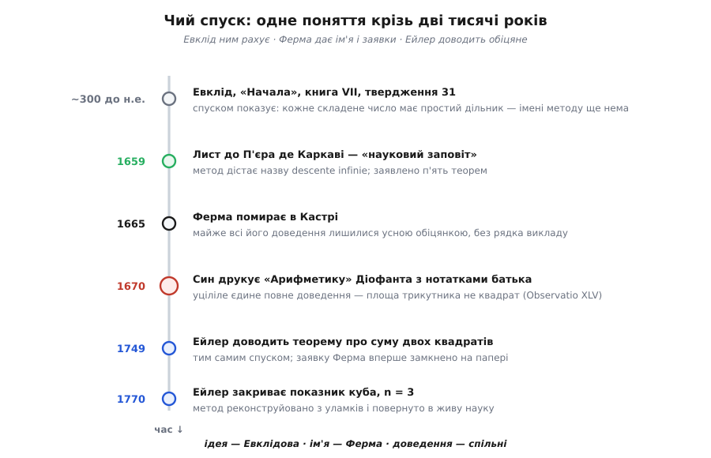

# 📜 Чий насправді нескінченний спуск

Метод має французьке ім'я — *descente infinie* — і носить його один чоловік: П'єр де Ферма. Але ім'я і винахід — речі різні. Питання «чий спуск?» насправді розпадається на три: хто перший ним **скористався**, хто його **назвав** і хто **довів** те, що ним обіцяли довести. Відповіді припадають на три різні епохи й трьох різних людей. Тож найчесніша картина методу — не портрет, а родовід.

*Родовід методу одним поглядом. Ідея працює вже в Евкліда, ім'я з'являється аж у Ферма, а тіло доказів дописане здебільшого чужою рукою — Ейлеровою. Кожен вузол розгортаємо нижче.*

## Спуск рахує за дві тисячі років до назви

Розгорніть «Начала» Евкліда на сьомій книзі, твердження 31. Формулювання буденне: **кожне складене число має якийсь простий дільник**. Доведення ще буденніше — і саме в цій буденності ховається весь наш метод.

Візьміть складене число. За означенням у нього є дільник, менший за нього самого. Якщо той дільник простий — готово. Якщо ні, він теж складений, а отже має свій дільник, іще менший. І так далі: щоразу новий дільник строго менший за попередній. Евклід обриває цей хід однією фразою — якби простий дільник так і не знайшовся, ми дістали б нескінченну низку чисел, кожне менше за попереднє, «а це в числах неможливо».

Ось воно. Уся машина спуску вже тут: будуємо строго спадний ланцюг натуральних чисел і відкидаємо його самою неможливістю такого ланцюга. Евклід не оголосив цього прийомом, не виокремив у метод, не дав імені — для нього це просто очевидна властивість чисел, якою можна користуватися мимохідь. І твердження VII.31 не забавка: воно — одна з цеглин під [основною теоремою арифметики](book:math/fundamental-theorem-arithmetic), тією, що кожне число розкладається на прості єдиним способом. Тобто спуск від самого початку стоїть біля наріжних результатів, а не десь на маргінесі.

Це перший урок про власність методу: **ідея старша за будь-яке ім'я**. Що спадний ланцюг натуральних чисел не може тривати вічно, знали й уживали задовго до XVII століття. Легенда приписує піфагорійцям приголомшення від того, що діагональ квадрата несумірна зі стороною, — а той доказ теж спирається на «немає найменшого»; проте хто саме й коли це вперше побачив, історія не зберегла. Це переказ, не документ. Твердо документоване — Евклідове: ось текст, ось спуск у ділі, ось рік близько 300 до н.е. Ім'я з'явиться майже за дві тисячі років.

## Юрист із Тулузи, що дав методові ім'я

Чоловік, чиє ім'я тепер носить метод, математиком за фахом не був. П'єр де Ферма (*Pierre de Fermat*) заробляв правом: 1630 року купив посаду радника (фр. *conseiller*) в парламенті Тулузи, склав присягу навесні 1631-го й до кінця життя засідав у суді, зокрема в Палаті едикту (*Chambre de l'Édit*). Математикою займався поза службою, майже нічого не друкував, а результати розсилав у листах — часто як виклик: ось що я вмію довести, спробуйте й ви.

Навіть рік його народження — річ не така певна, як здається. Більшість книжок подає 1601-й, і саме ця дата стоїть у метричній книзі містечка Бомон-де-Ломань: Пʼєр, син Домініка Ферма, охрещений 20 серпня 1601 року. Але докладне дослідження тих самих реєстрів (німецький історик математики Клаус Барнер) показує прикру річ: охрещений 1601-го Пʼєр — це старший **зведений брат**, що помер малим, а сам математик народився від другого батькового шлюбу, найпевніше наприкінці 1607 року. На це недвозначно вказує епітафія: Ферма помер 1665-го **у віці 57 років**, а це відсуває народження на кінець 1607-го, ніяк не на 1601-й. Статус цієї поправки — обґрунтована наукова реконструкція, хоч традиція й досі за звичкою тримається старого числа. Дрібниця? Ні: вона показує, як легко навіть на добре задокументованій постаті осісти помилці, яку потім два століття переписують одне в одного.

У серпні 1659 року Ферма продиктував те, що тепер називають його науковим заповітом, — довгий лист до Пʼєра де Каркаві (*Pierre de Carcavi*), королівського бібліотекаря, з наміром, щоб той переслав написане Християнові Гюйгенсу й затягнув молодого генія в теорію чисел. Лист має назву «Виклад нових відкриттів у науці про числа» (*Relation des nouvelles découvertes en la science des nombres*) і датований 14 серпня. Саме там Ферма вперше називає свій головний інструмент: **нескінченний, або невизначений, спуск** (*descente infinie ou indéfinie*). І тут-таки чесно зізнається в його межах. Спершу, пише він, метод служив йому лише для **заперечень** — довести, що чогось **не існує**. До стверджувальних питань спуск довго не піддавався, і, беручись показати, що кожне просте 4*n*+1 є сумою двох квадратів, він, за власним словом, добряче намучився, доки не знайшов потрібний поворот. Людина, що дала методові ім'я, не приховує, скількох зусиль той метод коштував.

## П'ять заявок і одне-єдине доведення

У тому ж листі Ферма перелічує теореми, здобуті спуском. Серед них — що площа прямокутного трикутника з цілими сторонами ніколи не дорівнює квадрату цілого; що рівняння *x*³ + *y*³ = *z*³ не має розв'язків у ненульових цілих; що кожне просте число вигляду 4*n*+1 є сумою двох квадратів (5 = 1² + 2², 13 = 2² + 3²). Список звучить як тріумф. Але за ним зяє порожнеча: **доведень Ферма майже не лишив**.

Це не недбалість, а спосіб життя. Ферма не публікував — він **дражнив**. Готовий доказ був його приватною зброєю в листовних поєдинках; оприлюднити його означало роззброїтися. Тож він записував самі результати на берегах книжок, для себе, а кореспондентам кидав голі формулювання. З усього, що він приписав спускові, до нас дійшло **одне** повне доведення — і те випадком.

Випадок звався Клеман-Самюель. По смерті батька (Ферма помер 12 січня 1665 року в Кастрі) син, Клеман-Самюель де Ферма, узявся впорядкувати його паперовий спадок. Головним скарбом виявився батьків примірник «Арифметики» Діофанта — грецького трактату III століття в латинському перекладі Баше (*Bachet*, видання 1621 року), — геть списаний нотатками на полях. 1670 року Клеман-Самюель перевидав ту «Арифметику», вставивши сорок сім батькових нотаток (*Observationes*) кожну на своє місце. І тільки завдяки цьому вони збереглися: **сам примірник із Фермовою рукою пропав**. Друк 1670 року — єдине джерело, звідки ми взагалі знаємо, що математик написав на тих берегах.

Серед сорока семи нотаток — те саме єдине повне доведення спуском, Observatio XLV: **немає прямокутного трикутника з цілими сторонами, площа якого була б квадратом**. З будь-якого такого трикутника Ферма будує менший із тією самою властивістю — і оскільки натуральні площі не спадають вічно, жодного такого трикутника нема. Це справжній, дописаний до кінця спуск, єдиний, що вцілів під його рукою.

А поруч, на берегах тієї ж «Арифметики», лежала й найгучніша порожня обіцянка в історії математики. Проти восьмої задачі другої книги Ферма занотував, що рівняння *x*ⁿ + *y*ⁿ = *z*ⁿ не має розв'язків у цілих для жодного показника *n* > 2, і що він знайшов цьому «воістину дивовижне доведення, якого ці поля завузькі вмістити». Ті поля мовчали три з половиною століття, доки теорему не закрив Ендрю Вайлз аж наприкінці XX століття (доведення завершене 1994-го, надруковане 1995 року) — засобами, яких за Ферма й близько не було. Отже, ті самі береги тримали і справжній доказ (для показника 4, що випливає з теореми про трикутник), і найзнаменитіший блеф. Різниця між ними — рівно різниця між «довів» і «сказав, що довів».

> 🔧 **Навіщо це.** Історія Фермових заявок — це наочний урок, чому в математиці **обіцянка не рахується за результат**. «Я вмію це довести» і «ось доведення» розділяє прірва: перше може виявитися самообманом навіть у генія, друге — перевіряють рядок за рядком. Саме тому сучасна робота цінує не оголошений факт, а викладений хід. Спуск тут особливо підступний: побудувати «крок, що зменшує» буває легко на око, а помилка ховається в тому, чи справді міра **натуральна** й справді **спадає щоразу** — і побачити її можна лише в повному записі, а не в анонсі.

## Хто розплутав обіцянки

Якби на Фермові й скінчилося, більшість його заявок так і зосталися б словом честі юриста з Тулузи. Розплутав їх, одну по одній, інший чоловік — швейцарець Леонард Ейлер, майже за століття.

Візьмімо ту саму теорему про суму двох квадратів, на якій сам Ферма зізнавався, що намучився. Перше **повне** її доведення дав Ейлер — і дав саме спуском. Він сповістив про нього Крістіана Ґольдбаха листом від 12 квітня 1749 року, а розгорнутий доказ надрукував у виданні Петербурзької академії протягом 1752–1755 років. Тобто заявку, кинуту в листі 1659-го, замкнули на папері аж через дев'яносто років — і не той, хто її кинув.

Те саме з кубами. Ферма заявив, що *x*³ + *y*³ = *z*³ не має розв'язків у цілих, але викладу не лишив. Довів це знову Ейлер — і надрукував 1770 року у своєму «Повному вступі до алгебри», теж спуском. Щоправда, у його міркуванні була тонка прогалина (крок про числа вигляду *a*² + 3*b*²), яку строго закрили вже згодом; але кістяк був Ейлерів і був правильний. Виходить, що показник 3 — теж не Фермова перемога на папері, хоч заявка Фермова.

Складіть це докупи — і власність методу проступає без прикрас. **Ідею** дав Евклід, ще без назви. **Ім'я** дав Ферма — і дав методові гучну біографію, перелічивши, на що той здатен. А **тіло доведень** здебільшого написане пізніше й іншими руками, передусім Ейлеровою: він фактично відтворив метод із Фермових уламків і перевів обіцянки в теореми. Одне повне доведення Ферма (трикутник, а з нього — показник 4) — реальне й лишається його. Решта — спільна праця кількох поколінь.

## Що ж кому належить

Розкладімо на статуси, бо саме плутанина статусів і породжує міфи про «одного винахідника».

**Твердо задокументоване.** Евклід уживає спуск у «Началах» VII.31 (текст зберігся). Ферма дає методові ім'я в листі до Каркаві 14 серпня 1659 року (лист зберігся). Єдине повне Фермове доведення спуском — про площу трикутника — дійшло через видання сина 1670 року (друк зберігся, оригінал ні). Ейлер доводить теорему про дві квадрати (1749) і показник 3 (1770). Усе це — не переказ, а документи.

**Виправлене дослідженням.** Рік народження Ферма: традиційне 1601 майже напевно належить померлому зведеному братові, а сам математик народився близько 1607-го. Приклад того, як помилка тримається на самій лише інерції переписування.

**Саме слово честі.** Більшість заявок із листа 1659 року Ферма підкріпив не доведенням, а власним твердженням, що доведення в нього є. Пізніше їх підтвердили — але то вже чужа заслуга; сам факт «Ферма це вмів» так і лишився недоведеним про Ферма, хоч теореми виявилися правдиві.

Тому й на питання «чий нескінченний спуск» немає однослівної відповіді. Ім'я — Фермове, і заслужено: він перший **побачив у прийомі метод**, дав йому назву й окреслив, що ним можна брати. Але сам прийом старший за Ферма на дві тисячі років, а більшість його заявлених плодів зібрали інші. Винаходи в математиці рідко належать одній людині — і чим гучніше ім'я стоїть на методі, тим уважніше варто питати, що саме за цим іменем **доведено**, а що лише **обіцяно**.
