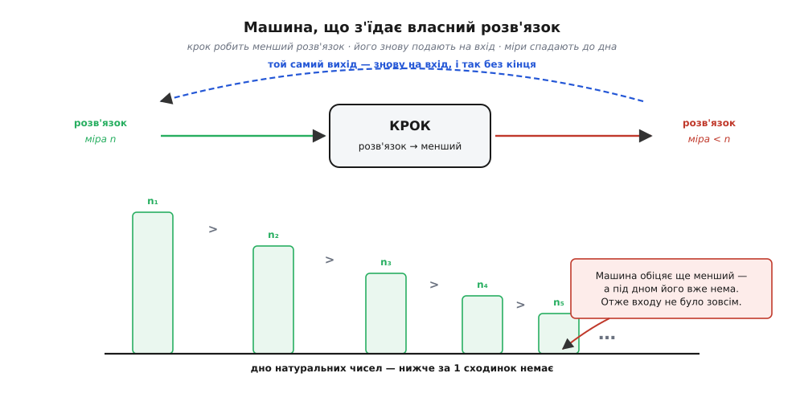
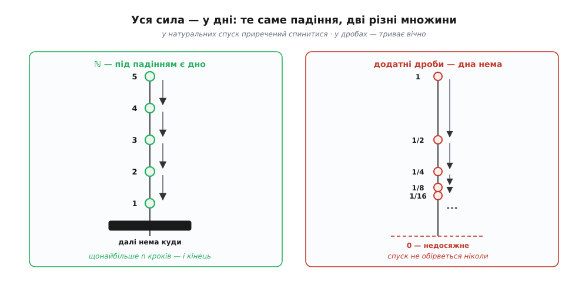
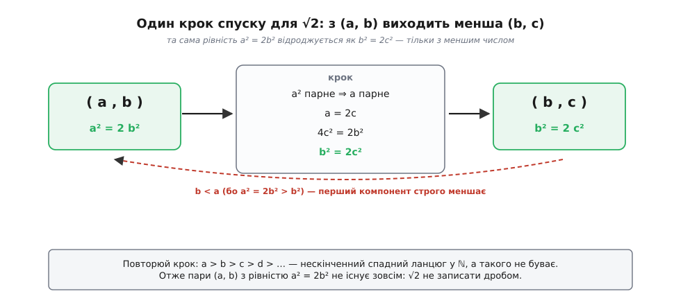
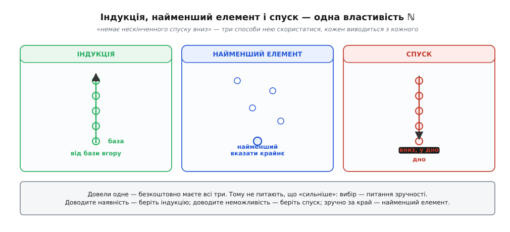

# Нескінченний спуск Ферма

<preknowlist>
- [Натуральні числа](book:math/natural-numbers) — 1, 2, 3, …: є найменше, за кожним стоїть наступне, і нижче за одиницю натуральних немає.
- [Математичне доведення](book:math/mathematical-proof) — що означає «довести» твердження і чому вдала перевірка на прикладах ще не доказ.
- [Доведення від супротивного](book:math/proof-by-contradiction) — припустити протилежне доказуваному й довести це припущення до суперечності.
- [Математична індукція](book:math/mathematical-induction) — база плюс крок «від k до k+1» накривають усі натуральні числа одним скінченним міркуванням.
- [Ірраціональні числа](book:math/irrational-numbers) — числа, яких не записати відношенням двох цілих.
</preknowlist>

Довести, що щось **є**, зазвичай легко: покажи його. Хочете переконати співрозмовника, що рівняння *a*² + *b*² = *c*² має розв'язок у цілих числах? Ось він: 3, 4, 5. Одного пред'явленого прикладу досить, суперечка вичерпана.

Тепер спробуйте довести протилежне: що розв'язків **немає жодного**. Пред'явити нема чого — у цьому й полягає твердження. Перебрати кандидатів? Їх нескінченно багато, і перебір ніколи не скінчиться: скільки б трійок ви не відкинули, попереду завжди лишається нескінченний хвіст неперевіреного. Мільйон невдалих спроб не забороняє мільйон першій вдатися. Перевірка працює **проти** твердження — один влучний приклад його вбиває, — але сама по собі ніколи його не підтверджує.

Отже, потрібен спосіб накрити всю нескінченну лаву кандидатів одним скінченним міркуванням, причому не перебором. П'єр де Ферма знайшов такий спосіб і назвав його **нескінченним спуском** (фр. *descente infinie*, від латин. *descendere* — «сходити вниз»).

## Машина, що з'їдає власний розв'язок

Задум нахабний до зухвалості. Ми **припускаємо**, що розв'язок таки є, — і замість шукати в ньому пряму помилку, будуємо з нього машину.

Машина робить одну-єдину річ: бере будь-який розв'язок і повертає **інший розв'язок того самого рівняння, але строго менший**. Меншість тут не метафора. До кожного розв'язку приписано натуральне число — його **міра**: найбільша зі сторін, гіпотенуза, чисельник дробу, будь-що, аби воно було натуральним і чесно рахувалося з самого розв'язку. Машина обіцяє, що після її роботи міра стала строго меншою.

Тепер найцікавіше: машина не питає, звідки взявся вхід. Їй байдуже, чи це ваш початковий розв'язок, чи вже перероблений разів десять, — вона однаково видасть іще менший. А раз так, її вихід можна подати їй же на вхід. І ще раз. І ще. Ніщо не заважає крутити це вічно, бо на кожному оберті на вході в неї стоїть законний розв'язок, а іншого їй і не треба.

Що з цього виходить? Ланцюг мір:

```
n₁  >  n₂  >  n₃  >  n₄  >  …
```

Натуральні числа, кожне строго менше за попереднє, і ланцюг **не має кінця** — бо на кожному кроці машина сумлінно видає наступне.

Ось тут усе й ламається. Такого ланцюга не буває. Почніть із *n*₁ = мільярд — і ви зробите щонайбільше мільярд кроків, перш ніж упретеся в одиницю: кожен крок з'їдає щонайменше одиницю запасу, а запас скінченний. Вічно спускатися можна тільки там, де під тобою нескінченно багато сходинок; під натуральним числом їх рівно стільки, скільки воно саме.

Придивіться, **що саме** виявилося неможливим. Не машина — її ми чесно збудували, і кожен її крок доводиться звичайною алгеброю. Не ланцюг — він лише слухняний наслідок. Хибним було єдине, що ми взяли на віру: **перший розв'язок**. Якби він існував, з нього поліз би неможливий ланцюг. Отже, він не існує — а разом із ним і всі інші, бо машина однаково перемолола б будь-який, з якого ви почали б.


*Уся конструкція спуску. **Крок** — доведена алгебраїчна побудова: з розв'язку робить менший розв'язок того самого вигляду. **Петля** — вихід повертають на вхід, і так без кінця. **Дно** — натуральні числа не пускають нижче за одиницю. Крок правильний, петля законна, дно непорушне; лишається одне слабке місце — припущення, що перший розв'язок узагалі був. Воно й падає.*

## Дно, на якому все тримається

Варто зупинитися й побачити, на чому насправді стоїть уся ця конструкція. Не на логіці — на **арифметиці**. Точніше, на одній-єдиній властивості натуральних чисел: **у них немає нескінченного строго спадного ланцюга**. Це не теорема про рівняння, не хитрість міркування; це те, чим натуральні числа є.

Перевірити межу твердження найпростіше так: спитати, де воно перестає бути правдою. Візьміть додатні дроби замість цілих. Ось вам ланцюг:

```
1  >  1/2  >  1/4  >  1/8  >  1/16  >  …
```

Кожне строго менше за попереднє, усі додатні, і спуск **ніколи не обірветься** — дна під ним немає, бо нуля він не досягає, а місця між ним і нулем завжди лишається вдосталь. Те саме з дійсними числами. Тобто якщо ви побудували бездоганну машину спуску, а мірою у вас вийшов додатний дріб, — ви не довели нічого. Машина крутиться, ланцюг тягнеться, суперечності немає.


*Та сама машина, дві різні множини — і протилежний результат. У ℕ спадний ланцюг приречений обірватися, тож нескінченний спуск дає суперечність і метод працює. У додатних дробах спуск триває вічно й нічого не забороняє. Звідси головна дисципліна: **міра мусить бути натуральною**. Не «майже цілою», не «додатною», а саме натуральною.*

Ось чому спуск — не логічний трюк, який можна застосувати будь-де. Це прийом, що позичає силу в **множини, у якій ви міряєте**. Порядки, де нескінченного спуску не буває, так і звуть [фундованими](book:algorithms/loop-variant/math-well-founded.md) (немає нескінченного спуску вниз) — і працює метод рівно в них. Натуральні числа фундовані; додатні дроби — ні. Уся решта міркування в обох випадках однакова.

> 🔧 **Навіщо це.** Прийом «признач міру й покажи, що вона мусить спадати» виходить далеко за межі теорем про рівняння. Саме ним доводять, що програма **зупиниться**: знаходять величину, яка на кожному оберті циклу строго меншає й не може стати від'ємною, — і зависання стає неможливим не за спостереженням, а за побудовою (це [варіант циклу](book:algorithms/loop-variant)). Ним же ловлять і протилежне: якщо ваша «спадна величина» насправді дріб чи щось необмежене знизу, доказу немає — і десь у коді причаїлася гілка, де запас роботи не тане. Питання «яка тут міра і чи натуральна вона?» перетворює туманне «здається, скінчиться» на перевірний факт.

## √2 не дріб — спуск у роботі

Найчистіший приклад — стародавнє відкриття, що діагональ квадрата несумірна з його стороною. Мовою чисел: **√2 не можна записати дробом**.

**Умова.** Припустімо, що можна: √2 = *a*/*b*, де *a* і *b* — натуральні. Піднесімо до квадрата й помножмо на *b*²:

```
√2 = a/b        →        a² = 2b²
```

Тепер треба збудувати машину: з пари (*a*, *b*), що задовольняє цю рівність, зробити меншу пару, яка задовольняє **ту саму** рівність.

```
a² = 2b²                    ліворуч стоїть парне число, отже a² парне
a² парне  →  a парне        бо квадрат непарного непарний: (2k+1)² = 4k²+4k+1
a = 2c                      запишімо a через нове натуральне c
(2c)² = 2b²   →   4c² = 2b²
b² = 2c²                    поділили на 2 — і дістали ту саму рівність!
```

Придивіться до останнього рядка. Пара (*b*, *c*) задовольняє рівняння **того самого вигляду**, що й (*a*, *b*): перший компонент у квадраті дорівнює подвоєному квадрату другого. Машина готова — лишається переконатися, що вона таки спускає нас **вниз**. А це видно з першої ж рівності: *a*² = 2*b*² більше за *b*², тож *a* > *b*. Значить, перший компонент нової пари строго менший за перший компонент старої.

**Висновок.** З (*a*, *b*) машина робить (*b*, *c*), із (*b*, *c*) — наступну пару, і так без кінця, а перші компоненти дають ланцюг *a* > *b* > *c* > … натуральних чисел, що не має кінця. Не буває такого ланцюга. Отже, не буває й пари (*a*, *b*), з якої він поліз би: √2 дробом не записується.


*Спуск на рівнянні a² = 2b². Кожен оберт бере пару, доводить парність першого числа, ділить його навпіл — і повертає пару того самого вигляду з меншим першим числом. Ланцюг перших компонентів a > b > c > … нескінченний, а натуральні числа такого не терплять. Виходить, у машини немає жодного правильного входу — саме це й означає, що √2 ірраціональне.*

Той самий доказ як програма — і кожен `assert` у ньому доводиться рядком алгебри вище:

```py
def descent_step(a, b):
    """Приймає розв'язок рівняння a² = 2b² у натуральних числах
    і повертає СТРОГО менший розв'язок того самого рівняння."""
    assert a > 0 and b > 0 and a * a == 2 * b * b

    # a² парне → a парне (квадрат непарного непарний), тож a ділиться на 2
    c = a // 2

    # (2c)² = 2b²  →  4c² = 2b²  →  b² = 2c²
    assert b * b == 2 * c * c    # нова пара — рівняння того самого вигляду
    assert 0 < b < a             # і перший компонент строго менший

    return b, c
```

Функція коректна: жоден `assert` не спрацює. І саме через це вона **ніколи не виконається** — у неї немає жодного припустимого входу. Якби знайшовся бодай один, його можна було б крутити в цій функції вічно, а `a` строго меншало б на кожному оберті. Порожня область визначення цієї функції і **є** теорема про ірраціональність √2.

Тут варто помітити, чого в доказі **немає**. Шкільний варіант починається словами «нехай дріб *a*/*b* нескоротний» і закінчується «але *a* і *b* обидва парні — суперечність із нескоротністю». Спуск обходиться без нескоротності зовсім. І це не дрібниця: саме твердження «кожен дріб можна скоротити до нескоротного» спирається на те, що серед усіх записів цього числа є запис із **найменшим** знаменником, — тобто на те саме дно натуральних чисел, тільки згадане тихцем і на крок раніше. Обидва докази стоять на одному фундаменті; спуск просто називає його вголос.

## Індукція, найменший елемент і спуск — одне й те саме

Ланцюг із нескінченного спуску можна не будувати зовсім. Замість «беремо будь-який розв'язок і женемо його вниз без кінця» скажіть так: **візьмімо найменший** розв'язок — той, у якого міра менша, ніж у всіх інших. Такий існує, бо будь-який непорожній набір натуральних чисел має найменший елемент. Тепер погодуйте його машиною — і вона видасть розв'язок **іще менший**. Менший за найменший. Суперечність, і жодних нескінченних ланцюгів.

Це той самий доказ у зручнішій одежі, і сучасні тексти майже завжди пишуть саме так: суперечність настає за один крок, а будувати нескінченний об'єкт не доводиться. Властивість, на яку тут спираються, звуть [принципом повного впорядкування](book:math/well-ordering-principle).

А тепер погляньте, що вийшло. «У ℕ немає нескінченного спадного ланцюга», «у кожному непорожньому наборі натуральних є найменший», «база плюс крок доводять твердження для всіх *n*» — це **три формулювання одного й того самого**, і кожне виводиться з кожного. [Індукція](book:math/mathematical-induction) починає з одиниці й піднімається вгору, накриваючи всі числа; спуск падає вниз і розбивається об дно; повне впорядкування вказує пальцем на найменше. Одна властивість натуральних чисел, три способи нею скористатися.


*Три формулювання, що взаємно виводяться одне з одного. Індукція зручна, коли треба довести, що властивість **є** в усіх; спуск — коли треба довести, що розв'язку **немає**; найменший елемент — коли зручно вхопитися за крайній випадок. Довівши одне, ви безкоштовно маєте всі три, тож вибір між ними — питання зручності, а не сили.*

Тому й не варто питати, що «сильніше» — індукція чи спуск. Вони рівносильні. Питання лише в тому, з якого боку зручніше зайти: доводите наявність — беріть індукцію; доводите неможливість — беріть спуск.

## Ферма, лист і поля Діофанта

Ім'я методові дав П'єр де Ферма (*Pierre de Fermat*, 1601–1665) — юрист і радник парламенту Тулузи, що займався математикою в позаробочий час і майже нічого не друкував. У серпні 1659 року він написав П'єру де Каркаві листа, який тепер вважають його науковим заповітом: там він оголошує метод, називає його *descente infinie ou indéfinie* — «нескінченний або невизначений спуск» — і перелічує теореми, які ним здобув.

Ферма чесно зізнається, що спершу метод служив йому лише для **заперечних** тверджень — таких як «немає прямокутного трикутника в числах, площа якого квадрат». Далі йде найцікавіше зізнання: до **стверджувальних** питань метод довго не піддавався, і, беручись довести, що кожне просте число вигляду 4*n*+1 є сумою двох квадратів, він, за власним словом, добряче намучився, доки не знайшов потрібний поворот.

Найприкріше в цій історії те, що доказів Ферма майже не лишив. Із усього, що він приписував спускові, до нас дійшло **єдине** повне доведення — записане його рукою на берегах примірника «Арифметики» Діофанта й надруковане 1670 року сином, Клеманом-Самюелем, уже після смерті батька. Решта — самі заявки. Те, що метод спуску відомий далеко не з Ферма (Евклід користується ним ще у «Началах», просто не називаючи), і що сталося з рештою його обіцянок, — окрема історія: [чий насправді нескінченний спуск](book:math/infinite-descent/hist-fermat-descent.md).

## Корона методу: трикутник, площа якого не квадрат

Те єдине вціліле доведення варте того, щоб знати, що саме воно каже. **Немає прямокутного трикутника з цілими сторонами, площа якого дорівнювала б квадрату цілого числа.**

Звучить як дрібна цікавинка — а це один із наріжних результатів теорії чисел. Спуск тут працює на [трійках Піфагора](book:math/pythagorean-triples): з трикутника, площа якого квадрат, будується **менший** трикутник із тією самою властивістю. Площі — натуральні, спускатися вічно нікуди, отже жодного такого трикутника немає. Побудова кроку — найтонше місце всієї конструкції; [як саме з трикутника народжується менший трикутник](book:math/infinite-descent/math-right-triangle-area.md) — окремо, з повним виведенням.

Найгучніший наслідок дістається задарма. Ту саму теорему можна переписати рівнянням *x*⁴ − *y*⁴ = *z*², у якого немає ненульових цілих розв'язків. Припустімо тепер, що *x*⁴ + *y*⁴ = *z*⁴. Перенесімо:

```
x⁴ + y⁴ = z⁴        →        z⁴ − y⁴ = x⁴ = (x²)²
```

Праворуч квадрат — тобто трійка (*z*, *y*, *x*²) розв'язує заборонене рівняння *a*⁴ − *b*⁴ = *c*². Такого не буває. Отже, *x*⁴ + *y*⁴ = *z*⁴ не має розв'язків у ненульових цілих — [велика теорема Ферма](book:math/fermats-last-theorem) для показника 4 доведена цілком, тим самим спуском, і це єдиний її показник, який сам Ферма справді закрив на папері.

## Спуск на користь ствердження

Досі спуск відповідав тільки «ні»: розв'язку немає, трикутника немає, дробу немає. А як бути, коли довести треба, що щось **завжди є**? Здавалося б, спуск тут ні до чого — нема чого зменшувати.

Поворот, що коштував Ферма стількох зусиль, полягає в тому, щоб перевернути питання. Візьмімо його ж теорему: кожне [просте число](book:math/prime-numbers) вигляду 4*n*+1 є сумою двох квадратів (5 = 1² + 2², 13 = 2² + 3², 17 = 1² + 4², і так далі). Заперечмо це: нехай знайшлося просте 4*n*+1, яке **не** є сумою двох квадратів. Тепер будуємо машину — з такого «поганого» простого робимо **менше** погане просте того самого вигляду. Спуск покотився: погані прості меншають без кінця. Але найменше просте вигляду 4*n*+1 — це п'ятірка, і вона чудово розкладається: 5 = 1² + 2². Отже, поганих простих немає взагалі, а ствердження доведено для всіх.

Механізм не змінився ані на йоту — змінилося те, **що** ми спускаємо. Заперечивши стверджувальне твердження, ми дістали заперечне («поганих чисел не існує»), а з ним спуск працює як завжди. Побудова того самого меншого поганого простого — це вже справжня робота, і саме на ній Ферма й застряг; [як спуск доводить, що просте 4n+1 завжди є сумою двох квадратів](book:math/infinite-descent/math-two-squares-descent.md) — з повним ходом міркування.

## Куди спуск дійшов

Метод не лишився пам'яткою XVII століття. Найпростіший його нащадок у вас перед очима щодня: [алгоритм Евкліда](book:math/gcd-euclidean) — це спуск у чистому вигляді. Заміна пари (*a*, *b*) на (*b*, *a* mod *b*) щоразу строго зменшує другий компонент, той натуральний, тож алгоритм **мусить** дійти до нуля. Не «зазвичай доходить» — мусить, і рівно з тієї самої причини, з якої не існує √2 у вигляді дробу.

На іншому кінці — сучасна теорія чисел, де слово лишилося буквально тим самим. Розв'язки рівнянь на еліптичних кривих досліджують **спуском**, а теорему Морделла–Вейля (про те, що раціональні точки такої кривої породжуються скінченним набором) доводять саме ним; технічні кроки цієї роботи так і звуть «2-спуск» і «нескінченний спуск». Сам Ферма, розкладаючи свої трикутники, фактично ділив точки на еліптичній кривій навпіл — просто не мав слів, щоб це так назвати.

---

**Нескінченний спуск** доводить, що чогось **не існує**, — там, де перебір безсилий, бо кандидатів нескінченно багато. Схема одна: припустити, що розв'язок є; збудувати з нього розв'язок того самого вигляду, але зі строго меншою **натуральною** мірою; помітити, що машину можна годувати власним виходом, — і дістати нескінченний спадний ланцюг натуральних чисел. Такого ланцюга не буває, бо під одиницею сходинок немає. Падає при цьому не машина й не ланцюг, а єдине припущення — що перший розв'язок узагалі був. Уся сила методу позичена в натуральних чисел: заміните міру на додатний дріб — і спуск триватиме вічно, нічого не довівши. Той самий доказ зручніше писати через **найменший** розв'язок: машина видасть менший за найменший, і суперечність настає за один крок. Спуск, повне впорядкування й індукція — три одежі однієї властивості ℕ, тож вибір між ними диктує зручність: доводите наявність — індукція, неможливість — спуск. Заперечне за формою, це не заважає йому доводити й стверджувальні речі: заперечте твердження, і «поганих випадків не існує» стане звичайною задачею на спуск. Ім'я методові дав Ферма, дно під ним — те саме, що тримає рекурсію від безкінечного падіння, а хід — той самий, яким сьогодні працюють з еліптичними кривими.
