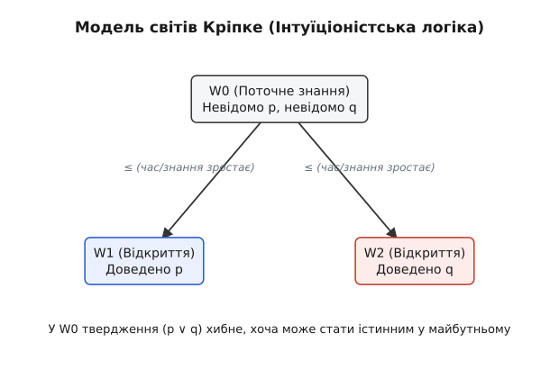

<preknowlist>
- Базове розуміння класичної логіки висловлювань (кон'юнкція, диз'юнкція, імплікація).
- Поняття істинності та хибності тверджень.
- Знайомство з основними методами доведення в математиці (від супротивного).
</preknowlist>

> **🔧 Навіщо це:**
> Класична логіка чудово працює у світі незмінних фактів, де кожне твердження завжди є істинним або хибним. Але у програмуванні, комп'ютерних науках і теорії типів ми маємо справу не з вічними істинами, а з обчислюваністю. Інтуїціоністська логіка — це логіка конструкцій: твердження вважається істинним лише тоді, коли ми можемо пред'явити конкретний алгоритм чи доведення для нього. Це фундамент сучасних систем типізації, автоматичного доведення теорем (Agda, Coq, Lean) і концепції "програма як доведення".

# Інтуїціоністська логіка: Відкриття замість істини

Коли ми вивчаємо класичну логіку, ми спираємося на дуже глибоку і, на перший погляд, самоочевидну аксіому: світ уже повністю визначений. Будь-яке твердження A є або істинним, або хибним (закон виключеного третього, A ∨ ¬A). Навіть якщо ми, люди, ще не знаємо, чи вірне якесь складне математичне твердження, ми віримо, що в "книзі природи" відповідь уже записана. Класична логіка — це логіка платонівського ідеального світу, незалежного від нашого пізнання.

Інтуїціоністська логіка дивиться на речі принципово інакше. Вона не відкидає логіку як таку, але замінює об'єктивне поняття "істина" на епістемологічне поняття "наявність доведення". Якщо класична логіка описує статичну реальність, то інтуїціоністська описує процес людського пізнання, де знання конструюється крок за кроком.

## Суть розбіжностей: Знання проти Фактів

Розглянемо нерозв'язану математичну проблему, наприклад, гіпотезу Гольдбаха (будь-яке парне число, більше за 2, можна подати як суму двох простих). 

Класичний математик скаже: "Гіпотеза Гольдбаха або істинна, або хибна". Це виражається законом виключеного третього: твердження A ∨ ¬A є істинним завжди, навіть якщо людство ще не знайшло доведення. Класична логіка постулює, що відповідь уже існує в ідеальній математичній реальності.

Інтуїціоніст натомість скаже: "Поки ми не надали конструктивного доведення гіпотези Гольдбаха і не надали контрприкладу, ми не маємо права стверджувати, що (A ∨ ¬A)". Для інтуїціоніста стверджувати A ∨ B означає буквально "у мене є доведення A" АБО "у мене є доведення B". Поки доведення немає для жодного з варіантів, ми не маємо права постулювати їхню диз'юнкцію. Тому інтуїціоніст відкидає закон виключеного третього як універсальну апріорну аксіому.

Ця зміна парадигми має колосальні наслідки. Якщо істина вимагає доведення, то існування будь-якого математичного об'єкта вимагає алгоритму його побудови. Ми не можемо просто припустити, що щось існує, не показавши, як його знайти. 

[🔗 hist-brouwer-intuitionism.md]

## Інтерпретація Брауера-Гейтінга-Колмогорова (BHK)

Щоб надати інтуїціоністській логіці строгого і формального змісту, математики Аренд Гейтінг та Андрій Колмогоров незалежно один від одного формалізували філософські ідеї Брауера в так звану BHK-інтерпретацію. Вона визначає не абстрактні таблиці істинності, а те, що саме вважається конструктивним доведенням кожної логічної формули.

Згідно з BHK-інтерпретацією, зміст логічних зв'язок визначається так:

1. **Доведення кон'юнкції A ∧ B** — це пара з двох доведень: конкретне доведення A та конкретне доведення B.
2. **Доведення диз'юнкції A ∨ B** — це чітка вказівка на те, яке саме з двох тверджень ми довели (ліве чи праве), разом із самим доведенням цього вибраного твердження.
3. **Доведення імплікації A → B** — це функція (алгоритм або конструктивний метод), яка приймає будь-яке гіпотетичне доведення твердження A і перетворює його на достовірне доведення твердження B.
4. **Доведення ⊥ (абсолютної хиби)** — не існує в принципі. Символ ⊥ моделює суперечність.
5. **Доведення заперечення ¬A** визначається як доведення імплікації A → ⊥. Тобто, це алгоритм, який перетворює будь-яке гіпотетичне доведення A на неможливе (на доведення ⊥). Отже, ми конструктивно доводимо, що A довести неможливо.

Зверніть увагу на другий пункт. Щоб довести A ∨ B, ви повинні надати доведення принаймні однієї з частин. Саме тому закон виключеного третього A ∨ ¬A не є апріорною аксіомою. Ми не можемо гарантувати, що для абсолютно будь-якого твердження A ми завжди знайдемо алгоритм, який або доведе A, або перетворить будь-яке гіпотетичне доведення A на суперечність. Для невирішених проблем (наприклад, гіпотези Рімана) у нас наразі немає ні доведення A, ні доведення ¬A.

### Подвійне заперечення та доведення від супротивного

У класичній логіці твердження "не не-A" (¬¬A) суворо еквівалентне A. Якщо твердження не є хибним, воно автоматично є істинним.

В інтуїціоністській логіці ця симетрія руйнується. Вираз ¬¬A означає лише те, що твердження "A довести неможливо" веде до суперечності. Тобто неможливо довести, що A неможливо довести. Але це усвідомлення ще не дає нам в руки конкретного алгоритму чи конструктивної побудови для самого об'єкта A! 

Звідси випливає важливе правило: з істинності A завжди випливає ¬¬A. (Якщо у мене є доведення A, то будь-хто, хто стверджує ¬A, опиняється в прямій суперечності). Але зворотний шлях закритий: з ¬¬A не можна логічно вивести A. 

Ця асиметрія забороняє неконструктивні доведення від супротивного. Розглянемо класичний приклад з математики: теорему про те, що існують два ірраціональні числа a та b, такі що a^b є раціональним числом. 
Класичне доведення виглядає так: розглянемо число X = (корінь з 2) у степені (корінь з 2). Якщо X раціональне, то теорема доведена (беремо a і b рівними кореню з 2). Якщо X ірраціональне, то візьмемо a = X, а b = корінь з 2. Тоді a^b = ((корінь з 2)^(корінь з 2))^(корінь з 2) = (корінь з 2)^2 = 2, що є раціональним числом. Теорему знову доведено! 

Класичний математик задоволений. Але інтуїціоніст скаже: ви не пред'явили конкретних чисел a і b! Ви сказали "або те, або те", спираючись на закон виключеного третього. Ви не дали алгоритму, який точно скаже, яка з двох пар є шуканою. Таке доведення в інтуїціонізмі вважається недійсним. Якщо ви хочете довести існування об'єкта, ви повинні показати, як його збудувати.

## [Семантика Кріпке](topic:math/kripke-semantics): Час, Знання і Монотонність

Спроба описати інтуїціоністську логіку традиційними методами булевої алгебри або простими таблицями істинності була б приречена на поразку. Таблиці істинності передбачають, що змінні завжди статично зафіксовані як 0 або 1. Американський філософ і логік Сол Кріпке запропонував геометричну модель, яка ідеально вловлює суть поступового пізнання в часі.

[Семантика Кріпке](topic:math/kripke-semantics) використовує дерево можливих світів (станів знання). Кожен вузол цього дерева — це певний стан, у якому ми щось уже довели і знаємо точно, а щось — ще не дослідили.

Головним правилом моделі є властивість монотонності: якщо якийсь факт успішно доведено в поточному світі, він назавжди залишається доведеним у всіх майбутніх світах-нащадках. Знання може тільки накопичуватися, людство не "забуває" доведені теореми.

- Твердження **p** істинне у світі W (позначається як W ⊩ p), якщо ми знайшли його конструктивне доведення саме в цьому стані.
- **p ∧ q** істинне у світі W, якщо і p, і q істинні у світі W.
- **p ∨ q** істинне у світі W, якщо або p, або q істинне у світі W (класичне розуміння).
- **p → q** має особливу динамічну природу. Воно істинне у світі W, якщо для всіх можливих майбутніх світів (включаючи сам W) виконується сувора умова: щойно p стає істинним, q також мусить стати істинним. Тобто імплікація — це глобальна обіцянка.
- **¬p** (заперечення) істинне у світі W, якщо в ЖОДНОМУ можливому майбутньому світі p ніколи не стане істинним. Тобто ми назавжди закрили будь-яку теоретичну можливість довести p.

Погляньмо на нашу ілюстрацію. У кореневому світі W0 ми ще нічого не довели. Твердження p ∨ ¬p у світі W0 є хибним! Чому? 
По-перше, ми не маємо W0 ⊩ p (адже ми ще не довели p).
По-друге, ми не маємо W0 ⊩ ¬p. Чому? Тому що ¬p вимагає, щоб p ніколи не було доведене в майбутньому. Але у світі W1 (який є можливим, доступним майбутнім для W0) змінна p таки стає істинною! Отже, ми не маємо права в W0 стверджувати, що p ніколи не буде відкрито.
Оскільки ані p, ані ¬p не є істинними в W0, їхня диз'юнкція також виявляється хибною в W0. Це блискуче і наочне пояснення відмови від закону виключеного третього.

[🔗 math-kripke-frames.md]
[🔗 proj-kripke-evaluator.md]

## Закон Пірса і потоки виконання

Окрім закону виключеного третього та подвійного заперечення, існує ще одна цікава формула, яка істинна в класичній логіці, але хибна в інтуїціоністській — це закон Пірса: ((p → q) → p) → p.

Класично вона доводиться дуже легко через таблиці істинності. Але інтуїціоністськи вона вимагає магії: щоб довести p, ми маємо функцію, яка просить дати їй іншу функцію (від p до q), і тоді вона поверне нам p. Але як ми можемо створити функцію від p до q, якщо ми ще самі не маємо p? Це нагадує парадокс курячого яйця. Ми не можемо "позичити" p з майбутнього, щоб використати його зараз. У світі програмування закон Пірса відповідає оператору керування потоком `call/cc` (call-with-current-continuation), який дозволяє зберігати поточний стан виконання програми і стрибати до нього пізніше. В чистій конструктивній логіці без таких "машин часу" закон Пірса не доводиться.

## [Ізоморфізм Каррі — Говарда](topic:math/curry-howard-isomorphism): Логіка як Типізація

Справжній і наймасштабніший тріумф інтуїціоністської логіки настав не у філософії математики, а в сучасних комп'ютерних науках. У другій половині XX століття вчені Хаскелл Каррі та Вільям Говард помітили дивовижну, глибоку відповідність між інтуїціоністською логікою та типізованим лямбда-численням (яке є фундаментальною основою функціонального програмування).

Ця структурна відповідність, яка тепер відома як [Ізоморфізм Каррі — Говарда](topic:math/curry-howard-isomorphism) (Curry-Howard correspondence), встановлює точну, покрокову симетрію між логічними та програмними конструкціями:

1. **Логічне твердження (формула)** відповідає комп'ютерному **типу даних**.
2. **Конструктивне доведення твердження** відповідає **програмі (функції)**, яка має саме цей тип.
3. **Спрощення логічного доведення** відповідає **виконанню (обчисленню) програми**.

Давайте подивимося, як логічні зв'язки природним чином відображаються на повсякденні типи даних програміста:

- **Кон'юнкція A ∧ B** відповідає структурі (або кортежу, `Tuple`) з двох незалежних полів: типу A і типу B. Щоб створити такий кортеж у пам'яті, вам треба попередньо мати об'єкт типу A і об'єкт типу B. Це в точності збігається з BHK-інтерпретацією доведення кон'юнкції.
- **Диз'юнкція A ∨ B** відповідає типу-сумі (union, variant або `Either<A, B>`). Цей тип містить або об'єкт типу A, або об'єкт типу B, обов'язково разом із тегом, який чітко вказує, що саме лежить всередині. Знову конструктивізм: ми знаємо, який саме варіант спрацював.
- **Імплікація A → B** відповідає звичайному типу функції, яка приймає аргумент типу A і повертає результат типу B. Якщо ви маєте таку функцію і вам колись дадуть аргумент (доведення A), ви гарантовано зможете обчислити і видати результат (доведення B).
- **Хиба ⊥** відповідає порожньому типу (тип, який не містить жодного значення, в різних мовах це `Never`, `Void` або `Bottom`).
- **Заперечення ¬A** (яке математично еквівалентне A → ⊥) відповідає функції, що бере тип A і повертає порожній тип `Never`. Оскільки створити значення порожнього типу фізично неможливо, така функція ніколи не може успішно завершитися (якщо її все ж таки викликати, програма зависне або впаде, що означає "A недосяжне").

### Чому комп'ютери відкидають класичну логіку?

Що б означав класичний закон виключеного третього A ∨ ¬A в термінах написання коду? Це була б "магічна" поліморфна функція або глобальна константа, яка для абсолютно будь-якого довільного типу A (наприклад, типу `ПідключенняДоБазиДаних`) без жодних вхідних параметрів і зусиль може згенерувати або готове значення типу A, або функцію, яка доводить, що отримати значення A неможливо. 

Але для переважної більшості типів створити об'єкт просто "з повітря" неможливо. Комп'ютерна програма повинна конструктивно збудувати значення у пам'яті, використовуючи процесорні інструкції. Класична логіка дозволяла б постулювати існування об'єкта без опису інструкцій його побудови. Саме тому сильна система типів будь-якої мови програмування ізоморфна саме інтуїціоністській, а не класичній логіці.

## Гейтінгова алгебра та Топологія

В класичній алгебрі логіки висловлювання моделюються за допомогою булевої алгебри, де існують лише два жорстких значення: 1 (істина) та 0 (хиба). Інтуїціоністська логіка не вміщується в такі тісні рамки і вимагає більш багатої структури, яка отримала назву Гейтінгової алгебри. 

Булева алгебра — це лише окремий, вироджений випадок Гейтінгової алгебри, в якому жорстко зафіксовано умову `a ∨ ¬a = 1`. В загальній Гейтінговій алгебрі ця рівність не є обов'язковою.

Надзвичайно красивою геометричною ілюстрацією Гейтінгової алгебри є алгебра відкритих множин у топологічному просторі.
Уявімо, що істинністю певного твердження є не просто число 1, а деяка відкрита множина точок на нескінченній площині. Чим більша множина, тим "ширшою" є істина.
- **Кон'юнкція A ∧ B** — це звичайний перетин відкритих множин A і B. Перетин двох відкритих множин знову утворює відкриту множину, тому операція залишається в нашій системі.
- **Диз'юнкція A ∨ B** — це об'єднання цих відкритих множин.
- **Заперечення ¬A** визначається як нутрощі доповнення множини A. (Ми не можемо взяти просте алгебраїчне доповнення, оскільки доповнення відкритої множини геометрично є замкненою множиною, а в нашій алгебрі мають право на існування виключно відкриті множини, що символізують конструктивні доведення). 

А тепер проведемо експеримент: що станеться, якщо ми візьмемо множину A і об'єднаємо її з її запереченням ¬A (δηλαδή A ∨ ¬A)? Чи покриємо ми всю площину?
Ні, ми не отримаємо весь простір! Тонка геометрична межа, що відокремлювала множину A від решти світу, залишиться "вирізаною" і порожньою, оскільки ні сама відкрита множина A, ні її заперечення (нутрощі доповнення) не містять цієї межі. Отже, вираз A ∨ ¬A ніколи не дорівнює всьому простору (Тобто не дорівнює Абсолютній Істині ⊤). Це ще один блискучий топологічний прояв некласичності і багатства інтуїціоністського світу.

## Практичне застосування та Конструктивна математика

Сьогодні інтуїціоністська логіка — це не просто екзотична іграшка для філософів чи абстрактних теоретиків. Це непорушна основа "конструктивної математики" (розвинутої такими вченими як Ерретт Бішоп), де кожне математичне доведення існування паралельно дає програмісту конкретний, обчислюваний алгоритм пошуку правильної відповіді.

Найбільше і найважливіше застосування інтуїціонізм знайшов у сучасних **системах автоматичного доведення теорем (Proof Assistants)**. Такі потужні інструменти, як Coq, Agda, Lean та Idris, дозволяють математикам і програмістам писати доведення, які комп'ютер перевіряє автоматично і з абсолютною надійністю. Ви пишете код, де типи виступають математичними теоремами, а сама реалізація функції — це бездоганне доведення. 

Наприклад, інженери використовують систему Coq для створення мікроядер операційних систем (як-от славетний проєкт seL4) та оптимізуючих компіляторів (як-от CompCert), які мають математичну гарантію повної відсутності багів. У цих жорстких системах логіка, яку інженери застосовують для специфікації поведінки пам'яті та верифікації коду, є суворо інтуїціоністською.

У сучасному програмуванні ми з кожним роком все більше переходимо до конструктивного стилю мислення. Якщо якийсь об'єкт чи стан повинен існувати в пам'яті комп'ютера, ми як архітектори повинні вказати точний, безапеляційний шлях, як він там опиниться. Ми не можемо магічно припустити його існування. Інтуїціоністська логіка — це логіка творців, інженерів, алгоритмів і реального світу, де філософське слово "довести" синонімічне інженерному "побудувати своїми руками".
