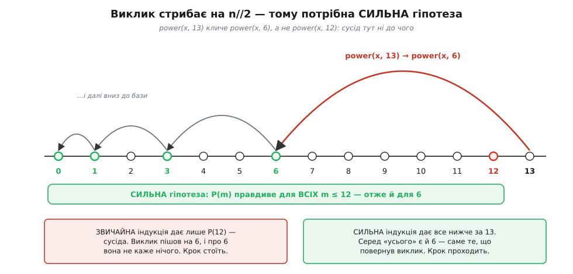
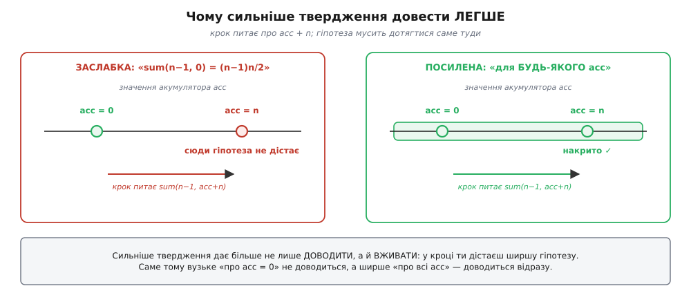
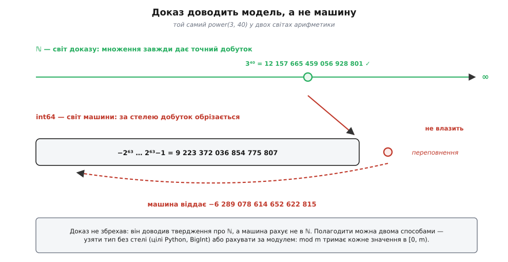

# ⚙️ Доводимо програму правильною: індукція на робочому коді

<preknowlist>
- [Рекурсія](topic:algorithms/recursion) — функція, що кличе саму себе на меншій задачі й спиняється на тривіальному випадку.
- [Проєктування за контрактом](topic:programming/design-by-contract) — передумова (борг викликача) і постумова (борг функції), записані на межах функції.
- [Принцип повного впорядкування](topic:math/well-ordering-principle) — у будь-якій непорожній множині натуральних чисел є найменший елемент, тож спускатися вниз нескінченно не можна.
- [Переповнення](topic:programming/overflow-wraparound) — машинний цілий тип має стелю, і за нею результат мовчки обрізається.
</preknowlist>

Ось два способи порахувати xⁿ. Перший очевидний: помножити x на себе n разів. Другий рахує те саме за **п'ятдесят три** множення там, де перший робить трильйон, і виглядає при цьому як фокус — щось про парність, щось про половину показника, чотири рядки, у яких нема жодного натяку на «помножити n разів». На всіх тестах, які ви написали, обидва дають однакову відповідь. Ви готові викинути очевидний і лишити фокус?

Саме тут «працює на моїх тестах» починає муляти. Тести перевіряють скінченний список точок, а замінюючи чесний цикл на фокус, ви стверджуєте щось про **всі** n одразу — про кожен вхід, який колись прийде з реальних даних. Перекрити нескінченний список скінченною роботою вміє рівно один інструмент, і в коді він живе під двома іменами: **рекурсія** й **інваріант циклу**. Тож візьмімо робочий код і розгорнімо доведення просто на його рядках — від специфікації до останньої пастки.

### Спершу — сказати, що саме доводимо

Найперша перешкода не математична, а мовна. «Функція правильна» — це не властивість коду. Код не буває правильним сам по собі, він буває правильним **щодо твердження про те, що він мусить робити**. Немає твердження — немає й що доводити: будь-яка програма бездоганно робить те, що вона робить.

Тому доказ починається зі специфікації — двох зобов'язань на межах функції. **Передумова** (лат. *prae* + *conditio* — «попередня умова») — це борг того, хто кличе: за яких входів функція взагалі щось обіцяє. **Постумова** — борг самої функції: що вона гарантує, якщо передумову дотримано. Разом вони утворюють [контракт](topic:programming/design-by-contract), і саме контракт перетворює туманне «працює» на твердження, яке можна довести або спростувати.

```
Специфікація power(x, n):
  ПЕРЕДУМОВА:  n — ціле, n ≥ 0
  ПОСТУМОВА:   power(x, n) = xⁿ
```

Тепер видно, що доводити. Позначмо P(n) — твердження «виклик `power(x, n)` повертає xⁿ». Це звичайне твердження про натуральне число, точнісінько таке, як «сума перших n чисел дорівнює n(n+1)/2», — лише йдеться в ньому не про формулу, а про поведінку виклику. Уся різниця з підручниковою індукцією вичерпується цим зсувом: замість рівності доводимо обіцянку функції. Механізм далі той самий.

### Ідея: одне множення подвоює показник

Перш ніж доводити, варто зрозуміти, звідки взявся виграш. Наївний спосіб додає до показника одиницю за одне множення: маючи xᵏ, ви множите на x і дістаєте xᵏ⁺¹. Дорога від нуля до n — n кроків.

А тепер погляньте на те саме множення інакше. Маючи xᵏ, помножте його **на себе**:

```
xᵏ · xᵏ = x^(k+k) = x^(2k)
```

Те саме одне множення — але показник не зріс на одиницю, а **подвоївся**. Ось і весь фокус: якщо рухатися не додаванням, а подвоєнням, до трильйона дістанешся за чотири десятки кроків, бо 2⁴⁰ вже за трильйон. Лишається дрібниця: показник не завжди парний, і самими лише подвоєннями з нуля не в кожне n влучиш. Тоді дивимося з іншого боку — не «як дорости до n», а «як звести n до меншого»: парне n = 2q дає xⁿ = (x^q)², непарне n = 2q+1 дає xⁿ = (x^q)²·x. В обох випадках задача про n звелася до задачі про q = n div 2 — удвічі меншого числа. Це і є рекурсія, і кожен її крок відрізає від показника половину.

Метод стародавній, і його родовід повчальний саме тим, як він розтягнутий у часі. У «Чхандах-шастрі» індійського вченого Пінґали (бл. II ст. до н. е.) вже стоїть правило подвоєння-піднесення: якщо число складів можна поділити навпіл — піднось до квадрата, якщо ні — відніми одиницю й подвой. Проте це ще не загальний метод: правило рахує лише степені двійки й живе всередині конкретної задачі про підрахунок віршових розмірів санскриту. А поширене твердження «Пінґала винайшов двійкове піднесення до степеня» варто брати обережно: фахова праця 2026 року, що перечитує першоджерела, показує — вторинні джерела здебільшого переказують одне одного, не звіряючись із самим текстом. Далі ідею вживають аль-Уклідісі (бл. 920–980) і аль-Біруні (973–1048): останній так рахує 2⁶⁴ у задачі про шахівницю, але знову ж таки в межах однієї задачі. Загальним правилом для довільного степеня метод виклав перський математик аль-Каші в «Міфтах аль-Хісаб» («Ключ арифметики», завершено 1427 року), подавши його як власний висновок. Дорога від «є ідея» до «є метод на всі випадки» зайняла півтори тисячі років — і ця відстань між влучним трюком і загальним правилом якраз і є та відстань, яку долає доказ.

### Робочий код

Ось той самий алгоритм трьома мовами. Кожна версія написана так, як цією мовою пишуть насправді, — і різняться вони не синтаксисом, а тим, **яка арифметика під ними лежить**; далі це виявиться найважливішим.

:::tabs
```python
def power(x, n):
    """xⁿ для цілого n ≥ 0. Цілі Python не мають стелі — множення точне завжди."""
    if n == 0:
        return 1
    half = power(x, n // 2)
    if n % 2 == 0:
        return half * half
    return half * half * x
```
```ts
// xⁿ для n ≥ 0. Тип bigint — не примха: number у JS це float64,
// точний лише до 2⁵³, і вже 3⁴⁰ округлилося б до …929000 замість …928801.
function power(x: bigint, n: bigint): bigint {
  if (n < 0n) throw new RangeError("показник має бути невід'ємний");
  if (n === 0n) return 1n;
  const half = power(x, n / 2n);   // ділення bigint одразу відкидає дріб
  return n % 2n === 0n ? half * half : half * half * x;
}
```
```cpp
#include <cstdint>

// xⁿ для n ≥ 0; unsigned робить «n ≥ 0» фактом типу, а не обіцянкою в коментарі.
// ПЕРЕДУМОВА: жодне проміжне множення не виходить за межі T (див. пастку нижче).
template <class T>
T power(T x, unsigned n) {
    if (n == 0) return T{1};
    T half = power(x, n / 2);
    return (n % 2 == 0) ? half * half : half * half * x;
}
```
:::

Чотири рядки суті. Тепер доведімо, що вони роблять обіцяне.

### База й крок — на цих-таки рядках

**База.** Дивимося на рядок `if n == 0: return 1`. Твердження P(0) — «виклик повертає x⁰» — перевіряється підстановкою: функція повертає 1, а x⁰ і є 1. Ніякої хитрості, база — це просто найменший випадок, який ми знаємо напряму.

```
n = 0:   power(x, 0) = 1 = x⁰   ✓
```

**Крок.** Беремо довільне n ≥ 1 і **припускаємо**, що для всіх менших чисел функція вже правильна. Рядок `half = power(x, n // 2)` — це і є місце, де припущення вступає в дію: ми не заглядаємо всередину виклику, ми **довіряємо** йому рівно так, як у доказі довіряють припущенню індукції. Виклик пішов на q = n div 2, отже за припущенням `half` = x^q. Далі — чиста алгебра двох гілок:

```
n парне, n = 2q:
  half = power(x, q) = x^q                       [припущення, бо q < n]
  повертаємо  half·half = x^q · x^q = x^(2q) = xⁿ            ✓

n непарне, n = 2q+1:
  half = power(x, q) = x^q                       [припущення, бо q < n]
  повертаємо  half·half·x = x^q · x^q · x = x^(2q+1) = xⁿ    ✓
```

Обидві гілки повертають xⁿ, тож P(n) доведено. Зверніть увагу, що `n // 2` дає q в **обох** випадках: для n = 2q ділення точне, для n = 2q+1 остача відкидається — і саме тому непарна гілка мусить домножити на x окремо. Ця одна-єдина `* x` і є весь слід відкинутої остачі.

База й крок на місці — отже, `power` правильна для кожного n ≥ 0. Не для перевірених, а для кожного.

### Чому сусіда тут замало

Ось тут ховається деталь, повз яку легко проскочити, а вона вирішальна. У кроці ми сказали «припускаємо, що для **всіх** менших чисел функція правильна» — і це не недбалість формулювання, а необхідність.

Погляньте, куди насправді йде виклик. Для n = 13 функція кличе себе не з 12, а з 6:

```
13 → 6 → 3 → 1 → 0
```

Звичайна індукція дала б у кроці рівно одне: P(12), твердження про безпосереднього сусіда. Але про 12 у коді немає ані слова — виклик пішов на 6, і P(12) про нього не каже нічого. Припущення про сусіда тут просто не стикується з тим, що робить програма.


*Виклик `power(x, 13)` стрибає одразу на 6, перескочивши 12, 11, 10, 9, 8 і 7. Звичайне припущення про сусіда (червоне 12) до цього стрибка не має стосунку. Рятує **сильна** форма: припускаємо P(m) для всіх m < n одразу — зелена смуга накриває всі числа нижче за 13, а серед них є й 6, куди справді пішов виклик.*

Рятує сильна форма припущення: беремо не одне P(n−1), а **всі** P(0), P(1), …, P(n−1) разом. Тоді P(6) — усередині припущення, і крок проходить. Правило просте й корисне: **форму індукції диктує не смак, а те, куди стрибає виклик**. Рекурсія, що спускається на сусіда n−1, задовольняється звичайною; рекурсія, що ділить навпіл, розгалужується на дві менші задачі чи стрибає на довільно менший випадок, вимагає сильної. Тому для алгоритмів [розділяй і володарюй](topic:algorithms/divide-and-conquer) сильна індукція — робочий стан, а не рідкісний випадок.

### Доказ, що спуск скінчиться

Перечитайте крок уважно — і побачите, що в ньому є діра. Ми сказали: «виклик повернув x^q». А звідки відомо, що він **узагалі повернув**? Доказ вище мовчки припустив, що рекурсія колись спиниться. Якщо ні — усі наші рівності правдиві й нікому не потрібні: функція просто ніколи не віддасть відповіді.

Це не педантизм, а межа між двома різними обіцянками. Те, що ми довели, зветься **частковою коректністю**: *якщо* виклик завершився, відповідь правильна. Обіцянка «завершиться й відповідь правильна» — це **повна коректність**, і на неї потрібен окремий доказ.

Доказ цей напрочуд короткий. Знайдімо **міру спуску** — невід'ємне ціле, яке щоразу строго меншає. Тут вона лежить на поверхні: сам показник n.

```
n ≥ 1  ⟹  n div 2 < n        міра строго спадає
n ≥ 0                         міра обмежена знизу
```

Далі працює сама будова натуральних чисел: [нескінченного спуску вниз не буває](topic:math/well-ordering-principle) — спадна послідовність невід'ємних цілих рано чи пізно впреться в нуль. Отже, ланцюг викликів мусить дійти до бази, і то швидко. Та сама величина, що в рекурсії зветься мірою спуску, у циклі зветься [варіантом](topic:programming/loop-invariants) — це одне поняття у двох одежах.

### Ціна теж доводиться індукцією

Приємна несподіванка: та сама машинерія, якою ми довели відповідь, доводить і **вартість**. Порахуймо множення. Позначмо M(n) — скільки їх робить `power(x, n)`. Парна гілка робить одне (`half*half`), непарна — два (`half*half*x`), плюс усе, що намножив вкладений виклик:

```
M(0) = 0
M(n) = M(n div 2) + 1     n парне
M(n) = M(n div 2) + 2     n непарне
```

Доведімо оцінку **M(n) ≤ 2·⌊log₂ n⌋ + 2** для n ≥ 1 — тією ж сильною індукцією:

```
База n = 1:   M(1) = M(0) + 2 = 2 = 2·0 + 2 = 2·⌊log₂ 1⌋ + 2   ✓

Крок n ≥ 2:   q = n div 2 ≥ 1,  і  ⌊log₂ q⌋ = ⌊log₂ n⌋ − 1
              (бо якщо 2ᵏ ≤ n < 2ᵏ⁺¹, то 2ᵏ⁻¹ ≤ n div 2 < 2ᵏ)

  M(n) ≤ M(q) + 2                     гірший випадок — непарне n
       ≤ (2·⌊log₂ q⌋ + 2) + 2         [припущення, бо q < n]
       = 2·(⌊log₂ n⌋ − 1) + 4
       = 2·⌊log₂ n⌋ + 2               ✓
```

Оцінка доведена — і це вже не «на моїх замірах вийшло швидко», а гарантія на будь-який вхід: [логарифмічна складність](topic:algorithms/asymptotic-complexity) як доведений факт. Для n = 10¹² вона обіцяє щонайбільше 80 множень; насправді їх 53 — проти трильйона в наївного способу. Оце й є та підстава, на якій очевидний цикл можна викинути без страху.

### Коли припущення заслабке — і його доводиться посилити

Тепер найкорисніше, що індукція робить із програмістом. Візьмімо просту хвостову рекурсію — суму з **акумулятором**, тим, що накопичує проміжний підсумок:

```python
def sum_acc(n, acc=0):
    if n == 0:
        return acc
    return sum_acc(n - 1, acc + n)
```

Хочемо довести очевидне: `sum_acc(n, 0)` дає n(n+1)/2. Спробуймо — і застрягнімо:

```
Твердження P(n):   sum_acc(n, 0) = n(n+1)/2

Крок:      sum_acc(n, 0) = sum_acc(n−1, 0+n) = sum_acc(n−1, n)
Припущення каже про:      sum_acc(n−1, 0)          ← acc = 0
А нам потрібне про:       sum_acc(n−1, n)          ← acc = n
                          ↑ про це припущення мовчить. Крок стоїть.
```

Провал показовий. Програма правильна — а доказ не йде. Причина не в коді, а в тому, що **твердження надто вузьке**: воно говорить лише про виклики з acc = 0, тоді як рекурсія миттю виходить за межі цього випадку, бо кожен крок кладе в акумулятор щось нове.


*Ліворуч: вузьке твердження знає лише про acc = 0, а крок питає про acc = n — і дістає мовчанку. Праворуч: посилене твердження накриває всю вісь акумулятора, тож хоч куди крок ступить, припущення там уже є. Ширше твердження важче на вигляд, але легше довести — бо в кроці ти дістаєш і ширше припущення.*

Ліки виглядають як крок у протилежний бік: доводьмо **сильніше** твердження — не про нуль, а про будь-який акумулятор.

```
Твердження P(n):  для БУДЬ-ЯКОГО acc:  sum_acc(n, acc) = acc + n(n+1)/2

База n = 0:   sum_acc(0, acc) = acc = acc + 0·1/2                        ✓

Крок:  sum_acc(n, acc) = sum_acc(n−1, acc+n)
                       = (acc+n) + (n−1)n/2        [припущення — з acc+n замість acc]
                       = acc + n + (n² − n)/2
                       = acc + (2n + n² − n)/2
                       = acc + (n² + n)/2
                       = acc + n(n+1)/2                                  ✓
```

Пройшло. А те, чого ми хотіли спочатку, дістається підстановкою acc = 0.

Ось у чому суть, і вона по-справжньому несподівана: **сильніше твердження буває легше довести, ніж слабше**. Річ у тім, що в індукції твердження працює на два боки. Те, що ви доводите, ви ж потім і **вживаєте** в кроці як припущення. Посилюючи твердження, ви берете на себе більший обов'язок — але й дістаєте потужніший інструмент, і цей другий бік переважує. Вузьке «про acc = 0» не доводиться взагалі; широке «про всі acc» доводиться за чотири рядки.

> 🔧 **Навіщо це.** Коли доказ (або просто ваше пояснення, чому код правильний) уперся й не йде, перший рефлекс — лізти правити код. Часто винен не код, а **надто вузьке твердження**: ви намагаєтеся довести щось лише про кінцеву відповідь, тоді як програма щокроку робить щось із проміжним станом. Спитайте себе не «де баг», а «що тут істинне на **кожному** кроці, а не лише наприкінці» — і доказ зрушить сам. Це той самий рух, яким пишуть інваріант циклу, і та сама причина, чому досвідчений інженер формулює його перед тим, як писати тіло, а не після.

### Цикл — та сама індукція за номером оберту

Розгорніть ту саму суму циклом — і побачите, що доказ нікуди не подівся, лише перевдягнувся:

```python
def sum_loop(n):
    acc = 0
    i = 0
    while i < n:
        # ІНВАРІАНТ перед кожним обертом:  acc = i(i+1)/2
        i += 1
        acc += i
    return acc
```

Індукція тут іде за номером оберту, а твердження, яке нею доводять, зветься [інваріантом циклу](topic:programming/loop-invariants): «acc = i(i+1)/2». Перед першим обертом i = 0 і acc = 0 — база тримається. Оберт бере i' = i+1 і acc' = acc + i' = i(i+1)/2 + (i+1) = (i+1)(i+2)/2 = i'(i'+1)/2 — крок тримається. Виходимо з i = n, і інваріант віддає готове acc = n(n+1)/2.

А тепер зіставте два твердження, які ми щойно довели:

```
рекурсія:  для будь-якого acc:  sum_acc(n, acc) = acc + n(n+1)/2
цикл:      перед кожним обертом:  acc = i(i+1)/2
```

Це не схожі речі — це той самий хід. Обидва відмовляються говорити лише про **кінцеву відповідь** і натомість пришпилюють проміжний стан: що істинне про акумулятор посеред роботи. Посилення припущення в рекурсії й інваріант у циклі — дві вимови одного речення. Тому й не дивно, що вони конвертуються одне в одне майже механічно: хвостова рекурсія з акумулятором — це цикл, а посилене припущення — його інваріант.

І ось обіцяна винагорода. Інваріант на виході дав рівність `acc = n(n+1)/2` — доведену для всіх n. Отже, цикл і формула `n*(n+1)//2` — це та сама функція, а не «збіглося на тестах». Ось тепер цикл можна викинути й лишити формулу: не тому, що заміна пройшла регресію, а тому, що доведено — розбіжності немає ніде. Доведена рівність двох реалізацій і є ліцензія на оптимізацію.

### Три пастки

Доказ на робочому коді ламається не там, де підводить алгебра, а в трьох цілком передбачуваних місцях.

**Пастка перша: довіряти можна лише меншому.** Припущення індукції дозволено вживати рівно для випадків, менших за поточний. Порушите це — і доказ стане хибним колом, а програма покаже вам це коло наочно:

```python
def power_bad(x, n):
    if n == 0:
        return 1
    half = power_bad(x, (n + 1) // 2)   # «округлимо вгору — так симетричніше»
    if n % 2 == 0:
        return half * half
    return half * half * x
```

Виглядає невинно, та на n = 1 маємо (1+1)//2 = 1: виклик пішов **сам у себе**. Міра спуску не зменшилася — і `power_bad(2, 1)` не помиляється в обчисленні, а падає з `RecursionError`, [переповнивши стек](topic:programming/stack-overflow). У доказі це був би рядок «P(1) правдиве, бо P(1) правдиве» — та сама порожня заява, лише машина вимовляє її вголос. Тут добре видно, чому індукція взагалі не є хибним колом: усе тримається на тому, що спуск іде **строго вниз** і колись мусить упертися в базу. Забрали строгість — і від індукції лишилося саме коло. Звідси практичне правило: назвіть міру спуску вголос і перевірте кожну гілку — чи справді після неї величина менша.

**Пастка друга: база мусить накрити все, куди спуск сягає.** База — не «перший випадок», а **всі** випадки, на яких рекурсія спиняється й з яких її можуть покликати:

```python
def power_base1(x, n):
    if n == 1:                    # база лише на одиниці
        return x
    half = power_base1(x, n // 2)
    if n % 2 == 0:
        return half * half
    return half * half * x
```

Для n ≥ 1 воно чесно працює: `power_base1(2, 5)` дає 32. Але передумова каже n ≥ 0, тобто n = 0 — законний вхід, а бази на нього немає: `power_base1(2, 0)` кличе себе з 0 і крутиться, доки не скінчиться стек. Тип теж не рятує — у C++ `unsigned n` гарантує «не від'ємне», і нуль цю гарантію чудово задовольняє. Правило: перелічіть усі випадки, де спуск спиняється, звірте їх із передумовою — і переконайтеся, що на кожен є база.

**Пастка третя: доказ доводить модель, а не машину.** Ця — найтонша й найдорожча. Перечитайте крок: ми написали `x^q · x^q = x^(2q)`. У ℕ це залізна правда. У `int64` — ні:


*Доказ жив у ℕ, де множення завжди дає точний добуток. Машина рахує в скінченному типі зі стелею: 3⁴⁰ за неї не влазить, і замість 12 157 665 459 056 928 801 `int64` віддає −6 289 078 614 652 622 815. Доказ не збрехав — просто твердження, яке довели, було не про ту арифметику, у якій потім рахували.*

`power(3, 40)` на `int64` повертає **від'ємне** число — при тому, що доказ бездоганний, а код точно відповідає доказові. Суперечності немає: ми довели твердження про ℕ, а виконали його над типом, який ℕ не є. Рівність `x^q · x^q = x^(2q)` — це прихована передумова, яка на машині просто хибна. Доказ рівно настільки сильний, наскільки чесно його припущення описують те залізо, на якому все крутиться.

Звідси видно, чому три вкладки вище різняться не косметично. Цілі Python не мають стелі — доказ переноситься на них слово в слово. У TypeScript `number` — це float64, точний лише до 2⁵³: він не обрізав би 3⁴⁰, а **округлив** до 12 157 665 459 056 929 000, тому єдиний чесний вибір там — `bigint`. А C++ дає швидкість, але вимагає передумову проговорити явно й самому за неї відповідати.

Полагодити можна двома способами. Узяти тип без стелі — і платити за це швидкістю. Або зробити те, що робить справжній код: рахувати **за модулем**, бо саме модульний степінь потрібен у криптографії на кшталт [RSA](topic:algorithms/rsa), де показники астрономічні, а результат усе одно береться mod m:

```python
def power_mod(x, n, m):
    """xⁿ mod m. Кожне значення лишається в [0, m) — доказ виживає на машині."""
    if m == 1:
        return 0
    if n == 0:
        return 1
    half = power_mod(x, n // 2, m)
    sq = half * half % m
    return sq if n % 2 == 0 else sq * x % m
```

Доказ той самий — база й крок слово в слово, лише рівності тепер за модулем. Але вигода принципова: mod тримає кожне значення в [0, m), тож числа більше не тікають у нескінченність, і твердження про модель знову збігається з тим, що робить машина. Але й тут є остання дрібниця: `half` менше за m, проте **добуток** `half*half` сягає майже m², і саме він мусить улізти в тип. У Python це байдуже, а в C++ на `uint64_t` це означає або m < 2³², або проміжне множення через 128-бітний тип. Пастка третя тим і підступна, що повертається на кожному рівні: полагодивши модель, звірте з машиною ще й **проміжні** значення, а не лише кінцеві.

---

Отже, доведення програми — це не окремий обряд для теоретиків, а та сама індукція, розгорнута на робочих рядках. Спершу **контракт**: без передумови й постумови доводити нічого. Далі **база** — найменші випадки, які знаємо напряму, і їх мусить бути стільки, скільки місць, де спуск спиняється. Далі **крок**: рекурсивний виклик — це і є місце, де вживається припущення, а форму індукції диктує те, куди стрибає виклик: на сусіда — звичайна, на половину — сильна. Окремо доводиться **завершення** — через міру спуску, що строго меншає й не має куди падати нижче нуля; без нього обіцянка лишається частковою. Тією ж індукцією доводиться й **ціна** алгоритму. Коли доказ не йде, винне зазвичай не тіло функції, а надто вузьке твердження — його треба **посилити**, і те саме посилення в циклі зветься інваріантом. А остання, найчесніша межа методу — та, що доказ говорить про модель: перевірте, чи ваша машина справді така, якою ви її в доказі уявили. Пройшовши цей шлях, ви дістаєте те, чого не дає жодна кількість зелених тестів: право сказати «працює завжди» й мати на це підставу.
