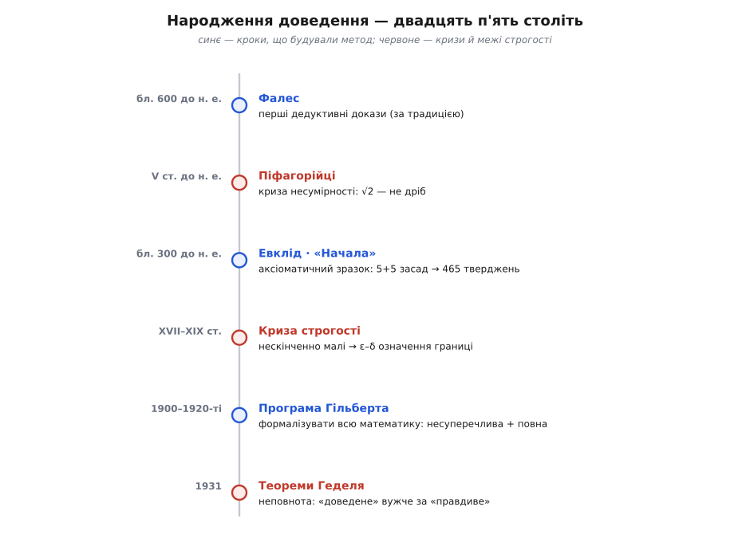

# 📜 Як народилося доведення: від Евкліда до Геделя

Думка, що математичне твердження треба **довести** — не виміряти, не прийняти на віру старших, не повірити тому, що воно тисячу разів спрацювало, — здається нам такою природною, що ми забуваємо: це винахід. У неї є місце народження й час народження. Вавилоняни за тисячу років до греків уміли розв'язувати квадратні рівняння, а на глиняній табличці Plimpton 322 лишили довгий стовпчик того, що ми звемо піфагоровими трійками — цілих сторін прямокутних трикутників. Єгипетські писарі рахували площі й об'єми зерносховищ без жодної похибки. Але серед усіх цих текстів немає жодного **доведення**. Є рецепт: «зроби так, потім так — і вийде правильно». Немає питання, яке відрізняє математику від куховарства: **а чому інакше бути не може?**

Ось цей поворот — від «як порахувати» до «чому це неминуче» — і стався в грецькому світі приблизно між VI і III століттями до н. е. Простежмо, як він народжувався, через які кризи пройшов і чому через двадцять три століття вперся в межу, яку поставив один тихий двадцятичотирирічний логік.

### Фалес: перша спроба спитати «чому»

За традицією першим, хто вимагав доводити, а не показувати, називають Фалеса Мілетського (Thalēs, Θαλῆς; бл. 624 — бл. 547 до н. е.) — купця, інженера й астронома з іонійського Мілета. Йому приписують кілька геометричних тверджень: що діаметр ділить коло навпіл, що кути при основі рівнобедреного трикутника рівні, що вертикальні кути рівні, що кут, вписаний у півколо, — прямий.

Тут одразу треба бути чесним щодо доказовості. Жодного рядка самого Фалеса не збереглося. Усе, що ми про нього «знаємо», дійшло через Прокла (Próklos, V ст. н. е.) — коментатора, який жив **через тисячу років** і переказував уже втрачену «Історію геометрії» Евдема Родоського (Eúdēmos, IV ст. до н. е.). Тобто перед нами не документ, а переказ переказу. Тому «Фалес довів» — це **традиція**, правдоподібна, але непідтверджена; історично точніше сказати, що грецька традиція вважала його за того, з кого почалася сама ідея доведення.

Але сама ідея — ось що важить, хто б її не запустив. Різниця між єгипетським писарем і грецьким геометром не в тому, ЩО вони знали (рівні вертикальні кути видно й так), а в тому, що грек уперше спитав: чи можу я показати, що це **мусить** бути так, спираючись лише на прийняте раніше? Не «я поміряв багато кутів», а «ось міркування, після якого не поміряти вже не можна». Це зародок — поки що ідея, не система.

### Піфагорійці й тріщина у світі чисел

Наступний крок зробила спільнота, для якої математика була майже релігією. Піфагор (Pythagóras, Πυθαγόρας; бл. 570 — бл. 495 до н. е.) і його послідовники поклали в основу свого світогляду гасло, яке можна перекласти як «усе є число». Під числом вони розуміли ціле, а всі відношення в світі мали, за їхньою вірою, виражатися відношенням цілих — дробом *p*/*q*. Гармонія струни, рух планет, будова речей — усе мало зводитися до пропорцій цілих чисел. Це була не лише математика, а картина всесвіту.

І саме доведення цю картину розбило. Візьміть найпростішу фігуру — квадрат зі стороною одиниця — і його діагональ. За теоремою, що носить ім'я їхнього ж учителя, довжина діагоналі дорівнює тому числу, яке піднесене до квадрата дає два, тобто √2. Питання просте: яким дробом *p*/*q* воно записується? І тут піфагорійці натрапили на неможливе.

```
Припустимо √2 = p/q (нескоротний дріб). Тоді p² = 2q².
Значить p² парне → p парне → p = 2m → 4m² = 2q² → q² = 2m² → q парне.
Але тоді p і q ОБИДВА парні — а ми брали дріб нескоротним.
Суперечність. Отже, такого дробу немає взагалі.
```

Діагональ і сторона квадрата **несумірні** (гр. *asýmmetros* — «без спільної міри»): немає такого відрізка, хай найдрібнішого, який укладеться в обох ціле число разів. А число √2 — **нераціональне**, тобто жодним дробом його не записати. Це не була похибка вимірювання, яку можна уточнити кращою лінійкою; це була доведена неможливість, залізна, як сама теорема. Світ виявився складнішим за гасло «усе є число».

Тут доведення вперше показало свою моторошну силу: воно спроможне встановити істину, **проти якої повстає інтуїція**, і встояти. Ніхто б не «побачив» несумірність оком — її можна лише вивести. Це перша велика криза строгості в історії й водночас перший тріумф методу: те, що вбило піфагорійську віру, було не сумнівом, а доказом.

З цим відкриттям зрослася легенда — і її треба назвати легендою прямо. Кажуть, ніби піфагорієць Гіппас із Метапонта (Híppasos, Ἵππασος), що розголосив таємницю несумірності, за це поплатився життям: товариші втопили його в морі. Ця історія — **не факт**. Її джерела пізні й суперечать одне одному: Ямвліх (Iámblichos, III ст. н. е.) переказує кілька несумісних версій — то Гіппаса вигнали, то втопили, і то за несумірність, то зовсім за інше (побудову правильного додекаедра в сфері); Папп (Páppos, IV ст. н. е.) взагалі не називає імені, а лише каже, що якийсь піфагорієць загинув у морі. Тобто навіть **що саме** відкрив Гіппас, джерела певно не знають, а драму з утопленням дописала пізніша традиція. Розрізняймо чітко: **факт** — що піфагорійці довели несумірність; **легенда** — хто персонально це зробив і що з ним сталося.

### Евдокс: як приборкали першу кризу

Криза несумірності могла зруйнувати всю грецьку геометрію: якщо не всі величини співмірні, то як узагалі говорити про пропорції — про те, що «*a* відноситься до *b*, як *c* до *d*», коли ані *a*/*b*, ані *c*/*d* не є дробами? Відповідь дав Евдокс Кнідський (Eúdoxos, Εὔδοξος; бл. 408 — бл. 355 до н. е.), і вона стала зразком того, як математика виходить із кризи — не запереченням проблеми, а **точнішим означенням**.

Евдокс переозначив, що означає рівність двох відношень, так, щоб означення працювало й для несумірних величин. Його ідея (вона лежить у V книзі «Начал», означення 5) звучить так: два відношення рівні, якщо **для будь-яких** цілих *m* і *n* нерівність між *m*-кратним одного й *n*-кратним другого виконується узгоджено з обох боків. Тут варто затриматися: щоб приборкати нескінченне й невимовне дробом, Евдокс уводить оберт «для будь-яких *m*, *n*». Це та сама конструкція «для всіх, хоч би які великі», яку через дві тисячі років математики XIX століття покладуть в основу означення границі. Перша криза строгості вже намацала ліки, якими лікуватимуть другу.

### «Начала» Евкліда: перший великий зразок

І ось на цьому ґрунті — накопичених доведень, пережитої кризи, відточених означень — з'являється книга, що на дві з лишком тисячі років стане самим синонімом слова «математика». Близько 300 року до н. е. Евклід (Eukleídēs, Εὐκλείδης) в Александрії зводить усе відоме на той час у єдину будівлю — «Начала» (Stoicheîa). Про самого Евкліда ми знаємо до прикрого мало — майже нічого певного, крім часу й міста. Але його книга збереглася, і саме вона, а не легенди про автора, змінила математику.

Революційним було не так те, що там доведено, як **те, як усе влаштовано**. Евклід починає з відкрито названого фундаменту й нічого не бере зі стелі. У першій книзі це:

```
23 ОЗНАЧЕННЯ — що таке точка, лінія, коло, прямий кут…
 5 ПОСТУЛАТІВ — суто геометричні дозволи, напр.:
     1. через дві точки можна провести пряму;
     3. з будь-якого центра будь-яким радіусом можна описати коло;
     5. (про паралельні) — славнозвісний, найгроміздкіший
 5 СПІЛЬНИХ ПОНЯТЬ — загальнологічні істини, напр.:
     · рівні тому самому рівні між собою;
     · ціле більше за частину.
```

А далі — самий метод. Кожне наступне твердження виводиться **лише** з означень, постулатів, спільних понять і вже доведених раніше тверджень — і ні з чого більше. Перша книга дає 48 таких тверджень; уся праця з тринадцяти книг наростає до **465 тверджень**, і кожне стоїть на плечах попередніх, як камінь на камені. Це і є аксіоматичний метод, показаний уперше в повний зріст: не збірка окремих істин, а **єдиний ланцюг**, протягнутий від жменьки прийнятих засад до сотень висновків.

Настільки переконливим був цей зразок, що «Начала» стали еталоном строгого мислення на понад дві тисячі років — за ними вчилися Ньютон і Спіноза, а Авраам Лінкольн, за власним зізнанням, студіював Евкліда, щоб навчитися доводити. Філософське підґрунтя дав Аристотель (Aristotélēs; 384—322 до н. е.): у «Другій аналітиці» він описав, як має бути влаштована доказова наука — з перших начал, що приймаються без доведення, через ланцюг висновків. Евклід, молодший за Аристотеля десь на покоління, дав цій схемі бездоганне втілення — систему, а не просто ідею чи окремий приклад.

Одна тріщинка, щоправда, лишилася в самому фундаменті. П'ятий постулат — про паралельні — був надто громіздкий, надто схожий на теорему, щоб спокійно стояти серед простих дозволів. Двадцять століть математики намагалися **вивести** його з решти, щоб позбутися незручності. Не вивели — бо, як з'ясувалося аж у XIX столітті, він від решти **незалежний**: замінивши його іншим, дістаєш несуперечливу, але **неевклідову** геометрію, де сума кутів трикутника не дорівнює 180°. Спроба причепуритися до фундаменту Евкліда несподівано відкрила цілі нові світи.

### Дві тисячі років еталону — і повернення тріщин

Довгий час здавалося, що Евклід закрив питання строгості назавжди. Але у XVII столітті Ньютон (Isaac Newton) і Ляйбніц (Gottfried Leibniz) винайшли числення нескінченно малих — інструмент небаченої сили, що описав рух планет і потік рідин. Проблема була в тому, що стояло воно на понятті, якого ніхто не міг чітко означити: на «нескінченно малій величині», яка то дорівнює нулю (коли нею зручно знехтувати), то не дорівнює (коли на неї ділять). Це вже не була евклідова чистота.

Найдошкульніше про це сказав не математик, а філософ — єпископ Джордж Барклі (George Berkeley) у трактаті «Аналітик» (*The Analyst*, 1734). Про ті самі нескінченно малі прирости він в'їдливо спитав: а що ж це таке?

```
«Це ні скінченні величини, ні величини нескінченно малі,
 ані все ж таки ніщо. Чи не назвати їх привидами
 спочилих величин?»
```

Барклі не заперечував, що числення дає **правильні** відповіді — астрономія це щодня підтверджувала. Він бив у інше: **міркування** нечесне, висновок правильний випадково, бо в ньому ділять на щось, що потім оголошують нулем. А ми вже бачили на прикладі «доказу» 2 = 1, що один незаконний крок валить будь-яку певність. Півтора століття математика користувалася могутнім знаряддям, не вміючи довести, чому воно працює.

Розплата прийшла у XIX столітті — і формою була та сама, що колись у піфагорійців: доведений факт, проти якого повстає інтуїція. 1872 року Карл Ваєрштрас (Karl Weierstraß; 1815—1897) пред'явив функцію, **неперервну в кожній точці, але в жодній точці не диференційовну** — суцільну лінію без жодної гладенької дотички, зубчасту наскрізь, на скільки не збільшуй. Ціле століття геометрична інтуїція нашіптувала, що неперервна крива «майже скрізь» гладенька; Ваєрштрасове чудовисько показало, що інтуїція просто бреше, а доведення, яке на неї спиралося, — діряве. Стало ясно: далі так не можна, поняття треба означити наново, з нуля, без жодної опори на «очевидне з малюнка».

Цю роботу зробили троє. Празький математик і священник Бернард Больцано (Bernard Bolzano; 1781—1848) ще 1817 року дав точне означення неперервності, але його праці лишалися майже непоміченими. Оґюстен-Луї Коші (Augustin-Louis Cauchy; 1789—1857) у «Курсі аналізу» (*Cours d'analyse*, 1821) поставив у центр поняття **границі** й спробував вивести з нього все числення. А довершив справу Ваєрштрас, давши тій границі остаточне, суто арифметичне означення — те саме «ε–δ», що досі вивчають студенти:

```
границя функції дорівнює L, якщо
   для будь-якого ε > 0 (хоч би якого малого)
   знайдеться δ > 0 таке, що
   як тільки |x − a| < δ, то |f(x) − L| < ε.
```

Погляньте на скелет цього означення: «для будь-якого ε… знайдеться δ…». Це той самий оберт «для всіх, хоч би які великі», яким Евдокс дві тисячі років тому приборкав несумірність. Криза строгості повторилася — і ліки виявилися тієї самої природи: вигнати з математики розпливчасті образи й лишити самі скінченні, перевірні твердження про «всі» та «існує». Математика вдруге стала строгою — тепер, здавалося, вже назавжди.

### Мрія Гільберта: замкнути математику

Наприкінці XIX століття цю тягу до остаточної строгості підхопив Ґеорг Кантор (Georg Cantor), звівши всю математику до єдиної основи — теорії множин, науки про сукупності. Але щойно фундамент зробили спільним для всього, у ньому знайшли нову тріщину, найглибшу з усіх. 1901 року Бертран Расселл (Bertrand Russell) виявив у наївному понятті множини пряму суперечність (розгляньмо «множину всіх множин, які не містять самі себе» — і спитаймо, чи містить вона себе; обидві відповіді ведуть до безглуздя). Лист Расселла 1902 року застав Ґотлоба Фреге (Gottlob Frege) саме тоді, коли той дописував багаторічну працю про основи арифметики: паради́кс показував, що аксіоми, на яких Фреге все будував, **суперечливі**. Основи математики знову захиталися.

На цей виклик відповів найбільший математик епохи — Давід Гільберт (David Hilbert; 1862—1943) з Ґеттінгена. Його задум, що дозрів до повної форми у 1920-х (а корінням сягав 1900 року), був грандіозний, як усе, що він робив. Гільберт хотів раз і назавжди поставити математику поза сумнівом — записати **всю** її як формальну систему, гру за жорсткими правилами зі скінченним списком аксіом, а тоді довести про цю систему дві речі:

- **несуперечливість** — що з аксіом ніколи не вивести водночас і твердження, і його заперечення (жодного нового Расселлового парадоксу);
- **повноту** — що для **кожного** осмисленого твердження система вміє довести або його, або його заперечення, тож нерозв'язних питань не лишиться взагалі.

Це була мрія про математику як досконалий, замкнений механізм: заведи його правильно — і він, у принципі, перемеле будь-яке питання до відповіді «так» або «ні». 8 вересня 1930 року в Кенігсберзі — своєму рідному місті — Гільберт, ідучи на спочинок, виголосив по радіо мову, що скінчилася гаслом, викарбуваним згодом на його надгробку:

```
Wir müssen wissen.  Wir werden wissen.
Ми мусимо знати.   Ми будемо знати.
```

Це був зеніт віри в силу доведення. Здавалося, лишилося тільки дотиснути технічні деталі — і математика назавжди стане повною й несуперечливою.

### Гедель: межа, яку не обійти

Гільберт не знав, що напередодні його промови все вже впало. За день до тієї радіомови, 7 вересня 1930 року, на тому самому кенігсберзькому з'їзді, у скромній секційній дискусії, двадцятичотирирічний австрійський логік Курт Гедель (Kurt Gödel; 1906—1978) стиха повідомив результат, який робив Гільбертову мрію **нездійсненною в принципі**. Майже ніхто в залі не второпав ваги сказаного — окрім Джона фон Неймана (John von Neumann), який миттю все зрозумів і за кілька днів надіслав Геделю листа з наслідком, що той сам ще не встиг виснувати.

1931 року Гедель опублікував доведення повністю — у праці з промовистою назвою «Про формально нерозв'язні твердження Principia Mathematica та споріднених систем». Він довів дві теореми, що назавжди окреслили межі формалізації.

**Перша теорема про неповноту.** Будь-яка несуперечлива формальна система, досить багата, щоб містити звичайну арифметику, приречена бути **неповною**: у ній існують правдиві твердження, які вона не може довести. Гедель зробив нечуване — навчився кодувати самі твердження системи числами, а тоді збудував усередині неї речення, що по суті каже про себе: «мене в цій системі не можна довести». Якщо система його доводить — вона доводить хибне й тому суперечлива; якщо не доводить — воно правдиве, але недоведенне. Хоч так, хоч так повнота недосяжна.

**Друга теорема про неповноту.** Та сама система не здатна довести навіть власну **несуперечливість** — саме те, що найдужче хотів довести Гільберт. Щоб пересвідчитися, що твоя математика не приховує суперечності, довелося б вийти за її межі, у ще сильнішу систему, про несуперечливість якої знову нічого не скажеш зсередини.

Мрія розбилася об ці два твердження начисто. Повної формалізації **не буде** — не через брак старання, а через логічну неможливість. І ось найтонше, що варто вловити: Гедель не показав, що доведення ненадійні. Він показав протилежне — що вони **чесні до останку**. «Доведене» виявилося назавжди вужчим за «правдиве»: хоч який список аксіом ти візьмеш, істина завжди переллється через його край. Математика не механізм, який колись домелеться до останньої відповіді, а жива, відкрита справа, де завжди буде що відкривати. Докладніше про будову й наслідки цих теорем — у нарисі [теореми Геделя про неповноту](book:math/godel-incompleteness); а про те, як узагалі можна записати математику як гру символів, у якій «довести» стає перевірною механічною операцією, — у статті [формальна мова](book:math/formal-language), без якої задум Гільберта не має сенсу.


*Двадцять п'ять століть однієї ідеї. Синім позначено кроки, що **будували** метод (Фалес, Евклід, Гільберт), червоним — **кризи й межі** (несумірність, розхитані основи числення, теореми Геделя). Історія доведення пульсує: щоразу, коли інтуїція заводить у безвихідь, рятує не відмова від строгості, а строгість іще гостріша — точніше означення, чесніший фундамент.*

### Що лишилося нам

Ідея, народжена в грецькій геометрії, пройшла крізь усе це неушкодженою — навпаки, лише загартувалася. Кожна криза, від несумірності до Геделя, забирала якусь ілюзію (що все є дроб; що інтуїція надійна; що математику можна замкнути), але **саме доведення** щоразу виходило сильнішим і чеснішим. Сьогодні, коли ланцюг міркувань записують настільки формально, що його рядок за рядком перевіряє комп'ютер, ми ближче до Евклідового ідеалу, ніж будь-коли: доказ знову став тим, чим був у нього, — послідовністю кроків, кожен з яких видно й можна оскаржити.

Тож коли математик каже «це доведено», за цими двома словами стоять двадцять п'ять століть: іонійський купець, що вперше спитав «чому»; спільнота, чию віру розбив власний доказ; александрійська книга, яка показала, як зводити істину з названого фундаменту; троє, що наново означили границю; і тихий логік, який довів, що межа є — і що саме тому справа лишається живою.
