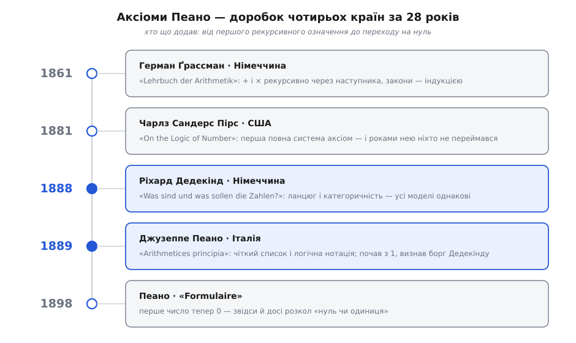
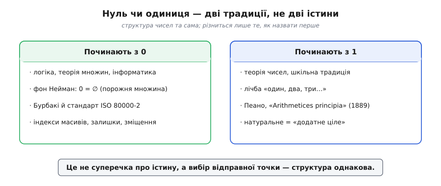

# 📜 Аксіоми, у яких четверо батьків

Ім'я Джузеппе Пеано (італ. *Giuseppe Peano*) на цих п'яти правилах — почасти історична випадковість. Пеано був **останнім** із чотирьох, хто до них доклався; він **першим чесно визнав**, що серцевину взяв не сам, — і саме його прізвище прикипіло намертво. За звичною назвою «аксіоми Пеано» ховається неспішна естафета завдовжки майже три десятиліття, і бігли її люди з різних країв: німецький учитель гімназії, американський логік-самоук, німецький теоретик чисел і, вже наприкінці, італієць. Жоден не працював у порожнечі, жоден не сказав останнього слова наодинці.

Ця історія варта того, щоб її розказати чесно, — бо вона показує, як насправді народжуються ідеї в математиці: не спалахом одного генія, а перекладанням естафетної палички, де кожен бачить трохи далі за попереднього й підхоплює те, що той лишив недоказаним. Ось уся ця естафета одним поглядом, а тоді пройдімо її крок за кроком.


*Майже тридцять років і чотири країни на п'ять правил. Ґрассман дав рекурсію, Пірс — першу повну (і непомічену) систему, Дедекінд — глибинну структуру й доказ єдиності, Пеано — чітку нотацію й розголос. Синім — ті двоє, чиї імена лишилися на аксіомах.*

## Навіщо доводити те, що й так очевидно

Спершу дивує сама постановка: кому й нащо здалося **доводити** твердження на кшталт «*a* + *b* = *b* + *a*»? Дитина знає, що два яблука й три яблука — це те саме, що три й два. Що тут доводити?

Відповідь визріла в математиці XIX століття, і визріла з болю. Ціле сторіччя аналіз — числення нескінченно малих, границі, ряди — стояв на інтуїції, і ця інтуїція раз у раз підводила: ряди, що «очевидно» збігалися, давали безглузді суми; «неперервні» криві виявлялися то з дотичною, то без. Огюстен-Луї Коші (фр. *Cauchy*), а за ним Карл Ваєрштрасс (нім. *Weierstraß*) заходилися ставити аналіз на тверду основу — зводити всі його хисткі поняття до чогось простішого й надійнішого. І дно, до якого все зводили, виявилося одне: **число**. Границя — це про числа, неперервність — про числа, дійсне число будували з раціональних, раціональне — з цілих, а ціле — з натуральних. Цей рух назвали **арифметизацією аналізу**: усю велику будівлю сперли на 1, 2, 3, …

І тут-таки постало незручне питання. Якщо натуральні числа — фундамент усього, то на чому стоять **вони самі**? Леопольд Кронекер (нім. *Kronecker*) відповідав зухвало: ні на чому, вони просто дані. За переказом Генріха Вебера (нім. *Weber*) — у некролозі Кронекера 1893 року — той якось кинув: «Цілі числа створив Господь, решта — діло рук людських». Тобто натуральні числа — не тема для доведень, а вихідний матеріал.

Але не всіх це вдовольняло. Якщо ми беремо числа за дар небес, то мовчки припускаємо цілу купу «очевидних» їхніх властивостей — а математика саме тоді вчилася не довіряти очевидному без доказу. Треба було виписати чорним по білому: що **саме** ми про натуральні числа припускаємо, з чого все інше має випливати. Не тому, що хтось сумнівався, що двічі два чотири, а тому, що хотілося **побачити весь список** припущень — і переконатися, що він короткий, несуперечливий і що з нього справді росте вся арифметика. Ось це бажання — виписати мінімальний список — і запустило нашу естафету.

## Ґрассман: рекурсія у шкільному підручнику (1861)

Першим, хто зробив вирішальний крок, був Герман Ґрассман (нім. *Hermann Günther Grassmann*, 1809–1877) — німець зі Штеттіна, постать сумної долі. Його головну працю з лінійної та зовнішньої алгебри (*Ausdehnungslehre*) сучасники не зрозуміли й майже не читали; розчарований, Ґрассман під старість покинув математику й став визнаним знавцем санскриту. А тим часом у скромному шкільному підручнику — «Підручник арифметики для вищих навчальних закладів» (нім. *Lehrbuch der Arithmetik für höhere Lehranstalten*, 1861) — він зробив те, що згодом ляже в самісіньке осердя аксіоматики.

Ґрассман **першим** побачив, що додавання й множення не треба постулювати як окремі загадкові дії: їх можна **означити** через одну-єдину операцію «додати одиницю», тобто через наступника. Він виписав те, що ми тепер звемо **рекурсивними означеннями**:

```
a + (b + 1) = (a + b) + 1        (додати наступного = наступний від суми)
a · (b + 1) = a·b + a            (множення теж крокує за наступником)
```

Прочитайте перший рядок повільно. Він зводить «*a* плюс наступне число після *b*» до «наступне число після (*a* плюс *b*)» — тобто спускає складніше додавання до простішого, поки другий доданок не спаде до нуля. З цих двох рядків Ґрассман **вивів** усі звичні закони — переставний, сполучний, розподільний, — і вивів їх [індукцією](book:math/mathematical-induction): доводиш для нуля, показуєш, що властивість переходить від числа до наступного, — і вона накриває всю нескінченну низку. Тобто в Ґрассмана вже були обидві головні цеглинки майбутньої аксіоматики: **наступник як єдине першоджерело дій** і **індукція як спосіб усе довести**. Історик логіки Гао Ван (кит. 王浩, англ. *Hao Wang*) у класичній праці 1957 року підсумував, що знайомі рекурсивні означення додавання й множення — саме Ґрассманові.

Чому ж тоді аксіоми не звуть Ґрассмановими? Бо він не ставив собі мети, яку поставлять наступні. Ґрассман користувався наступником та індукцією як **інструментами** в підручнику, але не зупинився й не спитав: а що таке сама ця низка чисел? які найглибші правила роблять її саме такою? Він дав арифметику **на** натуральних числах, але не аксіоматику **самих** натуральних чисел. Паличка полетіла далі.

## Пірс: перша повна система — і роки мовчання (1881)

Наступним її підхопив чоловік, якого історія довго кривдила замовчуванням, — Чарлз Сандерс Пірс (англ. *Charles Sanders Peirce*, 1839–1914), американець із Кембриджа, штат Массачусетс: логік, філософ, хімік, геодезист, засновник семіотики й один із найоригінальніших умів, що їх дала Америка. У статті «Про логіку числа» (англ. *On the Logic of Number*, 1881, *American Journal of Mathematics*) Пірс уперше виклав **повну систему аксіом**, з якої виводиться арифметика натуральних чисел, — і зробив це **раніше** за Дедекінда й Пеано.

Більше того, Пірс тут-таки дав означення скінченної множини через властивість, яку сьогодні звуть «дедекіндовою скінченністю» (множина скінченна, якщо її не можна взаємно однозначно відобразити на власну частину), — і дав його **раніше** за самого Дедекінда. Пізніший розбір (дисертація Пола Шилдса, англ. *Paul Shields*, 1981) показав, що Пірсова система **рівносильна** пізнішим системам Дедекінда й Пеано; голландський математик Геріт Маннурі (нід. *Gerrit Mannoury*) назвав її першою вдалою аксіоматизацією натуральних чисел.

І що ж? А нічого. Статтю майже ніхто не помітив. Ні Дедекінд, ні Пеано, працюючи за кілька років, про неї не знали. Пірсів виклад був щільний, нотація — незвична, журнал — не в тому осередку, де варилася європейська основознавча дискусія. Пірс усе життя лишався на маргінесі академії, помер у злиднях, і належне його арифметичному доробку віддали аж у XX столітті. Це повчальна й гірка сторона нашої історії: **бути першим — не те саме, що бути почутим**. Пріоритет за датою в Пірса був; але естафету реально несе не той, хто перший добіг до позначки, а той, чию паличку підхопили далі. Пірсову — не підхопили.

## Дедекінд: що таке число насправді (1888)

А тепер — найглибша ланка. Ріхард Дедекінд (нім. *Richard Dedekind*, 1831–1916), німець із Брауншвайґа, учень Ґаусса й друг Кантора, у 1888 році видав тоненьку книжку з питальною назвою: «Що таке числа і чим вони мають бути?» (нім. *Was sind und was sollen die Zahlen?*). Уже сама назва показує, що Дедекінда муляло не «як рахувати», а **чим є число по суті**.

Його відповідь була рішуча: число — не річ, а **місце у структурі**. Дедекінд розглянув будь-яку систему з виокремленим першим елементом і операцією наступника, що ніколи не зливає різні елементи в один (наступник ін'єктивний), і ввів ключове поняття — **ланцюг** (нім. *Kette*). Натуральні числа він означив як найменший ланцюг, породжений першим елементом: те, до чого можна дійти від початку кроками наступника, і **тільки** воно. Таку систему Дедекінд назвав «просто нескінченною». Це і є, по суті, аксіома індукції, сформульована мовою множин: жодного чужого числа збоку, нічого зайвого.

Та справжня перлина — те, що Дедекінд **довів** про такі системи. Він показав: **будь-які дві** просто нескінченні системи по суті **однакові** — між ними є досконала взаємно однозначна відповідність, що зберігає початок і наступника. Цю властивість пізніше назвуть **категоричністю**: правила не просто описують якісь числа, вони описують їх **однозначно**, з точністю до перейменування. Не буває «двох різних натуральних рядів»; хоч із чого ти їх збудуй, вийде та сама структура. Ось чому Дедекінда не можна викинути з назви: Ґрассман дав дії, Пірс дав список — а Дедекінд довів, що цей список **визначає числа намертво**, і пояснив, у якому саме сенсі число є роллю, а не предметом. Числа для нього були вільними витворами людського розуму, повністю визначеними своєю будовою.

## Пеано: нотація, яка перемогла (1889)

І ось нарешті герой, чиє ім'я лишилося на вивісці. Джузеппе Пеано (1858–1932) — італієць із п'ємонтського села під Кунео, професор у Турині. Наступного року після Дедекіндової книжки, у 1889-му, він видав латинською брошуру з промовистою назвою «Начала арифметики, викладені новим методом» (лат. *Arithmetices principia, nova methodo exposita*).

У чому був його внесок, якщо аксіоми по суті вже мали і Пірс, і Дедекінд? У **мові**. Пеано був одержимий ідеєю записати всю математику точними символами, без двозначності звичайних слів. Свій логічний апарат — знаки належності, включення, кванторів — він вибудував, спираючись на алгебру логіки Джорджа Буля (англ. *Boole*) і Ернста Шрьодера (нім. *Schröder*); про паралельну працю Готлоба Фреге (нім. *Frege*) він тоді не знав і винайшов багато символів наново. Саме Пеано ввів позначку належності ∈ (від грецького ἐστί — «є») та багато інших знаків, якими математика користується й сьогодні. Він узяв Ґрассманові рекурсивні означення + і ×, Дедекіндову структуру — і **вилив усе це в короткий, прозорий, символьний список аксіом**, який можна охопити одним поглядом.

Важлива й людська деталь, що робить Пеано симпатичним. Дедекіндову книжку він прочитав, за свідченнями, майже тоді, коли його власна вже йшла до друку. Схожість висновків не спантеличила його й не спокусила промовчати — навпаки, додала певності, що аксіоми правильні. У передмові до «Начал» Пеано прямо назвав недавню працю Дедекінда серед тих, що стали йому в пригоді. Тобто чоловік, чиє ім'я тепер на аксіомах, сам подбав указати на попередника. Ще одна дрібниця, яку варто знати: **Пеано починав натуральні числа з одиниці**, а не з нуля. Його перша система мала п'ять постулатів для чисел, що стартують з 1.

Чому ж переможну назву дала саме Пеанова брошура, а не глибша Дедекіндова книжка? Бо перемогла **мова**. Пеанова символіка виявилася такою зручною, що поширилася школами й підручниками; його нотацію підхопив Бертран Рассел, вона лягла в основу великих «Principia Mathematica». Люди почали писати арифметику Пеановими значками — і природно назвали аксіоми, які цими значками записані, його ім'ям. Іронія повна: найпізніший і найскромніший щодо пріоритету учасник дав естафеті той вигляд, у якому її запам'ятали всі наступні покоління.

## Чому «Дедекінда–Пеано», а не «Ґрассмана–Пірса»

Точні історики математики давно пишуть не «аксіоми Пеано», а **аксіоми Дедекінда–Пеано** — і це чесніша назва. Вона віддає належне двом ланкам, без яких естафети не було б: Дедекіндові — за глибинний структурний аналіз і доказ, що правила визначають числа однозначно; Пеано — за чіткий список і нотацію, якою цей результат розійшовся світом.

Але навіть ця подвійна назва замовчує двох. Ґрассман, що першим виснував наступника й рекурсію, лишається в примітках — бо сховав своє відкриття у шкільному підручнику й не спитав про самі числа. Пірс, що першим виклав повну систему, лишається в примітках — бо його не почули вчасно. Так буває: назва теореми чи аксіоми — це не медаль за пріоритет, а ярлик, що прикипає до найзручнішого й найпомітнішого формулювання. За коротким «аксіоми Пеано» стоять насправді щонайменше четверо, і кожен додав те, чого бракувало попередньому: Ґрассман — дії, Пірс — перший список, Дедекінд — доказ єдиності, Пеано — мову.

## Нуль чи одиниця: розкол із біографією

Наостанок — суперечка, яку багато хто зустрічав, не знаючи, що в неї є точна дата народження. Починати натуральні числа з нуля чи з одиниці?

У «Началах» 1889 року Пеано, як уже мовилося, починав з **одиниці**. А далі сталося ось що. Близько 1898 року, готуючи свій великий звід усієї математики — «Формуляр» (фр. *Formulaire de mathématiques*), — Пеано **перейшов на нуль** як перше натуральне число; низку, що включає нуль, він почав позначати особливим значком, а кількість постулатів згодом зросла з п'яти до шести (додалося твердження, що натуральні числа утворюють клас). Тобто той самий чоловік за десять років змінив думку — і обидва його рішення дожили до наших днів у різних куточках математики.


*Розкол пережив свого автора. Логіка, теорія множин та інформатика рахують від нуля (фон Нейманів нуль — це порожня множина; так само вирішили Бурбакі й стандарт ISO 80000-2). Теорія чисел і шкільна традиція частіше стартують з одиниці. Структура при цьому та сама — зсувається лише ім'я першого числа.*

Чому розкол не загоюється? Бо за кожним вибором стоїть своя зручність, і жодна не «правильніша». У теорії чисел і в школі природніше казати «натуральне = додатне ціле» й починати лічбу з одиниці — так, як людина лічить пальці. А в логіці, теорії множин та інформатиці зручніший нуль. Коли число будують із множин, найпростіше починати з порожньої множини, і нуль лягає на неї сам собою. Коли пишуть програму, від нуля рахують індекси масивів, зміщення в пам'яті, залишки від ділення — тож брати нуль за перше число означає менше плутанини на межах. Не дивно, що на бік нуля стали і школа Бурбакі (фр. *Bourbaki*), і сучасний міжнародний стандарт ISO 80000-2.

Найважливіше тут — зрозуміти, що це **взагалі не суперечка про істину**. Ніхто не помиляється. Аксіоматична **структура** — початок, наступник, індукція — від зсуву на одиницю не змінюється ні на йоту; переназивається лише те, яке число вважати першим. Математик на початку тексту домовляється, що в нього означає «натуральне», — і працює далі без жодних непорозумінь. Розкол «нуль чи одиниця» — не тріщина у фундаменті, а всього лише дві однаково законні звички, у кожної з яких — свій резон і своя дата в біографії Джузеппе Пеано.

Отака вона, справжня історія «аксіом Пеано»: не осяяння одного генія, а майже тридцятилітня естафета через Німеччину, Америку й Італію, де рекурсію дав учитель, перший список — невислуханий американець, доказ єдиності — тихий теоретик чисел, а звучну назву й переможну мову — італієць, який чесно вказав на тих, хто був до нього. Навіть у найпростіших 1, 2, 3 захована ця людська, багатоголоса, не завжди справедлива робота багатьох рук.
