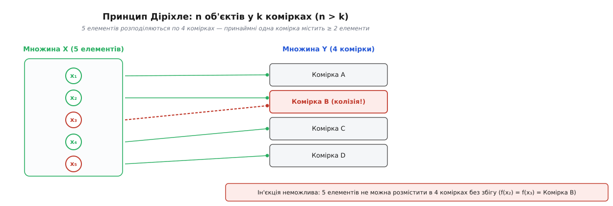
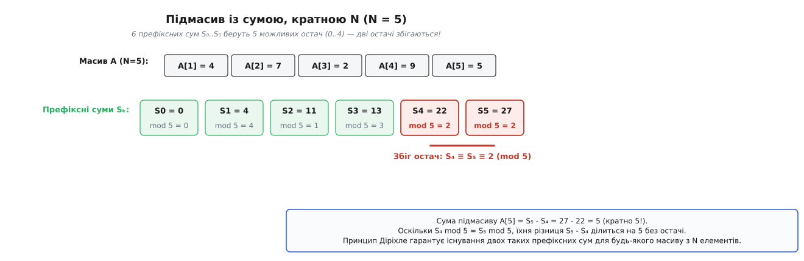
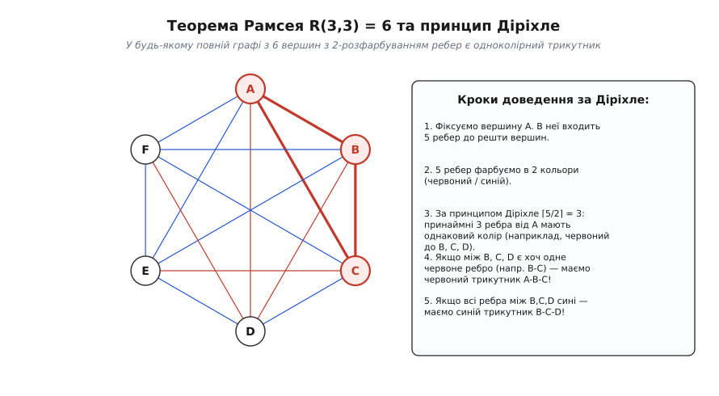
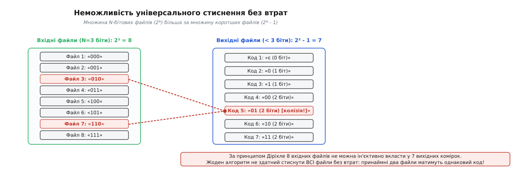

# Принцип Діріхле

<preknowlist>
- [Теорія множин](topic:math/set-theory) — поняття множини, підмножини, потужності та декартового добутку.
- [Математичне доведення](topic:math/mathematical-proof) — логічна структура доведення, прямі виведення та роль інваріантів.
- [Доведення від супротивного](topic:math/proof-by-contradiction) — висування протилежного припущення та побудова суперечності.
- [Модульна арифметика](topic:math/modular-arithmetic) — класи остач від ділення цілих чисел та порівняння за модулем.
</preknowlist>

Зберіть у одній кімнаті тринадціять людей. Не питаючи їхніх імен, не знаючи їхнього віку й не маючи жодного уявлення про їхні біографії, ви можете з абсолютною, залізобетонною математичною гарантією стверджувати: принаймні двоє з них святкують день народження в один і той самий місяць. У цій заяві немає ані гіпнозу, ані ймовірнісного вгадування, ані статистичного усереднення. Місяців у році дванадцять, а людей тринадцять; якби кожен з тринадцяти людей народився у свій власний, окремий місяць, нам знадобилося б тринадцять різних місяців, яких стандартний календар просто не має.

Цей простий факт розкриває глибинну властивість скінченних множин, яку в математиці називають **принципом Діріхле** (у зарубіжній літературі — *Schubfachprinzip* або *Pigeonhole Principle*). На перший погляд твердження здається майже дитячою самоочевидністю. Проте в руках математика та фахівця з теорії обчислень воно перетворюється на один із найгостріших інструментів аналізу. Воно дозволяє гарантувати існування складних прихованих структур, доводити абсолютну неможливість певних класів алгоритмів та знаходити невидимі зв'язків у вищій математиці, не виконуючи при цьому жодного трудомісткого прямого обчислення.

## Перший крок: Коли об'єктів більше за комірки

Суть принципу полягає у зіставленні двох множин різного розміру та аналізі спроби розподілити елементи однієї множини по елементах іншої. Уявімо, що маємо `n` предметів (у класичній ілюстрації — голубів, листів або кульок) та `k` комірок (шухляд, скриньок або кліток), куди ці предмети треба розкласти.

```
Предмети (n):   [ x₁ ]  [ x₂ ]  [ x₃ ]  [ x₄ ]  [ x₅ ]
                  │       │       │       │       │
                  ▼       ▼       ▼       ▼       ▼
Комірки (k):    [ A  ]  [ B  ]  [ B  ]  [ C  ]  [ D  ]
```

Якщо кількість предметів строго більша за кількість комірок (`n > k`), то після розподілу усіх предметів **принаймні одна комірка міститиме більше ніж один предмет**.


*Класичний принцип Діріхле: 5 об'єктів розподіляються по 4 комірках. Оскільки об'єктів більше за комірки, ін'єктивне відображення неможливе, і принаймні одна комірка отримує два елементи.*

Варто приділити особливу увагу фундаментальній методологічній рисі принципу Діріхле: він є **неконструктивною теоремою існування**. Встановивши, що `n > k`, ми отримуємо 100% гарантію того, що колізія (зосередження кількох об'єктів в одній комірці) обов'язково існує. Проте принцип не надає жодної інформації про те, *у якій саме* комірці виникла колізія, *які саме* елементи зіткнулися між собою і *скільки всього* комірок виявилися переповненими. Ми отримуємо абсолютну математичну впевненість у факті існування об'єкта, не витрачаючи ресурсів на його безпосередню побудову чи перебір.

Сам метод формалізував у 1830-х роках німецький математик Петер Ґустав Лежен Діріхле для розв'язання фундаментальних задач теорії чисел, хоча подібні міркування зустрічалися в популярних математичних збірниках ще у XVII столітті. Детальний опис того, як принцип пройшов шлях від розважальних задач про волосини на голові до абстрактної алгебри, винесено в [історію відкриття принципу Діріхле](topic:math/pigeonhole-principle/hist-dirichlet-box.md).

## Формальна мова: Ін'єкції та потужності множин

У сучасній строгій математиці принцип Діріхле формулюють поняттями теорії множин та теорії функцій. 

Нехай `X` та `Y` — дві скінченні множини з потужностями (кількістю елементів) `|X| = n` та `|Y| = k`. Відображення (або функція) `f: X → Y` називається **ін'єктивним** (або однозначним вкладенням), якщо різні елементи множини `X` завжди переходять у різні елементи множини `Y`:

```
∀ x₁, x₂ ∈ X:  x₁ ≠ x₂  ⇒  f(x₁) ≠ f(x₂)
```

**Теорема (Принцип Діріхле):** Якщо `|X| > |Y|`, то не існує жодного ін'єктивного відображення `f: X → Y`. Це означає, що для абсолютно будь-якого відображення `f` неодмінно знайдеться принаймні одна пара різних елементів `x₁, x₂ ∈ X` (де `x₁ ≠ x₂`), для яких `f(x₁) = f(x₂)`.

Доведення цієї теореми є еталоном доведення від супротивного у математичній логіці:

```
1. Припустимо протилежне: існує відображення f: X → Y, яке є ін'єктивним.
2. Розглянемо образ множини X при відображенні f: f(X) = { f(x) | x ∈ X } ⊆ Y.
3. За припущенням про ін'єктивність, кожен елемент x ∈ X відображається в унікальний елемент f(X).
4. Отже, кількість елементів в образі f(X) точно дорівнює кількості елементів у джерелі X: |f(X)| = |X| = n.
5. З іншого боку, f(X) за означенням є підмножиною Y, тому її потужність не може перевищувати потужність Y: |f(X)| ≤ |Y| = k.
6. Об'єднуючи рівність (4) та нерівність (5), отримуємо: n ≤ k.
7. Проте вихідна умова теореми стверджує, що n > k.
8. Твердження (n ≤ k) прямо суперечить вихідній умові (n > k).
9. Отже, наше припущення про існування ін'єкції було хибним. Ін'єктивне відображення неможливе.
```

Мовою теорії множин принцип Діріхле підсумовує фундаментальний інваріант: **множину більшої потужності неможливо взаємно однозначно вкласти у множину меншої потужності**. Спроба виконати таке вкладення неминуче спричиняє колізію (склеювання) принаймні двох елементів джерела в один елемент цілі.

## Узагальнений принцип Діріхле: Вглиб кількостей та мір

Що відбувається, коли об'єктів не просто більше ніж комірок, а більше у кілька разів? Наприклад, якщо у кімнаті зібралося 25 людей, ми можемо стверджувати не лише те, що принаймні двоє народилися в один місяць, а й що **принаймні троє** святкують день народження в один і той самий місяць.

### Стельова форма узагальненого принципу

Якщо `n` об'єктів розподілено по `k` комірках, то принаймні одна комірка містить не менше ніж `⌈n / k⌉` об'єктів, де `⌈x⌉` позначає функцію «стелі» (округлення вгору до найближчого цілого числа).

Доведемо це твердження строго. Припустимо протилежне: нехай кожна з `k` комірок містить строго менше ніж `⌈n / k⌉` об'єктів. Оскільки кількість об'єктів у кожній комірці є цілим числом, у кожній комірці лежить щонайбільше `⌈n / k⌉ - 1` предметів. Сумуючи об'єкти по всіх `k` комірках, дістаємо загальну кількість:

```
Загальна кількість  ≤  k · (⌈n / k⌉ - 1)            [умова: у кожній комірці ≤ ⌈n/k⌉ - 1]
                    <  k · ((n / k + 1) - 1)        [властивість стелі: ⌈x⌉ < x + 1]
                    =  k · (n / k)                  [спрощення доданків у дужках]
                    =  n                            [скорочення множника k]
```

Ми отримали, що загальна кількість предметів строго менша за `n`. Проте за умовою предметів було саме `n`. Отримана суперечність `n < n` доводить, що принаймні одна комірка містить `≥ ⌈n / k⌉` об'єктів.

### Двоїста підлогова форма

Симетрично виконується двоїсте твердження: якщо `n` об'єктів розподілено по `k` комірках, то принаймні одна комірка містить **не більше ніж** `⌊n / k⌋` об'єктів, де `⌊x⌋` позначає функцію «підлоги» (округлення вниз). Якби кожна комірка мала строго більше ніж `⌊n / k⌋` предметів (тобто щонайменше `⌊n / k⌋ + 1`), їхня загальна сума перевищила б `n`.

### Перекриття неперервних мір та геометрична форма

Принцип Діріхле не обмежується дискретними елементами — він природно узагальнюється на довжини, площі, об'єми та ймовірнісні міри.

Якщо декілька вимірних фігур із загальною сумарною площею `S` розміщені всередині області з площею `A`, і `S > A`, то принаймні дві фігури перекриваються (накладаються одна на одну). Якщо ж сумарна площа `S > (m - 1) · A`, то всередині області `A` існує точка, яку покривають принаймні `m` різних фігур. 

Формальне доведення цього факту спирається на інтегрування суми індикаторних функцій `1_{Aᵢ}(x)` по області `A`:

```
∫_A ( ∑ 1_{Aᵢ}(x) ) dμ  =  ∑ ∫_A 1_{Aᵢ}(x) dμ  =  ∑ μ(Aᵢ)  =  S  >  (m - 1) · A
```

Якби жодна точка не покривалася `m` фігурами, максимальне значення суми індикаторів у кожній точці дорівнювала б `m - 1`, і інтеграл не міг би перевищити `(m - 1) · A`. 

Строге доведення неперервної теми та розгляд нескінченних кардинальних чисел розкрито у [математичному розборі узагальненого принципу Діріхле](topic:math/pigeonhole-principle/math-generalized-pigeonhole.md).

## Діріхле в теорії чисел: Наближення та остачі

Саме в теорії чисел принцип Діріхле вперше показав свою рушійну аналітичну силу. У 1834 році Діріхле застосував його для доведення фундаментальної теореми про діофантові наближення.

### Теорема Діріхле про наближення

Дійсне число `α` називається ірраціональним, якщо його не можна точно подати відношенням двох цілих чисел `p / q`. Проте виникає питання: наскільки точно ірраціональне число можна *наблизити* звичайним раціональним дробом із обмеженим знаменником?

Діріхле довів: для будь-якого ірраціонального числа `α` та будь-якого цілого `N ≥ 1` існують такі цілі числа `p` та `q` (де `1 ≤ q ≤ N`), що виконується нерівність:

```
| α  -  p / q |  <  1 / (q · N)  ≤  1 / q²
```

Доведення використовує саме принцип комірок. Розглянемо `N + 1` чисел:

```
0·α,  1·α,  2·α,  ...,  N·α
```

Для кожного з цих чисел обчислимо його **дробову частину** `{k·α} = k·α - ⌊k·α⌋`. Усі ці `N + 1` дробових частин лежать у напіввідкритому інтервалі `[0, 1)`.

Розділимо інтервал `[0, 1)` на `N` одинакових підінтервалів-комірок довжиною `1 / N`:

```
Комірка 1:  [0, 1/N)
Комірка 2:  [1/N, 2/N)
...
Комірка N:  [(N-1)/N, 1)
```

Маємо `N + 1` дробових частин (об'єктів) та `N` підінтервалів (комірок). За принципом Діріхле, принаймні дві дробові частини — назвемо їх `{i·α}` та `{j·α}` (де `0 ≤ i < j ≤ N`) — потрапляють у **один і той самий підінтервал**.

Відстань між двома точками в одному інтервалі довжиною `1 / N` строго менша за довжину інтервалу:

```
| {j·α} - {i·α} |  <  1 / N
```

Розкриємо дробові частини через цілі частини:

```
| (j·α - ⌊j·α⌋) - (i·α - ⌊i·α⌋) |  <  1 / N
| (j - i)·α  -  (⌊j·α⌋ - ⌊i·α⌋) |  <  1 / N
```

Покладемо `q = j - i` та `p = ⌊j·α⌋ - ⌊i·α⌋`. Оскільки `0 ≤ i < j ≤ N`, число `q` є цілим і задовольняє умову `1 ≤ q ≤ N`, а `p` є цілим числом. 

Отримуємо:

```
| q·α - p |  <  1 / N
```

Поділивши обидва боки на `q`, маємо:

```
| α - p / q |  <  1 / (q · N)
```

Оскільки `q ≤ N`, то `1 / (q · N) ≤ 1 / q²`. Теорему доведено!

Цей результативний крок показав, що за допомогою принципу комірок можна знаходити нескінченно багато дробових наближень з квадратичною точністю `1 / q²`, що стало фундаментом теорії діофантових наближень.

### Остачі від ділення та підмасиви

У дискретній математиці та комп'ютерних науках принцип Діріхле часто застосовують до остач від ділення (модульної арифметики). 

Коли ціле число ділять на `N`, можливими остачами можуть бути лише `N` чисел: `{0, 1, 2, ..., N - 1}`. Якщо ми маємо `N + 1` цілих чисел, принаймні два з них матимуть однакові остачі від ділення на `N`.


*Принцип Діріхле у модульній арифметиці: 6 префіксних сум N елементів беруть лише N=5 можливих остач за модулем 5. Два префікси з однаковою остачею дають підмасив із сумою, кратною 5.*

Звідси випливає красива теорема: **у будь-якій послідовності з `N` цілих чисел завжди існує підпослідовність суміжних елементів, сума яких ділиться на `N` без остачі**.

Доведення базується на розгляді `N + 1` префіксних сум `S₀ = 0, S₁ = A[1], S₂ = A[1]+A[2], ..., S_N = A[1]+...+A[N]`. Оскільки остач за модулем `N` існує лише `N`, за принципом Діріхле знайдуться два індекси `i < j`, для яких `S_i ≡ S_j (mod N)`. Їхня різниця `S_j - S_i = A[i+1] + ... + A[j]` є шуканою сумою, яка ділиться на `N`.

## Геометрична форма: Теорема Мінковського та Бліхфельдта

Прямим геометричним продовженням принципу Діріхле у вищій алгебрі та геометрії чисел є **теорема Мінковського про опукле тіло** та **теорема Бліхфельдта**.

Герман Мінковський наприкінці XIX століття показав, що принцип комірок працює для решітки цілих точок `ℤᵈ` у багатовимірному евклідовому просторі `ℝᵈ`.

### Теорема Мінковського

Нехай `K ⊂ ℝᵈ` — вимірна область у `d`-вимірному просторі, яка є **опуклою** та **симетричною відносно початку координат** (тобто якщо `x ∈ K`, то `-x ∈ K`). Якщо об'єм `Vol(K)` задовольняє нерівність:

```
Vol(K)  >  2ᵈ
```

то область `K` обов'язково містить принаймні одну **ненульову цілу точку** `p ∈ ℤᵈ` (де `p ≠ (0, 0, ..., 0)`).

### Схема доведення через стиснення та принцип комірок

Доведення теореми Мінковського прямо спирається на неперервний принцип Діріхле:

```
1. Стиснемо область K у 2 рази по всіх осях: покладемо K' = (1/2) K.
2. Об'єм стисненої області дорівнює: Vol(K') = (1/2)ᵈ · Vol(K) > (1/2)ᵈ · 2ᵈ = 1.
3. Розіб'ємо весь простір ℝᵈ на одиничні куби з вершинами у цілих точках (одиничні комірки).
4. Зсунемо кожен кубик в один базовий одиничний куб [0, 1)ᵈ.
5. Оскільки сумарний об'єм покриваючих шматків Vol(K') > 1, а об'єм базового куба дорівнює 1, за неперервним принципом Діріхле принаймні два різні шматки K' накладуться один на одного!
6. Існування точки перекриття означає, що знайдуться два різні вектори x₁, x₂ ∈ K', які відрізняються на цілочисельний вектор: x₁ - x₂ = p ∈ ℤᵈ (де p ≠ 0).
7. Оскільки K' = (1/2) K, маємо 2x₁, 2x₂ ∈ K. 
8. З симетрії K випливає, що -2x₂ ∈ K.
9. З опуклості K випливає, що середина відрізка між 2x₁ та -2x₂ належить K: (2x₁ - 2x₂) / 2 = x₁ - x₂ = p ∈ K.
10. Отже, ненульова цілочисельна точка p належить K!
```

Цей дивовижний зв'язок між принципом комірок та геометричними об'ємами довів розв'язність багатьох складних діофантових рівнянь, зокрема теореми Лаґранжа про те, що кожне натуральне число можна подати сумою чотирьох квадратів цілих чисел.

## Степені вершин у графах: Неминучість однакових знайомих

Класичним прикладом застосування принципу Діріхле у теорії графів є теорема про збіг степеней вершин.

### Теорема про степені вершин
У будь-якому простому графі з `N ≥ 2` вершинами (тобто у графі без петель і паралельних ребер) завжди існують **принаймні дві вершини, які мають абсолютно однаковий степінь** (однакову кількість суміжних ребер).

Доведемо це за допомогою принципу комірок:

```
1. У простому графі з N вершинами степінь довільної вершини може набувати значень від 0 до N - 1.
2. Отже, потенційних значень степеня (комірок) існує N варіантів: {0, 1, 2, ..., N - 1}.
3. Проте звернемо увагу на дві крайні комірки: 0 (ізольована вершина) та N - 1 (вершина, з'єднана з усіма іншими).
4. Якщо у графі є вершина зі степенем 0, вона не з'єднана ні з чим, отже у графі НЕ МОЖЕ бути вершини зі степенем N - 1 (яка мала б бути з'єднана з усіма, включно з цією ізольованою).
5. Навпаки, якщо у графі є вершина зі степенем N - 1, у графі НЕ МОЖЕ бути ізольованої вершини зі степенем 0.
6. Отже, комірки 0 та N - 1 НЕ МОЖУТЬ заповнюватися одночасно!
7. Це означає, що кількість реально доступних комірок для будь-якого простого графа з N вершинами дорівнює N - 1.
8. Оскільки ми маємо N вершин (об'єктів) та N - 1 доступних значень степеня (комірок), за принципом Діріхле принаймні дві вершини потраплять в одну комірку і матимуть однаковий степінь.
```

Мовою звичайного життя це означає: у будь-якій компанії з `N` людей завжди знайдеться принаймні двоє людей, які мають абсолютно однакову кількість знайомих серед присутніх.

## Складність доведень, резолюції та класи складності (PPA, PPAD)

У математичній логіці та теорії складності обчислень принцип Діріхле виконує роль еталонного «важкого» твердження для формальних систем доведення та обчислювальних класів пошукових задач.

### Резолюційні системи та фундаментальний результат Гакена (1985)

У 1985 році німецький математик Армін Гакен (*Armin Haken*) опублікував фундаментальну працю, у якій довів, що кодування принципу Діріхле для `n + 1` елементів та `n` комірок (формально позначене як `PHP_n^{n+1}`) вимагає **експоненційної довжини доведення** в резолюційних системах (Resolution proof systems).

Формально формулу `PHP_n^{n+1}` у кон'юнктивній нормальній формі (КНФ) записують через змінні `p_{i,j}` (що означають «об'єкт `i` лежить у комірці `j`»):

```
1. Кожен об'єкт i лежить принаймні в одній комірці: (p_{i,1} ∨ p_{i,2} ∨ ... ∨ p_{i,n})  для всіх i = 1..n+1.
2. Жодна комірка j не містить двох різних об'єктів: (¬p_{i1,j} ∨ ¬p_{i2,j})             для всіх i1 ≠ i2, j = 1..n.
```

Ця формула є незадовольняємою (UNSAT). Хоча її незадовольняємість нам очевидна за принципом Діріхле, автоматичні доводжувачі теорем (SAT-solvers), що працюють на основі класичного алгоритму резолюцій (DPLL), змушені будувати дерево виведення розміру `2^{Ω(n)}`. 

Це довело, що резолюційні системи є слабкими для виведення глобальних інваріантів підрахунку, і стимулювало створення нових, сильніших логічних систем (Cutting Planes, Polynomial Calculus).

### Обчислювальні класи складності TFNP, PPA та PPAD

У теорії обчислювальної складності задачі пошуку свідків для математичних теорем існування (зокрема принципу Діріхле) формують клас **TFNP** (Total Function Nondeterministic Polynomial time).

У 1994 році Христос Пападімітріу (*Christos Papadimitriou*) створив підкласи:
- **PPA (Polynomial Pigeonhole Principle for Undirected Graphs):** Клас задач, існування розв'язку яких гарантується лемою про степені вершин у графах (зокрема, що граф з вершиною непарного степеня має ще одну таку вершину).
- **PPAD (Polynomial Pigeonhole Principle for Directed Graphs):** Клас задач, існування розв'язку яких спирається на орієнтований принцип Діріхле у графах (зокрема, пошук рівноваги Неша у теорії ігор та точок Брауера).

Отже, принцип комірок є не просто комбінаторним правилом, а основою сучасної теорії складності обчислень.

## Неминучість структур: Комбінаторика Рамсея та Ван дер Вардена

Одним із найглибших наслідків принципу Діріхле є усвідомлення того, що **абсолютна хаотичність у великих системах неможлива**. Якщо математична система достатньо велика, будь-який поділ її елементів на класи неминуче вимушує виникнення впорядкованих підструктур.

### Проблема знайомих та незнайомців

Класична задача теорії графів стверджує: **у будь-якій компанії з 6 людей знайдеться принаймні 3 людей, які всі троє попарно знайомі між собою, або принаймні 3 людей, які всі троє попарно не знайомі**.

Мовою теорії графів це означає, що якщо ребра повного графа з 6 вершинами (`K₆`) розфарбувати у 2 кольори (червоний — знайомі, синій — незнайомці), у графі неодмінно знайдеться одноколірний трикутник (`K₃`).


*Доведення теореми Рамсея R(3,3)=6 через принцип Діріхле. Із 5 ребер вершини A принаймні 3 мають однаковий колір, що неминуче замикає одноколірний трикутник.*

Доведемо це за допомогою принципу Діріхле:

```
1. Оберіть довільну вершину A у графі K₆.
2. Вершина A з'єднана з іншими 5 вершинами (B, C, D, E, F) п'ятьма ребрами.
3. Ці 5 ребер розфарбовані у 2 кольори (червоний та синій).
4. За узагальненим принципом Діріхле (n=5, k=2), принаймні ⌈5 / 2⌉ = 3 ребра мають ОДНАКОВИЙ колір.
5. Не втрачаючи загальності, нехай ребра AB, AC та AD є червоними.
6. Тепер розглянемо ребра між вершинами B, C та D:
   - Якщо хоч ОДНЕ з ребер BC, CD або BD є червоним (наприклад, BC), то разом із ребрами AB та AC воно утворює червоний трикутник ABC.
   - Якщо ЖОДНЕ з ребер BC, CD, BD не є червоним, це означає, що ВСІ ТРИ ребра BC, CD, BD є синіми! Тоді вершини B, C, D утворюють синій трикутник BCD.
7. В обох випадках одноколірний трикутник неодмінно існує.
```

Цей результат є найпростішим випадком **теореми Рамсея**, яка вводить числа `R(r, s)` — мінімальну кількість вершин графа, що гарантує наявність кліки розміру `r` або незалежної множини розміру `s`. Для `r=3, s=3` число Рамсея дорівнює точно `R(3,3) = 6`.

### Теорема Ердеша-Секереша про монотонні підпослідовності

Іншим прикладом неминучості порядку є теорема Ердеша-Секереша (1935): **будь-яка послідовність з `n² + 1` різних дійсних чисел містить монотонну підпослідовність довжиною `n + 1` (або монотонно зростаючу, або монотонно спадну)**.

Наприклад, якщо ми візьмемо `3² + 1 = 10` довільних перемішаних чисел, у них завжди знайдеться зростаючий або спадний ланцюжок з `3 + 1 = 4` чисел.

Розглянемо приклад послідовності з 10 чисел: `A = [8, 2, 9, 1, 4, 7, 3, 6, 5, 0]`.
Запишемо для кожного елемента `A[k]` пару `(i_k, d_k)`, де `i_k` — максимальна довжина зростаючої підпослідовності, яка закінчується на `A[k]`, а `d_k` — максимальна довжина спадної підпослідовності, що закінчується на `A[k]`:

```
A[0] = 8:  (1, 1)    [зростаюча: 8;  спадна: 8]
A[1] = 2:  (1, 2)    [зростаюча: 2;  спадна: 8->2]
A[2] = 9:  (2, 1)    [зростаюча: 8->9; спадна: 9]
A[3] = 1:  (1, 3)    [зростаюча: 1;  спадна: 8->2->1]
A[4] = 4:  (2, 2)    [зростаюча: 2->4; спадна: 8->4]
A[5] = 7:  (3, 2)    [зростаюча: 2->4->7; спадна: 8->7]
A[6] = 3:  (2, 3)    [зростаюча: 2->3; спадна: 8->4->3]
A[7] = 6:  (3, 3)    [зростаюча: 2->4->6; спадна: 8->7->6]
A[8] = 5:  (3, 4)    [зростаюча: 2->4->5; спадна: 8->7->6->5] <-- СПАДНА ДОВЖИНОЮ 4!
```

На 9-му елементі `A[8]=5` ми отримали `d = 4`, тобто спадний ланцюжок `8 -> 7 -> 6 -> 5` довжиною 4!

Загальне доведення базується на принципі Діріхле: припустимо протилежне, що немає монотонної підпослідовності довжиною `n + 1`. Тоді всі значення `i_k` та `d_k` лежать у діапазоні від `1` до `n`. Кількість можливих пар `(i, d)` дорівнює `n × n = n²`. Оскільки елементів `n² + 1`, за принципом Діріхле знайдеться пара елементів з однаковими координатами `(i_p, d_p) = (i_q, d_q)` для `p < q`. 

Але якщо `a_p < a_q`, то `i_q ≥ i_p + 1`, а якщо `a_p > a_q`, то `d_q ≥ d_p + 1`. В обох випадках виникає суперечність з рівністю пар. Отже, монотонна підпослідовність довжиною `n + 1` обов'язково існує!

### Теорема Ван дер Вардена про арифметичні прогресії

У 1927 році нідерландський математик Бартель Леендерт ван дер Варден (*Bartel Leendert van der Waerden*) довів ще одне знамените узагальнення принципу комірок: якщо множину натуральних чисел `{1, 2, ..., N}` розфарбувати у `r` кольорів, то при достатньо великому `N ≥ W(k, r)` у ній неодмінно знайдеться **одноколірна арифметична прогресія довжиною `k`**. Доведення теореми Ван дер Вардена спирається на багаторазово вкладений принцип Діріхле по блоках чисел, що робить його одним із найвишуканіших у комбінаториці.

## Нескінченні комірки та гранд-готель Ґільберта

Коли ми переходимо від скінченних множин до нескінченних, інтуїція принципу Діріхле вимагає суттєвого уточнення.

Давід Ґільберт у відомому мисленнєвому експерименті «Гранд-готель Ґільберта» продемонстрував, що готель з нескінченною кількістю номерів (`k = ℵ₀`), повністю заповнений нескінченною кількістю гостей (`n = ℵ₀`), може легко поселити ще одного нового гостя **без створення жодної колізії (без поселення двох людей в один номер)**!

Дійсно, адміністратор може просто попросити кожного гостя з номера `i` переїхати в номер `i + 1`. Тоді номер 1 звільниться для нового мешканця. Це свідчить про те, що нескінченна множина може бути рівнопотужною своїй власній власній підмножині (означення нескінченності за Дедекіндом).

Проте принцип Діріхле продовжує працювати на нескінченних множинах, якщо розглядати потужності різного порядку. Якщо розподілити незліченну множину об'єктів потужності континууму `c = 2^{ℵ₀}` по зліченній кількості комірок `ℵ₀`, то за нескінченним принципом Діріхле принаймні одна комірка міститиме **незліченну кількість об'єктів потужності континууму**. Завдяки цьому фундаментальному інваріанту аналітики будують строго закриті простори в теорії міри та функціональному аналізі.

## Застосування у програмуванні та інформатиці

У комп'ютерних науках принцип Діріхле визначає фундаментальні межі алгоритмів та структур даних.

### 1. Хеш-колізії (Collision in hashing)

Хеш-функція `h: K → {0, 1, ..., M-1}` відображає простір ключів `K` (наприклад, усі можливі текстові файли чи рядки) у скінченну таблицю розміру `M`.

Оскільки кількість можливих ключів `|K|` є астрономічно більшою за розмір таблиці `M` (`|K| ≫ M`), за принципом Діріхле **не існує універсальної хеш-функції без колізій**. Знайдуться принаймні два різні ключі `k₁ ≠ k₂`, для яких `h(k₁) = h(k₂)`.

Цей факт диктує архітектуру хеш-таблиць: будь-яка хеш-таблиця *мусить* мати механізм вирішення колізій (метод ланцюжків або відкриту адресацію). У криптографії (SHA-256, MD5) це означає, що колізії існують математично завжди, і безпека тримається лише на тому, що знайти їх обчислювально важко.

### 2. Парадокс днів народження проти принципу Діріхле

Варто розрізняти жорстку межу принципу Діріхле та ймовірнісну оцінку «парадоксу днів народження». 

- **Принцип Діріхле** дає **100% детерміновану гарантію**: щоб у кімнаті з ймовірністю `1.0` опинилося принаймні двоє людей з однаковим днем народження, потрібно `367` людей (оскільки днів у році максимум 366).
- **Парадокс днів народження** аналізує ймовірність колізії серед пари елементів. Завдяки тому, що кількість пар з `k` елементів зростає як `C(k, 2) = k(k - 1) / 2`, ймовірність збігу перевищує `50%` вже при `k = 23` людях, а при `k = 57` досягає `99%`.

Принцип Діріхле ставить абсолютне верхнє дно (найгірший випадок), після якого ухилитися від колізії неможливо фізично, тоді як парадокс днів народження оцінює середній випадок виникнення колізій у випадкових розподілах.

### 3. Детекція циклів у скінченній пам'яті

Якщо детермінована програма чи обчислювальний автомат переходить зі стану в стан `x_{t+1} = f(x_t)`, і кількість можливих станів пам'яті скінченна (дорівнює `N`), то за `N + 1` кроків програма **неодмінно відвідає один і той самий стан двічі**.

Оскільки система детермінована, після повторного відвідання стану вона буде нескінченно повторювати той самий маршрут. Це фундаментальне обґрунтування алгоритмів детекції циклів (алгоритм Флойда «черепахи та зайця»), який використовується у виявленні зациклень та розкладанні чисел на множники (p-метод Поларда).

### 4. Неможливість універсального стиснення без втрат

Будь-який алгоритм стиснення без втрат є ін'єктивним відображенням `C: {0,1}* → {0,1}*`, яке має зворотне розпакування `D(C(x)) = x`.

Спроба створити «універсальний архиватор», який стискає *будь-який* файл хоча б на 1 біт, впирається у принцип Діріхле. 


*Неможливість універсального стиснення без втрат: 2ᴺ вхідних файлів вимагають більше слотів, ніж існує коротших послідовностей (2ᴺ - 1). Принаймні два файли матимуть однакову стиснену форму.*

Якщо розглянути всі файли довжиною точно `N` бітів, їхня кількість дорівнює `2ᴺ`. Якщо алгоритм стискає кожен такий файл, то кожен вихідний файл має довжину `≤ N - 1` біт. Проте кількість усіх можливих бінарних послідовностей довжиною від `0` до `N - 1` дорівнює:

```
2⁰ + 2¹ + 2² + ... + 2ᴺ⁻¹  =  2ᴺ - 1
```

Маємо `2ᴺ` вхідних файлів та лише `2ᴺ - 1` доступних стиснених кодів. За принципом Діріхле, принаймні два різні вхідні файли отримають **абсолютно однаковий стиснений код**. Але тоді однозначне розпакування `D` стане неможливим!

Отже, **жоден алгоритм стиснення без втрат не може стиснути всі файли**. Якщо алгоритм робить коротшими одні файли, він неминуче **подовжує** інші файли. На практиці алгоритми (ZIP, gzip, zstd) стискають лише ті файли, які мають внутрішню структуру та закономірності (текст, код, неспрямовані дані), жертвуючи випадковим шумом.

Робочі приклади коду мовами C та C++, які реалізують пошук підмасивів, детекцію циклів та перевірку межі стиснення, детально розібрано у [практичних алгоритмах та контрприкладах у коді](topic:math/pigeonhole-principle/proj-pigeonhole-apps.md).

## Квантовий парадокс принципу Діріхле

У 2016 році фізики Якір Ахаронов, Деніел Рорліх та їхні колеги опублікували дивовижне відкриття у квантовій механіці, яке отримало назву **квантового парадоксу принципу Діріхле (Quantum Pigeonhole Paradox)**.

У класичній фізиці, якщо три елементарні частинки (наприклад, три електрони) розмістити у двох квантових ямах (комірках), за принципом Діріхле принаймні дві частинки мусять опинитися в одній і тій самій ямі.

Проте у квантовому світі, завдяки явищу суперпозиції, квантове сплутування та техніці попереднього і пост-відбору станів (pre- and post-selection), можна підготувати стан із трьох частинок так, що під час вимірювання взаємодії між будь-якою парою частинок виявляється, що **жодна пара частинок не перебуває в одній комірці**!

Цей парадокс демонструє, що класичний принцип Діріхле фундаментально спирається на класичне припущення про існування детермінованих локальних властивостей об'єктів незалежно від вимірювання. У квантовій теорії інформації це стимулює розробку нових протоколів квантового кодування та комунікаційної складності.

## Практичне значення та підводні камені

> 🔧 **Навіщо це.** Принцип Діріхле — це головний «детектор брехні» в архітектурі систем та теорії складності. Коли розробнику пропонують структуру даних без колізій при необмеженому вводі, алгоритм стиснення будь-яких даних чи схему кодування без втрат при звуженні каналу — саме принцип Діріхле за пів секунди показує, чому ця обіцянка математично хибна. В алгоритмах він дає точну гарантію зупинки та існування розв'язків там, де прямий перебір потребує експоненційного часу.

Попри очевидність принципу, при його застосуванні нерідко припускаються типових помилок:

1. **Очікування конструктивності:** Принцип гарантує *існування* колізії, але ніколи не вказує, *де саме* вона виникне. Сподіватися знайти елемент-колізію за допомогою самого лише принципу без додаткового алгоритму пошуку — поширена ілюзія.
2. **Плутанина між об'єктами та комірками:** При застосуванні принципу в складних комбінаторних задачах найважчий крок — правильно визначити, що саме грає роль «предметів» (`n`), а що — роль «комірок» (`k`). Помилка у виборі відображення або невірно визначена область значень повністю руйнує доведення.
3. **Плутанина між `n > k` та `n = k`:** Принцип вимагає **строгої нерівності** `n > k` для гарантії колізії. Якщо `n = k`, між множинами існує бієкція (взаємно однозначне відображення), і жодної колізії може не бути (наприклад, 12 людей можуть народитися у 12 різних місяцях).

Принцип Діріхле вчить бачити за поверхневими деталями системи її фундаментальну комбінаторну місткість — і дає математичну гарантію там, де інтуїція безсила.
