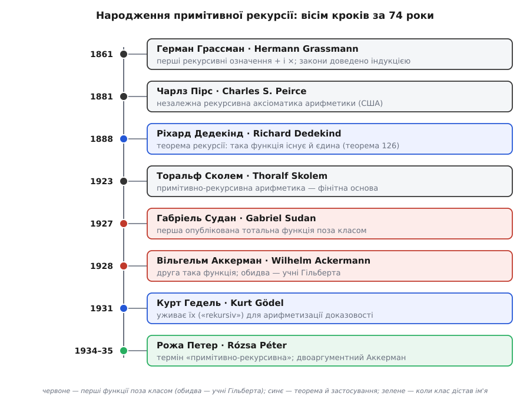

# 📜 Як рекурсія стала законною: сім десятиліть від запису до теорії

Дивна річ: функції з'явилися на сімдесят років раніше за свою назву. Ще з 1861-го математики спокійно писали «означмо f на нулі, а на наступному числі — через її ж значення на попередньому» і вільно цим користувалися — але **ніхто не був певен, що так узагалі можна**, ніхто не окреслив, що саме цим способом виходить, а слова «примітивно-рекурсивна» не існувало й близько. Ця вставка простежує, як недбалий запис поступово став доведеною теоремою, потім твердою основою, потім зброєю — і аж наприкінці дістав ім'я та впорядковану теорію. І хто були люди, що це зробили.

*Сім десятиліть від першого рекурсивного означення до назви класу. Червоні картки — перші функції, що вийшли за межі примітивної рекурсії; сині — коли її довели й пустили в діло; зелена — коли клас нарешті дістав ім'я. Кожен крок мав свій мотив, і жоден автор не бачив цілої картини наперед.*

## Грассман і Пірс: коли рекурсію вперше просто взяли й записали

Перш ніж хтось запитав «а чи законно так означувати», хтось узяв і означив. **Герман Грассман** (нім. *Hermann Günther Grassmann*, 1809–1877) — той самий німець, чия «теорія протяжності» на півстоліття випередила лінійну алгебру, а на дозвіллі він відкрив фонетичний закон дисиміляції придихових, що й досі зветься його ім'ям у санскриті. За життя його математику майже не читали. І от у шкільному «Підручнику арифметики» (нім. *Lehrbuch der Arithmetik*, 1861) він зробив тихо-революційну річ: означив додавання й множення **рекурсією через наступника** — a + 0 = a, a + (b+1) = (a+b)+1 — і не постулював переставність та сполучність як самоочевидні, а **довів** їх [індукцією](book:math/mathematical-induction). Уперше закони арифметики не бралися з неба, а виводилися з єдиної дії «додати одиницю».

Через двадцять років, незалежно й по інший бік океану, те саме зробив **Чарлз Сандерс Пірс** (англ. *Charles Sanders Peirce*, 1839–1914) — американський логік і батько семіотики. У праці «Про логіку числа» (англ. *On the Logic of Number*, 1881) він дав рекурсивно-аксіоматичний виклад арифметики натуральних чисел. Ідея явно висіла в повітрі: числа будуються сходженням по наступнику, тож і функції на них природно будувати тим самим рухом. Обидва — і Грассман, і Пірс — **записали** рекурсію й **скористалися** нею. Але жоден не поставив питання, яке ховалося просто під сподом.

## Дедекінд: а чи взагалі можна так означувати? (1888)

Запис «f(0) = c, f(n+1) = g(f(n))» **виглядає** як означення функції. Але чи є він ним насправді? Тут ховаються два питання, повз які легко проскочити. Перше: чи така функція взагалі **існує** — чи не буває так, що правила самі собі суперечать і жодного значення не задають? Друге, тонше: чи вона **єдина** — а раптом дві різні функції обидві задовольняють той самий рецепт? Поки на це немає відповіді, рекурсія — не означення, а лише сподівання, що означення вийде.

Відповів **Ріхард Дедекінд** (нім. *Richard Dedekind*, 1831–1916) у книжці з промовистою назвою «Що таке числа і чим вони мають бути?» (нім. *Was sind und was sollen die Zahlen?*, 1888). Її теорема 126 — це і є **теорема рекурсії**: Дедекінд першим строго довів, що рекурсивна побудова задає **рівно одну** функцію, і вона існує. Саме він увів і сам зворот «означення через рекурсію» (нім. *Definition durch Induktion*). Це — теоретичне народження предмета: відтепер рекурсія не хитрий запис, яким користуються на віру, а **дозволена конструкція** з доведеним правом на існування.

Тонкість, яку Дедекінд перетворив на теорему, така. Рецепт нібито «очевидно» пришпилює кожне значення: щоб дізнатися f(3), спускаєшся f(3)→f(2)→f(1)→f(0), де відповідь дано прямо. Але «очевидно» тут — саме та діра, у яку провалюється необережний: треба довести, що цей спуск завжди доходить до дна й дає **одне й те саме**, хоч звідки б ти почав. Дедекінд це довів — і тим самим підвів під усю подальшу теорію фундамент. Ця сама лінія Дедекінда веде далі до [аксіом Пеано](book:math/natural-numbers/hist-peano-axioms.md), де рекурсія та індукція стають наріжними каменями означення чисел; Пеано, до речі, відкрито визнавав, що спирався на Грассмана.

## Сколем: рекурсія як тверда земля під ногами (1923)

Далі змінюється **мотив**. На зламі століть парадокси розхитали теорію множин, і постало питання, на що взагалі можна спертися без страху. Давид Гільберт мріяв перебудувати математику на **фінітному** (лат. *finitus* — «скінченний») ґрунті — на операціях, які можна буквально виконати руками й оком, крок за кроком, без апеляції до нескінченних сукупностей.

**Торальф Сколем** (норв. *Thoralf Skolem*, 1887–1963), норвезький математик, у праці 1923 року побудував **примітивно-рекурсивну арифметику** (скор. PRA): арифметику, у якій усе тримається на рекурсії, а необмежених «існує таке число» чи «для всіх чисел» просто немає. Кожне твердження в ній — це конкретне обчислення, яке в принципі можна прогнати до кінця й побачити «так» або «ні». Рекурсію тут піднято ще на щабель: із **інструмента** вона стала **основою** — найбезпечнішою з можливих арифметик саме тому, що ніщо в ній не може «зависнути». Це і є фінітне ядро, на яке спиралася [програма Гільберта](book:math/godel-incompleteness/hist-hilbert-program.md).

## Гедель: та сама надійність — тепер як зброя (1931)

І тут ті самі скромні, завжди-завершенні функції стають двигуном найгучнішої теореми століття. **Курт Гедель** (нім. *Kurt Gödel*, 1906–1978; народжений у Брюнні — тепер Брно, — тоді Австро-Угорщина, згодом громадянин США) поставив собі мету змусити арифметику **говорити про власні доведення**. Для цього він закодував формули й доведення числами — і йому потрібен був присуд «послідовність p є доведенням формули f» такий, щоб сама арифметика вміла його перевірити й щоб перевірка **гарантовано завершувалася**.

Ось де примітивна рекурсія лягла як улита. Геделю не потрібні були **всі** обчислювані функції — йому потрібні були ті, чия тотальність поза сумнівом, бо інакше кодування доказовості саме могло б зациклитися й нічого не означати. Клас, збудований з наступника композицією та рекурсією, давав саме таку залізну гарантію зупинки. Гедель називав ці функції просто «рекурсивними» (нім. *rekursiv*) — теперішнього «примітивно-» ще не існувало. На цьому фундаменті стоїть уся арифметизація синтаксису в [теоремах про неповноту](book:math/godel-incompleteness): механіка «що є доведенням» вклалася всередину арифметики саме тому, що вона примітивно-рекурсивна.

## Судан і Аккерман: стелю знайшли раніше, ніж дали їй назву (1927–1928)

У колі Гільберта жила зручна віра: усе, що можна **насправді** обчислити (і що завжди зупиняється), — примітивно-рекурсивне; тобто цей клас і є вся ефективна тотальна обчислюваність, за ним нічого немає. Сам Гільберт у лекції «Про нескінченне» (нім. *Über das Unendliche*, 1926) уже показував страхітливо швидку функцію, що натякала на протилежне. А тоді цю віру зламали **двоє його ж учнів** — майже одночасно.

**Габріель Судан** (рум. *Gabriel Sudan*, 1899–1977), румунський математик, 1927 року опублікував функцію, яку сьогодні звуть його ім'ям, — за наявними свідченнями, **перший надрукований** приклад тотальної обчислюваної функції, що **не** є примітивно-рекурсивною. Наступного року, 1928-го, **Вільгельм Аккерман** (нім. *Wilhelm Ackermann*, 1896–1962), німецький математик, особистий секретар і колишній студент Гільберта, у праці «До гільбертової побудови дійсних чисел» (нім. *Zum Hilbertschen Aufbau der reellen Zahlen*) навів свою — ту саму знамениту [функцію Аккермана](book:math/ackermann-function) (спершу в трьохаргументній формі). Обидві функції зробили те саме: спростували припущення, що обчислюване = примітивно-рекурсивне.

Тут варто розрізняти чітко. **Ідея-віра** «обчислюване збігається з примітивно-рекурсивним» — одне; **теорема** «ось конкретна функція поза класом» — інше, і саме її довели Судан та Аккерман. І ще: **першість** належить Судану (він надрукував раніше), а **слава** дісталася Аккерманові, бо його функція стала підручниковим прикладом. Судана ж, румунського геометра, історія довго тримала в тіні — випадок, коли пріоритет і популярність розійшлися.

## Рожа Петер: хто дав класу ім'я і зробив із нього теорію (1932–1951)

Отже, до кінця 1920-х функції існували, їхню законність довели, стелю знайшли — а **назви** класу й **зведеної теорії** ще не було. Це зробила **Рожа Петер** (угор. *Péter Rózsa*, 1905–1977), угорська математикиня. Народилася вона як **Рожа Політцер** (*Politzer*); прізвище на угорське «Петер» змінила 1934 року — тінь тих часів чути й тут: єврейське походження, за яке 1939-го її відлучать від викладання.

Її внесок — саме той, якого бракувало, щоб розрізнені результати стали теорією.
- **1934: вона запровадила сам термін «примітивно-рекурсивна»** (нім. *primitiv-rekursiv*) — щоб відділити скромний, завжди-завершенний клас від тих буйніших рекурсій, які щойно оприявнив Аккерман. До неї всі вони були просто «рекурсивними»; це через відкриття Аккермана постала потреба перейменувати старе.
- **1935: вона звела трьохаргументну функцію Аккермана до двоаргументної** — до тієї форми, якою її подають тепер геть усі підручники (пізніше цю форму ще відшліфував Рафаель Робінсон, тож її нерідко звуть функцією Петер–Робінсона). І показала, як **систематично** будувати функції поза примітивною рекурсією, а не ловити їх поодинці.
- **1951: її «Рекурсивні функції»** (нім. *Rekursive Funktionen*) — перша монографія про теорію рекурсії взагалі й, за поширеним свідченням, перша книжка з сучасної логіки, написана жінкою.

І тут — потрібне зауваження про справедливість. Коли перелічують засновників теорії обчислюваності, звично звучать Гедель, Черч, Кліні, Тюрінг — а Рожу Петер пропускають, хоч це вона **дала класу ім'я** й написала його **першу теорію**. Її цілком заслужено називають **матір'ю-засновницею теорії рекурсії**, і недооцінюють здебільшого за інерцією, а не по суті. Тримати цю жінку — угорку єврейського роду, чиє прізвище саме життя змусило змінити, — на узбіччі списку фундаторів було б рівно тим викривленням, від якого історія науки має відучуватися.

## Що показує ця біографія

Життєпис поняття вивертає навиворіт звичний здоровий глузд. Функції — Грассманові + і × — на сімдесят років старші за свою назву, яку дала Петер. А між ними вклався весь сюжет: Дедекінд довів, що так означувати **можна**; Сколем зробив рекурсію **основою**; Гедель — **зброєю**; Судан і Аккерман намацали її **стелю**; Петер накреслила **мапу** й дала країні **ім'я**. Рекурсією користувалися задовго до того, як її зрозуміли, і зрозуміли задовго до того, як назвали, — звичайний, як виявляється, порядок для глибоких ідей.
