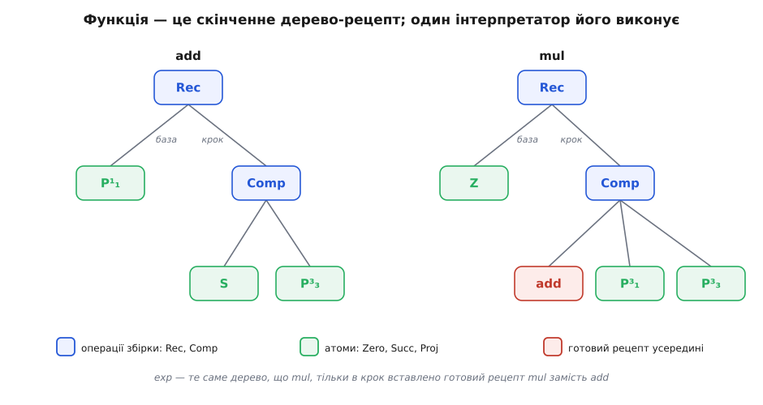
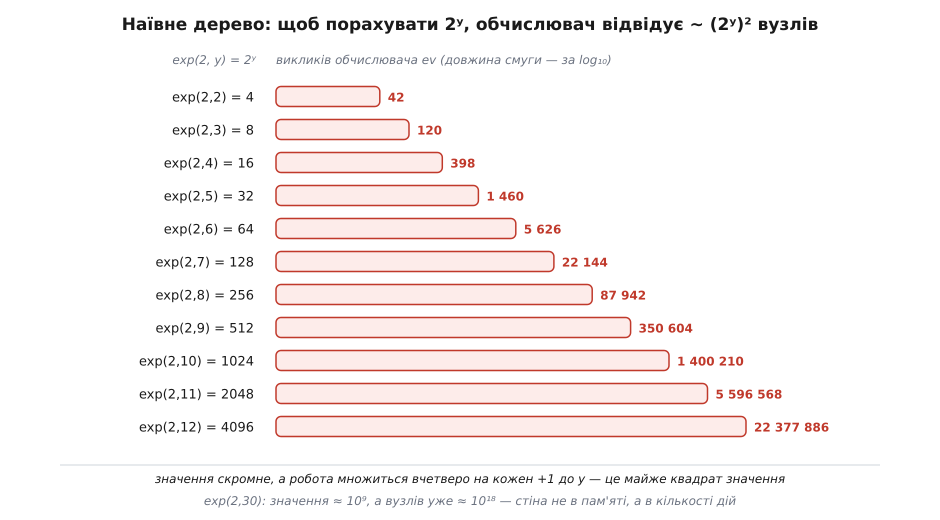

# ⚙️ Рецепт, який можна виконати: інтерпретатор примітивно-рекурсивних функцій

Досі рецепти на кшталт «додавання через наступник» лишалися фігурою мови; зробімо їх буквально — заведімо тип даних, значення якого і є самі рецепти, та один обчислювач, що виконує будь-який із них. Тоді слова «примітивно-рекурсивна функція тотожна своєму скінченному дереву» перестануть бути образом: дерево можна покласти у змінну, роздрукувати, передати іншій функції — і запустити на числах.

## П'ять конструкторів — і означення стає структурою

Усе означення трималося на трьох атомах (нуль-функція, наступник, проєкція) і двох способах збірки (композиція, примітивна рекурсія). Це рівно п'ять форм — отже, рівно п'ять конструкторів одного алгебричного типу даних (типу, кожне значення якого належить одному зі скінченного переліку різновидів, кожен зі своїми полями). Виписати цей тип — уже наполовину написати обчислювач: форми диктують, які випадки той муситиме розібрати.

:::tabs
```haskell
data Expr
  = Zero               -- Z(x⃗) = 0
  | Succ               -- S(x) = x + 1
  | Proj Int           -- Pᵢⁿ: вертає i-й аргумент (рахуємо від 1)
  | Comp Expr [Expr]   -- f( g₁, …, gₘ )
  | Rec  Expr Expr     -- база f, крок g
```
```python
from dataclasses import dataclass

@dataclass
class Zero: pass                       # Z(x⃗) = 0
@dataclass
class Succ: pass                       # S(x) = x + 1
@dataclass
class Proj: i: int                     # Pᵢⁿ: вертає i-й аргумент (від 1)
@dataclass
class Comp: f: "Expr"; gs: list        # f( g₁, …, gₘ )
@dataclass
class Rec:  base: "Expr"; step: "Expr" # база, крок

Expr = Zero | Succ | Proj | Comp | Rec
```
:::

Кожен конструктор — це один рядок означення, застиглий у дані. `Zero` і `Succ` полів не мають: діяти їм нема з чим, вони самі є дією. `Proj i` носить лише номер потрібного аргументу. `Comp f gs` тримає функцію `f` і список рецептів `gs`, чиї відповіді підуть їй на вхід. `Rec base step` — два під-рецепти: що робити на нулі й як із попереднього значення дістати наступне. Один тонкий недогляд навмисний: у математиці проєкція `Pᵢⁿ` несе ще й арність `n`, а тут її немає. Обчислювачеві `n` не потрібна — він просто бере `i`-й елемент того, що йому подали; арність — справа окремої перевірки, що рецепт узгоджений, і на самі числа вона не впливає.

> 🔧 **Навіщо це.** Тільки-но функцію звели до дерева, вона стала звичайним значенням — таким самим, як число чи список. З нею можна робити те, чого з живою функцією не зробиш: порівнювати два рецепти, підраховувати вузли, перебирати всі рецепти по черзі, годувати рецепт самому собі. Уся арифметизація доведень тримається саме на цьому переході «функція → скінченний запис → число»: щойно програма стала числом, арифметика дістала змогу говорити про програми. Наш маленький тип — та сама ідея в мініатюрі.

## Один обчислювач на всі рецепти

Тепер серце справи. Обчислювач дивиться, який конструктор перед ним, і робить рівно те, що приписує означення цього конструктора, — не більше й не менше. П'ять форм означення дають п'ять гілок обчислення.

:::tabs
```haskell
eval :: Expr -> [Integer] -> Integer
eval Zero            _  = 0
eval Succ            xs = head xs + 1
eval (Proj i)        xs = xs !! (i - 1)
eval (Comp f gs)     xs = eval f [ eval g xs | g <- gs ]
eval e@(Rec base st) xs
  | y == 0    = eval base pre
  | otherwise = eval st (pre ++ [y - 1, eval e (pre ++ [y - 1])])
  where pre = init xs          -- сталі аргументи x⃗
        y   = last xs          -- лічильник рекурсії
```
```python
def ev(e, xs):
    match e:
        case Zero():       return 0
        case Succ():       return xs[0] + 1
        case Proj(i):      return xs[i - 1]
        case Comp(f, gs):  return ev(f, [ev(g, xs) for g in gs])
        case Rec(base, step):
            *pre, y = xs                   # x⃗ і лічильник y
            if y == 0:
                return ev(base, pre)       # база: значення на нулі
            prev = ev(e, pre + [y - 1])    # спускаємося на сходинку нижче
            return ev(step, pre + [y - 1, prev])
```
:::

Чотири перші гілки прозорі: нуль вертає нуль, наступник додає одиницю, проєкція вихоплює свій аргумент, композиція спершу рахує всі під-рецепти на тих самих `xs`, а тоді подає їхні відповіді у `f`. Уся сіль — в останній гілці, у `Rec`. Прочитаймо її повільно. Якщо лічильник `y` дорівнює нулю, вертаємо базу від сталих аргументів — драбина скінчилася, відповідь дано прямо. Інакше спускаємося на сходинку: рахуємо те саме дерево `e` на `y-1` (це `prev`, попереднє значення), а тоді згодовуємо кроковій функції три речі — сталі `x⃗`, поточний лічильник `y-1` і `prev`.

Зверніть увагу, чого тут статися **не може**. Рекурсивний виклик `eval e` завжди йде з меншим лічильником: `y` спадає до `y-1`, те — до `y-2`, і так неминуче до нуля, де гілка `y == 0` замикає спуск без жодного нового виклику. Немає способу зробити лічильник більшим або лишити його тим самим — конструктор `Rec` цього просто не пропонує. Тому обчислення `Rec` завершується завжди, і то за наперед відому кількість кроків, що дорівнює лічильникові. Зупинка не доводиться окремо — вона вбудована у форму даних.

І ще одне, що знадобиться наприкінці: цей `eval` — **один на всі рецепти**. Не «інтерпретатор для add» і не «для exp», а єдина процедура, що виконає будь-яке дерево, яке їй подадуть. Універсальний виконавець примітивної рекурсії міститься в семи рядках.

## Зібрати арифметику з трьох атомів

Слова доводяться ділом: зберімо з атомів знайомі дії — не як формули на дошці, а як значення нашого типу, які справді запускаються.

:::tabs
```haskell
one   = Comp Succ [Zero]                    -- стала 1 = S(Z(x))
add   = Rec (Proj 1) (Comp Succ [Proj 3])
mul   = Rec Zero     (Comp add  [Proj 1, Proj 3])
expo  = Rec one      (Comp mul  [Proj 1, Proj 3])
pred' = Rec Zero     (Proj 1)               -- pred(0)=0; pred(y+1)=y
monus = Rec (Proj 1) (Comp pred' [Proj 3])  -- зрізане віднімання x ∸ y
```
```python
one   = Comp(Succ(), [Zero()])              # стала 1 = S(Z(x))
add   = Rec(Proj(1), Comp(Succ(), [Proj(3)]))
mul   = Rec(Zero(),  Comp(add, [Proj(1), Proj(3)]))
expo  = Rec(one,     Comp(mul, [Proj(1), Proj(3)]))
pred_ = Rec(Zero(),  Proj(1))               # pred(0)=0; pred(y+1)=y
monus = Rec(Proj(1), Comp(pred_, [Proj(3)]))# зрізане віднімання x ∸ y
```
:::

Кожен рядок — дослівний переклад означення в конструктори. `add` рекурсує по другому аргументу: база — проєкція `Proj 1` (тобто `add(x,0)=x`), крок — наступник від попереднього значення (`Proj 3` — це якраз `prev`). `mul` у своєму кроці кличе вже зібраний `add`; `expo` — уже зібраний `mul`. `pred'` — той самий трюк, що дає попередник: крок ігнорує попереднє значення й віддає сам лічильник. Запустімо:

```
ev(expo,  [2, 10])  →  1024      exp: 2¹⁰
ev(mul,   [6,  7])  →  42
ev(monus, [7,  4])  →  3         7 ∸ 4
ev(pred_, [0])      →  0         нуль лишається нулем
```

Числа правильні — але цікаво не «що», а «як». Простежмо найдрібніший приклад, `add(2,2)`, друкуючи кожен виклик обчислювача:

```
ev(Rec, [2, 2]):  y=2
  ev(Rec, [2, 1]):  y=1
    ev(Rec, [2, 0]):  y=0
      ev(P1, [2]) = 2                ← база: проєкція віддала x
    ev(Comp, [2, 0, 2]):
      ev(P3, [2, 0, 2]) = 2          ← дістали prev
      ev(Succ, [2]) = 3              ← крок: наступник
  ev(Comp, [2, 1, 3]):
    ev(P3, [2, 1, 3]) = 3
    ev(Succ, [3]) = 4
```

Спершу спуск: `y = 2 → 1 → 0`, де база (проєкція) віддає `2`. Тоді підйом: крок `Comp(Succ, [Proj 3])` щоразу бере попереднє значення й додає наступник — `2 → 3 → 4`. Дерево скінченне, обхід скінченний, відповідь — `4`. Ось що означає «функція тотожна рецептові»: немає нічого, крім цього дерева й одного правила його читати. Ті самі `mul` і `expo` — це те саме дерево, лише глибше вкладене: у крок замість `add` вставлено готовий рецепт `mul`, і так далі щаблями вежі.


*Функція — це скінченне дерево, і його виконує один обчислювач. Ліворуч `add` розкладене до самих атомів; праворуч `mul` має ту саму будову, тільки в крок вставлено вже зібраний рецепт `add`. Побудувати `exp` — просто вставити на те місце `mul`. Жодної нової сутності: усе — вузли п'яти видів.*

## Пастка: наївне дерево вибухає

Тішитися рано. Спробуймо `exp(2,20)` — і програма не сповільниться, а **впаде**. Наївний обчислювач хворіє на дві різні недуги, і обидві варто розгледіти, бо вони показують, чим оплачено гарантовану зупинку.

Перша — **глибина**. Виклик `add(x,m)` рекурсує на `m` рівнів углиб (спуск від `m` до нуля — то й є ланцюг вкладених `eval`). Усередині `exp(2,10)` найглибше додавання доходить до `add(2,1022)`, тобто понад тисячу вкладених викликів, — і цього досить, щоб пробити стандартну межу стека: навіть скромне `exp(2,10)` валить наївну програму через переповнення, ще й не почавши по-справжньому рахувати.

Друга, глибша, — **обсяг роботи**. Кожне `add(a,b)` будує відповідь із нуля, докладаючи по одному наступнику `b` разів. Множення робить це багато разів, степінь — багато-багато разів. Порахуймо, скільки вузлів обчислювач відвідує, щоб дістати `exp(2,y)`:


*Значення `2ʸ` росте вдвічі на кожен крок, а робота наївного обчислювача — вчетверо, тобто майже як квадрат значення. `exp(2,12)` — це всього-на-всього `4096`, але щоб його дістати наївним обходом дерева, треба відвідати понад 22 мільйони вузлів. Для `exp(2,30)` значення ще людське (близько мільярда), а вузлів було б уже близько `10¹⁸` — стіна не в пам'яті, а в самій кількості дій.*

Глибша причина проста й невблаганна: саме число `2ʸ` величезне, а рецепт будує його з чистих `+1`. Хоч як організуй обчислення, дійти від нуля до `2⁶⁰` кроками по одиниці — це `2⁶⁰` кроків. Це не вада інтерпретатора, а ціна самого рецепта.

## Ліки перші: скомпілювати рецепт в обмежені цикли

Проти обох недуг є одні спільні ліки, структурні. Замість тлумачити дерево згори вниз рекурсією, скомпілюймо його **один раз** у функцію-замикання, а кожен `Rec` перетворімо на цикл `for` знизу вгору — від бази до `y`.

:::tabs
```haskell
import Data.List (foldl')

compile :: Expr -> ([Integer] -> Integer)
compile Zero         = \_  -> 0
compile Succ         = \xs -> head xs + 1
compile (Proj i)     = \xs -> xs !! (i - 1)
compile (Comp f gs)  = let cf = compile f; cgs = map compile gs
                       in \xs -> cf [ cg xs | cg <- cgs ]
compile (Rec base st) =
  let cb = compile base; cs = compile st
  in \xs -> let pre = init xs; y = last xs
            in foldl' (\acc k -> cs (pre ++ [k, acc])) (cb pre) [0 .. y - 1]
```
```python
def compile(e):
    match e:
        case Zero():      return lambda xs: 0
        case Succ():      return lambda xs: xs[0] + 1
        case Proj(i):     return lambda xs, i=i: xs[i - 1]
        case Comp(f, gs):
            cf, cg = compile(f), [compile(g) for g in gs]
            return lambda xs: cf([c(xs) for c in cg])
        case Rec(base, step):
            cb, cs = compile(base), compile(step)
            def run(xs):
                *pre, y = xs
                acc = cb(pre)
                for k in range(y):                 # межа y відома до входу в цикл
                    acc = cs(pre + [k, acc])
                return acc
            return run
```
:::

Що це змінило. По-перше, рекурсії по `y` більше немає: `Rec` став циклом зі сталою пам'яттю, стек не переповнюється — `exp(2,20)` тепер **рахується**, а не падає. По-друге — і це головне для нашої теми — межа кожного циклу, `y`, відома **до** входу в нього. Жодного `while`, чия умова могла б не настати ніколи: сам вид скомпільованого коду є доведенням, що він спиниться. Це і є та межа між `for` і `while`, об яку впирається весь клас: обчислити рівно примітивно-рекурсивні функції вміє машина з єдиною циклічною конструкцією «повтори наперед відому кількість разів», а щоб дістати решту обчислюваного, треба долити необмежений пошук — і разом з ним ризик зациклитися. Клас, що виходить із таким доливанням, — це [загальнорекурсивні функції](topic:math/general-recursive-functions), де `while` уже дозволено, а гарантія зупинки — втрачено.

Проте будьмо чесні: кількість дій компіляція не зменшила. Час усе одно росте як квадрат значення — `compile` лікує крах і робить зупинку очевидною, але не робить степінь швидким. Швидкість — окрема історія.

## Ліки другі: кеш проти повторів

Звідки той квадрат? Наївний обхід раз по раз рахує **те саме**. Складаючи `mul(2,k)`, обчислювач кличе `add(2,0)`, `add(2,2)`, `add(2,4)`, … — і кожне `add(2,v)` наново відбудовує весь свій ланцюг від `v` до нуля, хоч нижчі ланки цього ланцюга щойно рахувалися для меншого `v`. Ті самі пари «рецепт + аргументи» перемелюються знову й знову. Напрошується кеш: обчислив `(рецепт, аргументи)` — запам'ятай.

```python
def ev_memo(e, xs, cache):
    key = (id(e), tuple(xs))
    if key in cache:
        return cache[key]                         # уже рахували — віддаємо готове
    match e:
        case Zero():      r = 0
        case Succ():      r = xs[0] + 1
        case Proj(i):     r = xs[i - 1]
        case Comp(f, gs): r = ev_memo(f, [ev_memo(g, xs, cache) for g in gs], cache)
        case Rec(base, step):
            *pre, y = xs
            if y == 0:
                r = ev_memo(base, pre, cache)
            else:
                prev = ev_memo(e, pre + [y - 1], cache)
                r = ev_memo(step, pre + [y - 1, prev], cache)
    cache[key] = r
    return r
```

Ефект вимірний і величезний — квадрат згортається до лінії:

```
exp(2,y)    значення    наївно (викликів ev)    з кешем    кеш (записів)
 y =  8         256                  87 942       1 567          1 567
 y = 10       1 024               1 400 210       6 183          6 183
 y = 12       4 096              22 377 886      24 623         24 623
```

Наївно робота множиться вчетверо на кожен крок (майже квадрат значення), з кешем — лише вдвічі (сам розмір значення). На `y = 12` це вже виграш майже в тисячу разів. Але дурного щастя не буває: усі ці записи треба **десь тримати**, тож кеш роздувається так само, як росте значення, — для `exp(2,30)` це вже мільярди записів. Кеш виміняв астрономічний час на астрономічну пам'ять; сам розмір відповіді нікуди не подівся.

Варто одразу зізнатися й у межі цих ліків: кеш допомагає лише там, де є що повторно використати. Для нашої вежі `add`–`mul`–`exp` повтори справді рясні; а от компіляція знизу вгору відвідує кожне значення сходинки один раз і повторів не має взагалі — тому в чистих мовах, де немає ані змінюваного стану, ані тотожності об'єкта, за яку зачепити кеш, природним ліком стає саме той висхідний цикл, а не таблиця пам'яті. Різні хвороби — різні ліки.

І над усіма ліками стоїть одна тверда стеля. Жоден чесний виконавець **цього** рецепта не дешевший за сам розмір відповіді: щоб зробити степінь дешевим, треба не хитріший інтерпретатор, а хитріший **рецепт** — інше дерево (скажімо, піднесення до степеня квадратами). І воно теж примітивно-рекурсивне. Гарантована зупинка не обіцяє дешевини — навпаки, іноді вимагає астрономічно багато праці; примітивна рекурсія чесно платить цю ціну наперед, самою своєю будовою.

## Хвіст: виконавець, більший за будь-який окремий рецепт

Наш `eval` — тотальний, обчислюваний і універсальний: одна процедура, здатна виконати геть усі дерева. Кортить сказати: «отже, і його самого можна записати рецептом — він же теж примітивно-рекурсивний». Не можна. Цей універсальний виконавець доведено **не** примітивно-рекурсивний: якби він був усередині класу, з нього діагоналлю дістали б тотальну обчислювану функцію, якої в класі немає, — суперечність. Тобто інструмент, що ми його щойно написали кількома рядками, дивиться на весь клас **іззовні**: жоден скінченний рецепт не тлумачить усіх скінченних рецептів, хоч жива програма тлумачить їх залюбки. [Повний хід цього доведення — покроково у сусідній вставці](topic:math/primitive-recursive-functions/math-diagonal-not-pr.md).
