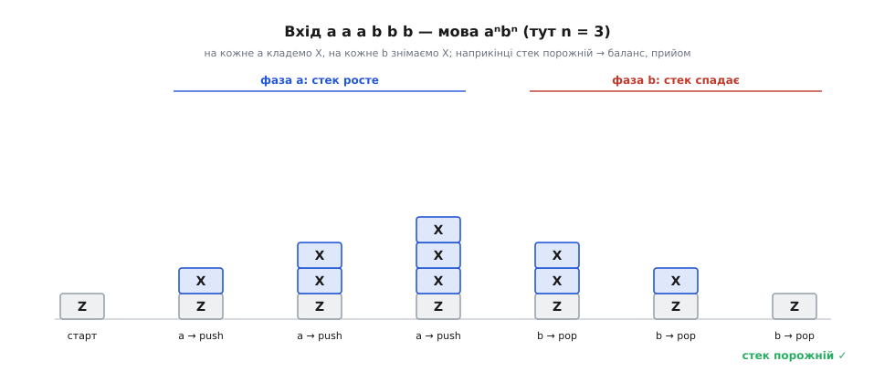
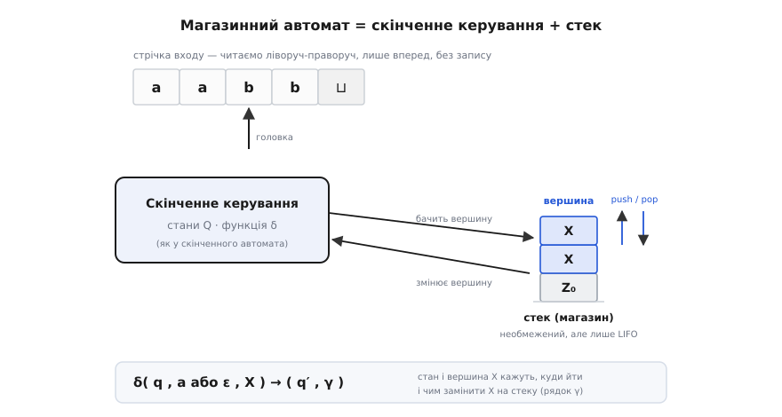
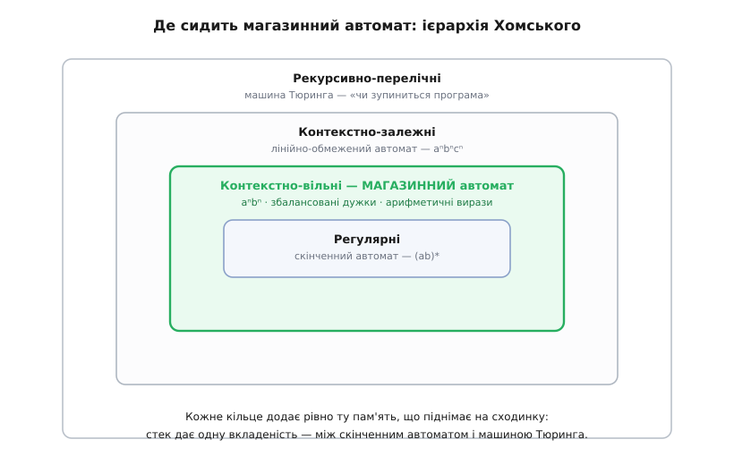

# Магазинні автомати

<preknowlist>
- [Скінченні автомати](book:math/finite-automata) — машина зі скінченним числом станів, задана п'ятіркою ⟨Q, Σ, δ, q₀, F⟩; головна думка «стан = стиснута пам'ять про минуле» і те, що така машина не вміє рахувати довільну вкладеність.
- [Стек](book:programming/stack-lifo) — сховище «останнім поклав — першим узяв» (LIFO) із двома діями: покласти зверху (push) і зняти зверху (pop); доступ лише до вершини.
- [Регулярні мови](book:math/regular-languages) — клас мов, які розпізнає скінченний автомат; саме його межу магазинний автомат і переступає.
</preknowlist>

Скінченний автомат читає рядок символ за символом і тримає в голові лише один зі скінченного числа станів. Цього досить напрочуд часто — але не завжди. Спробуйте змусити його перевірити просту річ: чи збалансовані дужки у виразі `((()))` — чи стоїть рівно стільки закривних дужок, скільки відкривних, і в правильному порядку. Тут машина безсила, і причина глибока, а не технічна. Щоб знати, скільки ще закривних дужок треба, доводиться пам'ятати, скільки відкривних уже відкрито, — а це число нічим не обмежене. Скінченний набір станів такого лічильника не вмістить: рано чи пізно два різні рівні вкладеності доведеться злити в один стан, і машина їх сплутає.

Отже, бракує пам'яті — і не абиякої, а рівно потрібного роду. Постає точне питання: **що найменше додати до скінченного автомата, щоб він упорався з вкладеністю, але не перетворився на щось всесильне й некероване?** Відповідь елегантна: дати машині один **стек** — сховище, куди можна лише класти зверху й знімати зверху. Не масив із довільним доступом, не другу стрічку — саме стек. Автомат зі скінченним керуванням і таким стеком називають **магазинним автоматом**.

Назва не випадкова. «Магазин» (від фр. *magasin* — склад) ужито тут у тому ж значенні, що й обойма-магазин у зброї: набої вкладають один на один, і першим виходить той, що вклали останнім. Це і є LIFO. Англійська назва *pushdown* («заштовхуваний донизу») малює той самий образ — пружинну стопку тарілок у їдальні: кладеш тарілку — стопка тоне, береш — виринає, і завжди береш верхню.

> 🔧 **Навіщо це.** Щоразу, коли ви пишете код, що читає щось вкладене — JSON, XML, вирази з дужками, блоки `{...}` у мові, — усередині працює магазинний автомат. Зрозумівши, що «вкладеність = стек», ви перестанете городити лічильники-прапорці для рівнів і візьмете одну природну структуру, яка сама стежить за порядком закриття.

## Чому саме стек

Найкраще відчути силу стека на найпростішій задачі, що не по зубах скінченному автоматові: мова **aⁿbⁿ** — рядки, де спершу йде якесь число символів `a`, а тоді **рівно стільки ж** символів `b`. `aabb` — так, `aaabbb` — так, `aab` — ні, `abab` — ні. Скінченний автомат ламається на тому самому: щоб звірити хвіст `b` із головою `a`, треба пам'ятати їхнє число, а воно необмежене.

Зі стеком розв'язок стає майже фізичним. Читаємо `a` — **кладемо** на стек одну фішку (позначмо її X). Ще `a` — ще одну фішку. Скільки `a` прочитали, стільки X лежить на стеку: стек **порахував** їх за нас, не тримаючи самого числа в скінченному керуванні. Потім починаються `b` — і на кожне `b` ми **знімаємо** одну фішку. Якщо `a` і `b` порівну, остання фішка зійде рівно на останньому `b`, і стек **спорожніє**. Якщо `b` менше — на стеку лишаться зайві X; якщо `b` більше — стек спорожніє зарано, і зняти буде нíчого. Умова прийому проста: вхід скінчився, а стек порожній.


*Магазинний автомат розпізнає aⁿbⁿ на вході «aaabbb». Кожне a кладе фішку X на стек, кожне b знімає одну; сім знімків показують, як стек росте до трьох фішок і спадає назад. Рівність числа a і b означає, що остання фішка зійде рівно на останньому b — стек порожній, рядок прийнято. Скінченне керування при цьому не тримає жодного числа: усю рахубу веде стек.*

Тут і видно, чому стек — саме те, що треба. Число `a` могло бути яким завгодно великим, а керування лишилося скінченним: усю рахубу перебрав на себе стек. Але ця пам'ять не всесильна — до неї є доступ **лише з вершини**. Ми не можемо зазирнути на дно, не знявши все, що зверху. Саме це обмеження й тримає магазинний автомат від того, щоб стати надто сильним, — і водночас точно збігається з природою вкладеності: остання відкрита дужка закривається першою, як остання покладена фішка знімається першою.

## Означення: автомат — це сімка

Скінченний автомат задають п'ятіркою. Магазинний — **сімкою** (*7-tuple*), бо додаються дві речі, обидві пов'язані зі стеком:

```
M = ⟨ Q, Σ, Γ, δ, q₀, Z₀, F ⟩

Q  — скінченна множина станів керування
Σ  — алфавіт входу  (Sigma)
Γ  — алфавіт стека  (Gamma) — які фішки можна класти
δ  — функція переходів
q₀ — початковий стан,  q₀ ∈ Q
Z₀ — символ, що спершу лежить на дні стека
F  — множина приймальних станів,  F ⊆ Q
```

Нове проти скінченного автомата — це **Γ** (окремий алфавіт для фішок на стеку; він не мусить збігатися з алфавітом входу) і **Z₀** (позначка, що лежить на дні від початку, — щоб машина розуміла, коли стек «порожній» від корисних фішок). Але серце, як завжди, у **δ**. Тепер вона дивиться не на дві речі, а на три: **поточний стан**, **черговий символ входу** і **символ на вершині стека**. А в результаті каже дві речі: у який **стан** перейти і чим **замінити вершину** стека.


*Будова магазинного автомата. Угорі — стрічка входу, яку читають лише вперед і лише на читання, як у скінченного автомата. У центрі — скінченне керування зі станами Q. Праворуч — стек: необмежений, але з доступом лише з вершини. Функція δ дивиться на трійку (стан, символ входу або ε, вершина) і каже, у який стан перейти й чим замінити вершину. Уся нова сила проти скінченного автомата — саме в цьому стеку.*

Заміна вершини — це і є push та pop одним поняттям. Функція повертає рядок **γ**, що стає на місце знятого верхнього символу: якщо γ порожній — це чистий **pop** (вершину прибрали); якщо γ дорівнює самому знятому символу — стек не змінився; якщо γ довший — це **push** (поклали щось нове зверху). Одна операція «зняв вершину, поклав натомість рядок» покриває всі випадки.

Є ще одна тонкість, що дає магазинному автоматові гнучкість: перехід можна робити **не читаючи входу** — за так званим порожнім символом **ε** (грец. — «нічого»). Такий крок міняє лише стек і стан, а головка стрічки стоїть на місці; це зручно, наприклад, щоб прибрати стек наприкінці. Прийнятим рядок уважають, коли по прочитанні всього входу машина опинилася у приймальному стані з F (прийом за станом) — або, у рівносильному формулюванні, коли стек спорожнів (прийом за порожнім стеком). Обидва означення дають той самий клас мов, тож користуються тим, що зручніше.

## Той самий автомат у коді

Щоб «стек = вкладеність» перестало бути абстракцією, візьмімо задачу, яку кожен програміст бачив, і напишімо магазинний автомат прямо.

**Завдання:** перевірити, чи збалансовані дужки трьох видів — `()`, `[]`, `{}` — з довільною вкладеністю: `([]{})` — так, `([)]` — ні, `(((` — ні.

```python
PAIRS = {')': '(', ']': '[', '}': '{'}   # закривна → її відкривна пара

def balanced(s):
    stack = []                        # магазин; порожній стек — це «на дні лише Z₀»
    for c in s:
        if c in '([{':                # відкривна: кладемо на вершину (push)
            stack.append(c)
        elif c in ')]}':              # закривна: знімаємо вершину (pop)
            if not stack:             # нíчого знімати → закривних забагато
                return False
            if stack.pop() != PAIRS[c]:   # вершина не пасує до цієї дужки
                return False
    return not stack                  # прийом ⟺ стек порожній
```

Це буквально магазинний автомат. Станів у нього по суті один (керування тривіальне), а всю роботу робить стек: Γ тут — це `{(, [, {}`, кожна відкривна дужка — push, кожна закривна — pop із перевіркою. Рядок `if stack.pop() != PAIRS[c]` — це і є δ, що дивиться на пару «символ входу, вершина стека» й вирішує долю. І ось чому саме LIFO-порядок тут незамінний: рядок `([)]` провалюється, бо коли машина доходить до `)`, на вершині лежить `[`, а не `(`. Стек **безкоштовно** стежить, що закривати треба в зворотному порядку до відкривання, — сам розворот дає йому дисципліна «останнім поклав, першим узяв».

> 🔧 **Навіщо це.** Той самий десяток рядків живе в кожному редакторі, що підсвічує парну дужку, і в кожному лінтері, що кричить про незакритий тег. Варто побачити тут магазинний автомат — і стає ясно, **чому** такі перевірки такі дешеві (один прохід, одна дія на символ) і чому вони чесно ловлять саме неправильний **порядок** закриття, а не лише кількість дужок.

## Недетермінізм тут раптом додає сили

Магазинний автомат підносить сюрприз, якого не було в скінченного. У скінченного автомата дозвіл «вгадувати» (недетермінізм) не додає нічого: недетерміновану машину завжди можна перебудувати в детерміновану, що розпізнає ту саму мову. З магазинним автоматом **це не так** — і саме тут криється щось глибоке.

Візьмімо мову **парних паліндромів**: рядки, що читаються однаково зліва й справа, як `abba` чи `abccba`, — тобто друга половина є дзеркалом першої. Стеком це ніби легко: клади символи першої половини на стек, а тоді, у другій половині, знімай по одному й звіряй — стек **сам розвертає** порядок (знову LIFO!), тож зверху завжди лежить рівно той символ, що має збігтися. Але є заковика: машина читає рядок **зліва направо, за один прохід** і не знає наперед, **де середина**. А знати треба: саме на середині слід перестати класти й почати знімати.

Детермінований магазинний автомат мусив би визначити середину за якимось однозначним правилом — а його нема (розділювача в рядку немає). Тож детермінований автомат тут безсилий. Недетермінований — ні: йому дозволено на кожному кроці **вгадувати**, чи не тут середина, і прийом зараховують, якщо **існує** бодай один правильний здогад. Це не хитрість заради хитрості: **недетермінований магазинний автомат сильніший за детермінований**, і клас мов, що їх бере детермінований, — лише частина всіх контекстно-вільних. Ця відмінність — не абстракція: детерміновані магазинні автомати — це рівно те, що стоїть за швидкими однопрохідними синтаксичними аналізаторами, тому мови програмування й проєктують так, щоб їхню граматику брав детермінований автомат.

> 🔧 **Навіщо це.** Проєктуючи синтаксис нової мови, борються за те, щоб її граматику брав **детермінований** магазинний автомат: тоді парсер працює за один прохід без вгадувань і відкатів (це і є родини LL- та LR-парсерів). Дволикі, неоднозначні конструкції, що вимагають здогаду наперед, — прямий шлях до повільного чи крихкого розбору.

## Дві мови про одне: автомат і граматика

Тепер — найкрасивіше. Магазинний автомат — це **розпізнавач**: йому дають рядок, він каже «так» чи «ні». Але той самий клас мов можна описати з іншого боку — **породжувально**, правилами, що вирощують правильні рядки з нічого. Такі правила звуть [контекстно-вільною граматикою](book:math/formal-grammar) (context-free grammar, знайома програмістам як BNF): наприклад, правило `S → ( S ) S | ε` породжує рівно всі збалансовані дужки. І ось теорема, що з'єднує два світи: **магазинні автомати розпізнають рівно ті мови, які породжують контекстно-вільні граматики**. Ні більше, ні менше. Мова, задана граматикою, завжди має свій магазинний автомат — і навпаки. Ці мови так і звуть — **контекстно-вільні** (*context-free*).

Це точний двійник тієї відповідності, що для скінченних автоматів пов'язує регулярний вираз і машину, лише на сходинку вище: там — вираз ⇄ автомат, тут — граматика ⇄ магазинний автомат. Саме тому синтаксис мов програмування описують граматикою (людині зручно **писати** правила), а компілятор будує з неї автомат (машині зручно **виконувати** розпізнавання). [Як саме граматику перетворюють на автомат і назад](book:math/pushdown-automata/math-pda-cfg-equivalence.md) — окрема, дуже показова конструкція.


*Місце магазинного автомата в ієрархії Хомського. Кожне вкладене кільце — ширший клас мов і сильніша машина: від регулярних (скінченний автомат) через контекстно-вільні (магазинний автомат, підсвічено) і контекстно-залежні до рекурсивно-перелічних (машина Тюринга). Стек піднімає рівно на одну сходинку — дає одну лінію вкладеності, як-от aⁿbⁿ, недосяжну для скінченного автомата, але не aⁿbⁿcⁿ, що вимагає вже більшого.*

Це ставить магазинний автомат на своє місце в [ієрархії Хомського](book:math/chomsky-hierarchy) — драбині класів мов за силою потрібної пам'яті. Найнижча сходинка — регулярні мови (скінченний автомат, пам'ять — лише стан). Наступна — контекстно-вільні (магазинний автомат, пам'ять — стан плюс стек). Стек додає рівно **одну** нову здатність: обробляти довільно глибоку, але **правильно вкладену** структуру.

## Де ця сила закінчується

І тут же видно межу — так само чітко, як у скінченного автомата була своя. Один стек дає впоратися з **однією** лінією вкладеності. Але візьміть мову **aⁿbⁿcⁿ** — рівне число `a`, `b` і `c` поспіль. Порахувати `a` стеком можна, звіряючи їх із `b`; та на цьому фішки скінчаться, і на звірку з `c` уже нíчого підняти — стек спорожнів. Двох незалежних лічб один магазин не витягне: знявши фішки на `b`, він забуває початкове число. Ця мова — вже **поза** контекстно-вільними.

Щоб піднятися ще на сходинку, потрібна пам'ять без LIFO-обмеження — вільний доступ у будь-яке місце. Машина з такою пам'яттю — це вже [машина Тюринга](book:math/turing-machine), найсильніша модель обчислення. Магазинний автомат — рівно проміжна ланка: сильніший за скінченний (додав стек), слабший за Тюрингову (стек лише LIFO, і лише один).

## Де це працює

Цей формалізм — фундамент, на якому стоїть уся обробка мов:

- **Синтаксичний аналіз (парсинг).** Кожен компілятор і кожен читач JSON, XML чи HTML усередині — це магазинний автомат: відкрив дужку, тег чи блок — поклав на стек, закрив — зняв і звірив. Вкладений вираз `2 * (3 + (4 - 1))` розбирають рівно так. [Робочий розбір арифметичного виразу зі стеком](book:math/pushdown-automata/proj-expression-parser.md) показує це в коді.
- **Перевірка балансу.** Редактор, що підсвічує парну дужку, і лінтер, що ловить незакритий тег, — це той самий автомат за роботою, той, що ми щойно написали.
- **Стек виклику програми.** Саме виконання рекурсивної програми — це магазинний автомат у дії: виклик функції кладе кадр на [стек](book:programming/stack-lifo), повернення знімає. Вкладеність викликів — та сама LIFO-вкладеність.

Ідея визріла на межі лінгвістики й теорії обчислень на початку 1960-х — коли Ноам Хомський класифікував граматики, а поряд шукали машину, що відповідала б контекстно-вільному класу. [Як народився магазинний автомат](book:math/pushdown-automata/hist-pushdown-store.md) — окрема історія з іменами й датами.

Підсумуймо думку суцільно. Скінченний автомат упирається в стелю: скінченна пам'ять не рахує довільної вкладеності. Додавши **один стек** — сховище «останнім поклав, першим узяв», — дістаємо **магазинний автомат**, який строго задають сімкою ⟨Q, Σ, Γ, δ, q₀, Z₀, F⟩, де δ дивиться на стан, вхід і вершину стека, а міняє стан і вершину. Стек рахує вкладеність, не тримаючи чисел у скінченному керуванні, — і цього рівно досить для **контекстно-вільних** мов, тих самих, що їх породжують контекстно-вільні граматики. На відміну від скінченного автомата, тут **недетермінізм додає сили**. А межа теж чітка: один LIFO-стек бере одну лінію вкладеності, але не дві незалежні лічби; далі — вже машина Тюринга. Тому магазинний автомат — і теоретична сходинка в ієрархії, і щоденний робочий кінь кожного парсера.
