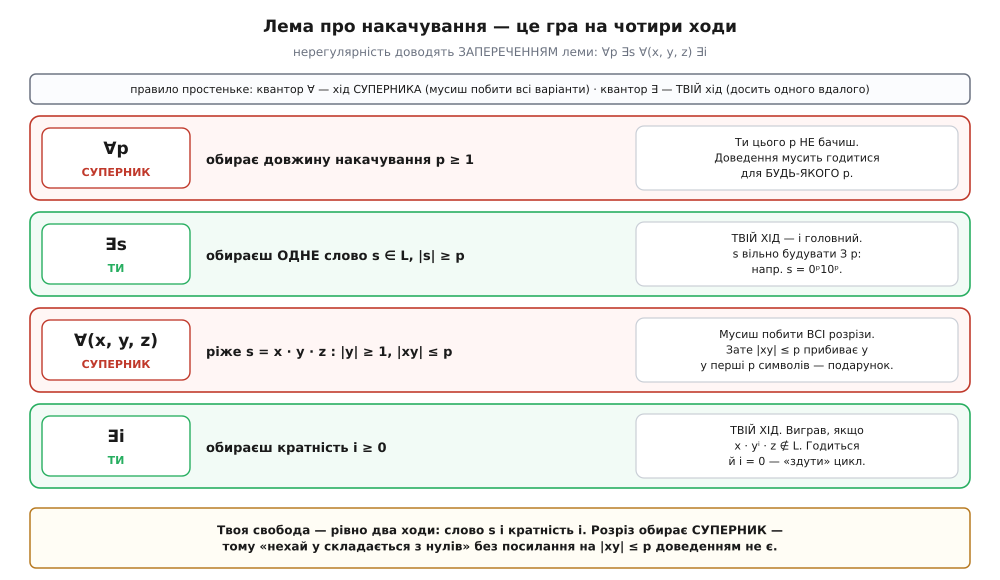
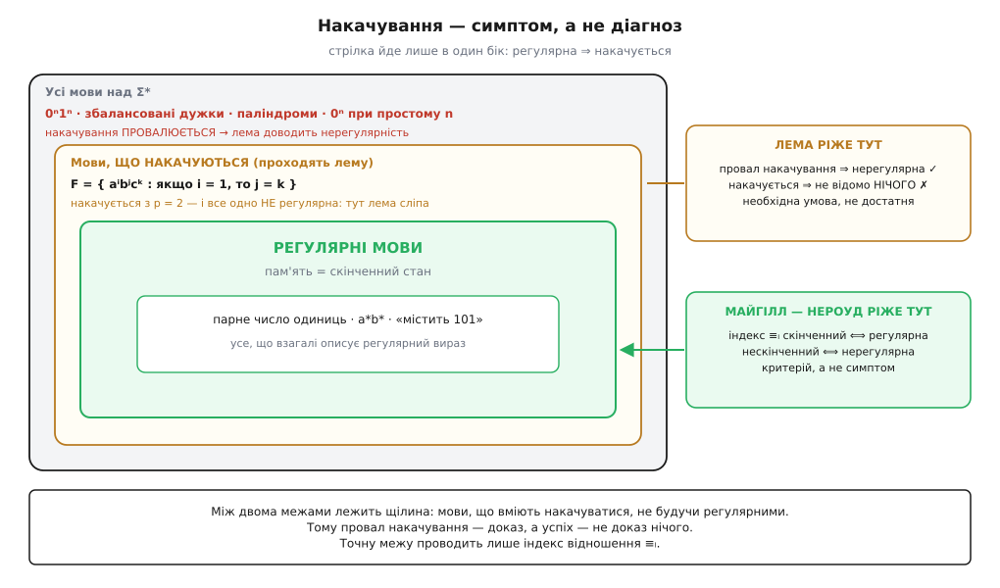
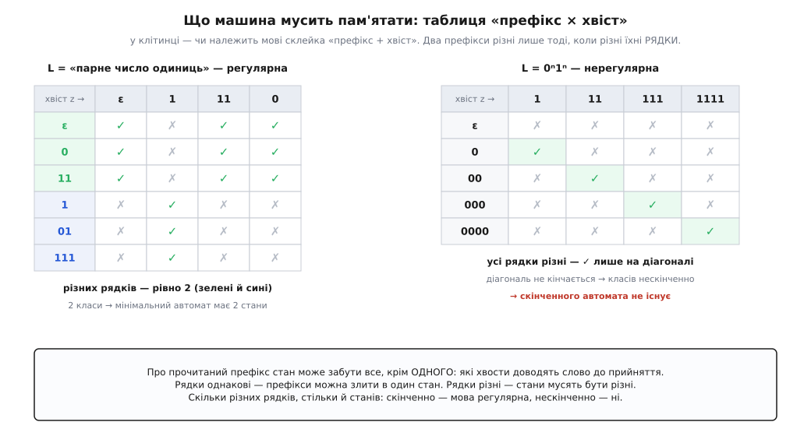

# 🧮 Лема про накачування — і критерій, який точніший за неї

Є аргумент, що з першого разу здається фокусом. Машина має k станів; женемо в неї довге слово; станів менше, ніж кроків, тож якийсь стан неминуче повториться; повтор — це цикл; прокрутімо цикл зайвий раз — і машина прийме слово, якого приймати не мала. Суперечність, мова не регулярна.

Питання, яке варто поставити одразу: це трюк, підігнаний під одну мову, чи механізм, який можна крутити? Відповідь — механізм. Він називається **лемою про накачування** (англ. *pumping lemma*: слово «накачують», вставляючи в нього шматок знову й знову, наче повітря в шину). Але цікаве в ньому не те, що він працює, а те, **де саме закінчується його гарантія**. Бо гарантія в нього несподівано вузька: лема ловить далеко не всі нерегулярні мови, і є мови, які її обдурюють — не будучи регулярними ані на йоту. Тому розмова про накачування чесна лише разом із розмовою про те, що стоїть за ним: про **точний** критерій, який промахів не робить узагалі.

## Звідки взагалі береться можливість накачати

Почнімо не з формулювання, а з механізму — бо все інше з нього просто випадає.

Візьмімо детермінований [скінченний автомат](topic:math/finite-automata) — машину зі скінченною множиною станів, яка на кожен прочитаний символ робить рівно один перехід і наприкінці слова каже «приймаю» або «ні». Прочитати слово — це пройти нею шлях: із початкового стану крок за кроком до останнього.

Тепер головне спостереження, і воно не про слова, а про **шлях**. Слово завдовжки n дає послідовність із n+1 станів: початковий плюс один після кожного прочитаного символу. Якщо станів у машині всього p, а в послідовності їх набирається p+1, то за принципом шухляд якісь два з них — той самий стан. Не «схожі», не «майже» — буквально той самий.

І ось у чому сіль. Стан — це **вся** пам'ять машини. Коли автомат сидить у q, усе, що він знає про прочитане, вичерпується самим q: як він сюди дійшов, чи довго йшов, скільки нулів бачив дорогою — не збереглося ніде, бо зберігати ніде. Тож якщо шлях двічі проходить через q, то шматок слова між цими двома проходами утворює **цикл**: він виводить машину з q і повертає в q. А з циклом можна робити що заманеться. Пройти його двічі. Тричі. Не пройти жодного разу. У кожному з цих випадків машина опиниться в тому самому q — і далі поведеться однаково, бо починати їй щоразу з того самого.

Ось і все. Уся лема — це два речення: **у довгому слові неминуче є цикл, а цикл можна крутити скільки завгодно разів, і машина цього не помітить.** Далі йде тільки бухгалтерія.

> 🔧 **Навіщо це.** Тут щойно з'явився спосіб побачити межу регексу на папері, а не намацати її на власних помилках. Скінченний стан не вміє рахувати без стелі — і ця нездатність лишає **слід**: цикл, який можна прокрутити зайвий раз. Якщо мова таку прокрутку не переживає, автомата для неї не існує, а отже, не існує й регулярного виразу — хоч би скільки ви його ускладнювали.

## Формулювання

```
ЛЕМА ПРО НАКАЧУВАННЯ (для регулярних мов)

Якщо мова L регулярна, то існує таке число p ≥ 1 («довжина накачування»),
що КОЖНЕ слово s ∈ L завдовжки |s| ≥ p можна розрізати на три частини

        s  =  x · y · z

так, що виконано ВСІ три умови:

   (1)  |y| ≥ 1          накачувана частина непорожня
   (2)  |xy| ≤ p         вона цілком лежить у перших p символах
   (3)  x·yⁱ·z ∈ L       для КОЖНОГО i = 0, 1, 2, 3, …
```

Доведення — це просто те, що вже сказано словами, записане акуратно.

```
Нехай L розпізнає детермінований автомат A. Візьмімо p = число станів A.
Візьмімо будь-яке s ∈ L, |s| = n ≥ p,  s = σ₁σ₂…σₙ.

Пробіг A по слову s:
    r₀ ──σ₁──▶ r₁ ──σ₂──▶ r₂ ──▶ … ──σₙ──▶ rₙ ,   причому rₙ — приймальний

Станів у цій послідовності n+1 ≥ p+1. Дивимось лише на ПЕРШІ p+1:
    r₀, r₁, r₂, …, r_p
Різних значень серед них щонайбільше p (стільки станів має A),
а самих їх тут p+1.  Принцип шухляд: знайдуться такі
    j < l ≤ p      з      r_j = r_l

Ріжемо слово рівно по цих двох місцях:
    x = σ₁ … σ_j          веде  r₀ ⟶ r_j
    y = σ_{j+1} … σ_l     веде  r_j ⟶ r_l = r_j     ← ЦЕ Й Є ЦИКЛ
    z = σ_{l+1} … σₙ      веде  r_j = r_l ⟶ rₙ

Перевіряємо три умови:
    |y| = l − j ≥ 1                                   бо j < l        → (1)
    |xy| = l ≤ p                                      бо l ≤ p        → (2)
    з r_j кожна копія y вертає машину знову в r_j,
    хоч 0 копій, хоч 5; далі z доводить її в rₙ,
    а rₙ приймальний                                                  → (3)
∎
```

Тепер пройдімося по умовах і подивімося, звідки кожна взялася — бо всі три походять із того самого одного факту, і жодну не додано «для краси».

**Звідки p.** Це число станів автомата. Саме тому лема каже «існує p», а не називає його: автомата ви не бачите, ви ж якраз доводите, що його немає. Лема віддає вам факт існування, а саме значення лишає при собі. Це не примха запису — це чесне відображення того, що ви справді знаєте.

**Звідки (1).** Цикл проходиться щонайменше за один крок: j < l, бо це два **різні** місця в послідовності. Порожній y зробив би умову (3) тривіальною й нікчемною.

**Звідки (2).** Ми свідомо звузили пошук повтору до перших p+1 станів — і принцип шухляд усе одно спрацював, бо p+1 значень у p шухлядах не вміщаються навіть тут. Це чистий виграш: за ту саму ціну лема каже не просто «десь у слові є цикл», а «цикл є **у перших p символах**». Без цього посилення лема була б майже некорисною: ви б не знали, з чого складається y, і не змогли б нічого про нього стверджувати.

**Звідки (3), включно з i = 0.** Нуль копій — це теж законний прохід: не зайти в цикл жодного разу. Слово x·z (тобто x·y⁰·z) машина теж приймає. «Накачати» означає й «здути», і цей хід нерідко єдиний робочий.

І одразу — застереження, яке згодом виявиться найважливішим у всій статті. Придивіться, **про що лема мовчить**. Вона говорить винятково про слова **з** мови: узяли s ∈ L — дістали x·yⁱ·z ∈ L. Про слова поза мовою вона не каже нічого. І про те, чи однаково машина поводитиметься **далі** після x·y і після x·y·y, — теж нічого: її цікавить лише, чи вціліло членство накачаного слова. Обидві ці мовчанки — та сама щілина, і крізь неї потім пролізе цілком нерегулярна мова.

## Чотири квантори — це гра на чотири ходи

Формулювання ховає під собою ланцюжок кванторів, і саме він, а не арифметика, валить більшість спроб застосувати лему:

```
∃p   ∀s ∈ L, |s| ≥ p   ∃ розріз (x, y, z)   ∀i ≥ 0  :  x·yⁱ·z ∈ L
```

Ви ж доводите **не** лему, а її **заперечення** — бо мета: показати, що ніякого p не існує. Заперечення читається простим перевертанням кожного квантора:

```
∀p   ∃s ∈ L, |s| ≥ p   ∀ розріз (x, y, z)   ∃i ≥ 0  :  x·yⁱ·z ∉ L
```

Чергування ∀-∃-∀-∃ — це буквально гра двох гравців. ∀ означає «мусиш упоратися з будь-яким варіантом» — отже, ходить суперник. ∃ означає «досить одного вдалого» — отже, ходите ви. Черга ходів читається зліва направо, як у шахах.


*Заперечення леми як гра. Суперник обирає довжину накачування p — і ви її не бачите. Ви обираєте одне слово s ∈ L, і його вільно будувати з p. Суперник ріже слово на x·y·z, як йому заманеться, — ви мусите побити всі розрізи; єдине, що його стримує, — умова |xy| ≤ p, яка прибиває y до перших p символів. Ви обираєте кратність i і виграєте, якщо x·yⁱ·z вилетіло з мови. Ваших ходів рівно два: слово s і кратність i.*

Звідси — головна помилка, яку роблять із лемою: **обрати розріз за суперника**. «Нехай y складається з нулів» — це не крок доведення, поки ви не показали, що інакше й бути не може. Право різати належить супернику; ви можете лише **загнати** його в кут — так побудувати слово s, щоб усі розрізи, дозволені умовою |xy| ≤ p, виявилися на один копил.

Звідси ж і рецепт, у якому весь фокус зосереджений в одному кроці:

```
СХЕМА ДОВЕДЕННЯ НЕРЕГУЛЯРНОСТІ

1. Припусти протилежне: L регулярна. Нехай p — її довжина накачування
   (яке саме — не знаєш і знати не мусиш).

2. ⚑ Придумай слово s ∈ L, |s| ≥ p, у якого ПЕРШІ p СИМВОЛІВ ОДНОРІДНІ —
   один суцільний блок однакових літер. Тоді умова |xy| ≤ p сама, без твоєї
   допомоги, скаже, з чого складається y.                    ← ТУТ УСЯ РОБОТА

3. Візьми ДОВІЛЬНИЙ розріз s = x·y·z з |y| ≥ 1 і |xy| ≤ p. Випиши, чим y
   МОЖЕ бути (після кроку 2 варіант зазвичай один: y = ⟨літера⟩ᵏ, 1 ≤ k ≤ p).

4. Підбери i — найчастіше 2 («накачати») або 0 («здути») — і покажи,
   що x·yⁱ·z уже не в L.

5. Суперечність. Отже, p не існує, отже, L не регулярна. ∎
```

Крок 2 — це не порада, це весь метод. Решта — арифметика.

## Схема в роботі

### Збалансовані дужки

```
L = { правильні дужкові послідовності над Σ = { ( , ) } }
    так:  ()   (())   ()()   ((()))
    ні:   (    )(     (()

Слово:   s = (ᵖ )ᵖ  ∈ L,   |s| = 2p ≥ p

Перші p символів — суцільний блок відкритих дужок. Умова |xy| ≤ p замикає
x і y всередині цього блоку, тож вибору в суперника немає:
        y = (ᵏ ,   1 ≤ k ≤ p

Беремо i = 2:
        x·y²·z  =  (ᵖ⁺ᵏ )ᵖ
        відкритих  p+k,  закритих  p,  а k ≥ 1  →  незбалансовано  →  ∉ L
```

Суперечність. Дужки — не регулярні. І тут добре видно, що доводить лема **насправді**: не «дужки складні», а «глибину вкладеності не вдержати скінченним станом». Порахувати відкриті дужки, щоб потім звірити із закритими, — це і є та сама заборонена пам'ять без стелі.

### Паліндроми

Спершу подивімося, як програти цю партію, — бо помилка тут повчальніша за успіх.

```
L = { w ∈ {0,1}* : w = wᴿ }        wᴿ — те саме слово, прочитане навспак

Спокуслива спроба:  s = 0²ᵖ.  Слово в мові (суцільні нулі — паліндром),
довжина є. Розріз: y = 0ᵏ. Накачуємо:
        x·y²·z  =  0^{2p+k}
        …і це ЗНОВУ паліндром. І при i = 0 паліндром. І при i = 17.
Накачування не заперечило нічого. Свій єдиний хід ви щойно змарнували.
```

Слово-невдаха вбило доведення не тому, що лема слабка, а тому, що це слово нічого від машини не вимагає. Автомат для «самих нулів» — тривіальний. Треба слово, яке **змушує** машину звірити дві невідомі наперед довжини:

```
Робоче слово:   s = 0ᵖ · 1 · 0ᵖ  ∈ L,   |s| = 2p+1 ≥ p

Перші p символів — суцільний блок нулів (одиниця стоїть аж на позиції p+1).
Умова |xy| ≤ p замикає y в ЛІВОМУ блоці:
        y = 0ᵏ ,   1 ≤ k ≤ p

Беремо i = 2:
        x·y²·z   =  0^{p+k} · 1 · 0ᵖ
        навспак  =  0ᵖ · 1 · 0^{p+k}
        збігаються лише при k = 0, а в нас k ≥ 1  →  не паліндром  →  ∉ L
```

Одиниця посередині — не прикраса й не випадковість. Вона робить два блоки нулів **розрізненними**, і тепер їхні довжини мусять збігтися; накачування псує ліву, не чіпаючи правої. Слово s у цій грі — не «якесь довге слово з мови», а інструмент, спеціально виточений під те, щоб машині стало нічим думати.

### Коли накачувати треба вниз

```
L = { 0ⁿ1ᵐ : n > m ≥ 0 }        нулів СУВОРО більше, ніж одиниць

Слово:   s = 0^{p+1} 1^p  ∈ L      (нулів рівно на один більше)
Розріз:  y = 0ᵏ,  1 ≤ k ≤ p        (перші p символів — нулі)

i = 2  НЕ ГОДИТЬСЯ:
        x·y²·z = 0^{p+1+k} 1^p  —  нулів стало ще більше, слово ЛИШИЛОСЬ у L.
        Накачуючи вгору, ви робите мові послугу.

i = 0  ЛАМАЄ:
        x·y⁰·z = 0^{p+1−k} 1^p
        k ≥ 1  →  p+1−k ≤ p  →  нулів уже не більше за одиниці  →  ∉ L
```

Мораль коротка: коли мова каже «більше», надувати марно — треба здувати. Кратність i — ваш хід, і нуль на ньому такий самий законний, як двійка.

### Коли блоків немає взагалі

Усі приклади вище спиралися на однорідний блок. А якщо в алфавіті одна-єдина літера й ніяких блоків просто не буває?

```
L = { 0ⁿ : n — просте число }        Σ = { 0 }

Накачується сама ДОВЖИНА — більше тут нема чого накачувати.

Просте n можна взяти скільки завгодно велике (простих нескінченно —
теорема Евкліда). Візьмімо  n ≥ p+2  і слово  s = 0ⁿ ∈ L.

Розріз:  |y| = k,  1 ≤ k ≤ p    (тому й |x| + |z| = n − k)

Довжина накачаного слова — арифметична прогресія за i:
        |x·yⁱ·z|  =  (n − k)  +  i·k

Хід: обираємо i = n − k  (кратність не мусить бути маленькою!):
        |x·yⁱ·z|  =  (n − k) + (n − k)·k  =  (n − k)·(1 + k)

Обидва множники не менші за 2:
        1 + k ≥ 2        бо  k ≥ 1
        n − k ≥ 2        бо  k ≤ p,  а  n ≥ p+2

Довжина — добуток двох чисел, кожне ≥ 2  →  число складене  →  не просте
        →  x·yⁱ·z ∉ L
```

Це найкраща відповідь на питання «а що робити, коли структури немає». Кратність i — величина, яку **ви** будуєте, і будувати її можна з чого завгодно: з p, з n, з k. Тут вона підібрана так, щоб довжина розклалася на множники просто за побудовою.

### Сусідній інструмент, який часто коротший

Лема — не єдиний спосіб, і нерідко не найшвидший. Клас регулярних мов замкнений щодо перетину, тож якщо L регулярна, то й L ∩ R регулярна для будь-якої регулярної R. Обертаємо це проти L: підбираємо R так, щоб перетин зрізав із мови всю зайву свободу й лишив голий кістяк, про який уже все відомо.

```
L = { w ∈ {0,1}* : нулів у w стільки ж, скільки одиниць }
                    (у будь-якому порядку — 0011, 0101, 1100, 011010…)

R = 0*1*            регулярна: це просто регулярний вираз

L ∩ R = { 0ⁿ1ⁿ : n ≥ 0 }        ← стара знайома; від звичної версії різниться
                                  лише порожнім словом, а одне слово на
                                  регулярність не впливає ніяк

Якби L була регулярна, перетин двох регулярних мов був би регулярним.
Він не регулярний  →  L не регулярна.  ∎
```

Жодного p, жодного розбору випадків — три рядки. Так само працюють гомоморфізми (перейменування літер) та обернення слів. Тримайте цей прийом поруч із лемою: вони закривають різні задачі, а подеколи замкненість лишається взагалі єдиним, що працює.

## Межа леми: накачування — це симптом, а не діагноз

Тепер про головне. Лема — це імплікація, і вона однобока:

```
        L регулярна   ⟹   L накачується

Протилежним боком (контрапозиція) — це робочий інструмент:

        L не накачується   ⟹   L НЕ регулярна        ✔ доказ

А ось у зворотний бік вона НЕ йде:

        L накачується   ⟹   L регулярна ?            ✘ ХИБНО
```

Останній рядок — не формальна прискіпливість. Є цілком конкретна мова, яка лему проходить, а регулярною не є. Ось вона:

```
F  =  { aⁱ bʲ cᵏ  :  i, j, k ≥ 0,  і ЯКЩО i = 1, ТО j = k }
```

Прочитайте це вголос — і задум стане видно. Здебільшого слово вільне: будь-яка кількість a, потім будь-яка кількість b, потім будь-яка кількість c, жодних умов. Але в одній-єдиній вузькій смузі, коли a рівно одна, мова раптом вимагає найважчого — щоб b і c було порівну. Тобто це мова з **твердим ядром, схованим у величезному м'якому тілі**. І весь фокус у тому, що накачування в те тверде ядро просто ніколи не заходить.

### F накачується — з довжиною накачування p = 2

```
Беремо будь-яке s ∈ F, |s| ≥ 2. Нехай i, j, k — кількості a, b, c у ньому.
Кратність накачування позначаємо n: літера i тут уже зайнята кількістю a.
Розбір за i (для кожного випадку пред'являємо СВІЙ розріз):

i = 0:   s = bʲcᵏ.        x = ε,  y = перший символ s,  z = решта.
         Накачуємо самі b або самі c → літер a завжди 0, ніколи 1
         → умова «якщо i = 1…» не вмикається жодного разу → усе в F ✓

i = 1:   s = a bʲcᵏ, причому вже j = k (бо s ∈ F, а i = 1).
         x = ε,  y = a,  z = bʲcʲ.
         x·yⁿ·z = aⁿ bʲcʲ
            n = 1  → i = 1, але ж j = k — умова виконана ✓
            n ≠ 1  → умова спить ✓

i = 2:   s = a a bʲcᵏ, жодних обмежень на j і k.
         x = ε,  y = aa,  z = bʲcᵏ.          (|xy| = 2 ≤ p — щойно влізло)
         x·yⁿ·z = a²ⁿ bʲcᵏ  →  літер a буде 0, 2, 4, 6, … і НІКОЛИ 1 ✓

i ≥ 3:   x = ε,  y = a,  z = a^{i−1} bʲcᵏ.
         x·yⁿ·z = a^{n+i−1} bʲcᵏ  →  літер a щонайменше i−1 ≥ 2, знову не 1 ✓
```

Для кожного слова F знайшовся законний розріз, який накачується в обидва боки на всі кратності. Лема задоволена; p = 2.

Випадок i = 2 показує, що цей розбір — не декорація:

```
        aabbbc  ∈ F            (i = 2 ≠ 1, тож умова про j = k спить)

Наївний розріз  x = ε, y = a  здувається до
        abbbc :  тепер i = 1, а j = 3 ≠ 1 = k   →   ∉ F     ✘ розріз не годиться

Правильний розріз  y = aa  дає кількості a: 0, 2, 4, 6, …
        одиниця ПЕРЕСТРИБНУТА  →  небезпечна смуга i = 1 недосяжна   ✓
```

Через це p = 1 не спрацювало б, а p = 2 спрацьовує рівно тому, що дозволяє взяти дволітерний y. Мова наче спеціально відміряна під власну лему — так воно і є.

### І все ж F не регулярна

Лема тут не скаже нічого — вона вже сказала «так». Каже замкненість:

```
R = a b* c*                     регулярна

F ∩ R  =  { a bʲcᵏ  ∈ F }       перетин змушує i = 1,
       =  { a bʲcʲ : j ≥ 0 }    а тоді означення F вимагає j = k
       =  { a, abc, abbcc, abbbccc, abbbbcccc, … }
```

Це наша стара знайома 0ⁿ1ⁿ у новому вбранні: `b` і `c` замість `0` і `1`, та ще одна `a` спереду. І її лема ловить одразу:

```
s = a bᵖ cᵖ  ∈  F ∩ R.  Перші p символів — це «a bᵖ⁻¹», тож розрізів два роди:

  y містить a  (тоді x = ε, y = a bᵐ, m ≥ 0):
        x·y²·z = a bᵐ a bᵐ bᵖ⁻ᵐ cᵖ  —  у слові стало ДВІ літери «a»
        → а вигляд a b* c* дозволяє рівно одну  →  ∉ F ∩ R
  y = bᵐ, m ≥ 1:
        x·y²·z = a b^{p+m} cᵖ  →  j = p+m ≠ p = k  →  ∉ F ∩ R

Отже F ∩ R не регулярна. Але перетин регулярних мов регулярний —
тож якби F була регулярна, був би регулярним і перетин.  →  F не регулярна. ∎
```

### Чому лема це проґавила

Тепер варто зупинитися й назвати причину, бо вона й веде далі.

Лема записує рівно **один** наслідок скінченності: у пробігу довгого слова, яке машина приймає, неминуче є цикл. F підробляє саме цей наслідок — і більше нічого. Її м'яке тіло (усі i ≠ 1) поглинає будь-яке накачане слово без питань, а тверде ядро (i = 1) — це вузесенька смуга, у яку накачування ніколи не мусить заходити; розріз y = aa її просто перестрибує.

Придивіться, які два питання лема **не поставила**:

- Вона питала лише про слова **з** мови. Про те, що робиться поза F, вона не сказала нічого — а вся складність F саме в тому, як мова межує з рештою.
- Вона питала лише «чи вціліло **членство** накачаного слова». Вона не питала, чи однаково машина поводитиметься **далі**. А от це — питання по суті. Після префікса `a` мова вимагає від хвоста «стільки c, скільки b». Після `aa` вона не вимагає нічого. Це два **різні майбутні** — і саме тут ховається нескінченність, якої скінченний стан не потягне. Лема пройшла повз, бо про майбутнє не запитала.

Друга мовчанка й підказує, як питати правильно.


*Де ріже лема, а де — точний критерій. Зовні лишилися мови, у яких накачування провалюється: 0ⁿ1ⁿ, дужки, паліндроми, прості довжини — лема доводить їхню нерегулярність. Усередині — регулярні. А між цими межами є щілина, і в ній живе F: накачується з p = 2 й регулярною не є. Тому провал накачування — це доказ, а успіх — не доказ нічого. Рівно по межі регулярних ріже інша річ: індекс відношення ≡ₗ.*

## Точний критерій: те саме питання, поставлене правильно

Облишмо цикли й довгі слова й спитаймо просто: **що машина взагалі мусить пам'ятати про прочитане?**

Стан, у якому машина опинилася після префікса x, — це все, що вона про x знатиме до кінця. Отже, питання зводиться до іншого: що з x справді треба нести далі, а що можна викинути?

Відповідь бентежно проста. Про x важить рівно одне — **його майбутнє**, тобто множина хвостів, які доводять слово до прийняття:

```
Майб(x)  =  { z ∈ Σ* :  x·z ∈ L }
```

І чому нічого, крім цього, не важить, видно з обох боків:

- Якщо Майб(x) = Майб(y), то **жодній** машині не треба їх розрізняти: доля будь-якого хвоста після x і після y однакова, тож два стани тут — марнотратство.
- Якщо Майб(x) ≠ Майб(y), то **кожна** машина мусить їх розрізнити. Бо є хвіст z, на якому вони розходяться: скажімо, x·z ∈ L, а y·z ∉ L. Якби машина після x і після y сиділа в тому самому стані, далі вона читала б той самий z із того самого місця — і дала б на xz та yz **однакову** відповідь. А відповіді мусять бути різні. Суперечність.

Тобто майбутні — це не «щось схоже на стани». Це **і є** стани, з точністю до перейменування. Запишімо це відношенням:

```
x ≡ₗ y     ⟺     для КОЖНОГО z ∈ Σ*:   x·z ∈ L  ⟺  y·z ∈ L
```

Що це еквівалентність (рефлексивна, симетрична, транзитивна) — видно одразу. Але є в нього й друга властивість, менш очевидна й геть не декоративна:

```
x ≡ₗ y   ⟹   x·a ≡ₗ y·a        для кожної літери a
```

Бо Майб(x·a) = { z : a·z ∈ Майб(x) } — майбутнє довшого префікса цілком визначене майбутнім коротшого. Це називають **правосторонньою інваріантністю** (відношення витримує дописування справа), і саме вона перетворює класи на **автомат**, а не просто на розбиття: якщо клас склеїв x і y, то дописування літери переводить обидва в той самий клас — отже, перехід «клас + літера → клас» узагалі має право існувати.

### Теорема Майгілла — Нероуда

```
L регулярна   ⟺   відношення ≡ₗ має СКІНЧЕННЕ число класів еквівалентності.

Більше того: це число ДОРІВНЮЄ числу станів мінімального
детермінованого автомата для L.
```

Обидва боки доводяться коротко — уся робота вже зроблена означенням.

```
(⟹)  L регулярна.  Нехай A — детермінований автомат для L з m станами.
      Якщо x і y приводять A в той самий стан, то далі A їх не розрізняє:
      для будь-якого z доля xz і yz однакова  →  x ≡ₗ y.
      Отже кожен клас ≡ₗ склеєний зі «шухляд за станом», а шухляд рівно m.
      Класів щонайбільше m  →  скінченно.  ∎

(⟸)  Класів скінченно.  Будуємо автомат ПРЯМО з них:

        стани        Q = { [x] : x ∈ Σ* }      класи ≡ₗ — їх скінченно
        початковий   q₀ = [ε]
        переходи     δ([x], a) = [x·a]         коректно — за правосторонньою
                                               інваріантністю: від вибору
                                               представника не залежить
        приймальні   Fприйм = { [x] : x ∈ L }  коректно — візьміть z = ε
                                               в означенні ≡ₗ

      Індукцією по довжині: прочитавши w, машина стоїть у стані [w].
      Отже приймає w  ⟺  [w] ∈ Fприйм  ⟺  w ∈ L.
      Автомат скінченний  →  L регулярна.  ∎
```

Зверніть увагу, чого в цих двох абзацах **немає**: ані циклу, ані принципу шухляд, ані «достатньо довгого слова». Замість симптому — сама причина: скінченна пам'ять означає скінченне число різних майбутніх, а скінченне число майбутніх дає готовий автомат. Це не наслідок регулярності — це регулярність, переписана іншими словами. Тому в критерії й немає щілини: між поняттям і його перевіркою просто нема зазору, у який щось могло б прослизнути.

І звідси ж — подарунок, якого лема не дає взагалі. Побудова (⟸) робить автомат рівно з такою кількістю станів, яка дорівнює **індексу** (числу класів), а доведення (⟹) каже, що менше станів не буває ні в кого. Отже індекс — це точний розмір мінімального автомата, і сам мінімальний автомат один-єдиний із точністю до перейменування станів. Саме тому мінімізація автоматів узагалі має сенс і завжди приходить в одну й ту саму точку.

### Як цим доводять нерегулярність

```
СХЕМА: щоб довести, що L НЕ регулярна —

   пред'яви НЕСКІНЧЕННУ родину слів  x₁, x₂, x₃, …
   і для кожної пари  xₘ ≠ xₙ  — хвіст z, що їх РОЗРІЗНЯЄ:

        xₘ·z ∈ L,  а  xₙ·z ∉ L        (або навпаки)

   Тоді всі xₙ лежать у різних класах  →  класів нескінченно
   →  L не регулярна.  ∎
```

Ні p, ні суперника, ні розрізів, ні розбору випадків. Ваша свобода — вибрати родину й хвости; більше тут ніхто нічого не обирає.

```
L = { 0ⁿ1ⁿ : n ≥ 1 }

Родина:   ε, 0, 00, 000, 0000, …        тобто xₙ = 0ⁿ
Хвіст для пари m ≠ n:   z = 1ᵐ

        xₘ·z = 0ᵐ1ᵐ  ∈ L
        xₙ·z = 0ⁿ1ᵐ  ∉ L        бо n ≠ m

Усі 0ⁿ попарно розрізненні  →  класів нескінченно  →  L не регулярна.  ∎
```

Три рядки замість цілого доведення від протилежного.


*Критерій, який видно очима. У клітинці — чи належить мові склейка «префікс + хвіст»; рядок префікса — це і є його майбутнє. Ліворуч, у регулярній мові, рядки злипаються у два візерунки, скільки префіксів не додавай, — тому мінімальному автомату досить двох станів. Праворуч у 0ⁿ1ⁿ галочки стоять по діагоналі: кожен 0ⁿ розрізняється хвостом 1ⁿ і жодним іншим, тож усі рядки різні, а діагональ не кінчається. Скільки різних рядків, стільки й станів — тут їх нескінченно, отже автомата не існує.*

А тепер — та сама зброя проти мови, яка від леми втекла:

```
F = { aⁱbʲcᵏ : якщо i = 1, то j = k }

Родина:   a, ab, abb, abbb, …          тобто xₙ = a·bⁿ
Хвіст для пари m ≠ n:   z = cⁿ

        a·bⁿ·cⁿ  :  i = 1, j = n = k    →  ∈ F
        a·bᵐ·cⁿ  :  i = 1, j = m ≠ n = k →  ∉ F

Розрізняє  →  усі a·bⁿ у різних класах  →  класів нескінченно
→  F не регулярна.  ∎
```

Чотири рядки — і мова, об яку лема розбилася вщент, лягла з першого пострілу. Причина видна: критерій дивиться рівно туди, де F ховала складність, — у майбутнє префікса. Погляньмо на хвости вигляду `b*c*`: після `a` майбутнє вимагає «c рівно стільки, скільки b»; після `ab` — «c на одну більше, ніж b»; після `abb` — «на дві більше»; і так без кінця, бо кожна зайва `b` у префіксі зсуває вимогу на одиницю. Для контрасту: після `aa` майбутнє не вимагає **нічого** — смуга i = 1 уже позаду. Отже різних майбутніх нескінченно, отже й станів мусило б бути нескінченно. Лему ж цікавило тільки, чи вціліє членство накачаного слова, — а воно й вціліло, бо тікало з небезпечної смуги в безпечну.

### Скільки станів — питання, якого лема не вміє ставити

Точність критерію не зводиться до «він теж ловить нерегулярність, тільки надійніше». Він відповідає на питання, якого лема навіть сформулювати не може.

```
Lₖ = { w ∈ {0,1}* :  k-й символ З КІНЦЯ дорівнює 1 }
```

Мова регулярна, і виписати її вираз — хвилина: `(0|1)*1(0|1)ᵏ⁻¹`. Питання не «чи регулярна», а «скільки станів це коштує». Критерій відповідає точно:

```
Родина: УСІ 2ᵏ слів завдовжки рівно k.

Нехай u ≠ v, |u| = |v| = k; вони різняться в якійсь позиції j (лічимо зліва).
Хвіст:  z = 0^{j−1}

        |u·z| = k + j − 1
        k-й символ З КІНЦЯ слова u·z стоїть на позиції
            (k + j − 1) − k + 1  =  j     — а це рівно uⱼ
        так само для v — це vⱼ

        uⱼ ≠ vⱼ  →  рівно одне зі слів u·z, v·z належить Lₖ  →  u ≢ₗ v

Отже класів щонайменше 2ᵏ  →  у мінімального автомата ≥ 2ᵏ станів.
```

> 🔧 **Навіщо це.** Це не абстракція, а рахунок за регулярний вираз. `.*1.{3}` — сім символів, а детермінований автомат під нього має щонайменше 2⁴ = 16 станів; поставте `.{19}` — і станів уже понад мільйон. Ось чому рушії, що будують детермінований автомат, тримають кеш станів і будують їх ліниво, а рушії з відкотами западають на таких виразах у перебір. Лема про накачування сказати про це не може нічого: мова регулярна, накачується, лема задоволена й мовчить. Розмір — це питання про класи, і відповідає на нього тільки критерій.

## Пощупати руками

Критерій легко перекласти на код — і побачити, як індекс поводиться. Мова тут — Python: задача суто розвідувальна (перебрати слова, згрупувати за майбутнім, порахувати), швидкодія не важить, а множини й кортежі лягають майже дослівно на означення.

```python
from itertools import product

def words(alphabet, max_len):
    """Усі слова над alphabet завдовжки 0..max_len."""
    for n in range(max_len + 1):
        for t in product(alphabet, repeat=n):
            yield "".join(t)

def index_upto(member, alphabet, k):
    """Скільки РІЗНИХ майбутніх дають префікси завдовжки ≤ k,
    якщо розрізняти їх хвостами завдовжки ≤ k."""
    tails = list(words(alphabet, k))
    seen = {}
    for x in words(alphabet, k):
        sig = tuple(member(x + z) for z in tails)   # ← рядок таблиці = майбутнє x
        seen.setdefault(sig, x)
    return len(seen)

# --- три мови ---
even_ones = lambda w: w.count("1") % 2 == 0        # регулярна

def zeros_ones(w):                                  # 0ⁿ1ⁿ, n ≥ 1
    n = len(w) // 2
    return len(w) >= 2 and len(w) % 2 == 0 and w == "0" * n + "1" * n

import re
_abc = re.compile(r"(a*)(b*)(c*)\Z")

def F(w):                                           # aⁱbʲcᵏ, і якщо i = 1, то j = k
    m = _abc.match(w)
    if not m:
        return False
    i, j, k = (len(g) for g in m.groups())
    return (j == k) if i == 1 else True

print(" k   парн.од.   0ⁿ1ⁿ      F")
for k in range(1, 7):
    print("%2d %8d %7d %6d" % (k,
          index_upto(even_ones,  "01",  k),
          index_upto(zeros_ones, "01",  k),
          index_upto(F,          "abc", k)))
```

Виводить:

```
 k   парн.од.   0ⁿ1ⁿ      F
 1        2       2      4
 2        2       5      7
 3        2       7      9
 4        2       9     11
 5        2      11     13
 6        2      13     15
```

Перший стовпчик застигає на двійці й не зрушить, хоч женіть k до сотні: 2 — це і є розмір мінімального автомата, і більше майбутніх у цій мові просто нема звідки взяти. Два інші повзуть угору по двійці на кожен крок і не думають спинятися.

Головне тут — не числа, а те, що **другий і третій стовпчики поводяться однаково**. Для критерію Майгілла — Нероуда між 0ⁿ1ⁿ і F немає ані найменшої різниці: обидві нерегулярні, обидві з нескінченним індексом, обидві видно з першого погляду. Уся хитрість F була хитрістю проти **леми**, і більше ні проти чого.

І чесна засторога, без якої таблиця обманює: це **проба, а не доведення**. Жодна скінченна таблиця не доводить, що зростання не спиниться на k = 100. Вона показує форму явища — а форму потім треба довести тими самими чотирма рядками з хвостом cⁿ. Зате в зворотний бік проба безцінна: якщо ви певні, що ваша мова регулярна, а лічильник повзе вгору, — ви помилилися, і це видно за секунду.

## Родовід

Дати тут складаються в іронію, яку варто знати.

**Лема.** Її вперше довели **Майкл Рабін** (Michael O. Rabin) і **Дана Скотт** (Dana Scott) у праці «Finite Automata and Their Decision Problems» (IBM Journal of Research and Development, 3(2), 1959, с. 114–125). Незабаром її перевідкрили **Єгошуа Бар-Гіллель** (Yehoshua Bar-Hillel), **Міха Перлес** (Micha Perles) і **Елі Шамір** (Eli Shamir) у праці «On formal properties of simple phrase structure grammars» (Zeitschrift für Phonetik, Sprachwissenschaft und Kommunikationsforschung, 14(2), 1961, с. 143–172) — як спрощення своєї ж, значно тяжчої леми про накачування для контекстно-вільних мов. Через це в підручниках трапляється атрибуція «лема Бар-Гіллеля»; статус: перше доведення — усе-таки 1959-го, у Рабіна й Скотта, а версія 1961 року — незалежне перевідкриття в іншому, ширшому контексті.

**Критерій.** **Джон Майгілл** (John Myhill, 1923–1987, британський логік) виклав його в технічному звіті «Finite automata and the representation of events» для Wright Air Development Center 1957 року; **Аніл Нероуд** (Anil Nerode, нар. 1932, американський математик) — незалежно, у праці «Linear automaton transformations» (Proceedings of the AMS, 9, 1958, с. 541–544).

Ось вона, іронія: **точний критерій старший за неточну лему** — на два роки. І все ж першою всі вчать лему. Причина, здається, не в математиці, а в психології інструмента. Лема — це рецепт: припусти, візьми p, придумай слово, розглянь розрізи, покрути i. Вигадувати треба одне слово. Критерій же вимагає вигадати **нескінченну родину** — і це лякає, хоча на ділі майже завжди коротше (порівняйте самі: чотири рядки проти сторінки з розбором випадків). А ще лема виглядає як властивість **мови**, і це заспокоює; критерій відверто говорить про **машину** — про те, що вона мусить пам'ятати. Саме тому він і точний.

**А чи можна зробити накачування точним?** Можна — і те, як саме, добре показує, чого класичній лемі бракує.

- **Джефрі Джаффе** (Jeffrey Jaffe, «A necessary and sufficient pumping lemma for regular languages», SIGACT News, 10(2), 1978, с. 48–49) дав накачування-критерій: L регулярна тоді й лише тоді, коли існує k таке, що **кожне** слово y завдовжки k ріжеться на y = u·v·w з |v| ≥ 1 так, що для **кожного** хвоста z і кожного i: y·z ∈ L ⟺ u·vⁱ·w·z ∈ L. Дві зміни проти класичної леми — і обидві б'ють точно в мовчанки, які ми вже назвали: y пробігає **всі** слова, а не лише слова з L, і замість «накачане слово лишилося в L» вимагається **рівносильність для кожного хвоста**. А це вже дослівно «майбутні збігаються», тобто ≡ₗ у профіль.
- **Анджей Еренфойхт** (Andrzej Ehrenfeucht), **Рогіт Парікх** (Rohit Parikh) і **Ґжеґож Розенберг** (Grzegorz Rozenberg) («Pumping lemmas for regular sets», SIAM Journal on Computing, 10, 1981, с. 536–541) знайшли інший точний варіант — властивість **блокового накачування**: мова регулярна тоді й лише тоді, коли існує число p таке, що в будь-якому слові, поділеному p точками на блоки, знайдуться дві точки, між якими шматок можна викидати чи повторювати скільки завгодно, не змінюючи членства. Доводиться це скінченною теоремою Ремзі. Тут теж квантори охоплюють усі слова, а не лише слова мови.

Обидва точні варіанти платять однакову ціну: перестають дивитися лише на мову зсередини й починають вимагати рівності майбутніх. Тобто до Майгілла — Нероуда вони приходять різними дорогами. Класична ж лема тим і зручна, що обидві ці вимоги викидає, — і рівно за це розплачується щілиною, у якій живе F.

## Що з цього брати

Лема про накачування — не універсальний детектор нерегулярності, а один конкретний слід, який лишає скінченна пам'ять: **у довгому слові неминуче є цикл, і машина не бачить, скільки разів його прокрутили**. Слід яскравий і дешевий, тому лема — швидкий перший постріл: коли мову видно, що вона мусить щось рахувати без стелі, ви знаходите слово з однорідним початком, дозволяєте супернику різати як завгодно й ламаєте його одним i. Дужки, паліндроми, прості довжини, «нулів більше, ніж одиниць» — усе це падає за п'ять рядків.

Але лема — імплікація в один бік, і жодного «отже, регулярна» з неї не витягти. Провал накачування — доказ. Успіх накачування — не доказ нічого: F накачується з p = 2 й регулярною не є. Коли лема мовчить, лишаються замкненість (зріжте перетином зайву свободу — і побачите знайомий кістяк) і точний критерій.

А **Майгілл — Нероуд** — це та сама думка, доведена до кінця. Питання «яка машина це потягне» звучить у ньому як «скільки різних майбутніх має префікс», і цим питанням регулярність не перевіряється, а **означується**: скінченний індекс ≡ₗ і є регулярність, а число класів і є розмір мінімального автомата. Тому критерій не має щілин, ловить **усі** нерегулярні мови без винятку — і на додачу відповідає на те, чого лема навіть не питає: скільки станів коштує ваш регулярний вираз. Лема показує симптом; критерій називає хворобу — і одразу міряє температуру.
