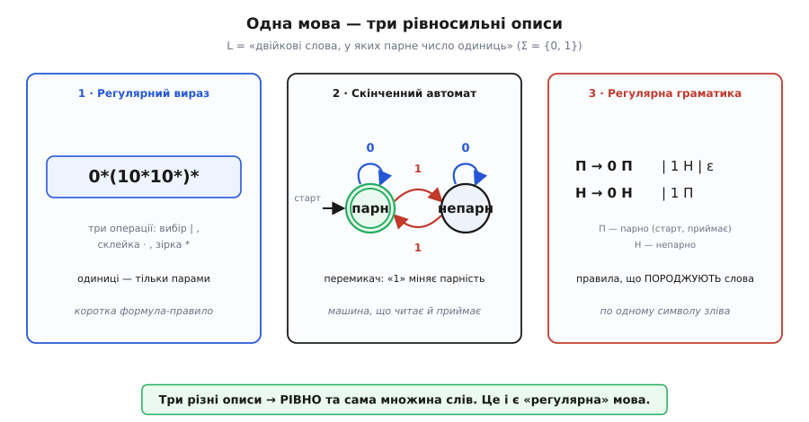
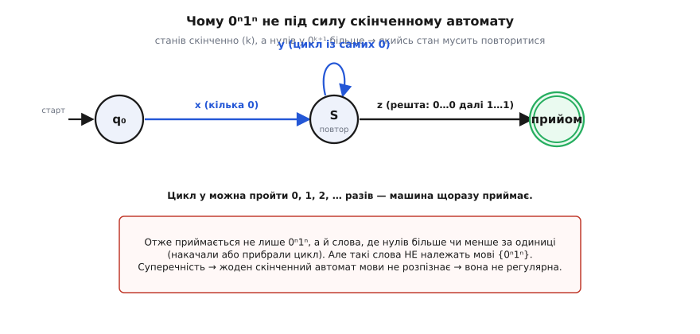
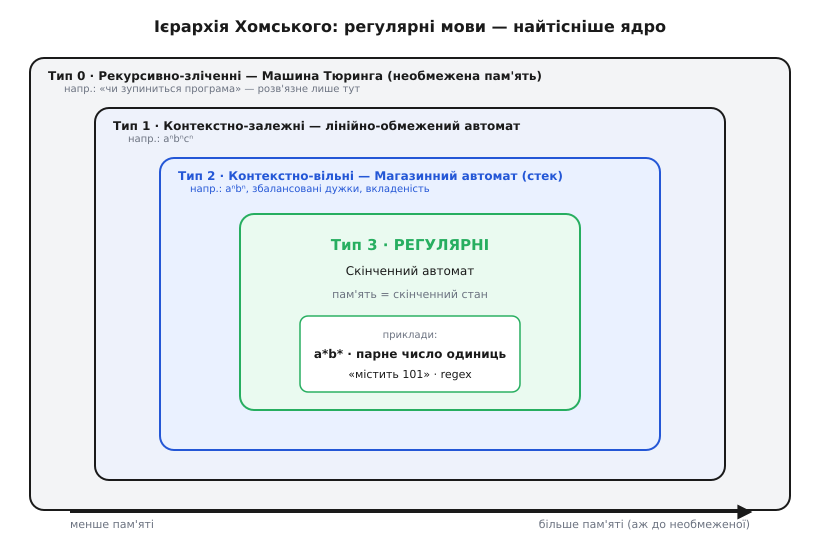

# Регулярні мови

<preknowlist>
- [Формальна мова](book:math/formal-language) — алфавіт, слово, множина всіх слів Σ*; мова — це просто множина слів.
- [Скінченні автомати](book:math/finite-automata) — машина зі станами, що читає слово по символу й каже «так» чи «ні»: функція переходів δ та приймальні стани.
</preknowlist>

Серед усіх мислимих множин слів є жменька напрочуд ручних. Такі множини можна задати коротким скінченним правилом, а потім перевіряти належність слова одним пробігом зліва направо — не тримаючи в пам'яті весь прочитаний текст, а лише один зі скінченного числа станів. Ці множини називають **регулярними** (лат. *rēgula* — «правило, мірило»): мова регулярна, коли за нею стоїть чітке скінченне мірило, а не безмежний перелік слів «на пам'ять».

Найцікавіше тут — не сама ручність, а те, що до цього класу ведуть кілька зовсім різних доріг, і всі вони сходяться в одну точку. Можна описати мову **формулою** (регулярним виразом), можна — **машиною** (скінченним автоматом), можна — **правилами породження** (граматикою). Виглядають вони як різні світи. А виявляється, що множина мов, яку охоплює кожен із цих способів, — **та сама**. Саме цей збіг робить поняття міцним і вартим окремої назви: «регулярна мова» — це не «мова, яку я вмію записати регексом», а об'єкт із багатьма рівноправними обличчями та чіткою межею, за яку він не виходить.

## Мова — це множина слів

Щоб говорити про регулярність, спершу треба домовитися, що таке мова взагалі. Візьмімо скінченний **алфавіт** (грец. *álpha* + *bêta* — перші дві букви) — скінченний набір символів, який позначають грецькою Σ (сигма): скажімо, Σ = {0, 1} або Σ = {a, b}. **Слово** — це будь-яка скінченна послідовність символів алфавіту: `0110`, `aab`, а також порожнє слово (жодного символу), яке позначають ε (епсилон). Усіх слів над Σ — нескінченно багато; їхню множину позначають **Σ\*** (зірка Кліні над алфавітом).

**Мова** — це просто **якась множина слів**, тобто будь-яка підмножина L ⊆ Σ\*. «Усі двійкові слова парної довжини», «усі правильно складені десяткові числа», «усі слова, де стільки ж нулів, скільки одиниць» — кожне з цих речень задає свою мову. Мов над навіть двосимвольним алфавітом — незліченно багато, і переважна їх більшість не піддається жодному скінченному опису: єдиний спосіб задати таку мову — перелічити її слова, а їх нескінченно. Регулярні мови — це якраз протилежний полюс: ті, для яких скінченного правила **достатньо**.

> 🔧 **Навіщо це.** «Коректна IP-адреса», «рядок дати `РРРР-ММ-ДД`», «ціле число зі знаком» — усе це формальні мови над алфавітом символів. Питання «регулярна вона чи ні» — не абстракція: воно прямо каже, чи вистачить для перевірки простого скінченного автомата (а отже, регулярного виразу), чи доведеться писати повноцінний розбірник із пам'яттю.

## Три обличчя однієї мови

Тепер головне. Що означає, що мова L **регулярна**? Є три означення, кожне самодостатнє, — і теорема каже, що вони задають **той самий** клас мов. Мова регулярна, якщо її можна описати будь-яким (а отже, і кожним) із трьох способів.

**Обличчя перше — регулярний вираз.** Це коротка формула над алфавітом, зібрана з трьох операцій: **вибір** `a|b` («a або b»), **склейка** `a·b` («a, за ним b») і **зірка** `a*` («a нуль чи більше разів»). Мова виразу — множина всіх слів, які він описує. `(0|1)*101(0|1)*` — «десь усередині стоїть 101»; `0*(10*10*)*` — «парне число одиниць». Вираз зручно **писати** людині.

**Обличчя друге — скінченний автомат.** Та сама мова — це множина слів, які [скінченний автомат](book:math/finite-automata) прочитує від початкового стану й закінчує в приймальному. Машина тримає скінченний стан, робить один перехід на символ і наприкінці каже «так» або «ні». Автомат зручно **виконувати** машині: пробіг лінійний за довжиною слова, без буфера й відкатів.

**Обличчя третє — регулярна граматика.** Той самий об'єкт можна не *перевіряти*, а *породжувати* — набором правил, кожне з яких дописує один символ і переходить до наступного «нетерміналу». Такі правила виду `A → символ B` (праволінійні) називають регулярною граматикою; це найпростіший поверх [формальних граматик](book:math/formal-grammar). Граматика зручна, коли мову треба не розпізнати, а **згенерувати**.


*Одна мова — «двійкові слова з парним числом одиниць» — записана трьома незалежними способами. Ліворуч формула `0*(10*10*)*` (одиниці лише парами). У центрі машина з двох станів: символ «1» перемикає парність, «0» нічого не міняє, приймає стан «парн». Праворуч граматика, що дописує слово по символу: П породжує парну частину, Н — непарну. Три описи виглядають як різні світи, а задають РІВНО ту саму множину слів — це й означає «регулярна».*

Збіг цих трьох світів — не випадковість, а зміст двох класичних результатів. Те, що **вираз і автомат** описують один клас, — це теорема Кліні (Стівен Кліні, який і назвав ці множини «регулярними»). Те, що сюди ж лягають **регулярні граматики**, з'ясувалося, коли лінгвіст Ноам Чомський 1956 року вибудував [ієрархію граматик](book:math/regular-languages/hist-chomsky-hierarchy.md) і найслабший її щабель — праволінійні граматики — виявився тим самим класом. Практична вигода прямо випливає з цієї рівносильності: ви пишете **зручний** регулярний вираз, а бібліотека мовчки перетворює його на **швидкий** автомат, що біжить по тексту за один прохід.

## Замкненість: регулярні мови — надійний будівельний матеріал

Клас регулярних мов цінний ще й тим, що з нього **важко випасти**. Візьміть регулярні мови й скомбінуйте їх — результат майже завжди знову регулярний. Це властивість **замкненості** (мова не «виходить» за межі класу).

Три операції закладені в саме означення через регулярний вираз: якщо L₁ і L₂ регулярні (їх задають вирази R₁ і R₂), то регулярні й

```
об'єднання      L₁ ∪ L₂     →  вираз  R₁ | R₂
склейка         L₁ · L₂     →  вираз  R₁ R₂
зірка (повтор)  L₁*         →  вираз  R₁*
```

Ці три й дали назву класу: регулярна мова — рівно те, що будується з окремих символів скінченним числом **регулярних операцій**. Але замкненість сягає далі, і тут вона вже не очевидна.

**Доповнення** (усі слова, яких у мові *немає*, Σ\*∖L) теж регулярне. Побудова напрочуд проста: візьміть детермінований автомат для L, у якому з кожного стану по кожному символу веде рівно одна стрілка, і **поміняйте місцями приймальні та неприймальні стани**. Був «так» — став «ні». Автомат той самий, мова — доповнення.

**Перетин** L₁ ∩ L₂ (слова, що належать обом мовам одразу) регулярний завдяки **добутковому автомату**: заведіть машину, стан якої — **пара** «стан першого автомата, стан другого», і женіть обидва **одночасно** по одному слову. Приймаємо, коли приймають **обидва**. Пар станів скінченно (добуток двох скінченних множин), тож і новий автомат скінченний.

> 🔧 **Навіщо це.** Замкненість — це дозвіл будувати складне зі складеного, не боячись зіпсувати задачу. Правило «ім'я файлу, що закінчується на `.log` **і** не починається з крапки» — це перетин двох регулярних умов; воно регулярне, і його можна реалізувати одним автоматом. Знаючи це, ви впевнено збираєте валідатор із простих шматків замість одного монструозного виразу. Як саме працює добутковий автомат — покроково з робочим кодом — [показано окремо](book:math/regular-languages/proj-product-construction.md).

## Межа: не кожна мова регулярна

Якщо клас такий гнучкий, природно спитати: а чи є взагалі мови **поза** ним? Є, і межа проходить рівно там, де закінчується скінченна пам'ять автомата. Уся сила регулярної мови — у тому, що для розпізнавання досить тримати **скінченний** стан. Тому щойно задача вимагає пам'ятати щось, що **росте необмежено** — рахувати довільну вкладеність, зіставляти дві невідомі наперед кількості, — регулярності вже не буде.

Класичний приклад — мова, у якій число нулів має точно дорівнювати числу одиниць за ними.

**Твердження:** мова L = { 0ⁿ1ⁿ : n ≥ 1 } (n нулів, за ними стільки ж одиниць: `01`, `0011`, `000111`, …) не регулярна.

```
Припустимо протилежне: L розпізнає скінченний автомат із k станами.
Подамо йому слово   0ᵏ1ᵏ  ∈ L.

Дивимось на стани ПІСЛЯ кожного прочитаного нуля:
   s₀ → s₁ → s₂ → … → s_k       ← це k+1 станів поспіль

Станів усього k, а тут k+1 значень.  Принцип шухляд:
два з них неминуче збігаються.  Нехай  sₐ = s_b  при  a < b.

Отже після 0ᵃ і після 0ᵇ машина в ТОМУ САМОМУ стані —
далі вона їх не розрізняє, доля будь-якого хвоста однакова.

Допишемо хвіст  1ᵃ :
   0ᵃ1ᵃ  →  приймається   (a нулів = a одиниць, слово з L)
   0ᵇ1ᵃ  →  приймається ТЕЖ  (той самий стан, той самий хвіст)
   але   0ᵇ1ᵃ  ∉ L,  бо  b ≠ a.

Машина прийняла слово, якого приймати не мала.  Суперечність.
```

**Висновок:** жоден скінченний автомат не розпізнає L. Причина глибша за конкретний приклад: щоб звірити дві кількості, треба десь тримати першу з них, поки читаєш другу, — а першою може бути будь-яке число, тоді як станів у автомата скінченно. Скінченна пам'ять не вміє рахувати без стелі.


*Механізм суперечності наочно. Довгий блок нулів змушує пробіг пройти через стан-повтор S, а отже — через цикл y з самих нулів (станів скінченно, тому повтор неминучий). Цей цикл можна пройти будь-скільки разів — і машина щоразу приймає. Виходить, вона приймає не лише 0ⁿ1ⁿ, а й слова з нерівним числом нулів і одиниць, яких у мові немає. Тому автомата для цієї мови не існує.*

Цей аргумент — «прокрути цикл зайвий раз і зловиш зайве слово» — не одноразовий трюк, а окремий випадок загального інструмента: [леми про накачування](book:math/regular-languages/math-pumping-lemma.md). Вона дає готову схему, якою доводять нерегулярність цілих родин мов — від збалансованих дужок до паліндромів; там же — і точніший критерій, який ловить **усі** нерегулярні мови, а не лише ті, що піддаються накачуванню.

## Місце у світі мов

Куди ж дівається сила, коли скінченного стану бракує? Вона нікуди не зникає — просто починається інший, ширший клас мов, за яким стоїть потужніша машина. Регулярні мови — це **найтісніше ядро** великої вкладеної картини, яку й вибудував Чомський.


*Ієрархія Хомського як вкладені кільця: що ширше кільце — то більше пам'яті потрібно машині. Усередині — регулярні мови (Тип 3), яким досить скінченного стану. Наступне кільце — контекстно-вільні (Тип 2): тут живуть 0ⁿ1ⁿ і збалансовані дужки, і розпізнає їх магазинний автомат зі стеком. Далі — контекстно-залежні (Тип 1) і, найширше, рекурсивно-зліченні (Тип 0), які під силу лише машині Тюринга з необмеженою пам'яттю.*

Щабель за щаблем машині додають пам'ять. Додайте до скінченного автомата **стек** (магазин, куди можна класти й звідки знімати символи) — дістанете [магазинний автомат](book:math/pushdown-automata) і клас **контекстно-вільних** мов. Стек — це рівно те, чого бракувало для 0ⁿ1ⁿ: клади нуль на кожному нулі, знімай на кожній одиниці, наприкінці перевір, що порожньо. Так само розбирають вкладені дужки й арифметичні вирази — тому мови програмування контекстно-вільні. Дайте машині ще більше волі з пам'яттю — і на самій вершині опиниться [машина Тюринга](book:math/turing-machine) з необмеженою стрічкою, що охоплює все, що взагалі можна обчислити.

Регулярні мови сидять у найвужчому кільці не через бідність, а через силу обмеження: **саме тому**, що пам'ять скінченна, їх можна розпізнавати блискавично й передбачувано. Кожне звуження класу — це виграш у швидкості й простоті, куплений відмовою від частини задач.

## Де це працює

Ця теорія — пряма опора щоденної практики, і працює вона двома боками.

- **Коли мова регулярна.** Регулярні вирази в редакторах і `grep`, перевірка форматів (дата, число, адреса), перша фаза компілятора — поділ тексту на лексеми, розбір простих текстових протоколів. Усе це — регулярна мова в роботі: вираз компілюється в автомат, що проходить текст один раз, на символ — один перехід.
- **Коли ні — і це важливіше.** Знати, що мова **не** регулярна, — значить знати наперед, що регекс тут безсилий, хоч би як його ускладнювати. Збалансовані дужки, вкладені теги, будь-яка довільна вкладеність — не регулярні, тож потрібен розбірник зі стеком, а не вираз. Знаменита пересторога «не розбирай HTML регулярним виразом» — це не забобон, а пряме прочитання межі: HTML має необмежену вкладеність, а скінченний автомат рахувати вкладеність не вміє.

Підсумуймо. **Мова** — це множина слів над алфавітом, а **регулярна** — та, яку задає скінченне правило й перевіряє скінченний стан. Її сила — у трьох рівноправних обличчях: **регулярний вираз** (формула), **скінченний автомат** (машина) і **регулярна граматика** (правила породження) описують той самий клас, і це не збіг, а теореми Кліні й Чомського. Клас **замкнений** щодо об'єднання, склейки, зірки, а також перетину й доповнення — з регулярних мов будують нові, не випадаючи з класу. А чітка **межа** — скінченна пам'ять: щойно задача вимагає рахувати без стелі, мова перестає бути регулярною й переходить у ширші кільця ієрархії, де на неї вже чекають потужніші машини.
