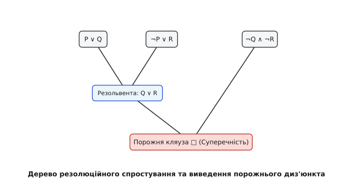

# Принцип резолюцій та автоматичне доведення

<preknowlist>
- [Числення висловлювань](topic:math/propositional-logic) — КНФ, ДНФ та пропозиційні зв'язки.
- [Логіка першого порядку](topic:math/first-order-logic) — Сколемізація, префіксна нормальна форма та уніфікація.
- [Системи дедукції](topic:math/proof-systems-gentzen) — правила виводу та суперечливість.
</preknowlist>

Автоматичне доведення теорем (Automated Theorem Proving, ATP) — це галузь математичної логіки та інформатики, присвячена розробці комп'ютерних алгоритмів для автоматичного встановлення істинності формальних математичних тверджень.

У той час як аксіоматичні системи Гільберта та секвенційне числення Ґентцена вимагають складного розгалуженого обходу логічних дерев із багатьма правилами виводу, **Принцип Резолюцій (Resolution Principle)**, запропонований Джоном Аланом Робінсоном у 1965 році, надає уніфіковану спростувальну процедуру (Refutation Procedure), яка спирається лише на **єдине правило виводу** та синтаксичну уніфікацію.


*Парне поєднання диз'юнктів та виведення порожнього кляуза `□`.*

> 🔧 **Навіщо це.**
> Метод резолюцій є технологічним серцем сучасних автоматичних сольверів теорем (Vampire, E-prover, Prover9), компіляторів логічного програмування (Prolog, Datalog), мов формальної специфікації хардверу (VHDL/Verilog verification) та системи автоматичного пошуку контрекземплярів SMT.

---

## 1. Спростувальний Підхід (Refutation-Based Theorem Proving)

Класичне доведення твердження `A` з гіпотез `Γ = {F₁, F₂, …, Fₙ}` полягає у синтаксичному виводі `Γ ⊢ A`.

За семантичною теоремою про дедукцію, твердження `A` є логічним наслідком `Γ` тоді й лише тоді, коли кон'юнкція гіпотез разом із **запереченням цілі** `¬A` є суперечливою (нездійснюваною):

```text
Γ ⊨ A ⇔ (F₁ ∧ F₂ ∧ … ∧ Fₙ ∧ ¬A) є нездійснюваною (Unsatisfiable)
```

Метод резолюцій працює за принципом **доведення від супротивного (Proof by Contradiction)**:
1. Заперечується шукана теорема `A`.
2. Всі гіпотези `Γ` та заперечена ціль `¬A` зводяться до Кон'юнктивної Нормальної Форми (КНФ).
3. Множина диз'юнктів подається на вхід алгоритму резолюції.
4. Якщо алгоритм виводить **порожній диз'юкт** (`□` або `⊥`), це доводить суперечливість `Γ ∪ {¬A}`, і вихідна теорема `A` є істинною.

---

## 2. Кон'юнктивна Нормальна Форма (КНФ) та Диз'юнкти (Clauses)

Множина формул у логіці першого порядку подається як кон'юнкція диз'юнктів.

### Основні терміни
- **Літерал (Literal)**: Атомарна формула `P(t₁, …, tₖ)` (позитивний літерал) або її заперечення `¬P(t₁, …, tₖ)` (негативний літерал).
- **Диз'юкт (Clause)**: Скінченна диз'юнкція літералів:

```text
C = L₁ ∨ L₂ ∨ … ∨ Lₘ
```

У множинній нотації диз'юкт зображується просто як множина літералів `{L₁, L₂, …, Lₘ}`, що відповідає їхній диз'юнкції.
- **Порожній диз'юкт (`□`)**: Диз'юкт, що не містить жодного літерала. За визначенням, порожній диз'юкт відповідає тотожній хибності (`⊥`) і сигналізує про виявлення суперечності.

---

## 3. Пропозиційне Правило Резолюції

У численні висловлювань правило резолюції має просту та інтуїтивну алгебраїчну форму.

Якщо є два диз'юнкти `C₁` та `C₂`, такі що `C₁` містить позитивний літерал `P`, а `C₂` містить контрадикторний негативний літерал `¬P`:

```text
[Правило резолюції]
  C₁ ∨ P,   C₂ ∨ ¬P
=====================
       C₁ ∨ C₂
```

Результуючий диз'юкт `R = C₁ ∨ C₂` називається **резольвентою (Resolvent)** за атомом `P`, а самі диз'юнкти `C₁ ∨ P` та `C₂ ∨ ¬P` — батьківськими диз'юнктів.

### Алгебраїчна Коректність
З семантичної точки зору, якщо `C₁ ∨ P` та `C₂ ∨ ¬P` є істинними в інтерпретації:
- Якщо `P` істинне, то `¬P` хибне, тому для істинності другого диз'юнкту має бути істинним `C₂`.
- Якщо `P` хибне, то для істинності першого диз'юнкту має бути істинним `C₁`.
В обох випадках диз'юнкція `C₁ ∨ C₂` є істинною, що гарантує семантичну коректність виводу.

---

## 4. Алгоритм Зведення Формул Першого Порядку до КНФ

Перед застосуванням резолюцій у логіці першого порядку кожне речення проходить 6-етапну трансляцію:

1. **Усунення імплікацій та еквівалентностей**:
   - `A ⇒ B → ¬A ∨ B`
   - `A ⇔ B → (¬A ∨ B) ∧ (¬B ∨ A)`
2. **Переміщення заперечень до атомів (Закони де Моргана)**:
   - `¬(A ∧ B) → ¬A ∨ ¬B`
   - `¬(∀x A) → ∃x ¬A`
3. **Стандартизація змінних (`α`-конверсія)**:
   Перейменування зв'язаних змінних так, щоб кожен квантор оперував унікальним ім'ям змінної.
4. **Сколемізація (Skolemization)**:
   Усунення кванторів існування `∃` шляхом їх заміни на функції Сколема від попередніх `∀`-змінних.
5. **Опускання кванторів загальності**:
   Оскільки всі залишені змінні квантифіковані `∀`, квантори вилучаються, а змінні вважаються універсально зв'язаними.
6. **Розподільний закон (Дистрибутивність)**:
   Перетворення матриці у КНФ за допомогою тотожностей `A ∨ (B ∧ C) ≡ (A ∨ B) ∧ (A ∨ C)`.

---

## 5. Правило Резолюції Першого Порядку та Найзагальніший Уніфікатор (MGU)

У логіці першого порядку літерали `P(t₁)` та `¬P(t₂)` у двох диз'юнктах можуть не бути тотожними синтаксично, проте можуть стати тотожними після підстановки термів.

Нехай `C₁ = A₁ ∨ P(t₁)` та `C₂ = A₂ ∨ ¬P(t₂)`. Якщо існує Найзагальніший Підстановний Уніфікатор `θ = MGU(t₁, t₂)`, такий що `θ(t₁) = θ(t₂)`, то правило резолюцій першого порядку виглядає так:

```text
[Резолюція з уніфікацією]
  A₁ ∨ P(t₁),   A₂ ∨ ¬P(t₂)
=============================
          θ(A₁ ∨ A₂)
```

### Операція Факторизації (Factoring)
Для забезпечення повноти резолюцій у логіці першого порядку додатково застосовується правило факторизації: якщо два літерали в одному диз'юнкті є уніфікованими (`θ = MGU(L₁, L₂)`), вони згортаються в один літерал `θ(L₁)`.

---

## 6. Фундаментальна Метатеорема: Спростувальна Повнота (Refutation Completeness)

Метод резолюцій не є повністю повним у сенсі виводу будь-якої тавтології (наприклад, вивід `A ∨ ¬A` з порожньої множини резолюцією неможливий). Проте він володіє **Спростувальною Повнотою (Refutation Completeness)**.

> **Теорема Робінсона (1965)**: Множина диз'юнктів `S` у логіці першого порядку є нездійснюваною (суперечливою) тоді й лише тоді, коли з `S` за допомогою правил резолюції та факторизації можна за скінченну кількість кроків вивести порожній диз'юкт:
> 
> ```text
S ⊢_{Res} □
```

*Схема доведення*: Спростувальна повнота доводиться через **Теорему Ербрана**. Нездійснюваність `S` означає існування скінченної нездійснюваної множини основних екземплярів (ground instances). Для основних екземплярів спростувальна повнота випливає з леми про підйом (Lifting Lemma), яка гарантує, що кожне резолюційне крок над основними диз'юнктами має відповідний крок резолюції з уніфікацією над вихідними диз'юнкт з змінними.

---

## 7. Стратегії Керування Резолюційним Пошуком

Некероване застосування резолюцій до великої множини диз'юнктів призводить до комбінаторного вибуху (генерації мільйонів непотрібних диз'юнктів). Для підвищення ефективності розроблено стратегії обмеження:

1. **Семантична Резолюція (Semantic Resolution)**: Резолюція дозволяється лише між диз'юнктами, один з яких є хибним у фіксованій семантичній інтерпретації `I`.
2. **Стратегія Набору Наслідків (Set of Support, SOS)**: Резолюція обов'язково повинна залучати хоча б один диз'юкт із запереченої цілі `¬A` або його нащадків.
3. **Лінійна Резолюція (Linear Resolution)**: Кожна нова резольвента отримується з попередньої побудованої резольвенти та одного вихідного диз'юнкту.
4. **Упорядкована Резолюція (Ordered Resolution)**: Диз'юнкти резолюються лише за найбільшим літералом у фіксованому синтаксичному порядку термів.

---

## 8. Гіперрезолюція (Hyper-resolution) та розширені інференційні кроки

Гіперрезолюція об'єднує кілька послідовних резолюційних кроків в один узагальнений крок.

- **Позитивна Гіперрезолюція**: Використовує один негативний диз'юкт (який містить хоча б один негативний літерал) та декілька повністю позитивних диз'юнктів (політиралів), виводячи новий повністю позитивний диз'юкт за один крок.
- **Негативна Гіперрезолюція**: Дуальна процедура, що використовує один позитивний диз'юкт та декілька повністю негативних диз'юнктів.

Це суттєво зменшує кількість проміжних диз'юнктів і прискорює пошук суперечності у великих математичних аксіоматиках.

---

## 9. Парамодуляція та Резолюція з рівністю (Paramodulation)

У логіці першого порядку з рівністю стандартне правило резолюцій вимагає додавання всіх аксіом рівності, що призводить до катастрофічного спаду продуктивності.

Для подолання цієї проблеми Ларрі Вос та Джордж Робінсон у 1969 році розробили **правило парамодуляції (Paramodulation)**:

```text
[Парамодуляція]
  C₁ ∨ (s = t),   C₂ ∨ L(u)
=============================
   θ(C₁ ∨ C₂ ∨ L(u[u ↦ t]))
де θ = MGU(s, u)
```

Правило парамодуляції дозволяє виконувати рівносильну заміну терма `s` на `t` безпосередньо всередині синтаксичного дерева літерала `L`, забезпечуючи спростувальну повноту для теорій з рівністю без залучення аксіом рівності.

---

## 10. Алгоритми Davis-Putnam, DPLL та CDCL

Історичний розвиток пропозиційної здійснюваності пройшов три етапи:
1. **Davis-Putnam (1960)**: Перший алгоритм, що спирався на елімінацію змінних через пропозиційну резолюцію. Вимагав експоненційного зростання пам'яті.
2. **DPLL (Davis-Logemann-Loveland, 1962)**: Замінив резолюцію на пошук з поверненням (Backtracking DFS) та виведення монолітералів (Unit Propagation), що знизило вимоги до пам'яті до лінійних.
3. **CDCL (Conflict-Driven Clause Learning, 1996)**: Об'єднав DPLL з імпресивним вивченням конфліктних дизюнктів через пропозиційну резолюцію.

---

## 11. Резолюція у логіці вищих порядків (Higher-Order Resolution)

Розширення методу резолюцій на мови з квантифікацією за предикатами (Логіка другого та вищих порядків) вимагає переходу від синтаксичної уніфікації Робінсона до **уніфікації вищого порядку (Higher-Order Unification)**, розробленої Жераром Хьюетом (Gérard Huet) у 1975 році.

Оскільки уніфікація вищого порядку є напіврозв'язною і може давати нескінченне дерево найзагальніших уніфікаторів, резолюція вищого порядку (застосована у системах TPS, Isabelle/HOL, Zipperposition) використовує так звану спростувальну процедуру з накопиченням обмежень (Constraint-Based Resolution).

---

## 12. Елімінація Тавтологій та Субсумпція (Subsumption)

Для підтримання мінімального розміру бази диз'юнктів під час резолюційного насичення застосовуються дві ключові оптимізації:

1. **Елімінація Тавтологій**: Диз'юкт, що містить контрадикторну пару `P ∨ ¬P`, миттєво вилучається, оскільки він є тотожно істинним і не додає нової інформації для спростування.
2. **Субсумпція (Subsumption)**: Диз'юкт `C₁` субсумує диз'юкт `C₂`, якщо існує підстановка `θ`, така що `θ(C₁) ⊆ C₂`. У такому разі `C₂` є слабшим наслідком `C₁` і вилучається з бази даних, упереджуючи комбінаторне зростання.

---

## 13. SLD-Резолюція та Мова Логічного Програмування Prolog

SLD-резолюція (Selective Linear Resolution for Definite clauses) є спеціалізованою стратегією резолюції над **хорнівськими диз'юнктами (Horn Clauses)**.

Хорнівський диз'юкт містить **не більше одного позитивного літерала**:

```text
B ∨ ¬A₁ ∨ ¬A₂ ∨ … ∨ ¬Aₖ  ≡  B ⇐ A₁ ∧ A₂ ∧ … ∧ Aₖ
```

У мові **Prolog**:
- Хорнівський диз'юкт із позитивним і негативними літералами є **правилом** (`B :- A1, A2, ..., Ak.`).
- Хорнівський диз'юкт лише з позитивним літералом є **фактом** (`B.`).
- Диз'юкт лише з негативними літералами є **запитом (ціллю)** (`?- A1, A2.`).

SLD-резолюція виконує пошук у глибину (DFS) за уніфікацією, що перетворює вивід теорем на стрімке виконання декларативних програм.

---

## 14. Модальні та теорія-орієнтовані резолюції (Theory Resolution)

Марк Стікель у 1985 році розробив **Теорію Резолюцій (Theory Resolution)**, яка вбудовує специфічні математичні теорії (арифметика, часткові порядки, ґратки) безпосередньо у крок уніфікації та резолюцій.

Це дозволяє уникнути додавання нескінченних аксіом теорії до бази диз'юнктів, замінюючи синтаксичну суперечливість літералів на семантичну нездійснюваність відносно даної фонової теорії.

---

## 15. Автоматичний пошук контрамоделей за допомогою терм-переписання

Паралельно з шуканням порожнього диз'юнкту, резолюційні сольвери застосовують процедури переписання термів (Term Rewriting Systems, TRS) за допомогою алгоритму Кнута-Бендікса (Knuth-Bendix Completion).

Якщо множина диз'юнктів є здійснюваною, процедура переписання завершується побудовою канонічної системи редукції термів, що дозволяє не лише доводити теореми, але й будувати точні математичні моделі та спростовувати хибні гіпотези.

---

## 16. Слово за словом: Приклад кроків резолюційного виводу

Розглянемо конкретний приклад виводу суперечності для 3 диз'юнктів:
1. `C₁ = {P(x), Q(x)}`
2. `C₂ = {¬P(a)}`
3. `C₃ = {¬Q(a)}`

Крок 1: Резолюємо `C₁` та `C₂` за предикатом `P`. Підстановка `θ₁ = {x ↦ a}`. Отримуємо резольвенту `C₄ = {Q(a)}`.
Крок 2: Резолюємо `C₄` та `C₃` за предикатом `Q`. Підстановка порожня. Отримуємо порожній диз'юкт `C₅ = □`.

Спростування завершено успішно за 2 кроки.

---

## 17. Сучасні CDCL SAT-Сольвери та SMT-Архітектура

У пропозиційному аналізі розширенням резолюції є алгоритм **CDCL (Conflict-Driven Clause Learning)**.

Коли SAT-сольвер припускає значення змінних і влучає у конфлікт (порожній диз'юкт), він виконує зворотний аналіз конфлікту через резолюцію, будуючи **новий вичений диз'юкт (Learned Clause)**. Цей новий диз'юкт додається до бази знань, блокуючи мільйони аналогічних хибних гілок пошуку у майбутньому.

SMT-сольвери (Z3, CVC5) об'єднують CDCL SAT-рушій із фоновими теоріями (арифметика, масиви, покажчики, бітові вектори) через алгоритм Нельсона-Оппена, що робить метод резолюцій найпотужнішим практичним інструментом автоматичної верифікації в сучасній математиці та інженерії.

Завдяки суворій спростувальній повноті та синтаксичній простій конструкції, резолюція залишається головним стандартом автоматичного міркування.
