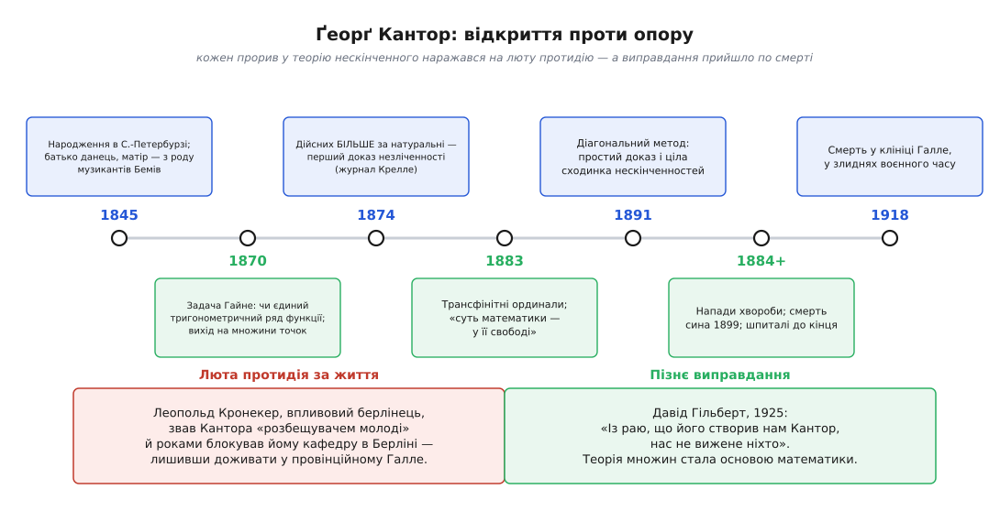

# 📜 Народження теорії множин: Кантор і нескінченність

Цілу науку інколи започатковують ненавмисно — розв'язуючи щось геть інше. Ґеорґ Кантор не сідав будувати фундамент математики; він латав технічну діру в аналізі, а вийшов на питання про саму природу нескінченного. За життя його за це цькували, доводили до нервових зривів і не пускали з провінції; через десять років по смерті на його ідеях уже стояла вся математика. Це історія людини, яка навчилася **рахувати нескінченність** — і дорого за це заплатила.

### Данець, народжений у Петербурзі

З ім'ям Кантора одразу треба бути точним, бо його легко приписати не туди. Народився він 3 березня 1845 року в Санкт-Петербурзі — і цього факту досить, щоб у деяких переказах його оголосили «російським математиком». Але місце народження — не те саме, що народ, мова чи громадянство, і варто розчепити ці нитки поодинці.

Батько, Ґеорґ Вальдемар Кантор, був данець — купець, народжений у Копенгагені, який осів у Петербурзі задля торгівлі. Мати, Марія Анна Бем (нім. *Böhm*), походила з родини **австро-угорських музикантів**, що працювали в столиці імперії. Її батько Франц Бем (1788–1846) грав першу скрипку в імператорських театрах Петербурга, а брат діда, Йозеф Бем (1795–1876), був славетним скрипалем — засновником віденської скрипкової школи, у якій вчився, серед інших, Йозеф Йоахим. Від цього роду Кантор успадкував неабиякий музичний хист і сам був добрим скрипалем; математику він усе життя чув майже як музику. Родина розмовляла німецькою, сповідувала християнство (батько — лютеранин, мати — католичка), а 1856 року, коли Ґеорґові було одинадцять, переїхала до Німеччини — у Вісбаден, потім Франкфурт. Усю подальшу освіту й усю кар'єру Кантор здобув у німецькому світі. Отже, найточніше: **німецький математик, народжений у Петербурзі в родині данця й австро-угорки**. «Російського» в цьому — лише широта й довгота пологового будинку.

Окрема, дражлива нитка — питання юдейського походження по батькові. Сам Кантор у листі до французького історика математики Поля Таннері (1896) писав, що його дід і баба з батькового боку належали до португальсько-єврейської (сефардської) громади Копенгагена. Проте це твердження **оспорене** й лишається непевним: британський історик Айвор Ґраттан-Ґіннесс разом із данським генеалогом Теодором Гаух-Фаусбьолем не знайшли цьому документального підтвердження, а біографи Вальтер Пуркерт і Ганс Ільґаудс наголошували радше на християнському укладі родини. Плутанину живить те, що Кантор і сам не знав напевно частину своєї рідні. Тож чесний статус тут такий: **особисте свідчення самого Кантора проти браку архівних доказів** — питання відкрите, і подавати сефардське коріння як установлений факт не можна.

### Задача, якої ніхто не просив розв'язувати

1869 року Кантор отримав місце в університеті Галле — невеликому, другорядному, з якого до кінця життя так і не зумів вибратися. Там старший колега Едуард Гайне підкинув йому задачу, об яку вже розбилося кілька добрих голів: **чи єдиний спосіб** розкласти функцію в тригонометричний ряд?

Тригонометричний ряд — це спроба скласти будь-яку функцію з нескінченної суми простих коливань, синусів і косинусів різної частоти:

```
f(x) = a₀ + a₁·cos x + b₁·sin x + a₂·cos 2x + b₂·sin 2x + …
```

Питання Гайне звучало так: якщо два різні набори коефіцієнтів дають ту саму функцію — чи мусять вони насправді збігатися? Кантор довів, що так: **до квітня 1870 року** він показав, що розклад єдиний. Але справжня історія почалася далі, коли він заходився це узагальнювати. А що, як дозволити функції поводитися «неслухняно» не всюди, а лише в кількох виняткових точках? У скінченній їх кількості? А в нескінченній?

Ось тут звична математика скінчилася. Щоб узагалі мати про що говорити, Канторові довелося розглядати **саму множину виняткових точок** як окремий предмет — брати нескінченні набори точок на прямій, порівнювати їх, «здирати» з них шар за шаром (він назвав це похідними множинами). Питання аналізу непомітно перетворилося на питання про будову нескінченних сукупностей. Наука про множини народилася не з філософської примхи, а з технічної потреби договорити почату думку до кінця.

### Дійсних чисел більше, ніж натуральних

Далі стався поворот, який назавжди змінив математику. 1874 року в журналі Крелле (нім. *Journal für die reine und angewandte Mathematik*) Кантор надрукував статтю зі скромною назвою «Про одну властивість сукупності всіх дійсних алгебричних чисел» — і в ній довів річ, у яку доти ніхто не вірив, бо ніхто й не думав питати: **дійсних чисел більше, ніж натуральних**.

Доти нескінченність вважали одна-єдиною — просто «безліч», далі якої нема куди. Кантор побачив, що це не так. Розмір нескінченної множини він міряв не лічбою (яка ніколи не скінчиться), а **паруванням**: дві множини рівні за розміром, коли їхні елементи можна поставити в бездоганні пари, кожному по одному. Виявилося, що натуральні числа так паруються з цілими, з дробами, ба навіть з усіма алгебричними числами — усі ці нескінченності однакові, їх можна вишикувати в один нескінченний список. А от дійсні числа в жоден список не вкладаються: скільки їх не переліковуй, завжди лишиться точка, яку проґавили. Ці «більші» нескінченності Кантор назвав [незліченними, на відміну від зліченних](topic:math/countable-sets), а сам розмір множини — її **потужністю** (нім. *Mächtigkeit*).

У тій самій статті ховався ще один удар. Алгебричних чисел — коренів многочленів із цілими коефіцієнтами — лише зліченна кількість. А дійсних незліченно. Отже, майже всі дійсні числа **не алгебричні** (їх звуть трансцендентними) — і це доведено, хоч Кантор не вказав жодного конкретного такого числа пальцем. Він довів, що щось існує, не пред'явивши жодного взірця. Ця манера — доводити існування, нічого не будуючи, — незабаром обернеться проти нього найлютішим ворогом.

### «Я бачу це, але не вірю»

1877 року Кантор здивував навіть самого себе. Він довів, що точок на відрізку рівно стільки ж, скільки в цілому квадраті, ба навіть у кубі будь-якого числа вимірів: одновимірна лінія й багатовимірний простір мають **однакову потужність**. Розмірність, яку всі вважали чимось глибоким і непорушним, для лічби точок виявилася байдужою. У листі до свого друга й співрозмовника Ріхарда Дедекінда він написав рядок, що став крилатим, — по-французьки посеред німецького листа:

```
Je le vois, mais je ne le crois pas.
(Я бачу це, але не вірю.)
```

Історики застерігають від надто драматичного прочитання: Кантор не сумнівався в самому результаті — він просив Дедекінда ще раз перевірити його доведення, бо ставки були надто високі. Це вигук людини, що стоїть на краю чогось величезного й хоче впевнитися, що земля під ногами тримає.

Статтю з цим відкриттям («Ein Beitrag zur Mannigfaltigkeitslehre») він подав до журналу Крелле 1877 року — і тут уперше відчув холодний подих майбутньої війни. У редколегії журналу сидів Леопольд Кронекер, і стаття залежалася під підозрою; вийшла вона аж 1878 року, і то лише тому, що за Кантора заступився Дедекінд. Ображений Кантор більше не надіслав до Крелле жодного рядка. Дрібний редакційний конфлікт був першою тріщиною в тому, що незабаром стане особистою катастрофою.

### Кронекер проти завершеної нескінченності

Щоб зрозуміти ненависть Кронекера, треба зрозуміти, що це була **не заздрість, а віра**. Леопольд Кронекер, багатий і впливовий берлінський професор, дотримувався того, що згодом назвуть конструктивізмом: математично існує лише те, що можна **побудувати** за скінченну кількість кроків із натуральних чисел. Йому приписують карбовану фразу, яку записав Гайнріх Вебер у некролозі 1893 року (єдине джерело, тож напевно — з чужих вуст):

```
Die ganzen Zahlen hat der liebe Gott gemacht, alles andere ist Menschenwerk.
(Цілі числа створив Господь, усе інше — справа рук людських.)
```

Для людини з такими переконаннями Канторова математика була не просто хибною — вона була **блюзнірством**. Завершена, «актуальна» нескінченність, яку можна взяти в руки як цілий предмет; доведення, що трансцендентні числа існують, без жодного прикладу такого числа; ієрархія все більших нескінченностей — усе це, з погляду Кронекера, було балаканиною про те, чого не можна збудувати, а отже, чого нема. І він не обмежився суперечкою. За свідченнями сучасників і з листів самого Кантора, Кронекер звав його **«розбещувачем молоді»**, «відступником», «шарлатаном від науки», перепиняв публікації й — найболючіше — роками стояв на дорозі до кафедри в Берліні, якої Кантор понад усе прагнув. Столиця математичного світу лишалася для нього зачиненою; він доживав у провінційному Галле, певний, що доти, доки живий Кронекер, звідти не вибратися.

Тиск не минув безслідно. **У травні 1884 року** стався перший задокументований напад важкої депресії. Того року Кантор написав своєму шведському колезі Ґості Міттаґ-Леффлеру п'ятдесят два листи — і в **кожному** згадав Кронекера. Рана від цієї ворожнечі не загоїлася вже ніколи; вона зрослася з хворобою, яка переслідуватиме його до смерті.

> 🔧 **Навіщо це.** Сварка Кантора з Кронекером — не академічна дрібниця, а перший великий бій за питання «що взагалі означає в математиці *існувати*?». Конструктивісти казали: існує лише збудоване. Кантор і згодом Гільберт відповіли: існує все, що не веде до суперечності. Уся сучасна математика пішла Канторовим шляхом — але кожен, хто пише програму, мимоволі стоїть на боці Кронекера, бо комп'ютер уміє лише **будувати за скінченні кроки**, а завершеної нескінченності в пам'ять не покладеш.

### Діагональ і нескінченні сходи

1891 року Кантор дав своєму головному відкриттю нову, обеззбройливо просту форму — [діагональний метод](topic:math/cantor-diagonal). Замість громіздкого доведення 1874 року він показав тим самим прийомом дещо куди сильніше: **жодна множина не дорівнює за потужністю сукупності всіх своїх підмножин** — підмножин завжди більше. А це означає, що над будь-якою нескінченністю є більша, над тією — ще більша, і так без кінця. Нескінченність не одна; це нескінченні сходи, кожна сходинка вища за попередню.

Щоб говорити про ці розміри як про числа, Кантор увів **трансфінітні числа**. Потужності нескінченних множин він позначив давньоєврейською літерою «алеф»: ℵ₀ — розмір натурального ряду (найменша нескінченність), далі більші ℵ₁, ℵ₂, … А щоб рахувати не «скільки», а «в якому порядку» — навіть за межею скінченного, — він побудував [порядкові числа, ординали](topic:math/ordinal-numbers), які тягнуться далі за всі натуральні:

```
0, 1, 2, 3, …, ω, ω+1, ω+2, …, ω·2, …, ω², …
```

де ω — перше число, що йде **після** всіх скінченних. Саме тут, у праці 1883 року, Кантор кинув фразу, яка стала його символом віри й прямою відповіддю Кронекерові:

```
Das Wesen der Mathematik liegt gerade in ihrer Freiheit.
(Суть математики — саме в її свободі.)
```

Математик, казав він, вільний творити будь-які несуперечливі об'єкти, і ніхто не має права заборонити йому нескінченність лише тому, що її не можна помацати. Усю цю нову науку про множини він назвав німецьким словом **Mengenlehre** — від *Menge*, «сукупність».

### Гіпотеза, що не давала спокою

Був один камінь, об який Кантор бився роками й так і не зрушив. Він знав дві нескінченності: зліченну ℵ₀ (натуральні числа) і потужність континууму — усіх точок прямої. Він був певен, що **між ними нічого немає**: жодна множина не буває більшою за натуральні числа й водночас меншою за дійсні. Мовою його алефів це припущення — [гіпотеза континууму](topic:math/continuum-hypothesis) — виглядало так:

```
2ℵ₀ = ℵ₁
```

Кантор то думав, що ось-ось її доведе, то — що спростував; надсилав звістку про перемогу, а назавтра забирав слова назад. Задача стала його нав'язливою ідеєю й, поза сумнівом, живила напади хвороби. У 1900 році Давід Гільберт поставив її **першою** у своєму знаменитому списку найважливіших нерозв'язаних проблем століття — Кантор дожив до того, що його питання визнали найглибшим у математиці, але відповіді так і не побачив.

Найгіркіше з'ясувалося вже по смерті. Курт Гедель (1940) і Пол Коен (1963) довели, що гіпотезу континууму **не можна ні довести, ні спростувати** зі звичайних аксіом теорії множин. Кантор роками намагався зробити те, що виявилося принципово неможливим: він шукав відповідь на питання, у якого її просто нема в межах його ж таки теорії. Жодна кількість генія не могла його врятувати від цієї стіни.

### Рай, який лишився

Останні роки були важкі. Від 1899-го, коли раптово помер його наймолодший син, напади депресії стали частішими й довшими; Кантор дедалі більше часу проводив у клініці нервових хвороб. 1913 року він вийшов на пенсію. Настала світова війна, з нею — голод і злидні; недоїдання підточило й без того зламане здоров'я. **6 січня 1918 року** Ґеорґ Кантор помер від серцевого нападу в тій самій клініці Галле, де провів останній рік життя.

Але доти математика вже стала на його бік. Виросло нове покоління, для якого множини були не єрессю, а рідною мовою; на чолі його стояв Гільберт — найвпливовіший математик доби. У лекції «Про нескінченне» (Мюнстер, 1925) він кинув фразу, що поховала суперечку Кронекера назавжди:

```
Aus dem Paradies, das Cantor uns geschaffen, soll uns niemand vertreiben.
(Із раю, що його створив нам Кантор, нас не вижене ніхто.)
```


*Кожен прорив Кантора — єдиність тригонометричного ряду, незліченність дійсних, діагональ, трансфінітні числа — наражався на люту протидію Кронекера, що коштувала йому кафедри в Берліні й, зрештою, здоров'я. Виправдання прийшло по смерті: Гільберт назвав його теорію раєм, з якого математику вже не виженуть.*

Так і склалася доля людини, яку за життя звали розбещувачем молоді, а по смерті визнали творцем підмурку, на якому тепер стоїть уся математика — від чисел і функцій до ймовірностей і просторів. Кантор довів, що нескінченність буває різного розміру, навчив міряти її паруванням, а не лічбою, і подарував наступним поколінням мову, якою вони й досі говорять. А те, що його найзаповітніше питання виявилося поза досяжністю будь-яких аксіом, — гідний і гіркий висновок: навіть той, хто перший зазирнув у нескінченність, не зумів вивідати всіх її таємниць.
