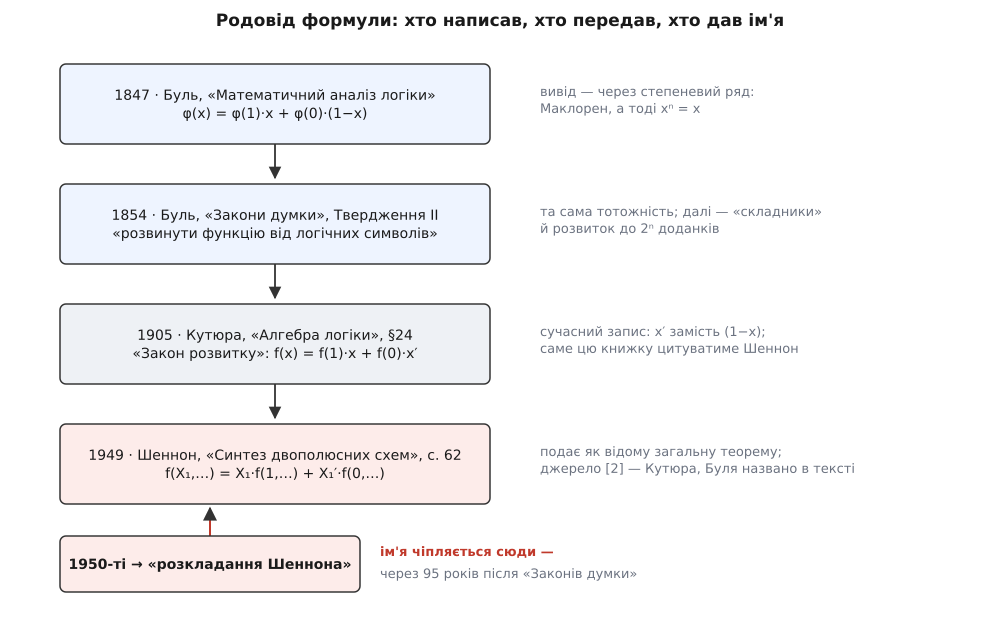
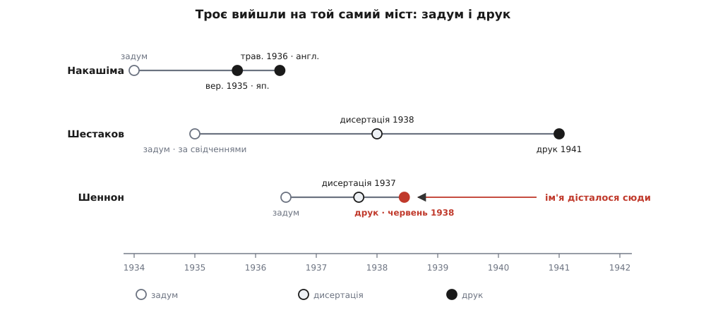

# 📜 Як формула 1854 року дочекалася свого імені

<preknowlist>
- [Булева алгебра](book:math/boolean-algebra) — двозначні змінні, операції «і» (·), «або» (+), заперечення. Головне тут — закон x·x = x, на якому тримається весь Булів вивід, і те, що заперечення можна писати двояко: рискою згори, як x′, або як арифметичну різницю (1 − x).
- [Ряд Тейлора й Маклорена](book:math/taylor-series) — розклад функції в нескінченну суму степенів; ряд Маклорена — це розклад навколо нуля, φ(x) = φ(0) + φ′(0)·x + φ″(0)·x²/2! + … Без нього не видно ні звідки Буль узяв свою формулу, ні чому вона досі зветься «розкладанням».
</preknowlist>

Ім'я цієї тотожності — помилка, і про це знають усі, кого вона стосується. Підручники з логічного синтезу пишуть «розкладання Шеннона», а сумлінніші з них тут-таки, у виносці, додають, що формула Булева. І ніхто нічого не виправляє.

Це не змова й не недбальство. Просто ім'я в техніці записує зовсім не те, що ми думаємо, ніби воно записує. А найкоротший спосіб це побачити — простежити, як воно приставало: шлях від формули до її назви пройшов крізь нескінченний ряд, рецензію на чужу книжку, телефонну станцію й три країни, які одна про одну не знали.

## Ряд, що обірвався на другому доданку

Почнімо з того, як Буль до неї дійшов, — бо це найменш очевидна частина історії.

Сучасний читач бачить у формулі розгалуження: «якщо x — одне, інакше друге». Буль такого не бачив і бачити не міг: до перемикачів лишалося дев'яносто років, а до самої думки, що логіка може щось перемикати, — шістдесят. Він будував [алгебру логіки](book:math/boolean-algebra) за зразком звичайної алгебри величин — тієї, де є степені, похідні й нескінченні ряди. І коли знадобилося виразити довільну функцію через її значення, він потягнувся до інструмента, що лежав найближче до руки: до **ряду Маклорена** (за іменем шотландця Коліна Маклорена, *Colin Maclaurin*, 1698–1746) — розкладу функції в нескінченну суму степенів навколо нуля. Того самого, що його сьогодні вчать [у курсі аналізу](book:math/taylor-series).

Ось вивід, з якого все пішло:

```
φ(x) = φ(0) + φ′(0)·x + φ″(0)·x²/2! + φ‴(0)·x³/3! + …     ряд Маклорена

x·x = x  ⇒  x² = x,  x³ = x·x² = x·x = x,  …,  xⁿ = x     закон Буля

φ(x) = φ(0) + [φ′(0) + φ″(0)/2! + φ‴(0)/3! + …]·x         усі степені злилися в один x

φ(1) = φ(0) + [φ′(0) + φ″(0)/2! + φ‴(0)/3! + …]           підставмо x = 1
  ⇒   [ … ] = φ(1) − φ(0)                                 дужка виявилася різницею двох значень

φ(x) = φ(0) + (φ(1) − φ(0))·x
     = φ(1)·x + φ(0)·(1 − x)
```

Придивіться, що сталося на третьому рядку. Нескінченний хвіст ряду — усі похідні, усі факторіали, уся машинерія аналізу — **склеївся в один доданок**, бо кожен степінь x дорівнює просто x. А тоді з'ясувалося, що й сама дужка, у яку все це збіглося, ні до чого: вона дорівнює всього-на-всього різниці двох значень функції. Ряд, здатний нести нескінченно багато відомостей, у цій алгебрі несе рівно два числа — бо більше й нема чого нести. Функція від двозначної змінної не має що сказати, крім «ось я при нулі» й «ось я при одиниці».

Заперечення Буль писав як (1 − x), а не рискою згори: у нього це була справжня арифметична різниця. Тож останній рядок — буквально та сама формула, яку сьогодні пишуть як x·f₁ + x̄·f₀, лише іншим пером.

> 🔧 **Навіщо це.** Отут схована відповідь на питання, чому операція зветься саме «розкладанням» (англ. *expansion* — «розгортання»), а коефіцієнти при змінній — «кофакторами», тобто співмножниками. Обидва слова — **скам'янілості**: вони прийшли зі світу рядів і многочленів, який Буль наслідував. Сьогодні тотожність доводять двома підстановками, і жодного ряду там нема — але назва лишилася від виводу, якого вже ніхто не робить. Це перший натяк на те, як узагалі поводяться імена в математиці: вони чіпляються до речі в один конкретний момент і далі живуть окремим життям, не звітуючи про зміни.

## Що Буль нею робив

Є ще одна причина не впізнати формулу: Буль уживав її не для того, для чого вживаємо ми.

Він розв'язував **рівняння логіки**. Задача звучала так: дано зв'язок між класами («усі люди смертні», «жоден метал не газ») — виразити з нього невідомий клас через відомі, рівно так, як в алгебрі виражають x через a і b. Розкладання було **обчислювальним ходом** усередині цієї процедури: щоб дати раду виразові, його спершу розвивали — розганяли на суму по всіх комбінаціях змінних, — а тоді дивилися на коефіцієнти. Самі комбінації Буль називав **складниками** (*constituents*), а коефіцієнти при них — **модулями** (*moduli*).

У «Дослідженні законів думки» (*An Investigation of the Laws of Thought*, 1854) це Твердження II: «розвинути функцію, що містить будь-яке число логічних символів». Твердження, а не теорема з іменем; крок процедури, а не самостійна ідея. І що показово — формула була в нього вже сім років на той час: тоненький «Математичний аналіз логіки» (*The Mathematical Analysis of Logic*, 1847) містить її в тому самому вигляді, φ(x) = φ(1)·x + φ(0)·(1 − x), для «виборчих символів» (*elective symbols*), як Буль тоді називав змінні.

Тобто навіть усередині Булевого доробку формула не мала статусу події. Вона була робочим інструментом — а робочий інструмент імені не потребує. Хто ж він був такий, цей чоловік, і як син бідного лінкольнського шевця дійшов до законів думки, — [окрема історія](book:math/boolean-algebra/hist-boole.md); нам тут важить лише те, що помер він 1864 року — за сімдесят три роки до того, як його формулу вперше приклали до заліза.


*Сто років і чотири друки. Буль виводить формулу з ряду й друкує двічі — 1847-го й 1854-го, обидва рази із запереченням як (1 − x). Кутюра 1905-го переписує її в теперішньому вигляді, через x′, і доводить двома підстановками замість ряду. Шеннон 1949-го подає її як відому загальну теорему й посилається саме на книжку Кутюра, а Буля називає у вступі. Ім'я «розкладання Шеннона» чіпляється до нижнього рядка — уже в 1950-х, коли з логічного синтезу зробилося ремесло.*

Лишається пояснити, чому за ці десятиліття ніхто не спробував прикласти алгебру до заліза. Відповідь коротка: спробували.

## Ебоніт і латунь

1910 року в «Журналі Російського фізико-хімічного товариства» (т. 42, с. 382–387) вийшла рецензія на книжку. Рецензент — **Пауль Еренфест** (*Paul Ehrenfest*, 1880–1933), австрійський фізик із єврейської родини, що походила з моравських Лоштиць; на той час він жив у Петербурзі, куди переїхав 1907-го з дружиною Тетяною Афанасьєвою, математикинею, народженою в Києві. Постійної посади він там не мав і мати не міг: Еренфест відмовлявся вказати віросповідання, а без цього професура була закрита. Через два роки він поїде до Лейдена й стане одним із найближчих друзів Айнштайна.

Рецензував він російський переклад «Алгебри логіки» француза **Луї Кутюра** (*Louis Couturat*), виданий роком раніше в Одесі. І посеред цілком звичайного розбору поставив питання, яке доти нікому не спадало на думку: а чи не існує **алгебри розподільних схем**? Логічні зв'язки, писав він, можна було б дістати втіленими «в ебоніті та латуні» — тобто зібраними з контактів і дроту телефонної станції.

Це 1910 рік. До магістерської роботи Шеннона — двадцять сім років. Ідея висловлена друком, чорним по білому, у фаховому журналі.

І не сталося нічого.

Не тому, що читачі були нетямущі. Просто рецензія — це не теорія. Еренфест **побачив** міст і показав на нього пальцем; збудувати міст — інша робота, на роки, і ніхто її не взяв. Сам Кутюра, схоже, про рецензію так і не дізнався: у виданому листуванні він Еренфеста жодного разу не згадує. Із забуття цей текст витягла аж через десятиліття радянська історикиня логіки Софія Яновська.

> 🔧 **Навіщо це.** Тримайте цей епізод у голові щоразу, коли чуєте «а я цю ідею висловлював ще тоді». Висловити — найдешевша частина роботи. Еренфест мав рацію на всі сто, сформулював думку за двадцять сім років до Шеннона й надрукував її — і не одержав ані імені, ані наслідків, бо не зробив наступного кроку. Історія техніки платить не за здогад, а за доведену до кінця роботу.

## Кутюра: формула набуває сучасного вигляду

Книжка, яку рецензував Еренфест, заслуговує окремої уваги — бо саме вона донесла формулу до XX століття.

Луї Кутюра видав «Алгебру логіки» (*L'Algèbre de la logique*) 1905 року; 1914-го вийшов англійський переклад Лідії Робінсон у видавництві Open Court. Параграф 24 називається «Закон розвитку» (*The Law of Development*) — і там формула вже виглядає точнісінько так, як її пишуть сьогодні:

```
f(x) = f(1)·x + f(0)·x′
```

Дві зміни проти Буля, обидві вирішальні. Перша — **запис**: замість арифметичного (1 − x) стоїть x′, окреме заперечення. Алгебра перестала прикидатися арифметикою.

Друга — **вивід**. Кутюра не чіпає рядів узагалі. Він робить хід, знайомий кожному, хто розв'язував задачі методом невизначених коефіцієнтів: припустімо, що розклад існує й має вигляд a·x + b·x′; підставмо x = 1 — дістанемо a = f(1); підставмо x = 0 — дістанемо b = f(0). Готово. Той самий дворядковий доказ, яким тотожність доводять і зараз.

І тут-таки, не сходячи з параграфа, Кутюра розганяє її на дві змінні й далі:

```
f(x, y) = f(1, y)·x + f(0, y)·x′
        = f(1,1)·xy + f(1,0)·xy′ + f(0,1)·x′y + f(0,0)·x′y′
```

— і зауважує, що результат симетричний щодо обох змінних, а отже, від порядку розкладання не залежить. Усе, що знадобиться інженерові через тридцять років, уже лежить на сторінці 30. Надруковане 1905 року.

Запам'ятайте цю книжку. Вона зараз повернеться.

## Що насправді зробив Шеннон

Тепер найцікавіше — бо тут майже все, що «всі знають», не витримує звірки з джерелом.

Історію про [двадцятиоднорічного студента, який упізнав алгебру Буля в релейній стійці](book:electronics/why-digital/hist-shannon.md), переказано багато разів, і вона правдива. Але вона — не про цю формулу. Магістерська робота 1937 року («Символічний аналіз релейних і перемикальних схем», надрукована 1938-го в *Transactions* AIEE, т. 57, с. 713–723; Премія Альфреда Нобла 1939-го) доводила інше й більше: що [реле](book:electronics/relay) послідовно — це «і», паралельно — «або», а отже, схему можна порахувати на папері.

Саму тотожність із її схемним тлумаченням Шеннон виклав у статті 1949 року «Синтез двополюсних перемикальних схем» (*The Synthesis of Two-Terminal Switching Circuits*, *Bell System Technical Journal*, т. 28, с. 59–98). Ось як це виглядає на сторінці 62. Шеннон пише, що в булевій алгебрі є низка важливих загальних теорем, які справджуються для будь-якої функції, — і що функцію можна розкласти за одним чи кількома її аргументами. Далі — формула, потім розклад за двома змінними, потім двоїста форма через добуток, потім кілька тотожностей із кофакторами.

Прочитайте це ще раз. **«Є низка важливих загальних теорем»** — оце й усе. Жодного «я довів», жодного «пропоную». Людина переказує відоме.

А далі — те, що ставить крапку. У списку джерел статті під номером 2 стоїть: L. Couturat, «The Algebra of Logic», Open Court, 1914. Та сама книжка. Та, де §24 — «Закон розвитку». А в другому абзаці вступу Шеннон прямим текстом пише, що булева алгебра — це галузь математики, яку **першим дослідив Джордж Буль** у зв'язку з вивченням логіки.

Тобто Шеннон зробив рівно те, що робить сумлінний автор: назвав Буля, послався на книжку, у якій формула надрукована, і взяв її як загальновідому. Він не привласнював нічого. Ім'я до нього причепили інші — і вже після того, як він усе це написав.

(У тому ж списку джерел, під номером 8, стоїть А. Накашіма. Це знадобиться за хвилину.)

## Троє на тому самому мосту

Бо Шеннон був не сам, і з іменами там своя арифметика.


*Троє дійшли до зв'язку булевої алгебри з релейними схемами незалежно — і розійшлися не задумом, а друком. Порожнє коло — задум, півтон — дисертація, суцільне — публікація. Накашіма надрукував англійською в травні 1936-го, на два роки раніше за Шеннона. Шестаков задумав своє, за свідченнями колег, 1935-го й захистився одночасно з Шенноном, а надрукував аж 1941-го й лише російською. Ім'я дісталося нижньому рядку — але, як видно зі шкали, не за швидкість.*

Три ряди на цьому рисунку — три різні шляхи до того самого мосту.

**Акіра Накашіма** (*中嶋章*, *Akira Nakashima*), інженер японської NEC, дійшов двозначної алгебри перемикальних схем самотужки, не знаючи Буля. У вересні 1935-го він доповідав про синтез релейних мереж — уже із законами Де Моргана — на засіданні Товариства телеграфу й телефону в Токіо; доповідь надрукували японською, а в травні 1936-го — англійською, у журналі *Nippon Electrical Communication Engineering*. Тобто робота була друком, англійською, за два роки до Шеннона.

**Віктор Шестаков** (1907–1987), росіянин, випускник Московського університету, за свідченнями радянських логіків — Софії Яновської, Гааз-Рапопорта, Успенського й інших — дійшов тієї самої думки 1935 року. Дисертацію захистив 1938-го, того ж року, що й Шеннон. А надрукував — аж 1941-го, російською. Тут варто бути точним щодо доказовості: **публікація 1941 року — документований факт, а дата задуму (1935) спирається на пізніші свідчення колег, а не на датовані документи того часу.** Це не робить свідчення хибними, але й не робить претензію на першість доведеною; статус — **непідтверджено**.

**Клод Шеннон** задумав своє влітку 1936-го, захистився 1937-го, а надрукував у червні 1938-го — англійською, у виданні американських електроінженерів, на літній конференції у Вашингтоні.

Тепер порівняйте не дати задуму, а дати **друку**. Накашіма — травень 1936-го, англійською. Шеннон — червень 1938-го, англійською. Накашіма встиг на два роки раніше й тією самою мовою — а ім'я дісталося Шеннонові.

Чому? Не через мову й не через час. Через **рівень абстракції**. Накашіма лишався всередині наявної теорії кіл і будував алгебру як надбудову над нею; Шеннон викинув кола геть і писав чисту двозначну алгебру, для якої схеми — лише одне з тлумачень. Друге стає підручником, перше — статтею для фахівців із релейних станцій. І ще одна деталь, що не лишає місця для теорії змови: Шеннон таки знав про Накашіму — той-таки номер 8 у списку джерел 1949 року. Він на нього послався. Ім'я все одно лишилося за Шенноном.

Ось найтверезіший висновок усієї цієї історії: ім'я дає не першість друку й не мова, а те, чи стала твоя версія тією, з якої зручно вчити.

## Чому ім'я пристає не до першого

У цієї закономірності є назва — і вона сама є своїм прикладом.

1980 року статистик **Стівен Стіглер** (*Stephen Stigler*) сформулював **закон епонімії Стіглера**: жодне наукове відкриття не називають іменем його справжнього першовідкривача. Жарт у тому, що Стіглер тут-таки приписав авторство закону не собі, а соціологові **Роберту Мертону** (*Robert K. Merton*), який описав цю картину ще 1957 року в праці про пріоритети в науці. Отже, закон Стіглера підпорядковується законові Стіглера — і надрукував його Стіглер саме в збірнику на честь Мертона, щоб це було видно неозброєним оком.

Список жертв довгий і впізнаваний: теорема Піфагора, комета Галлея, число Авогадро, сила Коріоліса, діаграми Венна. «Розкладання Шеннона» — просто ще один рядок у ньому.

Але Мертонове пояснення важливіше за сам жарт, і воно не про несправедливість. Ім'я в науці — не запис у реєстрі пріоритетів. Це **ярлик на ручці інструмента**, і чіпляє його не автор, а спільнота — тоді, коли інструмент їй знадобився, і за тим, від кого вона його одержала. Логічний синтез як ремесло почався не з Буля й не з Кутюра, а з релейних схем 1940-х. Люди, яким формула вперше знадобилася щодня, взяли її з рук Шеннона — бо саме він поклав її поруч із залізом. І назвали тим іменем, під яким вона до них прийшла.

Це не помилка пам'яті. Це чесний запис — просто не про те, про що ми думаємо: не «хто це вигадав», а «від кого ми це дістали».

Формула 1854 року чекала на ім'я не тому, що була недооцінена, а тому, що імена дають лише тим речам, які комусь потрібні **щодня**. Дев'яносто років вона не була потрібна нікому.

## Хто нарешті сказав уголос

Точний момент, коли назва застигла, простежити не вдається — і це саме собою характерно: імена ніхто не проголошує, вони просто одного дня виявляються загальновживаними. До 1960-х «розкладання Шеннона» вже стоїть у літературі з логічного синтезу як звичайний термін, що не потребує пояснень.

Заперечувати почали пізно й неголосно. 1995 року Марек Перковський і Станіслав Григель у своєму огляді літератури з декомпозиції функцій пишуть про 1854 рік прямим текстом: Буль увів у своїй книжці розклад, який згодом хибно приписали Шеннонові, — і додають, що це «THE most fundamental formula of Boolean logic». 2012 року те саме констатує Френк Маркем Браун у «Boolean Reasoning» (с. 42). Статус питання — **усталено**: першість Булева, помилка атрибуції визнана фахівцями, наукової суперечки тут немає.

І назва не змінилася ні на йоту.

Що, як подумати, цілком розумно. Перейменувати тотожність на «Булеву» означало б виправити один запис і зіпсувати другий: ми перестали б чути, що між формулою і [її роботою в кремнії](book:electronics/multiplexer) лежить сто років і зовсім інші люди. Найчесніше — знати обидва факти й не плутати їх.

Буль вивів формулу, обриваючи ряд, якого в ній не було. Кутюра переписав її так, щоб її можна було читати. Еренфест показав пальцем на міст. Накашіма й Шестаков вийшли на той міст своїми стежками. Шеннон переклав формулу на залізо — і ремесло, що з цього виросло, назвало її його іменем, бо іншого імені на ній не бачило.

Ім'я на інструменті — це не підпис майстра. Це адреса крамниці, де ви його взяли.
